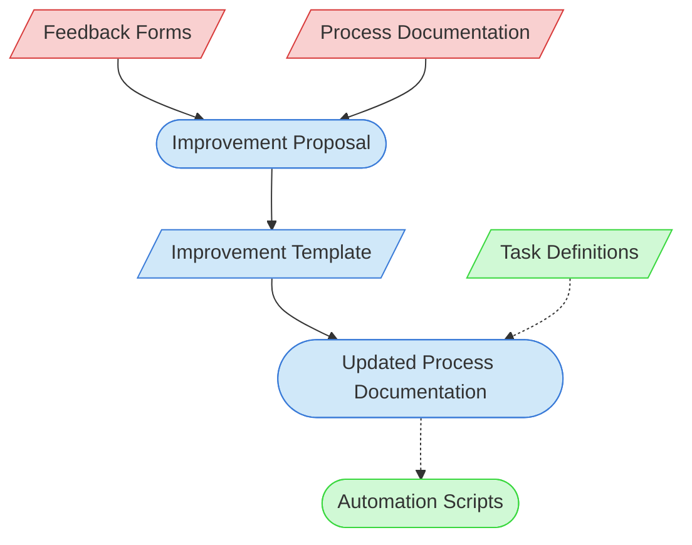

# Process Improvement Context Map

This context map provides a visual guide to the components and relationships relevant to the Process Improvement task. Use this map to identify which components require attention and how they interact.

## Visual Component Diagram

## Essential Components

### Critical Components (Must Understand)
- **Feedback Forms**: Collected feedback on tools, processes, and documentation
- **Process Documentation**: Current process documentation being improved

### Important Components (Should Understand)
- **Improvement Proposal**: Structured proposal for process improvement
- **Improvement Template**: Template for standardizing improvement documentation
- **Updated Process Documentation**: Revised documentation with improvements

### Reference Components (Access When Needed)
- **Task Definitions**: Documentation of tasks that may be affected by improvements
- **Automation Scripts**: Scripts that may need updates based on process changes

## Key Relationships

1. **Feedback Forms → Improvement Proposal**: Feedback informs the improvement proposal
2. **Process Documentation → Improvement Proposal**: Current processes inform improvement opportunities
3. **Improvement Proposal → Improvement Template**: The proposal uses the template for structure
4. **Improvement Template → Updated Process Documentation**: The template guides documentation updates
5. **Task Definitions -.-> Updated Process Documentation**: Task definitions may need updates based on changes
6. **Updated Process Documentation -.-> Automation Scripts**: Process changes may require automation updates

## Implementation in AI Sessions

1. Begin by analyzing Feedback Forms to identify improvement opportunities
2. Review current Process Documentation to understand existing processes
3. Create an Improvement Proposal using the standardized template
4. Update Process Documentation with the proposed improvements
5. Review Task Definitions to identify any necessary updates
6. Update Automation Scripts if process changes affect automation

## Related Documentation

- [Feedback Form Collection](/doc/process-framework/feedback/feedback-forms/) - Repository of feedback forms
- [Process Documentation Index](/doc/process-framework/README.md) - Index of process documentation
- <!-- [Improvement Proposal Template](/doc/process-framework/templates/improvement-proposal-template.md) - Template/example link commented out --> - Template for improvement proposals
- [Task Definition Directory](/doc/process-framework/tasks/) - Directory of task definitions
- [Automation Scripts](/scripts/) - Process automation scripts
- [Component Relationship Index](/doc/product-docs/technical/architecture/component-relationship-index.md) - Complete reference of component relationships

---

*Note: This context map highlights only the components relevant to process improvement. For a comprehensive view of all components, refer to the [Component Relationship Index](/doc/product-docs/technical/architecture/component-relationship-index.md).*
