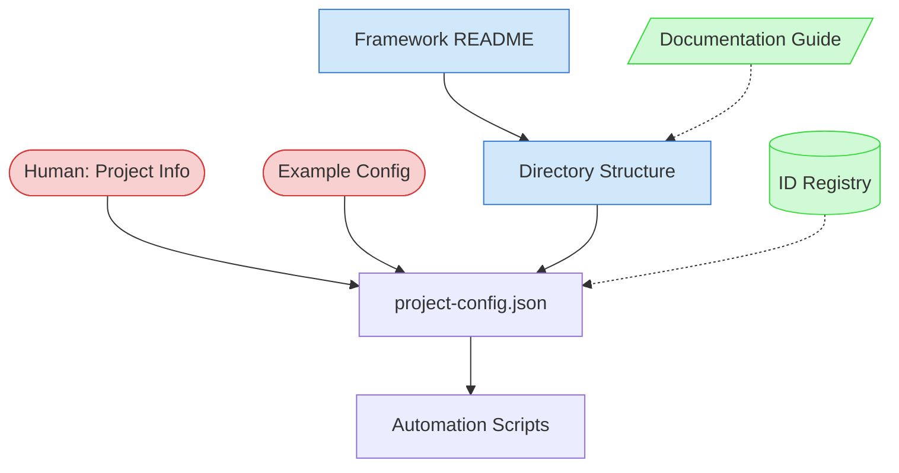

# Project Initiation Context Map

This context map provides a visual guide to the components and relationships relevant to the Project Initiation task. Use this map to identify which information sources and configuration files are needed to successfully create a project-config.json file.

## Visual Component Diagram

## Essential Components

### Critical Components (Must Understand)
- **Human-Provided Project Information**: Project name, display name, description, root directory path, repository URL - foundation for all configuration values
- **Example project-config.json**: Reference template (doc/process-framework/project-config.json) showing required structure, fields, and data types

### Important Components (Should Understand)
- **Process Framework README**: Overview of framework directory structure and organization patterns
- **Directory Structure**: Actual project folders (doc, src, tests, scripts) that need to be mapped in configuration paths

### Reference Components (Access When Needed)
- **ID Registry**: Document ID prefixes and directory mappings - useful for understanding path conventions
- **Documentation Structure Guide**: Recommended directory organization patterns for more complex project setups

## Key Relationships

1. **Human Project Info → project-config.json**: Direct input - human provides all project-specific values that populate the configuration file
2. **Example Config → project-config.json**: Template structure - defines required schema, sections, and field organization
3. **Directory Structure → project-config.json**: Path mappings - configuration's `paths` section must accurately reflect actual project directories
4. **project-config.json → Automation Scripts**: Dependency - scripts read this file for project-specific paths and metadata

## Implementation in AI Sessions

1. Begin by collecting project information from human partner (name, description, paths, repository)
2. Read the example project-config.json to understand required structure and fields
3. Examine actual project directory structure to determine correct path mappings
4. Create project-config.json with all sections populated using collected information
5. Validate JSON syntax and verify paths correspond to actual directories
6. Optionally reference ID Registry or Documentation Guide for advanced path configurations

## Related Documentation

- [Example project-config.json](/doc/process-framework/project-config.json) - Reference template with complete structure
- [Process Framework README](/doc/process-framework/README.md) - Framework overview and directory organization
- [ID Registry](/doc/id-registry.json) - Document ID prefixes and directory mappings
- [Documentation Structure Guide](/doc/process-framework/guides/guides/documentation-structure-guide.md) - Directory organization patterns
- [Framework Domain Adaptation](/doc/process-framework/tasks/support/framework-domain-adaptation.md) - Comprehensive framework customization

---

*Note: This context map highlights only the components relevant to the Project Initiation task. Use this as a focused guide to creating project-config.json for new projects.*
