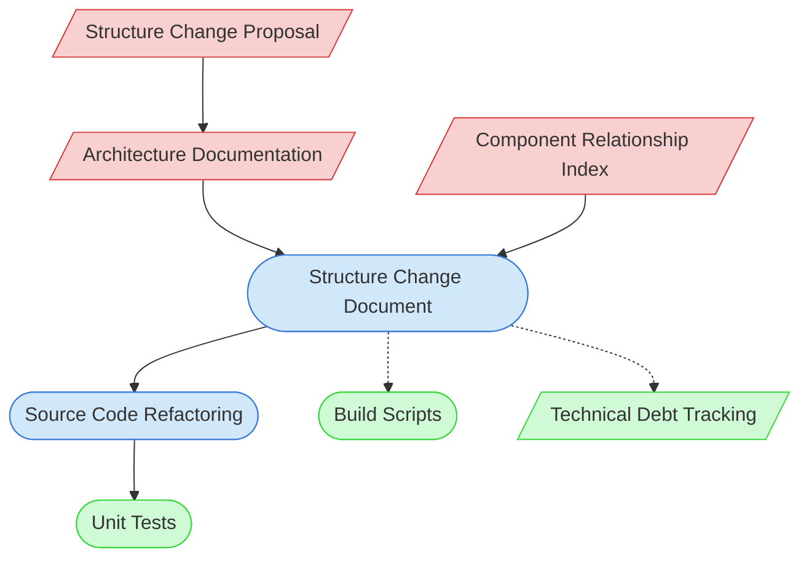

# Structure Change Context Map

This context map provides a visual guide to the components and relationships relevant to the Structure Change task. Use this map to identify which components require attention and how they interact.

## Visual Component Diagram

## Essential Components

### Critical Components (Must Understand)
- **Structure Change Proposal**: Proposal detailing the need and approach for structural changes
- **Architecture Documentation**: Current architectural documentation
- **Component Relationship Index**: Documentation of how components interact within the system

### Important Components (Should Understand)
- **Structure Change Document**: Detailed plan for implementing structural changes
- **Source Code Refactoring**: Code changes needed to implement the structure change

### Reference Components (Access When Needed)
- **Unit Tests**: Tests that need updating due to structural changes
- **Build Scripts**: Build configuration that may need updating
- **Technical Debt Tracking**: Documentation of technical debt related to structure

## Key Relationships

1. **Change Proposal → Architecture Doc**: The proposal references current architecture
2. **Architecture Doc → Structure Change Doc**: Current architecture informs change planning
3. **Component Index → Structure Change Doc**: Component relationships inform structural dependencies
4. **Structure Change Doc → Source Code Refactoring**: The plan guides code refactoring
5. **Source Code Refactoring → Unit Tests**: Code changes require test updates
6. **Structure Change Doc -.-> Build Scripts**: Structural changes may require build script updates
7. **Structure Change Doc -.-> Technical Debt Tracking**: Changes may address or create technical debt

## Implementation in AI Sessions

1. Begin by examining the Structure Change Proposal to understand objectives
2. Review Architecture Documentation to understand current structure
3. Consult Component Relationship Index to identify dependencies
4. Create a detailed Structure Change Document with implementation plan
5. Implement Source Code Refactoring according to the plan
6. Update Unit Tests to reflect structural changes
7. Update Build Scripts if necessary
8. Update Technical Debt Tracking with resolved or new items

## Related Documentation

- [Structure Change Proposal Template](/doc/process-framework/templates/templates/structure-change-proposal-template.md) - Template for change proposals
- [Architecture Documentation](/doc/product-docs/technical/architecture) - Current architecture documentation
- [Component Relationship Index](/doc/product-docs/technical/architecture/component-relationship-index.md) - Component relationship documentation
- <!-- [Refactoring Guide](/doc/product-docs/development/guides/refactoring-guide.md) - File not found --> - Guide for code refactoring
- <!-- [Unit Testing Guide](/doc/product-docs/development/guides/unit-testing-guide.md) - File not found --> - Guide for unit testing
- <!-- [Build Configuration](/doc/product-docs/technical/build/build-configuration.md) - File not found --> - Build system documentation
- [Technical Debt Tracking](../../../state-tracking/permanent/technical-debt-tracking.md) - Technical debt status

---

*Note: This context map highlights only the components relevant to structure changes. For a comprehensive view of all components, refer to the [Component Relationship Index](/doc/product-docs/technical/architecture/component-relationship-index.md).*
