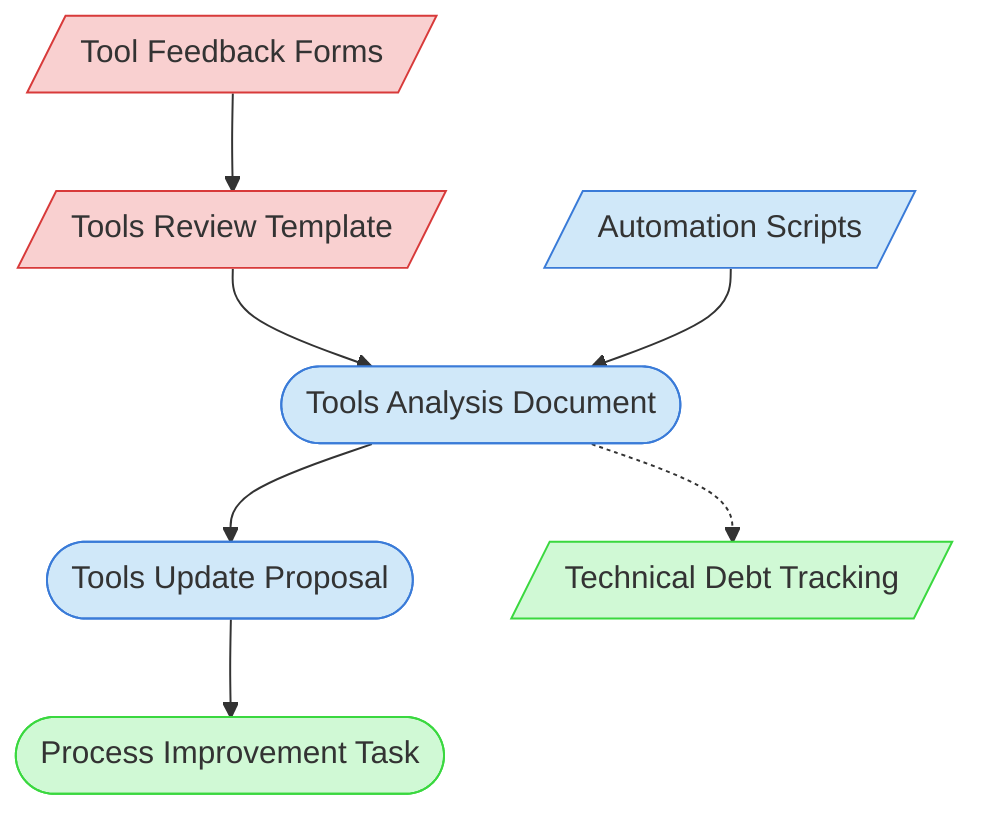

# Tools Review Context Map

This context map provides a visual guide to the components and relationships relevant to the Tools Review task. Use this map to identify which components require attention and how they interact.

## Visual Component Diagram

## Essential Components

### Critical Components (Must Understand)
- **Tool Feedback Forms**: Collected feedback on tool effectiveness
- **Tools Review Template**: Standardized template for reviewing tools

### Important Components (Should Understand)
- **Automation Scripts**: Scripts and tools being reviewed
- **Tools Analysis Document**: Analysis of tool effectiveness based on feedback
- **Tools Update Proposal**: Proposed changes to tools based on analysis

### Reference Components (Access When Needed)
- **Process Improvement Task**: Task for implementing tool improvements
- **Technical Debt Tracking**: Documentation of technical debt related to tools

## Key Relationships

1. **Feedback Forms → Review Template**: Feedback informs the review process
2. **Review Template → Tools Analysis**: Template structures the analysis
3. **Automation Scripts → Tools Analysis**: Scripts are analyzed for effectiveness
4. **Tools Analysis → Tools Update Proposal**: Analysis drives proposed improvements
5. **Tools Update Proposal → Process Improvement Task**: Proposals feed into improvement tasks
6. **Tools Analysis -.-> Technical Debt Tracking**: Tool issues may be tracked as technical debt

## Implementation in AI Sessions

1. Begin by examining Tool Feedback Forms to understand pain points
2. Use the Tools Review Template to structure the review
3. Analyze Automation Scripts to assess effectiveness
4. Create a Tools Analysis Document with findings
5. Develop a Tools Update Proposal with specific improvements
6. Link to a Process Improvement Task for implementation
7. Update Technical Debt Tracking with tool-related debt items

## Related Documentation

- [Tool Feedback Forms](/doc/process-framework/feedback/feedback-forms/) - Repository of tool feedback
- <!-- [Tools Review Template](/doc/process-framework/templates/tools-review-template.md) - Template/example link commented out --> - Template for tools review
- [Automation Scripts](/scripts/) - Project automation scripts
- [Process Improvement Task](/doc/process-framework/tasks/support/process-improvement-task.md) - Task for implementing improvements
- [Technical Debt Tracking](../../../state-tracking/permanent/technical-debt-tracking.md) - Technical debt status
- [Component Relationship Index](/doc/product-docs/technical/architecture/component-relationship-index.md) - Complete reference of component relationships

---

*Note: This context map highlights only the components relevant to tools review. For a comprehensive view of all components, refer to the [Component Relationship Index](/doc/product-docs/technical/architecture/component-relationship-index.md).*
