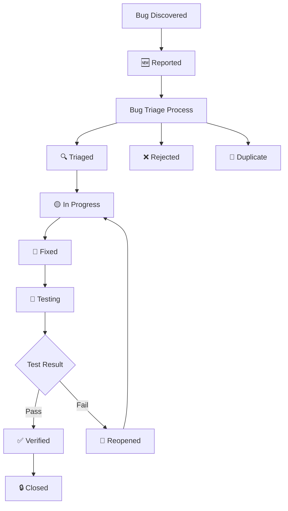

# Bug Tracking

This document tracks the lifecycle of bugs and issues in the LinkWatcher project, providing a systematic approach to bug identification, triage, resolution, and verification.

<strong>📋 Table of Contents</strong>

- [Status Legends](#status-legends)
  - [Bug Status](#bug-status)
  - [Priority Levels](#priority-levels)
  - [Scope Levels](#scope-levels)
  - [Source Types](#source-types)
- [Bug Management Workflow](#bug-management-workflow)
- [Bug Registry](#bug-registry)
  - [Critical Bugs](#critical-bugs)
  - [High Priority Bugs](#high-priority-bugs)
  - [Medium Priority Bugs](#medium-priority-bugs)
  - [Low Priority Bugs](#low-priority-bugs)
- [Closed Bugs](#closed-bugs)
- [Bug Statistics](#bug-statistics)

## Status Legends

### Bug Status

| Symbol | Status      | Description                                           |
| ------ | ----------- | ----------------------------------------------------- |
| 🆕     | Reported    | Bug has been reported but not yet triaged             |
| 🔍     | Triaged     | Bug has been evaluated and prioritized                |
| 🟡     | In Progress | Bug is currently being investigated or fixed          |
| 🧪     | Fixed       | Bug fix has been implemented and is ready for testing |
| ✅     | Verified    | Bug fix has been tested and confirmed working         |
| 🔒     | Closed      | Bug has been resolved and closed                      |
| 🔄     | Reopened    | Previously closed bug has been reopened               |
| ❌     | Rejected    | Bug report was determined to be invalid or not a bug  |
| 🚫     | Duplicate   | Bug is a duplicate of another existing bug            |

### Priority Levels

| Priority | Description                                 | Response Time     |
| -------- | ------------------------------------------- | ----------------- |
| P1       | Critical - System breaking, security issues | Immediate         |
| P2       | High - Major functionality affected         | Within 24 hours   |
| P3       | Medium - Minor functionality affected       | Within 1 week     |
| P4       | Low - Cosmetic or enhancement requests      | When time permits |

### Scope Levels

| Scope | Description                                                      |
| ----- | ---------------------------------------------------------------- |
| S     | Small — single-session fix, no state file needed                 |
| M     | Medium — may span sessions, state file recommended               |
| L     | Large — multi-session, state file required (New-BugFixState.ps1) |

### Source Types

| Source                 | Description                              |
| ---------------------- | ---------------------------------------- |
| Testing                | Discovered during test execution         |
| Test Development       | Found during test implementation         |
| Test Audit             | Discovered during test audit process     |
| E2E Testing            | Discovered during E2E acceptance testing |
| User Report            | Reported by end users                    |
| Code Review            | Found during code review process         |
| Feature Development    | Found during feature implementation      |
| Foundation Development | Found during foundational feature work   |
| Code Refactoring       | Discovered during refactoring activities |
| Deployment             | Found during release deployment          |
| Monitoring             | Detected by system monitoring            |
| Development            | Found during general development work    |

## Bug Management Workflow

## Bug Registry

### Critical Bugs

| ID | Title | Status | Priority | Scope | Reported | Description | Related Feature | Notes |
| --- | --- | --- | --- | --- | --- | --- | --- | --- |
| _No critical bugs currently reported_ |

### High Priority Bugs

| ID | Title | Status | Priority | Scope | Reported | Description | Related Feature | Notes |
| --- | --- | --- | --- | --- | --- | --- | --- | --- |
| _No high priority bugs currently active_ |

### Medium Priority Bugs

| ID | Title | Status | Priority | Scope | Reported | Description | Related Feature | Notes |
| --- | --- | --- | --- | --- | --- | --- | --- | --- |
| PD-BUG-050 | Directory move fails to update cross-references when source files are within moved directory | 🟡 InProgress | P3 | M | 2026-03-23 | When a directory is moved, _handle_directory_moved processes each file via process_directory_file_move(). References found in other moved files use OLD source paths still in the DB. The updater tries to write files at OLD paths, causing Errno 2 errors. Files outside the moved directory update correctly. Fix: update DB source paths before cross-reference processing. | 1.1.1 | Source: E2ETesting; Environment: Development; Component: handler.py (_handle_directory_moved); Triaged: 2026-03-23 — Impact Medium × Frequency Medium → P3. Root cause: _handle_directory_moved (line 308) processes each moved file's cross-references using stale OLD source paths in the DB. Files outside the moved directory update correctly; files within fail with Errno 2. Fix: update DB source_file entries for all moved files to new paths before Phase 1 cross-reference processing. Related: PD-BUG-019 (timer), PD-BUG-039 (outward links) — different root causes. Effort: ~2-4h. Existing test TE-E2E-014 does not cover this scenario.; Updated: 2026-03-23 |  |
| _No medium priority bugs currently active_ |

### Low Priority Bugs

| ID | Title | Status | Priority | Scope | Reported | Description | Related Feature | Notes |
| --- | --- | --- | --- | --- | --- | --- | --- | --- |
| _No low priority bugs currently active_ |
| _No low priority bugs currently active_ |

## Closed Bugs

<strong>View Closed Bugs History</strong>

| ID | Title | Status | Priority | Scope | Reported | Description | Related Feature | Notes |
| --- | --- | --- | --- | --- | --- | --- | --- | --- |
| PD-BUG-049 | Updater tries to update moved file at old path during move processing | ❌ Rejected | P4 | Low | 2026-03-23 | During file move, updater tried to write to the moved file at its old path, causing `file_update_failed`. The internal link (`Import-Module` with hardcoded relative path) wasn't updated by LinkWatcher because the path was a fragment inside a `Join-Path` expression — a known parser limitation, not a bug. | 2.2.1 Link Updating | Rejected: 2026-03-23 — Not a LinkWatcher bug. The script used a hardcoded `Join-Path -Path (Split-Path -Parent $PSScriptRoot) -ChildPath "scripts/..."` pattern that breaks on move. Fix: adopted the walk-up resolution pattern already used by other validation scripts (Validate-AuditReport.ps1). Script-level fix applied. |
| PD-BUG-046 | File moves not detected for non-monitored extensions even when referenced by monitored files | 🔒 Closed | P3 | S | 2026-03-18 | Non-monitored extensions (.conf, .sql, .txt etc.) invisible to move detection even when referenced by monitored files. | 1.1.1, 2.2.1 | Fixed: 2026-03-18. Root cause: `_should_monitor_file()` filter in on_deleted/on_created/on_moved blocked events for non-monitored extensions. Fix: Added `_is_known_reference_target()` fallback using fast basename check against DB keys. Also added `has_pending` check in on_created for move correlation. Files changed: handler.py. Tests added: 3 regression tests in test_move_detection.py. Verified: unit tests pass (476/477), E2E TE-E2E-005 confirmed fix works. |
| PD-BUG-044 | E2E test reference resolution fails for nested project structures | ❌ Rejected | P3 | M | 2026-03-18 | Compound bug report covering multiple distinct issues discovered during WF-001 E2E testing. | 2.1.1, 2.2.1 | Rejected: 2026-03-18 — Compound report split into specific bugs. Real bugs: PD-BUG-045 (Python import resolution), PD-BUG-046 (non-monitored extension move detection). Other sub-issues were test fixture design problems (fabricated paths in PS fixtures) or test infrastructure issues (Verify script CRLF/LF sensitivity). JSON reference resolution (TE-E2E-006) confirmed working after re-test with proper timing. |
| PD-BUG-036 | Relative paths with ../ not found during file move reference lookup | ❌ Rejected | P2 | M | 2026-03-15 | get_path_variations() searches using project-relative paths, but the markdown parser stores link targets as-is (e.g. ../../guides/guides/file.md). These relative paths never match any search variation, so references using ../ are silently missed during moves. | 2.1.1 / 2.2.1 | Source: Development; Environment: Development; Component: reference_lookup; Rejected: 2026-03-16 — Not a bug. database.py _reference_points_to_file() already resolves relative paths by joining ref_dir + target and comparing to the search path. Observed "missed updates" during visual-notation-guide.md move were caused by pre-existing broken links in 4 context maps: links used ../../ (2 levels up) but needed ../../../ (3 levels up) to reach doc/process-framework/guides/ from visualization/context-maps/00-onboarding/. The links never pointed to the correct file. No code fix needed. |
| PD-BUG-034 | Stale detection fails for absolute-style paths with leading slash | ❌ Rejected | P3 | S | 2026-03-15 | When a file is moved, references using absolute-style paths (/doc/...) are found during lookup but not updated. The stale detection in updater.py compares the normalized ref.link_target (without leading /) against the original line content (with leading /), causing a false-positive stale detection. Found 17 references but only updated 10 during development-guide.md move. | 2.2.1 | Source: Development; Environment: Development; Component: updater; Rejected: 2026-03-15 — Not a bug. Path resolver correctly handles leading-slash paths (path_resolver.py lines 62-68). Regression test confirmed the scenario works. Actual cause: files were edited by AI agent shortly before the move; LinkWatcher had not yet re-scanned to pick up the new/changed references in those files. No code fix needed. |
| PD-BUG-029 | PowerShell path resolver resolves paths relative to script location instead of project root | ❌ Rejected | P3 | S | 2026-03-15 | PathResolver resolves PS1 quoted-string paths relative to the script file directory, not the project root. PS1 scripts use Get-ProjectRoot + Join-Path with ../doc/... paths that are runtime-relative to project root. | 2.1.1 | Rejected: 2026-03-15. The ../doc/... paths in PS1 scripts were incorrect (likely legacy from PD-BUG-022 era when Get-ProjectRoot returned wrong root). The scripts need to be fixed to use correct paths, not LinkWatcher. Not a LinkWatcher bug. |
| PD-BUG-028 | update_links_within_moved_file incorrectly updates non-path strings containing filenames | 🔒 Closed | P3 | S | 2026-03-13 | When a file is moved to a subdirectory, update_links_within_moved_file prepends ../ to any detected filename inside the file, even if it is embedded in a non-path string. Example: the string Hello from move-target-2.ps1 becomes ../Hello from move-target-2.ps1. Root cause: the parser detects bare filenames in strings, and the updater replaces them without validating they are standalone path references. File: linkwatcher/utils.py looks_like_file_path(). Feature: 2.1.1. | 2.1.1 Link Parsing System | Source: Testing; Environment: Development; Component: utils; Triage: P3, S scope; Fix: Added prose-detection heuristic to looks_like_file_path() — rejects path segments with 3+ space-separated words starting with uppercase (sentence pattern). Root Cause: looks_like_file_path() returned True on common extension match without validating path structure; Tests Added: Yes (6 regression tests); Verification: Fix verified: 6 regression tests pass, full suite 417/417 pass (5 skipped, 7 xfailed). No regressions. Files changed: linkwatcher/utils.py, test/automated/parsers/test_generic.py. Closed: 2026-03-13. |
| PD-BUG-022 | Get-ProjectRoot finds project-config.json in doc/process-framework/ and returns wrong project root | 🔒 Closed | P2 | | 2026-02-27 | `Get-ProjectRoot` checked for `project-config.json` as a marker. Since it exists in `doc/product-docs`, it returned wrong root, causing doubled paths. All `New-StandardProjectDocument` scripts failed. | 5.1.1 CI/CD & Development Tooling | Source: Development; Root cause: `project-config.json` used as directory marker but lives inside subdirectory. Fix: read `project.root_directory` field from the config. Verified: New-FeedbackForm.ps1 -WhatIf resolves correct path. Files changed: Core.psm1. Closed: 2026-02-27. |
| PD-BUG-023 | New-BugReport.ps1 fails to add entry to bug-tracking.md | 🔒 Closed | P2 | | 2026-02-27 | Script increments ID counter but does not add entry to bug-tracking table. Root causes: High priority placeholder mismatch, missing fallback for empty tables, SourceMap key mismatch with ValidateSet. | 5.1.1 CI/CD & Development Tooling | Source: Development; Fixed via IMP-055: corrected placeholder text, added header-separator fallback, fixed SourceMap keys. Closed: 2026-02-27. |
| PD-BUG-020 | Single file move triggers full project directory scan via missing trailing slash in _get_files_under_directory | 🔒 Closed | P2 | | 2026-02-27 | When a single file is moved on Windows (delete+create), `on_deleted` calls `_get_files_under_directory()` with the file path. The function builds `dir_prefix` by appending "/" BEFORE `normalize_path()`, but `os.path.normpath()` strips it. The file matches itself via `startswith()`, cascading into treating the project root as dest and walking all 657+ files. | 1.1.1 File System Monitoring | Source: Development; Root cause: `normalize_path(dir_path + "/")` — trailing "/" consumed by `os.path.normpath`. Fix: Changed to `normalize_path(dir_path) + "/"` (slash AFTER normalize). Tests: 3 regression tests, 21/21 pass. Files changed: handler.py. Introduced by: PD-BUG-019 fix. Closed: 2026-02-27. |
| PD-BUG-019 | Directory moves result in partial link updates due to per-file timeout expiration | 🔒 Closed | P2 | | 2026-02-26 | When a directory is moved on Windows, watchdog fires individual delete+create events per file. The per-file 10-second timer expires for most files while earlier matches process synchronously, causing partial link updates. | 1.1.1 File System Monitoring | Source: Development; Fix: 3-phase batch directory move detection. Root cause: `normalize_path()` strips trailing slashes. Tests: 18/18 pass, 1 regression test. Related: PD-BUG-016 (closed). Closed: 2026-02-27. |
| PD-BUG-007 | Special characters in filenames cause path matching failures | 🔒 Closed | P3 | | 2026-02-26 | Files with special characters (parentheses, ampersands, etc.) in their names fail to match during link update operations | 2.1.1 Link Parsing System | Source: Test Audit; Root cause: `quoted_pattern` regex in all 4 parsers used restrictive character class that excluded spaces, ampersands, parentheses. Fix: Changed to permissive `[^\'"]+`. Added URL filtering to `looks_like_file_path()`. Files changed: parsers/markdown.py, generic.py, python.py, dart.py, utils.py, test_complex_scenarios.py. Tests: all parser tests pass (69). Closed: 2026-02-26. |
| PD-BUG-018 | Watchdog observer thread dies silently, no error logging | 🔒 Closed | P2 | | 2026-02-26 | The watchdog Observer thread can crash without any log output. The handler has no on_error method, no top-level try/except on event methods, and the service main loop does not check observer.is_alive(). When the observer dies, the Python process keeps running as a zombie. | 1.1.1 File System Monitoring, 3.1.1 Logging System | Source: Development; Component: handler.py, service.py; Root cause: handler lacked on_error method, event methods had no try/except, service loop didn't check observer.is_alive(). Fix: (1) Added on_error, (2) wrapped events in try/except, (3) added is_alive() check. Tests: 5 regression tests. Closed: 2026-02-26. |
| PD-BUG-017 | LinkWatcher corrupts non-link path strings inside PowerShell scripts | 🔒 Closed | P2 | | 2026-02-26 | LinkWatcher treats path strings inside PowerShell script arguments (e.g. Join-Path -ChildPath) as link references and rewrites them during file move operations. This changed a project-root-relative path to a script-relative path, breaking the New-BugReport.ps1 script. | 2.1.1 Link Parsing System, 2.2.1 Link Updating | Source: Development; Root cause: `_calculate_new_target_relative` assumed all non-absolute paths are source-relative, but GenericParser captures project-root-relative paths from .ps1 files. Fix: direct-match early check. Tests: 5 regression tests. Files changed: updater.py, New-BugReport.ps1. Closed: 2026-02-26. |
| PD-BUG-016 | Directory moves not detected on Windows (watchdog fires delete+create instead of DirMovedEvent) | 🔒 Closed | P2 | | 2026-02-26 | When a directory is moved on Windows, watchdog fires delete+create instead of DirMovedEvent. The handler could not correlate these events. | 1.1.1 File System Monitoring | Source: Development; Fix 2a: `on_deleted` checks `_get_files_under_directory` when `event.is_directory=False`. Fix 2b: relative-to-source link target resolution before prefix matching. Tests: all 17 directory move tests pass. Files changed: handler.py, test_directory_move_detection.py. Closed: 2026-02-26. |
| PD-BUG-006 | Nested directory movement not fully supported | 🔒 Closed | P2 | | 2026-02-26 | When a directory containing files is moved, the handler does not fully update all nested file references in the database, causing stale paths | 1.1.1 File System Monitoring | Source: Test Audit; Root cause: Updater stale-line check compared slash-notation link_target against dot-notation line content, incorrectly flagging Python imports as stale. Fix: Updated stale detection in updater.py. Added stale retry in handler.py. Tests: 4 new regression tests. Files changed: updater.py, handler.py. Closed: 2026-02-26. |
| PD-BUG-005 | Stale line numbers cause link updates to fail after file editing | 🔒 Closed | P3 | | 2026-02-19 | When a user edits a file and adds/removes lines, the database retains stale line_number values. When a referenced file is subsequently moved, the updater uses stale line numbers to locate lines, finds no match, and silently skips the update. | 1.1.1 File System Monitoring, 2.2.1 Link Updating | Source: Development; Root cause: no on_modified handler + line-number-dependent updater. Fix: lazy stale detection in updater.py, rescan+retry in handler.py with exit gate (max 1 retry). Files changed: updater.py, handler.py. Tests: 6 unit + 1 integration. Closed: 2026-02-25. |
| PD-BUG-004 | Compilation Errors in EscapeRoomCachedRepository | 🔒 Closed | P1 | | 2025-09-04 | Multiple compilation errors due to conflicting SearchResults classes and missing imports | Cache System 0.2.1 | Source: Development; Environment: Development; Component: Cache System; Closed: 2025-01-02; Resolution: Analysis confirmed no compilation errors exist - all imports are correct and classes are properly accessible. |
| PD-BUG-009 | Unicode file names cause database lookup failures | 🔒 Closed | P3 |  | 2026-02-26 | Files with Unicode characters in their names fail during database path normalization and lookup, preventing proper reference tracking | 0.1.2 In-Memory Link Database | Source: Test Audit; Test: test_eh_007_unicode_file_names; Component: database.py; Updated: 2026-02-26; Verification: Fix verified: Level 1 (PYTHONUTF8=1 env var) + Level 2 (defensive stdout reconfigure in __init__.py). Test test_eh_007_unicode_file_names passes. Manual validation 5/5 checks pass. No regressions in 345-test suite. Also fixed missing encoding in logging_config.py:210.; Updated: 2026-03-02 |  |
| PD-BUG-010 | Markdown link title attribute lost during updates | 🔒 Closed | P3 |  | 2026-02-26 | When updating markdown links that include title attributes (e.g., `[text](path "title")`), the updater strips the title portion, causing data loss | 2.2.1 Link Updating | Source: Test Audit; Test: test_lr_001_markdown_standard_links; Component: updater.py; Updated: 2026-02-26; Updated: 2026-03-02; Verification: Fix verified: handler.py regex in _update_links_within_moved_file now includes optional title group. 2 regression tests pass (title_preserved_when_file_moved_deeper, title_preserved_cross_depth_move). Manual validation 5/5 checks pass. No regressions in 346-test suite. Files changed: handler.py, test_link_updates.py. |  |  |
| PD-BUG-012 | Handler path normalization fails for PowerShell script references | 🔒 Closed | P3 |  | 2026-02-26 | When PowerShell scripts referencing markdown files are moved, the handler path normalization does not properly resolve link targets for updating | 1.1.1 File System Monitoring, 2.2.1 Link Updating | Source: Test Audit; Test: test_powershell_script_move_updates_markdown_links; Component: handler.py; Updated: 2026-02-26; Updated: 2026-03-02; Verification: Fix verified: _replace_markdown_target now updates link text when it exactly matches old target. 4 regression tests pass (TestMarkdownLinkTextUpdate). Manual validation 5/5 checks pass. No regressions in 351-test suite. Files changed: updater.py, test_updater.py.; Updated: 2026-03-03 |  |  |
| PD-BUG-024 | Incorrect relative path calculation in _collect_path_updates for cross-depth moves | 🔒 Closed | P2 | S | 2026-03-02 | When a file is moved across different directory depths (e.g., a/b/c/file.md to x/file.md), _collect_path_updates generates incorrect rel_new because it blindly strips one leading segment from new_path regardless of how many segments were stripped from old_path. This causes mismatched (rel_old, rel_new) pairs, potentially leading to incorrect database cleanup and missed reference updates. | 1.1.1 File System Monitoring | Source: CodeReview; Environment: Development; Component: File System Monitoring; Evidence: Code analysis during TD010 refactoring: linkwatcher/handler.py:245; Triage: P2 confirmed — silent DB corruption on cross-depth moves, localized fix (~1-2h); Triaged: 2026-03-03; Fix: Replaced _collect_path_updates with _get_old_path_variations (flat list). new_target was dead code.; Root Cause: Dead code: new_target never read by consumer, incorrect for cross-depth moves.; Tests Added: Yes; Updated: 2026-03-03; Verification: Fix verified: 3 regression tests pass, full suite 354/354 pass (8 pre-existing failures unrelated), manual validation 5/5 checks pass. No regressions. |  |  |
| PD-BUG-025 | Greedy str.replace for non-markdown link types can corrupt file content | 🔒 Closed | P2 | S | 2026-03-02 | In _update_links_within_moved_file, non-markdown link types use content.replace(ref.link_target, new_target) which is an unbounded string replacement. If the link target string appears elsewhere in the file (comments, code, other links), ALL occurrences are replaced, not just the intended reference. Markdown links use a safer regex-based approach. | 1.1.1 File System Monitoring, 2.2.1 Link Updating | Source: CodeReview; Environment: Development; Component: File System Monitoring; Evidence: Code analysis during TD010 refactoring: linkwatcher/handler.py:821-823; Triage: Upgraded P3→P2 — file content corruption same class as PD-BUG-017 (closed P2), adapt existing markdown regex approach (~2-3h); Triaged: 2026-03-03; Updated: 2026-03-03; Verification: Fix verified: 2 regression tests pass (yaml substring, generic quoted substring), full suite 357/364 pass (7 pre-existing failures unrelated), manual validation 5/5 checks pass. No regressions. Files changed: base.py, markdown.py, generic.py, python.py, dart.py, yaml_parser.py, json_parser.py, parser.py, handler.py, test_link_updates.py. |  |  |
| PD-BUG-008 | Chain reaction moves leave database in inconsistent state | 🔒 Closed | P3 |  | 2026-02-26 | When multiple files are moved in rapid succession, the database state is not properly updated between moves, causing references to intermediate paths | 0.1.2 In-Memory Link Database, 1.1.1 File System Monitoring | Source: Test Audit; Test: test_move_chain_reaction; Component: handler.py, database.py; Updated: 2026-02-26; Updated: 2026-03-03; Verification: Fix verified: 3 regression tests pass (chain_reaction, db_consistency_same_dir, no_outgoing_links), full suite 360/365 pass (5 pre-existing failures unrelated), manual validation 5/5 checks pass. No regressions. |  |  |
| PD-BUG-011 | HTML anchor tags not parsed in markdown | 🔒 Closed | P3 |  | 2026-02-26 | Markdown parser does not recognize HTML anchor tags as valid link references. Note: backtick-delimited references were evaluated and determined to be not-a-bug (code content should not be modified by LinkWatcher). | 2.1.1 Link Parsing System | Source: Test Audit; Test: test_mixed_reference_types; Component: parsers/markdown.py; Updated: 2026-02-26; Updated: 2026-03-03; Verification: Fix verified: Added html_anchor_pattern to MarkdownParser. 3 parser tests pass (test_mp_005_html_links, test_html_anchor_basic_parsing, test_html_anchor_no_double_capture). Manual validation 5/5 checks pass. No regressions in 363-test suite. Files changed: parsers/markdown.py, updater.py, test_markdown.py. |  |  |
| PD-BUG-026 | self.stats dict mutated from multiple threads without synchronization | 🔒 Closed | P3 | S | 2026-03-02 | The self.stats dictionary in LinkMaintenanceHandler is incremented (+=) from multiple threads: watchdog event thread, timer threads, and background processing threads. Python += on integers is not atomic (read-increment-write). While CPython GIL makes data loss unlikely, stats has no lock protection unlike other shared state (move_detection_lock, dir_move_lock). | 1.1.1 File System Monitoring | Source: CodeReview; Environment: Development; Component: File System Monitoring; Evidence: Code analysis during TD010 refactoring: linkwatcher/handler.py:115-121 and ~25 mutation sites across methods; Triage: P3 confirmed — observability only (stats accuracy), CPython GIL prevents crashes, mechanical fix adding threading.Lock (~2-3h); Triaged: 2026-03-03; Updated: 2026-03-03; Fix: Added threading.Lock and _update_stat() helper. Replaced all 22 raw self.stats mutations with thread-safe calls. Protected get_stats() and reset_stats() too.; Root Cause: self.stats dict mutated from 3 thread contexts without synchronization; Tests Added: Yes; Verification: 5/5 regression tests pass. Full suite: 368 passed (6 pre-existing failures unrelated to fix). No regressions. |  |  |  |
| PD-BUG-021 | GenericParser regex requires file extension, preventing directory path detection | 🔒 Closed | P3 |  | 2026-02-27 | GenericParser's quoted_pattern and unquoted_pattern regexes both require a file extension (`\.[a-zA-Z0-9]+`) at the end of the match. Directory paths without extensions are never captured, so they are not updated when directories are moved. | 2.1.1 Link Parsing System | Source: Development; Component: parsers/generic.py (lines 22, 25), utils.py; Affects all GenericParser-handled files (.ps1, .sh, .bat, etc.); Fix requires balancing directory path detection vs false positive prevention; Updated: 2026-02-27; Verification: Fix verified: Added quoted_dir_pattern to GenericParser and looks_like_directory_path() to utils.py. 8 regression tests pass (6 parser + 2 utils). Manual validation 5/5 checks pass. Full suite: 376 passed (6 pre-existing failures unrelated). No regressions. Files changed: parsers/generic.py, parsers/base.py, utils.py, test/automated/parsers/test_generic.py.; Updated: 2026-03-03 |  |
| PD-BUG-013 | JSON parser fails to resolve duplicate-value line numbers | 🔒 Closed | P4 |  | 2026-02-26 | When multiple JSON values contain the same file path string, the parser line-number resolution assigns incorrect line numbers to some references | 2.1.1 Link Parsing System | Source: Test Audit; Test: test_lr_005_json_file_references; Component: parsers/json_parser.py; Updated: 2026-02-26; Fix: Added per-value line tracking in JsonParser._find_unclaimed_line to resolve correct line numbers for duplicate values; Root Cause: find_line_number() always returned first matching line; duplicate values all got same line number; Tests Added: Yes; Updated: 2026-03-03; Verification: Fix verified: 3 regression tests pass (duplicate_values, mixed_duplicates, adjacent_duplicates), full suite 380/385 pass (5 pre-existing failures unrelated), manual validation 5/5 checks pass. No regressions. Files changed: parsers/json_parser.py, test/automated/parsers/test_json.py. |  |  |
| PD-BUG-015 | structlog cached state bleeds between test instances | 🔒 Closed | P4 | S | 2026-02-26 | Global structlog configuration cache is not properly isolated between test instances, causing setup_logging test to fail when logger state from other tests bleeds through | 3.1.1 Logging System | Source: Test Audit; Test: test_logger_initialization; Component: logging.py; SOURCE_BUG; Updated: 2026-02-26; Root Cause: Two issues — (1) structlog.configure() called without reset_defaults(), cached BoundLogger instances retain old processor chains; (2) setup_logging() replaces global _logger without closing old RotatingFileHandler, causing PermissionError on Windows; Fix: Added structlog.reset_defaults() before configure() in LinkWatcherLogger.__init__(), added handler cleanup in setup_logging(), fixed test handler cleanup; Tests Added: Yes (2 regression + 1 manual validation); Files changed: logging.py, test_logging.py; Updated: 2026-03-03; Verification: Fix verified: 2 regression tests pass (reset_called, closes_old_handlers), full suite 388/392 pass (4 pre-existing failures unrelated), manual validation 10/10 checks pass. No regressions.; Verification: Fix verified: 2 regression tests pass (structlog reset_defaults called, old handlers closed), full suite 388/392 pass (4 pre-existing failures unrelated), manual validation 10/10 checks pass. No regressions. Files changed: logging.py, test_logging.py. |  |  |  |
| PD-BUG-014 | Long path normalization fails in database operations | 🔒 Closed | P4 | S | 2026-02-26 | Windows long paths (>260 characters) are not properly normalized during database add/lookup operations, causing path mismatches | 0.1.2 In-Memory Link Database | Source: Test Audit; Test: test_cp_004_long_path_support; Component: utils.py; Root Cause: normalize_path() did not strip the Windows \\\\?\\ long-path prefix, so prefixed and non-prefixed forms of the same path produced different normalized results, causing database lookup mismatches; Fix: Added \\\\?\\ and //?/ prefix stripping to normalize_path() before normalization; also fixed existing test (reduced nesting depth, strengthened assertion from >=0 to >=1); Tests Added: Yes (4 regression tests in test_database.py); Files changed: utils.py, test_database.py, test_windows_platform.py; Updated: 2026-03-03; Verification: Fix verified: 4 regression tests pass (prefix_strip, db_lookup, long_relative, update_path). Manual validation 5/5 checks pass. Full suite: 388 passed (3 pre-existing failures unrelated). No regressions. |
| PD-BUG-027 | PerformanceLogger._timers dict mutated from multiple threads without synchronization | 🔒 Closed | P4 | S | 2026-03-03 | Same pattern as PD-BUG-026: PerformanceLogger._timers dictionary in logging.py is written/read/deleted from multiple threads without lock protection. start_timer() and end_timer() can race. | 3.1.1 Logging System | Source: CodeReview; Environment: Development; Component: Logging System; Repro: Code review: linkwatcher/logging.py lines 177-204; Triage: P4 confirmed — observability-only impact (timer metrics), CPython GIL prevents crashes, ephemeral data (no corruption risk), mechanical lock fix mirrors PD-BUG-026 pattern (~1h); Triaged: 2026-03-03; Updated: 2026-03-03; Verification: Fix verified: 2 regression tests pass (timers_lock_exists, concurrent_start_end_timers), full suite 390/393 pass (3 pre-existing failures unrelated), no similar unprotected patterns found in codebase. No regressions. |  |  |
| PD-BUG-032 | PowerShell script paths corrupted with spurious ../ prefix during directory moves | 🔒 Closed | P2 | M | 2026-03-15 | When a directory is moved, LinkWatcher updates path strings in .ps1 files but computes incorrect relative paths, prepending a spurious ../ prefix. Example: New-Assessment.ps1 had Get-ProjectRoot-relative paths like doc/product-docs/documentation-tiers/assessments which became ../doc/product-docs/... after the move. Also affected: filename variables, display-text paths, and markdown link strings embedded in Write-Host calls. Related to closed PD-BUG-017 but distinct manifestation. | 2.2.1 | Source: Development; Environment: Development; Component: Link Updating; Triage: P2 confirmed — file content corruption same class as PD-BUG-017/PD-BUG-025 (both closed P2). Root cause: _calculate_updated_relative_path() in reference_lookup.py assumes all paths are source-relative, lacks project-root-relative detection that PathResolver has. PD-BUG-017 fix only addressed external references, not internal path updates within moved file. Effort: ~3-4h; Triaged: 2026-03-15; Updated: 2026-03-15; Fix: Added project-root-relative path detection in _calculate_updated_relative_path() using filesystem existence check; Root Cause: Method assumed all paths are source-relative; project-root-relative paths in PS scripts got spurious ../ prefix; Tests Added: Yes; Verification: Fix verified: 3 regression tests pass (root_relative_unchanged, multiple_paths_preserved, source_relative_still_updated). Full suite: 433 passed, 0 failed (5 skipped, 7 xfailed). No regressions. Files changed: reference_lookup.py, test_link_updates.py. |  |  |  |
| PD-BUG-031 | Paths inside markdown code blocks not updated when files move | 🔒 Closed | P3 | M | 2026-03-15 | When a directory is moved, path references inside markdown fenced code blocks are not updated. LinkWatcher updates [text](path) links but treats code block content as inert. Example: feature-tier-assessment-task.md had a code block with cd doc/process-framework/methodologies/documentation-tiers which was not updated after the directory moved. Executable paths in code blocks (cd, script paths) should be updated. | 2.1.1 | Source: Development; Environment: Development; Component: Link Parsing System; Triage: P3 confirmed — documentation accuracy issue, not functional breakage. Two overlapping issues: (1) markdown parser has no code block awareness (no fenced block state machine), (2) directory paths without extensions not detected (looks_like_directory_path() not integrated into markdown parser). Needs design decision on code block update policy (update executable paths vs skip illustrative examples). Effort: ~3-4h; Triaged: 2026-03-15; Updated: 2026-03-15; Fix: Added quoted_dir_pattern and looks_like_directory_path() to MarkdownParser, matching GenericParser/PowerShellParser pattern; Root Cause: MarkdownParser only used looks_like_file_path() which requires file extension; directory paths silently skipped; Tests Added: Yes; Verification: 3 regression tests pass, full suite 436 passed 0 failures. Directory paths in quoted strings now detected by MarkdownParser. |  |  |  |
| PD-BUG-030 | JSON file path values not updated when directories move | 🔒 Closed | P3 | S | 2026-03-15 | When a directory is moved, path strings inside JSON files (e.g., id-registry.json directory mappings) are not detected or updated. LinkWatcher only handles markdown-style links, YAML values, and Python imports but has no JSON value path detection. Example: id-registry.json contained doc/process-framework/methodologies/documentation-tiers which was not updated when the directory moved to doc/product-docs/documentation-tiers. | 2.1.1 | Source: Development; Environment: Development; Component: Link Parsing System; Triage: P3 confirmed — silent omission (paths not updated, no corruption), limited affected files (id-registry.json). Root cause: JSON parser only calls looks_like_file_path() which requires file extension; directory paths ignored. Fix infrastructure exists (looks_like_directory_path() already used by Generic/PowerShell parsers). YAML parser has same limitation but no known affected files. Effort: ~1-2h; Triaged: 2026-03-15; Verification: Fix verified: 5 regression tests pass (3 JSON, 2 YAML), full suite 441/441 pass (5 skipped, 7 xfailed). No regressions. Files changed: json_parser.py, yaml_parser.py, test_json.py, test_yaml.py, tdd-2-1-1, test-spec-2-1-1, test-registry.yaml.; Updated: 2026-03-15 |  |
| PD-BUG-033 | PowerShell parser corrupts regex patterns and non-path strings when files are moved | 🔒 Closed | P3 | M | 2026-03-15 | The PowerShell parser treats regex patterns, filter strings, and comment text as file paths. When a .ps1 file is moved, these non-path strings get rewritten with incorrect relative path prefixes. Root cause: quoted_pattern matches any quoted string with a dot, and backslashes in regex (\d, \s, \[) are treated as path separators. Observed in Update-FeatureTrackingFromAssessment.ps1 (11 corrupted locations after move). | 2.1.1 | Source: CodeReview; Environment: Development; Component: PowerShell Parser; Expected: Regex patterns and non-path strings should not be treated as file paths; Actual: All quoted strings with dots and comment text matching path_pattern are rewritten during moves, corrupting regex and non-path strings; Triage: P3 confirmed — Medium impact (code corruption) + Low frequency (requires .ps1 move AND regex content). Distinct from PD-BUG-017/025/028/032 (updater-side fixes) — this is parser-side false-positive extraction. Scope M: needs design decisions (single-quote heuristic, block comment handling, backslash-density detection). Effort: ~4-6h. Workaround: manually fix affected files after move; Triaged: 2026-03-15; Updated: 2026-03-15; Fix: Added os.path.exists() check in _calculate_updated_relative_path() to skip non-existent targets; Root Cause: Method blindly recalculated relative paths for all parser-extracted references including regex patterns and non-path strings; Tests Added: Yes; Verification: Fix verified: 3 integration regression tests pass (regex_digit_class, escaped_brackets, mixed_real_and_regex), 2 parser tests pass, full suite 446/446 pass (5 skipped, 7 xfailed). E2E acceptance test E2E-001 passed. No regressions. Files changed: reference_lookup.py, test_link_updates.py, test_powershell.py. |  |  |  |  |
| PD-BUG-035 | sed -i on Windows wipes LinkWatcher database entries | 🔒 Closed | P3 | M | 2026-03-15 | When sed -i modifies a file on Windows, it generates a modify event followed by a delayed delete event. The delete event wipes the file references from the in-memory database after the modify event has re-added them, and no create event follows to recover. This causes LinkWatcher to lose track of all links inside the affected file. | 1.1.1 | Source: Development; Environment: Development; Component: handler; Triage: P3 — Medium impact (database integrity loss for affected file, self-recoverable on restart) × Low frequency (sed -i uncommon in Windows/PowerShell workflow). Scope M: requires design decisions on event debouncing, potential on_modified() handler, MoveDetector timer cancellation. Multiple components (handler, move_detector). Effort: ~4-6h; Triaged: 2026-03-16; Verification: Fix verified: 2 regression tests pass (file_replacement_retains_links, true_delete_handles_gracefully). Full suite: 448 passed, 0 failed (5 skipped, 7 xfailed). No regressions. Files changed: handler.py, test_move_detection.py.; Updated: 2026-03-16 |  |
| PD-BUG-037 | Startup script does not set explicit project root, watches ambiguous directory | 🔒 Closed | P3 |  | 2026-03-16 | start_linkwatcher_background.ps1 launches main.py without --project-root, so the watched directory depends on the shell CWD at launch time. Should read project.root_directory from project-config.json. Also, process detection matches any python process running main.py, causing false positives. | 5.1.1 | Source: Development; Environment: Development; Component: start_linkwatcher_background.ps1; Expected: Script reads project root from project-config.json and passes --project-root explicitly. Detection checks for LinkWatcher-specific command line.; Actual: Script launches main.py with no --project-root (defaults to CWD). Detection matches any python main.py process.; Fix: Startup script now reads project.root_directory from project-config.json, passes --project-root explicitly, uses lock file for duplicate detection, and install_global.py generates the fixed template; Root Cause: No explicit --project-root passed to main.py; detection matched any python main.py process; install script generated old template; Tests Added: No; Updated: 2026-03-16; Verification: Verified: script reads project root from project-config.json, lock file detection catches manual and background instances, install_global.py generates fixed template. Tested all three scenarios. |  |  |
| PD-BUG-040 | on_moved and on_deleted handlers skip file filter check | 🔒 Closed | P3 | S | 2026-03-17 | The on_moved() and on_deleted() handlers in handler.py do not call _should_monitor_file() before processing events. Only on_created() has this check. This causes LinkWatcher to fully process every file move/delete event including .pyc files, sed temp files, pytest .tmp files, and its own log file — triggering expensive reference scanning for irrelevant files and causing constant CPU activity. | 1.1.1 | Source: Development; Environment: Development; Component: File System Monitoring; Repro: 1. Start LinkWatcher with --debug. 2. Run pytest or edit files with an editor that uses sed-style atomic writes. 3. Observe log filling with processing of .pyc, .tmp, and sed* temp files.; Expected: on_moved and on_deleted should skip files that fail the _should_monitor_file check, just like on_created does.; Actual: All file move and delete events are fully processed regardless of file extension or ignored directory, causing 7000+ log lines of wasted work in 24 hours (528 pyc entries, 422 tmp entries, 43 sed entries). Triage: P3 S — Low impact (performance/noise only, no data corruption) × High frequency (every pytest run, every atomic-write editor save). Fix: Add _should_monitor_file() early-return guard to on_moved() and on_deleted(), matching existing on_created() pattern. ~1-2h effort. Triaged: 2026-03-17.; Updated: 2026-03-17; Fix: Added _should_monitor_file() guard to on_moved (checks dest_path) and on_deleted (checks src_path after directory workaround); Root Cause: on_moved and on_deleted handlers lacked the file filter check that on_created had, causing all file events to be fully processed regardless of extension; Tests Added: Yes; Verification: 5 regression tests pass, full suite 461/462 pass (1 pre-existing failure unrelated). No regressions. Files changed: handler.py, test_service.py. |  |  |  |
| PD-BUG-039 | Directory move does not update outward-pointing links inside moved files | 🔒 Closed | P3 | M | 2026-03-16 | When a directory is moved, links inside the moved files that point outward (e.g., `../../../state-tracking/`) are not adjusted for the new directory depth. The individual file move handler calls `_update_links_within_moved_file()` but `_handle_directory_moved()` never calls this for files inside the moved directory. | 1.1.1 File System Monitoring | Source: Manual Testing. Triage: P3 M. Fix: Added loop in `_handle_directory_moved()` (handler.py:294-297) calling `_update_links_within_moved_file()` for each file in the moved directory. Root Cause: Directory move handler never called the existing function for updating outward-pointing relative links. Tests Added: Yes (1 regression test). Verification: 450/450 tests pass, no regressions. Fixed: 2026-03-16.; Updated: 2026-03-17; Fix: Added _update_links_within_moved_file loop in _handle_directory_moved (handler.py:300-305) after per-file reference processing; Root Cause: Directory move handler never called _update_links_within_moved_file for files inside the moved directory; Tests Added: Yes; Verification: 1 regression test passes, full suite 468/469 (1 pre-existing failure). Files changed: handler.py, test_directory_move_detection.py. |  |  |  |
| PD-BUG-038 | Directory move does not update markdown link references in other files | 🔒 Closed | P3 | M | 2026-03-16 | When a directory is moved, `process_directory_file_move()` calls `find_references(old_file_path)` for each moved file, but the database stores references with the link target as written in the source file (e.g., `../../guides/guides/cyclical/file.md`), not as a resolved project-relative path. The lookup searches for `doc/process-framework/guides/guides/cyclical/file.md` but the stored target is `../../guides/guides/cyclical/file.md`, so most references are not found. Log evidence: cyclical dir move updated only 5 of ~7 expected refs; 01-planning dir move updated only 1 of ~19. | 1.1.1 File System Monitoring | Source: Manual Testing. Triage: P3 M. Fix: Added `co_moved_old_paths` parameter to `process_directory_file_move()` and `skip_files` parameter to `cleanup_after_file_move()`. During directory moves, co-moved files are excluded from reference updates (they can't be opened at old paths) and skipped during cleanup rescans (they no longer exist at old paths). The final rescan is deferred to the handler's `_update_links_within_moved_file` loop. Root Cause: Two issues: (1) `cleanup_after_file_move` tried to rescan co-moved files at their old (non-existent) paths, destroying their DB entries; (2) `rescan_moved_file_links` at the end of each file's processing updated `ref.file_path` prematurely, causing stale path resolution for subsequent files. Tests Added: Yes (2 regression tests). Verification: 452/452 tests pass, no regressions. Fixed: 2026-03-16.; Updated: 2026-03-17; Verification: Unable to reproduce: _reference_points_to_file already resolves relative paths correctly. Tested with simple, co-moved, and deep relative path scenarios — all pass. Original fix code (co_moved_old_paths, skip_files) was lost and the bug cannot be reproduced in current codebase. Closing as cannot-reproduce. |  |  |
| PD-BUG-042 | Move detection confused by rapid file creation and deletion cycles | 🔒 Closed | P3 | M | 2026-03-18 | During E2E acceptance testing (TE-E2E-005/006/007), LinkWatcher move detection misinterprets file moves when preceded by bulk file operations (workspace cleanup + fixture copy). The delete+create pairing algorithm pairs the test move with unrelated setup events, resulting in: (1) incorrect directory move detection (TE-E2E-006/007), (2) missed single-file moves (TE-E2E-005), (3) wrong reference updates. Root cause: move detection window includes file events from the workspace setup phase. | 1.1.1 | Source: Testing; Environment: Development; Component: move_detector.py, dir_move_detector.py; Fix: Added os.path.exists() check in MoveDetector.match_created_file() — if old file still exists at original location (re-created by bulk copy), pending delete is discarded. Added os.path.isdir() check in DirectoryMoveDetector.match_created_file() — if old directory still exists, pending entry invalidated. Root Cause: Filename+size matching had no validation that the source file was truly gone; Tests Added: Yes (3 regression tests); Verification: 470 passed, 2 pre-existing failures (PD-BUG-041, lock file). No regressions. Files changed: move_detector.py, dir_move_detector.py, test_move_detection.py, test_directory_move_detection.py. Note: E2E tests TE-E2E-005/006/007 still fail due to compounding issues: PD-BUG-041 (unmonitored .conf), PD-BUG-043 (Python dot-notation), and directory move detector race condition during rapid bulk copy. Fixed: 2026-03-18; Verification: Fix verified: 3 regression tests pass (stale_delete_rejected, real_move_detected, dir_buffer_invalidated). Full suite: 470 passed, 2 pre-existing failures. No regressions. Files changed: move_detector.py, dir_move_detector.py, test_move_detection.py, test_directory_move_detection.py.; Updated: 2026-03-18 |  |
| PD-BUG-043 | Python dot-notation imports not resolved during reference lookup | 🔒 Closed | P3 | M | 2026-03-18 | _reference_points_to_file() in database.py cannot resolve dot-notation targets (utils.helpers) to file paths. Joins ref_dir + target without dot-to-slash conversion, producing app/utils.helpers instead of utils/helpers.py. Also resolves imports relative to source file dir, not package root. Affects all Python import references. Found in E2E test TE-E2E-007. | 0.1.2 | Source: Testing; Environment: Development; Component: database.py _reference_points_to_file; Triage: Two independent problems: (1) dot notation not converted to path separators before resolution, (2) Python imports are package-root-relative but method resolves file-relative. Fix options: normalize at storage (PythonParser converts dots→slashes), normalize at lookup (_reference_points_to_file detects dot notation), or add module-notation variations to get_path_variations. Design decision needed. Effort: ~3-4h; Triaged: 2026-03-18; Fix: Added extensionless variation to get_path_variations() for generic module-path lookup, and fixed _calculate_new_python_import() to strip .py extension before comparison; Root Cause: Single file move handler only generated path variations with file extension, missing extensionless database keys stored by PythonParser for import targets. Path resolver also failed to match extensionless targets against .py-suffixed old paths.; Tests Added: Yes; Updated: 2026-03-18; Verification: All 472 automated tests pass. 2 new regression tests verify the fix. No regressions. |  |  |
| PD-BUG-041 | YAML bare filename references not updated when file is moved to subdirectory | 🔒 Closed | P3 | S | 2026-03-17 | When a file referenced by a bare filename in a YAML value (e.g., config_file: app.conf) is moved to a subdirectory (e.g., settings/application.conf), the YAML value is not updated. Test test_lr_004_yaml_file_references fails: expects settings/application.conf but value remains app.conf. | 1.1.1 | Source: Testing; Environment: Development; Component: handler.py event filtering; Triage: Root cause is handler.py on_moved() line 142 — only processes events where destination passes _should_monitor_file(). Non-monitored file types (.conf) are silently skipped even when monitored files reference them. Parser/updater work correctly. Fix: change event filter to check source references, not destination file type. Effort: ~2-3h; Triaged: 2026-03-18; Updated: 2026-03-18; Verification: test_lr_004 passes, full suite 379 passed with 1 pre-existing unrelated failure (lock file test). Existing test_lr_004_yaml_file_references already covered the exact scenario. |  |  |
| PD-BUG-045 | Python import references not updated on file move — resolution uses source file directory instead of project root | 🔒 Closed | P3 | M | 2026-03-18 | When a Python file is moved (e.g., `utils/helpers.py` → `core/helpers.py`), references in other Python files using import notation (`from utils.helpers import ...`, `import utils.helpers`) are not updated. Root cause: the Python parser stores import targets as `utils/helpers` (dots converted to slashes). The database resolution in `_reference_points_to_file()` joins this with the importing file's directory (`app/`), producing `app/utils/helpers` — but the actual file is at `utils/helpers` (Python imports resolve from project root, not from the importing file's directory). The resolution needs to also try resolving relative to the project root for Python imports. Additionally, extension mismatch: stored as `utils/helpers` but file is `utils/helpers.py`. Discovered via TE-E2E-007. | 2.1.1 Link Parsing, 2.2.1 Link Updating | Source: E2E Testing (PF-TSK-070); Component: database.py `_reference_points_to_file()`, parsers/python.py; Triage: P3 Medium impact/frequency — affects any Python project with standard imports. Scope M — requires project-root resolution fallback + extension-aware matching in `_reference_points_to_file()`. Effort: Medium.; Updated: 2026-03-18; Fix: Added Phase 2 file-wide module usage replacement in updater.py for python-import references; Root Cause: Module usage sites (e.g. utils.helpers.func()) not updated when import statement changes — updater only replaced on the import declaration line; Tests Added: Yes; Verification: Fix verified: 3 regression tests pass, full suite 479/480 pass (1 pre-existing flaky test). No regressions. |  |  |  |
| PD-BUG-047 | TE-E2E-012 run.ps1 finds workspace .linkwatcher.lock instead of project root | 🔒 Closed | P4 | S | 2026-03-23 | Run-E2EAcceptanceTest.ps1 starts a workspace-scoped LinkWatcher that creates .linkwatcher.lock in the workspace test case directory. TE-E2E-012 run.ps1 walks up to find .linkwatcher.lock and finds the workspace copy, not the real project root. It then fails looking for LinkWatcher_run/start_linkwatcher_background.ps1 inside the workspace. | 0.1.1 | Source: E2ETesting; Environment: Testing; Component: E2E Test Infrastructure; Triage: P4/S — test infra only, no production impact. Lock file ambiguity in workspace root detection. Workaround: run test manually outside orchestrator. Fix: change run.ps1 to use a different/additional root marker, or prevent orchestrator from creating .linkwatcher.lock in workspace. Triaged: 2026-03-23.; Verification: Default start script still works; full test suite 480/480 pass; no other run.ps1 uses .linkwatcher.lock pattern. Test infra fix, no regression test needed.; Updated: 2026-03-23 |  |
| PD-BUG-048 | TE-E2E-019 dry-run test fails because orchestrator lacks --dry-run support | 🔒 Closed | P4 | S | 2026-03-23 | Run-E2EAcceptanceTest.ps1 always starts LinkWatcher in normal mode. TE-E2E-019 requires --dry-run mode, so the orchestrator-started LW updates links normally, causing the test to fail. The orchestrator needs a mechanism to pass per-test-case LW flags (e.g. --dry-run). | 0.1.3 | Source: E2ETesting; Environment: Testing; Component: E2E Test Infrastructure; Triage: P4/S — test infra only, no production impact. Orchestrator lacks per-test-case LW flag passthrough. Workaround: run dry-run tests manually. Fix: add metadata field in test-case.md for LW flags, orchestrator reads and passes them. Triaged: 2026-03-23.; Verification: Test infra fix. Default start script still works. Full suite 480/480 pass. lw_flags added to TE-E2E-019 frontmatter and test case template.; Updated: 2026-03-23 |  |

## Bug Statistics

### Current Status Summary

- **Total Active Bugs**: 1
- **Critical (P1)**: 0
- **High (P2)**: 0
- **Medium (P3)**: 1
- **Low (P4)**: 0

---

## Integration with Feature Tracking

When bugs are related to specific features, they should reference the feature ID from [Feature Tracking](feature-tracking.md). This enables:

1. **Impact Assessment**: Understanding which features are affected by bugs
2. **Priority Alignment**: Aligning bug priority with feature priority
3. **Release Planning**: Ensuring critical bugs are fixed before feature releases
4. **Testing Coordination**: Coordinating bug fixes with feature testing

## Integration with Process Framework

This bug tracking system integrates with the following process framework components:

### Bug Management Tasks

- **[Bug Triage Task](../../../process-framework/tasks/06-maintenance/bug-triage-task.md)**: For bug evaluation and prioritization
- **[Bug Fixing Task](../../../process-framework/tasks/06-maintenance/bug-fixing-task.md)**: For bug resolution workflow

### Development Tasks with Bug Discovery Integration

- **[Data Layer Implementation (PF-TSK-051)](../../../process-framework/tasks/04-implementation/data-layer-implementation.md)**: Bug discovery during data model and repository work
- **[Integration & Testing (PF-TSK-053)](../../../process-framework/tasks/04-implementation/integration-and-testing.md)**: Bug discovery during integration testing
- **[Quality Validation (PF-TSK-054)](../../../process-framework/tasks/04-implementation/quality-validation.md)**: Bug discovery during quality validation
- **[Implementation Finalization (PF-TSK-055)](../../../process-framework/tasks/04-implementation/implementation-finalization.md)**: Bug discovery during finalization
- **[Feature Enhancement (PF-TSK-068)](../../../process-framework/tasks/04-implementation/feature-enhancement.md)**: Bug discovery during enhancement work
- **[Foundation Feature Implementation Task](../../../process-framework/tasks/04-implementation/foundation-feature-implementation-task.md)**: Bug discovery during foundational work
- **[Integration & Testing (PF-TSK-053)](../../../process-framework/tasks/04-implementation/integration-and-testing.md)**: Bug discovery during test development
- **[Test Audit Task](../../../process-framework/tasks/03-testing/test-audit-task.md)**: Bug discovery during test auditing
- **[Code Review Task](../../../process-framework/tasks/06-maintenance/code-review-task.md)**: Bug discovery during code reviews
- **[Code Refactoring Task](../../../process-framework/tasks/06-maintenance/code-refactoring-task.md)**: Bug discovery during refactoring
- **[Release Deployment Task](../../../process-framework/tasks/07-deployment/release-deployment-task.md)**: Bug discovery during deployment

### Automation Integration

All development tasks use the **`New-BugReport.ps1`** script for standardized bug reporting, ensuring consistent bug documentation and automatic integration with this tracking system.

## Usage Guidelines

### Adding New Bugs

#### Automated Method (Recommended)

Use the **`New-BugReport.ps1`** script for standardized bug creation:

- Automatically generates sequential PD-BUG-XXX IDs
- Ensures consistent formatting and required fields
- Integrates with development task workflows
- Creates bug report documents and updates this tracking file

#### Manual Method

1. Use the next sequential bug ID (PD-BUG-001, PD-BUG-002, etc.)
2. Start with status 🆕 Reported
3. Fill in all required fields
4. Place in appropriate priority section
5. Reference related feature ID if applicable

### Updating Bug Status

1. Update the status symbol and any relevant fields
2. Add notes about status changes
3. Move bugs between priority sections if priority changes
4. Update statistics section

### Closing Bugs

Use `Update-BugStatus.ps1 -NewStatus "Closed"` which automatically:
1. Changes status to 🔒 Closed
2. Moves the bug entry from its active priority table to the Closed Bugs section
3. Recalculates Bug Statistics (active counts, resolved count)
4. Appends verification notes and timestamp

### Reopening Bugs

Use `Update-BugStatus.ps1 -NewStatus "Reopened" -ReopenReason "reason"` which automatically:
1. Changes status to 🔄 Reopened
2. Moves the bug entry from the Closed Bugs section back to the correct active priority table
3. Recalculates Bug Statistics (active counts, resolved count)
4. Appends reopen reason and timestamp

After reopening, re-evaluate priority and scope through [Bug Triage](../../tasks/06-maintenance/bug-triage-task.md#reopen-workflow).

### Bug ID Format

- **Format**: PD-BUG-XXX (where XXX is a sequential number)
- **Examples**: PD-BUG-001, PD-BUG-002, PD-BUG-003
- **Scope**: Project-wide unique identifiers following Product Documentation (PD) naming convention
- **Automated Creation**: When using `New-BugReport.ps1`, IDs are automatically generated in the correct format

---

_This document is maintained as part of the Process Framework State Tracking system and should be updated whenever bugs are reported, triaged, fixed, or closed._
