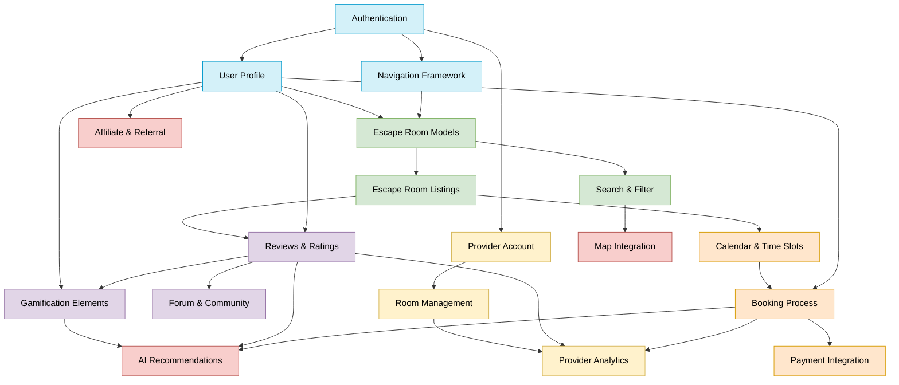

# Feature Dependencies Map

This document maps the dependencies between features in the Breakout Buddies project to help guide implementation order. Understanding these dependencies is crucial for efficient development, even as a solo developer.

## Dependency Visualization

## Feature Priority Matrix

This matrix combines dependency information with feature priority to help guide implementation decisions.

**Priority Legend:**
- **P1**: Critical - Must have for MVP
- **P2**: High - Important for core functionality
- **P3**: Medium - Valuable but not critical
- **P4**: Low - Nice to have
- **P5**: Future - Planned for later phases

| Feature | Dependencies | Priority | Complexity (1-5) | Value (1-5) | Implementation Order |
|---------|--------------|----------|------------------|-------------|----------------------|
| **Phase 1: Core Authentication & User Profile** |
| Authentication | None | P1 | 3 | 5 | 1 |
| User Profile | Authentication | P2 | 2 | 4 | 2 |
| Navigation Framework | Authentication | P1 | 3 | 4 | 3 |
| **Phase 2: Escape Room Discovery** |
| Escape Room Models | User Profile, Navigation | P1 | 3 | 5 | 4 |
| Search & Filter | Escape Room Models | P2 | 3 | 5 | 5 |
| Escape Room Listings | Escape Room Models | P1 | 3 | 5 | 6 |
| **Phase 3: Booking System** |
| Calendar & Time Slots | Escape Room Listings | P2 | 4 | 4 | 7 |
| Booking Process | Calendar & Time Slots, User Profile | P1 | 4 | 5 | 8 |
| Payment Integration | Booking Process | P3 | 5 | 4 | 9 |
| **Phase 4: Community & Gamification** |
| Reviews & Ratings | Escape Room Listings, User Profile | P2 | 3 | 4 | 10 |
| Forum & Community | Reviews & Ratings | P4 | 4 | 3 | 12 |
| Gamification Elements | User Profile, Reviews & Ratings | P3 | 4 | 3 | 11 |
| **Phase 5: Provider Portal** |
| Provider Account | Authentication | P3 | 3 | 4 | 13 |
| Room Management | Provider Account | P2 | 4 | 4 | 14 |
| Provider Analytics | Room Management, Reviews, Bookings | P3 | 4 | 3 | 15 |
| **Phase 6: Advanced Features** |
| Map Integration | Search & Filter | P3 | 3 | 4 | 16 |
| AI Recommendations | Reviews, Gamification, Bookings | P4 | 5 | 3 | 17 |
| Affiliate & Referral | User Profile | P4 | 3 | 2 | 18 |

## Dependency Details

### Authentication
- **Dependencies**: None
- **Required for**: User Profile, Navigation, Provider Account
- **Key components**: Login, Registration, Password Reset, Email Verification

### User Profile
- **Dependencies**: Authentication
- **Required for**: Escape Room Models, Booking Process, Reviews, Gamification, Affiliate
- **Key components**: Profile Data, Preferences, History

### Navigation Framework
- **Dependencies**: Authentication
- **Required for**: Escape Room Models (for routing)
- **Key components**: Bottom Navigation, App Drawer, Protected Routes

### Escape Room Models
- **Dependencies**: User Profile, Navigation
- **Required for**: Search & Filter, Escape Room Listings
- **Key components**: Data Models, Repository, Service Layer

### Search & Filter
- **Dependencies**: Escape Room Models
- **Required for**: Map Integration
- **Key components**: Search UI, Filter Options, Query Building

### Escape Room Listings
- **Dependencies**: Escape Room Models
- **Required for**: Calendar & Time Slots, Reviews
- **Key components**: List View, Grid View, Detail View

### Calendar & Time Slots
- **Dependencies**: Escape Room Listings
- **Required for**: Booking Process
- **Key components**: Calendar Widget, Time Slot Selection, Availability Checking

### Booking Process
- **Dependencies**: Calendar & Time Slots, User Profile
- **Required for**: Payment Integration, Provider Analytics
- **Key components**: Booking Flow, Group Options, Confirmation

### Payment Integration
- **Dependencies**: Booking Process
- **Required for**: None (terminal feature)
- **Key components**: Payment Methods, Processing, Confirmation

### Reviews & Ratings
- **Dependencies**: Escape Room Listings, User Profile
- **Required for**: Forum, Gamification, Provider Analytics, AI Recommendations
- **Key components**: Review UI, Rating System, Moderation

### Forum & Community
- **Dependencies**: Reviews & Ratings
- **Required for**: None (terminal feature)
- **Key components**: Posts, Comments, Moderation

### Gamification Elements
- **Dependencies**: User Profile, Reviews & Ratings
- **Required for**: AI Recommendations
- **Key components**: Points, Badges, Leaderboards

### Provider Account
- **Dependencies**: Authentication
- **Required for**: Room Management
- **Key components**: Provider Registration, Profile, Verification

### Room Management
- **Dependencies**: Provider Account
- **Required for**: Provider Analytics
- **Key components**: Room Creation, Editing, Slot Management

### Provider Analytics
- **Dependencies**: Room Management, Reviews, Bookings
- **Required for**: None (terminal feature)
- **Key components**: Booking Stats, Revenue Reports, Insights

### Map Integration
- **Dependencies**: Search & Filter
- **Required for**: None (terminal feature)
- **Key components**: Map View, Location Search, Route Planning

### AI Recommendations
- **Dependencies**: Reviews, Gamification, Bookings
- **Required for**: None (terminal feature)
- **Key components**: Recommendation Engine, Personalization

### Affiliate & Referral
- **Dependencies**: User Profile
- **Required for**: None (terminal feature)
- **Key components**: Referral Codes, Tracking, Credits

## Implementation Strategy

As a solo developer, consider this implementation strategy:

1. **Build the core foundation first**: Complete Authentication, User Profile, and Navigation Framework before moving to other features.

2. **Implement vertical slices**: For each major feature area, implement a minimal version first, then enhance it later. For example, implement basic Escape Room listings before adding advanced filtering.

3. **Prioritize user-facing features**: Focus on features that provide immediate value to users before implementing administrative or advanced features.

4. **Consider technical complexity**: When choosing between features with similar priority, implement the less complex one first to maintain momentum.

5. **Revisit this document**: Update this dependency map as you gain more insights during development.

## Minimal Viable Product (MVP)

Based on the dependencies and priorities, here's a suggested MVP feature set:

1. Authentication (basic email/password)
2. User Profile (basic information only)
3. Navigation Framework
4. Escape Room Models
5. Basic Escape Room Listings
6. Simple Search & Filter
7. Basic Booking Process (without payment integration)

This MVP provides the core functionality for users to discover and book escape rooms, which is the primary purpose of the application.

---

*This document is part of the Product Documentation and maps the dependencies between features in the BreakoutBuddies project.*
