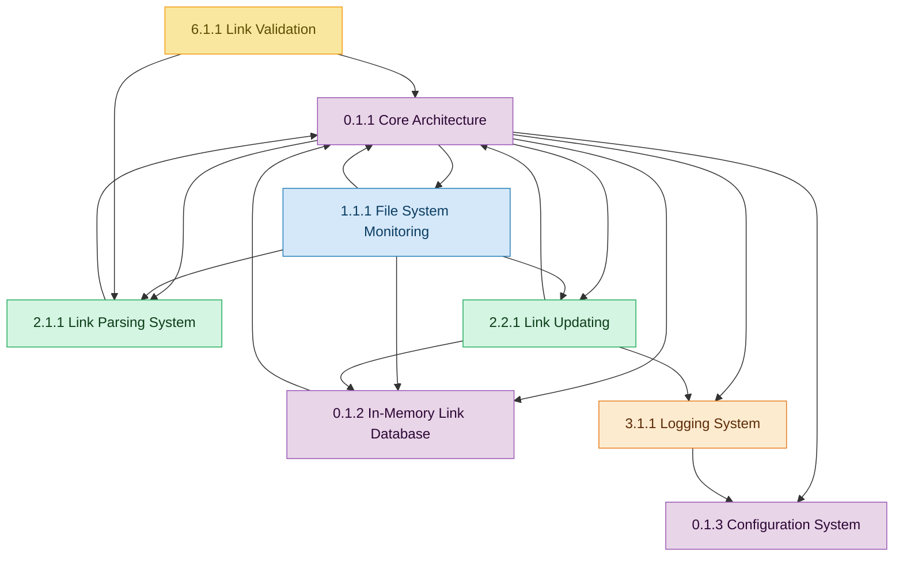

# Feature Dependencies Map

> **Auto-generated** by Update-FeatureDependencies.ps1 on 2026-03-31.
> Source: feature state files in doc/product-docs/state-tracking/features/.
> Do not edit manually — changes will be overwritten on next generation.

This document maps the dependencies between features (8 features, 18 dependency edges).

## Dependency Visualization

```mermaid
graph TD

    classDef foundation fill:#e8d5e8,stroke:#9b59b6,color:#2c0735
    classDef filewatching fill:#d5e8f9,stroke:#2980b9,color:#0a3d62
    classDef linkprocessing fill:#d5f5e3,stroke:#27ae60,color:#0b3d17
    classDef monitoring fill:#fdebd0,stroke:#e67e22,color:#5d2c06
    classDef testing fill:#fadbd8,stroke:#e74c3c,color:#5a0a0a
    classDef cicd fill:#d6eaf8,stroke:#3498db,color:#1a3c5e
    classDef validation fill:#f9e79f,stroke:#f39c12,color:#5d4e00

    F0_1_1["0.1.1 Core Architecture"]
    F0_1_2["0.1.2 In-Memory Link Database"]
    F0_1_3["0.1.3 Configuration System"]
    F1_1_1["1.1.1 File System Monitoring"]
    F2_1_1["2.1.1 Link Parsing System"]
    F2_2_1["2.2.1 Link Updating"]
    F3_1_1["3.1.1 Logging System"]
    F6_1_1["6.1.1 Link Validation"]

    F0_1_1 --> F0_1_2
    F0_1_1 --> F0_1_3
    F0_1_1 --> F1_1_1
    F0_1_1 --> F2_1_1
    F0_1_1 --> F2_2_1
    F0_1_1 --> F3_1_1
    F0_1_2 --> F0_1_1
    F1_1_1 --> F0_1_1
    F1_1_1 --> F0_1_2
    F1_1_1 --> F2_1_1
    F1_1_1 --> F2_2_1
    F2_1_1 --> F0_1_1
    F2_2_1 --> F0_1_1
    F2_2_1 --> F0_1_2
    F2_2_1 --> F3_1_1
    F3_1_1 --> F0_1_3
    F6_1_1 --> F0_1_1
    F6_1_1 --> F2_1_1

    class F0_1_1 foundation
    class F0_1_2 foundation
    class F0_1_3 foundation
    class F1_1_1 filewatching
    class F2_1_1 linkprocessing
    class F2_2_1 linkprocessing
    class F3_1_1 monitoring
    class F6_1_1 validation
```

**Legend**: Solid arrows (`-->`) = direct dependency. Dashed arrows (`-.->`) = broad dependency (e.g., test suite exercises all components).

**Color coding by phase**:
- 🟣 Foundation (0.x.x) — Core architecture, database, configuration
- 🔵 File Watching (1.x.x) — File system monitoring
- 🟢 Link Processing (2.x.x) — Parsing and updating
- 🟠 Monitoring (3.x.x) — Logging system
- 🔴 Testing (4.x.x) — Test infrastructure
- 💠 CI/CD (5.x.x) — Build and deployment
- 🟡 Validation (6.x.x) — Link validation

## Feature Priority Matrix

| Feature ID | Feature Name | Phase | Dependencies | Priority | Tier | Status |
|------------|-------------|-------|-------------|----------|------|--------|
| 0.1.1 | Core Architecture | Foundation | 0.1.2, 0.1.3, 1.1.1, 2.1.1, 2.2.1, 3.1.1 | P1 | 🔴 Tier 3 | 🟢 Completed |
| 0.1.2 | In-Memory Link Database | Foundation | 0.1.1 | P1 | 🟠 Tier 2 | 🟢 Completed |
| 0.1.3 | Configuration System | Foundation | — | P1 | 🔵 Tier 1 | 🟢 Completed |
| 1.1.1 | File System Monitoring | File Watching | 0.1.1, 0.1.2, 2.1.1, 2.2.1 | P1 | 🟠 Tier 2 | 🟢 Completed |
| 2.1.1 | Link Parsing System | Link Processing | 0.1.1 | P1 | 🟠 Tier 2 | 🟢 Completed |
| 2.2.1 | Link Updating | Link Processing | 0.1.1, 0.1.2, 3.1.1 | P1 | 🟠 Tier 2 | 🟢 Completed |
| 3.1.1 | Logging System | Monitoring | 0.1.3 | P1 | 🟠 Tier 2 | 🟢 Completed |
| 6.1.1 | Link Validation | Validation | 0.1.1, 2.1.1 | P2 | 🔵 Tier 1 | 🔄 Needs Revision |

## Dependency Summary

### Most Depended-On Features (highest fan-in)

- **0.1.1 Core Architecture**: 5 features depend on this
- **2.1.1 Link Parsing System**: 3 features depend on this
- **0.1.2 In-Memory Link Database**: 3 features depend on this
- **2.2.1 Link Updating**: 2 features depend on this
- **0.1.3 Configuration System**: 2 features depend on this
- **3.1.1 Logging System**: 2 features depend on this
- **1.1.1 File System Monitoring**: 1 features depend on this

### Features With No Dependencies (root nodes)

- **0.1.3 Configuration System**
