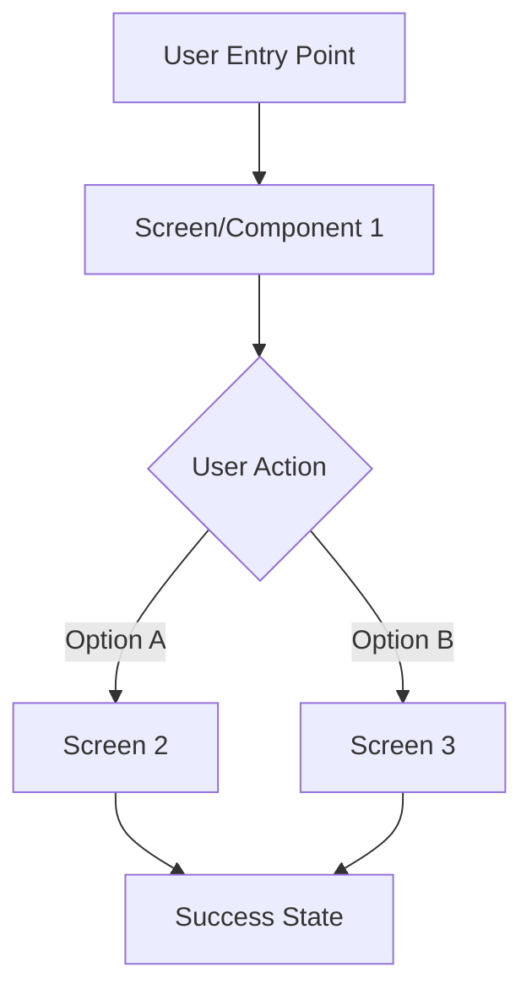

# Login Screen - UI/UX Design Document

## Feature Overview

- **Feature ID**: 1.1.1
- **Feature Name**: Login Screen
- **Design Scope**: [Brief description of the UI/UX design scope]
- **Target Platforms**: [ ] iOS • [ ] Android • [ ] Web
- **Design Status**: 🎨 Draft / 👀 Review / ✅ Approved

## Related Documentation

> **Note**: UI Design Documents define the visual and interaction design for features. This document bridges functional requirements (FDD) and technical implementation (TDD), ensuring a cohesive user experience across platforms.

### Functional Design Reference

> **📋 Primary Documentation**: FDD Creation Task (PF-TSK-027)
> **🔗 Link**: [Functional Design Document - PD-FDD-XXX] > **👤 Owner**: FDD Creation Task
>
> **Purpose**: The FDD defines what the feature does and why. This UI Design translates those functional requirements into concrete visual and interaction patterns.

**Key Functional Requirements Impacting Design**:

- [Functional requirement 1 that shapes the UI]
- [Functional requirement 2 that influences interaction patterns]
- [User workflow requirements from FDD]

### Design System Guidelines

> **📋 Primary Documentation**: Design Guidelines (PD-UIX-001)
> **🔗 Link**: [Design System Guidelines](../../../product-docs/technical/design/ui-ux/design-system/design-guidelines.md) > **👤 Owner**: Design System
>
> **Purpose**: All UI designs MUST follow established design system patterns for consistency. This includes colors, typography, spacing, components, and interaction patterns.

**Design System Patterns Applied**:

- [Design pattern 1 from guidelines]
- [Reusable component referenced]
- [Design token application]

### Technical Design Reference

> **📋 Primary Documentation**: TDD Creation Task (PF-TSK-015)
> **🔗 Link**: [Technical Design Document - PD-TDD-XXX] > **👤 Owner**: TDD Creation Task
>
> **Purpose**: The TDD implements this design using Flutter widgets and architecture patterns. This document provides implementation guidance and widget specifications.

**Implementation Considerations**:

- [Flutter widget recommendations]
- [State management requirements for UI]
- [Performance considerations]

### API Design Reference

> **📋 Primary Documentation**: API Design Task (PF-TSK-020)
> **🔗 Link**: [API Specification - PD-API-XXX] > **👤 Owner**: API Design Task
>
> **Purpose**: UI designs must align with API data structures and response patterns. Loading states, error handling, and data display are driven by API design.

**API-UI Integration Points**:

- [Data binding requirements]
- [Loading state patterns]
- [Error handling UI flows]

---

## 1. Design Overview

### 1.1 Design Goals

<!-- Define the primary UX objectives for this feature -->

**Primary Goals**:

1. [Primary UX goal 1 - e.g., "Enable users to complete registration in <30 seconds"]
2. [Primary UX goal 2 - e.g., "Provide clear feedback at every interaction point"]
3. [Primary UX goal 3 - e.g., "Ensure accessibility for screen reader users"]

**Success Metrics**:

- [Measurable UX metric 1 - e.g., "Task completion rate > 95%"]
- [Measurable UX metric 2 - e.g., "Average time on task < 30 seconds"]
- [Measurable UX metric 3 - e.g., "User satisfaction score > 4.5/5"]

### 1.2 User Context

**Target Users**:

- [User persona 1 - e.g., "First-time app users"]
- [User persona 2 - e.g., "Returning customers"]

**Usage Scenarios**:

- [Scenario 1 - e.g., "User registers during room discovery"]
- [Scenario 2 - e.g., "User registers to complete booking"]

**User Needs**:

- [Need 1 - e.g., "Quick registration without friction"]
- [Need 2 - e.g., "Clear validation feedback"]

### 1.3 Design Constraints

**Technical Constraints**:

- [Constraint 1 - e.g., "Must work offline with sync on reconnection"]
- [Constraint 2 - e.g., "Maximum 3-second load time"]

**Platform Constraints**:

- [iOS-specific constraint - e.g., "Follows iOS Human Interface Guidelines"]
- [Android-specific constraint - e.g., "Material Design 3 components"]
- [Web-specific constraint - e.g., "Responsive down to 320px width"]

**Business Constraints**:

- [Constraint 1 - e.g., "Must collect consent for GDPR compliance"]
- [Constraint 2 - e.g., "Branding guidelines must be followed"]

---

## 2. Wireframes & User Flows

### 2.1 User Flow Diagram

<!-- Create a Mermaid diagram showing the user journey through this feature -->



**Flow Description**:

1. **Entry Point**: [How users access this feature]
2. **Primary Path**: [Main user journey steps]
3. **Alternative Paths**: [Other user flows]
4. **Exit Points**: [How users leave/complete the flow]

### 2.2 Screen Wireframes

<!-- For each screen/component, provide wireframes (low-fidelity sketches or detailed mockups) -->

#### Screen 1: [Screen Name]

**Purpose**: [What this screen accomplishes]

**Wireframe**:

```
┌─────────────────────────────────────┐
│  [Header/Navigation]                │
├─────────────────────────────────────┤
│                                     │
│  [Main Content Area]                │
│                                     │
│  [Interactive Elements]             │
│                                     │
│  [Action Buttons]                   │
│                                     │
└─────────────────────────────────────┘
```

**Layout Notes**:

- [Layout consideration 1]
- [Layout consideration 2]

**Interactive Elements**:

- [Element 1: Type, Purpose, Behavior]
- [Element 2: Type, Purpose, Behavior]

#### Screen 2: [Screen Name]

**Purpose**: [What this screen accomplishes]

**Wireframe**: [ASCII art or description]

---

## 3. Visual Design Specifications

### 3.1 Color Palette

<!-- Reference design tokens from design system when available -->

**Primary Colors**:

- **Brand Primary**: `#XXXXXX` (Used for: [primary actions, headers])
- **Brand Secondary**: `#XXXXXX` (Used for: [secondary actions, highlights])
- **Brand Accent**: `#XXXXXX` (Used for: [accents, notifications])

**Semantic Colors**:

- **Success**: `#XXXXXX` (✅ Confirmation messages)
- **Warning**: `#XXXXXX` (⚠️ Warning states)
- **Error**: `#XXXXXX` (❌ Error states)
- **Info**: `#XXXXXX` (ℹ️ Informational messages)

**Neutral Colors**:

- **Background**: `#XXXXXX`
- **Surface**: `#XXXXXX`
- **Text Primary**: `#XXXXXX`
- **Text Secondary**: `#XXXXXX`
- **Border**: `#XXXXXX`

### 3.2 Typography

<!-- Reference typography tokens from design system -->

**Font Family**:

- **Primary**: [Font name] (Body text, UI elements)
- **Secondary**: [Font name] (Headers, emphasis)

**Text Styles**:

- **H1**: [Font size, weight, line height] - Used for: [page titles]
- **H2**: [Font size, weight, line height] - Used for: [section headers]
- **H3**: [Font size, weight, line height] - Used for: [subsection headers]
- **Body**: [Font size, weight, line height] - Used for: [main content]
- **Caption**: [Font size, weight, line height] - Used for: [helper text]
- **Button**: [Font size, weight, line height] - Used for: [action buttons]

### 3.3 Spacing & Layout

<!-- Reference spacing tokens from design system -->

**Spacing Scale**: [e.g., 4px base unit, 8-16-24-32-48-64px scale]

**Layout Grid**:

- **Mobile**: [e.g., 4-column grid, 16px gutters]
- **Tablet**: [e.g., 8-column grid, 24px gutters]
- **Desktop**: [e.g., 12-column grid, 32px gutters]

**Component Spacing**:

- **Input fields**: [vertical spacing, padding]
- **Buttons**: [padding, margins]
- **Cards**: [padding, margins]
- **Sections**: [vertical rhythm]

### 3.4 Iconography

**Icon Library**: [Material Icons / Cupertino Icons / Custom]

**Icon Style**: [Outlined / Filled / Rounded]

**Icon Sizes**:

- **Small**: 16px (Inline text icons)
- **Medium**: 24px (Standard UI icons)
- **Large**: 32px (Feature icons)
- **XLarge**: 48px (Hero icons)

**Key Icons Used**:

- [Icon name]: [Usage context]
- [Icon name]: [Usage context]

---

## 4. Component Specifications

<!-- Define each UI component with detailed specifications -->

### 4.1 Component: [Component Name]

**Component Type**: [Button / Input / Card / Modal / etc.]

**Variants**:

- **Primary**: [Description and usage]
- **Secondary**: [Description and usage]
- **Tertiary**: [Description and usage]

**States**:

- **Default**: [Visual appearance]
- **Hover**: [Visual changes on hover]
- **Pressed**: [Visual changes when pressed]
- **Focused**: [Visual changes when focused]
- **Disabled**: [Visual appearance when disabled]
- **Loading**: [Visual feedback during loading]
- **Error**: [Visual appearance with error]

**Dimensions**:

- **Width**: [Fixed / Flexible / Full-width]
- **Height**: [Measurement]
- **Padding**: [Internal spacing]
- **Margin**: [External spacing]

**Behavior**:

- **Interaction**: [How users interact]
- **Feedback**: [Visual/haptic feedback provided]
- **Transitions**: [Animation details]

**Accessibility**:

- **Label**: [Accessible name]
- **Role**: [ARIA role]
- **Focus**: [Keyboard navigation]
- **Contrast**: [Color contrast ratio]

### 4.2 Component: [Component Name]

<!-- Repeat for each major component -->

---

## 5. Accessibility Requirements

### 5.1 WCAG 2.1 Compliance

**Target Level**: Level AA (Minimum)

**Key Requirements**:

1. **Perceivable**:

   - [ ] Text contrast ratio ≥ 4.5:1 (normal text), ≥ 3:1 (large text)
   - [ ] All images have alt text
   - [ ] Color is not the only means of conveying information
   - [ ] Content is responsive and readable at 200% zoom

2. **Operable**:

   - [ ] All functionality available via keyboard
   - [ ] Focus indicators visible on all interactive elements
   - [ ] No keyboard traps
   - [ ] Touch targets ≥ 44x44 points (iOS) / 48x48 dp (Android)

3. **Understandable**:

   - [ ] Clear, consistent navigation
   - [ ] Form inputs have visible labels
   - [ ] Error messages are clear and actionable
   - [ ] Help text provided where needed

4. **Robust**:
   - [ ] Valid semantic HTML (Web)
   - [ ] Proper accessibility traits (iOS/Android)
   - [ ] Screen reader tested

### 5.2 Screen Reader Support

**Required Semantic Labels**:

- [Element 1]: [Semantic label]
- [Element 2]: [Semantic label]

**Navigation Order**:

1. [Element 1 - Focus order]
2. [Element 2 - Focus order]
3. [Element 3 - Focus order]

**Announcements**:

- [Success]: [Screen reader announcement]
- [Error]: [Screen reader announcement]
- [State change]: [Screen reader announcement]

---

## 6. Responsive Design

### 6.1 Breakpoints

**Mobile (Portrait)**: 320px - 414px

- [Layout adjustments]
- [Component changes]

**Mobile (Landscape)**: 568px - 896px

- [Layout adjustments]
- [Component changes]

**Tablet (Portrait)**: 768px - 834px

- [Layout adjustments]
- [Component changes]

**Tablet (Landscape)**: 1024px - 1366px

- [Layout adjustments]
- [Component changes]

**Desktop**: 1440px+

- [Layout adjustments]
- [Component changes]

### 6.2 Adaptive Patterns

**Layout Strategy**: [Responsive / Adaptive / Hybrid]

**Content Priority**:

1. [Primary content - always visible]
2. [Secondary content - conditional display]
3. [Tertiary content - hidden on small screens]

**Navigation Pattern**:

- **Mobile**: [Bottom nav / Hamburger menu / Tabs]
- **Tablet**: [Side nav / Tab bar]
- **Desktop**: [Top nav / Persistent sidebar]

---

## 7. Platform-Specific Adaptations

### 7.1 iOS Design

**iOS HIG Compliance**:

- [Design pattern 1 adapted for iOS]
- [Navigation pattern for iOS]
- [iOS-specific interactions (swipe gestures, etc.)]

**iOS Components Used**:

- [Cupertino widget 1]
- [Cupertino widget 2]

**iOS-Specific Behaviors**:

- [Behavior 1]
- [Behavior 2]

### 7.2 Android Design

**Material Design Compliance**:

- [Material Design pattern 1]
- [Navigation pattern for Android]
- [Android-specific interactions]

**Material Components Used**:

- [Material widget 1]
- [Material widget 2]

**Android-Specific Behaviors**:

- [Behavior 1]
- [Behavior 2]

### 7.3 Web Design

**Web-Specific Considerations**:

- [Responsive behavior]
- [Browser compatibility requirements]
- [Web-specific interactions (hover states, etc.)]

**Web Components**:

- [HTML/Flutter Web widget 1]
- [HTML/Flutter Web widget 2]

---

## 8. Animation & Transitions

### 8.1 Motion Principles

**Motion Style**: [Fluid / Snappy / Subtle / Energetic]

**Motion Purpose**:

- [Purpose 1 - e.g., "Provide feedback on user actions"]
- [Purpose 2 - e.g., "Guide attention to important elements"]
- [Purpose 3 - e.g., "Create continuity between screens"]

### 8.2 Transition Specifications

**Screen Transitions**:

- **Type**: [Slide / Fade / Scale / Custom]
- **Duration**: [milliseconds]
- **Easing**: [linear / easeIn / easeOut / easeInOut / custom]

**Component Animations**:

| Element  | Animation Type    | Duration | Easing      | Trigger     |
| -------- | ----------------- | -------- | ----------- | ----------- |
| [Button] | [Scale + Opacity] | [150ms]  | [easeOut]   | [On press]  |
| [Card]   | [Slide up + Fade] | [300ms]  | [easeInOut] | [On appear] |
| [Modal]  | [Fade + Scale]    | [250ms]  | [easeOut]   | [On open]   |

**Loading Animations**:

- **Spinner**: [Style, duration]
- **Skeleton**: [Style, shimmer effect]
- **Progress**: [Style, update frequency]

### 8.3 Performance Considerations

- [ ] Animations use GPU-accelerated properties (transform, opacity)
- [ ] Avoid layout thrashing (minimize reflows)
- [ ] Respect user's reduced motion preferences
- [ ] Target 60 FPS on all supported devices

---

## 9. Design System Integration

### 9.1 Reusable Patterns Applied

**From Design Guidelines (PD-UIX-001)**:

- [Pattern 1]: [How it's applied in this feature]
- [Pattern 2]: [How it's applied in this feature]
- [Pattern 3]: [How it's applied in this feature]

### 9.2 New Patterns Introduced

> **Note**: New patterns should be evaluated for inclusion in the design system if they're reusable across features.

**Candidate Pattern 1**: [Pattern name]

- **Description**: [What it solves]
- **Reusability**: [High / Medium / Low]
- **Recommendation**: [Add to design system / Feature-specific]

### 9.3 Design Token Usage

**Tokens Applied**:

- **Colors**: [Token names used]
- **Typography**: [Token names used]
- **Spacing**: [Token names used]
- **Shadows**: [Token names used]

---

## 10. Implementation Notes

### 10.1 Flutter Widget Recommendations

**Suggested Flutter Widgets**:

- **Screen Structure**: [Scaffold, AppBar, BottomNavigationBar]
- **Layout**: [Column, Row, Stack, Container]
- **Inputs**: [TextField, Checkbox, Radio, DropdownButton]
- **Buttons**: [ElevatedButton, TextButton, IconButton]
- **Display**: [Card, ListTile, Image, Text]
- **Navigation**: [Navigator, PageView, TabBarView]

### 10.2 State Management Considerations

**UI State Types**:

- **Local State**: [e.g., form input, toggle states]
- **Feature State**: [e.g., loading, error, success states]
- **Global State**: [e.g., user session, app theme]

**Recommended Approach**:

- [Riverpod / Provider / BLoC pattern recommendation]

### 10.3 Asset Requirements

**Images**:

- [Image name]: [Resolution, format, purpose]
- [Image name]: [Resolution, format, purpose]

**Illustrations**:

- [Illustration name]: [Style, usage]

**Icons**:

- [Custom icon needs]
- [Icon design specifications]

### 10.4 Technical Considerations

**Performance**:

- [Performance constraint 1]
- [Optimization strategy]

**Testing**:

- [UI testing requirements]
- [Visual regression testing needs]

**Localization**:

- [Text expansion considerations]
- [RTL support requirements]

---

## 11. Design Handoff Checklist

### 11.1 Deliverables

- [ ] All wireframes completed and reviewed
- [ ] Visual design specifications documented
- [ ] Component specifications defined
- [ ] Accessibility requirements documented
- [ ] Platform-specific adaptations specified
- [ ] Animation specifications detailed
- [ ] Asset requirements identified
- [ ] Implementation notes provided

### 11.2 Review & Approval

- [ ] Design reviewed by UX lead
- [ ] Accessibility audit completed
- [ ] Technical feasibility confirmed
- [ ] Stakeholder approval received

### 11.3 Handoff to Development

- [ ] TDD references this UI Design document
- [ ] Developers have access to design assets
- [ ] Design system patterns communicated
- [ ] Questions/clarifications addressed

---

## Appendix

### A. Design Decisions Log

| Date   | Decision        | Rationale             | Impact            |
| ------ | --------------- | --------------------- | ----------------- |
| 2025-10-18 | [Decision made] | [Why this was chosen] | [What it affects] |

### B. User Research & Testing

**User Testing Results**: [Link to user testing documentation]

**Feedback Incorporated**:

- [Feedback 1]: [How it was addressed]
- [Feedback 2]: [How it was addressed]

### C. Design Resources

**Design Files**:

- [Figma/Sketch link]
- [Asset library link]

**Reference Materials**:

- [iOS HIG](https://developer.apple.com/design/human-interface-guidelines/)
- [Material Design](https://m3.material.io/)
- [WCAG 2.1 Guidelines](https://www.w3.org/WAI/WCAG21/quickref/)
