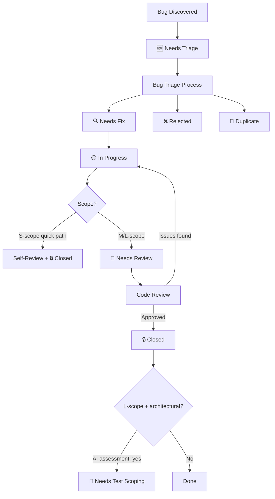

# Bug Tracking

This document tracks the lifecycle of bugs and issues in the LinkWatcher project, providing a systematic approach to bug identification, triage, resolution, and verification.

<strong>📋 Table of Contents</strong>

- [Status Legends](#status-legends)
  - [Bug Status](#bug-status)
  - [Priority Levels](#priority-levels)
  - [Scope Levels](#scope-levels)
  - [Source Types](#source-types)
- [Bug Management Workflow](#bug-management-workflow)
- [Bug Registry](#bug-registry)
  - [Critical Bugs](#critical-bugs)
  - [High Priority Bugs](#high-priority-bugs)
  - [Medium Priority Bugs](#medium-priority-bugs)
  - [Low Priority Bugs](#low-priority-bugs)
- [Closed Bugs](#closed-bugs) (pointer → [archive](archive/bug-tracking-archive.md))
- [Bug Statistics](#bug-statistics)

## Status Legends

### Bug Status

| Symbol | Status        | Description                                                    | Next Task  |
| ------ | ------------- | -------------------------------------------------------------- | ---------- |
| 🆕     | Needs Triage  | Bug reported, awaiting evaluation and prioritization           | PF-TSK-041 |
| 🔍     | Needs Fix     | Triaged and prioritized, ready for bug fixing                  | PF-TSK-007 |
| 🟡     | In Progress   | Bug is currently being investigated or fixed                   | —          |
| 👀     | Needs Review  | Fix implemented and tested, awaiting Code Review verification  | PF-TSK-005 |
| 🔒     | Closed        | Reviewed, verified, and resolved                               | —          |
| 🔄     | Reopened      | Previously closed bug has recurred — needs re-triage           | PF-TSK-041 |
| ❌     | Rejected      | Not a bug, won't fix, or other rejection rationale — terminal state | —     |
| 🚫     | Duplicate     | Duplicate of another existing bug — terminal state             | —          |

### Priority Levels

| Priority | Description                                 | Response Time     |
| -------- | ------------------------------------------- | ----------------- |
| Critical | System breaking, security issues            | Immediate         |
| High     | Major functionality affected                | Within 24 hours   |
| Medium   | Minor functionality affected                | Within 1 week     |
| Low      | Cosmetic or enhancement requests            | When time permits |

### Scope Levels

| Scope | Description                                                      |
| ----- | ---------------------------------------------------------------- |
| S     | Small — single-session fix, no state file needed                 |
| M     | Medium — may span sessions, state file recommended               |
| L     | Large — multi-session, state file required (New-BugFixState.ps1) |

### Source Types

| Source                 | Description                              |
| ---------------------- | ---------------------------------------- |
| Testing                | Discovered during test execution         |
| Test Development       | Found during test implementation         |
| Test Audit             | Discovered during test audit process     |
| E2E Testing            | Discovered during E2E acceptance testing |
| User Report            | Reported by end users                    |
| Code Review            | Found during code review process         |
| Feature Development    | Found during feature implementation      |
| Foundation Development | Found during foundational feature work   |
| Code Refactoring       | Discovered during refactoring activities |
| Deployment             | Found during release deployment          |
| Monitoring             | Detected by system monitoring            |
| Development            | Found during general development work    |

## Bug Management Workflow

## Bug Registry

### Critical Bugs

| ID | Title | Status | Priority | Scope | Reported | Description | Related Feature | Workflows | Dims | Notes |
| --- | --- | --- | --- | --- | --- | --- | --- | --- | --- | --- |
| _No critical bugs currently active_ |

### High Priority Bugs

| ID | Title | Status | Priority | Scope | Reported | Description | Related Feature | Workflows | Dims | Notes |
| --- | --- | --- | --- | --- | --- | --- | --- | --- | --- | --- |
| _No high priority bugs currently active_ |

### Medium Priority Bugs

| ID | Title | Status | Priority | Scope | Reported | Description | Related Feature | Workflows | Dims | Notes |
| --- | --- | --- | --- | --- | --- | --- | --- | --- | --- | --- |
| _No medium priority bugs currently active_ |

### Low Priority Bugs

| ID | Title | Status | Priority | Scope | Reported | Description | Related Feature | Workflows | Dims | Notes |
| --- | --- | --- | --- | --- | --- | --- | --- | --- | --- | --- |
| _No low priority bugs currently active_ |

## Closed Bugs

> 🗄️ **Archived** — Closed and rejected bug rows live in [archive/bug-tracking-archive.md](archive/bug-tracking-archive.md) (sibling file, split 2026-05-26 per PF-IMP-872 to keep this file scannable as the closed/rejected history grows).
>
> `Update-BugStatus.ps1` reads and writes the archive automatically when transitioning to `Closed` / `Rejected` / `Reopened`. The archive holds two sections: `## Closed Bugs` (fixed) and `## Rejected Bugs` (not-a-bug / won't-fix) — kept distinct so trend analysis can separate "we fixed it" from "we decided not to fix it."

## Bug Statistics

### Current Status Summary

- **Total Active Bugs**: 0
- **Critical**: 0
- **High**: 0
- **Medium**: 0
- **Low**: 0
- **All Triaged**: Yes (PD-BUG-107 and PD-BUG-108 triaged 2026-06-12)

---

## Integration with Feature Tracking

When bugs are related to specific features, they should reference the feature ID from [Feature Tracking](feature-tracking.md). This enables:

1. **Impact Assessment**: Understanding which features are affected by bugs
2. **Priority Alignment**: Aligning bug priority with feature priority
3. **Release Planning**: Ensuring critical bugs are fixed before feature releases
4. **Testing Coordination**: Coordinating bug fixes with feature testing

## Integration with Process Framework

This bug tracking system integrates with the following process framework components:

### Bug Management Tasks

- **[Bug Triage Task](../../../process-framework/tasks/06-maintenance/bug-triage-task.md)**: For bug evaluation and prioritization
- **[Bug Fixing Task](../../../process-framework/tasks/06-maintenance/bug-fixing-task.md)**: For bug resolution workflow

### Development Tasks with Bug Discovery Integration

- **[Data Layer Implementation (PF-TSK-051)](../../../process-framework/tasks/04-implementation/data-layer-implementation.md)**: Bug discovery during data model and repository work
- **[Integration & Testing (PF-TSK-053)](../../../process-framework/tasks/04-implementation/integration-and-testing.md)**: Bug discovery during integration testing
- **[Quality Validation (PF-TSK-054)](../../../process-framework/tasks/04-implementation/quality-validation.md)**: Bug discovery during quality validation
- **[Implementation Finalization (PF-TSK-055)](../../../process-framework/tasks/04-implementation/implementation-finalization.md)**: Bug discovery during finalization
- **[Feature Enhancement (PF-TSK-068)](../../../process-framework/tasks/04-implementation/feature-enhancement.md)**: Bug discovery during enhancement work
- **[Foundation Feature Implementation Task](../../../process-framework/tasks/04-implementation/foundation-feature-implementation-task.md)**: Bug discovery during foundational work
- **[Integration & Testing (PF-TSK-053)](../../../process-framework/tasks/04-implementation/integration-and-testing.md)**: Bug discovery during test development
- **[Test Audit Task](../../../process-framework/tasks/03-testing/test-audit-task.md)**: Bug discovery during test auditing
- **[Code Review Task](../../../process-framework/tasks/06-maintenance/code-review-task.md)**: Bug discovery during code reviews
- **[Code Refactoring Task](../../../process-framework/tasks/06-maintenance/code-refactoring-task.md)**: Bug discovery during refactoring
- **[Release Deployment Task](../../../process-framework/tasks/07-deployment/release-deployment-task.md)**: Bug discovery during deployment

### Automation Integration

All development tasks use the **`New-BugReport.ps1`** script for standardized bug reporting, ensuring consistent bug documentation and automatic integration with this tracking system.

## Usage Guidelines

### Adding New Bugs

#### Automated Method (Recommended)

Use the **`New-BugReport.ps1`** script for standardized bug creation:

- Automatically generates sequential PD-BUG-XXX IDs
- Ensures consistent formatting and required fields
- Integrates with development task workflows
- Creates bug report documents and updates this tracking file

#### Manual Method

1. Use the next sequential bug ID (PD-BUG-001, PD-BUG-002, etc.)
2. Start with status 🆕 Needs Triage
3. Fill in all required fields
4. Place in appropriate priority section
5. Reference related feature ID if applicable

### Updating Bug Status

1. Update the status symbol and any relevant fields
2. Add notes about status changes
3. Move bugs between priority sections if priority changes
4. Update statistics section

### Closing Bugs

Use `Update-BugStatus.ps1 -NewStatus "Closed"` which automatically:
1. Changes status to 🔒 Closed
2. Moves the bug entry from its active priority table to the Closed Bugs section
3. Recalculates Bug Statistics (active counts, resolved count)
4. Appends verification notes and timestamp

### Reopening Bugs

Use `Update-BugStatus.ps1 -NewStatus "Reopened" -ReopenReason "reason"` which automatically:
1. Changes status to 🔄 Reopened
2. Moves the bug entry from the Closed Bugs section back to the correct active priority table
3. Recalculates Bug Statistics (active counts, resolved count)
4. Appends reopen reason and timestamp

After reopening, re-evaluate priority and scope through [Bug Triage](../../../process-framework/tasks/06-maintenance/bug-triage-task.md#steps-to-reopen-a-bug).

### Bug ID Format

- **Format**: PD-BUG-XXX (where XXX is a sequential number)
- **Examples**: PD-BUG-001, PD-BUG-002, PD-BUG-003
- **Scope**: Project-wide unique identifiers following Product Documentation (PD) naming convention
- **Automated Creation**: When using `New-BugReport.ps1`, IDs are automatically generated in the correct format

---

_This document is maintained as part of the Process Framework State Tracking system and should be updated whenever bugs are reported, triaged, fixed, or closed._
