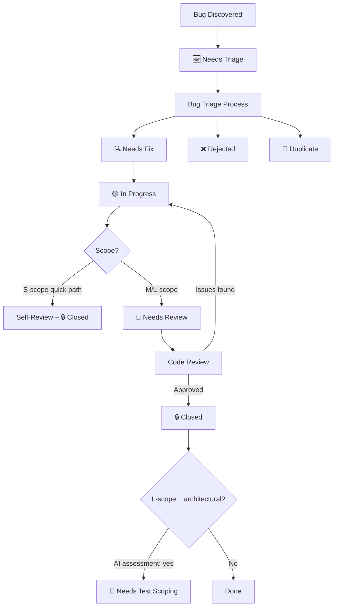

# Bug Tracking

This document tracks the lifecycle of bugs and issues in the LinkWatcher project, providing a systematic approach to bug identification, triage, resolution, and verification.

<strong>📋 Table of Contents</strong>

- [Status Legends](#status-legends)
  - [Bug Status](#bug-status)
  - [Priority Levels](#priority-levels)
  - [Scope Levels](#scope-levels)
  - [Source Types](#source-types)
- [Bug Management Workflow](#bug-management-workflow)
- [Bug Registry](#bug-registry)
  - [Critical Bugs](#critical-bugs)
  - [High Priority Bugs](#high-priority-bugs)
  - [Medium Priority Bugs](#medium-priority-bugs)
  - [Low Priority Bugs](#low-priority-bugs)
- [Closed Bugs](#closed-bugs) (pointer → [archive](archive/bug-tracking-archive.md))
- [Bug Statistics](#bug-statistics)

## Status Legends

### Bug Status

| Symbol | Status        | Description                                                    | Next Task  |
| ------ | ------------- | -------------------------------------------------------------- | ---------- |
| 🆕     | Needs Triage  | Bug reported, awaiting evaluation and prioritization           | PF-TSK-041 |
| 🔍     | Needs Fix     | Triaged and prioritized, ready for bug fixing                  | PF-TSK-007 |
| 🟡     | In Progress   | Bug is currently being investigated or fixed                   | —          |
| 👀     | Needs Review  | Fix implemented and tested, awaiting Code Review verification  | PF-TSK-005 |
| 🔒     | Closed        | Reviewed, verified, and resolved                               | —          |
| 🔄     | Reopened      | Previously closed bug has recurred — needs re-triage           | PF-TSK-041 |
| ❌     | Rejected      | Not a bug, won't fix, or other rejection rationale — terminal state | —     |
| 🚫     | Duplicate     | Duplicate of another existing bug — terminal state             | —          |

### Priority Levels

| Priority | Description                                 | Response Time     |
| -------- | ------------------------------------------- | ----------------- |
| Critical | System breaking, security issues            | Immediate         |
| High     | Major functionality affected                | Within 24 hours   |
| Medium   | Minor functionality affected                | Within 1 week     |
| Low      | Cosmetic or enhancement requests            | When time permits |

### Scope Levels

| Scope | Description                                                      |
| ----- | ---------------------------------------------------------------- |
| S     | Small — single-session fix, no state file needed                 |
| M     | Medium — may span sessions, state file recommended               |
| L     | Large — multi-session, state file required (New-BugFixState.ps1) |

### Source Types

| Source                 | Description                              |
| ---------------------- | ---------------------------------------- |
| Testing                | Discovered during test execution         |
| Test Development       | Found during test implementation         |
| Test Audit             | Discovered during test audit process     |
| E2E Testing            | Discovered during E2E acceptance testing |
| User Report            | Reported by end users                    |
| Code Review            | Found during code review process         |
| Feature Development    | Found during feature implementation      |
| Foundation Development | Found during foundational feature work   |
| Code Refactoring       | Discovered during refactoring activities |
| Deployment             | Found during release deployment          |
| Monitoring             | Detected by system monitoring            |
| Development            | Found during general development work    |

## Bug Management Workflow

```mermaid
graph TD
    A[Bug Discovered] --> B[🆕 Needs Triage]
    B --> C[Bug Triage Process]
    C --> D[🔍 Needs Fix]
    C --> L[❌ Rejected]
    C --> M[🚫 Duplicate]
    D --> E[🟡 In Progress]
    E --> F{Scope?}
    F -->|S-scope quick path| G[Self-Review + 🔒 Closed]
    F -->|M/L-scope| H[👀 Needs Review]
    H --> I[Code Review]
    I -->|Approved| K[🔒 Closed]
    I -->|Issues found| E
    K --> N{L-scope + architectural?}
    N -->|AI assessment: yes| O[🔎 Needs Test Scoping]
    N -->|No| P[Done]
```

## Bug Registry

### Critical Bugs

| ID | Title | Status | Priority | Scope | Reported | Description | Related Feature | Workflows | Dims | Notes |
| --- | --- | --- | --- | --- | --- | --- | --- | --- | --- | --- |
| PD-BUG-118 | Reference-update pass strips trailing slashes and doubles segment letters in path spans | 🟡 In Progress | Critical | M | 2026-08-13 | On 2026-08-13 the daemon (v2.1.3, global install) ran a bulk reference-update (move) pass over the appdev workspace after 16 tracked files were deleted, and rewrote 91 files in a 124 ms burst. 181 lines lost a trailing slash inside backticked path spans. 9 lines took a compound mangle: the slash is lost, the next segment leading letter is doubled, and the closing backtick is eaten, so doc/state-tracking/ becomes ddoc/state-tracking. PD-BUG-112 fixed the backslash variant; this one survives it. Filed as a removal pass; corrected at triage 2026-08-17 - deletions never rewrite files, so the writes came from move handling (see Triage note). | 2.2.1 | WF-001, WF-002, WF-005 | DI OB | Source: Development; Environment: Development; Component: reference-update pass; Repro: 1. Have a workspace where LinkWatcher is watching. 2. Delete tracked files that many documents reference (here: 4 state trackers plus 11 placeholder files, giving 1505 broken references). 3. Let the daemon run its bulk reference-update pass (the deletions are correlated into moves). 4. Diff the working tree against HEAD: unrelated backticked path spans in files that merely mention the deleted paths have lost trailing slashes, and some have a doubled segment letter plus an eaten closing backtick.; Expected: A reference-update pass either rewrites a path reference correctly or leaves the line untouched. No character outside the matched path substring is altered, and files that merely mention a deleted path in prose are not rewritten at all.; Actual: Characters adjacent to the matched path are consumed and duplicated. Trailing slashes are deleted inside backticked spans; the following segment leading letter is doubled; closing backticks and sentence periods are eaten. Damage is silent: no error, no log line naming the write.; Evidence: Measured in appdev: 91 files rewritten at 16:37:06.153-16:37:06.277. Repaired HEAD-anchored: 86 files / 181 slash-only lines plus 9 compound lines. Damaged shipped payload (structure-change-task.md, new-task-creation-process.md, performance_db.py) and appdev CLAUDE.md. A docstring became: Resolve database ptest/state-tracking/permanentanent/. Deployed path_resolver.py is byte-identical to release commit b91690d, so the PD-BUG-112 fix was present and running.; Triage: Triaged 2026-08-17: Critical confirmed (silent corruption of user file content, no workaround, 91 files damaged including shipped payload). Scope M; escalate to L if reproduction proves elusive. Related feature set to 2.2.1 (was N/A). Mechanism re-framed at triage: the product has no reference-removal write path - _process_true_file_delete (handler.py:940) only logs broken_references_found and writes nothing; every file-writing path is move-driven (update_references, update_references_batch, update_links_within_moved_file), so the 91-file burst was a reference-UPDATE pass, most likely deletes correlated into moves by the delete+create correlator or the directory-move detector. Fixer should start at updater._replace_at_position (updater.py:601) column-span handling and the parser spans feeding it, not at a removal routine. Not a duplicate of PD-BUG-112 and 112 is NOT reopened: that fix addressed separator style of the calculated target and was verified deployed here; this one consumes and duplicates characters adjacent to the matched span. First fix step: confirm the defect still reproduces against current repo source, which carries unreleased changes, rather than only against the v2.1.3 daemon.; Updated: 2026-08-17 |  |

### High Priority Bugs

| ID | Title | Status | Priority | Scope | Reported | Description | Related Feature | Workflows | Dims | Notes |
| --- | --- | --- | --- | --- | --- | --- | --- | --- | --- | --- |
| PD-BUG-119 | ReferenceLookup move-memory and pending-recalc dicts are mutated from two threads without a lock | 🔍 Needs Fix | High | S | 2026-08-17 | The PD-BUG-114 fix added the first cross-event mutable state on ReferenceLookup: _recent_moves and _pending_recalcs (reference_lookup.py:81/86), both plain dicts mutated from two threads with no lock - the watchdog emitter thread (handler.py:449, 506) and the DirectoryMoveDetector processing thread (handler.py:562-563, 610-611). Every other shared mutable structure here is lock-guarded (LinkDatabase, handler stats, both move detectors). | 2.2.1 | WF-001, WF-004 | DI OB | Source: CodeReview; Environment: Development; Component: Link updating - ReferenceLookup move memory; Repro: 1. Start LinkWatcher on a monitored project. 2. Move a directory containing many files and, while the DirectoryMoveDetector settle window is still open, move an unrelated single file. 3. The directory-move processing thread runs record_move per file and apply_pending_recalcs concurrently with the watchdog thread processing the single-file move. 4. The race window is the unguarded dict access in _prune_move_memory, _register_pending_recalc and apply_pending_recalcs.; Expected: Concurrent move processing leaves move memory and pending recalcs consistent: no exception escapes and no deferred repair is lost; Actual: Two failure modes. (1) _prune_move_memory (reference_lookup.py:412) iterates the inner entries.items() inside a list comprehension while _register_pending_recalc may insert into the same dict, raising RuntimeError dictionary changed size during iteration. Raised inside record_move it propagates to the _handle_file_moved except block and the whole move link update is abandoned; raised inside _lookup_recent_move it is swallowed by the _calculate_updated_relative_path except block and the link silently stays stale - the exact PD-BUG-114 symptom. (2) Lost update: apply_pending_recalcs pops a key while the other thread registers into it, so the registration is dropped and the deferred repair never runs.; Evidence: Found during Code Review (PF-TSK-005) of the PD-BUG-114 fix, 2026-08-17, before that fix was released. Concurrency path verified in source: dir_move_detector.py _trigger_processing starts a daemon threading.Thread targeting _process_dir_move, which calls back into handler._handle_confirmed_dir_move and thence _handle_directory_moved; handler.on_moved has no serializing lock. Suggested fix: one threading.Lock around record_move, apply_pending_recalcs, _lookup_recent_move, _register_pending_recalc and _prune_move_memory, released before apply_pending_recalcs calls back into update_links_within_moved_file so it is not held across file IO. Trigger window is the bulk-restructuring scenario PD-BUG-114 triage named as the primary use case.; Triage: Triaged 2026-08-17: priority raised Medium -> High. Race confirmed in source: _recent_moves and _pending_recalcs (reference_lookup.py:81/86) are unguarded dicts mutated by the watchdog thread (handler.py:449, 506) and by the DirectoryMoveDetector processing thread started at dir_move_detector.py:319 (handler.py:562-563, 610-611); handler.on_moved has no serializing lock, while _deferred_lock and _stats_lock guard other state. High rather than Medium because failure mode 1 raises RuntimeError inside record_move, which propagates to the _handle_file_moved except block and abandons the ENTIRE move link update - not a single stale link - and the trigger window is bulk restructuring, the primary use case; per-event probability is low but the event count in a bulk pass is not. Scope S: one lock around record_move, apply_pending_recalcs, _lookup_recent_move, _register_pending_recalc and _prune_move_memory, released before apply_pending_recalcs calls back into update_links_within_moved_file so it is not held across file IO. Fix before the PD-BUG-114 change set ships - it is in the same unreleased working tree. Dims extended from DI to DI OB: failure mode 1 is swallowed by the _calculate_updated_relative_path except block and leaves the link silently stale, matching the PD-BUG-114 tagging.; Updated: 2026-08-17 |

### Medium Priority Bugs

| ID | Title | Status | Priority | Scope | Reported | Description | Related Feature | Workflows | Dims | Notes |
| --- | --- | --- | --- | --- | --- | --- | --- | --- | --- | --- |
| _No medium priority bugs currently active_ |

### Low Priority Bugs

| ID | Title | Status | Priority | Scope | Reported | Description | Related Feature | Workflows | Dims | Notes |
| --- | --- | --- | --- | --- | --- | --- | --- | --- | --- | --- |
| _No low priority bugs currently active_ |

## Closed Bugs

> 🗄️ **Archived** — Closed and rejected bug rows live in [archive/bug-tracking-archive.md](archive/bug-tracking-archive.md) (sibling file, split 2026-05-26 per PF-IMP-872 to keep this file scannable as the closed/rejected history grows).
>
> `Update-BugStatus.ps1` reads and writes the archive automatically when transitioning to `Closed` / `Rejected` / `Reopened`. The archive holds two sections: `## Closed Bugs` (fixed) and `## Rejected Bugs` (not-a-bug / won't-fix) — kept distinct so trend analysis can separate "we fixed it" from "we decided not to fix it."

## Bug Statistics

### Current Status Summary

- **Total Active Bugs**: 2
- **Critical**: 1 (PD-BUG-118)
- **High**: 1 (PD-BUG-119)
- **Medium**: 0
- **Low**: 0
- **All Triaged**: Yes (PD-BUG-118 triaged 2026-08-17, Critical/M confirmed, mechanism re-framed from removal pass to reference-update pass; PD-BUG-119 triaged 2026-08-17, Medium→High, fix before the PD-BUG-114 change set ships; PD-BUG-117 triaged 2026-08-10, Low→Medium, fix scope widened to the normal-condition-WARNING class; PD-BUG-116 triaged 2026-08-10; PD-BUG-114 triaged 2026-08-09; PD-BUG-115 rejected same day, reclassified to PD-FRQ-018)

---

## Integration with Feature Tracking

When bugs are related to specific features, they should reference the feature ID from [Feature Tracking](feature-tracking.md). This enables:

1. **Impact Assessment**: Understanding which features are affected by bugs
2. **Priority Alignment**: Aligning bug priority with feature priority
3. **Release Planning**: Ensuring critical bugs are fixed before feature releases
4. **Testing Coordination**: Coordinating bug fixes with feature testing

## Integration with Process Framework

This bug tracking system integrates with the following process framework components:

### Bug Management Tasks

- **[Bug Triage Task](../../../process-framework/tasks/06-maintenance/bug-triage-task.md)**: For bug evaluation and prioritization
- **[Bug Fixing Task](../../../process-framework/tasks/06-maintenance/bug-fixing-task.md)**: For bug resolution workflow

### Development Tasks with Bug Discovery Integration

- **[Data Layer Implementation (PF-TSK-051)](../../../process-framework/tasks/04-implementation/data-layer-implementation.md)**: Bug discovery during data model and repository work
- **[Integration & Testing (PF-TSK-053)](../../../process-framework/tasks/04-implementation/integration-and-testing.md)**: Bug discovery during integration testing and test development
- **[Implementation Finalization (PF-TSK-055)](../../../process-framework/tasks/04-implementation/implementation-finalization.md)**: Bug discovery during finalization
- **[Feature Enhancement (PF-TSK-068)](../../../process-framework/tasks/04-implementation/feature-enhancement.md)**: Bug discovery during enhancement work
- **[Foundation Feature Implementation Task](../../../process-framework/tasks/04-implementation/foundation-feature-implementation-task.md)**: Bug discovery during foundational work
- **[Test Audit Task](../../../process-framework/tasks/03-testing/test-audit-task.md)**: Bug discovery during test auditing
- **[Code Review Task](../../../process-framework/tasks/06-maintenance/code-review-task.md)**: Bug discovery during code reviews
- **[Code Refactoring Task](../../../process-framework/tasks/06-maintenance/code-refactoring-task.md)**: Bug discovery during refactoring
- **[Release Deployment Task](../../../process-framework/tasks/07-deployment/release-deployment-task.md)**: Bug discovery during deployment

### Automation Integration

All development tasks use the **`New-BugReport.ps1`** script for standardized bug reporting, ensuring consistent bug documentation and automatic integration with this tracking system.

## Usage Guidelines

### Adding New Bugs

#### Automated Method (Recommended)

Use the **`New-BugReport.ps1`** script for standardized bug creation:

- Automatically generates sequential PD-BUG-XXX IDs
- Ensures consistent formatting and required fields
- Integrates with development task workflows
- Creates bug report documents and updates this tracking file

#### Manual Method

1. Use the next sequential bug ID (PD-BUG-001, PD-BUG-002, etc.)
2. Start with status 🆕 Needs Triage
3. Fill in all required fields
4. Place in appropriate priority section
5. Reference related feature ID if applicable

### Updating Bug Status

1. Update the status symbol and any relevant fields
2. Add notes about status changes
3. Move bugs between priority sections if priority changes
4. Update statistics section

### Closing Bugs

Use `Update-BugStatus.ps1 -NewStatus "Closed"` which automatically:
1. Changes status to 🔒 Closed
2. Moves the bug entry from its active priority table to the Closed Bugs section
3. Recalculates Bug Statistics (active counts, resolved count)
4. Appends verification notes and timestamp

### Reopening Bugs

Use `Update-BugStatus.ps1 -NewStatus "Reopened" -ReopenReason "reason"` which automatically:
1. Changes status to 🔄 Reopened
2. Moves the bug entry from the Closed Bugs section back to the correct active priority table
3. Recalculates Bug Statistics (active counts, resolved count)
4. Appends reopen reason and timestamp

After reopening, re-evaluate priority and scope through [Bug Triage](../../../process-framework/tasks/06-maintenance/bug-triage-task.md#steps-to-reopen-a-bug).

### Bug ID Format

- **Format**: PD-BUG-XXX (where XXX is a sequential number)
- **Examples**: PD-BUG-001, PD-BUG-002, PD-BUG-003
- **Scope**: Project-wide unique identifiers following Product Documentation (PD) naming convention
- **Automated Creation**: When using `New-BugReport.ps1`, IDs are automatically generated in the correct format

---

_This document is maintained as part of the Process Framework State Tracking system and should be updated whenever bugs are reported, triaged, fixed, or closed._
