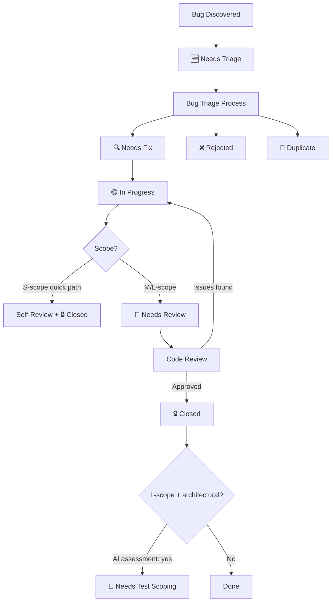

# Bug Tracking

This document tracks the lifecycle of bugs and issues in the LinkWatcher project, providing a systematic approach to bug identification, triage, resolution, and verification.

<strong>📋 Table of Contents</strong>

- [Status Legends](#status-legends)
  - [Bug Status](#bug-status)
  - [Priority Levels](#priority-levels)
  - [Scope Levels](#scope-levels)
  - [Source Types](#source-types)
- [Bug Management Workflow](#bug-management-workflow)
- [Bug Registry](#bug-registry)
  - [Critical Bugs](#critical-bugs)
  - [High Priority Bugs](#high-priority-bugs)
  - [Medium Priority Bugs](#medium-priority-bugs)
  - [Low Priority Bugs](#low-priority-bugs)
- [Closed Bugs](#closed-bugs) (pointer → [archive](archive/bug-tracking-archive.md))
- [Bug Statistics](#bug-statistics)

## Status Legends

### Bug Status

| Symbol | Status        | Description                                                    | Next Task  |
| ------ | ------------- | -------------------------------------------------------------- | ---------- |
| 🆕     | Needs Triage  | Bug reported, awaiting evaluation and prioritization           | PF-TSK-041 |
| 🔍     | Needs Fix     | Triaged and prioritized, ready for bug fixing                  | PF-TSK-007 |
| 🟡     | In Progress   | Bug is currently being investigated or fixed                   | —          |
| 👀     | Needs Review  | Fix implemented and tested, awaiting Code Review verification  | PF-TSK-005 |
| 🔒     | Closed        | Reviewed, verified, and resolved                               | —          |
| 🔄     | Reopened      | Previously closed bug has recurred — needs re-triage           | PF-TSK-041 |
| ❌     | Rejected      | Not a bug, won't fix, or other rejection rationale — terminal state | —     |
| 🚫     | Duplicate     | Duplicate of another existing bug — terminal state             | —          |

### Priority Levels

| Priority | Description                                 | Response Time     |
| -------- | ------------------------------------------- | ----------------- |
| Critical | System breaking, security issues            | Immediate         |
| High     | Major functionality affected                | Within 24 hours   |
| Medium   | Minor functionality affected                | Within 1 week     |
| Low      | Cosmetic or enhancement requests            | When time permits |

### Scope Levels

| Scope | Description                                                      |
| ----- | ---------------------------------------------------------------- |
| S     | Small — single-session fix, no state file needed                 |
| M     | Medium — may span sessions, state file recommended               |
| L     | Large — multi-session, state file required (New-BugFixState.ps1) |

### Source Types

| Source                 | Description                              |
| ---------------------- | ---------------------------------------- |
| Testing                | Discovered during test execution         |
| Test Development       | Found during test implementation         |
| Test Audit             | Discovered during test audit process     |
| E2E Testing            | Discovered during E2E acceptance testing |
| User Report            | Reported by end users                    |
| Code Review            | Found during code review process         |
| Feature Development    | Found during feature implementation      |
| Foundation Development | Found during foundational feature work   |
| Code Refactoring       | Discovered during refactoring activities |
| Deployment             | Found during release deployment          |
| Monitoring             | Detected by system monitoring            |
| Development            | Found during general development work    |

## Bug Management Workflow

```mermaid
graph TD
    A[Bug Discovered] --> B[🆕 Needs Triage]
    B --> C[Bug Triage Process]
    C --> D[🔍 Needs Fix]
    C --> L[❌ Rejected]
    C --> M[🚫 Duplicate]
    D --> E[🟡 In Progress]
    E --> F{Scope?}
    F -->|S-scope quick path| G[Self-Review + 🔒 Closed]
    F -->|M/L-scope| H[👀 Needs Review]
    H --> I[Code Review]
    I -->|Approved| K[🔒 Closed]
    I -->|Issues found| E
    K --> N{L-scope + architectural?}
    N -->|AI assessment: yes| O[🔎 Needs Test Scoping]
    N -->|No| P[Done]
```

## Bug Registry

### Critical Bugs

| ID | Title | Status | Priority | Scope | Reported | Description | Related Feature | Workflows | Dims | Notes |
| --- | --- | --- | --- | --- | --- | --- | --- | --- | --- | --- |
| _No critical bugs currently active_ |

### High Priority Bugs

| ID | Title | Status | Priority | Scope | Reported | Description | Related Feature | Workflows | Dims | Notes |
| --- | --- | --- | --- | --- | --- | --- | --- | --- | --- | --- |
| _No high priority bugs currently active_ |

### Medium Priority Bugs

| ID | Title | Status | Priority | Scope | Reported | Description | Related Feature | Workflows | Dims | Notes |
| --- | --- | --- | --- | --- | --- | --- | --- | --- | --- | --- |
| PD-BUG-122 | Check-then-register across two lock acquisitions can orphan a pending link recalc | 🆕 Needs Triage | Medium |  | 2026-08-17 | The PD-BUG-119 lock makes each move-memory operation atomic, but the check-then-register PAIR is not: _lookup_recent_move(K) misses and releases the lock, then _register_pending_recalc(K) re-acquires it. If the other move thread completes record_move(K) AND apply_pending_recalcs(K) in that gap, the registration lands under a key already applied. Nothing pops it again, so the deferred repair never runs and the link stays stale, with no exception and no log line. | 2.2.1 | WF-001, WF-004 | DI OB | Source: CodeReview; Environment: Development; Component: Link updating - ReferenceLookup move memory; Repro: 1. Start from current repo source with the PD-BUG-119 fix applied. 2. Drive ReferenceLookup._calculate_updated_relative_path for a link whose resolved old target K does not exist on disk - this is the path that calls _lookup_recent_move and then _register_pending_recalc. 3. Between that internal miss and the register call, run a competing thread that executes record_move(K, new) followed by apply_pending_recalcs(K) to completion - the exact ordering handler._handle_file_moved uses at lines 449 and 506. 4. Inspect _pending_recalcs.; Expected: Either the concurrent apply consumes the registration, or the link is rewritten directly from move memory. No pending entry is left under a key whose apply has already run.; Actual: The link is left stale and _pending_recalcs retains an orphaned entry under K. No exception, no warning, no log line. Nothing in production calls apply_pending_recalcs(K) again, because the K move event has already been processed.; Evidence: Found during Code Review (PF-TSK-005) of the PD-BUG-119 fix, 2026-08-17, before that fix was released. Confirmed by probe against current repo source driving the real _calculate_updated_relative_path: link left as ../doc/vacated.md, competing apply consumed 0 entries, K present in _recent_moves, and _pending_recalcs retaining an entry keyed doc/vacated.md holding (docs/old.md, docs/new.md). Probability is materially lower than the races PD-BUG-119 fixed: the competing thread must complete an entire move-processing pass (record_move, find_references, reference updates, update_links_within_moved_file, apply_pending_recalcs) between two adjacent statements, whereas the fixed races needed only a single-instruction interleave - Low is defensible at triage. Suggested fix (Scope S, about 6 lines): have _register_pending_recalc re-check _recent_moves under the SAME lock and return the mapped target so the caller recalculates immediately instead of deferring. That closes the window completely because record_move(K) always happens-before apply_pending_recalcs(K) on the same thread in both handler paths (handler.py 449 then 506; directory move Phase 0 then Phase 1.6). Note that the TDD thread-safety section and the test-spec Move-Memory Thread Safety section both currently assert the stronger contract that no deferred repair is lost; if this is not fixed, that wording needs a documented residual instead. |
| PD-BUG-123 | LinkWatcherConfig.validate() raises on type-invalid values instead of reporting them as issues | 🆕 Needs Triage | Medium |  | 2026-08-17 | validate() and _from_dict neither coerce nor type-check config values, so a well-formed YAML config carrying a wrongly typed value raises out of the loader instead of appearing in the issue list validate() exists to return. The daemon calls validate() during startup, so instead of the precise config_issue lines written just below that call, the operator gets a generic fatal_error with a raw Python message and exit 1. | 0.1.3 |  | DI,CQ,OB | Source: Development; Environment: Development; Component: Configuration System; Repro: 1. Write a config file containing exactly: log_level: 5 . 2. Call LinkWatcherConfig.from_file(path) then .validate(), or start the daemon with --config pointing at that file. 3. Observe AttributeError rather than an issue list naming log_level. Repeat with max_file_size_mb: big / move_detect_delay: x / monitored_extensions: 7 for the TypeError variants.; Expected: validate() returns an issue list naming the offending key and its expected type, e.g. log_level must be one of DEBUG, INFO, WARNING, ERROR, CRITICAL. The daemon then logs one config_issue per entry and exits 1 with an actionable message.; Actual: validate() raises AttributeError or TypeError. The daemon logs fatal_error with error_type AttributeError and the raw Python message, so the operator is never told which key is wrong. Any caller treating validate() as non-raising loses whatever work it was holding.; Evidence: Reproduced across four value types 2026-08-17 during Feature Enhancement of feature 7.1.1. Sites: log_level: 5 hits self.log_level.upper() at src/linkwatcher/config/settings.py line 427; max_file_size_mb and move_detect_delay hit numeric comparisons at lines 422 and 440; monitored_extensions: 7 hits set(value) in _from_dict at line 294, before validate() is reached. Daemon call site: main.py line 453, inside the top-level except Exception handler at line 500. Surfaced as Code Review finding CR-3 on the Control Panel (feature 7.1.1), whose save pipeline was one affected caller; the panel side is fixed independently in config_edit.save_config because a pane must handle anything an external module throws. This bug is the remaining root cause and also degrades daemon startup diagnostics. |
| PD-BUG-124 | Restored trailing backslash breaks string literals in rewritten .py and .json files | 🆕 Needs Triage | Medium |  | 2026-08-18 | Trailing-separator restoration appends a bare backslash when the authored path used backslashes. In a Python or JSON string literal that backslash escapes the closing quote, so the rewritten line becomes an unterminated string literal and the file stops parsing. Both recalculation paths emit it through the shared utils.apply_trailing_separator_style: PathResolver (PD-BUG-118, references in other files) and reference_lookup (PD-BUG-120, links inside a moved file, single-segment result). | 2.2.1 | WF-001, WF-002 | DI | Source: CodeReview; Environment: Development; Component: Link updating - trailing separator restoration; Repro: 1. In a watched project create a directory logs/ containing any file. 2. Create collect.py at the project root containing the line: LOG = "logs\\" (a doubled backslash, the only valid way to write a trailing backslash in a Python string). 3. With LinkWatcher running, rename the directory logs to logs2. 4. Read collect.py: the line is now LOG = "logs2\" and ast.parse reports unterminated string literal. Variant through the second path: put the line LOG = "..\\logs\\" in sub/collect.py and move sub/collect.py to the project root; the line becomes LOG = "logs\".; Expected: A rewrite never leaves the containing file invalid. Where the authored path sits in an escaped-string context, the emitted separator preserves the authored escaping (a doubled backslash stays doubled), or the rewrite is skipped and logged rather than written.; Actual: The emitted single backslash escapes the closing quote, so the file is written with an unterminated string literal. The daemon logs only moved_file_links_updated links_updated=1 - no warning that the write broke the file.; Evidence: Found during Code Review (PF-TSK-005) of the PD-BUG-120 fix on 2026-08-18, before that change set was released. Verified end to end against current repo source by driving the real service: (a) PathResolver path - directory move logs to logs2 turned LOG = "logs\\" into LOG = "logs2\", ast.parse raises SyntaxError unterminated string literal; (b) ReferenceLookup path - moving sub/collect.py to the project root turned LOG = "..\\logs\\" into LOG = "logs\", same SyntaxError. Controls unaffected: forward-slash forms, and multi-segment backslash forms (LOG = "logs\\" moved deeper yields "../logs/", which parses). The class was introduced by PD-BUG-118 (already closed, same helper) and its reach extended by PD-BUG-120; .ps1 is not exposed because PowerShell escapes with a backtick, .json is exposed the same way as .py. Fixer note: test_backslash_target_preserves_trailing_backslash in test/automated/unit/2-link-parsing-update/2-0-link-parsing-update/test_updater.py deliberately asserts the path-level preservation, so a fix must reconcile with it - the gap is escaping-awareness, not the preservation rule. Secondary defect in the same branch: the restored separator follows the style of the result when the result contains a separator but falls back to the authored style when it does not, so one authored form yields a trailing backslash for a single-segment result and a forward slash for a multi-segment one - fix both together. Proposed scope S to M. Severity proposed Medium: impact high (a source file stops parsing), frequency low (valid Python requires the doubled-backslash form), detectability high (the file fails loudly, unlike PD-BUG-118); High is defensible on silent corruption of user source files. |
| PD-BUG-125 | Control Panel poll-cycle logging test fails only in a full-suite run (order-dependent) | 🆕 Needs Triage | Medium |  | 2026-08-18 | test_poll_cycle_duration_is_logged (CR-13 / INT-10, added 2026-08-18) passes alone, with its own panel suite, and across the whole unit tree, but fails in a full-suite run: caplog holds no poll_cycle record. Bisection implicates the performance suite - the failure appears only when test/automated/performance runs ahead of the unit tree. Mechanism not pinned; the panel logger sets propagate = False (panel_log.py:64) and the test guards level only. An order-dependent test cannot be the CR-13 pin. | 7.1.1 |  | CQ | Source: Testing; Environment: Development; Component: Test suite / Control Panel discovery tests; Repro: 1. Run the full suite: Run-Tests.ps1 -All (or python -m pytest test/automated/). 2. Observe test_panel_discovery.py::test_poll_cycle_duration_is_logged FAILS. 3. Run it alone, or run its whole directory (test/automated/unit/7-operations-control/7-1-control-panel/, 314 tests), or run the whole unit tree (test/automated/unit, 1324 tests): PASSES every time.; Expected: The test passes deterministically regardless of what else runs in the same pytest session - a suite-order-dependent test cannot be trusted as the CR-13 instrumentation regression pin.; Actual: assert [] - caplog holds no record whose message contains poll_cycle, so the assertion fails, turning an otherwise green full-suite run red.; Evidence: Full suite 2026-08-18: 1 failed, 1331 passed, 3 skipped, 6 deselected, 4 xfailed. Isolation runs: single test PASSES; panel dir 314 PASSED; test/automated/unit 1324 PASSED. Bisection: test/automated/ minus performance gives 1324 PASSED (green); performance + test_config + the single test PASSED, so the performance suite alone is not sufficient - it needs the unit tree running after it. Independent of PD-BUG-121: the same failure reproduces with every installer test excluded from the run (1 failed, 1297 passed). No logging.disable / structlog.configure / setLevel call appears in test/automated/performance or test/automated/conftest.py, so the mechanism is indirect. Test at test_panel_discovery.py:626; panel logger propagate = False at src/linkwatcher/linkwatcher_control_panel/panel_log.py:64. |

### Low Priority Bugs

| ID | Title | Status | Priority | Scope | Reported | Description | Related Feature | Workflows | Dims | Notes |
| --- | --- | --- | --- | --- | --- | --- | --- | --- | --- | --- |
| _No low priority bugs currently active_ |

## Closed Bugs

> 🗄️ **Archived** — Closed and rejected bug rows live in [archive/bug-tracking-archive.md](archive/bug-tracking-archive.md) (sibling file, split 2026-05-26 per PF-IMP-872 to keep this file scannable as the closed/rejected history grows).
>
> `Update-BugStatus.ps1` reads and writes the archive automatically when transitioning to `Closed` / `Rejected` / `Reopened`. The archive holds two sections: `## Closed Bugs` (fixed) and `## Rejected Bugs` (not-a-bug / won't-fix) — kept distinct so trend analysis can separate "we fixed it" from "we decided not to fix it."

## Bug Statistics

### Current Status Summary

- **Total Active Bugs**: 4
- **Critical**: 0
- **High**: 0
- **Medium**: 4 (PD-BUG-122, PD-BUG-123, PD-BUG-124, PD-BUG-125)
- **Low**: 0
- **All Triaged**: No — PD-BUG-124 filed 2026-08-18 by Code Review (PF-TSK-005) of the PD-BUG-120 fix, awaiting triage (severity proposed Medium, scope S to M; the report argues High is defensible on silent corruption of source files). PD-BUG-123 also awaits triage. Prior: PD-BUG-122 filed 2026-08-17 by Code Review (PF-TSK-005) of the PD-BUG-119 fix, awaiting triage (severity proposed Medium, scope S; the report argues Low is defensible). Prior: PD-BUG-120 and PD-BUG-121 triaged 2026-08-17, both High/S confirmed as proposed. PD-BUG-120: description corrected (the PD-BUG-114 authored-form guard already prevents separator-only rewrites, so damage occurs only on legitimate rewrites), three uncovered return sites not one, fix after the PD-BUG-119 review lands (same function). PD-BUG-121: Related Feature corrected 7.1.1 → 0.1.1 (installer is process-owned tooling, no owning feature; PD-BUG-104 precedent), no workflows, root-cause option recorded for the fixer (stop_daemons_using_venv may make stop_running_linkwatcher removable). Prior: PD-BUG-118 triaged 2026-08-17, Critical/M confirmed, mechanism re-framed from removal pass to reference-update pass; PD-BUG-119 triaged 2026-08-17, Medium→High, fix before the PD-BUG-114 change set ships; PD-BUG-117 triaged 2026-08-10, Low→Medium, fix scope widened to the normal-condition-WARNING class; PD-BUG-116 triaged 2026-08-10; PD-BUG-114 triaged 2026-08-09; PD-BUG-115 rejected same day, reclassified to PD-FRQ-018)

---

## Integration with Feature Tracking

When bugs are related to specific features, they should reference the feature ID from [Feature Tracking](feature-tracking.md). This enables:

1. **Impact Assessment**: Understanding which features are affected by bugs
2. **Priority Alignment**: Aligning bug priority with feature priority
3. **Release Planning**: Ensuring critical bugs are fixed before feature releases
4. **Testing Coordination**: Coordinating bug fixes with feature testing

## Integration with Process Framework

This bug tracking system integrates with the following process framework components:

### Bug Management Tasks

- **[Bug Triage Task](../../../process-framework/tasks/06-maintenance/bug-triage-task.md)**: For bug evaluation and prioritization
- **[Bug Fixing Task](../../../process-framework/tasks/06-maintenance/bug-fixing-task.md)**: For bug resolution workflow

### Development Tasks with Bug Discovery Integration

- **[Data Layer Implementation (PF-TSK-051)](../../../process-framework/tasks/04-implementation/data-layer-implementation.md)**: Bug discovery during data model and repository work
- **[Integration & Testing (PF-TSK-053)](../../../process-framework/tasks/04-implementation/integration-and-testing.md)**: Bug discovery during integration testing and test development
- **[Implementation Finalization (PF-TSK-055)](../../../process-framework/tasks/04-implementation/implementation-finalization.md)**: Bug discovery during finalization
- **[Feature Enhancement (PF-TSK-068)](../../../process-framework/tasks/04-implementation/feature-enhancement.md)**: Bug discovery during enhancement work
- **[Foundation Feature Implementation Task](../../../process-framework/tasks/04-implementation/foundation-feature-implementation-task.md)**: Bug discovery during foundational work
- **[Test Audit Task](../../../process-framework/tasks/03-testing/test-audit-task.md)**: Bug discovery during test auditing
- **[Code Review Task](../../../process-framework/tasks/06-maintenance/code-review-task.md)**: Bug discovery during code reviews
- **[Code Refactoring Task](../../../process-framework/tasks/06-maintenance/code-refactoring-task.md)**: Bug discovery during refactoring
- **[Release Deployment Task](../../../process-framework/tasks/07-deployment/release-deployment-task.md)**: Bug discovery during deployment

### Automation Integration

All development tasks use the **`New-BugReport.ps1`** script for standardized bug reporting, ensuring consistent bug documentation and automatic integration with this tracking system.

## Usage Guidelines

### Adding New Bugs

#### Automated Method (Recommended)

Use the **`New-BugReport.ps1`** script for standardized bug creation:

- Automatically generates sequential PD-BUG-XXX IDs
- Ensures consistent formatting and required fields
- Integrates with development task workflows
- Creates bug report documents and updates this tracking file

#### Manual Method

1. Use the next sequential bug ID (PD-BUG-001, PD-BUG-002, etc.)
2. Start with status 🆕 Needs Triage
3. Fill in all required fields
4. Place in appropriate priority section
5. Reference related feature ID if applicable

### Updating Bug Status

1. Update the status symbol and any relevant fields
2. Add notes about status changes
3. Move bugs between priority sections if priority changes
4. Update statistics section

### Closing Bugs

Use `Update-BugStatus.ps1 -NewStatus "Closed"` which automatically:
1. Changes status to 🔒 Closed
2. Moves the bug entry from its active priority table to the Closed Bugs section
3. Recalculates Bug Statistics (active counts, resolved count)
4. Appends verification notes and timestamp

### Reopening Bugs

Use `Update-BugStatus.ps1 -NewStatus "Reopened" -ReopenReason "reason"` which automatically:
1. Changes status to 🔄 Reopened
2. Moves the bug entry from the Closed Bugs section back to the correct active priority table
3. Recalculates Bug Statistics (active counts, resolved count)
4. Appends reopen reason and timestamp

After reopening, re-evaluate priority and scope through [Bug Triage](../../../process-framework/tasks/06-maintenance/bug-triage-task.md#steps-to-reopen-a-bug).

### Bug ID Format

- **Format**: PD-BUG-XXX (where XXX is a sequential number)
- **Examples**: PD-BUG-001, PD-BUG-002, PD-BUG-003
- **Scope**: Project-wide unique identifiers following Product Documentation (PD) naming convention
- **Automated Creation**: When using `New-BugReport.ps1`, IDs are automatically generated in the correct format

---

_This document is maintained as part of the Process Framework State Tracking system and should be updated whenever bugs are reported, triaged, fixed, or closed._
