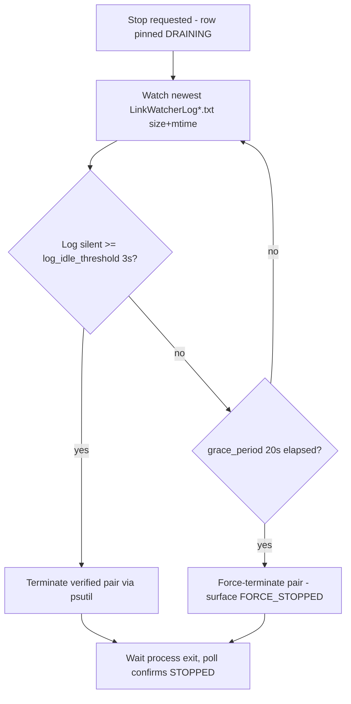

# Lightweight Technical Design Document: LinkWatcher Control Panel

## 1. Overview

### 1.1 Purpose

Technical design for the LinkWatcher Control Panel — the project's first GUI surface: a single-window Tkinter/ttk desktop application that lists every registered project's daemon state, starts and stops daemons, tails logs, views/edits per-project configuration, triggers link validation, and drains-then-terminates all managed daemons when the window closes. The panel is a **pure supervisor**: it introduces no new daemon-side contract (stop-sentinel deferred per [PD-FDD-034](../../../../functional-design/fdds/fdd-7-1-1-linkwatcher-control-panel.md)) and manages daemons entirely through existing external surfaces — the lock file, OS process state, the launcher script, the CLI's `--validate` mode, log files, and the per-project YAML config.

### 1.2 Related Features

- **0.1.1 Core Architecture** — provides the `main.py` CLI entry point and the `.linkwatcher.lock` per-project singleton lock (PID-bearing) that daemon identity resolution is built on.
- **0.1.3 Configuration System** — provides `LinkWatcherConfig.from_file()` / `.validate()`, which the config editor reuses for validate-on-save; the panel edits each project's `tools/linkwatcher/linkwatcher-config.yaml`.
- **3.1.1 Logging & Monitoring** — provides the per-project `logs/linkwatcher/LinkWatcherLog.txt` (with timestamp-rotated siblings) that the log pane tails and the drain heuristic watches.
- **6.1.1 Link Validation** — provides the `--validate` scan the Validation pane runs as a short-lived subprocess (no lock contention with the daemon).
- **`SessionStart` hook / launcher scripts** (process infrastructure, not a product feature) — `start_linkwatcher_background.ps1` remains the daemon start path; the hook wrapper additionally auto-opens the panel.

### 1.3 Workflow Context

**Workflows**: WF-010 (Manage running LinkWatcher instances via Control Panel — this feature is the workflow's sole UI surface), WF-009 (Link health audit — the panel is an alternative GUI trigger alongside `python main.py --validate`). Source: FDD Workflow Participation section.

## 2. Key Requirements

| ID | Requirement | Source |
|----|-------------|--------|
| KR-01 | Displayed daemon state always converges on real process state (external starts/stops included) within ≤ 5 s, and the panel never acts on a dead process or stale lock | FDD 7-1-1-FR-1/FR-4, EC-1/EC-3 |
| KR-02 | Stop and window-close drain in-flight daemon work before terminating, bounded by a configurable grace period (default 20 s) — the window can never hang on close, and forced termination is surfaced, never silent | FDD 7-1-1-FR-7, BR-3/BR-7, AC-9 |
| KR-03 | The panel only ever starts/terminates the correct per-project daemon pair — identification requires lock-PID + command-line + project-root agreement, and start goes through the existing launcher's singleton guards | FDD BR-1/BR-2, EC-2, AC-10 |
| KR-04 | Exactly one panel instance exists; a second launch (manual or hook auto-open) surfaces the existing window | FDD FR-8, BR-8, EC-9, AC-11 |
| KR-05 | Config edits are validated with LinkWatcher's own config loader before saving; invalid YAML is never persisted, and restart-needed is made explicit | FDD FR-9, BR-9, EC-10/EC-11, AC-12 |

## 3. Quality Attribute Requirements

> Feature has no Dimension Profile yet (Feature Implementation Planning runs after this TDD), so all subsections use standard Tier 2 depth. Reliability is the dominant attribute for this feature; Usability visuals are owned by the approved UI Design ([PD-UIX-003](../../../design/ui-ux/features/ui-design-7-1-1-linkwatcher-control-panel.md)) — this TDD owns their mechanics.

### 3.1 Performance Requirements

- **Response Time**: Displayed daemon state converges on real state ≤ 5 s (poll interval 2.5 s default). UI thread is never blocked by I/O — all process enumeration, drain waits, and subprocess runs happen off-thread; perceived UI latency for local interactions stays under ~100 ms.
- **Throughput**: N/A (single operator, no request load). The one rate-sensitive path is log tailing: appends must be incremental (never re-read the full file per tick) and must keep up with debug-level log bursts without visual churn.
- **Resource Usage**: Ambient footprint — near-zero CPU when idle (only the poll tick); log pane memory bounded by a fixed tail buffer (1,000 lines) regardless of log file size; no polling of logs for projects that aren't selected.

### 3.2 Security Requirements

- **Authentication / Authorization**: None — local, single-user desktop tool operating on the user's own processes and files (per tier assessment: standard security posture).
- **Data Protection**: No secrets, no network egress. The single-instance socket binds to `127.0.0.1` only and accepts a trivial fixed protocol (`SURFACE`), so it exposes no remote or data surface.
- **Input Validation**: Config editor text is validated (YAML parse + `LinkWatcherConfig.validate()`) before any write; registry and lock-file contents are treated as untrusted inputs (malformed → surfaced as error states, never crash).
- **Process-termination correctness** (the real security-adjacent concern): termination requires three-way agreement — lock-file PID, process command line containing `main.py`, and the project root in the command line — before any process is killed. A PID match alone is never sufficient (PIDs get recycled).

### 3.3 Reliability Requirements

- **Error Handling**: Every external surface can fail independently and is rendered as a pane-local error state (start failure with launcher reason, validation failure with subprocess reason, config read error, missing log) — one project's failure never takes down the panel or affects other rows.
- **Availability**: Panel crash or kill must leave daemons running and unharmed (daemons are fully independent processes; the panel holds no resource they need). No state is lost that cannot be rebuilt by the next poll.
- **Data Integrity**: Inherited from the daemon's atomic-write guarantee — even force-termination cannot corrupt a file; the bounded loss is in-flight move-correlations only (FDD BR-7). Config saves are write-temp-then-rename so an interrupted save never truncates the config.
- **Monitoring**: The panel *is* the monitoring surface; its own diagnostics go to a panel log (`<install>/logs/panel.log`, small rotating file) so panel misbehavior is diagnosable without a console.

### 3.4 Usability Requirements

- **User Experience**: Truthful-state principle from PD-UIX-003 — rows show transitional states (Starting…, Stopping — draining…) sourced from observed process state, never optimistic assumptions; all interactions ≤ 2 steps (select row → act).
- **Accessibility**: per PD-UIX-003 §5 — full keyboard operability (accelerators, arrow-key list navigation, visible focus) and glyph+text status pairing (never color-only). Screen-reader support is out of scope for this tool (single-operator internal utility).
- **Loading States**: Toolkit-native indeterminate progress for validation runs; determinate progress in the shutdown dialog; in-flight rows disable their action buttons until the transition resolves.
- **Error Messages**: Always state what failed and why, sourced from the failing surface (launcher stderr/exit code, subprocess output, YAML parse error with line number), rendered in the notice line / status bar / pane state per PD-UIX-003.

## 4. Technical Design

### 4.0 Component Architecture

New subpackage `src/linkwatcher/linkwatcher_control_panel/` (already scaffolded), plus a thin `control_panel.py` entry script beside `main.py` (mirrors the deployed flat install layout; the daemon CLI is untouched).

```mermaid
graph TD
    classDef critical fill:#f9d0d0,stroke:#d83a3a
    classDef important fill:#d0e8f9,stroke:#3a7bd8
    classDef reference fill:#d0f9d5,stroke:#3ad83f

    Entry[/control_panel.py entry script/] --> App([app.py - Tk root, wiring, shutdown orchestration])
    App --> SingleInstance([single_instance.py - localhost socket guard])
    App --> Model[(model.py - AppModel observable state)]
    App --> Views[views/ - main window, panes, shutdown dialog]
    Views -.-> Model
    Poller([discovery.py - poll thread: registry + locks + psutil]) --o--> Model
    App --> Lifecycle([lifecycle.py - start / drain / terminate])
    Lifecycle --> Launcher>start_linkwatcher_background.ps1]
    Lifecycle --> OSProcs>OS processes via psutil]
    Views --> LogTail([log_tail.py - incremental tail, rotation-aware])
    LogTail --> LogFiles[/logs/linkwatcher/LinkWatcherLog*.txt/]
    Views --> Validation([validation.py - --validate subprocess])
    Validation --> CLI>main.py --validate]
    Views --> ConfigEdit([config_edit.py - read / validate / atomic save])
    ConfigEdit --> Cfg[/tools/linkwatcher/linkwatcher-config.yaml/]
    Poller --> Registry[/project-registry.json/]

    class App,Lifecycle,Poller critical
    class Model,Views,SingleInstance important
    class LogTail,Validation,ConfigEdit reference
```

Threading model: **UI thread** (Tk mainloop) renders and dispatches; **poller thread** (discovery) and **per-action worker threads** (start, drain/stop, validation) do all blocking work and post results to a thread-safe queue that a `root.after(100)` dispatcher applies to the model on the UI thread. Tk widgets are only ever touched from the UI thread.

### 4.1 Data Models

All in-memory dataclasses — no persistence beyond the panel settings file (below). Rebuilt from external reality on every poll.

```python
class DaemonStatus(Enum):        # rendering + action enablement both key off this
    RUNNING, STOPPED, STARTING, DRAINING, FORCE_STOPPED, START_FAILED, STALE_LOCK

@dataclass
class ProjectInfo:               # one per registry entry (static per poll cycle)
    project_id: str              # e.g. "PRJ-001"
    name: str
    root: Path
    config_path: Path            # <root>/tools/linkwatcher/linkwatcher-config.yaml
    log_dir: Path                # <root>/logs/linkwatcher

@dataclass
class DaemonSnapshot:            # one per project, produced by discovery each poll
    project: ProjectInfo
    status: DaemonStatus
    pids: list[int]              # the verified process pair (may be 1 or 2 PIDs)
    started_at: float | None     # psutil create_time -> uptime rendering
    detail: str | None           # e.g. stale-lock tooltip text, start-failure reason

@dataclass
class ValidationRun:             # per project; persists until next run / project switch
    state: Literal["idle", "running", "ok", "broken", "failed"]
    broken_count: int | None
    report_path: Path | None
    error: str | None

class AppModel:                  # single observable model (PD-UIX-003 §10.2)
    snapshots: dict[str, DaemonSnapshot]   # keyed by project_id (selection survives refresh)
    validation: dict[str, ValidationRun]
    selected_project_id: str | None
    last_refresh: datetime
    shutting_down: bool          # global mode: disables all other interaction
    def subscribe(self, callback) -> None   # views re-render on change notification
```

**Panel settings** — `panel-config.yaml` in the install directory (beside `main.py`), loaded at startup, all keys optional:

```yaml
grace_period_seconds: 20      # drain upper bound (checkpoint-approved default)
log_idle_threshold_seconds: 3 # log silent this long => daemon considered quiescent
poll_interval_seconds: 2.5    # discovery cadence
project_registry: C:/path/to/project-registry.json   # optional override
```

Registry resolution order: `--registry` CLI arg → `LINKWATCHER_PROJECT_REGISTRY` env var → `project_registry` key in `panel-config.yaml` → **`.framework-central-pointer` discovery** → error banner with guidance (distinct from the *empty registry* case, which is the calm EC-8 empty state). The pointer tier (added during Core Logic Implementation Phase A, checkpoint-approved 2026-07-27) reads `<project-root>/process-framework/.framework-central-pointer` — the project root taken from an explicit `--project-root` first, then a cwd walk-up — and joins `process-framework-central/project-registry.json`, counting only when that file exists. It reuses the framework's canonical "where is central?" locator so the hook-auto-opened panel is zero-config (the hook passes its own `--project-root`; a manual launch from inside any registered project is found by the walk-up), rather than introducing a second source of truth for central's location.

### 4.2 UI Components

Visual/interaction design is owned by [PD-UIX-003](../../../design/ui-ux/features/ui-design-7-1-1-linkwatcher-control-panel.md) (approved); this section maps its components to Tkinter/ttk widgets — the toolkit decision this TDD makes (**Decision D-T1**, checkpoint-approved: stdlib Tkinter over PySide6; zero new dependency, and the UI design's toolkit-conservative envelope requires only standard widgets. Accessibility fallback to Qt recorded in §8).

| PD-UIX-003 component | Widget realization | Technical notes |
|---|---|---|
| Main window shell (§2.2 Screen 1) | `tk.Tk` + `ttk.PanedWindow` (horizontal splitter) + toolbar `ttk.Frame` + status-bar `ttk.Label` | `WM_DELETE_WINDOW` protocol handler routes close → shutdown orchestration (§4.4), never direct destroy |
| Daemon list | `ttk.Treeview` (columns mode: Project / Status / Uptime) | Rows keyed by `project_id` — updated in place per poll (no rebuild → no flicker, selection survives); status cell = glyph + label text; per-status foreground via tags mapped to PD-UIX-001 tokens |
| Detail tabs | `ttk.Notebook` (Log / Configuration / Validation) | Tab content re-binds when list selection changes; unsaved-config guard intercepts the switch |
| Log pane | read-only `tk.Text` + `ttk.Checkbutton` (auto-scroll) | Appends via `insert('end')` + bounded-buffer trim; scroll-lock = auto-scroll pauses when user scrolls up (§4.5) |
| Config editor | `tk.Text` (editable, Consolas) + Save/Discard `ttk.Button` + notice `ttk.Label` | Dirty tracking via `<<Modified>>` event; save flow in §4.6 |
| Validation pane | `ttk.Button` + `ttk.Progressbar` (indeterminate) + state labels | State machine mirrors `ValidationRun.state`; one visible state at a time |
| Shutdown dialog | `tk.Toplevel`, modal (`grab_set`), no close button (`overrideredirect` avoided — use `protocol` no-op so the title bar stays native) | Per-daemon row labels + determinate `ttk.Progressbar`; exits app when all rows terminal |
| Empty / error states | centered `ttk.Label` blocks swapped into panes | One builder shared by all panes |

All widgets render from the model only (one-way); user actions never mutate widget state directly — they dispatch operations whose observed results update the model.

### 4.3 State Management

Single observable `AppModel` (one-way data flow, per PD-UIX-003 §10.2). Data flow per poll cycle and per user action:

```mermaid
graph TD
    classDef critical fill:#f9d0d0,stroke:#d83a3a
    classDef important fill:#d0e8f9,stroke:#3a7bd8

    Registry[/project-registry.json/] --> Poller([Poller thread, every 2.5s])
    Locks[/.linkwatcher.lock per project/] --> Poller
    Procs>psutil process table] --> Poller
    Poller --o--> Queue[(thread-safe queue)]
    Actions([Action workers: start / drain / validate]) --o--> Queue
    Queue --> Dispatcher([UI-thread dispatcher, root.after 100ms])
    Dispatcher --> Model[(AppModel)]
    Model --> Views[views re-render changed rows/panes]
    Views -->|user action| Actions

    class Poller,Model critical
    class Dispatcher,Actions important
```

- **Reconciliation rule**: the poller's snapshot is authoritative for RUNNING/STOPPED/STALE_LOCK; *panel-initiated transitional states* (STARTING, DRAINING) are pinned by the owning action worker and override poll results until the action resolves or times out — so a slow poll can't flicker a starting daemon back to "Stopped" (truthful-state requirement, FDD FR-4).
- **Transitional-state expiry**: every pinned state carries a deadline (start: launcher timeout + 5 s; drain: grace period + 5 s); if the deadline passes without resolution the pin is dropped and the poll truth wins — a hung action can never freeze a row permanently.
- **Selection & per-widget state** (splitter position, scroll-lock, dirty text, active tab) stay in the widgets/views — only shared operational state lives in the model.

### 4.4 Daemon Discovery & Lifecycle Control

**Discovery (per poll)** — for each registry project:

1. Read `<root>/.linkwatcher.lock` → candidate PID (absent → check for lockless orphans, below).
2. Verify via psutil: process exists **and** command line contains `main.py` **and** its `--project-root` argument names this project. Three-way agreement or it isn't that project's daemon (KR-03). The root test compares the **value** of `--project-root` after case-folding and separator normalization — not a literal substring of the command line. Two reasons, both observed during Core Logic Implementation Phase B: the registry stores `C:\…\LinkWatcher` while the running daemon's command line carries `c:\…\LinkWatcher`, so a literal comparison (what the launcher's `Test-LinkWatcherAlreadyRunning` does) misses the project's own live daemon; and a bare substring test would let root `C:\proj\App` match a daemon belonging to `C:\proj\AppExtra`. A process whose command line carries no `--project-root` (the flag defaults to the working directory, which is invisible in the command line) is unidentifiable and is therefore **never** claimed — the panel must never act on a process it cannot attribute. Refined again during the Code Review gap closure (2026-08-18, CR-4/CR-5): agreement is now **four-way**, because entry script + project root alone are also satisfied by a `main.py --validate` broken-link scan of the same project — a routine, documented workflow. Any flag that makes `main.py` do something and exit rather than run the watcher (`--validate`, `--version`, `--help`) disqualifies the process. Measured against the live process table: before this clause a real scan was claimed alongside the genuine daemon pair, so a stopped project rendered RUNNING and Stop or window-close would have terminated the scan mid-run and truncated its report. Relatedly, root extraction no longer regex-searches a *re-joined* argv: psutil always returns a split argv, so joining it only created false positives — a wrapper shell whose single quoted argument merely mentions `main.py … --project-root X` (the shape of `bash -c '…'` and the documented `pwsh -Command '& …'` form) was claimed as the daemon and became eligible for termination. The regex fallback now applies only to a genuine one-token command line.
3. Resolve the **process pair**: the daemon runs as venv-shim parent + base-interpreter child with near-identical command lines (established two-process pattern; the lock holds one of them). Discovery collects the verified process *plus* its parent/children that also match the command-line test — `pids` in the snapshot is the whole pair, and every lifecycle operation acts on the pair.
4. Classify, in this precedence order — **the process table is truth, the lock is diagnostic**:
   1. Lock PID passes the identity test and its pair is alive → RUNNING (uptime = oldest `create_time` of the pair).
   2. No lock-verified process, but the command-line scan (same rule as the launcher's `Test-LinkWatcherAlreadyRunning`) finds this project's daemon → RUNNING with a detail note explaining why the lock did not identify it — either *no lock file* (a genuine lockless orphan) or *a stale lock alongside a live daemon*. Refined during Phase B: checking the lock first would render a **running** daemon as not-running, leaving it unstoppable from its own supervisor — the precise blindness the panel exists to remove.
   3. A lock exists with nothing behind it — PID dead, PID recycled (alive but fails the identity test), or the lock is empty/corrupt → STALE_LOCK, rendered not-running with the reason, `pids` empty so nothing can be acted on (EC-1/EC-3).
   4. Neither → STOPPED. A registered project whose root no longer exists on disk is also STOPPED, carrying a "project root not found" detail so the row explains itself rather than silently vanishing from the listing (case not covered by the original four-way matrix).

**Start** — shell out to the project's own `process-framework/tools/linkWatcher/start_linkwatcher_background.ps1` (hidden window, captured output). This deliberately reuses the launcher's singleton guards, stale-lock reclaim, and crash disposition instead of reimplementing them; exit 0 = started/already-running (idempotent, EC-2/AC-10), exit 1 = START_FAILED with the captured stderr as the reason (EC-7). Row pinned STARTING until the poll observes the running pair.

**Stop / drain-then-terminate** (KR-02) — Windows offers no graceful cross-process signal (`terminate()` is a hard `TerminateProcess`; the daemon's SIGTERM handler is unreachable from another process), so drain is observational:



- The watcher targets the **newest** `LinkWatcherLog*.txt` in the project's log dir (rotation-safe — the active log may have been renamed).
- Honest limitation, accepted by FDD BR-7: log-idleness is a heuristic — a move-correlation buffered inside `move_detect_delay` may be silent and still get dropped. Atomic writes bound the damage to *dropped* (never corrupted) updates; the grace default (20 s) covers one full 10 s correlation window plus apply time.
- The daemon's own `release_lock()` never runs on `TerminateProcess`, so after confirmed exit the panel deletes the lock **only if** it still contains the terminated PID (same self-owned-lock rule as `main.py`).
- **Window close** runs the same drain per daemon, in parallel worker threads, behind the modal shutdown dialog; the app exits when every row reaches STOPPED/FORCE_STOPPED — bounded by the grace period, so close can never hang (AC-9).

### 4.5 Single Instance, Auto-Open & Log Tail

**Single instance** (KR-04): on startup, bind a `127.0.0.1` TCP socket on an ephemeral port and write the port to `<install>/panel.port` (atomically — same-directory temp + `os.replace`). A second launch reads the port file, connects, sends `SURFACE\n`, and exits; the first instance's listener thread posts a surface request to the UI thread (`deiconify` + `lift` + focus, with a `ctypes` `SetForegroundWindow` assist — Windows foreground-lock permitting, the window at minimum flashes in the taskbar). Connect failure ⇒ stale port file ⇒ the new launch takes over. This one mechanism covers both the single-instance rule and hook auto-open focus (EC-9/AC-11).

An incumbent is believed only when it **answers the handshake** with `LINKWATCHER-PANEL OK\n` (implementation refinement, Phase F): ephemeral ports are recycled, so a stale port file can name a port an unrelated process now owns, and treating a bare successful connect as "already running" would block the panel from ever opening again. The ack is what makes "connect failure ⇒ stale" trustworthy. Two further properties: bind failure is **fail-open** (the panel opens unguarded rather than not at all), and the port file is deleted on exit only when it still holds this instance's port — the self-owned-resource rule used for `.linkwatcher.lock` (§4.4). Simultaneous launches within the same few milliseconds can both acquire (two windows, never more); accepted as a Known Limitation rather than adding a second exclusion primitive.

**Hook auto-open** (FR-8): `start_linkwatcher_hook_wrapper.ps1` gains one detached, non-blocking call that launches the panel via the install venv's `pythonw.exe` (no console window). Idempotent by construction — a running panel just gets surfaced. The hook must not wait on the panel process (session start latency unchanged).

> **⚠️ Status (2026-08-18): NOT IMPLEMENTED.** The design above still stands, but the change does not exist. It was implemented and live-verified on 2026-08-10, never committed (feature 7.1.1 was untracked in git until 2026-08-17), and then reverted by the 2026-08-14 framework rollout. Verified at Code Review and again during the gap closure: `start_linkwatcher_hook_wrapper.ps1` carries no `pythonw` / `control_panel` / `Open-ControlPanel` reference in the working tree, at HEAD, or anywhere in git history. Re-implementation is tracked as **PF-IMP-2032** and must run through Process Improvement — the file is on the framework path, so a local edit is reverted by the next rollout. **FR-8, UI-7, BR-8 and the first clause of AC-11 are therefore UNMET**, and the panel's single-instance surfacing (the second clause) is what remains delivered.

**Log tail** (FR-5/EC-5): on selection, seek to `max(0, size - 64 KB)` and render the tail; thereafter a 500 ms UI-timer tick reads only appended bytes. Rotation/truncation detection: current file missing or size shrank ⇒ reattach to the newest `LinkWatcherLog*.txt` from the start. Display buffer capped at 1,000 lines (trim from top). No-log ⇒ placeholder state, never an error dialog.

### 4.6 Validation & Config Editing

**Validation** (FR-6/BR-6/EC-6): worker thread runs `<install-venv-python> main.py --validate --project-root <root>` plus `--config` when the per-project config exists (mirroring `run_linkwatcher_validate.ps1` semantics). `--validate` takes no lock, so the running daemon is untouched. Exit 0 → ok (0 broken); exit 1 with report → broken count parsed from the report/output, report path = `logs/linkwatcher/LinkWatcherBrokenLinks.txt`; nonzero with no report / spawn failure → failed with captured stderr. One run per project at a time (button disabled while running).

**Config editing** (KR-05): load raw text of `tools/linkwatcher/linkwatcher-config.yaml` (missing/unreadable → EC-10 read-error banner, editor disabled, "Create default config" action writes a minimal commented skeleton). Save pipeline: `yaml.safe_load` (parse errors reported with line numbers) → construct `LinkWatcherConfig` from the dict and run its `validate()` (reusing feature 0.1.3's rules — no second validator to drift) → write temp file in the same directory + `os.replace` (atomic; an interrupted save never truncates, and LinkWatcher's own-move handling sees a normal edit) → notice line. Restart-needed: the daemon reads config only at startup, so the "⚠ Saved. Restart the daemon to apply changes." notice shows **whenever the project's daemon is currently running** (BR-9) — no per-key hot-apply analysis in the MVP.

### 4.7 Quality Attribute Implementation

#### Performance Implementation

- All blocking work (psutil enumeration, subprocess runs, drain waits, file reads) on worker threads; the UI thread only renders queued model updates (§4.3) — meets the ≤ 100 ms interaction target by construction.
- Convergence ≤ 5 s from the 2.5 s poll plus in-place `Treeview` row updates (no rebuild).
- Log tail reads appended bytes only, renders into a 1,000-line capped buffer, and ticks only for the selected project (§4.5) — bounded memory and instant open on arbitrarily large logs.
- Poll cost is one registry read + one psutil pass per tick; with single-digit registered projects this is negligible (idle CPU target).

#### Security Implementation

- Three-way process identification before any terminate; lock deletion only when the lock still holds the terminated PID (§4.4).
- Single-instance socket: loopback bind, fixed one-verb protocol, no data accepted beyond the `SURFACE` token (§4.5).
- Config writes only after LinkWatcherConfig validation; atomic replace prevents partial writes (§4.6). Registry/lock contents parsed defensively.

#### Reliability Implementation

- Drain-then-terminate bounded by the 20 s grace period with visible FORCE_STOPPED surfacing (§4.4); shutdown dialog exits deterministically.
- Transitional-state pins carry deadlines so a hung action degrades to poll truth instead of freezing a row (§4.3).
- Per-surface error isolation: each pane renders its own failure state; worker-thread exceptions are caught, logged to the panel log, and rendered — never propagated to the mainloop.
- Panel holds no daemon-critical resource: crash-safety of daemons under panel failure is structural, not coded.

#### Usability Implementation

- Truthful state: rendered status is always poll-observed or a deadline-bounded pin — never an optimistic assumption (§4.3).
- Action enablement derives from `DaemonStatus` per row (Start only when STOPPED/STALE_LOCK, Stop only when RUNNING), matching PD-UIX-003 toolbar rules.
- Keyboard accelerators, focus order and glyph+text status tokens implemented per PD-UIX-003 §4–5; strings centralized in one module (single-language, per PD-UIX-003 §10.4).

## 5. Cross-References

### 5.1 Functional Requirements Reference

> **📋 Primary Documentation**: FDD Creation Task (PF-TSK-027)
> **🔗 Link**: [Functional Design Document — PD-FDD-034](../../../../functional-design/fdds/fdd-7-1-1-linkwatcher-control-panel.md)
> **👤 Owner**: FDD Creation Task

**Brief Summary**: Nine functional requirements covering the daemon list, start/stop, live log view, validation trigger, config view/edit, drain-then-terminate on window close, and hook auto-open — under the panel-owned shutdown lifecycle model (close = drain and terminate all managed daemons). This TDD implements those behaviors; requirements, business rules, and acceptance criteria are owned there and referenced by ID throughout §2 and §4.

### 5.2 UI Design Reference

> **📋 Primary Documentation**: UI Design Task (PF-TSK-090)
> **🔗 Link**: [UI/UX Design Document — PD-UIX-003](../../../design/ui-ux/features/ui-design-7-1-1-linkwatcher-control-panel.md) (approved 2026-07-12)
> **👤 Owner**: UI Design Task

**Brief Summary**: Master–detail single window with tabbed Log/Configuration/Validation panes, five wireframed screens, seven component specs, and the toolkit-conservative widget envelope this TDD's Tkinter decision satisfies. Visual tokens, spacing, accessibility requirements, and interaction behavior are owned there; §4.2 maps its components to concrete widgets.

### 5.3 API Specification Reference

> **📋 Primary Documentation**: API Design Task (PF-TSK-020) — **not invoked for the MVP**
> **👤 Owner**: N/A

**Brief Summary**: No new API contract — the panel wraps existing surfaces only (CLI incl. `--validate`, launcher script, OS process APIs, log files, config file). Standing caveat from PD-ASS-201: adopting the deferred **stop-sentinel** graceful-stop mechanism later would introduce a UI↔daemon Service-Interface contract and trigger API Design at that point.

### 5.4 Database Schema Reference

> **📋 Primary Documentation**: Database Schema Design Task (PF-TSK-021) — **not applicable**
> **👤 Owner**: N/A

**Brief Summary**: No database. The only persisted panel state is the optional `panel-config.yaml` settings file and the transient `panel.port` single-instance file (§4.1, §4.5).

### 5.5 Testing Reference

> **📋 Primary Documentation**: Test Specification Creation Task (PF-TSK-012)
> **🔗 Link**: Test Specification — *pending (next step; feature tracking now shows 🧪 Needs Test Spec)*
> **👤 Owner**: Test Specification Creation Task

**Brief Summary**: The design isolates every hard-to-test boundary behind a small module with an injectable seam: discovery classification (fabricated lock/process fixtures for EC-1–EC-3), drain logic (fake log-mtime source + fake clock for BR-7/AC-9 without real 20 s waits), lifecycle (launcher invocation mockable), and config save pipeline (temp fixtures). UI-state truthfulness is testable by driving `AppModel` directly, without a display.

## 6. Implementation Plan

### 6.1 Dependencies

All runtime dependencies already exist — nothing must be implemented first:

- Features 0.1.1 (CLI + lock), 0.1.3 (config loader/validator), 3.1.1 (log files), 6.1.1 (`--validate`) — all 🟢 Completed.
- `psutil >= 5.9.0` — already in `pyproject.toml`; Tkinter — stdlib. **No new packages.**
- Central `project-registry.json` (exists in appdev central) — consumed read-only.
- `start_linkwatcher_hook_wrapper.ps1` — small additive change (panel auto-open call) inside this feature's scope. **Not delivered** — see the §4.5 status note; tracked as PF-IMP-2032 on the framework path.

### 6.2 Implementation Steps

1. **Panel skeleton + settings**: `control_panel.py` entry, `app.py` Tk root, `panel-config.yaml` loading, registry resolution chain, panel log. Window shell per PD-UIX-003 Screen 1 (empty states only).
2. **Discovery + model + list**: `discovery.py` poll thread with the classification rules (§4.4), `AppModel` + dispatcher queue (§4.3), live daemon list with status rendering — the panel becomes a truthful read-only monitor.
3. **Lifecycle actions**: start (launcher shell-out) and stop (drain watcher + pair termination + lock cleanup), transitional-state pins with deadlines, toolbar enablement.
4. **Shutdown orchestration**: `WM_DELETE_WINDOW` → modal dialog → parallel drains → deterministic exit (AC-7/AC-9).
5. **Detail panes**: log tail (§4.5), validation subprocess (§4.6), config editor with validate-on-save pipeline (§4.6).
6. **Single instance + hook auto-open**: socket guard, surface protocol, `pythonw.exe` hook-wrapper addition (§4.5).
7. **Hardening pass**: all EC-1…EC-11 states exercised against fixtures; worker-error isolation; the remaining component/state-logic tests.

Steps 1–2 are the natural first session; each step leaves the panel in a runnable, demonstrable state.

## 7. Quality Measurement

### 7.1 Performance Monitoring

- Poll-cycle duration and dispatcher-queue depth logged (DEBUG) to the panel log — a growing queue or >500 ms polls flags a responsiveness problem before the user feels it.
- Convergence target verified in tests: externally started/stopped fixture process reflected in the model within 2 poll cycles.
- Log-tail behavior verified against a large (>50 MB) fixture log: open time and per-tick read bounded.

### 7.2 Security Validation

- Unit tests for the termination guard: PID-recycled process (right PID, wrong command line), foreign lock, and dead-PID lock must all refuse to terminate (EC-1/EC-3 fixtures).
- Config save tests: invalid YAML and invalid values never reach disk; interrupted-save simulation leaves the original file intact.

### 7.3 Reliability Monitoring

- Panel log (WARN+) records every forced termination, start failure, validation failure, and caught worker exception — the record for diagnosing "why was my daemon force-stopped".
- Drain outcomes are also visible operationally in the shutdown dialog and status bar (PD-UIX-003); the E2E acceptance path for AC-8/AC-9 exercises drain with an in-flight move fixture.

### 7.4 User Experience Metrics

- Success criteria from PD-UIX-003 §1.1 applied at E2E acceptance: every FDD interaction achievable keyboard-only; close never hangs; forced stops visibly reported.

## 8. Open Questions

2. ~~**Registered-projects source of truth**~~ — **RESOLVED (Phase B, 2026-07-31): show everything the registry lists; no filtering.** The registry's `version_freeze` flag marks a project as excluded from *framework rollouts*, which says nothing about whether a LinkWatcher daemon runs there — appdev is frozen and demonstrably runs one. Filtering on it would hide a live daemon from its only supervisor. A registered project whose root is missing from disk is still listed, as STOPPED with an explanatory detail (§4.4 step 4).
3. ~~**Broken-link count extraction**~~ — **RESOLVED (Phase E, 2026-08-10, checkpoint-approved): both, each for what it is stable at.** The report *path* is parsed from stdout's `Report written to <path>` line (ANSI-stripped — the CLI prints colored output), falling back to the conventional `logs/linkwatcher/LinkWatcherBrokenLinks.txt`; the *count* comes from the report file's stable, colorless `Broken links  : N` summary line, falling back to the same line in stdout. The report file is the more stable surface; stdout remains the locator, consistent with the validate launcher's "the report location is owned by the build" stance. Exit 1 with no locatable report is a `failed` state, never a result (EC-6).

## 9. AI Agent Session Handoff Notes

This section maintains context between development sessions:

### Current Status

Design, test spec, and implementation plan complete. Implementation is under way per §6.2 — **steps 1–5 done** (Core Logic Implementation Phases A–D complete 2026-08-10; UI Implementation Phase E complete 2026-08-10): settings + registry resolution, panel log, window shell, `model.py`, `discovery.py`, the live daemon list, `lifecycle.py` (start via launcher shell-out, observational drain, kill-time-guarded pair termination, self-owned lock cleanup, toolbar enablement), the close path (`ShutdownOrchestrator` + modal shutdown dialog + watchdog, AC-7/AC-9), and the three detail panes — `log_tail.py` (§4.5: 64 KB window, appended-bytes polls, rotation reattach, 1,000-line buffer, CRLF-safe), `validation.py` (§4.6 + Q3 resolution: `--validate` subprocess mirroring the validate launcher, per-project busy guard), `config_edit.py` (§4.6: safe_load → same-dir temp → real `LinkWatcherConfig.from_file()`+`validate()` on the exact persisted bytes → atomic `os.replace`), their `views/` panes with the unsaved-changes guard and keyboard accelerators (Ctrl+1/2/3, Ctrl+S, Ctrl+End). Verified live three times: start + clean drain-stop of a registered project's daemon (Phase C), close-with-running-daemon exiting by itself in under 5 s (Phase D), and a scripted real-Tk run of the panes against a synthetic project incl. a real `--validate` subprocess (Phase E, 14/14 checks). **Step 6 also done** (Integration & Testing Phase F complete 2026-08-10): `single_instance.py` (§4.5 — loopback bind, atomically published `panel.port`, `SURFACE`/banner handshake, fail-open bind, self-owned release), `app.surface()`, the hook wrapper's detached `pythonw.exe` auto-open, and the installer changes that ship the panel. Verified live: the hook wrapper returned in 2.4 s with stdout captured through a pipe (no inherited-handle hang), and a repeat launch surfaced the existing window instead of opening a second (AC-11). **Step 7 is also done** (Integration & Testing Phase G, 2026-08-10): the EC sweep, INT-8, COMP-2/COMP-8, the toolbar accelerators, and the hook wrapper's all-exit-paths auto-open — see the feature state file §9 Decision 11. **All seven implementation steps are complete**; the feature moves to Implementation Finalization and Code Review.

Live state, per-phase progress, and implementation decisions are tracked in the feature state file ([PD-FIS-056](../../../../state-tracking/features/7.1.1-LinkWatcher-Control-Panel-implementation-state.md)) — this section records only the design-side status.

### Next Steps

1. ~~**Step 6 — Single instance + hook auto-open**~~ — **DONE (Phase F, 2026-08-10)**. Deployment note: shipping the panel required `psutil` and `GitPython` to be declared as runtime dependencies and the installer to emit a `requirements.txt`; see the feature state file §10.
2. ~~**Step 7 — Hardening**~~ — **DONE (Phase G, 2026-08-10)**. EC-1…EC-11 swept with a traceability table in the test spec (two gaps closed: EC-7's "the list stays truthful" half and EC-8's rendering half); INT-8 worker-error isolation across start / stop / validation / discovery plus the UI-thread dispatcher (the drain was extracted to a module-level `drain_queue` so the rule is assertable without Tk); COMP-2 and COMP-8; the §4.7 toolbar accelerators wired and gated on button enablement, verified against a real window. One defect found and fixed: the list pane rendered the empty state during the first (measured 7.5 s) `psutil` pass, asserting "no registered projects" before discovery had reported; `views/rendering.py` now selects an explicit wait state until the first poll lands.

### Key Decisions

- **D-T1 — Tkinter/ttk over PySide6** (checkpoint-approved 2026-07-12): zero new dependency; UI design's widget envelope needs nothing more. Confirmed 2026-08-12 — the PySide6 fallback is withdrawn; the model/view split is retained because it is what makes the view rules testable without a display, not as a toolkit escape hatch.
- **D-T2 — Grace period 20 s, configurable** via `panel-config.yaml` (checkpoint-approved): covers one 10 s move-correlation window + apply time; drain quiescence = newest log file silent ≥ 3 s.
- **D-T3 — Localhost-socket single instance** with `panel.port` file (checkpoint-approved): one mechanism for both single-instance and hook auto-open surfacing. Refined in Phase F (checkpoint-approved 2026-08-10): an incumbent must answer a fixed banner handshake, since a recycled port would otherwise block the panel permanently; simultaneous-launch double-acquire accepted as a Known Limitation.
- **D-T4 — Start via the existing launcher script**, never a direct daemon spawn — reuses singleton/stale-lock/crash-disposition logic.
- **D-T5 — Termination requires four-way identity agreement** (lock PID + `main.py` in command line + project root + *not* a non-daemon run mode) and always targets the two-process pair. The root leg compares the normalized *value* of `--project-root`, an unattributable process is never claimed, and a process running an exit-mode flag (`--validate` / `--version` / `--help`) is never claimed however well the other legs match (§4.4 step 2; root-value leg refined during Phase B, run-mode leg and the raw-argv fallback restriction added 2026-08-18 for CR-4/CR-5).
- **D-T6 — Config validation reuses `LinkWatcherConfig.validate()`** — no parallel validator to drift; saves are atomic (temp + `os.replace`).

### Known Issues

- Log-idle drain is a heuristic: silently buffered move-correlations can be dropped at force-terminate — accepted and bounded by FDD BR-7 (atomic writes; no corruption).
- Files to create: `control_panel.py` (install root) and modules under `src/linkwatcher/linkwatcher_control_panel/` (`app.py`, `model.py`, `discovery.py`, `lifecycle.py`, `log_tail.py`, `validation.py`, `config_edit.py`, `single_instance.py`, `settings.py`, `views/`). File to modify: `process-framework/tools/linkWatcher/start_linkwatcher_hook_wrapper.ps1` (auto-open call); `deployment/install_global.py` must ship the new entry script.
