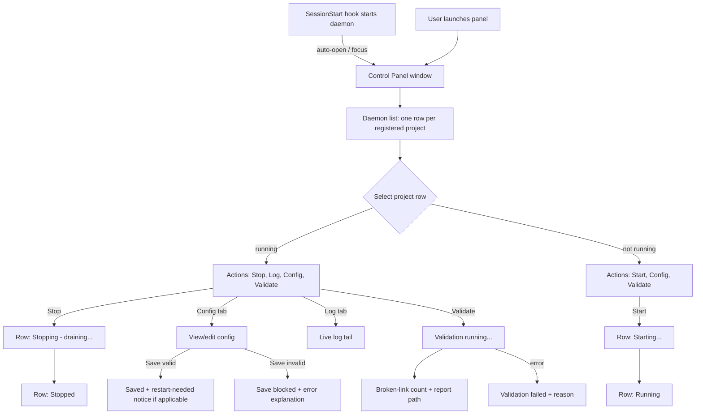
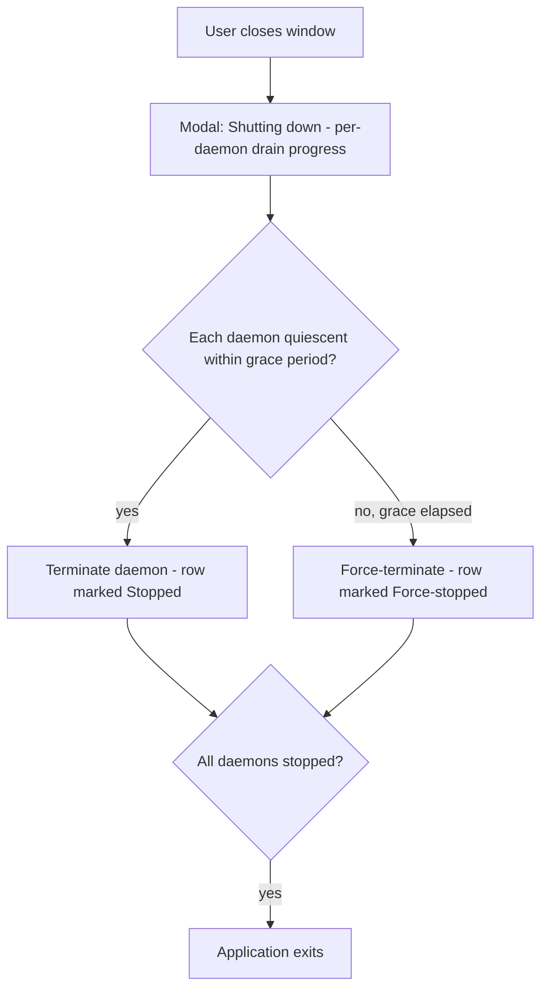

# LinkWatcher Control Panel - UI/UX Design Document

## Feature Overview

- **Feature ID**: 7.1.1
- **Feature Name**: LinkWatcher Control Panel
- **Design Scope**: Single-window master–detail desktop control panel: daemon list with per-project status (master), tabbed Log / Configuration / Validation detail panes, drain-aware stop/shutdown states, auto-open on hook-started daemons. This is the project's first GUI surface; per the [App-Shell vs Feature-Views Convention](../../../../../process-framework/guides/02-design/app-shell-vs-feature-views-convention-guide.md), the app shell and feature views collapse into this one document.
- **Target Platforms**: Windows desktop only (no iOS / Android / Web)
- **Design Status**: ✅ Approved (human partner, 2026-08-13) — v1.1 as amended; originally approved 2026-07-12, amended 2026-08-13 when screen-reader support was removed from scope (§5.1/§5.2 and the per-component specs)

## Related Documentation

> **Note**: UI Design Documents define the visual and interaction design for features. This document bridges functional requirements (FDD) and technical implementation (TDD), ensuring a cohesive user experience across platforms.

### Functional Design Reference

> **📋 Primary Documentation**: FDD Creation Task (PF-TSK-027)
> **🔗 Link**: [Functional Design Document — PD-FDD-034](../../../../functional-design/fdds/fdd-7-1-1-linkwatcher-control-panel.md)
> **👤 Owner**: FDD Creation Task

**Key Functional Requirements Impacting Design**:

- **7-1-1-FR-1 / FR-4** — live daemon list, one row per registered project, always reflecting actual state → master list with polling-refreshed status, no stale optimistic states.
- **7-1-1-FR-5 / FR-6 / FR-9** — log viewing, validation triggering, config view/edit → tabbed detail panes bound to the selected project.
- **7-1-1-FR-7 / BR-3 / BR-7** — drain-then-terminate on stop and on window close, bounded by a grace period → explicit "Stopping — draining…" transitional states and a modal shutdown-progress dialog.
- **7-1-1-FR-8 / BR-8 / EC-9** — hook auto-open + single instance → one window, re-launch surfaces the existing window.
- **7-1-1-EC-1…EC-11** — dead/stale daemons, start/validation failures, missing logs, malformed config → every pane needs explicit empty and error states.

### Design System Guidelines

> **📋 Primary Documentation**: Design Guidelines (PD-UIX-001)
> **🔗 Link**: [LinkWatcher Design Guidelines](../design-system/design-guidelines.md)
> **👤 Owner**: Design System

**Design System Patterns Applied**:

- Semantic status tokens (`status.running/stopped/transition/error`) with the glyph + text pairing rule (never color-only)
- Toolkit-native component envelope (PD-UIX-001 §5) — standard widgets only, survives the Tkinter/Qt toolkit decision
- Shell conventions from *Shared UI vs. Feature UI*: single window, single instance, master–detail, system-native chrome

### Technical Design Reference

> **📋 Primary Documentation**: TDD Creation Task (PF-TSK-015)
> **🔗 Link**: Technical Design Document — *pending (next design step after this document)*
> **👤 Owner**: TDD Creation Task

**Implementation Considerations**:

- GUI toolkit choice (Tkinter/ttk vs Qt/PySide) is TDD-owned; this design stays inside the standard-widget envelope so either satisfies it
- List refresh mechanism (polling interval, process enumeration) is TDD-owned; the design only requires that displayed state converge on real state within a few seconds (7-1-1-FR-4)
- Single-instance enforcement mechanism (7-1-1-EC-9) is TDD-owned; the design specifies the *behavior* (surface existing window)

### API Design Reference

> **📋 Primary Documentation**: API Design Task (PF-TSK-020) — **not invoked for the MVP**
> **🔗 Link**: N/A — per [PD-ASS-201](../../../../documentation-tiers/assessments/PD-ASS-201-7.1.1-linkwatcher-control-panel.md), the MVP wraps existing surfaces (CLI incl. `--validate`, launcher, OS process APIs, log files) and introduces no API contract
> **👤 Owner**: N/A (stop-sentinel caveat deferred; would trigger API Design if adopted)

**API-UI Integration Points**:

- Validation runs as a short-lived `--validate` subprocess: the Validation pane needs running / success / failure states driven by process exit and report output
- Log view binds to the project's `logs/linkwatcher/LinkWatcherLog.txt` file (tail), including rotation/missing-file handling (7-1-1-EC-5)
- Config editor reads/writes the project's LinkWatcher YAML config via existing config-load rules (7-1-1-BR-9)

---

## 1. Design Overview

### 1.1 Design Goals

**Primary Goals**:

1. **One-glance operational truth** — an operator sees every registered project's daemon state (running / stopped / transitioning / error) within one second of opening the window, without reading text closely (glyph + color + label).
2. **Zero-hunt control** — start, stop, log, config, and validation for any project are at most two interactions away (select row → action), replacing OS process tools and manual file opening.
3. **Trustworthy shutdown** — stopping (row-level or window close) always shows what is draining and never appears hung: transitional state is visible, bounded, and reports forced termination when it happens.

**Success Metrics**:

- All daemon state changes (external start/stop included) are reflected in the list without user action (7-1-1-FR-4)
- Every FDD user interaction (7-1-1-UI-1 … UI-8) achievable entirely from this window with keyboard or mouse
- Window close never hangs: shutdown completes or force-terminates within the grace period, with the forced case visibly reported (7-1-1-AC-9)

### 1.2 User Context

**Target Users**:

- A single developer/operator running LinkWatcher daemons across several registered projects on their own Windows machine (this is a local, single-user tool)

**Usage Scenarios**:

- **Ambient monitoring**: the window auto-opens when a `SessionStart` hook starts a daemon; the operator glances at it occasionally while working in VS Code
- **Deliberate management**: the operator opens the panel to stop a daemon, inspect a log after unexpected link edits, adjust a project's config, or run a validation scan
- **Session teardown**: the operator closes the window to deliberately stop all daemons at the end of a work session

**User Needs**:

- Immediate confidence about "what is LinkWatcher doing right now" without opening files
- Safe stop semantics — never lose an in-flight link update to an impatient shutdown
- Low ceremony — the tool must not demand attention when nothing is wrong

### 1.3 Design Constraints

**Technical Constraints**:

- **Toolkit-conservative envelope**: standard toolkit-native widgets only (no custom-drawn controls) so the design survives the TDD's Tkinter-vs-Qt decision — recorded as Design Decision D2
- Displayed state is derived from external reality (process list, lock files, log files) — the UI must tolerate refresh latency and show transitional states rather than assuming instant effect
- Log files can be large and rotate while being viewed; the log pane shows a bounded tail, not the whole file

**Platform Constraints**:

- Windows 10/11 desktop conventions: system title bar, Segoe UI, standard window controls, Alt-key accelerators, system light/dark theme deference where the toolkit supports it

**Business Constraints**:

- Panel-close terminates **all** managed daemons (7-1-1-BR-4) — the design must make shutdown visible and truthful, but per the FDD this is deliberate behavior, not an accident to warn about on every close (Design Decision D3)
- The panel does not own automatic startup (7-1-1-BR-5) — no UI for "auto-start on boot" or similar

---

## 2. Wireframes & User Flows

### 2.1 User Flow Diagram

**Primary flow — open, inspect, act** (7-1-1-UI-1 … UI-5, UI-8):



**Shutdown flow — window close** (7-1-1-FR-7, UI-6, BR-7):



**Flow Description**:

1. **Entry Point**: hook auto-open (surfaces existing window if one is open — single instance) or manual launch (7-1-1-UI-7, EC-9)
2. **Primary Path**: list → select row → act via toolbar or detail tabs; list refreshes itself as external state changes
3. **Alternative Paths**: non-running project offers Start + Config + Validate (no Stop/live Log); empty registered-projects list shows the empty state; stale-lock and dead-daemon rows surface as warnings, not live daemons (EC-1, EC-3)
4. **Exit Points**: window close → shutdown-progress dialog → drain/terminate all → exit (7-1-1-AC-7)

### 2.2 Screen Wireframes

#### Screen 1: Main Window (master–detail, Log tab active)

**Purpose**: The whole UI surface — daemon list (master, left), per-project detail tabs (right), toolbar, status bar. Covers 7-1-1-UI-1 … UI-5.

**Wireframe**:

```
┌──────────────────────────────────────────────────────────────────────────────┐
│  LinkWatcher Control Panel                                        ─  □  ✕   │
├──────────────────────────────────────────────────────────────────────────────┤
│  [▶ Start]  [■ Stop]  [⟳ Refresh]                                            │
├───────────────────────────────┬──────────────────────────────────────────────┤
│  Projects                     │ ┌─[ Log ]─[ Configuration ]─[ Validation ]─┐ │
│ ┌───────────────────────────┐ │ │ LinkWatcher — LinkWatcherLog.txt         │ │
│ │ Project      Status   Up  │ │ │ ┌───────────────────────────────────────┐│ │
│ │▌LinkWatcher  ● Running 2h ▐ │ │ │ 12:01:03 moved: doc/a.md → doc/b.md  ││ │
│ │ appdev       ● Running 5h │ │ │ │ 12:01:03 updated 14 references       ││ │
│ │ ProjectX     ■ Stopped —  │ │ │ │ 12:02:41 idle                        ││ │
│ │ ProjectY     ⚠ Stale lock │ │ │ │ ▼ (auto-scroll)                      ││ │
│ └───────────────────────────┘ │ │ └───────────────────────────────────────┘│ │
│         (resizable splitter)◄─┼─►│ [x] Auto-scroll          [Open log file] │ │
│                               │ └──────────────────────────────────────────┘ │
├───────────────────────────────┴──────────────────────────────────────────────┤
│  2 daemons running · list updated 12:03:12                                    │
└──────────────────────────────────────────────────────────────────────────────┘
```

**Layout Notes**:

- Default window 960 × 600 px, minimum 760 × 480 px; splitter between list and detail area, list pane 320 px default width (min 240 px)
- Toolbar actions apply to the selected row; disabled when not applicable (Stop disabled for a stopped project, Start disabled for a running one — 7-1-1-BR-1)
- Detail tabs always bound to the selected project; tab strip shows the project name in the pane header so the binding is unmistakable
- Status bar: aggregate count + last list-refresh time (supports "truthful state" — the user can see the data is fresh)
- Padding/spacing per PD-UIX-001 §4: pane padding 12 px, control gaps 8 px

**Interactive Elements**:

- **Daemon list rows**: single-select; selection drives toolbar enablement and detail-tab content
- **Toolbar buttons**: Start (`Alt+S`), Stop (`Alt+T`), Refresh (`F5`)
- **Detail tabs**: Log / Configuration / Validation (Ctrl+1/2/3)
- **Auto-scroll checkbox**: on = follow new log lines; scrolling up in the log pane pauses following (scroll-lock) until re-enabled
- **Open log file button**: opens the log in the system default editor (escape hatch for deep inspection)

#### Screen 2: Configuration tab

**Purpose**: View/edit the selected project's LinkWatcher config; validate on save; surface restart-needed (7-1-1-UI-8, FR-9, BR-9, EC-10, EC-11).

**Wireframe**:

```
┌─[ Log ]─[ Configuration ]─[ Validation ]──────────────────┐
│ LinkWatcher — tools/linkwatcher/linkwatcher-config.yaml   │
│ ┌────────────────────────────────────────────────────────┐│
│ │ monitored_extensions:                                  ││
│ │   - .md                                                ││
│ │   - .yaml                                              ││
│ │ move_detect_delay: 10        (monospace editor)        ││
│ │ ...                                                    ││
│ └────────────────────────────────────────────────────────┘│
│ ⓘ Unsaved changes                                          │
│ ❌ Line 12: move_detect_delay must be a number   (on err)  │
│ ⚠ Saved. Restart the daemon to apply changes.  (on save)  │
│                            [Discard]  [Save  Ctrl+S]      │
└────────────────────────────────────────────────────────────┘
```

**Layout Notes**:

- Raw-text YAML editor (monospace, Consolas 12 px), not a form-based per-key editor — Design Decision D5
- Notice line between editor and buttons carries exactly one of: dirty indicator (ⓘ), validation error (❌ red, blocks save), post-save restart notice (⚠ amber) — never stacked
- Missing/malformed config file (EC-10): editor shows a read-error banner with the file path and a "Create default config" hint; never auto-overwrites

**Interactive Elements**:

- **Editor**: editable text area; dirty state tracked; switching rows/tabs with unsaved changes prompts confirm (Save / Discard / Cancel)
- **Save (`Ctrl+S`)**: validates first; invalid → blocked with per-line explanation (EC-11); valid → persists, then shows restart-needed notice when the running daemon can't hot-apply (BR-9)
- **Discard**: reverts editor to last-saved content (confirm dialog)

#### Screen 3: Validation tab

**Purpose**: Trigger an on-demand validation scan and surface its outcome (7-1-1-UI-5, FR-6, BR-6, EC-6).

**Wireframe**:

```
┌─[ Log ]─[ Configuration ]─[ Validation ]──────────────────┐
│ LinkWatcher — link validation                              │
│                                                            │
│  [ ▶ Run validation ]                                      │
│                                                            │
│  ── idle ──────────────────────────────────────────────    │
│  Last run: 2026-07-06 11:40 · 3 broken links               │
│                                                            │
│  ── running ───────────────────────────────────────────    │
│  ▓▓▓▓▓▓░░░░ (indeterminate)  Validating… daemon keeps      │
│                              running (no stop needed)      │
│  ── result ────────────────────────────────────────────    │
│  ✅ 0 broken links   ·   Report: logs/linkwatcher/          │
│  ❌ 3 broken links   ·   [Open report]                     │
│  ── failure ───────────────────────────────────────────    │
│  ⚠ Validation failed: <reason from subprocess>             │
└────────────────────────────────────────────────────────────┘
```

**Layout Notes**:

- One state visible at a time (idle with last-run summary / running / result / failure)
- Result line uses semantic color + glyph + count; "Open report" opens the report file in the system default editor
- Run button disabled while a validation for this project is already running; a running daemon is untouched (BR-6)

#### Screen 4: Shutdown-progress dialog (window close)

**Purpose**: Truthful, bounded drain-then-terminate on close (7-1-1-UI-6, FR-7, BR-7, AC-9).

**Wireframe**:

```
┌─ Shutting down LinkWatcher ────────────────────────┐
│  Draining daemons before terminating…              │
│                                                    │
│   LinkWatcher    ▲ Draining… (4s)                  │
│   appdev         ✔ Stopped                         │
│   ProjectZ       ✕ Force-stopped (grace elapsed)   │
│                                                    │
│  ▓▓▓▓▓▓▓░░░  2 of 3 stopped                        │
└────────────────────────────────────────────────────┘
```

**Layout Notes**:

- Modal, not closable by the user; the application exits automatically when the last daemon is terminated — bounded by the grace period so it can never hang (BR-7)
- Per-daemon line: name + state glyph/text; force-stopped rows use `status.error` and stay visible until exit so forced termination is never silent (EC-4)
- No close-confirmation dialog precedes this (Design Decision D3); the dialog itself is the visible acknowledgment of what closing does

#### Screen 5: Empty state (no registered projects)

**Purpose**: EC-8 — empty registered-projects list is a calm state, not an error.

**Wireframe**:

```
┌──────────────────────────────────────────────┐
│                                              │
│        No registered projects found.         │
│   Projects appear here once registered in    │
│   the central project registry.              │
│                                              │
└──────────────────────────────────────────────┘
```

Centered muted text in the list pane; detail tabs show a matching "select a project" placeholder; toolbar actions disabled.

---

## 3. Visual Design Specifications

All tokens sourced from [Design Guidelines PD-UIX-001](../design-system/design-guidelines.md); no new colors introduced.

### 3.1 Color Palette

**Semantic Colors** (PD-UIX-001 §2):

- **`status.running`** `#107C10` — running rows' status glyph/text; validation success
- **`status.stopped`** `#6E6E6E` — stopped rows; idle/secondary text
- **`status.transition`** `#9D5D00` — Starting… / Stopping — draining… states; restart-needed notice
- **`status.error`** `#C42B1C` — start/validation failures, force-stopped, stale lock, config validation errors
- **`accent.primary`** `#0067C0` — selected row highlight, focused control accents, links (report path, "Open log file")

**Neutral Colors**: system-native theme (window background, surfaces, borders, default text) — deliberately not hard-coded (PD-UIX-001 §2, system-native principle).

### 3.2 Typography

Per PD-UIX-001 §3 (system font stack, no embedded fonts):

- **Pane heading**: Segoe UI 14 px Semibold — detail-pane headers ("LinkWatcher — LinkWatcherLog.txt")
- **Body**: Segoe UI 12 px Regular — list cells, buttons, labels, status text, dialogs
- **Caption**: Segoe UI 11 px Regular muted — uptime, timestamps, status-bar text, empty-state hint
- **Monospace**: Consolas 12 px Regular — log content, config editor, report paths

### 3.3 Spacing & Layout

Per PD-UIX-001 §4 (8 px base scale: 4, 8, 12, 16, 24):

- **Pane padding**: 12 px; **control-group gaps**: 8 px; **section separation**: 16 px; **tight intra-control gaps** (glyph-to-label): 4 px
- **Layout**: master–detail with resizable splitter (no column grid — desktop panel); list pane 320 px default / 240 px min; window 960 × 600 default / 760 × 480 min
- **List rows**: 28 px height (comfortable pointer + keyboard target); toolbar buttons 28 px height, 12 × 6 px padding

### 3.4 Iconography

**Icon Library**: none — text glyphs only (toolkit-conservative; avoids an icon-asset dependency, Design Decision D4)

**Status glyphs** (always paired with a text label, PD-UIX-001 §6):

- `●` Running (`status.running`) · `■` Stopped (`status.stopped`) · `▲` Starting… / Draining… (`status.transition`) · `✕` Force-stopped / Failed (`status.error`) · `⚠` Stale lock / warnings (`status.transition`) · `✔` Stopped cleanly (shutdown dialog, `status.running`)
- Toolbar glyphs: `▶` Start, `■` Stop, `⟳` Refresh — rendered at body text size (12 px), from the UI font

---

## 4. Component Specifications

### 4.1 Component: Daemon List

**Component Type**: Table / list view (toolkit-native, PD-UIX-001 §5)

**Variants**: single variant; columns **Project** (name, left-aligned, truncate with ellipsis + tooltip full path), **Status** (glyph + label), **Uptime** (caption style, `—` when not running)

**States**:

- **Row status values**: Running · Stopped · Starting… · Stopping — draining… · Start failed · Stale lock (EC-3: rendered as *not running* + warning glyph, tooltip explains, never treated as live)
- **Selected**: `accent.primary` selection background (system selection color acceptable), full-row highlight
- **Hover**: subtle system hover tint (mouse only)
- **Empty**: centered empty-state text (Screen 5)
- **Refreshing**: no flicker — rows update in place; stale/dead entries are corrected on the next refresh (EC-1), never left showing a dead daemon as running

**Dimensions**: fills list pane; row height 28 px; column widths Project flexible / Status 140 px / Uptime 64 px

**Behavior**:

- Single selection; selection persists across refreshes (keyed by project, not row index)
- Double-click a row → focuses the Log tab for that project
- External state changes (hook-started daemon appearing, external exit) update rows automatically (FR-4) — transitional states shown while panel-initiated actions are in flight, sourced from real process state, not assumptions

**Keyboard & contrast**:

- **Focus**: arrow keys move selection; Tab moves to the detail area; the focus ring is never suppressed
- **Contrast**: status glyph+label pairs ≥ 4.5:1; status never color-only (glyph + text always present)

### 4.2 Component: Toolbar Actions (Start / Stop / Refresh)

**Component Type**: Buttons (toolkit-native)

**Variants**: standard buttons; Stop is *not* styled as destructive-red at rest (it is a routine, recoverable action — the hook restarts daemons next session)

**States**:

- **Default / Hover / Pressed / Focused**: toolkit-native rendering, visible focus ring
- **Disabled**: Start disabled when selected project is running or starting (BR-1); Stop disabled when not running; both disabled with no selection or during that row's in-flight transition; Refresh always enabled
- **In-flight**: after Start/Stop, the acted-on row shows its transitional state; the button stays disabled until the transition resolves — no spinner in the button itself

**Dimensions**: 28 px height, 12 × 6 px padding, min-width 72 px

**Behavior**:

- **Start** (`Alt+S`): launches the daemon via the existing launcher; row → Starting…; failure → row "Start failed" + status-bar message with reason (EC-7); duplicate-start races resolve to the existing daemon, no second instance (EC-2, AC-10)
- **Stop** (`Alt+T`): row → Stopping — draining…; drain-then-terminate with grace-period bound (BR-3/BR-7); forced termination surfaces as "Force-stopped" row state + status-bar notice (EC-4)
- **Refresh** (`F5`): forces an immediate list re-enumeration (supplement to automatic refresh, not a requirement for correctness)

**Keyboard**: accelerators as noted (`Alt+S` / `Alt+T` / `F5`), each inert while its button is disabled; disabled reasons available as tooltips

### 4.3 Component: Log Pane

**Component Type**: Read-only auto-scrolling text pane (toolkit-native, monospace)

**Variants**: single variant; header shows project + log file name

**States**:

- **Following** (default): auto-scroll pinned to newest lines as the daemon writes (FR-5, UI-4)
- **Scroll-locked**: user scrolled up → following pauses; "Auto-scroll" checkbox unticks; re-ticking jumps to end
- **No log / rotated** (EC-5): shows "No log file for this project yet" placeholder, or transparently reattaches to the current log file on rotation — never an error dialog
- **Not running**: still shows the existing log tail (historical content is useful); header notes daemon is not running

**Dimensions**: fills detail pane; bounded tail (display window of recent lines — exact buffer size is a TDD implementation detail; the design requirement is bounded memory and instant open on large logs)

**Behavior**: text selectable/copyable; `Ctrl+End` jumps to newest and re-enables following; "Open log file" button opens the full file externally

**Keyboard**: read-only text area; `Ctrl+End` jumps to the newest lines and resumes following

### 4.4 Component: Config Editor

**Component Type**: Editable text pane (monospace) + Save/Discard buttons + notice line

**Variants**: editable (normal) · read-error (EC-10: banner with path + reason, editor disabled, "Create default config" hint)

**States**:

- **Clean**: notice line empty; Save/Discard disabled
- **Dirty**: "ⓘ Unsaved changes"; Save/Discard enabled; navigating away prompts Save / Discard / Cancel
- **Validation error** (on save attempt, EC-11): "❌ line «n»: «reason»" in `status.error`; save blocked; file untouched
- **Saved, restart needed** (BR-9): "⚠ Saved. Restart the daemon to apply changes." in `status.transition`; shown only when the running daemon cannot hot-apply
- **Saved, applied**: brief "Saved." confirmation in the notice line

**Dimensions**: fills detail pane; notice line single-height (one message at a time); buttons right-aligned, 8 px gap

**Behavior**: `Ctrl+S` = Save (validate → persist → notice); Discard reverts to last-saved content after confirm; editing is available whether or not the daemon runs (FDD Alternative Paths)

**Keyboard**: validation errors are reachable as text in the notice line; Save has an accelerator (`Ctrl+S`), Discard deliberately has none (friction before destroying work)

### 4.5 Component: Validation Pane

**Component Type**: Composite — Run button + state area (progress / result / failure)

**States** (one visible at a time):

- **Idle**: Run button enabled; last-run summary line if a previous run exists (caption style)
- **Running**: indeterminate progress bar + "Validating… daemon keeps running"; Run disabled for this project; other projects unaffected (BR-6)
- **Result**: `✅ 0 broken links` (`status.running`) or `❌ «n» broken links` (`status.error`) + "Open report" link-button with report path (UI-5, AC-6)
- **Failure** (EC-6): `⚠ Validation failed: «reason»` in `status.error`; never rendered as success

**Behavior**: Run triggers the `--validate` subprocess for the selected project; completion is driven by subprocess exit; result persists until the next run or project switch

**Keyboard**: the Run button and "Open report" are both focusable; the report's full path is shown as text, not only as a link target

### 4.6 Component: Status Bar

**Component Type**: Status bar (toolkit-native)

**States**: **Info** (default: "«n» daemons running · list updated «hh:mm:ss»") · **Notice** (transient action outcomes: "Start failed for «project»: «reason»", "ProjectZ force-stopped", auto-reverting to info after ~10 s)

**Behavior**: single line, left-aligned info + transient notices; notices never require dismissal (non-blocking channel for EC-4/EC-7-class events; the affected row carries the durable state)

**Keyboard**: read-only; reachable but outside the primary Tab cycle

### 4.7 Component: Shutdown-Progress Dialog

**Component Type**: Modal dialog (toolkit-native)

**States**: per-daemon rows — `▲ Draining… («n»s)` → `✔ Stopped` or `✕ Force-stopped (grace elapsed)`; overall determinate progress "«k» of «n» stopped"

**Dimensions**: ~420 px wide, height fits daemon count; centered on the main window

**Behavior**: appears immediately on window close; not user-closable (no ✕/Esc — the bounded grace period guarantees exit, BR-7); application exits automatically when all rows resolve; force-stops remain visible until exit (the operator sees them even if only briefly — and the status bar/notice channel is gone by then, so the row itself is the record)

**Keyboard**: focus is held inside the dialog; it is not user-closable and exits on its own when the drain completes or the grace period expires

---

## 5. Accessibility Requirements

### 5.1 Accessibility Targets

**Scope**: the perceivable / operable / understandable criteria below, applied to a Windows desktop GUI. Full WCAG 2.1 Level AA (the project default, PD-UIX-001 §6) is **not** claimed for this feature: AA's Robust criterion requires a programmatic name and role for every control, which is screen-reader support — out of scope for this single-operator internal tool. PD-UIX-001 §6 remains the default for other features.

**Key Requirements**:

1. **Perceivable**:

   - [ ] Text and status-glyph contrast ≥ 4.5:1 against their surfaces (semantic tokens in §3.1 were chosen to satisfy this on light surfaces; re-verify if the toolkit renders a dark theme)
   - [ ] Status never conveyed by color alone — glyph + text label everywhere (list rows, validation results, shutdown dialog)
   - [ ] Content readable when system text scaling is 200% (toolkit-native widgets inherit system scaling; layout uses resizable panes, not fixed absolute positioning)

2. **Operable**:

   - [ ] All functionality keyboard-operable: list navigation (arrows), actions (`Alt+S`/`Alt+T`/`F5`), tabs (`Ctrl+1/2/3`), save (`Ctrl+S`), dialogs (Enter/Esc where closable)
   - [ ] Visible focus indicator on every interactive element (toolkit focus ring; never suppressed)
   - [ ] No keyboard traps; the modal shutdown dialog is exit-bounded by the grace period, not by user input
   - [ ] Click/keyboard targets ≥ 28 px row/button height (desktop pointer targets; the 44 px touch minimum is N/A — no touch targets)

3. **Understandable**:

   - [ ] Every action's availability is explained (disabled-state tooltips: "already running", "no project selected")
   - [ ] Error messages state what failed and what to do (config: line + reason; start: launcher reason; validation: subprocess reason)
   - [ ] The editor never silently discards work (dirty-state prompt on navigation)

### 5.2 Keyboard Navigation Order

**Tab sequence**:

1. Toolbar (Start → Stop → Refresh)
2. Daemon list (arrow keys within)
3. Detail tab strip (arrows between tabs)
4. Active tab content (log text → auto-scroll checkbox → open-log button; or editor → Discard → Save; or Run button → result link)
5. Status bar (read-only, reachable but not in primary Tab cycle if the toolkit supports skipping)

---

## 6. Responsive Design

No mobile/tablet breakpoints — responsiveness here means **window-resize behavior** on desktop.

### 6.1 Window Size Behavior

**Minimum (760 × 480 px)**:

- All toolbar actions, all three tabs, ≥ 6 list rows, and ≥ 12 log lines remain visible
- Project names truncate with ellipsis + tooltip; Uptime column may collapse into the status label ("Running · 2h") if the list pane is at its 240 px minimum

**Default (960 × 600 px)**: layout as wireframed — 320 px list pane, remainder detail

**Large / maximized**: detail pane absorbs all extra width and height (log/config content benefits most); list pane grows only via the user-set splitter; toolbar and status bar stay single-row

### 6.2 Adaptive Patterns

**Layout Strategy**: single adaptive layout with user-controlled splitter; no alternate layouts

**Content Priority** (what wins as space shrinks):

1. Daemon list status column and toolbar (operational truth + control — never hidden)
2. Active detail pane content
3. Uptime column, last-run caption lines (first to truncate/collapse)

**Navigation Pattern**: fixed tab strip in the detail pane at all sizes (no hamburger/overflow patterns)

---

## 7. Platform-Specific Adaptations

**Windows desktop is the only target platform** (LinkWatcher is Windows-only — see README platform requirements). iOS / Android / Web sections: **N/A — intentionally omitted.**

### 7.1 Windows Desktop Conventions

- **Window chrome**: system title bar and window controls; standard minimize/maximize/close; the close button carries the shutdown semantics (Section 2.2 Screen 4)
- **Fonts & theming**: Segoe UI / Consolas via the system font stack; defer to system light/dark theme where the chosen toolkit supports it, else system-light defaults (PD-UIX-001 §2)
- **Keyboard conventions**: `Alt`-key accelerators on buttons, `F5` refresh, `Ctrl+S` save, `Esc` cancels closable dialogs, `Ctrl+C` copies log/config selection
- **File interactions**: "Open report" / "Open log file" use the OS file association (`os.startfile` semantics) — no embedded file viewers beyond the log tail
- **Single instance**: re-launch (manual or hook auto-open) surfaces and focuses the existing window — standard Windows single-instance utility behavior (EC-9; mechanism is TDD-owned)
- **DPI / scaling**: honor per-monitor DPI scaling via the toolkit; no hard-coded pixel bitmaps (text glyphs scale with fonts)

---

## 8. Animation & Transitions

### 8.1 Motion Principles

**Motion Style**: minimal (per the Preparation-checkpoint agreement and PD-UIX-001 §6 motion rule)

**Motion Purpose**: feedback only — communicate "work is happening" during operations with real duration (validation runs, drains). No decorative motion, no screen transitions, no easing choreography.

### 8.2 Transition Specifications

**Screen Transitions**: none — tab switches and state changes are instant.

**Component Animations**:

| Element | Animation Type | Duration | Easing | Trigger |
| ------- | -------------- | -------- | ------ | ------- |
| Validation progress bar | indeterminate marquee (toolkit-native) | continuous | native | validation subprocess running |
| Shutdown dialog progress | determinate fill (toolkit-native) | continuous | native | each daemon resolving |
| Row status text | instant swap (no fade) | 0 ms | — | state change |
| Status-bar notice | instant show; auto-clear | after ~10 s | — | transient action outcome |

**Loading Animations**: toolkit-native indeterminate progress bars only; no custom spinners or skeletons.

### 8.3 Performance Considerations

- [x] Toolkit-native progress indicators only (no custom-drawn animation loops)
- [x] Log pane appends without full-pane re-render (no visual churn at high log rates)
- [x] No decorative motion → nothing to disable for reduced-motion preferences; native progress bars follow system settings
- [x] 60 FPS is trivially met; the actual performance constraint is log-append efficiency (TDD concern, noted in §10.4)

---

## 9. Design System Integration

### 9.1 Reusable Patterns Applied

**From Design Guidelines (PD-UIX-001)**:

- **Semantic status tokens + glyph-and-text rule** (§2, §6): applied to list rows, validation results, shutdown dialog, notice lines
- **Toolkit-native component envelope** (§5): every component in Section 4 maps to a PD-UIX-001 §5 catalog row
- **Shell conventions** (*Shared UI vs. Feature UI*): single window, single instance, master–detail, system-native chrome — this document instantiates them
- **Spacing scale and typography roles** (§3, §4): applied throughout Sections 2–4

### 9.2 New Patterns Introduced

**Candidate Pattern 1**: **Transitional-state row** (list row shows "Stopping — draining… " while an async operation resolves against real external state, never optimistic)

- **Description**: solves the truthful-state problem for any list of externally-managed processes/resources
- **Reusability**: Medium — reusable if a second GUI surface manages async external state
- **Recommendation**: feature-specific for now; promote to PD-UIX-001 §7 on second use (promotion rule: ≥ 2 features)

**Candidate Pattern 2**: **Single-message notice line** (one inline slot under an editor carrying exactly one of dirty / error / post-save state)

- **Description**: keeps save-flow feedback adjacent to the action without dialog interruptions
- **Reusability**: Medium — applies to any future editable pane
- **Recommendation**: feature-specific for now; same promotion rule

**Candidate Pattern 3**: **Empty-state text block** (centered muted message + one hint line)

- **Description**: calm empty states for lists/panes (EC-8)
- **Reusability**: High — any list/pane needs it; already generically described in PD-UIX-001 §5 ("Empty-state text" component)
- **Recommendation**: already covered by the PD-UIX-001 component catalog — no separate pattern entry needed

### 9.3 Design Token Usage

- **Colors**: `status.running`, `status.stopped`, `status.transition`, `status.error`, `accent.primary`, `surface.log` (all of PD-UIX-001 §2; no additions)
- **Typography**: Pane heading / Body / Caption / Monospace roles (all of §3)
- **Spacing**: 4 / 8 / 12 / 16 px steps (§4; 24 px unused in this feature)
- **Shadows**: none (system-native chrome only)

---

## 10. Implementation Notes

### 10.1 UI Component Recommendations

Toolkit-conservative mapping (final choice is TDD-owned):

- **Window / layout**: main window + horizontal paned splitter (`ttk.PanedWindow` / `QSplitter`)
- **Daemon list**: `ttk.Treeview` (columns mode) / `QTableView` with model
- **Tabs**: `ttk.Notebook` / `QTabWidget`
- **Log pane**: read-only `tk.Text` with tail-append / `QPlainTextEdit` (read-only, `appendPlainText`)
- **Config editor**: `tk.Text` / `QPlainTextEdit` (editable, monospace)
- **Progress**: `ttk.Progressbar` (indeterminate + determinate) / `QProgressBar`
- **Status bar**: frame + label / `QStatusBar`
- **Dialogs**: toolkit-native message boxes for confirms; custom modal for shutdown progress

### 10.2 State Management Considerations

**UI State Types**:

- **Local (per-widget)**: list selection, splitter position, log scroll-lock, config editor dirty text, active tab
- **Feature (per-project)**: daemon status (incl. transitional states), uptime, last validation run/result, config saved-content baseline
- **Global (app)**: registered-projects list, refresh timestamp, shutdown-in-progress mode (disables all other interaction)

**Recommended Approach**: a single observable app-state model refreshed by the process-enumeration poll; widgets render from the model (one-way), user actions dispatch operations that update the model only via observed real-state changes — this is the mechanism behind the "Truthful state" principle. Details → State Management Implementation (PF-TSK-056) after TDD.

### 10.3 Asset Requirements

- **Application icon**: one `.ico` (16/32/48/256 px sizes embedded) for the window/title bar and taskbar — the only binary asset
- **Illustrations**: none
- **Icons**: none — text glyphs from the UI font (§3.4); no icon library dependency

### 10.4 Technical Considerations

**Performance**:

- Log tail must append incrementally (never re-read/re-render the full file per tick); bounded display buffer
- Process-enumeration poll must not block the UI thread (transitional states depend on a responsive event loop)

**Testing**:

- UI-state truthfulness is the key testable property: assert row states against fabricated process/lock fixtures (dead daemon, stale lock, drain timeout) per FDD EC-1…EC-4
- Keyboard operability: every action reachable and triggerable without a mouse, and the Tab order of §5.2 walked end to end

**Localization**: single-language (English) tool; no RTL or text-expansion requirements. Strings should still live in one module for maintainability, not as a localization mechanism.

---

## 11. Design Handoff Checklist

### 11.1 Deliverables

- [x] All wireframes completed and reviewed (5 screens, Section 2.2)
- [x] Visual design specifications documented (Section 3, sourced from PD-UIX-001)
- [x] Component specifications defined (7 components, Section 4)
- [x] Accessibility requirements documented (Section 5)
- [x] Platform-specific adaptations specified (Section 7, Windows-only)
- [x] Animation specifications detailed (Section 8, minimal by design)
- [x] Asset requirements identified (Section 10.3 — one app icon)
- [x] Implementation notes provided (Section 10)

### 11.2 Review & Approval

- [x] Design reviewed by human partner (Execution checkpoint, 2026-07-12)
- [x] Accessibility approach accepted (WCAG 2.1 AA, desktop-applied)
- [x] Technical feasibility confirmed (toolkit-conservative envelope — to be re-confirmed in TDD)
- [x] Stakeholder approval received (2026-07-12)

### 11.3 Handoff to Development

- [x] TDD references this UI Design document ([PD-TDD-033](../../../architecture/design-docs/tdd/tdd-7-1-1-linkwatcher-control-panel-t2.md), created 2026-07-12)
- [x] Design system patterns communicated (PD-UIX-001 created and cross-referenced)
- [x] No design assets beyond the app icon; no asset pipeline needed
- [ ] Questions/clarifications addressed (running list: none open)

---

## Appendix

### A. Design Decisions Log

| Date | Decision | Rationale | Impact |
| ---- | -------- | --------- | ------ |
| 2026-07-06 | **D1 — Master–detail single window** (list + tabbed detail) instead of tray menu or per-function dialogs | One standing window matches the FDD's "visible handle on LinkWatcher" intent (auto-open, close-terminates-all); fewer windows = simpler single-instance semantics | Shapes all wireframes; shell conventions recorded in PD-UIX-001 |
| 2026-07-06 | **D2 — Toolkit-conservative widget envelope** (standard widgets, text glyphs, no custom drawing) | Toolkit choice (Tkinter vs Qt) is TDD-owned; design must survive either | No custom controls anywhere; iconography is font glyphs |
| 2026-07-06 | **D3 — No close-confirmation dialog; shutdown-progress dialog instead** | FDD BR-4 declares close-terminates-all *deliberate*; a per-close confirm would nag the primary workflow. The progress dialog makes the consequence visible without blocking it | Shutdown flow (Screen 4); forced stops surfaced in-dialog |
| 2026-07-06 | **D4 — Text glyphs (●■▲✕⚠) instead of an icon library** | Zero asset dependency, scales with font/DPI, satisfies the no-color-alone rule cheaply | §3.4; app icon is the only binary asset |
| 2026-07-06 | **D5 — Raw YAML text editor for config (validate-on-save), not a form-based editor** | The config schema is large and evolving; a form editor would balloon design + implementation scope far beyond MVP for marginal benefit. Validation-on-save with line-level errors covers EC-10/EC-11 safety | Config tab (Screen 2, §4.4); revisit if config editing proves error-prone in practice |

### B. User Research & Testing

**User Testing Results**: N/A — single-operator internal tool; design validated through the human-partner checkpoint reviews in this task and through E2E acceptance testing after implementation.

**Feedback Incorporated**: Preparation-checkpoint decisions (2026-07-06): master–detail layout, Windows-only scope, ASCII/Mermaid fidelity, minimal motion — all approved by the human partner and applied throughout. Execution checkpoint (2026-07-12): full design approved, including flagged decisions D3 (no close-confirmation), D4 (text glyphs), D5 (raw YAML config editor).

### C. Design Resources

**Design Files**: none — wireframes are ASCII/Mermaid in this document (Tier 2 fidelity decision)

**Reference Materials**:

- [LinkWatcher Design Guidelines (PD-UIX-001)](../design-system/design-guidelines.md)
- [Functional Design Document (PD-FDD-034)](../../../../functional-design/fdds/fdd-7-1-1-linkwatcher-control-panel.md)
- [Tier Assessment (PD-ASS-201)](../../../../documentation-tiers/assessments/PD-ASS-201-7.1.1-linkwatcher-control-panel.md)
- [WCAG 2.1 Guidelines](https://www.w3.org/WAI/WCAG21/quickref/)
