# Integration Narrative: Configuration Change

> **Workflow**: WF-006 — A user edits configuration (file or CLI) and LinkWatcher's monitoring, parsing, update, and logging behavior adapts accordingly at startup

## Workflow Overview

**Entry point**: The user invokes `python main.py` with any combination of: a `--config <path>` flag pointing at a YAML or JSON file, `LINKWATCHER_*` environment variables, and/or direct CLI flags (`--dry-run`, `--quiet`, `--no-initial-scan`, `--log-file`, `--debug`, `--validate`). `main.main()` at [main.py:235](main.py#L235) is the single entry point; there is no runtime reconfiguration path.

**Exit point**: A single fully-resolved `LinkWatcherConfig` dataclass instance has been constructed, validated (`main.py:348`), logged via the startup `linkwatcher_starting` event, and passed into every component constructor during `LinkWatcherService.__init__()` ([service.py:54-94](src/linkwatcher/service.py#L54-L94)). Post-construction setters apply the two fields the service constructor intentionally skips (`dry_run_mode` via `service.set_dry_run()`, `create_backups` via `service.updater.set_backup_enabled()` — [main.py:377-378](main.py#L377-L378)). The running service then reads config-derived instance attributes on each event; no component ever re-reads the config object itself, so any change to configuration requires a full process restart (confirmed by the feature state file: "Runtime configuration hot-reload (not implemented)" — [0.1.3-configuration-system-implementation-state.md:64](doc/state-tracking/features/0.1.3-configuration-system-implementation-state.md#L64)).

**Flow summary**: `main.py` CLI parse → `load_config()` builds `DEFAULT_CONFIG.merge(file_config).merge(env_config)` then applies CLI overrides → `config.validate()` (exits on failure) → first `setup_logging()` call uses CLI-derived args (before config merge effects apply) → optional second `setup_logging()` call re-applies logging from config iff `config.log_file` is set AND `--log-file` was not passed → `LinkWatcherService(project_root, config=config)` fans out the config into `LinkDatabase`, `LinkParser`, `LinkUpdater`, `LinkMaintenanceHandler`, `MoveDetector`, `DirectoryMoveDetector` → post-init `set_dry_run()` and `set_backup_enabled()` → `service.start(initial_scan=config.initial_scan_enabled)`. The validate mode (`--validate`) takes a parallel, shorter path that bypasses the service and wires config into `LinkValidator` only.

## Participating Features

| Feature ID | Feature Name | Role in Workflow |
|-----------|-------------|-----------------|
| 0.1.3 | Configuration System | Owns `LinkWatcherConfig` (dataclass), its `from_file()` / `from_env()` / `_from_dict()` alternative constructors, `merge()` semantics (other's non-default values override), `validate()` method returning `List[str]`, and three environment presets (`DEVELOPMENT_CONFIG`, `PRODUCTION_CONFIG`, `TESTING_CONFIG` in `defaults.py`). Produces the single resolved config object consumed by every other feature in this workflow. |
| 0.1.1 | Core Architecture | `main.py` parses CLI, calls `load_config()`, runs `config.validate()`, calls `setup_logging()` (potentially twice), instantiates `LinkWatcherService(config=config)`, and applies the two post-init setters (`set_dry_run`, `set_backup_enabled`). `LinkWatcherService.__init__` fans the config out to per-component constructors. |
| 1.1.1 | File System Monitoring | `LinkMaintenanceHandler.__init__` consumes `config.move_detect_delay`, `config.dir_move_max_timeout`, `config.dir_move_settle_delay` (for `MoveDetector` / `DirectoryMoveDetector` construction) plus `monitored_extensions` and `ignored_directories` (passed as explicit args, not read off `config`). `LinkWatcherService._initial_scan()` additionally reads `config.scan_progress_interval`. |
| 2.1.1 | Link Parsing System | `LinkParser.__init__(config=config)` reads the 7 `enable_<format>_parser` flags to decide which per-extension parsers to register in `self.parsers`. `LinkValidator` passes its own config to a separate `LinkParser` instance for validation mode. |
| 2.2.1 | Link Updating | `LinkUpdater.__init__` reads `config.python_source_root` (used by `PathResolver` for Python-import link rewrites). The dry-run flag (`self.dry_run`) and backup flag (`self.backup_enabled`) are **not** read from config at construction — they are set post-hoc via `set_dry_run()` (through the service façade) and `set_backup_enabled()` (direct attribute access from main.py). |
| 3.1.1 | Logging System | `setup_logging()` creates the global `LinkWatcherLogger` singleton. First call in `main()` uses CLI-derived args only. Second call (conditional) applies `config.log_level`, `config.log_file`, `config.colored_output`, `config.show_log_icons`, `config.json_logs`, `config.log_file_max_size_mb`, `config.log_file_backup_count` — but only when `config.log_file` is truthy AND `--log-file` was not passed. `LoggingConfigManager` (hot-reload) is out of scope for WF-006. |

## Component Interaction Diagram

```mermaid
graph TD
    classDef critical fill:#f9d0d0,stroke:#d83a3a
    classDef important fill:#d0e8f9,stroke:#3a7bd8
    classDef reference fill:#d0f9d5,stroke:#3ad83f

    CLI[/CLI args via argparse/] -->|"args.Namespace"| Main([main / load_config])
    File[/YAML&#47;JSON config file/] -->|"LinkWatcherConfig.from_file"| Main
    Env[/LINKWATCHER_* env vars/] -->|"LinkWatcherConfig.from_env"| Main
    Defaults[/DEFAULT_CONFIG / presets/] -->|"base instance"| Main
    PCJ[/doc&#47;project-config.json/] -.->|"paths.source_code fallback"| Main

    Main -->|"merge + CLI overrides"| Cfg([LinkWatcherConfig<br/>single resolved instance])
    Cfg -->|"validate → List[str]<br/>non-empty → sys.exit(1)"| Main
    Cfg -->|"setup_logging call #1:<br/>CLI-derived args only"| Log([LinkWatcherLogger<br/>singleton])
    Cfg -->|"setup_logging call #2<br/>iff config.log_file and not args.log_file"| Log
    Cfg -->|"config=config"| Svc([LinkWatcherService.__init__])
    Svc -->|"parser_type_extensions"| DB[(LinkDatabase)]
    Svc -->|"config=config"| Parser([LinkParser])
    Svc -->|"python_source_root"| Updater([LinkUpdater])
    Svc -->|"monitored_extensions<br/>ignored_directories<br/>config=config"| Handler([LinkMaintenanceHandler])
    Handler -->|"move_detect_delay"| MD([MoveDetector])
    Handler -->|"dir_move_max_timeout<br/>dir_move_settle_delay"| DMD([DirectoryMoveDetector])

    Main -->|"service.set_dry_run(config.dry_run_mode)"| Updater
    Main -->|"service.updater.set_backup_enabled(config.create_backups)"| Updater
    Main -->|"service.start(initial_scan=config.initial_scan_enabled)"| Svc

    Svc -->|"_initial_scan:<br/>ignored_dirs, monitored_extensions,<br/>scan_progress_interval"| DB

    Validate[/main --validate branch/] -->|"bypasses service"| Validator([LinkValidator])
    Cfg -.->|"config=config"| Validator
    Validator -->|"validation_extensions<br/>validation_extra_ignored_dirs<br/>validation_ignored_patterns<br/>validation_ignore_file"| Parser

    class CLI,File,Env,Defaults,Cfg critical
    class Main,Svc,Log,Handler important
    class PCJ,DB,Parser,Updater,MD,DMD,Validator,Validate reference
```

## Data Flow Sequence

1. **`argparse.ArgumentParser`** ([main.py:237-273](main.py#L237-L273)) reads `sys.argv` and produces an `args: argparse.Namespace` with the typed flags: `no_initial_scan: bool`, `project_root: str`, `config: Optional[str]`, `dry_run: bool`, `quiet: bool`, `log_file: Optional[str]`, `debug: bool`, `validate: bool`.
   - Passes to next: `args` — used both by the pre-config `setup_logging()` call and by `load_config(args)`.

2. **`load_config(config_path, args, project_root)`** ([main.py:47-93](main.py#L47-L93)) assembles the precedence chain:
   - Step 2a: `config = DEFAULT_CONFIG` (module-level singleton from [defaults.py:11-95](src/linkwatcher/config/defaults.py#L11-L95)).
   - Step 2b: If `config_path` is non-empty and the file exists, calls `LinkWatcherConfig.from_file(config_path)` — dispatches on `.json` vs `.yaml/.yml` suffix to `_from_json` or `_from_yaml`, both of which delegate to `_from_dict(data)`. `_from_dict` ([settings.py:212-233](src/linkwatcher/config/settings.py#L212-L233)) uses `dataclasses.fields()` + `typing.get_type_hints()` to: warn on unknown keys (logger.warning `Unknown configuration key '%s' — ignored (possible typo?)`), skip underscore-prefixed keys, and auto-convert `list` → `set` for `Set[str]`-typed fields. The resulting `file_config` is then merged: `config = config.merge(file_config)`.
   - Step 2c: `env_config = LinkWatcherConfig.from_env(prefix="LINKWATCHER_")` ([settings.py:235-282](src/linkwatcher/config/settings.py#L235-L282)) iterates over `dataclasses.fields(cls)`, looks up `LINKWATCHER_<FIELD_NAME_UPPER>` in `os.environ`, and type-coerces by type hint: `Set[str]` splits on `,`; `bool` matches `true/1/yes/on` (case-insensitive); `int` and `float` use the built-in parsers with a `logger.warning` + default-retained fallback on `ValueError`; everything else is stored as raw string. Then `config = config.merge(env_config)`.
   - Step 2d: CLI overrides applied directly to the merged config: `args.dry_run → config.dry_run_mode = True`; `args.quiet → config.log_level = "ERROR"`, `config.colored_output = False`, `config.show_statistics = False`; `args.no_initial_scan → config.initial_scan_enabled = False` ([main.py:78-86](main.py#L78-L86)).
   - Step 2e: Fallback — if `not config.python_source_root and project_root`, call `_read_source_root_from_project_config(project_root)` to extract `paths.source_code` from `doc/project-config.json` (PD-BUG-078 — [main.py:88-112](main.py#L88-L112)).
   - Passes to next: a fully-resolved `LinkWatcherConfig` instance.

3. **`LinkWatcherConfig.merge(other)`** ([settings.py:327-350](src/linkwatcher/config/settings.py#L327-L350)) returns a **new** instance (never mutates `self` or `other`). Constructs a fresh `default_config = LinkWatcherConfig()` to determine "is this field at default value?". Starts with a deep-ish copy of `self` (sets are `.copy()`-ed, other scalars assigned directly), then iterates `other.__dict__`: for each key, if `other.value != default.value`, it overrides `merged[key] = other.value` (sets copied, others assigned). Consequence: **any field that happens to equal the class default in `other` will not override `self`, even if the user set it explicitly to the default value** — this is a semantic subtlety of the merge algorithm.
   - Passes to next: merged instance back to `load_config`.

4. **`config.validate()`** ([main.py:348](main.py#L348)) runs at [settings.py:352-382](src/linkwatcher/config/settings.py#L352-L382) and returns `List[str]` of issue descriptions, checking: `max_file_size_mb > 0`, `log_level ∈ {DEBUG, INFO, WARNING, ERROR, CRITICAL}` (case-insensitive), every `monitored_extensions` entry starts with `.`, `scan_progress_interval > 0`, `move_detect_delay > 0`, `dir_move_max_timeout > 0`, `dir_move_settle_delay > 0`. If non-empty, `main` logs each issue and calls `sys.exit(1)` ([main.py:349-353](main.py#L349-L353)).
   - Passes to next: validated config (or process exit).

5. **First `setup_logging()` call** ([main.py:325-330](main.py#L325-L330)) runs **before** `load_config()` and therefore cannot see any config-file or env-var values. It takes: `level = LogLevel.DEBUG if args.debug else LogLevel.INFO` (overridden to `LogLevel.ERROR` if `args.quiet`); `log_file = args.log_file`; `colored_output = not args.quiet`; `show_icons = not args.quiet`. Inside `setup_logging` ([logging.py:565-597](src/linkwatcher/logging.py#L565-L597)): closes any previously-installed handlers (PD-BUG-015 — prevents Windows `PermissionError` on log-file replacement), constructs a new `LinkWatcherLogger`, assigns it to the global `_logger`.
   - Passes to next: the module-global `_logger` singleton; every subsequent `get_logger()` call returns this instance until a second `setup_logging()` supersedes it.

6. **Conditional second `setup_logging()` call** ([main.py:336-345](main.py#L336-L345)) runs **iff** `config.log_file` is truthy AND `args.log_file` is falsy — i.e., the user configured a log file in YAML/JSON/env but didn't override on CLI. It re-installs the global logger with values pulled from config: `LogLevel(config.log_level)`, `config.log_file`, `config.colored_output and not args.quiet`, `config.show_log_icons and not args.quiet`, `config.json_logs`, `config.log_file_max_size_mb * 1024 * 1024`, `config.log_file_backup_count`.
   - **Consequence**: if the user sets `log_level: DEBUG` in a config file but leaves `log_file:` empty, the config-file `log_level` is silently discarded — the first-call value (`INFO` by default) remains in effect. Same applies to `colored_output`, `show_log_icons`, `json_logs`, `log_file_max_size_mb`, `log_file_backup_count`. Filed as [TD232](/doc/state-tracking/permanent/technical-debt-tracking.md).
   - Passes to next: (possibly) updated `_logger` singleton.

7. **`LinkWatcherService.__init__(project_root, config, register_signals=True)`** ([service.py:54-101](src/linkwatcher/service.py#L54-L101)) stores `self.config = config` then builds sub-components, fanning individual config fields into each:
   - `LinkDatabase(parser_type_extensions=config.parser_type_extensions if config else None)` — the dataclass default is `{"python": ".py", "dart": ".dart"}`.
   - `LinkParser(config=config)` — inside `LinkParser.__init__` ([parser.py:32-55](src/linkwatcher/parser.py#L32-L55)) the 7 `enable_<format>_parser` flags gate parser registration. `if config is None or config.enable_<x>_parser` — so disabling a parser requires an explicit `False`, never omission.
   - `LinkUpdater(str(self.project_root), python_source_root=config.python_source_root if config else "")` — no `dry_run_mode`, no `create_backups` passed here. The constructor default-initialises `self.backup_enabled = True` and `self.dry_run = False` ([updater.py:65-74](src/linkwatcher/updater.py#L65-L74)).
   - `LinkMaintenanceHandler(self.link_db, self.parser, self.updater, str(self.project_root), monitored_extensions=config.monitored_extensions if config else None, ignored_directories=config.ignored_directories if config else None, config=config)` — note `monitored_extensions` and `ignored_directories` are passed as positional parameters, not reached through `config.*` inside the handler. The handler itself then reads `config.move_detect_delay`, `config.dir_move_max_timeout`, `config.dir_move_settle_delay` off `config` for the two move detectors ([handler.py:160-183](src/linkwatcher/handler.py#L160-L183)).
   - Passes to next: a fully-wired `LinkWatcherService` with all config-derived state captured as instance attributes of sub-components.

8. **Post-init setters** ([main.py:377-378](main.py#L377-L378)) apply the two fields deliberately skipped by `__init__`:
   - `service.set_dry_run(config.dry_run_mode)` → delegates to `self.updater.set_dry_run(enabled)` ([service.py:263-266](src/linkwatcher/service.py#L263-L266), [updater.py:555-557](src/linkwatcher/updater.py#L555-L557)) → sets `self.dry_run = enabled` on the updater instance.
   - `service.updater.set_backup_enabled(config.create_backups)` — direct attribute access on `service.updater`; there is no `service.set_backup_enabled()` wrapper. Sets `self.backup_enabled = enabled` on the updater instance ([updater.py:559-561](src/linkwatcher/updater.py#L559-L561)).
   - Passes to next: service is now fully configured.

9. **`service.start(initial_scan=config.initial_scan_enabled)`** ([main.py:389](main.py#L389)). Inside `service.start()`, when `initial_scan` is truthy, `_initial_scan()` runs ([service.py:180-223](src/linkwatcher/service.py#L180-L223)) and reads three more fields at that point: `config.ignored_directories` (prunes `os.walk` dirs in-place), `config.monitored_extensions` (passed to `should_monitor_file`), `config.scan_progress_interval` (controls the `scan_progress` log cadence). These are the only places in the event loop where config is re-read after `__init__` — and they're read off `self.config if self.config else DEFAULT_CONFIG`, not off sub-components.
   - Passes to next: running service; workflow is complete.

### Alternate exit: validate mode

When `args.validate` is true, `main()` short-circuits at [main.py:282-314](main.py#L282-L314) and never touches the service:

- A single minimal `setup_logging()` call uses only `log_level`, `colored_output`, `show_icons` derived from CLI (lines 286-290). Critically, **neither `config.log_file` nor `config.json_logs` nor `config.log_level` is ever applied to validation-mode logging** — see divergence note 4.
- `load_config(args.config, args, project_root=str(project_root))` runs exactly as in step 2.
- `LinkValidator(str(project_root), config)` ([validator.py:247-254](src/linkwatcher/validator.py#L247-L254)) stores `self.config` and derives `self._validation_extensions = self.config.validation_extensions`, `self._extra_ignored_dirs = self.config.validation_extra_ignored_dirs`. It instantiates its **own** `LinkParser(self.config)` — separate from any service parser.
- During `validator.validate()`: reads `self.config.ignored_directories | self._extra_ignored_dirs` ([validator.py:267](src/linkwatcher/validator.py#L267)) to prune `os.walk`, and later `self.config.validation_ignored_patterns` ([validator.py:375](src/linkwatcher/validator.py#L375)) for suppression, and `self.config.validation_ignore_file` ([validator.py:609](src/linkwatcher/validator.py#L609)) for the `.linkwatcher-ignore` path.
- Report destination uses `args.log_file or config.log_file` for the output directory ([main.py:304-308](main.py#L304-L308)); exit code is 0 or 1 based on `result.is_clean`.

## Callback/Event Chains

This workflow does not use callbacks, observers, or event emitters to propagate configuration. Every config-to-component linkage in WF-006 is a direct constructor argument or a direct setter call from `main.py`, resolved at startup. There is **no runtime listener** for config changes — the explicit design decision recorded in the 0.1.3 feature state file is: "No hot-reload — Config is immutable after startup — By design — simplicity over runtime flexibility" ([0.1.3-configuration-system-implementation-state.md:272](doc/state-tracking/features/0.1.3-configuration-system-implementation-state.md#L272)).

(A `LoggingConfigManager` class with `auto_reload` polling exists in `src/linkwatcher/logging_config.py` and is exercised by unit tests and `tools/logging_dashboard.py`, but it is never instantiated by `main.py` or `service.py` in the production LinkWatcher run-loop, so it is out of scope for WF-006.)

## Configuration Propagation

Every field on `LinkWatcherConfig` that is actually read by the running service is listed below, grouped by the feature that consumes it. Fields that exist on the dataclass but are never read outside `config.validate()` and preset initialisation are listed separately in the "Orphan configuration fields" subsection and reported as technical debt.

### Propagation sources (the precedence chain)

| Source | Mechanism | File/Function | Notes |
|--------|-----------|--------------|-------|
| Built-in defaults | `@dataclass` field defaults + `DEFAULT_CONFIG` base instance | [settings.py:39-181](src/linkwatcher/config/settings.py#L39-L181), [defaults.py:11-95](src/linkwatcher/config/defaults.py#L11-L95) | `DEFAULT_CONFIG` adds a wider `monitored_extensions` set than the dataclass defaults (includes `.html`, `.css`, `.js`, `.png`, etc.); `load_config` starts from `DEFAULT_CONFIG`, so CLI/file/env omissions inherit the wider set |
| YAML or JSON config file | `LinkWatcherConfig.from_file(path)` dispatches on extension; `_from_dict` handles `list → set` for `Set[str]` fields and warns on unknown keys | [settings.py:183-233](src/linkwatcher/config/settings.py#L183-L233) | Loaded only if `--config` is provided AND the path exists; silent fallback on failure (logger.warning `config_load_failed`, no sys.exit) |
| Environment variables | `LinkWatcherConfig.from_env(prefix="LINKWATCHER_")`; `<PREFIX><FIELD_NAME_UPPER>` with type coercion by type hint | [settings.py:235-282](src/linkwatcher/config/settings.py#L235-L282) | `Set[str]` splits on `,`; `bool` matches `true/1/yes/on`; `int`/`float` parse with default-retained fallback |
| CLI flags | `args.*` applied directly to merged config after env merge | [main.py:78-86](main.py#L78-L86) | Only `--dry-run`, `--quiet`, `--no-initial-scan` reach `config`. `--log-file` and `--debug` are applied directly to `setup_logging()` call #1, **not** to `config` |
| `doc/project-config.json` fallback | `paths.source_code` copied into `config.python_source_root` only if empty | [main.py:88-112](main.py#L88-L112) | Tail-end fallback; silent if file missing or read fails (debug-level log only) |

### Consumed fields (where each config value actually affects behavior)

| Config field | Consumer (feature) | Where read | Effect |
|-------------|-------------------|-----------|--------|
| `monitored_extensions` | 1.1.1 | `LinkMaintenanceHandler(monitored_extensions=...)` at [service.py:91](src/linkwatcher/service.py#L91); used by `_should_monitor_file` in event routing and by `_initial_scan` at [service.py:186](src/linkwatcher/service.py#L186) | Extensions not listed here are dropped at event-filter time |
| `ignored_directories` | 1.1.1 | `LinkMaintenanceHandler(ignored_directories=...)` at [service.py:92](src/linkwatcher/service.py#L92); also read by `_initial_scan` at [service.py:185](src/linkwatcher/service.py#L185) | Any path segment matching triggers `os.walk` pruning during initial scan and event filtering during monitoring |
| `move_detect_delay` | 1.1.1 | `LinkMaintenanceHandler.__init__` at [handler.py:160](src/linkwatcher/handler.py#L160) → `MoveDetector(delay=...)` | Width of the delete+create correlation window (default 10s); below this a pair becomes a synthetic move, above this the delete is confirmed true |
| `dir_move_max_timeout` | 1.1.1 | `LinkMaintenanceHandler.__init__` at [handler.py:162](src/linkwatcher/handler.py#L162) → `DirectoryMoveDetector(max_timeout=...)` | Hard cap for directory-move batch assembly (default 300s) |
| `dir_move_settle_delay` | 1.1.1 | `LinkMaintenanceHandler.__init__` at [handler.py:165](src/linkwatcher/handler.py#L165) → `DirectoryMoveDetector(settle_delay=...)` | Quiet-period after last batch file match before firing `on_dir_move` (default 5s) |
| `scan_progress_interval` | 0.1.1 | `LinkWatcherService._initial_scan` at [service.py:208](src/linkwatcher/service.py#L208) | Every Nth scanned file logs a `scan_progress` event; every (4N)th elevates to INFO |
| `initial_scan_enabled` | 0.1.1 | `main.py:389` passes to `service.start(initial_scan=...)` | Skips the full `_initial_scan()` walk on startup |
| `parser_type_extensions` | 0.1.2 (via 0.1.1) | `LinkDatabase(parser_type_extensions=...)` at [service.py:79](src/linkwatcher/service.py#L79) | Overrides per-link-type suffix-matching behavior in DB lookups |
| `enable_markdown_parser`, `enable_yaml_parser`, `enable_json_parser`, `enable_dart_parser`, `enable_python_parser`, `enable_powershell_parser`, `enable_generic_parser` | 2.1.1 | `LinkParser.__init__(config=config)` at [parser.py:36-55](src/linkwatcher/parser.py#L36-L55) | Each `False` removes the corresponding per-extension parser from `self.parsers` (or zeroes `self.generic_parser`) |
| `max_file_size_mb` | 2.1.1 | Captured in `LinkParser.__init__` at [parser.py](src/linkwatcher/parser.py); checked at top of `LinkParser.parse_file` via `is_file_size_within_limit` ([utils.py](src/linkwatcher/utils.py)) | Files larger than the configured megabyte limit are skipped (logged as `file_skipped_oversize`) and `parse_file` returns `[]`. Single gate covers all read paths: `_initial_scan`, `rescan_file_links` (post-create / post-move / retry), and `LinkValidator`'s embedded parser. Values `<= 0` disable the check (rejected by `validate()` so this branch is reached only via direct attribute mutation). Wired in by PD-REF-197 (TD227 resolution) |
| `python_source_root` | 2.2.1 | `LinkUpdater(python_source_root=...)` at [service.py:84](src/linkwatcher/service.py#L84) → `PathResolver` | Strips leading `src/` (or similar) for Python-import link resolution (PD-BUG-078) |
| `dry_run_mode` | 2.2.1 | `main.py:377`: `service.set_dry_run(config.dry_run_mode)` → `updater.set_dry_run()` → `updater.dry_run` | Short-circuits `_write_file_safely`; replacements are computed but not written |
| `create_backups` | 2.2.1 | `main.py:378`: `service.updater.set_backup_enabled(config.create_backups)` → `updater.backup_enabled` | `.bak` copy written before every atomic rename when enabled |
| `log_level`, `log_file`, `colored_output`, `show_log_icons`, `json_logs`, `log_file_max_size_mb`, `log_file_backup_count` | 3.1.1 | Conditional second `setup_logging(...)` at [main.py:336-345](main.py#L336-L345) | **Applied only when `config.log_file` truthy AND `args.log_file` falsy** — otherwise silently discarded (divergence note 2) |
| `validation_extensions` | 6.1.1 (validator — excluded from WF-006 participating features but reachable via the validate-mode branch) | `LinkValidator.__init__` at [validator.py:251](src/linkwatcher/validator.py#L251) | Filters which files the validator walks |
| `validation_extra_ignored_dirs` | 6.1.1 | `LinkValidator.__init__` at [validator.py:252](src/linkwatcher/validator.py#L252); merged with `ignored_directories` at [validator.py:267](src/linkwatcher/validator.py#L267) | Adds validator-only ignore directories (e.g., `fixtures`, `archive`) |
| `validation_ignored_patterns` | 6.1.1 | `LinkValidator` at [validator.py:375](src/linkwatcher/validator.py#L375) | Substring-match suppression of broken-link reports |
| `validation_ignore_file` | 6.1.1 | `LinkValidator` at [validator.py:609](src/linkwatcher/validator.py#L609) | Path to the `.linkwatcher-ignore` source/target glob rules file |

### Orphan configuration fields

The following fields exist on `LinkWatcherConfig`, are exposed through presets and sometimes written by CLI/env paths, but are **never read by any code outside `config.validate()` or preset construction**. Setting them has no observable effect on WF-006. Filed as [TD229, TD231](/doc/state-tracking/permanent/technical-debt-tracking.md).

> **Resolved**: `max_file_size_mb` (TD227) was previously listed here. As of PD-REF-197 (2026-04-28) it is wired into `LinkParser.parse_file` and now appears in the Consumed fields table above.

| Field | Defined at | Written by | Read by (outside validate) |
|-------|-----------|-----------|---------------------------|
| `show_statistics` | [settings.py:121](src/linkwatcher/config/settings.py#L121) | `DEFAULT_CONFIG`, presets, overridden to `False` by `--quiet` at [main.py:84](main.py#L84) | **Nothing.** `_print_final_stats` ([service.py:230-244](src/linkwatcher/service.py#L230-L244)) always runs regardless |
| `performance_logging` | [settings.py:127](src/linkwatcher/config/settings.py#L127) | None (defaults to `False`, no preset touches it) | **Nothing.** No code branches on this field |

## Error Handling Across Boundaries

### Missing or unreadable config file (0.1.3 → 0.1.1)

- **Origin**: `LinkWatcherConfig.from_file(config_path)` raises `FileNotFoundError` if the path doesn't exist ([settings.py:188](src/linkwatcher/config/settings.py#L188)), `ValueError` for unsupported suffixes ([settings.py:195](src/linkwatcher/config/settings.py#L195)), or lets `yaml.YAMLError` / `json.JSONDecodeError` propagate from `_from_yaml` / `_from_json`.
- **Propagation**: Caught by a blanket `except Exception as e` in `load_config` at [main.py:66-67](main.py#L66-L67); logs `config_load_failed` with the file path and error message.
- **Impact**: The file is silently skipped and `load_config` proceeds with `DEFAULT_CONFIG`. The subsequent env merge and CLI overrides still apply.
- **Recovery**: User must notice the warning in the log. No retry, no fallback to a default config file path.

### Invalid env-var value (0.1.3 → 0.1.1)

- **Origin**: `LinkWatcherConfig.from_env` encounters an env var that fails `int(value)` or `float(value)` ([settings.py:261-278](src/linkwatcher/config/settings.py#L261-L278)).
- **Propagation**: Caught locally in `from_env`; logs `logger.warning("Invalid value '%s' for env var %s (expected <type>) — using default", ...)` and the field retains its default.
- **Impact**: The invalid env var is ignored; merge proceeds. An entire `from_env` call wrapped in a blanket `except Exception` at [main.py:74-75](main.py#L74-L75) provides a second safety net — if `from_env` itself raises, the env layer is skipped.
- **Recovery**: None; the invalid value is lost silently from the user's perspective unless they check the logs.

### Config validation failure (0.1.3 → 0.1.1)

- **Origin**: `config.validate()` returns a non-empty `List[str]` ([settings.py:352-382](src/linkwatcher/config/settings.py#L352-L382)).
- **Propagation**: Not an exception — the list of issues is returned by value. Checked directly at [main.py:348-353](main.py#L348-L353).
- **Impact**: `main` logs `configuration_validation_failed` plus one `config_issue` per issue, then `sys.exit(1)`. No component is ever constructed.
- **Recovery**: None — the process terminates. Validation is the final gate before the service starts.

### Config-file watcher thread crash (3.1.1 — out-of-scope for WF-006)

- **Origin**: `LoggingConfigManager._watch_config_file` could fail if the watched config file vanishes mid-watch.
- **Propagation**: N/A for WF-006 — `LoggingConfigManager` is not instantiated by `main.py` or `service.py` in the production path.
- **Impact**: None on WF-006.
- **Recovery**: N/A.

### Post-init setter ordering (0.1.3 → 2.2.1)

- **Origin**: `LinkWatcherService.__init__` does NOT apply `config.dry_run_mode` or `config.create_backups` to the `LinkUpdater`; it relies on `main.py` to call the two post-init setters at [main.py:377-378](main.py#L377-L378). Any caller that instantiates `LinkWatcherService` directly — e.g., a test that bypasses `main.py` — and forgets these two lines will run with `updater.backup_enabled = True` (constructor default) and `updater.dry_run = False` (constructor default), **ignoring the config**.
- **Propagation**: Silent. No warning, no exception.
- **Impact**: The `dry_run_mode` and `create_backups` fields in config are effectively inert unless the caller goes through `main.py` or explicitly calls both setters.
- **Recovery**: Callers must know to call both setters. Filed as [TD235](/doc/state-tracking/permanent/technical-debt-tracking.md) because it makes direct service instantiation in tests quietly ignore two configuration fields.

---

*This Integration Narrative was created as part of the Integration Narrative Creation task (PF-TSK-083).*
