# Integration Narrative: Directory Move

> **Workflow**: WF-002 — An entire directory is moved or renamed on disk, and (a) all inbound references to every file under it, (b) relative links inside every moved file, and (c) references to the directory path itself are all updated in a single batched pass.

## Workflow Overview

**Entry point**: Three arrival shapes all converge on `_handle_directory_moved()` ([handler.py:409](src/linkwatcher/handler.py#L409)):

1. **Native** (Linux/macOS): A `FileMovedEvent(src_path, dest_path, is_directory=True)` arrives on `LinkMaintenanceHandler.on_moved()` ([handler.py:248](src/linkwatcher/handler.py#L248)); the `is_directory` branch dispatches directly to `_handle_directory_moved(event)`.
2. **Windows batch correlation**: A directory delete is reported by watchdog as a `FileDeletedEvent(is_directory=True)` — or, in some cases, as a `FileDeletedEvent(is_directory=False)` whose path has known DB children — followed by individual `FileCreatedEvent`s under a new parent. `_handle_directory_deleted()` ([handler.py:672](src/linkwatcher/handler.py#L672)) delegates to `DirectoryMoveDetector.handle_directory_deleted()` which snapshots `known_files` and starts a max-timeout timer; successive `on_created()` calls pass through `DirectoryMoveDetector.match_created_file()` ([dir_move_detector.py:136](src/linkwatcher/dir_move_detector.py#L136)) which infers `new_dir` from the first basename match and verifies subsequent files by prefix. When either all files match or the settle/max timer fires, the detector calls `self._on_dir_move(old_dir, new_dir)` into `LinkMaintenanceHandler._handle_confirmed_dir_move()` ([handler.py:733](src/linkwatcher/handler.py#L733)), which builds a synthetic `FileMovedEvent(is_directory=True)` and re-enters `_handle_directory_moved()`.
3. **Windows misreported dir-as-file**: `on_deleted()` ([handler.py:271](src/linkwatcher/handler.py#L271)) receives `is_directory=False` for what is actually a directory delete; it calls `self._dir_move_detector.get_files_under_directory(deleted_path)` and, if any DB children exist, routes to `_handle_directory_deleted(event)` anyway ([handler.py:281-286](src/linkwatcher/handler.py#L281-L286)).

**Exit point**: Every DB source-path entry under the moved directory has been re-keyed to its new location; every inbound reference to any file under the old directory has been rewritten in its containing source file (one atomic write per referring file, regardless of how many moved files it references); relative links inside every moved file have been recalculated to their new location; references that target the directory path itself (exact or a subdirectory within it) have been rewritten; the DB has been cleaned and affected files re-parsed so outgoing-link entries reflect post-move content; `stats["files_moved"]` has been incremented by the number of moved files and `stats["links_updated"]` by the total references updated across all phases.

**Flow summary**: Observer event → (native `DirMovedEvent` OR `DirectoryMoveDetector` batch correlation → synthetic event) → `_handle_directory_moved()` → `os.walk(dest_path)` discovery → **Phase 0** DB source-path re-key → **Phase 1** per-file reference collection via `ReferenceLookup.collect_directory_file_refs()` → **Phase 1b** single batched `LinkUpdater.update_references_batch()` pass (one write per referring file, TD129) → **Phase 1c** per-file DB cleanup + TD128 deduplicated bulk rescan → **Phase 1.5** relative-link rewrite inside each moved file → **Phase 2** directory-path reference updates (exact/prefix/fallback target handling) + cleanup.

## Participating Features

| Feature ID | Feature Name | Role in Workflow |
|-----------|-------------|-----------------|
| 1.1.1 | File System Monitoring | `LinkMaintenanceHandler.on_moved()` / `on_deleted()` / `on_created()` route events; `_handle_directory_moved()` orchestrates the 6-phase pipeline; `DirectoryMoveDetector` (3-phase buffer/match/process state machine with settle+max timers) correlates Windows delete+create bursts into a confirmed directory move and fires back through the `on_dir_move` callback; `ReferenceLookup` provides the DB/parser/updater coordination used at every phase |
| 0.1.2 | In-Memory Link Database | `update_source_path(old, new)` re-keys the DB so moved-file owner paths resolve to their new locations before any updater work (PD-BUG-050); `update_target_path(old_module, new_module)` handles Python dotted-module re-keying; `get_source_files()` is used by `DirectoryMoveDetector.get_files_under_directory()` for Phase 1 buffering; `get_references_to_directory()` supports exact + prefix directory-path lookup via `bisect` (TD203); `remove_targets_by_path()` / `remove_file_links()` / `add_link()` serve the cleanup and rescan phases |
| 2.1.1 | Parser Framework | `LinkParser.parse_file()` is invoked during Phase 1c bulk rescan for every file that contained a reference to any moved file, and during Phase 1.5 via `parse_content()` to refresh outgoing-link entries for every moved file at its new keyed path |
| 2.2.1 | Link Updating | `LinkUpdater.update_references_batch(move_groups)` (TD129) is the Phase 1b workhorse — it groups `(ref, old_path, new_path)` tuples by referring file so each source file is opened, modified, and atomically written at most once even when it references many moved files; returns a stale-files list for single-round retry; `update_references()` (non-batched) is still used for Phase 2 directory-path updates, grouped by `link_target` with per-target old→new mapping computed via prefix replacement |

## Component Interaction Diagram

```mermaid
graph TD
    classDef critical fill:#234567,stroke:#d83a3a
    classDef important fill:#654987,stroke:#3a7bd8
    classDef reference fill:#765432,stroke:#3ad83f

    Obs([watchdog Observer<br/>daemon thread]) -->|"DirMovedEvent (native)"| Handler
    Obs -->|"FileDeletedEvent<br/>is_directory=True or known DB children"| Handler
    Obs -->|"FileCreatedEvent (burst)"| Handler
    Handler([LinkMaintenanceHandler<br/>on_moved / on_deleted / on_created]) -->|"handle_directory_deleted(deleted_dir)"| DMD([DirectoryMoveDetector<br/>handle_directory_deleted /<br/>match_created_file])
    Handler -->|"match_created_file(created_path)"| DMD
    DMD -.->|"get_source_files()<br/>for known_files snapshot"| DB[(LinkDatabase)]
    DMD -.->|"Timer threads:<br/>settle_delay / max_timeout"| DMD
    DMD -.->|"on_dir_move(old_dir, new_dir)"| Handler
    Handler -->|"synthetic FileMovedEvent<br/>is_directory=True"| DirMoved([_handle_directory_moved])
    DirMoved -->|"os.walk(dest_path) +<br/>monitored_extensions filter"| FS[/Filesystem/]
    DirMoved -->|"Phase 0: update_source_path(old, new)"| DB
    DirMoved -->|"Phase 1: collect_directory_file_refs per file"| RL([ReferenceLookup])
    RL -->|"get_references_to_file(variations)"| DB
    DB -->|"file_refs + module_refs + old_targets"| RL
    RL -->|"(refs, old, new) tuples"| DirMoved
    DirMoved -->|"Phase 1b: update_references_batch(move_groups)"| Upd([LinkUpdater])
    Upd -->|"one atomic write per referring file"| Files[/Source files/]
    Upd -->|"stats incl. stale_files"| DirMoved
    DirMoved -->|"Phase 1c: cleanup_after_file_move +<br/>deferred rescan set"| RL
    RL -->|"remove_targets_by_path /<br/>remove_file_links /<br/>update_target_path (py modules)"| DB
    RL -->|"parse_file (bulk, deduped)"| Parser([LinkParser])
    Parser -->|"List[LinkReference]"| RL
    RL -->|"add_link per ref"| DB
    DirMoved -->|"Phase 1.5: _update_links_within_moved_file<br/>per moved file"| RL
    RL -->|"parse_content + atomic write +<br/>re-key DB entries under new_path"| Files
    DirMoved -->|"Phase 2: find_directory_path_references(old_dir)"| RL
    RL -->|"get_references_to_directory(variations)"| DB
    DirMoved -->|"update_references(grouped by link_target)"| Upd
    DirMoved -->|"cleanup_after_directory_path_move"| RL

    class Obs,Handler,DirMoved critical
    class DMD,RL,DB,Upd important
    class Parser,Files,FS reference
```

## Data Flow Sequence

1. **`watchdog.Observer`** (scheduled by `LinkWatcherService.start()` with `recursive=True`) dispatches one of: a native `DirMovedEvent(is_directory=True)`, a `FileDeletedEvent` that is either `is_directory=True` or whose path has known DB children, or a burst of `FileCreatedEvent`s under a new parent directory.
   - Passes to next: watchdog event objects delivered to `LinkMaintenanceHandler.on_moved()` / `on_deleted()` / `on_created()`.

2. **`LinkMaintenanceHandler.on_moved()` / `on_deleted()` / `on_created()`** ([handler.py:248](src/linkwatcher/handler.py#L248) / [:271](src/linkwatcher/handler.py#L271) / [:302](src/linkwatcher/handler.py#L302)) receive the event.
   - Phase 0 gate: if `_scan_complete` is clear, call `_defer_event()` and return (PD-BUG-053).
   - Native route: `on_moved()` with `event.is_directory` true calls `_handle_directory_moved(event)` directly ([handler.py:254-255](src/linkwatcher/handler.py#L254-L255)).
   - Delete route: `on_deleted()` with `event.is_directory` true — or `is_directory=False` plus `get_files_under_directory(deleted_path)` non-empty — calls `_handle_directory_deleted(event)` ([handler.py:277-286](src/linkwatcher/handler.py#L277-L286)).
   - Create route: `on_created()` calls `self._dir_move_detector.match_created_file(created_path, abs_path)` **first** (priority over per-file `MoveDetector`) at [handler.py:683](src/linkwatcher/handler.py#L683).
   - Passes to next: delete route enters `DirectoryMoveDetector`; create bursts feed back in until the detector fires its `on_dir_move` callback; native route jumps to Step 6.

3. **`DirectoryMoveDetector.handle_directory_deleted(deleted_dir)`** ([dir_move_detector.py:94](src/linkwatcher/dir_move_detector.py#L94)) — Phase 1 (Buffer) of the detector's 3-phase pipeline. Snapshots `known_files = set(get_source_files() where normalized path starts with deleted_dir + "/")` (source files only — link targets are excluded per PD-BUG-075), constructs a `_PendingDirMove` with `dir_prefix`, `known_files`, `unmatched = set(known_files)`, `total_expected`, `timestamp`, starts a max-timeout `threading.Timer(max_timeout=300 s)`, and stores it in `pending_dir_moves[deleted_dir]` under `self._lock`.
   - Passes to next: no immediate data — control returns to the watchdog thread. Subsequent `match_created_file()` calls drive Phase 2.

4. **`DirectoryMoveDetector.match_created_file(created_path, abs_path)`** ([dir_move_detector.py:136](src/linkwatcher/dir_move_detector.py#L136)) — Phase 2 (Match). Under `self._lock`, iterates pending entries; for each: PD-BUG-042 stale guard (if `os.path.isdir(old_dir_abs)` the pending entry is discarded), then either (a) `pending.new_dir is None` → scan `pending.unmatched` for a basename match and derive `new_dir` via reverse path computation (three path-tail cases), or (b) `pending.new_dir` already set → prefix-check `created_path.startswith(new_dir + "/")` and verify the corresponding old-side path is in `unmatched`. On every match, call `_reset_settle_timer()` (5 s `threading.Timer` → `_process_settled`). When `pending.unmatched` becomes empty, synchronously call `_trigger_processing()`.
   - Passes to next: `_trigger_processing()` spawns a daemon thread running `_process_dir_move(pending)` — `on_dir_move(old_dir, new_dir)` is invoked off the watchdog event thread to avoid blocking it.

5. **`LinkMaintenanceHandler._handle_confirmed_dir_move(old_dir, new_dir)`** ([handler.py:733](src/linkwatcher/handler.py#L733)) — the `on_dir_move` callback. Constructs a `_SyntheticMoveEvent(src_path=abs(old_dir), dest_path=abs(new_dir), is_directory=True)` and calls `_handle_directory_moved(synthetic)` inside a try/except that increments `stats["errors"]` on unhandled failure.
   - Passes to next: synthetic `FileMovedEvent`-shaped object to `_handle_directory_moved`.

6. **`LinkMaintenanceHandler._handle_directory_moved(event)`** ([handler.py:409](src/linkwatcher/handler.py#L409)) resolves `old_dir` / `new_dir` to repo-relative form via `_get_relative_path()`. Walks `event.dest_path` with `os.walk`, filtering files by `monitored_extensions` only — **not** by `_should_monitor_file()` (PD-BUG-071: if a directory is renamed to a name matching `ignored_directories`, e.g. `docs/` → `build/`, the ignored-dir filter would reject every file and skip all updates; references in non-ignored source files still need updating). For each file, derives `rel_old_path = rel_new_path.replace(new_dir, old_dir, 1)` and builds `moved_files: List[(old, new)]`.
   - Passes to next: `moved_files` list to Phases 0–2 below.

7. **Phase 0 — DB source-path re-key** ([handler.py:444-445](src/linkwatcher/handler.py#L444-L445)): for each `(old, new)` in `moved_files`, `self.link_db.update_source_path(old, new)` re-keys the DB so that subsequent updater passes can open the referring files at their now-current paths. Without this, the updater tries to open moved files at their old paths and fails with `Errno 2` (PD-BUG-050).

8. **Phase 1 — per-file reference collection** ([handler.py:450-466](src/linkwatcher/handler.py#L450-L466)): for each `(old, new)` call `ReferenceLookup.collect_directory_file_refs(old, new)` ([reference_lookup.py:313](src/linkwatcher/reference_lookup.py#L313)) which returns `(file_references, module_references, old_targets)`:
   - `file_references = self.find_references(old)` — `get_references_to_file(variation)` across `get_path_variations()` (exact, first-directory-stripped, backslash, filename-only), deduplicated on `(file_path, line_number, column_start, link_target)`.
   - `module_references` — for `.py` files only, `get_references_to_file(old[:-3])` finds dotted Python-import references to the module.
   - `old_targets` — `get_old_path_variations(old)` captured **before** any DB mutation for later cleanup.
   - Aggregates into `move_groups: List[(refs, old, new)]` with a separate entry per file and per module.
   - Collects `per_file_data` for use in Phase 1c.

9. **Phase 1b — single batched updater pass (TD129)** ([handler.py:469, updater.py:119](src/linkwatcher/updater.py#L119)): `LinkUpdater.update_references_batch(move_groups)` builds a per-referring-file dict `file_work: Dict[str, List[(ref, old, new)]]` so each referring file is opened, all its references across all moved files are rewritten in memory, and the file is written atomically once. Returns `UpdateStats(files_updated, references_updated, errors, stale_files)`.
   - Stale retry ([handler.py:534-561](src/linkwatcher/handler.py#L534-L561)): for each file in `stale_files`, `remove_file_links()` + `rescan_file_links(remove_existing=False)` to refresh DB, then re-invoke `find_references(old, filter_files={stale_files})` per move group, then `update_references_batch(retry_groups)` once. No second retry — stale-after-retry is logged and skipped.

10. **Phase 1c — DB cleanup and deferred rescan** ([handler.py:564-603](src/linkwatcher/handler.py#L564-L603)): for each `(old, new, file_refs, module_refs, old_targets)` in `per_file_data`:
    - If `module_refs`, `link_db.update_target_path(old[:-3], new[:-3])` re-keys the Python dotted module target in the DB.
    - If `file_refs`, `ReferenceLookup.cleanup_after_file_move(file_refs, old_targets, moved_file_path=old, deferred_rescan_files=set)` — removes every old-path-variation target from the DB and **adds affected source files to `deferred_rescan_files`** instead of rescanning inline (TD128 deduplication — the same referring file often contains refs to many moved files).
    - `rescan_moved_file_links(old, new, abs_new)` re-parses the moved file under its new key.
    - After all per-file work, iterate `deferred_rescan_files` once: `remove_file_links(file)` + `rescan_file_links(abs_file, remove_existing=False)`. A file referenced by 50 moved files is re-parsed **once**, not 50 times.

11. **Phase 1.5 — inside-file relative link rewrite** ([handler.py:479-485](src/linkwatcher/handler.py#L479-L485); PD-BUG-039): for each moved file, `_update_links_within_moved_file(old, new, abs_new)` delegates to `ReferenceLookup.update_links_within_moved_file()` which reads the moved file, filters its own refs to relative-style links, recalculates each target against its new location, writes atomically, and refreshes the moved file's outgoing-link DB entries via `parse_content(content, abs_new)` + `remove_file_links(old)` + per-ref `add_link()` keyed at `new`. Returns the number of links updated; the handler adds each return into `phase_1_5_refs_updated`. (PD-BUG-091: this count is tracked separately so Step 13 can subtract it when incrementing `stats["links_updated"]` — the helper already incremented the stat internally.)

12. **Phase 2 — directory-path references** ([handler.py:605-664](src/linkwatcher/handler.py#L605-L664)): `ReferenceLookup.find_directory_path_references(old_dir)` ([reference_lookup.py:408](src/linkwatcher/reference_lookup.py#L408)) calls `link_db.get_references_to_directory(variation)` across `[old_dir, stripped, stripped.replace("/", "\\"), old_dir.replace("/", "\\")]` and deduplicates. Results are grouped by `ref.link_target`; for each target:
    - Exact match (`target_norm == old_dir_norm`) → use `(old_dir, new_dir)` directly.
    - Prefix match (`target_norm.startswith(old_dir + "/")`) → compute suffix and build `new_dir + "/" + suffix`.
    - Backslash fallback → simple string replace.
    Then `updater.update_references(target_refs, ref_old, ref_new)` (the **non-batched** variant — Phase 2 already groups by target, and each group's old→new is distinct). Finally `cleanup_after_directory_path_move(old_dir, new_dir)` ([reference_lookup.py:452](src/linkwatcher/reference_lookup.py#L452)) removes every old-dir variation from the DB and rescans the affected source files.

13. **`_update_stat()` accounting** ([handler.py:501-504](src/linkwatcher/handler.py#L501-L504), guarded by `_stats_lock` — PD-BUG-026): `stats["links_updated"] += total_references_updated - phase_1_5_refs_updated` (Phase 1.5 already self-incremented internally — PD-BUG-091 avoids double-counting), `stats["files_moved"] += len(moved_files)`. Logs `directory_move_completed` with `total_references_updated`, `moved_files_count`, `within_moved_files_refs_updated`, `dir_path_refs_updated`. The workflow is complete.

## Callback/Event Chains

### Watchdog observer dispatch (OS → 1.1.1)

- **Registration**: `LinkWatcherService.start()` schedules `self.handler` on a recursive `watchdog.Observer` against `project_root`.
- **Trigger**: OS-level filesystem change — on Windows, `ReadDirectoryChangesW` decomposes directory moves into per-file DELETE+CREATE bursts; on Linux/macOS, inotify/FSEvents emit a single `DirMovedEvent`.
- **Handler**: `LinkMaintenanceHandler.on_moved()` / `on_deleted()` / `on_created()`.
- **Cross-feature boundary**: OS ↔ watchdog library → **1.1.1 File System Monitoring**.

### Directory-move-detected callback (1.1.1 internal, detector → handler)

- **Registration**: In `LinkMaintenanceHandler.__init__()` ([handler.py:176-183](src/linkwatcher/handler.py#L176-L183)): `self._dir_move_detector = DirectoryMoveDetector(..., on_dir_move=self._handle_confirmed_dir_move, on_true_file_delete=self._process_true_file_delete, max_timeout=dir_max_timeout, settle_delay=dir_settle)`. Stored on the detector as `self._on_dir_move`.
- **Trigger**: In `match_created_file()` when `pending.unmatched` becomes empty, **or** in `_process_settled()` when the 5 s settle timer fires after the last match, **or** in `_process_timeout()` when the 300 s max timer fires with at least one matched file. Unmatched-file processing (for pending moves with no matches at max-timeout) is routed to `on_true_file_delete` instead — not part of WF-002.
- **Handler**: `_handle_confirmed_dir_move(old_dir, new_dir)` → builds a `_SyntheticMoveEvent(is_directory=True)` and calls `_handle_directory_moved(synthetic)`. This decouples the detector's state-machine concerns (3-phase buffer/match/process + timer arithmetic) from the handler's pipeline orchestration concerns.
- **Cross-feature boundary**: Within **1.1.1**. The callback crosses a **thread boundary**, however: `_process_dir_move()` runs on a daemon `Thread` (`_trigger_processing()` at [dir_move_detector.py:319-324](src/linkwatcher/dir_move_detector.py#L319-L324)) specifically so the watchdog event thread is never blocked by directory-wide link I/O.

### Same-pipeline native route (1.1.1 internal)

- **Registration**: None — `on_moved()` directly dispatches on `event.is_directory`.
- **Trigger**: Native `DirMovedEvent` on Linux/macOS.
- **Handler**: Direct call `_handle_directory_moved(event)` — no detector, no synthetic event. The remaining pipeline (Phases 0–2) is identical.
- **Cross-feature boundary**: Within **1.1.1**. Beyond step 6, the Windows and native routes are indistinguishable.

All subsequent interactions inside the pipeline use direct method calls (handler → reference_lookup → database/parser/updater). No further cross-feature callback or event mechanisms are used in WF-002.

## Configuration Propagation

All values originate from `LinkWatcherConfig` resolved at startup (defaults → config file → env → CLI; see PD-INT-001) and are passed to this workflow's components during `LinkWatcherService.__init__()` and `LinkMaintenanceHandler.__init__()`.

| Config Value | Source | Consumed By | Effect on Workflow |
|-------------|--------|-------------|-------------------|
| `monitored_extensions` | `LinkWatcherConfig` → `LinkMaintenanceHandler(monitored_extensions=…)` | **1.1.1** — `_handle_directory_moved()` Phase 0 `os.walk` filter at [handler.py:434](src/linkwatcher/handler.py#L434) | Files with unlisted extensions are excluded from `moved_files`; their references are not updated. **Note**: `_should_monitor_file()` (which also applies `ignored_directories`) is deliberately NOT used here — PD-BUG-071 |
| `ignored_directories` | `LinkWatcherConfig` → `LinkMaintenanceHandler(ignored_directories=…)` | **1.1.1** — general event filtering via `_should_monitor_file()` and `should_ignore_directory()` | Filters incoming events under ignored paths, but is **bypassed** during Phase 0 `os.walk` (PD-BUG-071) so a directory renamed to match an ignored name (`docs/` → `build/`) still has its references updated |
| `dir_move_max_timeout` | `LinkWatcherConfig.dir_move_max_timeout` (default 300 s) → `DirectoryMoveDetector(max_timeout=…)` via handler `__init__` at [handler.py:181](src/linkwatcher/handler.py#L181) | **1.1.1** — `DirectoryMoveDetector.pending_dir_moves` max timer | Upper bound on how long the detector waits for all CREATEs to arrive. At timeout: with ≥1 match, processes as partial move; with 0 matches, treats as true directory delete and per-file `_on_true_file_delete` fires for each snapshotted child |
| `dir_move_settle_delay` | `LinkWatcherConfig.dir_move_settle_delay` (default 5 s) → `DirectoryMoveDetector(settle_delay=…)` via handler `__init__` at [handler.py:182](src/linkwatcher/handler.py#L182) | **1.1.1** — settle timer reset on each matched file | Quiescence window after the last successful file match; if no new match arrives within this window, the batch is processed with whatever has been matched so far (handles cases where unmatched files truly did not move) |
| `python_source_root` | `LinkWatcherConfig.python_source_root` → `LinkUpdater(..., python_source_root=…)` → `PathResolver` | **2.2.1** — `_calculate_new_python_import()` during Phase 1b | Strips `src/` (or similar) prefix for `python-import` link-type target recalculation when `.py` files move with the directory (PD-BUG-078) |
| `create_backups` | `LinkWatcherConfig` → `LinkUpdater.backup_enabled` | **2.2.1** — `_write_file_safely()` during Phase 1b / Phase 1.5 / Phase 2 | When enabled, a `.bak` is written before each atomic rename. A single referring file updated in Phase 1b produces one `.bak` even if it references many moved files (thanks to TD129 batching) |
| `dry_run_mode` | CLI `--dry-run` → `LinkUpdater.dry_run` via `service.set_dry_run()` | **2.2.1** — `_write_file_safely()` short-circuit | All Phases 1b / 1.5 / 2 compute replacements and log but skip the atomic write; DB mutations in Phases 0, 1c, and Phase 2 cleanup still occur (consistent with WF-001 / WF-007 semantics) |
| `enable_<format>_parser` | `LinkWatcherConfig` → `LinkParser(config=config)` | **2.1.1** — `LinkParser.__init__()` parser registry | Controls which per-extension parsers exist; affects Phase 1c bulk rescan, Phase 1.5 inside-file re-parse, and Phase 2 cleanup rescan |
| `move_detect_delay` | `LinkWatcherConfig.move_detect_delay` → **per-file** `MoveDetector(delay=…)` | **1.1.1** — `MoveDetector` only | **Not consumed by WF-002.** `DirectoryMoveDetector` has its own independent timers (`dir_move_max_timeout`, `dir_move_settle_delay`). `on_created()` tries the directory detector first at [handler.py:683](src/linkwatcher/handler.py#L683), so a created file that is part of a directory burst is claimed before the per-file detector ever sees it |

## Error Handling Across Boundaries

### Per-referring-file write error in batched updater (2.2.1 internal)

- **Origin**: `LinkUpdater.update_references_batch()` — a single file in `file_work` fails during `_update_file_references_multi()` (permission denied, file locked, disk full, or an unexpected exception).
- **Propagation**: Caught inside the per-file `try` at [updater.py:148-171](src/linkwatcher/updater.py#L148-L171); `stats["errors"] += 1`; logged as `file_update_failed`. The loop continues with the next referring file.
- **Impact**: One unwritable referring file does **not** abort the directory move — every other referring file is still processed in the same batch pass. The `.bak` (if enabled) remains on disk; the original file is untouched because `shutil.move()` is atomic.
- **Recovery**: None for this event. The handler adds `batch_stats["errors"]` into `stats["errors"]`. A subsequent file event or the next initial scan will re-observe the stale refs.

### Stale references detected during batched pass (2.2.1 → 1.1.1)

- **Origin**: `_update_file_references_multi()` sees file content that doesn't match the expected DB state (line out of bounds or `ref.link_target` not present on the expected line).
- **Propagation**: Returns `UpdateResult.STALE` for that file; the file path is appended to `stats["stale_files"]`. The file is **not** written.
- **Impact**: `_batch_update_references()` enters the stale-retry branch ([handler.py:534-561](src/linkwatcher/handler.py#L534-L561)): for each stale file, `remove_file_links()` + `rescan_file_links(remove_existing=False)` to refresh DB entries with current line numbers; then re-collect `find_references(old, filter_files={stale})` per move group and invoke `update_references_batch(retry_groups)` once.
- **Recovery**: Single-round retry. Stale-after-retry is logged (`batch_stale_retry`) and the file is left untouched — the next event or scan will fix it.

### Unmatched file in directory batch (1.1.1 internal)

- **Origin**: `DirectoryMoveDetector` processes a pending move (via `_process_dir_move`) with a non-empty `pending.unmatched` set (e.g., settle timer fired before all expected CREATEs arrived, or max timer fired).
- **Propagation**: `_resolve_unmatched_files()` probes the filesystem: if the file exists at the inferred `new_dir/rel_within_dir`, logs `unmatched_file_found_at_new_location` (benign — the file did move, the create event was just missed); if it exists at the old path, logs `unmatched_file_still_at_old_location`; if it exists nowhere, calls `self._on_true_file_delete(old_file)` (→ `LinkMaintenanceHandler._process_true_file_delete`).
- **Impact**: Truly-deleted unmatched files are routed out of WF-002 into the per-file true-delete path and do not block the remainder of the directory move from processing. Files found at the new location are simply logged; their inbound references are still updated in Phase 1b because they were in `moved_files` via `os.walk`.
- **Recovery**: None needed — the filesystem probe is authoritative.

### Stale pending entry when old directory reappears (1.1.1 internal; PD-BUG-042)

- **Origin**: During `match_created_file()`, `os.path.isdir(old_dir_abs)` returns True — the old directory has been re-created (e.g., a bulk copy immediately after the original delete).
- **Propagation**: The pending entry's settle and max timers are cancelled under `self._lock`; the entry is removed from `pending_dir_moves`. Matching continues against other pending entries.
- **Impact**: The detector does not fabricate a move from a matched pair when the old path is still (or again) present on disk; avoids rewriting references that should continue to point at the old directory.
- **Recovery**: None needed — detecting the recreated directory is itself the recovery.

### Unhandled exception in `_handle_directory_moved` (1.1.1 internal)

- **Origin**: Any uncaught exception during Phases 0–2 — e.g., `os.walk` I/O error, `update_source_path` DB failure, an unexpected failure in `ReferenceLookup`.
- **Propagation**: Caught by the outer `try/except` at [handler.py:420](src/linkwatcher/handler.py#L420) / [:506](src/linkwatcher/handler.py#L506).
- **Impact**: Logs `directory_move_error` with `old_dir`, `new_dir`, `error`, `error_type`. Increments `stats["errors"]`. The directory move is abandoned — references pointing at any file under the old directory remain stale in the DB and on disk. If the exception fired **after** Phase 0 completed, the DB source-path re-key stays committed, meaning moved files are correctly keyed even though inbound refs were not updated.
- **Recovery**: No automatic retry. A subsequent event that touches any affected ref, or the next initial scan, will re-observe and resolve.

### Unhandled exception in `_handle_confirmed_dir_move` (1.1.1 internal)

- **Origin**: Any exception escaping the synthetic-event construction or `_handle_directory_moved()` invocation on the detector's daemon thread.
- **Propagation**: Caught at [handler.py:743-751](src/linkwatcher/handler.py#L743-L751); logs `dir_move_processing_error` with `old_dir`, `new_dir`, `error`, `error_type`; increments `stats["errors"]`.
- **Impact**: Crucially, the exception does **not** propagate back into the `DirectoryMoveDetector` processing thread stack in a way that would leave `pending_dir_moves` inconsistent — `_trigger_processing()` already removed the entry from the dict before spawning the thread, and timers were already cancelled.
- **Recovery**: None for the current directory move; detector state remains clean for the next one.

### Unhandled exception in watchdog dispatch (watchdog → 1.1.1)

- **Origin**: Any exception inside `on_moved()` / `on_deleted()` / `on_created()` that escapes the inner `try/except` — e.g., `getattr(event, "src_path")` on a malformed event, or `get_files_under_directory` raising during the dir-as-file detection at [handler.py:284](src/linkwatcher/handler.py#L284).
- **Propagation**: Caught by the outer `try/except` inside each `on_*` method; logs `on_moved_unhandled_error` / `on_deleted_unhandled_error` / `on_created_unhandled_error`; increments `stats["errors"]`.
- **Impact**: Critically, the exception does **not** propagate back into the watchdog Observer thread — without this outer guard, an unhandled exception would kill the daemon thread and silently stop all future monitoring.
- **Recovery**: None for the current event; the Observer thread survives to process the next one. `on_error()` handles watchdog-internal errors the same way.

---

*This Integration Narrative was created as part of the Integration Narrative Creation task (PF-TSK-083).*
