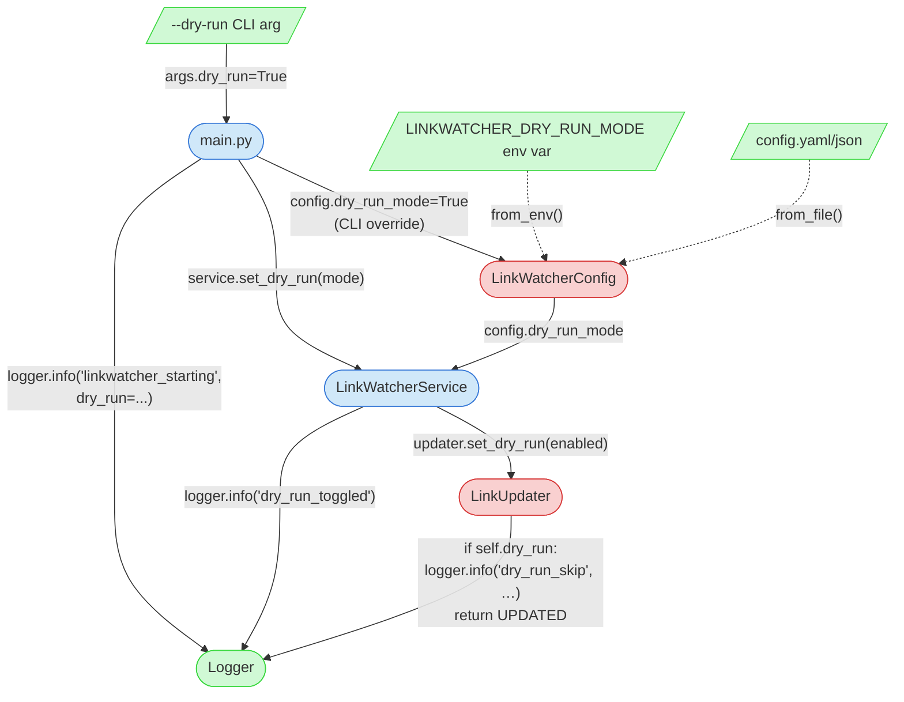

# Integration Narrative: Dry-Run Mode

> **Workflow**: WF-007 — User starts LinkWatcher in dry-run mode to preview what would change without modifying files

## Workflow Overview

**Entry point**: User invokes LinkWatcher with dry-run enabled via any of three configuration sources — `--dry-run` CLI flag, `LINKWATCHER_DRY_RUN_MODE=true` environment variable, or `dry_run_mode: true` in a YAML/JSON config file.

**Exit point**: Filesystem events are detected, parsed, and correlated as normal, but the final on-disk write step is intercepted inside [LinkUpdater](src/linkwatcher/updater.py). For every file that *would* have been modified, the updater emits a structured `dry_run_skip` log event carrying the absolute file path and reference count, and returns `UpdateResult.UPDATED` **without performing any I/O**. No `.bak` files are created, no atomic-rename temp files are written, and the on-disk state is identical before and after.

**Flow summary**: The flag flows **Configuration → Core Architecture (main.py) → Core Architecture (LinkWatcherService) → Link Updater**, after which the Logging Framework is the sole observable surface through which the user sees what *would* have changed. Detection, parsing, path resolution, and database updates are **not** bypassed — dry-run is a single write-gate guard, not a global no-op.

## Participating Features

| Feature ID | Feature Name | Role in Workflow |
|-----------|-------------|-----------------|
| 0.1.3 | Configuration System | Defines the `dry_run_mode: bool` field on [LinkWatcherConfig](src/linkwatcher/config/settings.py#L110); sets defaults (`False` in `DEFAULT_CONFIG` and `DEVELOPMENT_PRESET`, `True` in `TESTING_PRESET`); exposes the `LINKWATCHER_DRY_RUN_MODE` env var; applies the multi-source precedence cascade (CLI > env > file > defaults) |
| 0.1.1 | Core Architecture | [main.py](main.py) parses the `--dry-run` CLI flag and overrides `config.dry_run_mode = True` after env/file loading; logs the effective value in `linkwatcher_starting`; `LinkWatcherService.set_dry_run()` at [service.py:263](src/linkwatcher/service.py#L263) delegates to the updater and emits the `dry_run_toggled` log event |
| 2.2.1 | Link Updating | [LinkUpdater.dry_run](src/linkwatcher/updater.py#L67) holds the enforcement flag; the two guards at [updater.py:195](src/linkwatcher/updater.py#L195) and [updater.py:230](src/linkwatcher/updater.py#L230) short-circuit the single-move and multi-move write paths before any replacement computation or file I/O; `set_dry_run()` at [updater.py:555](src/linkwatcher/updater.py#L555) is the runtime mutator |
| 3.1.1 | Logging Framework | Sole observable output surface in dry-run mode; receives `linkwatcher_starting` (with `dry_run=<bool>`), `dry_run_toggled` (at service startup), and one `dry_run_skip` event per file-that-would-have-been-modified (carrying `file_path` and `references_count`) |

## Component Interaction Diagram

## Data Flow Sequence

1. **CLI entry — [main.py](main.py)** receives `sys.argv` including `--dry-run`
   - Performs: `argparse` sets `args.dry_run = True` (see [main.py:260-264](main.py#L260-L264))
   - Passes to next: `argparse.Namespace` with `dry_run=True`

2. **Config loader — [main.py `load_configuration()`](main.py)** receives the `Namespace` and an empty `LinkWatcherConfig` seeded with `DEFAULT_CONFIG`
   - Performs: merges file config (`from_file()`), merges env config (`from_env()`; reads `LINKWATCHER_DRY_RUN_MODE`), then the CLI override block at [main.py:78-80](main.py#L78-L80): `if args.dry_run: config.dry_run_mode = True` — CLI always wins
   - Passes to next: populated `LinkWatcherConfig` with `dry_run_mode=True`

3. **Startup logger — [main.py:355-362](main.py#L355-L362)** receives the final `LinkWatcherConfig`
   - Performs: emits `logger.info("linkwatcher_starting", dry_run=config.dry_run_mode, …)` — this is the first user-visible confirmation that dry-run is active
   - Passes to next: same config handed to `LinkWatcherService` constructor

4. **Service constructor — [LinkWatcherService.__init__()](src/linkwatcher/service.py#L54)** receives the `LinkWatcherConfig`
   - Performs: instantiates `LinkUpdater(project_root, python_source_root=…)` at [service.py:82](src/linkwatcher/service.py#L82); note the updater is created with its default `self.dry_run = False` ([updater.py:67](src/linkwatcher/updater.py#L67)) — the flag is **not** passed through the constructor
   - Passes to next: a `LinkUpdater` instance with `dry_run=False` wired into `service.updater`

5. **Post-construction propagation — [main.py:377](main.py#L377)** calls `service.set_dry_run(config.dry_run_mode)`
   - Performs: inside [service.py:263-266](src/linkwatcher/service.py#L263-L266), `self.updater.set_dry_run(enabled)` flips the updater's flag, then `self.logger.info("dry_run_toggled", enabled=enabled)` records the transition
   - Passes to next: `LinkUpdater` now has `self.dry_run = True`; `service.start()` is called next and the observer begins processing events

6. **Write-gate guards — [LinkUpdater._update_file_references()](src/linkwatcher/updater.py#L186) and [LinkUpdater._update_file_references_multi()](src/linkwatcher/updater.py#L215)** receive `List[LinkReference]` or `List[Tuple[LinkReference, str, str]]` after a move is processed
   - Performs: resolves `abs_file_path`, then checks `if self.dry_run:` — if true, emits `logger.info("dry_run_skip", file_path=abs_file_path, references_count=len(…))` and **returns `UpdateResult.UPDATED` immediately**; the replacement-item computation, regex matching, tempfile write, and atomic rename are all skipped
   - Passes to next: the caller (`update_references()` / `update_references_multi()`) sees `UPDATED`, increments `files_updated` / `references_updated` counters, and calls `self.logger.links_updated(file_path, len(file_references))` — so statistics look identical to a live run, but nothing was written

7. **Observable surface — Logger (3.1.1)** receives the structured events throughout the run
   - Performs: console, file, and/or JSON output per logging configuration
   - Final output: user sees `linkwatcher_starting` (with `dry_run=true`), one `dry_run_toggled` event, and one `dry_run_skip` event per file the updater would have rewritten — complete with the affected `file_path` and `references_count`

## Callback/Event Chains

This workflow uses direct function calls between components. No callback or event chain mechanisms are used for the dry-run behavior itself — the flag is set synchronously at startup and never mutated again during normal execution (though `set_dry_run()` is runtime-capable, the documented lifecycle calls it exactly once, before `service.start()`).

Watchdog observer callbacks and filesystem-event handling (features 1.1.1, 2.1.1, 0.1.2) fire normally in dry-run mode — the workflow does **not** intercept at the event layer.

## Configuration Propagation

| Config Value | Source | Consumed By | Effect on Workflow |
|-------------|--------|-------------|-------------------|
| `dry_run_mode` (bool) | `LinkWatcherConfig` dataclass field ([settings.py:110](src/linkwatcher/config/settings.py#L110)); default `False` | `main.py` reads at startup and calls `service.set_dry_run()` | Root toggle — drives the entire workflow |
| `--dry-run` CLI flag | `argparse` in [main.py:260-264](main.py#L260-L264) | `main.py:78-80` sets `config.dry_run_mode = True` (highest precedence) | Ad-hoc per-invocation override; always wins over file/env |
| `LINKWATCHER_DRY_RUN_MODE` env var | `LinkWatcherConfig.from_env()` (see [settings.py:240](src/linkwatcher/config/settings.py#L240)) | `main.py` merges env config before CLI override | CI/container scenarios where editing config files is undesirable |
| `dry_run_mode: true` in YAML/JSON | `LinkWatcherConfig.from_file()` | `main.py` merges file config before env and CLI | Project-persistent dry-run (e.g., shared "preview" profile) |
| `TESTING_PRESET.dry_run_mode = True` | [defaults.py:130](src/linkwatcher/config/defaults.py#L130) | Unit/integration tests that load the testing preset | Guarantees test runs never mutate fixture files |
| `self.dry_run` (runtime) | `LinkUpdater.__init__` default `False` ([updater.py:67](src/linkwatcher/updater.py#L67)); mutated by `set_dry_run()` | Both guard sites in `LinkUpdater` | The single enforcement point — nothing else in the codebase gates on `config.dry_run_mode` directly |

**Critical note**: `LinkUpdater` is instantiated with `dry_run=False` regardless of `config.dry_run_mode`; the flag is only applied *after* construction via `service.set_dry_run()`. The `main.py` startup path guarantees this call happens before `service.start()`, so no write occurs with stale state. However, any embedder that constructs `LinkWatcherService` directly without calling `set_dry_run()` before `start()` will run live despite `config.dry_run_mode = True`.

## Error Handling Across Boundaries

### Invalid config value for `dry_run_mode`

- **Origin**: User supplies a non-boolean value in YAML/JSON, or a non-coercible string in the env var
- **Propagation**: `LinkWatcherConfig.from_file()` / `from_env()` raise or log `config_load_failed` / `environment_config_failed` warnings in [main.py:66-75](main.py#L66-L75); the faulty source is skipped and the config falls back to earlier-precedence sources (ultimately `DEFAULT_CONFIG.dry_run_mode = False`)
- **Impact**: LinkWatcher silently runs in **live mode** — exactly what the user wanted to avoid
- **Recovery**: The `linkwatcher_starting` log event includes `dry_run=<final_value>`, giving the user a single point of truth. Users relying on dry-run for safety should check that field before moving files

### Write-path exception raised inside the updater (live mode)

- **Origin**: I/O failure, encoding error, or atomic-rename conflict during `_apply_replacements()` ([updater.py](src/linkwatcher/updater.py))
- **Propagation**: Live mode only — the dry-run guard short-circuits *before* the try/except block that wraps replacements; the exception cannot fire if `self.dry_run = True`
- **Impact**: N/A in dry-run — this scenario is definitionally unreachable because no write is attempted
- **Recovery**: Dry-run is effectively exception-free for the updater's write path, making it a safe pre-flight check before enabling live updates on a risky reorganization

### `set_dry_run()` not called before `start()` (embedder scenario)

- **Origin**: External code that instantiates `LinkWatcherService` directly (tests, debug scripts, future embedders) without replicating `main.py`'s post-construction `service.set_dry_run()` call
- **Propagation**: No error raised; `LinkUpdater.dry_run` remains at its `False` default
- **Impact**: Files are modified despite `config.dry_run_mode = True` — silent divergence between declared config and actual behavior
- **Recovery**: The `TESTING_PRESET` avoids this trap by being opinionated, but ad-hoc embedders must explicitly call `set_dry_run()`. Tracked as a known implication of the post-construction propagation design — see the "Critical note" in Configuration Propagation above

---

*This Integration Narrative was created as part of the Integration Narrative Creation task (PF-TSK-083).*
