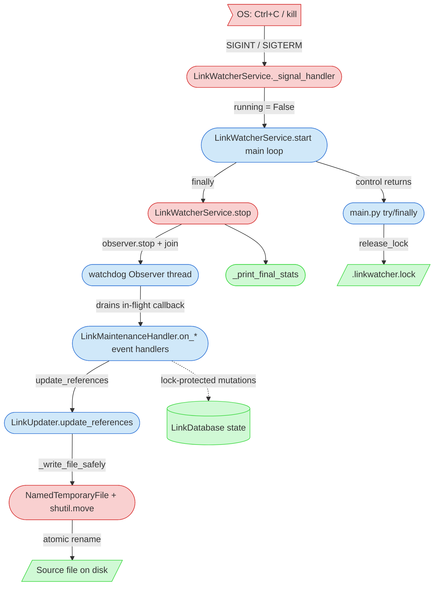

# Integration Narrative: Graceful Shutdown

> **Workflow**: WF-008 — How signal handling, atomic file writes, and lock-file lifecycle collaborate so LinkWatcher can be stopped at any time (Ctrl+C / SIGTERM) without leaving any file in a corrupted or partially-updated state.

## Workflow Overview

**Entry point**: An OS termination signal (SIGINT from Ctrl+C, or SIGTERM from `kill`) is delivered to the running `python main.py` process. A file update may or may not be in flight at the moment the signal arrives.

**Exit point**: The process exits with:
- The watchdog `Observer` thread stopped and joined
- Any in-flight file update either fully applied (via atomic rename) or fully absent (with the temp file cleaned up)
- `.linkwatcher.lock` removed from the project root
- Final statistics logged via the structured logger

**Flow summary**: The signal flips `LinkWatcherService.running = False`. The service's main loop exits and its `finally: self.stop()` clause runs, which calls `observer.stop()` then `observer.join()` — the join blocks until any in-flight `on_moved`/`on_created`/`on_deleted` callback returns. Inside the callback, `LinkUpdater._write_file_safely()` has already committed each per-file change through a `NamedTemporaryFile` + `shutil.move()` rename, so the on-disk file is never half-written. The `LinkDatabase` holds only in-memory state (single `threading.Lock` guarding all mutations, no persistence), so its state is simply discarded. Control then returns to `main.py`, whose outer `try/finally` calls `release_lock()` to unlink the lock file.

## Participating Features

| Feature ID | Feature Name | Role in Workflow |
|-----------|-------------|-----------------|
| [0.1.1](/doc/state-tracking/features/0.1.1-core-architecture-implementation-state.md) | Core Architecture | Registers `SIGINT`/`SIGTERM` handlers on the service; owns the `Observer` lifecycle and the `while self.running: sleep(1)` main loop; `try/finally` guarantees `stop()` is called; `main.py` acquires and releases `.linkwatcher.lock` around `service.start()`. |
| [2.2.1](/doc/state-tracking/features/2.2.1-link-updating-implementation-state.md) | Link Updating | Performs every file modification via `_write_file_safely()`: optional `.bak` copy, `NamedTemporaryFile` write in the same directory, then `shutil.move()` rename. This is what makes in-flight updates safe across a shutdown — at no point does a partial file replace the original. |
| [0.1.2](/doc/state-tracking/features/0.1.2-in-memory-link-database-implementation-state.md) | In-Memory Link Database | Provides thread-safe, in-memory-only link state. All mutations are serialized by a single `threading.Lock`; there is no persistent store and no flush step on exit, so shutdown cannot corrupt the database — it simply vanishes with the process. |

## Component Interaction Diagram

## Data Flow Sequence

1. **OS → Python signal machinery** delivers `SIGINT` or `SIGTERM` to the process.
   - Python's signal module invokes the registered handler on the main thread at the next bytecode-safe boundary.
   - No data payload — only the signal number.

2. **`LinkWatcherService._signal_handler(signum, frame)`** ([service.py:225-228](src/linkwatcher/service.py#L225-L228))
   - Logs `shutdown_signal_received` with `signal=signum`.
   - Sets `self.running = False`.
   - Returns immediately — does **not** call `stop()` or touch the observer. The handler is deliberately minimal so it is safe to run from signal context.

3. **`LinkWatcherService.start()` main loop** ([service.py:147-157](src/linkwatcher/service.py#L147-L157))
   - The `while self.running: time.sleep(1)` loop observes the flipped flag on its next wake-up (within ~1 s) and exits.
   - A `KeyboardInterrupt` raised mid-`sleep` is also caught by an inner `except KeyboardInterrupt: pass`, which yields the same exit path.
   - Control falls through to the outer `finally: self.stop()` ([service.py:162-163](src/linkwatcher/service.py#L162-L163)).

4. **`LinkWatcherService.stop()`** ([service.py:165-178](src/linkwatcher/service.py#L165-L178))
   - Sets `self.running = False` (idempotent).
   - Calls `self.observer.stop()` — watchdog stops accepting new filesystem events.
   - Calls `self.observer.join()` — **blocks the main thread until the observer's dispatcher thread finishes the callback it is currently executing**. This is the critical synchronization point for in-flight updates.
   - Calls `self._print_final_stats()` → when `config.show_statistics` is `True` (default), logs `operation_stats` aggregated from `handler.get_stats()` and `link_db.get_stats()`. When `False` (set by `--quiet` or by user-supplied config), the method returns early and no stats are emitted (PD-REF-202 / TD229).
   - Logs `service_stopped`.

5. **Watchdog Observer thread — in-flight callback (if any)** ([handler.py, `on_moved`/`on_created`/`on_deleted`](src/linkwatcher/handler.py))
   - The observer's internal dispatcher invokes the relevant `LinkMaintenanceHandler.on_*` method synchronously on its own thread.
   - If the callback is mid-execution when `observer.stop()` is called, `observer.join()` lets it finish — it is not preempted.
   - During the callback, the handler may call `LinkUpdater.update_references(...)`.

6. **`LinkUpdater.update_references(...)` → `_write_file_safely(file_path, content)`** ([updater.py:517-553](src/linkwatcher/updater.py#L517-L553))
   - **Backup** (if `backup_enabled`): `shutil.copy2(file_path, f"{file_path}.bak")`.
   - **Write**: `tempfile.NamedTemporaryFile(mode="w", encoding="utf-8", dir=dir_path, delete=False)` creates a temp file **in the same directory** as the target (ensuring the later rename stays on one filesystem, which is what makes it atomic on POSIX and Windows NTFS).
   - **Rename**: `shutil.move(temp_path, file_path)` — because the source and destination are on the same filesystem, this resolves to an atomic rename. Readers on disk see either the old file or the new file — never a partial one.
   - **Failure cleanup**: If anything raises, the `except` branch unlinks the temp file if it still exists, then re-raises.

7. **`LinkDatabase` mutations** ([database.py:225, 280, 287, 338, 374, 509, 576, 615, 646, 703-735](src/linkwatcher/database.py))
   - Every public write method (`add_link`, `add_links_batch`, `remove_file_links`, `update_target_path`, `remove_stale_entries`, `clear`) enters `with self._lock:` before touching the five/eight internal indexes.
   - At shutdown the lock is released automatically when the `with` block exits. No flush, no close, no persistent handle — state is pure Python dicts/sets held by the process and is discarded when the interpreter exits.

8. **`main.py` outer `try/finally`** ([main.py:372-391](main.py#L372-L391))
   - The `service.start()` call returns (normally, via `KeyboardInterrupt`, or via propagated exception).
   - `finally: release_lock(lock_file)` runs unconditionally and calls `lock_file.unlink()` ([main.py:226-232](main.py#L226-L232)) — swallowing any `OSError`.
   - An outer `except KeyboardInterrupt` ([main.py:393-396](main.py#L393-L396)) logs `linkwatcher_stopped_by_user` and exits with code 0.

## Callback/Event Chains

### Signal → main loop exit

- **Registration**: `signal.signal(signal.SIGINT, self._signal_handler)` and `signal.signal(signal.SIGTERM, self._signal_handler)` in `LinkWatcherService.__init__` ([service.py:96-99](src/linkwatcher/service.py#L96-L99)), gated by the `register_signals` constructor argument so embedders can opt out.
- **Trigger**: OS delivery of SIGINT (Ctrl+C) or SIGTERM (`kill <pid>`).
- **Handler**: `_signal_handler` sets `self.running = False` and returns; the main `while self.running:` loop picks up the change on its next `time.sleep(1)` wake.
- **Cross-feature boundary**: OS → 0.1.1 Core Architecture (service lifecycle).

### Observer thread → handler callbacks (drained by `observer.join()`)

- **Registration**: `self.observer.schedule(self.handler, str(self.project_root), recursive=True)` in `start()` ([service.py:122](src/linkwatcher/service.py#L122)).
- **Trigger**: A filesystem event that was already in the observer's queue (or currently executing) when shutdown begins.
- **Handler**: `LinkMaintenanceHandler.on_moved` / `on_created` / `on_deleted`, which may eventually call `LinkUpdater.update_references()`.
- **Cross-feature boundary**: 1.1.1 File System Monitoring → 2.2.1 Link Updating. The `observer.join()` call in `stop()` is what guarantees these callbacks run to completion — including their atomic write — before the process exits.

### Service lifetime → lock file lifecycle

- **Registration**: `lock_file = acquire_lock(project_root)` before `service = LinkWatcherService(...)` ([main.py:318](main.py#L318)); paired with `finally: release_lock(lock_file)` ([main.py:390-391](main.py#L390-L391)).
- **Trigger**: Any exit from `service.start()` — normal completion, `KeyboardInterrupt`, or an exception propagated from deep inside the observer/handler.
- **Handler**: `release_lock` calls `lock_file.unlink()`, swallowing `OSError` so a missing or already-removed lock never masks the original exit cause.
- **Cross-feature boundary**: 0.1.1 Core Architecture (CLI entry) → OS filesystem.

## Configuration Propagation

| Config Value | Source | Consumed By | Effect on Workflow |
|-------------|--------|-------------|-------------------|
| `create_backups` | `LinkWatcherConfig` (loaded from YAML/JSON/env/CLI) | `LinkUpdater.set_backup_enabled()` called from `LinkWatcherService.__init__` at [service.py:98](src/linkwatcher/service.py#L98) (TD235 / PD-REF-203); read inside `_write_file_safely()` ([updater.py:520](src/linkwatcher/updater.py#L520)) | When `True`, each in-flight update additionally produces a `.bak` copy before the atomic rename. A shutdown mid-update can therefore leave either the original file plus a `.bak`, or the updated file plus a `.bak` — never a corrupted primary. |
| `dry_run_mode` | `LinkWatcherConfig` via CLI `--dry-run` or config file | `LinkUpdater.set_dry_run()` called from `LinkWatcherService.__init__` at [service.py:97](src/linkwatcher/service.py#L97) | When `True`, `_write_file_safely()` is not reached — updates are logged and skipped, so shutdown trivially leaves disk untouched. |
| `register_signals` | Constructor argument to `LinkWatcherService` (default `True`) | `LinkWatcherService.__init__` ([service.py:97-99](src/linkwatcher/service.py#L97-L99)) | When `False` (e.g., when embedding the service inside a larger host process), the host owns the signal path and must drive `service.stop()` itself. The lock file and atomic-write guarantees still hold. |

## Error Handling Across Boundaries

### Exception inside an in-flight update

- **Origin**: `LinkUpdater._write_file_safely` — e.g., the temp file write raises `OSError` (disk full, permission, interrupted syscall).
- **Propagation**: The `except` branch deletes the temp file if present and re-raises ([updater.py:546-553](src/linkwatcher/updater.py#L546-L553)). The exception bubbles up through `update_references()` into the handler callback. Higher up in the handler, per-operation `try/except` logs the error and increments the `errors` stat but does not re-raise, so the observer thread stays healthy.
- **Impact**: The target file is unchanged (atomic rename never happened). Any `.bak` created just before the failed write remains on disk — acceptable leftover, not corruption.
- **Recovery**: No retry within the shutdown path. The in-memory DB still holds the old link reference, which would be re-discovered on next startup scan.

### Shutdown while observer thread is blocked

- **Origin**: The watchdog observer could be blocked on a slow filesystem operation (large file read, network drive).
- **Propagation**: `observer.join()` waits indefinitely. There is **no timeout** on the join in the current code.
- **Impact**: Shutdown can stall for as long as the in-flight callback takes. A second Ctrl+C (KeyboardInterrupt) during the join may leave the observer thread in an unjoined state, but the OS still reclaims resources on process exit.
- **Recovery**: None automated. User-visible symptom: a short hang after Ctrl+C. The atomic-write guarantee still holds — whatever rename was committed stays committed; whatever wasn't is cleaned up via the temp-file `except` path if the process is hard-killed mid-write, because only the temp file exists, not a partially-overwritten original.

### Lock file could not be acquired at startup (pre-workflow)

- **Origin**: `acquire_lock()` detects a live PID already holding the lock.
- **Propagation**: `sys.exit(1)` before `LinkWatcherService` is constructed ([main.py:200-205](main.py#L200-L205)).
- **Impact**: No shutdown flow to worry about — the second instance never started the observer or the service loop.
- **Recovery**: User reruns after stopping the other instance.

### Lock file remains after unclean exit

- **Origin**: Process SIGKILL-ed (unblockable), power loss, OS crash — none of these run Python `finally` blocks.
- **Propagation**: The lock file persists with a now-dead PID.
- **Impact**: On next startup, `acquire_lock` reads the stored PID, calls `_is_pid_running(pid)` (platform-specific: Windows `OpenProcess` / POSIX `os.kill(pid, 0)`) ([main.py:164-187](main.py#L164-L187)), and if the PID is no longer live it prints `Overriding stale lock file` and proceeds.
- **Recovery**: Automatic on the next start.

---

*This Integration Narrative was created as part of the Integration Narrative Creation task (PF-TSK-083).*
