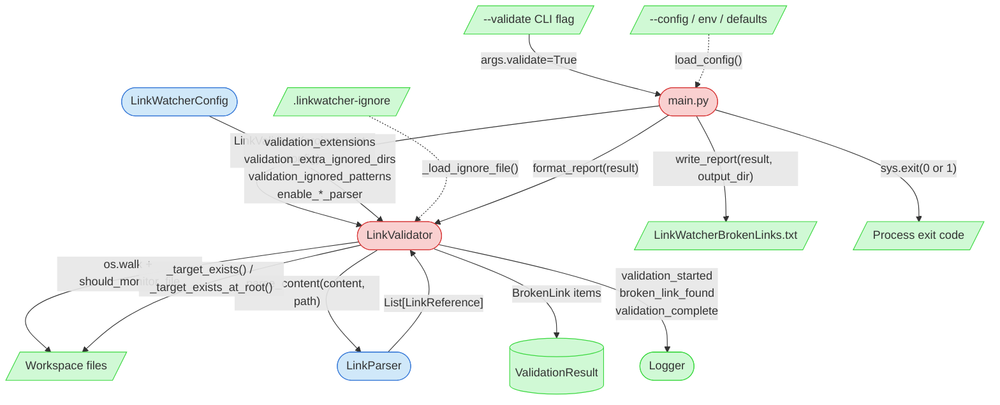

# Integration Narrative: Link Health Audit

> **Workflow**: WF-009 — User runs `python main.py --validate` to scan the workspace for broken file references and produces a report at `process-framework-local/tools/linkWatcher/LinkWatcherBrokenLinks.txt`

## Workflow Overview

**Entry point**: User invokes `python main.py --validate` (optionally with `--config`, `--project-root`, `--log-file`, `--quiet`, `--debug`). `argparse` at [main.py:268-272](main.py#L268-L272) sets `args.validate = True`, and the branch at [main.py:281-314](main.py#L281-L314) takes over before any live-watcher machinery runs — **no lock file is acquired, no observer is started, no `LinkWatcherService` is instantiated, and the in-memory link database is never constructed**.

**Exit point**: Two observable artifacts are produced before the process exits:
1. **`process-framework-local/tools/linkWatcher/LinkWatcherBrokenLinks.txt`** — a human-readable text report written by [LinkValidator.write_report()](src/linkwatcher/validator.py#L702) to `output_dir`. When `--log-file` (or `config.log_file`) is set, `output_dir` is that log file's parent directory; otherwise it is the project root ([main.py:304-309](main.py#L304-L309)).
2. **Process exit code** — `0` when `ValidationResult.is_clean` is true (no broken links), `1` otherwise ([main.py:314](main.py#L314)). This makes `--validate` suitable for CI gating.

**Flow summary**: The flag flows **CLI → main.py validate-branch → `load_config()` → `LinkValidator(__init__)` → `validate()` walk → per-file `LinkParser.parse_content()` → target skip/resolution → `BrokenLink` aggregation → `format_report()` → `write_report()` → `sys.exit()`**. The validator **reuses** the live pipeline's `LinkParser` for link extraction but runs against an entirely separate control path — the database, handler, updater, and service are absent from this workflow. Configuration is the primary workflow-shaping input: `validation_extensions` gates which files are walked, `validation_extra_ignored_dirs` prunes directory subtrees, `validation_ignored_patterns` + `.linkwatcher-ignore` suppress false positives on link targets.

## Participating Features

| Feature ID | Feature Name | Role in Workflow |
|-----------|-------------|-----------------|
| 0.1.1 | Core Architecture | [main.py](main.py) parses the `--validate` flag; takes the read-only branch at [main.py:281](main.py#L281); calls `load_config()` at [main.py:291](main.py#L291); instantiates `LinkValidator(str(project_root), config)` at [main.py:292](main.py#L292); invokes `validator.validate()` at [main.py:297](main.py#L297); formats and writes the report at [main.py:298-309](main.py#L298-L309); calls `sys.exit(0 or 1)` at [main.py:314](main.py#L314) |
| 0.1.3 | Configuration System | Defines the four validation-specific fields on [LinkWatcherConfig](src/linkwatcher/config/settings.py#L129-L158): `validation_extensions` (which extensions are walked), `validation_extra_ignored_dirs` (pruned subtrees), `validation_ignored_patterns` (target-substring skip list), `validation_ignore_file` (path to `.linkwatcher-ignore`). Also propagates the live-pipeline fields `ignored_directories` and `enable_<format>_parser` into the validator run |
| 2.1.1 | Link Parsing System | [LinkParser.parse_content(content, file_path)](src/linkwatcher/parser.py#L91) dispatches by file extension to the appropriate specialized parser (`MarkdownParser`, `YamlParser`, `JsonParser`, `PythonParser`, etc. or `GenericParser` fallback) and returns `List[LinkReference]`. Reused unchanged from the live-watching pipeline — validation-specific context filtering (code blocks, archival sections, table rows) is applied *after* parsing inside `LinkValidator`, not inside the parsers |
| 6.1.1 | Link Validation | [LinkValidator](src/linkwatcher/validator.py#L230) owns the workspace walk (`os.walk` with ignored-dir pruning), per-file dispatch to the parser, target-skip predicates (`_TARGET_SKIP_PREDICATES` — URLs, shell commands, wildcards, regex fragments, etc.), context-based reference skipping (`_should_skip_reference` — code blocks, archival `<details>`, table rows, template files, placeholder lines), source-relative + project-root-relative target resolution, `.linkwatcher-ignore` rule application, `BrokenLink` aggregation into `ValidationResult`, and `format_report()` / `write_report()` output |

## Component Interaction Diagram



## Data Flow Sequence

1. **CLI entry — [main.py](main.py)** receives `sys.argv` including `--validate`
   - Performs: `argparse.ArgumentParser.parse_args()` at [main.py:275](main.py#L275) sets `args.validate = True` (definition at [main.py:268-272](main.py#L268-L272))
   - Passes to next: `argparse.Namespace` with `validate=True`, plus optional `config`, `project_root`, `log_file`, `quiet`, `debug`

2. **Validate branch — [main.py:279-314](main.py#L279-L314)** receives the `Namespace`
   - Performs: calls `validate_project_root(args.project_root)` at [main.py:279](main.py#L279) (shared with live-watcher startup); checks `if args.validate:` at [main.py:282](main.py#L282) and **short-circuits around** the lock acquisition at line 318, the startup banner, and `LinkWatcherService` instantiation
   - Passes to next: resolved `project_root: Path` and the `Namespace`

3. **Logging setup — [main.py:283-290](main.py#L283-L290)** receives `args.debug` / `args.quiet`
   - Performs: chooses `LogLevel` (DEBUG / ERROR / INFO), calls `setup_logging(level, colored_output=not args.quiet, show_icons=not args.quiet)` — **note**: no log file is wired at this point even if `--log-file` was passed; file logging only activates in the live-watcher branch. The validator's structured events therefore go to console only unless a file handler is later added (none is)
   - Passes to next: configured root `Logger`

4. **Config loader — [main.py:291](main.py#L291) / `load_config()`](main.py#L47)** receives `args.config, args, project_root=str(project_root)`
   - Performs: seeds from `DEFAULT_CONFIG`, merges `LinkWatcherConfig.from_file(config_path)` if `--config` given, merges `LinkWatcherConfig.from_env()` for `LINKWATCHER_*` env vars, applies CLI overrides (note: none of the `--validate` siblings override `validation_*` fields — those come purely from env/file/defaults). On [main.py:88-91](main.py#L88-L91) falls back to `paths.source_code` from `doc/project-config.json` for `python_source_root` (irrelevant to validation)
   - Passes to next: populated `LinkWatcherConfig` with `validation_extensions`, `validation_extra_ignored_dirs`, `validation_ignored_patterns`, `validation_ignore_file`, `ignored_directories`, and `enable_<format>_parser` fields

5. **Validator construction — [LinkValidator.__init__()](src/linkwatcher/validator.py#L239)** receives `(project_root: str, config: LinkWatcherConfig)`
   - Performs: resolves `self.project_root` to absolute form; instantiates `self.parser = LinkParser(self.config)` at [validator.py:249](src/linkwatcher/validator.py#L249) — **the parser honours `enable_<format>_parser` flags but has no validation-specific configuration**; captures `self._validation_extensions`, `self._extra_ignored_dirs`; calls `self._ignore_rules = self._load_ignore_file()` at [validator.py:253](src/linkwatcher/validator.py#L253) which reads `.linkwatcher-ignore` and compiles each `source_glob -> target_substring` line into a `(re.Pattern, str)` tuple ([validator.py:597-626](src/linkwatcher/validator.py#L597-L626)); initialises `self._exists_cache: Dict[str, bool] = {}` to memoise `os.path.exists` lookups
   - Passes to next: a ready `LinkValidator` instance

6. **Workspace walk — [LinkValidator.validate()](src/linkwatcher/validator.py#L256)** receives no arguments (state comes from `self`)
   - Performs: emits `validation_started` log event; computes `ignored_dirs = self.config.ignored_directories | self._extra_ignored_dirs` (union at [validator.py:267](src/linkwatcher/validator.py#L267)); walks `self.project_root` with `os.walk`, pruning `dirs[:]` in-place so matched directories are not recursed; for each file, calls `should_monitor_file(file_path, self._validation_extensions, ignored_dirs, self.project_root)` from `utils.py` — **uses `validation_extensions` (default `{.md, .yaml, .yml, .json}`), NOT the live pipeline's broader `monitored_extensions`**; per-file timings are aggregated into `ext_timings` and emitted via `logger.performance.log_metric("validation_extension_duration", …)` at the end
   - Passes to next: each qualifying `file_path` is handed to `self._check_file(file_path, result)`

7. **Per-file parsing & link extraction — [LinkValidator._check_file()](src/linkwatcher/validator.py#L325)** receives `(file_path: str, result: ValidationResult)`
   - Performs: reads the file with `errors="replace"` (UTF-8 with lossy decode so encoding failures don't abort the scan); on `OSError` logs `validation_parse_failed` and returns (the file is skipped — no `BrokenLink` added for unreadable files); calls `self.parser.parse_content(content, file_path)` at [validator.py:339](src/linkwatcher/validator.py#L339); wraps the call in `try/except Exception` → same `validation_parse_failed` log on failure; increments `result.files_scanned`. **This is the cross-feature boundary to 2.1.1 Link Parsing** — validator supplies the content, parser returns `List[LinkReference]`
   - For markdown files, also calls `self._get_context_lines(lines)` at [validator.py:365](src/linkwatcher/validator.py#L365) which scans once to produce 4 `FrozenSet[int]` of 1-based line numbers: `code_block_lines` (inside ``` fences), `archival_details_lines` (inside `<details>` with summaries containing "closed"/"history"/"completed"/"archived"), `table_row_lines` (lines starting with `|`), and `placeholder_lines` (lines containing "replace with actual")
   - Computes `is_template_file = "/templates/" in rel_path` at [validator.py:372](src/linkwatcher/validator.py#L372) — standalone links in any path containing `/templates/` are treated as instructional examples
   - Passes to next: the per-reference check loop at [validator.py:377-429](src/linkwatcher/validator.py#L377-L429)

8. **Parser dispatch — [LinkParser.parse_content()](src/linkwatcher/parser.py#L91)** receives `(content: str, file_path: str)`
   - Performs: derives `file_ext` from `file_path`; if `file_ext in self.parsers` (populated at [parser.py:32-55](src/linkwatcher/parser.py#L32-L55) based on `enable_<format>_parser` flags), delegates to that specialized parser's `parse_content(content, file_path)`; otherwise falls back to `self.generic_parser.parse_content()` if enabled, else returns `[]`. Wrapped in `LogTimer("content_parsing", …)` for performance metrics. The `try/except Exception` at [parser.py:98](src/linkwatcher/parser.py#L98) catches all parser failures and returns `[]` — the validator's outer `try/except` in `_check_file` therefore rarely fires
   - Passes to next: `List[LinkReference]` — each with `link_target`, `line_number`, `link_type`

9. **Target skip + resolution — [LinkValidator._check_file() loop](src/linkwatcher/validator.py#L377-L429)** iterates over each `LinkReference`
   - Performs: first filter is `_should_check_target(target, link_type)` at [validator.py:380](src/linkwatcher/validator.py#L380) — applies 12 predicates in `_TARGET_SKIP_PREDICATES` (URL prefixes, Python imports, shell commands, wildcards, numeric-slash patterns, ext-before-slash alternatives, regex metacharacters, PowerShell `.\` syntax, template placeholders, whitespace, bare filenames) plus `looks_like_file_path()` heuristic. Second filter is `_should_skip_reference()` at [validator.py:383-391](src/linkwatcher/validator.py#L383-L391) which checks `validation_ignored_patterns`, placeholder lines, and — **only for standalone link types** — template files, code blocks, archival sections, and table rows. If the reference survives both filters, increments `result.links_checked`
   - Calls `self._target_exists(file_path, target)` at [validator.py:396](src/linkwatcher/validator.py#L396) — strips `#anchor`, resolves `/`-prefixed paths against `project_root` and all others against `os.path.dirname(source_file)`, checks `os.path.exists` with a `_exists_cache` memoisation
   - **Root-fallback for data-value types** — at [validator.py:401-406](src/linkwatcher/validator.py#L401-L406), if source-relative resolution failed AND `ref.link_type in _DATA_VALUE_LINK_TYPES` (YAML, JSON, and all MARKDOWN_STANDALONE / QUOTED / BACKTICK / BARE_PATH / AT_PREFIX types) AND the target isn't already absolute/parent-relative, tries `_target_exists_at_root(target)` — resolves against project root. This catches data-config entries written project-root-relative from deeply nested files
   - **Per-file ignore rules** — at [validator.py:411](src/linkwatcher/validator.py#L411), if still broken, checks `self._is_ignored(rel_source, target)` which walks `self._ignore_rules` looking for a compiled glob that matches `rel_source` combined with a target substring that appears in `target`
   - Passes to next: if all checks fail to validate the link, logs `broken_link_found` warning and appends `BrokenLink(source_file, line_number, target_path, link_type)` to `result.broken_links`

10. **Result aggregation & logging — [LinkValidator.validate() tail](src/linkwatcher/validator.py#L300-L319)** receives the populated `ValidationResult`
    - Performs: sets `result.duration_seconds = time.monotonic() - start`; iterates `ext_timings` in descending order and emits one `validation_extension_duration` performance metric per extension; emits the single summary event `validation_complete` with `files_scanned`, `links_checked`, `broken_count`, `duration_seconds`
    - Passes to next: returns `ValidationResult` to `main.py`

11. **Report formatting + write — [main.py:298-309](main.py#L298-L309)** receives the `ValidationResult`
    - Performs: calls `LinkValidator.format_report(result)` at [main.py:298](main.py#L298) — returns a human-readable text block with `Files scanned / Links checked / Broken links / Duration` header and a per-broken-link list (`source_file:line_number -> target_path (link_type)`); prints to stdout unless `--quiet`; determines `output_dir` from `args.log_file or config.log_file` parent, else `project_root`; calls `LinkValidator.write_report(result, output_dir)` at [main.py:309](main.py#L309) which calls `os.makedirs(output_dir, exist_ok=True)` and writes the same report to `{output_dir}/LinkWatcherBrokenLinks.txt` (UTF-8, overwriting any previous report)
    - Passes to next: `report_path` printed to stdout (unless `--quiet`)

12. **Exit — [main.py:314](main.py#L314)** receives `result.is_clean`
    - Performs: `sys.exit(0 if result.is_clean else 1)` — `is_clean` is the `@property` at [validator.py:63-65](src/linkwatcher/validator.py#L63-L65) defined as `len(self.broken_links) == 0`
    - Final output: the process terminates; the user/CI inspects the exit code and/or reads `process-framework-local/tools/linkWatcher/LinkWatcherBrokenLinks.txt`

## Callback/Event Chains

This workflow uses direct synchronous function calls between components. No callback, event, observer, or signal/slot mechanisms participate. The validator walks the filesystem itself via `os.walk` (no `watchdog.Observer`); the parser is invoked synchronously per file; the result is returned up the call stack. This is a deliberate architectural choice — [`LinkValidator`'s module docstring](src/linkwatcher/validator.py#L13-L16) states: *"Standalone from the live-watching pipeline — no database dependency."*

One **alternative invocation path** exists but is **not** part of WF-009: `LinkWatcherService.check_links()` (referenced in the validator module docstring at [validator.py:13](src/linkwatcher/validator.py#L13)). That path lets a long-running service trigger an audit on demand while the watcher is active. WF-009 as documented in `user-workflow-tracking.md` covers the CLI-driven `python main.py --validate` flow only.

## Configuration Propagation

| Config Value | Source | Consumed By | Effect on Workflow |
|-------------|--------|-------------|-------------------|
| `validation_extensions: Set[str]` | `LinkWatcherConfig` dataclass field at [settings.py:130-137](src/linkwatcher/config/settings.py#L130-L137); default `{.md, .yaml, .yml, .json}`; overridable via file/env | `LinkValidator.__init__` captures at [validator.py:251](src/linkwatcher/validator.py#L251); `validate()` passes to `should_monitor_file()` per file | **Gates which files are walked**. Source-code files (`.py`, `.ps1`, `.dart`) are excluded by default because their string literals are data values, not document cross-references |
| `validation_extra_ignored_dirs: Set[str]` | `LinkWatcherConfig` at [settings.py:138-147](src/linkwatcher/config/settings.py#L138-L147); default adds `linkWatcher, old, archive, fixtures, e2e-acceptance-testing, config-examples` | `LinkValidator.__init__` captures at [validator.py:252](src/linkwatcher/validator.py#L252); `validate()` unions with `ignored_directories` at [validator.py:267](src/linkwatcher/validator.py#L267) | Prunes directory subtrees *beyond* the live-pipeline ignore set. Archival/fixture directories contain intentionally-broken links that would be false positives in validation |
| `validation_ignored_patterns: Set[str]` | `LinkWatcherConfig` at [settings.py:151-157](src/linkwatcher/config/settings.py#L151-L157); default `{path/to/, xxx, LinkWatcher/}` | `_should_skip_reference()` at [validator.py:450-451](src/linkwatcher/validator.py#L450-L451) | **Substring match on link target**. Any reference whose `target` contains one of these substrings is silently skipped — useful for globally suppressing placeholder paths |
| `validation_ignore_file: str` | `LinkWatcherConfig` at [settings.py:158](src/linkwatcher/config/settings.py#L158); default `.linkwatcher-ignore` | `_load_ignore_file()` at [validator.py:597-626](src/linkwatcher/validator.py#L597-L626) reads at validator construction time | Points to the external rules file. Each non-comment line `source_glob -> target_substring` becomes a `(re.Pattern, str)` tuple applied as a last-chance filter in `_is_ignored()` after all other checks have flagged the link broken |
| `ignored_directories: Set[str]` | `LinkWatcherConfig` (shared with live pipeline) | `validate()` unioned with `validation_extra_ignored_dirs` at [validator.py:267](src/linkwatcher/validator.py#L267) | Baseline directory exclusion (`.git`, `node_modules`, etc.) — **shared with live-watching**, so a change here affects both workflows |
| `enable_markdown_parser`, `enable_yaml_parser`, `enable_json_parser`, `enable_python_parser`, `enable_dart_parser`, `enable_powershell_parser`, `enable_generic_parser` | `LinkWatcherConfig` at [settings.py:100-106](src/linkwatcher/config/settings.py#L100-L106); all default `True` | `LinkParser.__init__` at [parser.py:32-55](src/linkwatcher/parser.py#L32-L55) — indirect via `LinkValidator.__init__` | **Disable a parser and validation silently skips those link patterns** for matching extensions. E.g., disabling the markdown parser while `.md` is still in `validation_extensions` means `.md` files get parsed by the `GenericParser` fallback — different pattern set, different false-positive profile |
| `--config <file>` CLI | `argparse` at [main.py:286](main.py#L286) | `load_config()` → `LinkWatcherConfig.from_file()` | Applies a YAML/JSON config as the second-precedence layer (file > env > defaults; CLI-flag overrides apply last but none target `validation_*` fields) |
| `--project-root <dir>` CLI | `argparse` at [main.py:283-285](main.py#L283-L285) | `validate_project_root()` → `LinkValidator(str(project_root), config)` | Root of the walk. Must be a valid directory; resolution is `Path(project_root).resolve()` inside the validator |
| `--log-file <path>` / `config.log_file` | `argparse` at [main.py:293](main.py#L293) / config | `main.py:332-336` determines `output_dir` for the report | Controls where `process-framework-local/tools/linkWatcher/LinkWatcherBrokenLinks.txt` is written (defaults to project root when neither is set) |
| `--quiet` / `--debug` CLI | `argparse` at [main.py:292,294](main.py#L292) | Pre-config `setup_logging()` at [main.py:313-317](main.py#L313-L317), then `_apply_logging_config(args, config)` at [main.py:319](main.py#L319) (CLI args take precedence per-field; config logging fields also applied — PD-REF-210 / TD233) | Changes log level + suppresses console output; does NOT affect the file report content or broken-link detection |
| `.linkwatcher-ignore` file | External file at `{project_root}/.linkwatcher-ignore` | `_load_ignore_file()` at validator construction | Per-file suppression rules loaded into `self._ignore_rules`. Absent file → empty rule list, silently handled |

**Precedence note**: For the `validation_*` fields specifically, **there are no CLI overrides**. A user wanting to change `validation_extensions` must use a config file or env var — the `--validate` flag alone cannot redirect the walk to different file types.

## Error Handling Across Boundaries

### Unreadable file (OSError in `_check_file`)

- **Origin**: Filesystem permission error, encoding failure, or deleted-during-walk race inside [validator.py:328-336](src/linkwatcher/validator.py#L328-L336)
- **Propagation**: Caught locally; `logger.warning("validation_parse_failed", file_path, error)` emitted; `_check_file()` returns early
- **Impact**: The file is **silently excluded** from the scan — `result.files_scanned` is NOT incremented, and no `BrokenLink` records are created for links the file may contain. A reader of the final report cannot tell that a file was skipped without also inspecting log output
- **Recovery**: None — the walk continues with the next file. The overall exit code is unaffected by the skip (only broken links found in readable files influence `is_clean`)

### Parser exception during `parse_content`

- **Origin**: Any `Exception` raised by `LinkParser.parse_content()` — itself defended by `try/except Exception` at [parser.py:98](src/linkwatcher/parser.py#L98) which returns `[]`; the validator's outer `try/except` at [validator.py:338-346](src/linkwatcher/validator.py#L338-L346) is a secondary guard
- **Propagation**: Caught at the validator boundary; `logger.warning("validation_parse_failed", …)` emitted; `_check_file()` returns early
- **Impact**: Same as unreadable file — file counted as not-scanned, no `BrokenLink` records
- **Recovery**: None needed; the exception containment is by design to prevent one malformed file from aborting a workspace-wide scan

### Malformed or missing `.linkwatcher-ignore`

- **Origin**: File-not-found (normal when no rules are configured) or `OSError` on read, or a line without the ` -> ` separator
- **Propagation**: `_load_ignore_file()` at [validator.py:597-626](src/linkwatcher/validator.py#L597-L626) — file-not-found returns `[]` immediately at line 612; `OSError` caught at line 624 returns `[]`; malformed lines (no ` -> `) silently skipped at line 619; lines starting with `#` silently skipped
- **Impact**: If the file is missing or unreadable, **no suppression rules are active** — the validator reports every broken link it finds. If individual rules are malformed, only those rules are lost; correctly-formed rules on other lines still apply
- **Recovery**: None — silent degradation. A user whose rules aren't being applied must inspect the file manually (no warning is logged)

### Target-resolution false positives

- **Origin**: A link target that *does* exist but is written in a form the resolver doesn't handle — e.g., a project-root-relative path in a link type not in `_DATA_VALUE_LINK_TYPES`, or a Windows-style `\`-separated path in a `/`-expecting link type
- **Propagation**: `_target_exists()` returns `False`; the data-value root-fallback doesn't apply because the link type isn't in the set; `.linkwatcher-ignore` rules don't match; `BrokenLink` appended
- **Impact**: **False positive in the report.** The `process-framework-local/tools/linkWatcher/LinkWatcherBrokenLinks.txt` file grows with entries that are not actually broken. CI will exit `1` spuriously
- **Recovery**: User adds an entry to `.linkwatcher-ignore` or updates the link syntax. PD-BUG-051 (remaining false positives) and PD-BUG-088 (bare-filename markdown links skipped in validation) are tracked in feature 6.1.1's state file as known categories

### Empty-workspace or no monitored files

- **Origin**: User runs `--validate` against a project root where every file is in an ignored directory or none match `validation_extensions`
- **Propagation**: `validate()` walks to completion with `result.files_scanned == 0`, `result.links_checked == 0`, `result.broken_links == []`
- **Impact**: `is_clean` is `True` (because `len(broken_links) == 0` — the property makes no assertion about coverage); exit code `0`; report states `No broken links found.`
- **Recovery**: This is arguably a silent-success failure mode — a misconfigured `validation_extensions` would produce a clean report for the wrong reason. Users are advised to verify `Files scanned` in the console output or report header

### `sys.exit(1)` on clean-scan-with-warnings

- **Origin**: None — the current implementation only exits non-zero when `broken_links` is non-empty
- **Impact**: Parse failures and file-read failures logged as `validation_parse_failed` **do not cause a non-zero exit**. CI that relies on `--validate` exit code to catch all issues will pass even if the scan silently skipped files
- **Recovery**: Consumers needing full-coverage assurance must grep the log output for `validation_parse_failed`

---

*This Integration Narrative was created as part of the Integration Narrative Creation task (PF-TSK-083).*
