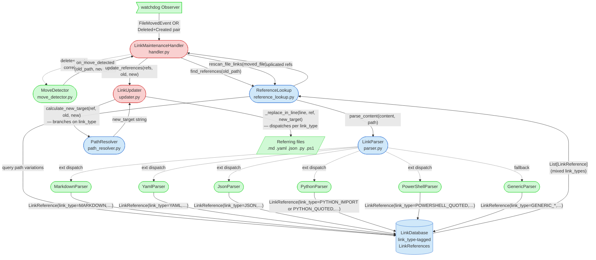

# Integration Narrative: Multi-Format File Move

> **Workflow**: WF-005 — A file referenced from multiple file formats (MD, YAML, JSON, Python, PS1) is moved; all references across all formats are correctly updated

## Workflow Overview

**Entry point**: A `FileMovedEvent` is delivered to `LinkMaintenanceHandler.on_moved()` by the watchdog observer — either as a native OS move, or synthesized from a correlated `FileDeletedEvent` + `FileCreatedEvent` pair by `MoveDetector.match_created_file()`.

**Exit point**: Every source file that referenced the moved target has been rewritten on disk with the new path, using format-appropriate replacement logic (markdown link syntax, Python dot-notation imports, quoted string contents, etc.), and the in-memory link database has been updated to reflect both the new target path and the re-parsed references.

**Flow summary**: The move event is classified and dispatched by feature **1.1.1 (File System Monitoring)** to `_handle_file_moved()`. The handler asks `ReferenceLookup` (a helper inside 1.1.1) for every `LinkReference` whose target matches the old path — these references were populated at startup by feature **2.1.1 (Parser Framework)**, which ran one parser per extension across the project. Each `LinkReference` already carries a `link_type` tag that preserves the parser-of-origin (e.g. `LinkType.MARKDOWN`, `LinkType.PYTHON_IMPORT`, `LinkType.YAML`, `LinkType.POWERSHELL_QUOTED`). Feature **2.2.1 (Link Updater)** receives the full cross-format batch, computes the new target per reference via `PathResolver`, and rewrites each referring file using a `link_type`-dispatched replacement routine — this is the exact point at which the workflow's multi-format correctness is enforced.

## Participating Features

| Feature ID | Feature Name            | Role in Workflow |
|-----------|-------------------------|------------------|
| 1.1.1     | File System Monitoring  | Classifies the filesystem event (native move vs. delete+create correlation via `MoveDetector`), dispatches to `_handle_file_moved()`, and orchestrates the `find references → update files → cleanup DB → rescan moved file` sequence. Owns `ReferenceLookup`, which performs format-agnostic DB queries across path-format variations. |
| 2.1.1     | Parser Framework        | Produces the format-tagged `LinkReference` objects that make this workflow multi-format at all. At startup (`service._initial_scan()`), `LinkParser` dispatches each file to its extension-specific parser (`MarkdownParser`, `YamlParser`, `JsonParser`, `PythonParser`, `PowerShellParser`, `GenericParser` fallback). Each parser emits `LinkReference(link_type=…)` entries stored in the DB. During the move, these tagged entries are the *only* thing that tells the updater which replacement rule to apply. |
| 2.2.1     | Link Updater            | Receives the heterogeneous `List[LinkReference]` from the handler, groups references by containing file, and rewrites each file in a single atomic read-modify-write cycle. `LinkUpdater._replace_in_line()` dispatches per `link_type` (markdown regex for `MARKDOWN`/`MARKDOWN_REFERENCE`, column-based quoted replacement for `*_QUOTED` variants, dot-notation conversion for `PYTHON_IMPORT` plus a file-wide Phase-2 regex pass for module usages). `PathResolver.calculate_new_target()` also branches on `link_type` — Python imports use a dedicated extensionless comparison path with `python_source_root` stripping. |

## Component Interaction Diagram

The diagram shows that the cross-feature seam is the `LinkReference` object itself: 2.1.1 produces it with a `link_type` tag, the DB stores it unchanged, 1.1.1 retrieves it via `ReferenceLookup`, and 2.2.1 consumes the tag to pick the right replacement strategy per format. No direct call ever crosses between a specific per-format parser and 2.2.1; the `link_type` enum is the contract.

## Data Flow Sequence

1. **`LinkMaintenanceHandler.on_moved(event)`** ([handler.py:248](src/linkwatcher/handler.py#L248)) receives a `FileMovedEvent` (or a `_SyntheticMoveEvent` constructed by `_handle_detected_move` after delete+create correlation).
   - Gates on `_scan_complete` (deferred replay during initial scan — PD-BUG-053), then branches on `event.is_directory`. For the single-file path relevant to WF-005, checks `_should_monitor_file(dest)` OR `_is_known_reference_target(src)` (PD-BUG-046 — also processes moves of non-monitored files that are still referenced).
   - Passes to next: `_handle_file_moved(event)`.

2. **`_handle_file_moved(event)`** ([handler.py:336](src/linkwatcher/handler.py#L336)) receives the event and converts paths via `_get_relative_path()`.
   - Calls `self._ref_lookup.find_references(old_path)`.
   - Passes to next: `List[LinkReference]` of heterogeneous `link_type` values.

3. **`ReferenceLookup.find_references(target_path)`** ([reference_lookup.py:100](src/linkwatcher/reference_lookup.py#L100)) receives the old path as a string.
   - Expands the path via `get_path_variations()` into: the exact path, the relative-minus-first-dir path, the Windows-backslash form, the basename, and the extensionless form (PD-BUG-043 — so Python imports stored without `.py` are matched). For each variation, calls `link_db.get_references_to_file(variation)`.
   - Deduplicates using `(file_path, line_number, column_start, link_target)` as the key.
   - Passes to next: a single `List[LinkReference]` that spans every format — a `.md` reference, a `.yaml` value, a `.py` import, a `.ps1` quoted path, etc., all live in the same list.

4. **`LinkUpdater.update_references(references, old_path, new_path)`** ([updater.py:76](src/linkwatcher/updater.py#L76)) receives the mixed list.
   - Calls `_group_references_by_file()` to bucket references by their containing source file — this is what makes a `.ps1` file that mentions the moved target in both a quoted string and an embedded markdown link opened exactly once.
   - For each `(file_path, file_references)` pair, calls `_update_file_references()`.
   - Passes to next: each file is handled independently.

5. **`LinkUpdater._update_file_references(file, refs, old_path, new_path)`** ([updater.py:186](src/linkwatcher/updater.py#L186)) receives the per-file reference sublist.
   - For each `ref`, calls `self._calculate_new_target(ref, old_path, new_path)` — this is `PathResolver.calculate_new_target(ref, old_path, new_path)`.
   - Filters out refs where `new_target == ref.link_target`.
   - Passes to next: `(ref, new_target)` pairs to `_apply_replacements()`.

6. **`PathResolver.calculate_new_target(ref, old_path, new_path)`** ([path_resolver.py:72](src/linkwatcher/path_resolver.py#L72)) branches on `ref.link_type`.
   - If `link_type == LinkType.PYTHON_IMPORT`: calls `_calculate_new_python_import()` which compares extensionless paths, strips `python_source_root` (PD-BUG-078), and handles dotted imports and the suffix-match nested-project case (PD-BUG-045).
   - Otherwise: splits off any `#anchor` and calls `_calculate_new_target_relative()`, which runs four match strategies (direct, stripped, resolved-against-source-dir, suffix) and reconstructs the result in the original link style via `_convert_to_original_link_type()` (preserves absolute/relative/filename-only form and `/` vs `\` separator).
   - Passes to next: a new-target string in the same shape as the original link text.

7. **`LinkUpdater._apply_replacements(abs_file, file, replacement_items)`** ([updater.py:250](src/linkwatcher/updater.py#L250)) reads the file once, then walks `replacement_items` sorted by `(line_number, column_start)` descending so edits don't invalidate downstream positions.
   - **Phase 1**: for each ref, calls `_replace_in_line(line, ref, new_target)`, which dispatches on `link_type`:
     - `MARKDOWN` → `_replace_markdown_target()` (regex that preserves titles and rewrites link text if it equalled the old target — PD-BUG-012).
     - `MARKDOWN_REFERENCE` → `_replace_reference_target()` (regex for `[label]: target "title"` form).
     - Everything else (`PYTHON_IMPORT`, `PYTHON_QUOTED`, `YAML`, `JSON`, `POWERSHELL_QUOTED`, `QUOTED`, `HTML_ANCHOR`, `GENERIC_*`, …) → `_replace_at_position()`. Quoted variants preserve the quote style; Python imports convert slash notation back to dot notation and substitute via a bounded regex `(?<![.\w])ref.link_text(?!\w)` instead of column slicing (because column coordinates reference the pre-dot-conversion text). The negative-lookbehind/lookahead pattern matches Phase 2's PD-BUG-094 guard so re-applying the same replacement is idempotent (TD251 hardening).
   - Also detects stale state (line out of bounds, or expected target no longer on the line — with a Python-import dot-notation fallback check) and short-circuits with `UpdateResult.STALE`, which the handler then feeds into `ReferenceLookup.retry_stale_references()`.
   - **Phase 2** (Python-only, PD-BUG-045): collects `{old_module → new_module}` from any `PYTHON_IMPORT` refs updated in Phase 1, then applies a file-wide regex `(?<![.\w])old(?!\w)` substitution to rename every usage site (e.g. `utils.helpers.func()` after an `import utils.helpers` rename). Negative lookbehind+lookahead (PD-BUG-094) prevents double-prefixing inside already-updated dotted paths.
   - Calls `_write_file_safely()`: optional `.bak` copy, then `tempfile.NamedTemporaryFile` + `shutil.move` for an atomic replace.
   - Passes to next: `UpdateStats` back up to the handler.

8. **Back in `_handle_file_moved`** ([handler.py:365](src/linkwatcher/handler.py#L365)) the handler chains three cleanup steps:
   - `ref_lookup.retry_stale_references(old, new, stats)` — rescans source files whose line numbers went stale between the original scan and the update, re-queries, retries once.
   - `ref_lookup.cleanup_after_file_move(refs, old_targets, moved_file_path=old)` — removes old DB target entries (across all path-format variations) and rescans affected referring files so the DB reflects the rewritten links.
   - `_update_links_within_moved_file(old, new, abs_dest)` (only when the destination is monitored) — reads the moved file, parses via `LinkParser.parse_content()` so the moved file's own outgoing links get recalculated relative to its new location. Non-monitored-extension moves skip this step (no outgoing links expected to recompute).
   - Final outcome: files on disk are consistent, the DB is consistent, and every stat counter is incremented under `_stats_lock`.

## Callback/Event Chains

Two callback chains matter for WF-005, but both are **intra-feature** (they wire components inside 1.1.1) rather than cross-feature. They are included here because a debugger chasing a "move wasn't detected on my editor" symptom will inevitably land on them.

### Per-file delete+create correlation

- **Registration**: `LinkMaintenanceHandler.__init__()` ([handler.py:169](src/linkwatcher/handler.py#L169)) constructs `MoveDetector(on_move_detected=self._handle_detected_move, on_true_delete=self._process_true_file_delete, delay=move_delay)`.
- **Trigger**: A `FileDeletedEvent` is buffered via `MoveDetector.buffer_delete()`; a `FileCreatedEvent` with a matching basename and file size arriving within `move_detect_delay` seconds fires the callback.
- **Handler**: `LinkMaintenanceHandler._handle_detected_move(old_path, new_path)` ([handler.py:711](src/linkwatcher/handler.py#L711)) constructs a `_SyntheticMoveEvent` and re-enters `_handle_file_moved()` — i.e. delete+create correlation and native moves converge on the same code path before any cross-feature interaction begins.
- **Cross-feature boundary**: None. Both sides sit inside feature 1.1.1. The boundary into 2.1.1 / 2.2.1 is still the `_handle_file_moved` → `ReferenceLookup` / `LinkUpdater` call sequence in the Data Flow section.

### Scan-complete event deferral (PD-BUG-053)

- **Registration**: `LinkMaintenanceHandler.__init__()` creates `self._scan_complete = threading.Event()`; `service.start()` calls `handler.begin_event_deferral()` before the initial scan and `handler.notify_scan_complete()` after.
- **Trigger**: Any watchdog event (`on_moved` / `on_deleted` / `on_created`) arriving while the event is cleared.
- **Handler**: The event is pushed onto `_deferred_events`; when `notify_scan_complete()` runs, every deferred event is dispatched via `getattr(self, method_name)(event)`.
- **Cross-feature boundary**: None — fully internal to 1.1.1 — but explains why moves during startup don't race the parser's initial DB population.

## Configuration Propagation

| Config Value                | Source                                             | Consumed By                                                                 | Effect on Workflow |
|----------------------------|----------------------------------------------------|-----------------------------------------------------------------------------|--------------------|
| `monitored_extensions`     | `LinkWatcherConfig` (CLI / YAML / env / defaults) | 1.1.1 (`handler._should_monitor_file`, `_initial_scan`), 2.1.1 (none directly — dispatches on the same extension) | Determines which files enter the DB as reference *sources* during scan, and which move events get processed. A file whose extension is absent here will still have its move detected **only** if it is a known reference target (PD-BUG-046 path via `_is_known_reference_target`). |
| `enable_<format>_parser`   | `LinkWatcherConfig`                                | 2.1.1 (`LinkParser.__init__` conditional registration)                      | Gates whether `.md` / `.yaml` / `.json` / `.py` / `.ps1` / `.dart` / generic references are ever indexed. A disabled parser silently makes references in that format invisible to the entire workflow. |
| `python_source_root`       | `LinkWatcherConfig`                                | 2.2.1 (`PathResolver._calculate_new_python_import`)                         | Strips e.g. `src/` from old/new paths when comparing to Python import targets so `src/linkwatcher/foo` matches an import of `linkwatcher.foo` (PD-BUG-078). Without it, moves under a source-root layout wouldn't update imports. |
| `move_detect_delay`        | `LinkWatcherConfig`                                | 1.1.1 (`MoveDetector.delay`)                                                | Correlation window for delete+create pairs. Too short = moves seen as delete+create and references dropped; too long = real deletes stall. Affects only 1.1.1's event classification, but the fallout (wrong-format references left un-rewritten) surfaces in 2.2.1. |
| `create_backups`           | `LinkWatcherConfig`                                | 2.2.1 (`LinkUpdater.backup_enabled`), 1.1.1 (forwarded to `update_links_within_moved_file` for the moved-file rewrite) | Same flag controls `.bak` creation on every file 2.2.1 touches **and** on the moved file itself when 1.1.1 rewrites its outgoing links — intentional consistency. |
| `dry_run_mode`             | `LinkWatcherConfig`                                | 2.2.1 (`LinkUpdater.dry_run`)                                               | When true, 2.2.1 logs what it would do and returns `UpdateResult.UPDATED` without writing. 1.1.1's stats counters still increment, which is how dry-run reports claim "files updated" numbers. |
| `ignored_directories`      | `LinkWatcherConfig`                                | 1.1.1 (`_should_monitor_file`, `_initial_scan`), but **not** the directory-move walk (PD-BUG-071) | Skips references from ignored dirs during scan. Does not affect WF-005's single-file path, but matters for adjacent WF-002. |

## Error Handling Across Boundaries

### Parser failure in a single format during rescan

- **Origin**: A specialized parser (e.g. `YamlParser` on malformed YAML) raises an exception inside `parse_content()`. This happens during `ReferenceLookup.rescan_file_links()` / `rescan_moved_file_links()` — called after the move to refresh DB state.
- **Propagation**: `LinkParser.parse_content()` ([parser.py:91](src/linkwatcher/parser.py#L91)) wraps the call in `try/except Exception`, logs `content_parsing_failed`, and returns `[]`. `BaseParser.parse_file()` provides the same safety net one layer in. Callers see an empty reference list, never an exception.
- **Impact**: The failed file's references are missing from the DB until the next successful parse. References in *other* formats for the same workflow are unaffected — each format is parsed independently, so one broken YAML doesn't prevent Python / PS1 / MD updates.
- **Recovery**: Silent; self-heals on the next rescan of that file (either on edit via `on_created`/move, or on `force_rescan()`). No retry inside the workflow.

### Stale line numbers during update

- **Origin**: Between the DB scan and the update write, the referring source file was edited externally. `LinkUpdater._apply_replacements()` ([updater.py:250](src/linkwatcher/updater.py#L250)) detects this via (a) line index out of bounds, or (b) neither the expected old target nor the would-be new target nor the dot-notation form of the Python-import link text appears on the line.
- **Propagation**: The file is added to `stats["stale_files"]` and `UpdateResult.STALE` is returned — importantly, the file is **not** partially modified. Writing is aborted before `_write_file_safely()`.
- **Impact**: In `handler._handle_file_moved`, `retry_stale_references()` rescans the stale source files via `ReferenceLookup.rescan_file_links()` (which re-invokes the correct per-format parser), re-queries the DB, and retries the update once.
- **Recovery**: If the retry also stales, the workflow logs `stale_after_retry` and moves on — references in that single file remain un-updated but the rest of the format-wide rewrite proceeds. Partial completion is the design.

### Watchdog observer thread dies mid-workflow

- **Origin**: An unhandled exception in the observer thread (caught by watchdog) or an OS-level I/O failure.
- **Propagation**: `on_error()` ([handler.py:326](src/linkwatcher/handler.py#L326)) logs `watchdog_error` and increments the error stat; `service.start()`'s health loop ([service.py:150](src/linkwatcher/service.py#L150)) polls `observer.is_alive()` and sets `self.running = False` on death.
- **Impact**: Any reference updates already in flight in 2.2.1 complete synchronously (they were invoked from the observer thread). In-progress `_update_links_within_moved_file()` writes are atomic (tempfile + rename) so a death mid-write cannot leave a corrupt file. Updates that hadn't started yet are simply skipped — the DB is now stale relative to disk.
- **Recovery**: The service exits cleanly; a restart re-runs the initial scan and rebuilds the DB from scratch (multi-format scan via `LinkParser`), self-healing the multi-format consistency guarantee.

### `PathResolver` can't match the old path

- **Origin**: A reference's `link_target` is too ambiguous for any of the four match strategies (direct / stripped / resolved / suffix) to connect it to `old_path`.
- **Propagation**: `_calculate_new_target_relative()` ([path_resolver.py:94](src/linkwatcher/path_resolver.py#L94)) returns the original `link_target` unchanged; in `_update_file_references`, that ref is filtered out by `new_target != ref.link_target` and skipped silently.
- **Impact**: That specific reference is left pointing at the old path (becomes a broken link). References in other formats on the same workflow run are unaffected. No warning is currently logged for the silent skip.
- **Recovery**: None in-workflow. A later `--validate` run (WF-009) will flag it as a broken link.

---

*This Integration Narrative was created as part of the Integration Narrative Creation task (PF-TSK-083).*
