# Integration Narrative: Rapid Sequential Moves

> **Workflow**: WF-004 — Multiple file moves arrive on the watchdog observer thread in quick succession; the system processes them without data loss, database inconsistency, or race conditions

## Workflow Overview

**Entry point**: A burst of watchdog events arrives within a narrow time window on the single daemon Observer thread started by `LinkWatcherService.start()` ([service.py:121-123](src/linkwatcher/service.py#L121-L123)). Each event is one of: a native `FileMovedEvent`, a `FileDeletedEvent` (to be paired later by `MoveDetector`), or a `FileCreatedEvent` (possibly matching a buffered delete). Bursts can originate from VS Code multi-file rename, `git mv a b && git mv c d`, batch file renames via File Explorer, or scripted moves.

**Exit point**: Every move in the burst has completed end-to-end: inbound references rewritten atomically on disk, old-path entries removed from `LinkDatabase`, affected source files re-parsed so their outgoing links reflect current line numbers, each moved file's own relative links recalculated, `MoveDetector._pending` contains no orphaned entries, and cumulative `stats["files_moved"]` / `stats["links_updated"]` / `stats["errors"]` reflect the whole batch. No in-flight data is lost across the worker-thread / observer-thread race.

**Flow summary**: The single watchdog Observer thread dispatches every event serially into `LinkMaintenanceHandler.on_*()`. Native moves invoke `_handle_file_moved()` immediately. Delete+create pairs flow through `MoveDetector`'s thread-safe pending map and are correlated either by `match_created_file()` (on the observer thread) or — for unmatched deletes — by the single `_expiry_worker` daemon thread. Each correlated move re-enters the same `_handle_file_moved()` pipeline that WF-001 documents. Because `_handle_file_moved()` drives the **entire** per-move pipeline (reference lookup → updater → stale retry → DB cleanup) before returning to the Observer, and because the Observer thread processes events strictly in order, move N+1 never begins its pipeline until move N has fully committed its DB mutations. The `LinkDatabase._lock` provides the only cross-thread consistency guard between the observer thread and the `MoveDetector._expiry_worker` / `DirectoryMoveDetector` threads.

## Participating Features

| Feature ID | Feature Name | Role in Workflow |
|-----------|-------------|-----------------|
| 1.1.1 | File System Monitoring | Serializes the event stream on one Observer thread; `LinkMaintenanceHandler` guards every `on_*` with per-event `try/except` so one bad event in the burst doesn't kill the daemon thread; `MoveDetector` buffers concurrent delete+create pairs in a lock-guarded `_pending` dict + heapq; a single `_expiry_worker` daemon thread drains unmatched deletes (O(1) threads regardless of burst size); `_stats_lock` (PD-BUG-026) serializes counter updates from observer + worker threads |
| 0.1.2 | In-Memory Link Database | Single `threading.Lock` serializes every read and every mutation across all threads — the primary cross-thread consistency guarantee for the burst. All seven mutator methods (`add_link`, `add_links_batch`, `remove_file_links`, `update_source_path`, `remove_targets_by_path`, `update_target_path`, `clear`) and every read method (`get_references_to_file`, `has_target_with_basename`, etc.) acquire `_lock`. Reference-list copies (not references) are returned, so callers can iterate outside the lock without seeing mutations-in-progress from subsequent moves in the burst |
| 2.2.1 | Link Updating | `LinkUpdater.update_references()` groups refs by source file and performs `NamedTemporaryFile` + `shutil.move()` atomic writes per file — so partial bursts on disk are impossible even if the process is killed mid-burst; stale detection (line-out-of-bounds / expected target not on line) converts "move N+1 invalidated line numbers move N recorded" races into `UpdateResult.STALE` + `stats["stale_files"]`, which the handler recovers via `retry_stale_references()` |

## Component Interaction Diagram

```mermaid
graph TD
    classDef critical fill:#234567,stroke:#d83a3a
    classDef important fill:#654987,stroke:#3a7bd8
    classDef reference fill:#765432,stroke:#3ad83f

    OS>OS filesystem burst] -->|"N events in T seconds"| Obs
    Obs([watchdog Observer<br/>single daemon thread]) -->|"serial dispatch<br/>one event at a time"| Handler
    Handler([LinkMaintenanceHandler<br/>on_moved / on_deleted / on_created<br/>per-event try/except guard])
    Handler -->|"FileMovedEvent (native)"| FileMoved([_handle_file_moved<br/>SYNCHRONOUS — full pipeline<br/>before next event processed])
    Handler -->|"FileDeletedEvent"| MD_buf([MoveDetector.buffer_delete<br/>with _lock])
    Handler -->|"FileCreatedEvent"| MD_match([MoveDetector.match_created_file<br/>with _lock])
    MD_buf -->|"_pending[rel_path] = meta<br/>heappush queue"| Pending[(_pending dict<br/>+ heapq _queue<br/>guarded by _lock)]
    MD_match -->|"scan _pending for basename+size match"| Pending
    MD_match -.->|"on_move_detected(old, new)<br/>synchronous callback"| Handler
    MD_match -->|"match found: del pending[old]"| Pending
    Pending -.->|"earliest expiry elapsed"| Worker([MoveDetector._expiry_worker<br/>single daemon thread])
    Worker -->|"_on_delete(rel_path)"| Handler
    Handler -->|"_process_true_file_delete"| DB_read([LinkDatabase.get_references_to_file<br/>with _lock])
    FileMoved -->|"delegates to ReferenceLookup<br/>(see WF-001 / PD-INT-002)"| Pipeline([WF-001 Pipeline<br/>find_refs → update → stale_retry → cleanup])
    Pipeline -->|"get_references_to_file / remove_* / add_link<br/>each acquires _lock"| DB[(LinkDatabase<br/>8 indexes + single _lock)]
    Pipeline -->|"update_references<br/>atomic tempfile + shutil.move<br/>per source file"| Files[/Source files on disk/]
    DB_read --> DB
    Handler -->|"_stats_lock"| Stats[(stats dict<br/>files_moved / links_updated / errors)]
    Worker -.->|"_stats_lock<br/>(via _process_true_file_delete)"| Stats

    class Obs,Handler,FileMoved,DB critical
    class MD_buf,MD_match,Pending,Worker,Pipeline important
    class Files,Stats,DB_read,OS reference
```

## Data Flow Sequence

The sequence below focuses on what is **different** in a burst compared to a single move. The per-move pipeline once `_handle_file_moved()` is entered is identical to WF-001 ([PD-INT-002](/doc/technical/integration/single-file-move-integration-narrative.md)) and is not repeated here.

1. **OS / editor / git emits N filesystem events within a short window** (e.g., 5 renames in 200 ms).
   - Dispatch guarantee: watchdog's `BaseObserver` uses **one** daemon thread per scheduled emitter — `Observer.schedule(self.handler, ..., recursive=True)` at [service.py:122](src/linkwatcher/service.py#L122) produces a single emitter, and its dispatcher drains a FIFO queue one event at a time.
   - Passes to next: watchdog event objects delivered **strictly in order** to `LinkMaintenanceHandler.on_*()`.

2. **`LinkMaintenanceHandler.on_moved()` / `on_deleted()` / `on_created()`** ([handler.py:248](src/linkwatcher/handler.py#L248) / [:271](src/linkwatcher/handler.py#L271) / [:302](src/linkwatcher/handler.py#L302)) execute sequentially on the Observer thread.
   - Each `on_*` is wrapped in a top-level `try/except` that logs and increments `stats["errors"]` via `_update_stat` — guaranteeing the Observer thread **cannot die** from an exception mid-burst ([handler.py:262-269](src/linkwatcher/handler.py#L262-L269), [:293-300](src/linkwatcher/handler.py#L293-L300), [:318-324](src/linkwatcher/handler.py#L318-L324)).
   - During the initial scan (`_scan_complete` clear), events are deferred via `_defer_event()` and replayed on the Observer thread in arrival order once `notify_scan_complete()` fires — bursts that straddle the scan boundary stay ordered (PD-BUG-053).
   - Passes to next: exactly **one** of `_handle_file_moved()` (native move), `_move_detector.buffer_delete()` (delete), or `_move_detector.match_created_file()` → `_handle_detected_move()` (correlated create), per event.

3. **`MoveDetector.buffer_delete(rel_path, abs_path)`** ([move_detector.py:80](src/linkwatcher/move_detector.py#L80)) — called for each DELETE in the burst.
   - Acquires `self._lock`; writes `self._pending[rel_path] = (now, file_size, abs_path)`; pushes `(now + delay, rel_path)` onto the min-heap `self._queue`; releases the lock; signals `self._wake` to re-plan the worker's sleep.
   - **Concurrency property**: The `_pending` dict can hold many simultaneous entries during a burst — there is no limit. Each entry is independent; later burst events do not clobber earlier ones unless two files share the **same `rel_path`** (functionally impossible on a POSIX-style filesystem at a single moment).
   - **Basename collision risk**: `match_created_file` uses basename + size equality against the entire `_pending` dict. If the burst contains two deletes with matching basenames and sizes (e.g., two identically-sized `README.md` files in different directories, both deleted within the delay window, followed by two creates), the matcher returns the **first** iteration match from `list(self._pending.items())` — dict iteration order (insertion order on CPython 3.7+), not creation time. Practical impact: for human-speed reorgs the chance is low, but scripted reorgs with duplicate filenames can mis-pair. This is the edge case that [TDD-1-1-1 Section 8](../tdd/tdd-1-1-1-file-system-monitoring-t2.md) flagged as "warrants verification". No re-verification step corrects this post-match.
   - Passes to next: nothing synchronous; the worker thread owns the future expiry, and a future CREATE will attempt a match.

4. **`MoveDetector.match_created_file(rel_path, abs_path)`** ([move_detector.py:115](src/linkwatcher/move_detector.py#L115)) — called for each CREATE in the burst.
   - Acquires `self._lock`; iterates `list(self._pending.items())` (snapshot via `list()` — mutation during iteration is safe); for each pending delete where `now - delete_time ≤ delay` **and** `basename == created_filename` **and** (`delete_size == 0` or `created_size == delete_size`), it checks PD-BUG-042 ("if the old file exists again, the delete was stale"); on a live match it deletes `self._pending[deleted_path]` under the lock and returns `deleted_path`.
   - **Race with expiry worker**: Both `match_created_file` and `_expiry_worker` acquire `self._lock` before touching `_pending` — mutual exclusion is guaranteed. An entry cannot simultaneously be matched and expired; whichever call wins the lock first removes the entry.
   - Passes to next: on match, control **immediately** enters `LinkMaintenanceHandler._handle_detected_move(old, new)` at [handler.py:711](src/linkwatcher/handler.py#L711) on the same observer thread, which synthesizes a `_SyntheticMoveEvent` and calls `_handle_file_moved(synthetic_event)`.

5. **`LinkMaintenanceHandler._handle_file_moved(event)`** ([handler.py:336](src/linkwatcher/handler.py#L336)) runs the full WF-001 pipeline for the single move.
   - **Critical serialization property**: this method is synchronous and runs on the observer thread. Until it returns, no other event in the burst is dispatched. Therefore DB mutations for move N (`remove_targets_by_path`, `remove_file_links`, `add_link` calls inside `cleanup_after_file_move` and `_update_links_within_moved_file`) are complete before move N+1's `find_references` query begins — so move N+1 sees a coherent DB reflecting moves 1..N.
   - **Stale line-number cascade** (this is the burst-specific hazard): when move N rewrites references inside source file F, line numbers shift. If a later move N+K has refs in F that were captured **before** move N's rewrite, `LinkUpdater._apply_replacements()` detects the shift via "line index out of bounds" or "expected target not on line" and returns `UpdateResult.STALE` + appends F to `stats["stale_files"]` ([updater.py:306-342](src/linkwatcher/updater.py#L306-L342)). `_handle_file_moved` then invokes `ReferenceLookup.retry_stale_references()` which rescans F from disk (`LinkDatabase.remove_file_links(F)` + `LinkParser.parse_file(F)` + per-ref `LinkDatabase.add_link()`) and retries the update once. After-retry staleness is logged and abandoned — the next event that touches F fixes it.
   - Passes to next: handler's `try/except` wrapper at [handler.py:346](src/linkwatcher/handler.py#L346) catches any unhandled exception, logs `file_move_error`, bumps `stats["errors"]` via `_update_stat`, and returns cleanly — the Observer thread survives to process event N+1.

6. **Between moves: `LinkDatabase._lock` contention**.
   - During move N's pipeline, `get_references_to_file()`, `remove_targets_by_path()`, `remove_file_links()`, and per-ref `add_link()` each take `self._lock` briefly. Because only one move runs on the observer thread at a time, the **only** cross-thread contention is with the `_expiry_worker` (via `_process_true_file_delete` → `get_references_to_file`) or a `DirectoryMoveDetector` processing thread. The lock is held only for the short critical section of each DB call — all heavy work (file reads, writes, parsing) runs outside it.
   - **Data integrity guarantee**: `get_all_targets_with_references()` and `get_source_files()` return **copies** ([database.py:697-709](src/linkwatcher/database.py#L697-L709)), and `get_references_to_file()` builds `all_references` inside the lock before returning. Callers never hold references to internal structures across lock releases, so a worker-thread mutation between move N and move N+1 cannot corrupt an in-flight iteration.

7. **Worker-thread expiry during a burst** — `MoveDetector._expiry_worker` ([move_detector.py:188](src/linkwatcher/move_detector.py#L188)).
   - Drains expired entries from `_queue` under `self._lock`, collects a local `expired` list, releases the lock, then fires `self._on_delete(rel_path)` for each — callbacks run **outside** the MoveDetector lock to avoid deadlocks (comment at [move_detector.py:220](src/linkwatcher/move_detector.py#L220)).
   - `_on_delete` is `LinkMaintenanceHandler._process_true_file_delete` ([handler.py:773](src/linkwatcher/handler.py#L773)), which runs on the worker thread, not the observer thread. It acquires `LinkDatabase._lock` via `get_references_to_file()`. If the observer is mid-pipeline for move N, the worker waits on the DB lock; when the observer releases it, the worker completes its read. No deadlock is possible because neither thread holds its own lock while trying to acquire the other's.
   - **Lazy-deletion invariant**: `_expiry_worker` verifies `abs((pending_time + delay) - earliest_expiry) < 0.001` before deleting a pending entry ([move_detector.py:213](src/linkwatcher/move_detector.py#L213)) — this prevents a stale heap entry from wiping a newly-re-buffered delete for the same `rel_path` (relevant when a file is deleted, re-created, deleted again within one window).

8. **Statistics accumulation across the burst**.
   - Every `_update_stat(key, delta)` call ([handler.py:849](src/linkwatcher/handler.py#L849)) acquires `self._stats_lock`. Both the observer thread (per-move in `_handle_file_moved`) and the worker thread (per-expiry in `_process_true_file_delete`) hit this lock. Without it, PD-BUG-026 showed stats drift under load.
   - `get_stats()` returns a copy ([handler.py:854-857](src/linkwatcher/handler.py#L854-L857)) — external readers (e.g., shutdown summary) see a consistent snapshot, never a partial increment.

## Callback/Event Chains

### Watchdog observer dispatch (OS → 1.1.1) — identical to WF-001
- Covered in [PD-INT-002 WF-001 narrative](/doc/technical/integration/single-file-move-integration-narrative.md#watchdog-observer-dispatch-cross-process-boundary--111). Key burst-specific property: watchdog emits events **in the order they are observed** on a single daemon thread, so bursts arrive strictly serially at the handler.

### MoveDetector → handler callback (intra-1.1.1)
- **Registration**: `LinkMaintenanceHandler.__init__()` at [handler.py:169-173](src/linkwatcher/handler.py#L169-L173): `self._move_detector = MoveDetector(on_move_detected=self._handle_detected_move, on_true_delete=self._process_true_file_delete, delay=move_delay)`. Stored on the detector as `self._on_move` and `self._on_delete`.
- **Trigger (observer thread)**: `match_created_file` finds a live basename+size match.
- **Trigger (worker thread)**: `_expiry_worker` finds an expired unmatched entry.
- **Handler (observer thread)**: `_handle_detected_move(old, new)` builds `_SyntheticMoveEvent` and re-enters `_handle_file_moved` — same pipeline as a native move.
- **Handler (worker thread)**: `_process_true_file_delete(rel_path)` runs on the worker thread, not the observer. It may race with an in-flight `_handle_file_moved` on the observer thread but only at the `LinkDatabase._lock` acquisition point.
- **Cross-feature boundary**: Purely intra-1.1.1 — the callback is a decoupling mechanism between `MoveDetector`'s state machine and `LinkMaintenanceHandler`'s orchestration. It allows `_expiry_worker` (worker thread) and `match_created_file` (observer thread) to trigger the same per-move pipeline without knowing handler internals.

### DB `_lock`-mediated hand-off (implicit 1.1.1 ↔ 0.1.2 ↔ 2.2.1)
- Not a callback chain, but functionally analogous: any thread that mutates or reads the DB must acquire `LinkDatabase._lock`. During a burst, this is the sole synchronization point between the observer thread's move pipeline, the worker thread's expired-delete processing, and any `DirectoryMoveDetector` thread processing an interleaved directory move.
- **Registration**: Implicit — every public method on `LinkDatabase` opens with `with self._lock:` ([database.py:280](src/linkwatcher/database.py#L280), [:338](src/linkwatcher/database.py#L338), [:374](src/linkwatcher/database.py#L374), [:509](src/linkwatcher/database.py#L509), [:576](src/linkwatcher/database.py#L576), [:615](src/linkwatcher/database.py#L615), [:646](src/linkwatcher/database.py#L646), [:703](src/linkwatcher/database.py#L703), [:708](src/linkwatcher/database.py#L708), [:716](src/linkwatcher/database.py#L716), [:721](src/linkwatcher/database.py#L721), [:735](src/linkwatcher/database.py#L735)).
- **Trigger**: Any handler / updater / worker call into the DB.
- **Handler**: Python's GIL + `threading.Lock` — standard mutual exclusion.
- **Cross-feature boundary**: **1.1.1 ↔ 0.1.2** (primary — every move pipeline step queries/mutates the DB); **2.2.1 ↔ 0.1.2** (updater never talks to the DB directly in WF-004; DB updates happen in handler/reference_lookup around the updater call, so the updater is isolated from DB lock contention entirely).

## Configuration Propagation

All values originate from `LinkWatcherConfig` resolved at startup (see [PD-INT-001](/doc/technical/integration/startup-integration-narrative.md) for the resolution pipeline) and are passed through `LinkWatcherService.__init__()` at [service.py:76-94](src/linkwatcher/service.py#L76-L94).

| Config Value | Source | Consumed By | Effect on Workflow |
|-------------|--------|-------------|-------------------|
| `move_detect_delay` | `LinkWatcherConfig.move_detect_delay` → `MoveDetector(delay=…)` via `LinkMaintenanceHandler.__init__` ([handler.py:160](src/linkwatcher/handler.py#L160)) | **1.1.1** — `MoveDetector._pending` / `_queue` | Width of each entry's residence in `_pending`. Longer delays enlarge the simultaneous basename-collision window during a burst; shorter delays risk true-deletes being classified as moves when a replacement file appears just-in-time. Default 10 s |
| `monitored_extensions` | `LinkWatcherConfig` → `LinkMaintenanceHandler(monitored_extensions=…)` at [service.py:91](src/linkwatcher/service.py#L91) | **1.1.1** — `_should_monitor_file()` at every `on_*` entry | Burst events for non-listed extensions are dropped before touching `MoveDetector` or `_handle_file_moved`. Combined with PD-BUG-046's `_is_known_reference_target` path, non-monitored extensions still get buffered if they are DB reference targets — so a burst touching `.pdf` files referenced from `.md` still flows through `MoveDetector` |
| `ignored_directories` | `LinkWatcherConfig` → `LinkMaintenanceHandler(ignored_directories=…)` at [service.py:92](src/linkwatcher/service.py#L92) | **1.1.1** — `_should_monitor_file()` | Burst events under `.git/`, `node_modules/`, etc. are silently dropped — prevents git operations during burst reorganization from stressing the pipeline |
| `create_backups` | `LinkWatcherConfig` → `LinkUpdater.backup_enabled` | **2.2.1** — `_write_file_safely()` at [updater.py:517](src/linkwatcher/updater.py#L517) | When enabled, **each** updated source file in the burst gets a `.bak` written before its atomic rename. A burst of N moves that all touch the same source file F results in N `.bak` writes (not a single consolidated backup) — acceptable because `shutil.copy2` only copies the current F state each time |
| `dir_move_max_timeout` / `dir_move_settle_delay` | `LinkWatcherConfig` → `DirectoryMoveDetector` via [handler.py:176-183](src/linkwatcher/handler.py#L176-L183) | **1.1.1** — `DirectoryMoveDetector` timer threads | Only relevant if the burst contains a directory move. These timings control how long `DirectoryMoveDetector` waits to declare a directory-move batch complete; during the wait the directory's per-file DELETE events are buffered and do not feed into `MoveDetector` |

## Error Handling Across Boundaries

### Mid-burst `_handle_file_moved` exception (1.1.1 internal)
- **Origin**: Any uncaught exception during move N's pipeline — e.g., `IOError` reading a source file during stale retry, an unexpected `LinkReference` shape after a parser bug.
- **Propagation**: Caught by the outer `try/except` at [handler.py:346-407](src/linkwatcher/handler.py#L346-L407). Logs `file_move_error` with `old_path`, `new_path`, `error`, `error_type`; calls `self._update_stat("errors")`.
- **Impact on burst**: Move N is lost — its references remain stale in DB and on disk. **But the Observer thread survives**, so moves N+1..N+M proceed normally. The burst is never aborted; at worst it has holes.
- **Recovery**: None automatic. The next event that touches the affected paths triggers fresh processing; a subsequent restart re-scans everything. `stats["errors"]` surfaces the hole count at shutdown.

### Mid-burst `on_*` exception (watchdog → 1.1.1)
- **Origin**: An exception in the dispatch code itself before reaching `_handle_file_moved` — e.g., `getattr(event, "dest_path")` on a malformed event, or `_get_relative_path` on a path outside `project_root`.
- **Propagation**: Caught by the outer `try/except` inside each `on_*` ([handler.py:262-269](src/linkwatcher/handler.py#L262-L269)). Logs e.g. `on_moved_unhandled_error`.
- **Impact on burst**: Event is dropped. **Critically, the exception does not escape into the watchdog Observer thread** — without this guard, the daemon thread would die and all subsequent burst events would be silently discarded forever.
- **Recovery**: None for the dropped event. Counter-part events (e.g., the matching CREATE of a dropped DELETE) may still be processed by their own `on_*`, potentially leaving a stranded `_pending` entry that the expiry worker will eventually drain as a true-delete.

### Mid-burst stale reference cascade (2.2.1 → 1.1.1)
- **Origin**: Move N rewrites lines in source file F; move N+1 captured F's refs before the rewrite, so its ref line numbers are now off-by-one (or the expected target text is no longer on the expected line).
- **Propagation**: `LinkUpdater._apply_replacements()` returns `UpdateResult.STALE` and appends F to `stats["stale_files"]` ([updater.py:306-342](src/linkwatcher/updater.py#L306-L342)). The flag travels back to `_handle_file_moved` inside `UpdateStats`.
- **Impact on burst**: Move N+1's update to F is **not written** (file is untouched); the rest of move N+1's source files (F', F'', …) still complete successfully.
- **Recovery**: `ReferenceLookup.retry_stale_references()` rescans F via parser, re-queries fresh references from DB, and re-invokes `LinkUpdater.update_references()` once. If still stale, logs `stale_after_retry` and moves on. Because this retry happens **within move N+1's pipeline** before the observer dispatches move N+2, the burst stays self-correcting. In practice, a burst of 5+ moves touching the same high-connectivity source file (e.g., a README linking to many moved files) resolves via 1-2 stale retries and completes fully — with no user-visible loss.

### Expiry-worker false-positive true-delete (1.1.1 → 1.1.1)
- **Origin**: A burst DELETE's matching CREATE arrives **after** `move_detect_delay` has elapsed. The expiry worker has already fired `_process_true_file_delete`; then the CREATE arrives but finds no pending entry.
- **Propagation**: CREATE is handled as a fresh file creation (not a move). Its links are scanned and added to DB, but **the old-path references are not updated** — they still point at the pre-burst path, which no longer exists.
- **Impact on burst**: Data loss — references to the delayed-pair file become stale and will be reported as broken on next `--validate` run.
- **Recovery**: None automatic within the burst. Mitigation: raise `move_detect_delay` for environments where DELETE+CREATE can be slow-paired (e.g., SMB filesystems, antivirus-scanned writes). This is the single largest reason `move_detect_delay` exists as a configuration knob.

### `_stats_lock` contention (1.1.1 internal)
- **Origin**: Observer thread and expiry-worker thread both try to update `stats` simultaneously during a burst.
- **Propagation**: Not an error — `_stats_lock` serializes both ([handler.py:849-852](src/linkwatcher/handler.py#L849-L852)).
- **Impact on burst**: None. PD-BUG-026 established this lock after observing drift (`stats["files_moved"] + stats["files_deleted"] != events_received`) under load; post-fix, invariants hold.
- **Recovery**: N/A.

---

*This Integration Narrative was created as part of the Integration Narrative Creation task (PF-TSK-083).*
