# Integration Narrative: Single File Move

> **Workflow**: WF-001 — A file is moved or renamed on disk, and all references to it across the project are automatically updated

## Workflow Overview

**Entry point**: Either a native `FileMovedEvent` arrives on `LinkMaintenanceHandler.on_moved()` ([handler.py:248](src/linkwatcher/handler.py#L248)), or a `FileDeletedEvent` is followed within `config.move_detect_delay` (default 10 s) by a `FileCreatedEvent`; `MoveDetector.match_created_file()` correlates the pair and fires its `on_move_detected` callback into `LinkMaintenanceHandler._handle_detected_move()` ([handler.py:711](src/linkwatcher/handler.py#L711)), which builds a synthetic `FileMovedEvent` and re-enters the same pipeline. Both paths converge on `_handle_file_moved()` ([handler.py:336](src/linkwatcher/handler.py#L336)).

**Exit point**: Every file on disk that contained a reference to the old path has been atomically rewritten with the new path; the `LinkDatabase` no longer contains entries keyed by any old-path variation; affected source files have been re-parsed so their outgoing-link entries reflect current line numbers; the moved file's own content has had its relative links recalculated to its new location and its DB entries re-keyed; `stats["files_moved"]` and `stats["links_updated"]` have been incremented under `_stats_lock`.

**Flow summary**: Observer event → deferral gate → extension/ignored-dir filter → (optional) delete+create correlation → `_handle_file_moved()` → `ReferenceLookup.find_references()` hits `LinkDatabase` with multiple path variations → `LinkUpdater.update_references()` groups references by source file, resolves new targets via `PathResolver`, and writes atomically → `retry_stale_references()` rescans and re-tries files whose line numbers shifted → `cleanup_after_file_move()` removes old DB entries and re-parses affected files → `_update_links_within_moved_file()` rewrites relative links inside the moved file itself and re-parses its outgoing links.

## Participating Features

| Feature ID | Feature Name | Role in Workflow |
|-----------|-------------|-----------------|
| 1.1.1 | File System Monitoring | `LinkMaintenanceHandler` receives the OS event and orchestrates the pipeline; `MoveDetector` (daemon worker + heapq) correlates cross-tool delete+create pairs into synthetic moves; `ReferenceLookup` encapsulates every DB/parser/updater interaction that used to live inline in the handler (TD022) |
| 0.1.2 | In-Memory Link Database | `LinkDatabase.get_references_to_file(target)` returns refs for one path variation; `remove_targets_by_path(old_target)`, `remove_file_links(source_file)`, and `add_link(ref)` mutate the DB during cleanup and re-parse |
| 2.1.1 | Parser Framework | `LinkParser.parse_file(abs_path)` (disk read) and `parse_content(content, abs_path)` (pre-read) dispatch on extension to the correct `BaseParser` subclass and return `List[LinkReference]` used to refresh DB entries after every move-related file change |
| 2.2.1 | Link Updating | `LinkUpdater.update_references(refs, old, new)` groups refs per source file, delegates to `PathResolver.calculate_new_target()` for relative/absolute/filename-only link conversion, detects stale lines, applies per-link-type replacement methods, and writes via `NamedTemporaryFile + shutil.move()` |

## Component Interaction Diagram

```mermaid
graph TD
    classDef critical fill:#234567,stroke:#d83a3a
    classDef important fill:#654987,stroke:#3a7bd8
    classDef reference fill:#765432,stroke:#3ad83f

    Obs([watchdog Observer<br/>daemon thread]) -->|"FileMovedEvent"| Handler
    Obs -->|"FileDeletedEvent"| Handler
    Obs -->|"FileCreatedEvent"| Handler
    Handler([LinkMaintenanceHandler<br/>on_moved / on_deleted / on_created]) -->|"rel_path, abs_path"| MD([MoveDetector<br/>buffer_delete / match_created_file])
    MD -.->|"on_move_detected(old, new)"| Handler
    Handler -->|"synthetic FileMovedEvent"| FileMoved([_handle_file_moved])
    FileMoved -->|"old_path"| RL([ReferenceLookup<br/>find_references / get_old_path_variations])
    RL -->|"get_references_to_file(variation)"| DB[(LinkDatabase)]
    DB -->|"List[LinkReference]"| RL
    RL -->|"deduplicated refs"| FileMoved
    FileMoved -->|"update_references(refs, old, new)"| Updater([LinkUpdater])
    Updater -->|"calculate_new_target(ref, old, new)"| PR([PathResolver])
    PR -->|"new_target string"| Updater
    Updater -->|"atomic tempfile + rename"| Files[/Source files on disk/]
    Updater -->|"UpdateStats incl. stale_files"| FileMoved
    FileMoved -->|"retry_stale_references(stats)"| RL
    RL -->|"parse_file(stale_file)"| Parser([LinkParser])
    Parser -->|"List[LinkReference]"| RL
    RL -->|"remove_file_links / add_link"| DB
    FileMoved -->|"cleanup_after_file_move"| RL
    RL -->|"remove_targets_by_path(old_variation)"| DB
    RL -->|"rescan affected files"| Parser
    FileMoved -->|"_update_links_within_moved_file"| RL
    RL -->|"parse_content(content, abs_new)"| Parser
    RL -->|"atomic write + DB refresh"| Files

    class Obs,Handler,FileMoved critical
    class MD,RL,DB,Parser,Updater important
    class PR,Files reference
```

## Data Flow Sequence

1. **`watchdog.Observer`** (daemon thread scheduled by `service.start()` at [service.py:121-123](src/linkwatcher/service.py#L121-L123)) dispatches one of: a native `FileMovedEvent(src_path, dest_path, is_directory=False)`, or a `FileDeletedEvent` followed later by a `FileCreatedEvent`.
   - Passes to next: watchdog event objects delivered to the corresponding `FileSystemEventHandler` override on `LinkMaintenanceHandler`.

2. **`LinkMaintenanceHandler.on_moved()` / `on_deleted()` / `on_created()`** ([handler.py:248](src/linkwatcher/handler.py#L248), [:271](src/linkwatcher/handler.py#L271), [:302](src/linkwatcher/handler.py#L302)) receive the event.
   - Phase 0: if `_scan_complete` is clear, call `_defer_event()` and return (PD-BUG-053 — events during the initial scan are queued and replayed after `notify_scan_complete()`).
   - Filter: `_should_monitor_file(path)` (extension + ignored-dir check) OR `_is_known_reference_target(path)` (PD-BUG-046, via `LinkDatabase.has_target_with_basename()` for non-monitored targets of existing references).
   - Native move route: `on_moved()` calls `_handle_file_moved(event)` directly.
   - Cross-tool route: `on_deleted()` calls `self._move_detector.buffer_delete(rel_path, abs_path)`; `on_created()` calls `self._move_detector.match_created_file(rel_path, abs_path)`.
   - Passes to next: for the cross-tool route, control flows into `MoveDetector` until a match fires the `on_move_detected` callback.

3. **`MoveDetector`** ([move_detector.py](src/linkwatcher/move_detector.py)) maintains `_pending: Dict[rel_path, (timestamp, file_size, abs_path)]` and a heapq priority queue of expiry times, guarded by `_lock` and served by a single daemon worker thread (TD107).
   - `buffer_delete()` stores the delete and pushes `(now + delay, rel_path)` on the heap.
   - `match_created_file()` matches by basename against pending entries; on success it removes the entry and fires `self._on_move(deleted_rel, created_rel)` — the callback registered by the handler.
   - Passes to next: `LinkMaintenanceHandler._handle_detected_move(old_path, new_path)` at [handler.py:711](src/linkwatcher/handler.py#L711), which builds a `_SyntheticMoveEvent` and calls `_handle_file_moved(synthetic_event)`.

4. **`LinkMaintenanceHandler._handle_file_moved(event)`** ([handler.py:336](src/linkwatcher/handler.py#L336)) resolves `old_path` / `new_path` to repo-relative form via `_get_relative_path()`. Under a try/except that increments `stats["errors"]` on failure, it drives the remainder of the pipeline.
   - Passes to next: `old_path` (str) to `ReferenceLookup.find_references()`.

5. **`ReferenceLookup.find_references(target_path)`** ([reference_lookup.py:100](src/linkwatcher/reference_lookup.py#L100)) iterates `get_path_variations(target_path)` (exact, first-directory-stripped, backslash form, filename-only) and calls `self.link_db.get_references_to_file(variation)` for each, then deduplicates on `(file_path, line_number, column_start, link_target)`.
   - Passes to next: `List[LinkReference]` back to `_handle_file_moved`; also `old_targets = ReferenceLookup.get_old_path_variations(old_path)` is captured before any DB mutation for later cleanup.

6. **`LinkUpdater.update_references(references, old_path, new_path)`** ([updater.py:76](src/linkwatcher/updater.py#L76)) groups references by `ref.file_path` via `_group_references_by_file()`, then for each source file calls `_update_file_references()`: builds `(ref, new_target)` tuples (where `new_target = PathResolver.calculate_new_target(ref, old, new)`), sorts refs bottom-to-top, runs stale checks (line-out-of-bounds; `ref.link_target` not present on expected line; for `python-import`, falls back to matching `ref.link_text`), dispatches to `_replace_markdown_target` / `_replace_reference_target` / `_replace_at_position` based on `ref.link_type`, and writes the result atomically (`NamedTemporaryFile` + `shutil.move()`, preceded by `.bak` if `backup_enabled`).
   - Passes to next: `UpdateStats` (`files_updated`, `references_updated`, `errors`, `stale_files: List[str]`) back to `_handle_file_moved`.

7. **`ReferenceLookup.retry_stale_references(old_path, new_path, update_stats)`** ([reference_lookup.py:137](src/linkwatcher/reference_lookup.py#L137)) — fires only when `update_stats["stale_files"]` is non-empty. For each stale source file it calls `rescan_file_links()` (→ `LinkDatabase.remove_file_links()` + `LinkParser.parse_file()` + per-ref `LinkDatabase.add_link()`), then re-queries fresh references filtered to the stale set and re-invokes `LinkUpdater.update_references()`. Merges retry stats into `update_stats`; if still stale after retry, logs `stale_after_retry` and moves on.

8. **`ReferenceLookup.cleanup_after_file_move(references, old_targets, moved_file_path=old_path)`** ([reference_lookup.py:191](src/linkwatcher/reference_lookup.py#L191)) collects all source files that contained references, calls `LinkDatabase.remove_targets_by_path(old_variation)` for every old-path variation (anchor-aware thread-safe removal), discards `moved_file_path` from the affected set, and for each remaining affected file does `LinkDatabase.remove_file_links(rel)` + `LinkParser.parse_file(abs)` + per-ref `LinkDatabase.add_link()` — ensuring post-move line numbers and targets in the DB reflect current file contents.

9. **`LinkMaintenanceHandler._update_links_within_moved_file(old_path, new_path, abs_new)`** ([handler.py:753](src/linkwatcher/handler.py#L753)) — runs only when the new path passes `_should_monitor_file()`. Delegates to `ReferenceLookup.update_links_within_moved_file()` ([reference_lookup.py:492](src/linkwatcher/reference_lookup.py#L492)) which reads the moved file once, filters its refs to relative-style links, recalculates each target from the new location via `_calculate_updated_relative_path()`, writes the file atomically, and refreshes the moved file's outgoing-link entries via `parse_content(content, abs_new)` + `LinkDatabase.remove_file_links(old_path)` + per-ref `LinkDatabase.add_link()` keyed by `new_path`.

10. **`LinkMaintenanceHandler._update_stat()`** ([handler.py, guarded by `_stats_lock` — PD-BUG-026](src/linkwatcher/handler.py)) increments `stats["files_moved"]` by 1 and `stats["links_updated"]` by `update_stats["references_updated"]`, and `stats["errors"]` by `update_stats["errors"]`. Control returns to the watchdog event thread; the workflow is complete.

## Callback/Event Chains

### Watchdog observer dispatch (cross-process boundary → 1.1.1)

- **Registration**: `LinkWatcherService.start()` at [service.py:121-123](src/linkwatcher/service.py#L121-L123): `self.observer = Observer(); self.observer.schedule(self.handler, str(self.project_root), recursive=True); self.observer.start()`.
- **Trigger**: Any OS-level filesystem change under `project_root` — watchdog's OS-specific backend (ReadDirectoryChangesW on Windows, inotify on Linux, FSEvents on macOS) produces an event and dispatches it on the Observer's daemon thread.
- **Handler**: `FileSystemEventHandler` base-class dispatch calls `LinkMaintenanceHandler.on_moved()` / `on_deleted()` / `on_created()` / `on_error()` at [handler.py:248](src/linkwatcher/handler.py#L248)/[:271](src/linkwatcher/handler.py#L271)/[:302](src/linkwatcher/handler.py#L302)/[:326](src/linkwatcher/handler.py#L326).
- **Cross-feature boundary**: OS ↔ watchdog library → **1.1.1 File System Monitoring**.

### Move-detected callback (intra-feature, 1.1.1 ↔ 1.1.1)

- **Registration**: `LinkMaintenanceHandler.__init__()` constructs `self._move_detector = MoveDetector(on_move_detected=self._handle_detected_move, on_true_delete=self._process_true_file_delete, delay=move_delay)`. The callback is stored on the detector as `self._on_move`.
- **Trigger**: `MoveDetector.match_created_file(rel_path, abs_path)` finds a pending entry with matching basename within the delay window (or the single expiry-worker thread processes expired unmatched entries via `self._on_delete` for the true-delete case — not part of WF-001).
- **Handler**: `LinkMaintenanceHandler._handle_detected_move(old_path, new_path)` at [handler.py:711](src/linkwatcher/handler.py#L711) constructs a `_SyntheticMoveEvent` and calls `_handle_file_moved(synthetic_event)`, routing the correlated pair through the identical pipeline used for native `FileMovedEvent`.
- **Cross-feature boundary**: Within **1.1.1**. This callback is an internal decoupling between the `MoveDetector` state machine and the `LinkMaintenanceHandler` event coordinator — it keeps the detector independent of handler internals.

All subsequent interactions inside the pipeline use direct method calls (handler → reference_lookup → database/parser/updater). No further cross-feature callback or event mechanisms are used in WF-001.

## Configuration Propagation

All values originate from `LinkWatcherConfig` resolved at startup (defaults → config file → env → CLI; see PD-INT-001 for the resolution pipeline) and are passed to this workflow's components during `LinkWatcherService.__init__()` at [service.py:76-94](src/linkwatcher/service.py#L76-L94).

| Config Value | Source | Consumed By | Effect on Workflow |
|-------------|--------|-------------|-------------------|
| `monitored_extensions` | `LinkWatcherConfig` → `LinkMaintenanceHandler(monitored_extensions=…)` at [service.py:91](src/linkwatcher/service.py#L91) | **1.1.1** — `_should_monitor_file()` in event routing | Events for files with a non-listed extension are dropped at Step 2 before any DB/updater work |
| `ignored_directories` | `LinkWatcherConfig` → `LinkMaintenanceHandler(ignored_directories=…)` at [service.py:92](src/linkwatcher/service.py#L92) | **1.1.1** — `_should_monitor_file()` (matches any path segment) | Events under `.git/`, `node_modules/`, etc. are silently filtered at Step 2 |
| `move_detect_delay` | `LinkWatcherConfig.move_detect_delay` → `MoveDetector(delay=…)` via handler `__init__` (TD191) | **1.1.1** — `MoveDetector._queue` heap expiry | Width of the delete+create correlation window; below this, the pair is merged into a synthetic move; above, it becomes a true delete |
| `python_source_root` | `LinkWatcherConfig.python_source_root` → `LinkUpdater(..., python_source_root=…)` at [service.py:84](src/linkwatcher/service.py#L84) → `PathResolver` | **2.2.1** — `PathResolver._calculate_new_python_import()` | Strips `src/` (or similar) prefix for `python-import` link-type resolution (PD-BUG-078); without it, Python-import updates fail for src-layout projects |
| `create_backups` | `LinkWatcherConfig` → `LinkUpdater.backup_enabled` (instance attribute; toggled via `set_backup_enabled()`) | **2.2.1** — `_write_file_safely()` | When enabled, a `.bak` copy of each source file is written before the atomic rename during Step 6 |
| `dry_run_mode` | CLI `--dry-run` → `LinkUpdater.dry_run` via `service.set_dry_run()` at [service.py:263-266](src/linkwatcher/service.py#L263-L266) | **2.2.1** — `_write_file_safely()` short-circuit | Preview-only mode: Steps 6-9 compute replacements and log but skip the atomic write; DB mutations in Steps 7-9 still occur |
| `enable_<format>_parser` | `LinkWatcherConfig` → `LinkParser(config=config)` at [service.py:81](src/linkwatcher/service.py#L81) | **2.1.1** — `LinkParser.__init__()` parser registry | Controls which per-extension parsers exist; affects Steps 7/8/9 re-parses and the retry rescan in Step 7 |

## Error Handling Across Boundaries

### Parser failure during rescan (2.1.1 → 1.1.1)

- **Origin**: `LinkParser.parse_file()` / `parse_content()` wraps the delegated parser call in a top-level `try/except Exception` and logs a warning; individual `BaseParser.parse_file()` also handles file-read errors.
- **Propagation**: Returns `[]` silently — **never** raises across the feature boundary.
- **Impact**: `ReferenceLookup.rescan_file_links()` / `cleanup_after_file_move()` iterate over `[]` and add no new entries for the affected file; DB may temporarily lack entries for that file's outgoing links.
- **Recovery**: No retry. Next event or next initial scan re-populates. Acceptable because WF-001's primary objective (updating *incoming* references) already completed in Step 6 before the rescan step ran.

### Stale reference detected by updater (2.2.1 → 1.1.1)

- **Origin**: `LinkUpdater._update_file_references()` sees `ref.line_number >= len(lines)` or `ref.link_target` not present on the expected line (file content changed between DB scan and update).
- **Propagation**: Returns `UpdateResult.STALE` — file is **not** written — and appends the source file to `stats["stale_files"]`. The stale list travels back to the handler inside `UpdateStats`.
- **Impact**: Handler detects `stats["stale_files"]` is populated and invokes `ReferenceLookup.retry_stale_references()`.
- **Recovery**: Rescan those specific source files (not the whole project) via parser, re-query fresh references, re-invoke updater once. If the retry also stales, log `stale_after_retry` and leave the file untouched — the user's next edit or the next initial scan will fix it.

### Per-file write error (2.2.1 internal)

- **Origin**: `LinkUpdater._write_file_safely()` fails (permission denied, file locked, disk full).
- **Propagation**: Caught inside the per-file loop of `_update_file_references()`; `stats["errors"]++`.
- **Impact**: Pipeline continues with the next source file — one failing file does not abort the workflow.
- **Recovery**: The `.bak` (if `backup_enabled`) remains on disk; the original file is untouched because `shutil.move()` is atomic and only runs after a successful write to the tempfile.

### Unhandled exception in `_handle_file_moved` (1.1.1 internal)

- **Origin**: Any uncaught exception during Steps 4-9 (e.g., an unexpected failure in `ReferenceLookup` that isn't caught internally).
- **Propagation**: Caught by the outer `try/except` wrapping the method body at [handler.py:346](src/linkwatcher/handler.py#L346).
- **Impact**: Logs `file_move_error` with context, increments `stats["errors"]`. The event is effectively lost — references to the old path remain stale in the DB and on disk.
- **Recovery**: No automatic retry. User-visible correction requires either re-moving the file or a subsequent event that touches the same refs. `stats["errors"]` surfaces the count at shutdown.

### Unhandled exception in watchdog dispatch (watchdog → 1.1.1)

- **Origin**: Any exception inside `on_moved()` / `on_deleted()` / `on_created()` that escapes the inner `try/except` — e.g., `getattr(event, "src_path")` failing on a malformed event.
- **Propagation**: Caught by the outer `try/except` inside each `on_*` method ([handler.py:262-269](src/linkwatcher/handler.py#L262-L269) and similar).
- **Impact**: Logs `on_moved_unhandled_error` (or equivalent), increments `stats["errors"]`. Critically, **the exception does not propagate back into the watchdog Observer thread** — without this outer guard, an unhandled exception would kill the daemon thread and silently stop all future monitoring.
- **Recovery**: None for the current event; the Observer thread survives to process the next one. `on_error()` ([handler.py:326](src/linkwatcher/handler.py#L326)) handles watchdog-internal errors the same way.

---

*This Integration Narrative was created as part of the Integration Narrative Creation task (PF-TSK-083).*
