# Integration Narrative: Startup

> **Workflow**: WF-003 — Startup and initial project scan

## Workflow Overview

**Entry point**: User invokes `python main.py [options]` (directly or via `LinkWatcher_run/start_linkwatcher_background.ps1`, which wraps the same command). This begins the `main()` function in [main.py](main.py#L235).

**Exit point**: The `watchdog` `Observer` thread is running, the in-memory `LinkDatabase` has been fully populated from a recursive project walk, all filesystem events that arrived during the scan have been replayed, and the service is blocked in `while self.running: time.sleep(1)` awaiting real-time events (service.py:148-155). At this boundary the startup workflow ends and the real-time workflows (WF-001, WF-002, …) take over.

**Flow summary**: The pipeline runs strictly in order: **CLI argument parsing → project-root validation → lock acquisition (single-instance guard) → logging initialization → configuration resolution (defaults → file → env → CLI) → `LinkWatcherService` construction (which instantiates `LinkDatabase`, `LinkParser`, `LinkUpdater`, `LinkMaintenanceHandler` and registers SIGINT/SIGTERM) → `service.start(initial_scan=True)` (event deferral activated → `Observer` scheduled and started → recursive `os.walk` populates the DB → deferred events replayed) → blocking monitor loop**.

## Participating Features

| Feature ID | Feature Name | Role in Workflow |
|-----------|-------------|-----------------|
| 0.1.1 | Core Architecture | `main()` (entry/CLI parsing, lock file, git check) and `LinkWatcherService` (the sole orchestrator that constructs every collaborator and runs the initial-scan → monitoring transition) |
| 0.1.3 | Configuration System | `LinkWatcherConfig` resolves the defaults → file → env → CLI precedence chain via `from_file`/`from_env`/`merge`, and `validate()` halts startup on bad configuration |
| 3.1.1 | Logging System | `setup_logging()` initializes the global `LinkWatcherLogger` early so every later step — config load, DB init, scan progress — is captured. Invoked twice: once after lock acquisition with CLI-level values, and re-invoked after config load if a `log_file` was only specified in the config |
| 0.1.2 | In-Memory Link Database | `LinkDatabase` is constructed empty and is populated exclusively from this workflow via `add_links_batch(references)` during the walk; reached the "populated" state that subsequent workflows rely on |
| 2.1.1 | Link Parsing System | `LinkParser` instantiates per-extension parsers (Markdown, YAML, JSON, Python, PowerShell, Dart) gated by `enable_*_parser` flags; `parse_file(path)` extracts `LinkReference` objects for every monitored file touched by the scan |
| 1.1.1 | File System Monitoring | `LinkMaintenanceHandler` applies the `monitored_extensions`/`ignored_directories` filter during the walk (via `should_monitor_file`), and owns the `_scan_complete` event that implements the deferral window between observer start and scan completion (PD-BUG-053) |

## Component Interaction Diagram

```mermaid
graph TD
    classDef critical fill:#000000,stroke:#d83a3a
    classDef important fill:#ee7654,stroke:#3a7bd8
    classDef reference fill:#765432,stroke:#3ad83f

    CLI([main — CLI parsing, lock, git check]) -->|"argparse.Namespace"| Logging([setup_logging])
    CLI -->|"args, project_root"| Cfg([load_config])
    Cfg -->|"file → env → CLI merge"| CfgObj[(LinkWatcherConfig)]
    CfgObj -->|"validate issues"| CLI
    CLI -->|"LinkWatcherConfig"| Svc([LinkWatcherService.__init__])
    Svc -->|"parser_type_extensions"| DB[(LinkDatabase)]
    Svc -->|"enable_*_parser flags"| Parser([LinkParser])
    Svc -->|"monitored_extensions, ignored_directories"| Handler([LinkMaintenanceHandler])
    CLI -->|"initial_scan=config.initial_scan_enabled"| Start([service.start])
    Start -->|"_scan_complete.clear"| Handler
    Start -->|"schedule + start"| Observer([watchdog Observer])
    Observer -.->|"events during scan"| Handler
    Handler -->|"_deferred_events.append"| DefQ[(Deferred Events Queue)]
    Start -->|"os.walk project_root"| Scan([_initial_scan])
    Scan -->|"file_path"| Filter([should_monitor_file])
    Filter -->|"eligible paths"| Parser
    Parser -->|"List[LinkReference]"| DB
    Scan -->|"notify_scan_complete"| Handler
    Handler -->|"replay deferred events"| Handler
    Start -->|"while running: sleep"| Monitor([Blocking monitor loop])

    class CLI,Svc,Start critical
    class Cfg,CfgObj,DB,Parser,Handler,Observer important
    class Logging,Scan,Filter,DefQ,Monitor reference
```

## Data Flow Sequence

1. **`main()` — [main.py:235](main.py#L235)** receives `sys.argv` via `argparse.ArgumentParser`.
   - Parses CLI options (`--project-root`, `--config`, `--no-initial-scan`, `--dry-run`, `--quiet`, `--log-file`, `--debug`, `--validate`), calls `validate_project_root()` to resolve the absolute path, and — outside `--validate` mode — calls `acquire_lock(project_root)` which writes the current PID to `.linkwatcher.lock` (aborts with exit 1 if another live PID holds it; overrides stale locks).
   - Passes to next: `argparse.Namespace`, resolved `Path project_root`, and the active `lock_file` handle.

2. **`setup_logging()` — [src/linkwatcher/logging.py:565](src/linkwatcher/logging.py#L565)** receives `level`, `log_file`, and color/icon flags derived from CLI args.
   - Closes any existing handlers (PD-BUG-015) and constructs a fresh global `LinkWatcherLogger` wiring a `ColoredFormatter` stream handler and — if `log_file` is set — a `TimestampRotatingFileHandler` with `JSONFormatter`. The module-level `_logger` singleton is assigned so `get_logger()` returns the same instance everywhere.
   - Passes to next: a ready logger reachable globally. All downstream startup steps emit structured events (`linkwatcher_starting`, `config_loaded`, `initializing_components`, `initial_scan_starting`, …) through it.

3. **`load_config()` — [main.py:47](main.py#L47)** receives `args.config` (path or None), the `argparse.Namespace`, and `project_root` string.
   - Starts from `DEFAULT_CONFIG`; if a config file exists, calls `LinkWatcherConfig.from_file()` (YAML/JSON) and merges. Applies env vars via `from_env(prefix="LINKWATCHER_")`. Overlays CLI overrides (`--dry-run`, `--quiet`, `--no-initial-scan`). As a final fallback (PD-BUG-078), reads `paths.source_code` from `doc/project-config.json` as `python_source_root` if still unset.
   - Passes to next: a merged `LinkWatcherConfig` dataclass. `main()` then re-invokes `setup_logging()` if `config.log_file` was specified only in the config file, and calls `config.validate()` — returning a list of issues that, if non-empty, aborts startup with exit 1.

4. **`LinkWatcherService.__init__()` — [src/linkwatcher/service.py:54](src/linkwatcher/service.py#L54)** receives `project_root` string and `config: LinkWatcherConfig`.
   - Re-verifies the directory, then wires collaborators in a fixed order:
     1. `LinkDatabase(parser_type_extensions=config.parser_type_extensions)` — empty index created.
     2. `LinkParser(config=config)` — per-extension parsers registered based on `enable_*_parser` flags.
     3. `LinkUpdater(project_root, python_source_root=config.python_source_root)` — not used during startup, but initialized here so the same instance handles subsequent workflows.
     4. `LinkMaintenanceHandler(link_db, parser, updater, project_root, monitored_extensions=config.monitored_extensions, ignored_directories=config.ignored_directories, config=config)` — also initializes its `MoveDetector`, `DirectoryMoveDetector`, `ReferenceLookup`, and the `_scan_complete = threading.Event()` (initially `set()`, i.e. deferral off by default).
   - Registers `SIGINT`/`SIGTERM` handlers pointing at `_signal_handler` which flips `self.running = False`.
   - Passes to next: a fully wired service instance, ready for `service.start()`.

5. **`service.start(initial_scan=config.initial_scan_enabled)` — [src/linkwatcher/service.py:104](src/linkwatcher/service.py#L104)** receives a boolean controlling whether the scan runs.
   - Calls `self.handler.begin_event_deferral()` which calls `_scan_complete.clear()`. From this moment, any call to `on_moved`/`on_created`/`on_deleted` sees the cleared event and invokes `_defer_event(method_name, event)` — appending `(method_name, event)` to `_deferred_events` (guarded by `_deferred_lock`). This closes the race where files moved during the scan would be missed (PD-BUG-053).
   - Instantiates `watchdog.observers.Observer()`, calls `observer.schedule(self.handler, str(project_root), recursive=True)`, and `observer.start()` — spawning the observer thread **before** the scan begins. Sets `self.running = True`.
   - Passes to next: control transfers synchronously into `_initial_scan()` if requested.

6. **`LinkWatcherService._initial_scan()` — [src/linkwatcher/service.py:180](src/linkwatcher/service.py#L180)** receives no arguments; reads state from `self.config`, `self.project_root`, `self.parser`, `self.link_db`.
   - Walks `project_root` with `os.walk`, pruning each directory list in place to drop `config.ignored_directories` entries. For every file it calls `should_monitor_file(file_path, monitored_extensions, ignored_dirs, project_root)` — the same filter the handler uses in steady state.
   - For each eligible path:
     1. `self.parser.parse_file(file_path)` — routes to the specialized parser registered in `LinkParser.parsers` for the extension, or falls back to `GenericParser`; returns `List[LinkReference]` with absolute `file_path`.
     2. `get_relative_path(file_path, project_root)` — normalizes to a project-relative path; each reference's `file_path` is reassigned to this relative form.
     3. `self.link_db.add_links_batch(references)` — bulk insertion under the DB's `threading.Lock`, populating every index (`links`, `files_with_links`, `_source_to_targets`, `_base_path_to_keys`, `_resolved_to_keys`, `_key_to_resolved_paths`, plus the sorted-key lists for prefix search).
   - Every `config.scan_progress_interval` files (default 50), emits `scan_progress` on the logger (bumped to `info` every 4th milestone). On completion stamps `self.link_db.last_scan = time.time()` and emits `scan_complete` with file and error counts.
   - Passes to next: control returns to `service.start()`, which now emits `initial_scan_complete` with `files_with_links`, `total_references`, `total_targets` sourced from `link_db.get_stats()`.

7. **`handler.notify_scan_complete()` — [src/linkwatcher/handler.py:234](src/linkwatcher/handler.py#L234)** receives no arguments.
   - Calls `_scan_complete.set()` — subsequent events bypass `_defer_event` and run their normal handler path.
   - Drains `_deferred_events` under `_deferred_lock`, then iterates and re-invokes each `getattr(self, method_name)(event)` (e.g., a deferred `on_moved` replays through the full move-handling path against the now-populated DB).
   - Passes to next: control returns to `service.start()`, which emits `monitoring_started` and enters the blocking loop `while self.running: time.sleep(1)` — checking `observer.is_alive()` each tick and clearing `running` if the observer thread dies.

8. **Monitor loop** — blocking wait at [service.py:148](src/linkwatcher/service.py#L148) is the terminal state of the startup workflow. Subsequent filesystem events (WF-001 single move, WF-002 directory move, …) are handled entirely within `LinkMaintenanceHandler` and are out of scope for this narrative.

## Callback/Event Chains

### Signal-handler registration

- **Registration**: `LinkWatcherService.__init__` ([service.py:97-99](src/linkwatcher/service.py#L97-L99)) calls `signal.signal(signal.SIGINT, self._signal_handler)` and the same for `SIGTERM`, guarded by the `register_signals` constructor flag (false in tests to avoid clobbering pytest's handlers).
- **Trigger**: User presses Ctrl+C, a parent sends `SIGTERM`, or the OS delivers a termination signal.
- **Handler**: `_signal_handler` ([service.py:225](src/linkwatcher/service.py#L225)) sets `self.running = False`, causing the monitor loop to exit and the `finally` block to call `self.stop()` which joins the observer thread and logs final statistics.
- **Cross-feature boundary**: OS signal surface → Feature 0.1.1 (Core Architecture) `LinkWatcherService`.

### Watchdog observer → handler deferral queue

- **Registration**: `self.observer.schedule(self.handler, project_root, recursive=True)` in `service.start()` ([service.py:122](src/linkwatcher/service.py#L122)) installs `LinkMaintenanceHandler` as the event sink for every filesystem event beneath `project_root`.
- **Trigger**: Any filesystem event (create/delete/move/modify) delivered by the watchdog observer thread *while* `_scan_complete` is cleared (between `begin_event_deferral()` and `notify_scan_complete()`).
- **Handler**: `on_moved`, `on_created`, and `on_deleted` in [handler.py](src/linkwatcher/handler.py) each begin with `if not self._scan_complete.is_set(): self._defer_event(...); return`. The deferred tuples are later replayed by `notify_scan_complete()`.
- **Cross-feature boundary**: OS filesystem → watchdog library → Feature 1.1.1 (File System Monitoring) `LinkMaintenanceHandler` → Feature 1.1.1 deferral queue → (eventually) Feature 0.1.2 (LinkDatabase) via `ReferenceLookup`. During startup the queue drains *after* Feature 0.1.2 is fully populated, which is the invariant PD-BUG-053 enforces.

## Configuration Propagation

| Config Value | Source | Consumed By | Effect on Workflow |
|-------------|--------|-------------|-------------------|
| `initial_scan_enabled` | Config file `initial_scan_enabled` / env `LINKWATCHER_INITIAL_SCAN_ENABLED` / CLI `--no-initial-scan` | `main()` passes it to `service.start(initial_scan=...)`; consulted in [service.py:127](src/linkwatcher/service.py#L127) | Skips `_initial_scan()` entirely when false — observer still starts and deferral still activates, but the DB remains empty until events populate it |
| `monitored_extensions` | Config file / env (comma-separated) | `LinkMaintenanceHandler.__init__` ([handler.py:148](src/linkwatcher/handler.py#L148)) AND `LinkWatcherService._initial_scan()` ([service.py:186](src/linkwatcher/service.py#L186)) — both read the same `config` object | Filter applied during the walk AND during steady-state event routing; a mismatch would cause files scanned at startup to be ignored at runtime (or vice versa) |
| `ignored_directories` | Same as above | `LinkMaintenanceHandler.__init__` AND `_initial_scan()` dir-pruning | Directories pruned during `os.walk` and skipped during event handling; shared between features to keep boundary consistent |
| `enable_*_parser` flags (markdown, yaml, json, dart, python, powershell, generic) | Config file / env | `LinkParser.__init__` ([parser.py:32](src/linkwatcher/parser.py#L32)) only — decides which specialized parser to register | Determines which file types yield references during the scan. A disabled parser means those file types fall through to the generic parser (or are skipped if generic is also disabled) |
| `scan_progress_interval` | Config file / env (int, default 50) | `_initial_scan()` progress-logging branch | Controls how often `scan_progress` is emitted; pure logging/UX effect, no correctness impact |
| `python_source_root` | Config file / env / `doc/project-config.json` fallback | `LinkWatcherService.__init__` passes it to `LinkUpdater` only ([service.py:82](src/linkwatcher/service.py#L82)) | Not consumed during startup itself — captured for later workflows so the same `LinkUpdater` can strip the src-layout prefix when updating Python imports |
| `log_level`, `log_file`, `json_logs`, `colored_output`, `show_log_icons`, `log_file_max_size_mb`, `log_file_backup_count` | Config file / env / CLI (`--log-file`, `--debug`, `--quiet`) | `setup_logging()` — called twice from `main()` (once before config load, once after) | Second call reconfigures the logger when a log file is specified only in the config; earliest log events therefore use CLI-only settings |
| `dry_run_mode`, `create_backups` | Config file / env / CLI `--dry-run` | `main()` calls `service.set_dry_run(...)` and `service.updater.set_backup_enabled(...)` [main.py:377-378](main.py#L377-L378) | Captured before `service.start()` so later workflows honor them; no effect on the scan itself (scan is read-only) |

## Error Handling Across Boundaries

### Another instance already running

- **Origin**: Feature 0.1.1 lock acquisition — `acquire_lock()` finds an existing `.linkwatcher.lock` whose PID is still alive per `_is_pid_running()`.
- **Propagation**: `acquire_lock()` prints a red `✗ LinkWatcher is already running (PID: N)` message and calls `sys.exit(1)` directly ([main.py:205](main.py#L205)). No subsequent feature is initialized. Note: the `try/except SystemExit: raise` in `main()` ([main.py:397](main.py#L397)) lets this propagate without being caught by the generic `Exception` branch.
- **Impact**: Startup aborts before logging, config load, or service construction. `release_lock()` is **not** called (the `finally` block is inside the service-construction `try`, which never runs).
- **Recovery**: User inspects the indicated PID, stops the other instance, and retries. Stale locks (PID not running / unparseable) are auto-overridden with a yellow warning.

### Invalid configuration

- **Origin**: Feature 0.1.3 — `config.validate()` returns a non-empty list of issues.
- **Propagation**: `main()` logs each issue at `error` level via the already-initialized logger (Feature 3.1.1), then `sys.exit(1)` ([main.py:348-353](main.py#L348-L353)). The `finally` block around `service.start()` is not reached because `service` is never constructed.
- **Impact**: Lock file is leaked — `release_lock()` is inside the inner `try/finally` that begins at line 372, past the `sys.exit(1)`. Next startup treats the lock as stale (PID no longer alive) and overrides it, so no long-term problem, but leaves a one-time warning on the next run.
- **Recovery**: User fixes the config file or env vars and restarts.

### Per-file parse failure during initial scan

- **Origin**: Feature 2.1.1 (`LinkParser.parse_file` raises — IO error, decode error, parser-library exception) OR Feature 0.1.2 (`add_links_batch` raises — e.g., assertion in `_add_link_unlocked`).
- **Propagation**: Caught by the `try/except Exception` inside `_initial_scan()`'s per-file loop ([service.py:213](src/linkwatcher/service.py#L213)). `scan_errors` is incremented; a `file_scan_failed` warning is logged with path, error message, and error type. Scan continues with the next file.
- **Impact**: The DB is missing entries for the failed file. When that file is later involved in a move, `ReferenceLookup` will not find inbound refs from other files, and `fix relative links inside the moved file itself` will silently have nothing to work with — an under-reporting failure mode rather than a crash.
- **Recovery**: User sees the warning in logs and either fixes the file or invokes `service.force_rescan()` manually ([service.py:256](src/linkwatcher/service.py#L256)).

### Observer fails to start

- **Origin**: Feature 1.1.1 — `self.observer.start()` raises (watchdog backend unavailable, permission denied on a platform path).
- **Propagation**: Not caught inside `start()`; the bare `except Exception as e` at [service.py:159](src/linkwatcher/service.py#L159) logs `service_start_failed` and re-raises. The re-raised exception bubbles to `main()`'s `except Exception` branch ([main.py:399](main.py#L399)), which logs `fatal_error` and `fatal_error_traceback` and calls `sys.exit(1)`. The `finally` in `main()` calls `release_lock()` before exit.
- **Impact**: Startup aborts cleanly — no partial-DB state persists because the DB is in-memory and the process is terminating. Lock file is released.
- **Recovery**: User resolves the underlying platform issue (e.g., granting inotify watches, fixing permissions) and retries.

### Event deferred during scan references a file not yet scanned

- **Origin**: Feature 1.1.1 handler — a file is moved after the observer is active (step 5) but before `_initial_scan()` has reached it (step 6).
- **Propagation**: `_defer_event` queues the `on_moved` tuple. When `notify_scan_complete()` replays it, the target file has already been scanned (or never existed on disk), so `_handle_file_moved` calls `ReferenceLookup.find_and_update_references()` against the now-populated DB.
- **Impact**: No events are lost — this is the PD-BUG-053 fix. If the replay itself raises, the `try/except` around each `on_*` method in the handler logs the error and continues with the next deferred event.
- **Recovery**: Automatic; user sees `replaying_deferred_events` in logs for observability.

---

*This Integration Narrative was created as part of the Integration Narrative Creation task (PF-TSK-083).*
