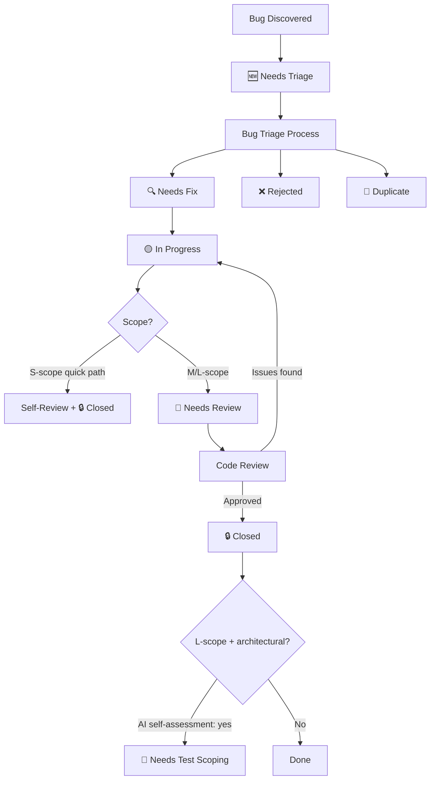

# Bug Fix Verification Lifecycle - Framework Extension Concept

## Document Metadata
| Metadata | Value |
|----------|-------|
| Document Type | Framework Extension Concept |
| Created Date | 2026-04-14 |
| Status | Approved and Implemented |
| Extension Name | Bug Fix Verification Lifecycle |
| Extension Scope | Bug Fixing task, Bug Triage task, Code Review task, Update-BugStatus script, bug-tracking state file, task transition registry, ai-tasks workflow |
| Extension Type | Modification |
| Author | AI Agent & Human Partner |

---

## 🎯 Purpose & Context

**Brief Description**: The bug fix verification lifecycle has multiple inconsistencies between the task definition (PF-TSK-007), the `Update-BugStatus.ps1` script, the bug-tracking.md status legend, and the documented workflows in ai-tasks.md. Bug fixes are self-certified (fixer marks own work as Verified), status names collide between script and legend, and the workflow forces all bugs through Performance & E2E Test Scoping regardless of scope. This extension aligns the entire bug lifecycle by adopting the next-action status model (matching feature-tracking.md v2.13), integrating Code Review as the external verification gate, and adding an S-scope quick path for small bugs.

### Extension Overview

This extension modifies 7 existing artifacts to create a coherent bug fix verification lifecycle:

1. **Status model alignment** — Adopt next-action phrasing for bug statuses (e.g., "Needs Triage" instead of "Reported"), matching the convention established for feature-tracking.md in PF-PRO-018/PF-STA-083.
2. **Script/task/legend naming fix** — Resolve the critical collision where `Update-BugStatus.ps1` maps "Fixed" → ✅ and "Testing" → 🧪, while the legend and task definition use the opposite mapping.
3. **Verification gate** — Move the Verified transition out of Bug Fixing and into Code Review, so the fixer cannot self-certify. Collapse ✅ Verified and 🔒 Closed into a single terminal state.
4. **S-scope quick path** — Allow small bugs to be triaged, fixed, self-reviewed, and closed in a single session without requiring a separate Code Review task.
5. **Workflow correction** — Remove mandatory PF-TSK-086 from the bug fix workflow; add it as optional for L-scope architectural changes.

### Key Distinction from Existing Framework Components

| Existing Component | Purpose | Scope |
|-------------------|---------|-------|
| **Structure Change Task** | Reorganizes existing framework components | Rearrangement of current elements |
| **Process Improvement Task** | Makes granular improvements to existing processes | Optimization of current workflows |
| **New Task Creation Process** | Creates individual new tasks | Single task creation |
| **Bug Fix Verification Lifecycle** *(This Extension)* | **Coordinated realignment of the bug lifecycle across 7 artifacts** | **Cross-cutting modification: 3 task definitions, 1 script, 1 state file, 1 infrastructure file, 1 workflow file** |

## 🔍 When to Use This Extension

This is a one-time framework modification, not a reusable process. It addresses:

- **Status naming collision**: Script produces wrong emoji when following task instructions literally
- **Self-certification gap**: No external gate between "Fixed" and "Verified" in the current bug lifecycle
- **Status model inconsistency**: Bug tracking uses past-tense statuses while feature tracking uses next-action statuses
- **Workflow overhead**: All bugs forced through Performance & E2E Test Scoping regardless of scope

## 🔎 Existing Project Precedents

| Precedent | Where It Lives | What It Does | How It Relates |
|-----------|---------------|--------------|----------------|
| Next-action status model for features | feature-tracking.md v2.13 (PF-PRO-018/PF-STA-083) | Replaced last-completed statuses with next-action statuses (e.g., "Needs Review" instead of "Reviewed") | **Direct reuse** — apply same convention to bug-tracking statuses |
| Feature verification via Code Review | PF-TSK-005 + feature-tracking.md | Code Review sets feature status to `🔎 Needs Test Scoping` on approval — external gate, not self-certified | **Pattern to replicate** — Code Review should set bug status to 🔒 Closed on approval |
| E2E audit gate | PF-TSK-030 + e2e-test-tracking.md | E2E test cases require `🔍 Audit Approved` before execution | **Principle to follow** — external verification before status advancement |
| S-scope combined checkpoint | PF-TSK-007 Step 11 | S-scope bugs already combine Steps 11+14 into a single checkpoint | **Extend this pattern** — S-scope quick path extends the existing single-checkpoint shortcut to cover triage and self-review too |

**Key takeaways**: The project already uses external gates (Code Review, Test Audit) and next-action statuses (feature-tracking). Bug tracking is the outlier that doesn't follow these established patterns. The S-scope combined checkpoint in Bug Fixing is a precedent for scope-based path simplification.

## 🔌 Interfaces to Existing Framework

### Task Interfaces

| Existing Task | Interface Type | Description |
|--------------|----------------|-------------|
| Bug Triage (PF-TSK-041) | Modified by extension | Output status renamed from 🔍 Triaged to 🔍 Needs Fix |
| Bug Fixing (PF-TSK-007) | Modified by extension | Remove Step 31 (mark Verified); add S-scope quick path; add L-scope test scoping self-assessment note; fix script invocation examples; update Next Tasks |
| Code Review (PF-TSK-005) | Modified by extension | Add bug-tracking.md update step: transition bug from 👀 Needs Review → 🔒 Closed on approval |
| Perf & E2E Test Scoping (PF-TSK-086) | Downstream (optional) | Only for L-scope bugs where AI agent self-assesses test scoping is needed |

### State File Interfaces

| State File | Read / Write / Both | What the Extension Changes |
|-----------|---------------------|---------------------------|
| bug-tracking.md (PD-STA-004) | Both | Rename status legend entries to next-action model; update Mermaid workflow diagram; update all existing bug entries to use new status names |
| feature-tracking.md (PD-STA-001) | Read only | Reference for next-action status convention (no changes) |
| e2e-test-tracking.md | Write (unchanged) | Bug Fixing Step 25 still marks groups for re-execution — no change needed |

### Artifact Interfaces

| Existing Artifact | Relationship | Description |
|------------------|--------------|-------------|
| Update-BugStatus.ps1 | Modified by extension | Rename ValidateSet values to match new status names; remove "Testing"/"Fixed" confusion; add "NeedsReview" status; remove separate "Verified" (merge into "Closed") |
| ai-tasks.md | Modified by extension | Update bug fix workflow to remove mandatory PF-TSK-086 |
| task-transition-registry.md | Modified by extension | Fix "🧪 Testing" terminology; update FROM Bug Fixing prerequisites and routing |
| PF-documentation-map.md | Read only | No new artifacts created — modification only |

## 🏗️ Core Process Overview

### New Bug Status Model (Next-Action)

| Emoji | New Name | Old Name | Description | Next Task |
|-------|----------|----------|-------------|-----------|
| 🆕 | Needs Triage | Reported | Bug reported, awaiting evaluation | PF-TSK-041 |
| 🔍 | Needs Fix | Triaged | Triaged and prioritized, ready for fixing | PF-TSK-007 |
| 🟡 | In Progress | In Progress | Currently being investigated/fixed | — |
| 👀 | Needs Review | *(new)* | Fix complete, awaiting Code Review | PF-TSK-005 |
| 🔒 | Closed | Closed | Reviewed and verified, terminal state | — |
| 🔄 | Reopened | Reopened | Previously closed, recurred — re-triage | PF-TSK-041 |
| ❌ | Rejected | Rejected | Not a bug / won't fix, terminal state | — |
| 🚫 | Duplicate | Duplicate | Duplicate of existing bug, terminal state | — |

**Removed statuses**: 🧪 Fixed and ✅ Verified are eliminated. "Fixed" is replaced by 👀 Needs Review (what needs to happen next). "Verified" is merged into 🔒 Closed (Code Review is the verification gate).

### New Bug Lifecycle Diagram



### S-Scope Quick Path

For S-scope bugs meeting **all** criteria:
- Scope = S (single-session fix, isolated change)
- No E2E test groups affected (or none exist for the area)
- Root cause is obvious or already known (e.g., discovered during development)

**Single-session flow**:
```
Inline Triage (lightweight, within Bug Fixing) → Fix + Regression Tests → Self-Review at Checkpoint → 🔒 Closed
```

The human partner still approves at the checkpoint (existing Step 23) — this serves as the review gate for S-scope. No separate Code Review task needed.

### M/L-Scope Standard Path

```
Bug Triage (PF-TSK-041): 🆕 Needs Triage → 🔍 Needs Fix
Bug Fixing (PF-TSK-007): 🔍 Needs Fix → 🟡 In Progress → 👀 Needs Review
Code Review (PF-TSK-005): 👀 Needs Review → 🔒 Closed (or → back to 🟡 In Progress if issues found)
```

### L-Scope Test Scoping (Optional)

For L-scope bugs with architectural changes, the AI agent evaluates during Bug Fixing whether the fix is significant enough to warrant test scoping. If yes, after Code Review approval the agent sets status to `🔎 Needs Test Scoping` instead of `🔒 Closed`, routing to PF-TSK-086. This is judgment-based, not mandatory.

## 🔗 Integration with Task-Based Development Principles

- **Next-action consistency**: Bug statuses will follow the same next-action convention as feature-tracking.md, making the status model uniform across the framework
- **External verification gates**: Code Review as the verification gate mirrors the established pattern for features (implementation → review → completion)
- **Scope-proportional process**: S-scope quick path follows the principle that process overhead should be proportional to change complexity — matching the existing S-scope combined checkpoint pattern in Bug Fixing Step 11

## 📊 Detailed Workflow & Artifact Management

### Update-BugStatus.ps1 — ValidateSet Changes

| Current Value | New Value | Emoji | Maps To |
|--------------|-----------|-------|---------|
| "Triaged" | "NeedsFix" | 🔍 | Needs Fix |
| "InProgress" | "InProgress" | 🟡 | In Progress (unchanged) |
| "Testing" | **REMOVED** | — | Eliminated — was confusing |
| "Fixed" | "NeedsReview" | 👀 | Needs Review |
| — | *(no separate Verified)* | — | Merged into Closed |
| "Closed" | "Closed" | 🔒 | Closed (unchanged name, now includes verification) |
| "Reopened" | "Reopened" | 🔄 | Reopened (unchanged) |
| "Rejected" | "Rejected" | ❌ | Rejected (unchanged) |

**Script behavior changes**:
- "NeedsFix": Sets 🔍 emoji, accepts Priority/Scope/Dims/Workflows/TriageNotes parameters (same as current "Triaged")
- "NeedsReview": Sets 👀 emoji, accepts FixDetails/RootCause/TestsAdded parameters (moved from current "Fixed")
- "Closed": Sets 🔒 emoji, requires VerificationNotes (same as current), moves entry to Closed section
- Remove the "Fixed" → ✅ mapping entirely (this was the collision)
- Remove the "Testing" → 🧪 mapping entirely (this was the confusion source)

### Bug Fixing Task (PF-TSK-007) — Specific Changes

**Step 24** — Change:
```
FROM: Update bug status from 🟡 In Progress to 🧪 Fixed
  TO: Update bug status from 🟡 In Progress to 👀 Needs Review
      Script: Update-BugStatus.ps1 -BugId "BUG-001" -NewStatus "NeedsReview" -FixDetails "..." -RootCause "..." -TestsAdded "Yes"
```

**Step 31** — Remove entirely. Bug Fixing no longer transitions to Verified/Closed. The task exits at 👀 Needs Review.

**New: S-scope quick path** — Add after Step 11 as a conditional:
> **S-scope quick path**: If the bug meets all quick path criteria (S-scope, no E2E impact, obvious root cause), the following steps are combined into this session:
> - Inline triage (if bug is 🆕 Needs Triage): Assign priority, scope=S, dims, and transition to 🔍 Needs Fix
> - Execute Steps 12-23 (root cause, test, fix, checkpoint)
> - After human approval at Step 23 checkpoint: transition directly to 🔒 Closed (self-reviewed)
> - Skip Steps 24 onwards — no separate Code Review task needed
> - Proceed to completion checklist

**New: L-scope test scoping note** — Add after Step 23 checkpoint:
> **L-scope test scoping assessment**: For L-scope bugs with architectural changes, evaluate whether the fix changes feature behavior significantly enough to warrant performance or E2E test scoping. If yes, note in the checkpoint that after Code Review the bug should route to PF-TSK-086 (`🔎 Needs Test Scoping`) instead of directly to `🔒 Closed`.

**Next Tasks section** — Update:
- Add: "Performance & E2E Test Scoping (PF-TSK-086) — If L-scope fix changes feature behavior significantly (AI agent self-assessment)"
- Keep: Code Review, Manual Test Case Creation, Manual Test Execution, Bug Triage, Feature Implementation Planning, Test Specification Creation

### Code Review Task (PF-TSK-005) — Specific Changes

**Add step in Finalization section** (after existing review completion steps):
> **Bug fix reviews**: If this review is for a bug fix (identified by the bug's Dims column, not a feature implementation state file), update bug-tracking.md:
> - On approval: Transition bug from 👀 Needs Review → 🔒 Closed using `Update-BugStatus.ps1 -NewStatus "Closed" -VerificationNotes "Code review approved"`
> - On rejection: Transition bug back to 🟡 In Progress and route back to Bug Fixing

**State Tracking section** — Add bug-tracking.md as a conditional update target for bug fix reviews.

### ai-tasks.md — Workflow Change

**Current**:
```
Bug Fixing → Code Review → Performance & E2E Test Scoping (PF-TSK-086) → Release & Deployment
```

**New**:
```
Bug Fixing → Code Review → Release & Deployment
```
With a note: "For L-scope architectural bug fixes, the AI agent may route to Performance & E2E Test Scoping (PF-TSK-086) if the fix changes feature behavior significantly."

And add the S-scope quick path:
```
S-scope bugs: Bug Fixing (with inline triage + self-review) → Release & Deployment
```

### Task Transition Registry — Changes

**"Transitioning FROM Bug Fixing" section**:
- Change prerequisite: "Bug status updated to 🧪 Testing" → "Bug status updated to 👀 Needs Review"
- Keep routing: Always → Code Review
- Add: "Exception: S-scope quick path bugs are closed within Bug Fixing and do not transition to Code Review"

**"Transitioning FROM Code Review" section**:
- Add bug fix routing: "If reviewing a bug fix: Approved → 🔒 Closed in bug-tracking.md; Issues found → 🟡 In Progress → back to Bug Fixing"

### bug-tracking.md — Changes

- Replace entire Status Legend section with new next-action statuses
- Update Mermaid workflow diagram to match new lifecycle
- Update all existing bug entries from old status names to new (🆕 Reported → 🆕 Needs Triage, 🔍 Triaged → 🔍 Needs Fix, etc.)
- Remove 🧪 Fixed and ✅ Verified from legend

## 🔄 Modification Details

### State Tracking Audit

| State File | Current Purpose | Modification Needed | Change Type |
|-----------|-----------------|---------------------|-------------|
| bug-tracking.md (PD-STA-004) | Bug lifecycle tracking with status legend, registry, and statistics | Rename status legend entries to next-action model; update Mermaid diagram; update existing bug entries to new status names; remove 🧪/✅ statuses | Modify schema (status legend + diagram) |

**Cross-reference impact**:
- `Update-BugStatus.ps1` parses bug-tracking.md column structure — ValidateSet values must match new status names
- `Validate-StateTracking.ps1` may parse bug status values — verify after changes
- Bug Triage task references status names in process text — must use new names
- Bug Fixing task references status names in process text — must use new names
- Bug fix state tracking template references statuses — check and update

### Guide Update Inventory

| File to Update | References To | Update Needed |
|---------------|---------------|---------------|
| Bug Fixing task (PF-TSK-007) | Status names 🧪 Fixed, ✅ Verified, script examples | Replace status references, remove Step 31, add S-scope quick path, add L-scope note, update script examples |
| Bug Triage task (PF-TSK-041) | Status name 🆕 Reported, 🔍 Triaged | Replace with 🆕 Needs Triage, 🔍 Needs Fix |
| Code Review task (PF-TSK-005) | Bug fix review handling | Add bug-tracking.md update step for bug fix reviews |
| ai-tasks.md | Bug fix workflow | Remove mandatory PF-TSK-086, add S-scope quick path |
| task-transition-registry.md | "🧪 Testing" status, Bug Fixing prerequisites | Fix terminology, update routing |
| Bug fix state tracking template | Status references | Update to new status names |
| Process Framework Task Registry | TRIGGER & OUTPUT for PF-TSK-007 | Update output statuses |

**Discovery method**: Grep for "🧪 Fixed", "✅ Verified", "Triaged", "Reported" in process-framework/ and doc/ directories; manual review of task transition registry and ai-tasks.md workflows.

### Automation Integration Strategy

| Existing Script | Current Behavior | Required Change | Backward Compatible? |
|----------------|-----------------|-----------------|---------------------|
| Update-BugStatus.ps1 | ValidateSet: Triaged, InProgress, Testing, Fixed, Closed, Reopened, Rejected | Rename: Triaged→NeedsFix, Fixed→NeedsReview; Remove: Testing; Keep: InProgress, Closed, Reopened, Rejected | No — all callers must use new values. Since callers are task definitions (human-read), not other scripts, this is safe. |
| Validate-StateTracking.ps1 | May parse bug status values | Verify which surfaces reference bug statuses; update if needed | Verify after changes |
| New-BugReport.ps1 | Creates bugs with 🆕 Reported status | Update to use 🆕 Needs Triage | No — simple text replacement |

**New automation needed**: None — existing scripts sufficient after modification.

---

## 🔧 Implementation Roadmap

### Implementation Session Plan

This extension can be completed in a **single session** — it modifies existing artifacts only, no new files to create.

#### Session 1: All Changes

**Order matters** — modify the foundation first (script + tracking file), then update consumers (task definitions), then update infrastructure (transition registry, ai-tasks.md).

| # | Artifact | Change | Effort |
|---|----------|--------|--------|
| 1 | bug-tracking.md | Update status legend, Mermaid diagram, existing bug entries | Medium |
| 2 | Update-BugStatus.ps1 | Rename ValidateSet values, update emoji mappings, remove Testing/Fixed confusion | Medium |
| 3 | Bug Fixing task (PF-TSK-007) | Replace status refs, remove Step 31, add S-scope quick path, add L-scope note, update script examples, update Next Tasks | High |
| 4 | Bug Triage task (PF-TSK-041) | Replace status name references | Low |
| 5 | Code Review task (PF-TSK-005) | Add bug fix review step for bug-tracking.md update | Low |
| 6 | task-transition-registry.md | Fix terminology, update FROM Bug Fixing, update FROM Code Review | Medium |
| 7 | ai-tasks.md | Update bug fix workflow, add S-scope quick path | Low |
| 8 | Validate: Run Validate-StateTracking.ps1 to catch regressions | Low |
| 9 | Process Framework Task Registry | Update TRIGGER & OUTPUT for PF-TSK-007, PF-TSK-041 | Low |

#### Post-Implementation Validation

- Run `Validate-StateTracking.ps1` to verify no surfaces broke
- Run `Update-BugStatus.ps1 -WhatIf` with new parameter values to verify script works
- Verify all bug entries in bug-tracking.md display correct new statuses
- Grep for orphaned references to old status names (🧪 Fixed, ✅ Verified, "Testing", "-NewStatus Fixed")

## 🎯 Success Criteria

### Functional Success Criteria
- [ ] **No orphaned status references**: Grep for old status names (🧪 Fixed, ✅ Verified, "Testing", `-NewStatus "Fixed"`) returns zero hits across all framework files
- [ ] **Script works with new values**: `Update-BugStatus.ps1 -WhatIf` succeeds with NeedsFix, NeedsReview, Closed
- [ ] **Validation passes**: `Validate-StateTracking.ps1` reports no regressions
- [ ] **Status consistency**: All existing bug entries in bug-tracking.md use new status names
- [ ] **S-scope path documented**: Bug Fixing task clearly defines quick path criteria and flow

### Technical & Integration Requirements
- [ ] **Script ValidateSet aligned**: Update-BugStatus.ps1 values match bug-tracking.md legend exactly
- [ ] **Task→script examples correct**: All `-NewStatus` examples in task definitions use valid ValidateSet values
- [ ] **Transition registry consistent**: FROM Bug Fixing and FROM Code Review sections use new status names and routing
- [ ] **Workflow matches tasks**: ai-tasks.md bug fix workflow matches what Bug Fixing and Code Review tasks actually do

## 📝 Next Steps

### Immediate Actions Required
1. **Human Review**: Approve this concept document before implementation
2. **Implementation**: Execute all changes in a single session following the Implementation Roadmap order
3. **Validation**: Run validation scripts and grep for orphaned references

---

## 📋 Human Review Checklist

**🚨 This concept requires human review before implementation can begin! 🚨**

### Key Decisions for Review
- [ ] **Next-action status names**: Are 🆕 Needs Triage, 🔍 Needs Fix, 👀 Needs Review, 🔒 Closed the right names?
- [ ] **S-scope quick path**: Is it acceptable for S-scope bugs to skip separate Code Review (human approves at checkpoint instead)?
- [ ] **Verified/Closed collapse**: Agree to merge ✅ Verified into 🔒 Closed (Code Review is the verification)?
- [ ] **L-scope test scoping**: Is AI self-assessment the right trigger for optional PF-TSK-086 routing?
- [ ] **Script ValidateSet values**: Are NeedsFix, NeedsReview acceptable as script parameter values (no spaces, PascalCase)?

### Approval Decision
- [ ] **APPROVED**: Concept is approved for implementation
- [ ] **NEEDS REVISION**: Concept needs changes before approval
- [ ] **REJECTED**: Concept is not suitable for framework extension

**Human Reviewer**: [Name]
**Review Date**: 2026-04-14
**Decision**: [APPROVED/NEEDS REVISION/REJECTED]
**Comments**: [Review comments and feedback]

---

*This concept document was created using the Framework Extension Concept Modification Template as part of the Framework Extension Task (PF-TSK-026).*
