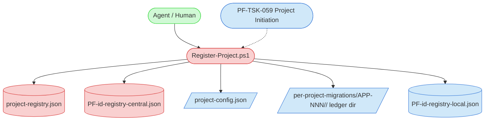
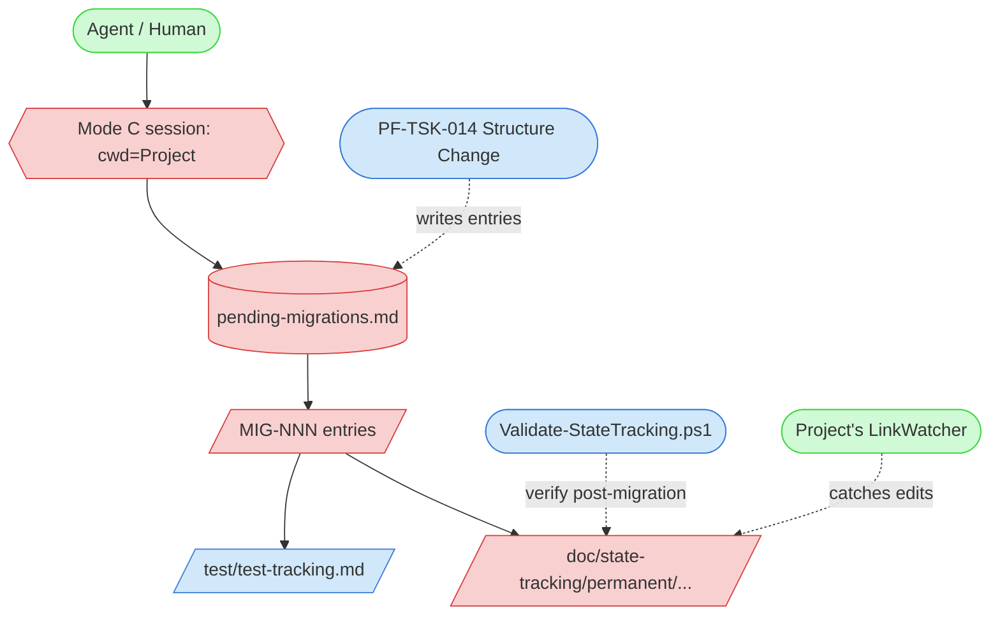
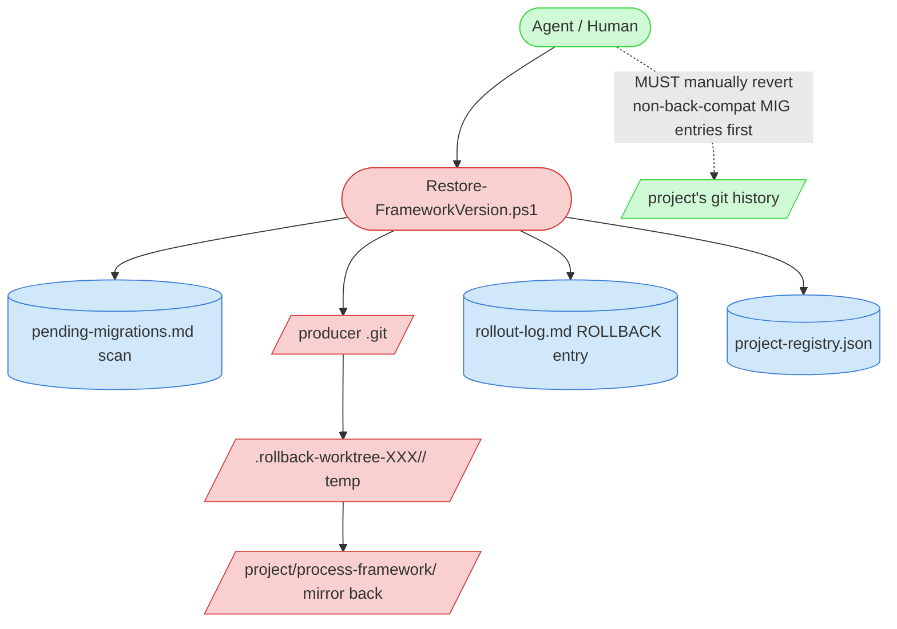
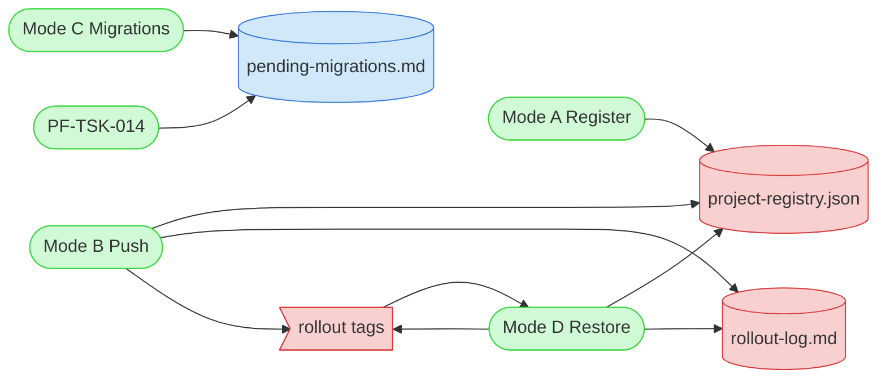

# Framework Rollout Usage Guide

## Overview

Practical patterns for working with the [Framework Rollout Task (PF-TSK-088)](../../tasks/support/framework-rollout-task.md) and its three driver scripts:

- `Register-Project.ps1` — assigns the mnemonic-derived child ID (APP-NNN under FWK-APP, P-14), registers a project (Mode A retrofit, or invoked from PF-TSK-059 for new projects)
- `process-framework/scripts/rollout/Push-FrameworkUpdate.ps1` — Mode B bulk-push driver (shipped support-class script; producer sessions prepend the producer's blueprint prefix, e.g. `blueprint/` at appdev)
- `process-framework/scripts/rollout/Restore-FrameworkVersion.ps1` — Mode D rollback driver (same location)

> **🚨 NOT a re-explanation of PF-TSK-088.** The task definition is authoritative for *what* and *when*. This guide covers *how to work effectively with the script outputs*: dry-run interpretation, recovery from partial state, customization patterns for the [Pending Migration Entry Template (PF-TEM-079)](../../templates/support/pending-migration-entry-template.md) when Structure Change writes entries, and the most common operational pitfalls. If you need workflow guidance, read the task definition.

## When to Use

- **Before every Mode B (Push) session**: read [Dry-Run Interpretation](#dry-run-interpretation) so the agent and human partner share a vocabulary for what the diff output means.
- **When authoring a `pending-migrations.md` entry** as part of [Structure Change (PF-TSK-014)](../../tasks/support/structure-change-task.md): read [Authoring Pending Migration Entries](#authoring-pending-migration-entries) for the Rollback Implications field semantics and apply-time-check phrasing.
- **When a Mode C entry relocates test code or many path-dense files**: read [Test-Suite Migration Pattern (Mode C)](#test-suite-migration-pattern-mode-c) before touching any file.
- **When a Push fails partway** (one project mirrored, another errored): read [Partial-Rollout Recovery](#partial-rollout-recovery).
- **When a project is in the registry but should not receive rollouts** (release freeze, vendor handoff, archival): read [Frozen Projects](#frozen-projects).
- **When a Mode D rollback is being considered**: read [Rollback Decision Patterns](#rollback-decision-patterns) before invoking `Restore-FrameworkVersion.ps1` — sometimes a forward-fix is the right call instead.

## Prerequisites

- The agent has the [Framework Rollout Task (PF-TSK-088)](../../tasks/support/framework-rollout-task.md) loaded as critical context.
- The producer workspace is a git repository whose origin remote matches its config-declared `repository_url` (appdev: `https://github.com/Abtomation/framework-appdev.git`).
- The producer's central child registry (`process-framework-central/<registry file>`, role-derived — `project-registry.json` at appdev) exists and is well-formed.

## Background

The Rollout system has **three durable artifacts** the agent reads before every operation, and **three per-project files** the scripts maintain in each rolled-out project:

**Durable artifacts at the producer face (read at session start):**

| Artifact | Purpose |
|---|---|
| `project-registry.json` | Source of truth for which projects exist, their paths, freeze state, last-rollout timestamp |
| `rollout-log.md` | Append-only audit trail of every rollout (forward + rollback) |
| `per-project-migrations/<PROJECT-ID>/pending-migrations.md` | Per-project ledger: full Summary table + detail sections of open entries that Structure Change has queued |
| `per-project-migrations/<PROJECT-ID>/archive/pending-migrations-archive.md` | Resolved/skipped detail sections, relocated by `Update-PendingMigration.ps1` on resolve/skip (PF-IMP-983); Mode D reads non-backward-compatible reversal steps here |

**Per-project files (written by Push, read by Restore):**

| File | Purpose |
|---|---|
| `<project>/process-framework/.framework-version` | Records which framework version this project is currently running |
| `<project>/process-framework/.framework-version-previous` | Default rollback target (the version installed BEFORE the most recent Push) |
| `<project>/process-framework/.framework-central-pointer` | Absolute path to the producer workspace root (consumed by project-side scripts that write to centralized state) |

The git tag `rollout-<YYYY-MM-DD-NNN>` in the producer repo is the canonical snapshot for any version. `Restore-FrameworkVersion.ps1` resolves the tag via `git worktree add --detach` to materialize the target version without disturbing the producer's main working tree.

## Mode & Component Diagrams

The Rollout task has four distinct sub-flows. Each diagram shows the components active in that mode only; the final diagram shows the durable artifacts that span all modes. See the [Visual Notation Guide](visual-notation-guide.md) for symbol semantics.

### Mode A — Project Registration (retrofit + workspace identity)



`Register-Project.ps1` consumes the next child ID (producer-mnemonic pool, e.g. APP) from `PF-id-registry-central.json` (atomic increment), adds an entry to `project-registry.json`, stamps `<project>/doc/project-config.json` with the assigned `project_id`, provisions `<project>/doc/state-tracking/PF-id-registry-local.json` (project-local `PF-STA`/`PF-TMP` prefixes, when absent), and creates an empty `pending-migrations.md` skeleton (under the role-derived ledger directory). `PF-TSK-059` invokes it in Phase A for new projects (after the blueprint bootstrap, before the delegated first push); Mode A is retrofit-only for existing projects, plus the `-Self -SelfId FWK-XXXX` workspace-identity declaration (config-only write — a producer face holds no self-row in its own registry, PF-PRO-068 P-13).

### Mode B — Phase 1 Bulk Push

```mermaid
graph TD
    classDef critical fill:#f9d0d0,stroke:#d83a3a
    classDef important fill:#d0e8f9,stroke:#3a7bd8
    classDef reference fill:#d0f9d5,stroke:#3ad83f
    classDef state fill:#fff4d0,stroke:#d8a83a

    Operator([Agent / Human]) --> PushScript([Push-FrameworkUpdate.ps1])
    PushScript --> AppdevGit[/producer .git/]
    PushScript --> GithubRemote[\config-declared remote]
    PushScript --> AppdevPF[/producer framework source/]
    PushScript --> ProjectPF[/project/process-framework/ mirror/]
    PushScript --> RolloutLog[(rollout-log.md)]
    PushScript --> CentralRegistry2[(project-registry.json)]
    AppdevGit --> RolloutTag>git tag rollout-VERSION]
    AppdevPF --> AppdevVersion[/.framework-version/]
    ProjectPF --> ProjVersion[/.framework-version/]
    ProjectPF --> ProjPrev[/.framework-version-previous/]
    ProjectPF --> ProjPointer[/.framework-central-pointer/]

    class PushScript,AppdevGit,RolloutTag,ProjectPF critical
    class GithubRemote,AppdevPF,RolloutLog,CentralRegistry2 important
    class AppdevVersion,ProjVersion,ProjPrev,ProjPointer,Operator reference
```

cwd must be the producer root. Order: bump `.framework-version` → git stage/commit/tag `rollout-<VERSION>` → push origin + tag (GitHub is warn-only durability) → per project: capture prior version as `.framework-version-previous`, robocopy `/MIR /XF` (preserves per-project files), write the pointer files → update the child registry + append to `rollout-log.md` → commit those two central-state files as a second `rollout-meta: <VERSION>` commit and push (warn-only), so the audit trail lands in version control at rollout time.

### Mode C — Phase 2 Per-Project Migrations



Each entry is one project working-doc migration written by [Structure Change (PF-TSK-014)](../../tasks/support/structure-change-task.md) and applied from cwd=Project (so the project's own LinkWatcher + validation run naturally). Entries carry the load-bearing **Rollback Implications** field; one entry per checkpoint, append-only status updates.

### Mode D — Rollback



Materializes the rollback target via `git worktree add --detach` (the producer's main tree untouched), mirrors temp-worktree → project `process-framework` (`/MIR /XF`). **Scope is `process-framework` ONLY** — `<project>/doc/` and `<project>/test/` are not touched; pre-flight scans the ledger Summary table for non-backward-compatible entries and the operator MUST manually revert those project edits first. Temp worktree removed in a `finally`; a pre-flight sweep also reclaims any `.rollback-worktree-*` left by an interrupted prior run (hard kill / crash) that the `finally` never reached (PF-IMP-1147).

### Cross-Mode Component Map



The three durable artifacts span all modes: `project-registry.json` (written by A, updated by B/D, read by all), `rollout-log.md` (written by B and D), and the `rollout-<VERSION>` git tags (created by B, consumed by D). The per-project `pending-migrations.md` ledger is written by Structure Change and consumed by Mode C; its Summary table is scanned by Mode D pre-flight.

## Committing a dirty working tree around a Push

Push commits only **two** things: the framework subtree (`blueprint/process-framework/`, the `rollout-<VERSION>` commit) and `project-registry.json` + `rollout-log.md` (the `rollout-meta` commit). Pre-flight's clean-tree gate is scoped to the framework subtree alone — a dirty tree elsewhere does **not** block the Push, but Push leaves that content uncommitted.

So when non-rolled producer-management changes have accumulated (`process-framework-central/**` other than the registry/log, `test/**`, root config), commit deliberately **before** the Push so its `git push origin main` carries everything to GitHub:

1. **Framework content** — `git add blueprint/process-framework && git commit` (required: pre-flight refuses a dirty subtree).
2. **Non-rolled producer-management content** — stage and commit the rest separately (Push never touches it).
3. **Push** — bumps + commits/tags the version, mirrors, commits the registry/log, pushes all commits.

## Dry-Run Interpretation

`Push-FrameworkUpdate.ps1 -Check` is **mandatory** before any real Mode B rollout. The output has three sections; here's how to read each.

### Pre-flight block

```
═══ Framework Rollout — Pre-flight ═══
  Mode             : DRY-RUN (-Check)
  Producer root    : C:\Users\ronny\VS_Code\FrameworkBuilder\appdev (framework; own id FWK-APP)
  Working tree     : clean
  Origin remote    : https://github.com/Abtomation/framework-appdev.git
  Current version  : 2026-05-12-001
  Next version     : 2026-05-13-001
  Target projects  : APP-001, APP-002
  Framework skills : 3 — api-design, imp-triage, ui-design
```

**What to verify:**

- **Producer root** — names the resolved workspace, its declared role, and its own `project_id`; confirm all three match the workspace you meant to push from.
- **Working tree** — should be `clean`. If `dirty`, the Push will refuse unless `-Force`. Investigate: are there in-progress framework edits that should be committed first? Or stale state from a half-completed prior session?
- **Origin remote** — should match the config-declared `repository_url` exactly. A mismatch is rare but indicates either a renamed remote or the wrong producer clone.
- **Current version vs Next version** — confirm the version-bump matches expectation. Same-day re-rollouts increment NNN (e.g., `2026-05-13-001` → `2026-05-13-002`); new days reset to `001`.
- **Target projects** — should match what the human partner asked for. Frozen projects auto-skip; if a frozen project is mentioned in the human's request, the script will warn but still skip it. Re-reading the registry for `version_freeze: true` is part of pre-flight verification.
- **Framework skills** — the craft skills this rollout mirrors into each project's `.claude/skills/`, named so you can confirm the set is the one you expect (a skill added or retired since the last rollout shows up here). Each is `/MIR`'d per folder; project-local skills the framework doesn't ship are left untouched.

### Per-project diff block

```
═══ Per-Project Diff ═══
  APP-001 (LinkWatcher): added=3 modified=18 deleted=1
    Sample added   : tasks/support/imp-triage-task.md, scripts/update/Apply-Migration-MIG-002.ps1
    Sample modified: ai-tasks.md, PF-documentation-map.md, tasks/support/process-improvement-task.md
    Sample deleted : guides/old/deprecated-guide.md
  APP-002 (ExampleProject): added=3 modified=18 deleted=1
    Sample added   : tasks/support/imp-triage-task.md, ...
```

**What to verify:**

- **Counts match expectation** — if the IMP batch you're rolling out claimed to add 3 new tasks but the diff shows added=12, something else is going on. Investigate before proceeding.
- **First-ever push to a freshly bootstrapped project** — `added=0 modified=0 deleted=0` is expected-correct when the bootstrap copy matches the current producer tree: the dry-run diff compares trees before the new version is minted, and the real push still stamps `.framework-version`, writes `.framework-central-pointer`, and appends the rollout log. Treat a first-push 0/0/0 as suspicious only if the producer's framework tree changed since the bootstrap.
- **Sample paths look right** — top-of-list samples are usually the most prominent additions/modifications. Glaringly project-specific paths in the modified list (e.g., `feature-tracking.md`, `bug-tracking.md`) signal that the producer's LinkWatcher edited project-state files that should NOT be in `process-framework/` — investigate before proceeding.
- **Deleted samples** — most rollouts have 0 deletions. A deletion typically means a framework artifact was removed in this batch (e.g., deprecated guide). Confirm the deletion is intentional.
- **APP-001 vs APP-002 counts differ wildly** — usually means one project drifted from canonical (someone hand-edited `<project>/process-framework/`). The drift will be wiped by the Push (since /MIR mirrors). If the drift contains valuable work, capture it via Structure Change → IMP first.

### Identical-output across projects

For all-projects rollouts, every project's diff should be **identical** unless a project was at a different starting version. If counts differ, you likely have either:
- A project at a different starting version (compare `.framework-version` per project)
- A project with hand-edits in `<project>/process-framework/` (drift)

## When you do NOT need a migration entry

Pending migration entries exist for **one** purpose: changes to project files **outside** the rolled-out subtree (`<project>/doc/`, `<project>/test/`, `<project>/src/`, `<project>/CLAUDE.md`, project-config.json schema bumps, etc.). Mode B's `robocopy /MIR` mirror does not touch those — they need Mode C sessions in each affected project to apply.

**Inside** `blueprint/process-framework`, the mirror handles everything for you. Authors of intra-blueprint changes routinely overestimate the work needed; the table below is the canonical "is this me?" reference — the single authoritative scope-boundary table that other migration-entry callouts across the framework point to rather than restating.

| Change shape (intra-blueprint) | Migration entry needed? | How it propagates |
|---|---|---|
| Move a file *within* `blueprint/process-framework/` | **No** | `/MIR` copies new path, deletes old |
| Add a new file inside `blueprint/process-framework/` | **No** | `/MIR` copies it to every project |
| Delete a file from `blueprint/process-framework/` | **No** | `/MIR` orphan-removes it from every project |
| Rename a file inside `blueprint/process-framework/` | **No** | `/MIR` treats as delete-old + add-new |
| Move a file *out of* `blueprint/process-framework/` into `process-framework-central/` | **No** | `/MIR` orphan-removes the blueprint side; central side is producer-face-only and was never rolled out |
| Change script behavior inside `blueprint/process-framework/scripts/` | **No** | `/MIR` updates the file in every project |
| Restructure sections inside a framework doc (`tasks/`, `guides/`, `templates/`) | **No** | `/MIR` updates the file in every project |

| Change shape (project working-tree) | Migration entry needed? | How it propagates |
|---|---|---|
| Add / rename / remove a column in `<project>/doc/state-tracking/permanent/feature-tracking.md` | **Yes** | Mode C session in each project applies the edit |
| Add a new section to `<project>/CLAUDE.md` template | **Yes** (if modifying existing projects' `CLAUDE.md`) | Mode C session |
| Restructure `<project>/doc/state-tracking/permanent/` layout | **Yes** | Mode C session |
| Bump schema in `<project>/doc/project-config.json` | **Yes** | Mode C session |
| Add / rename a tracking file in `<project>/test/` | **Yes** | Mode C session |

### Overwrite-safe vs migration-needed distribution

The discriminator is **who owns the content**, not where it lives. Migration entries exist only for **project-customized** state — content a project owns and edits locally, which must be preserved or transformed in place. **Framework-owned content that projects never edit is overwrite-safe**: a plain overwrite-mirror (like Push's `/MIR`) distributes it with no per-project migration, even outside `process-framework/` (e.g. a future `.claude/skills/` tree). Don't model never-customized framework content as bootstrap-seed + migration — an overwrite-mirror suffices.

### Worked example: "I moved a script from `blueprint/process-framework/scripts/` to `process-framework-central/scripts/`. Do I need a migration entry?"

**No.** The mirror handles three pieces independently:

1. The blueprint-side script file gets orphan-removed from every project at the next Push (the source no longer contains it).
2. The new central-side script lives only in `process-framework-central/`, which is producer-face-only and is **never** copied to projects (per Centralized Framework Management §3.1).
3. Any callers that referenced the script via its blueprint path need their paths updated — but those edits also live inside `blueprint/process-framework/`, so they too propagate via the mirror.

### Worked example: "I changed a script's behavior. Do I need a migration entry?"

**No.** The mirror replaces the file content in every project. Script behavior changes propagate automatically. Migration entries are about **project-side data structure** (where the projects own the canonical data), not about framework code behavior.

### When in doubt

Ask: "Does the change require a per-project edit to a file the projects own, that the mirror won't touch?" If yes → write an entry. If no → no entry needed.

## Authoring Pending Migration Entries

When [Structure Change (PF-TSK-014)](../../tasks/support/structure-change-task.md) needs to enqueue project working-doc edits, it writes entries into each affected project's `pending-migrations.md` using the [Pending Migration Entry Template (PF-TEM-079)](../../templates/support/pending-migration-entry-template.md). The most-mistake-prone field is **Rollback Implications** — get it right at write time so Mode D's pre-flight scan can be trusted.

### Rollback Implications: yes vs no

The decision tree:

```
Will the prior framework version's parsers / scripts / validators
correctly read the post-migration working docs?

├─ YES, no errors, no missed data    → Backward-compatible: yes
├─ NO, parser errors / missed data   → Backward-compatible: no
└─ UNSURE                            → Choose `no`. Over-cautious is safer.
```

### Examples (verified through this guide)

**Backward-compatible: yes**

| Migration | Why |
|---|---|
| Add an OPTIONAL new column to `feature-tracking.md` with sensible default | Prior parser ignores unknown columns; new column is read-only-additive |
| Append a new SECTION to `state-tracking/permanent/architecture-tracking.md` | Prior parser doesn't reach the new section; existing sections unchanged |
| Add a new ROW to `feature-request-tracking.md` for a backfilled request | Row addition is the parser's normal expansion path |

**Backward-compatible: no**

| Migration | Why |
|---|---|
| Rename column `state` → `status` in `feature-tracking.md` | Prior `Validate-StateTracking.ps1` reads `state` and errors on missing column |
| Change a YAML frontmatter field's required schema (e.g., `version: int` → `version: semver-string`) | Prior schema validator rejects the new format |
| Restructure `state-tracking/permanent/feature-tracking.md` from one master table into per-feature subsections | Prior parser expects the master-table format; restructure breaks read path |

### Required-reversal-steps wording (when `no`)

When `no`, the entry MUST list concrete commands. Bad: "revert manually". Good: structured steps like:

```markdown
**Required reversal steps before Mode D rollback**:

1. From <project> cwd: `git log --oneline doc/state-tracking/permanent/feature-tracking.md` to find the migration commit hash (it should be the most recent change touching that file authored by this Mode C session).
2. `git revert <hash> -- doc/state-tracking/permanent/feature-tracking.md` (revert just the column-rename change).
3. Run prior framework version's `Validate-StateTracking.ps1` to confirm it parses without error.
4. Commit the revert with message "revert: undo MIG-NNN before Mode D rollback to <prior-version>".
```

If the entry author can't write concrete steps, that's a **strong signal that the migration shouldn't be backward-incompatible in the first place** — refactor the migration to be additive instead, or split it into a forward-only step (current rollout) plus a forward-only deprecation (later rollout when no project remains on the old version).

### Phrase preconditions as apply-time checks

Entry content is an authoring-time snapshot of a project the author may not be looking at; the live tree at apply time is authoritative. Write no-op and precondition conditions as **checks the Mode C operator runs** — "If `test/audits/` does not exist (`Test-Path test/audits` returns `False`), mark this entry Skipped" — not as predictions ("this is likely a no-op for this project"). Treat concrete specifics in Migration Steps (line numbers, file lists, counts) as illustrative: the operator re-derives them from the live tree, and Mode C re-verifies every entry's assumed starting state before applying.

## Test-Suite Migration Pattern (Mode C)

For entries that relocate test code or any large path-dense file set. Two failure modes motivate the pattern: a live LinkWatcher rewriting path-like strings *inside* moved files (silent data corruption — most tests keep passing), and shipping broken tests because nothing re-ran them. Verified on a APP-001 reorg of 34 test files + 36 audit reports (2026-06-04).

1. **Baseline**: run the affected test suite and record pass/fail counts — this is the regression reference.
2. **Pilot one file**: move a single file end-to-end and inspect both cross-file references and the moved file's own content before batching the rest.
3. **Move with LinkWatcher running** — it updates cross-file references to the moved files automatically.
4. **Restore moved files' content in place** from the pre-move state (`git show HEAD:<old-path> > <new-path>`): this undoes false-positive rewrites of path-like data *inside* the moved files while keeping the cross-file updates elsewhere. A content modify is not a move, so LinkWatcher does not re-rewrite. Then re-apply any in-file updates the move genuinely requires (e.g., imports). ⚠️ Valid only when the migration moves files without editing their content — apply intended content edits after the restore.
5. **Regenerate trackers** where applicable (`New-TestInfrastructure.ps1 -Update` for test/audit registries).
6. **Regression run**: re-run the suite and compare against the baseline — this gate is what catches in-file corruption, not the move itself.

Alternative when in-file data must not be touched at all: stop the project's LinkWatcher for the duration of the moves (`process-framework/tools/linkWatcher/stop_linkwatcher.ps1` — a verified stop that detects instances by process scan rather than the lock file, whose PID can be stale), update cross-file references via regeneration/manual sweep, then restart it (`process-framework/tools/linkWatcher/start_linkwatcher_background.ps1`).

## Map-Cutover Description Backfill Pattern (Mode C)

For the one-time PD/TE documentation-map cutover entries (curated map → generated projection, PF-PRO-050), which gate on `-ReportMissing` reporting 0 for both trees — and for any later bulk description backfill (e.g. after importing legacy docs). On a populated tree this is a few-hundred-file edit (APP-001: 244 descriptions). Two traps motivate the pattern: parsing the `-ReportMissing` list with a `\S+`-style regex silently drops any path containing a space (this skipped a APP-001 file, caught only by the post-apply re-run), and inventing fresh descriptions discards the retiring map's human-written text.

1. **Scope**: run `process-framework/scripts/validation/Build-DocumentationMap.ps1 -Tree PD -ReportMissing` (and `-Tree TE`). Capture the missing list space-safely — each listed path is the **full remainder of a 4-space-indented line**, never a `\S+` token:

   ```powershell
   $out = pwsh -NoProfile -File process-framework/scripts/validation/Build-DocumentationMap.ps1 -Tree PD -ReportMissing 2>&1
   $missing = $out | ForEach-Object { if ($_ -match '^ {4}(.+)$') { $Matches[1].TrimEnd() } }
   ```

2. **Source descriptions in preference order**. (a) **Reuse the retiring curated map's trailing text verbatim** wherever it has an entry — it is human-written and already reviewed (APP-001 reused 145 of 244). Build the lookup from the pre-cutover map before regenerating over it:

   ```powershell
   $curated = @{}
   Get-Content doc/PD-documentation-map.md | ForEach-Object {
       if ($_ -match '^\s*-\s*\[(?<name>[^\]]+)\]\([^)]*\)\s*[-–—:]\s*(?<desc>.+)$') { $curated[$Matches['name']] = $Matches['desc'].Trim() }
   }
   ```

   The retiring map's exact line shape is an apply-time check — adjust the separator class to what the map actually uses. (b) For files with no curated entry, **derive per-category** from the doc's H1 plus its artifact kind (e.g. an FDD: "Functional design for <H1 subject>").

3. **Dry-run + sample review before the bulk apply**: print the planned file → description pairs with reuse-vs-derived counts, and review a sample with the human partner before writing anything (this caught the design early on APP-001; the apply then produced zero new broken links).
4. **Apply**: insert `description: "<text>"` into each file's frontmatter block, adding a block where absent (mirror sibling files' fields). Scripts take a `.SYNOPSIS`, JSON takes `metadata.description`.
5. **Verify**: re-run both `-ReportMissing` calls to **0** (this is what catches a skipped file), regenerate both maps, and confirm `-Check` exits 0. Sanity-check the regenerated entry counts land near the retiring curated counts before accepting the cutover.

## Partial-Rollout Recovery

`Push-FrameworkUpdate.ps1` continues past per-project errors (it doesn't abort the whole batch on one project's failure). The output's tail looks like:

```
═══ Rollout Complete ═══
  Version       : 2026-05-13-001
  Succeeded     : 1 project(s) — APP-001
  Failed        : 1 project(s) — APP-002
  Recovery      : the git tag rollout-2026-05-13-001 is durable; failed projects can be re-rolled by re-running with -Project <id>.
```

### What to do (in order)

1. **Inspect the failure cause** — `Push-FrameworkUpdate.ps1` writes the per-project error to stderr in the moment it occurs. The most common causes are:
   - **Robocopy permissions error** — the project's `process-framework/` is read-locked by an editor or running process. Resolution: close the project's IDE, kill any LinkWatcher process touching that path, retry.
   - **Path doesn't exist** — registry has a stale path (project moved on disk). Resolution: hand-edit `project-registry.json` to fix the path, then retry.
   - **Disk full** — verify, free space, retry.

2. **Verify the GIT TAG IS DURABLE** — `git tag -l rollout-<version>` should show the tag. If yes, the snapshot is preserved; you can retry the failing projects without re-creating the version.

3. **Re-run the Push for the failed projects only** — `Push-FrameworkUpdate.ps1 -Project <PROJECT-ID>` (one or more failed). The script will detect that the producer tag already exists (it'll be at the current commit), skip the commit/tag step, and just re-run the per-project mirror.

   > ⚠️ **Edge case**: If the underlying issue was that the producer's working tree got modified between the partial-rollout and the retry, the version computation may produce a NEW version (`2026-05-13-002`) instead of re-using `2026-05-13-001`. This means the failed project will receive a *different* version than the succeeded project. To avoid this, do not commit anything to the producer's framework source tree between the partial rollout and its retry.

4. **Check the rollout-log.md** — the partial rollout's log entry will list both succeeded and failed targets in the Note. If you re-ran successfully, append a brief follow-up note to the log (manually) recording the recovery.

## Frozen Projects

A project with `version_freeze: true` in `project-registry.json` is excluded from rollouts. Use cases:

- **Vendor handoff** — the project is being delivered to a customer who'll maintain their own framework copy; you don't want to keep updating it.
- **Release freeze** — the project is in a release-stabilization window and shouldn't receive framework changes.
- **Archival** — the project is no longer maintained but you want to keep its registry entry for historical accuracy.

### Freeze workflow

There's no script for freeze toggling — it's a direct edit to `project-registry.json`. Convention:

```json
"APP-002": {
  ...
  "version_freeze": true,
  "frozen_at_version": "2026-05-13-001",
  "notes": "Frozen 2026-05-15 for v2 release window. Thaw target: 2026-06-01."
}
```

`frozen_at_version` records the version at the time of freeze (audit trail). When un-freezing later:

1. Set `version_freeze: false`.
2. Leave `frozen_at_version` populated (audit trail of "this project was frozen at X").
3. Run a Push targeting the project explicitly (`-Project <PROJECT-ID>`) to bring it back up to current.

### What `Push-FrameworkUpdate.ps1` does for frozen projects

- **No `-Project` filter**: silently skipped (no log entry — they're not in the eligible set).
- **With `-Project <frozen-id>`**: warning emitted ("Project X is frozen ... Skipping despite explicit -Project request"); other named projects still proceed.

## Rollback Decision Patterns

`Restore-FrameworkVersion.ps1` is the rollback hammer; before reaching for it, evaluate whether a forward-fix is appropriate.

### Use Mode D (rollback) when:

- The new framework version produced an error that **blocks ongoing project work** (CI broken, validation script erroring, agent unable to load critical context).
- A bug was just introduced that affects multiple projects (rolling back is faster than fixing forward across all of them).
- The window is short (<24h since rollout) — minimal Mode C migrations to reverse.

### Forward-fix instead when:

- The new framework version has a **non-blocking** issue (e.g., a script's UX is worse but still works).
- Mode C migrations have already been applied and are non-backward-compatible (the Mode D scope warning forces manual project reversal — slower than forward-fix).
- The fix is small and obvious (single-line change in a script). Forward-fix becomes the next rollout's content.
- Multiple projects are affected and rolling back would unwind too much accumulated state.

### When in doubt: rollback ONE project as a test

`Restore-FrameworkVersion.ps1 -Project <APP-001>` rolls back just one. If the original failure is no longer reproduced, you have evidence that the framework change was the cause. Then decide: continue rolling back others, or forward-fix and re-Push.

## Examples

### Example 1: First-ever rollout (post Phase 4.5 + Phase 6)

```bash
# From the producer root cwd (appdev shown; prepend blueprint/ there):
pwsh.exe -ExecutionPolicy Bypass -File process-framework/scripts/rollout/Push-FrameworkUpdate.ps1 -Check
```

Expected dry-run output (first rollout):
- `Current version: (none — first rollout)`
- `Next version: 2026-05-15-001` (or whatever today's date is)
- Per-project: every file shown as `added` (huge counts because the project's `process-framework/` was empty pre-rollout — wait, APP-001 and APP-002 already have framework code from an earlier rollout, so it'll be `modified` for most files plus a few `added` and `deleted`)

Then real run:
```bash
pwsh.exe -ExecutionPolicy Bypass -File process-framework/scripts/rollout/Push-FrameworkUpdate.ps1 -Confirm:$false
```

### Example 2: Canary to one project

```bash
# Roll out only to APP-002 (canary):
pwsh.exe -ExecutionPolicy Bypass -File process-framework/scripts/rollout/Push-FrameworkUpdate.ps1 -Project APP-002 -Check
```

To scope the rollout to a subset, pass the IDs comma-separated — `-Project` splits each element itself, so the multi-project form works under `-File` as well as in-session:

```bash
pwsh.exe -ExecutionPolicy Bypass -File process-framework/scripts/rollout/Push-FrameworkUpdate.ps1 -Project APP-001,APP-002 -Check
```

After verifying canary is stable for a few sessions, promote globally:

```bash
# All eligible projects:
pwsh.exe -ExecutionPolicy Bypass -File process-framework/scripts/rollout/Push-FrameworkUpdate.ps1
```

The version computed will be a NEW version (different tag) because the canary's tag and content differ from the global state at the time of promotion (assuming any further producer commits happened between canary and global).

### Example 3: Rollback after a bad Push

```bash
# Roll APP-002 back to its prior version:
pwsh.exe -ExecutionPolicy Bypass -File process-framework/scripts/rollout/Restore-FrameworkVersion.ps1 -Project APP-002
```

### Example 4: Retrofit registration

For a project being onboarded to the framework's centralized model:

```bash
# From the producer root cwd:
pwsh.exe -ExecutionPolicy Bypass -File process-framework/scripts/file-creation/support/Register-Project.ps1 -Path "C:/path/to/SomeProject" -Name "SomeProject" -ProducerPath "." -WhatIf
```

Then real:

```bash
pwsh.exe -ExecutionPolicy Bypass -File process-framework/scripts/file-creation/support/Register-Project.ps1 -Path "C:/path/to/SomeProject" -Name "SomeProject" -ProducerPath "." -Confirm:\$false
```

After registration: the next Push (with `-Project <new-child-ID>`) deploys the framework to the project for the first time.

## Troubleshooting

### Push refuses with "<framework source tree> has uncommitted changes"

**Cause:** Edits were made to the producer's framework source tree that weren't committed. The script refuses by default to prevent silently committing in-progress work.

**Solution:** Commit the changes (or stash them deliberately if not part of this rollout). Then re-run Push.

If the changes are unintentional or were left over from a prior session: investigate (`git diff process-framework/`) before discarding — they may represent IMPs in flight.

### "Tag rollout-<version> does not exist" during Restore

**Cause:** Either the version is wrong, or the tag was never pushed to this clone of the producer repo (someone else pushed it from another machine).

**Solution:** Try `git fetch --tags` from the producer root to pull tags from origin. Re-run Restore.

If the tag truly doesn't exist anywhere: the rollback target is unrecoverable. Either:
- Pick an older version that does have a tag (use `-ToVersion`)
- Forward-fix instead

### Restore reports "Project's .framework-version-previous is empty"

**Cause:** The project has only had one Push (so there's no "previous" — only the current version exists).

**Solution:** Specify `-ToVersion` explicitly. The legitimate target is then "no framework" — which means deletion of `<project>/process-framework/`, which Restore doesn't do. In practice: a single-Push project that broke means you need to either forward-fix at the producer face and re-Push, or unregister and re-Initialize the project.

### Robocopy partial copy with exit code 2 or 3

**Symptom:** Push reports success but some files weren't copied. Robocopy exit codes 0-7 are non-fatal; the script accepts ≤7 as success.

**Cause:** Most commonly: a file in the destination was open/locked when robocopy tried to overwrite it (text editor, IDE, antivirus scan).

**Solution:** Close any open editors on the project. Re-run `Push-FrameworkUpdate.ps1 -Project <PROJECT-ID>` to retry just that project — robocopy /MIR will catch up.

### "Cannot validate argument on parameter 'ToVersion'" (Restore)

**Symptom:** Parameter binding error before any operation.

**Cause:** `-ToVersion` value doesn't match `YYYY-MM-DD-NNN` format.

**Solution:** Check `<producer>/process-framework-central/rollouts/rollout-log.md` for the correct version string of a prior rollout.

## Related Resources

- [Framework Rollout Task (PF-TSK-088)](../../tasks/support/framework-rollout-task.md) — Authoritative task definition
- [Pending Migration Entry Template (PF-TEM-079)](../../templates/support/pending-migration-entry-template.md) — Per-entry structure
- [Structure Change (PF-TSK-014)](../../tasks/support/structure-change-task.md) — Writes pending-migrations.md entries
- [Project Initiation (PF-TSK-059)](../../tasks/00-setup/project-initiation-task.md) — New-project registration is integrated here (not Mode A)
- [Centralized Framework Management Proposal](../../../process-framework-central/proposals/old/centralized-framework-management.md) — Source design (archived 2026-07-16 when the migration completed)
