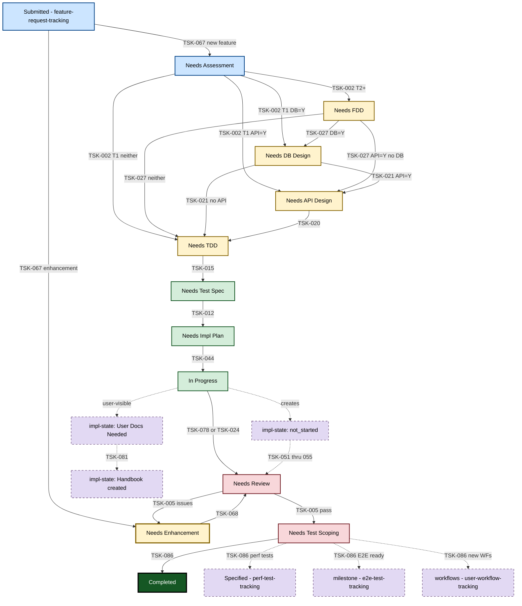
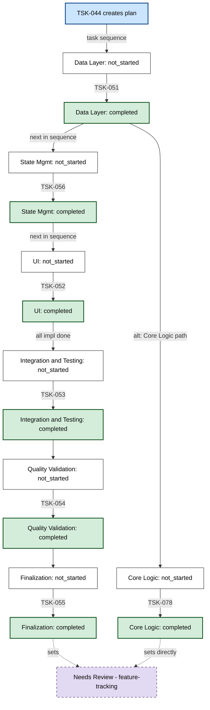
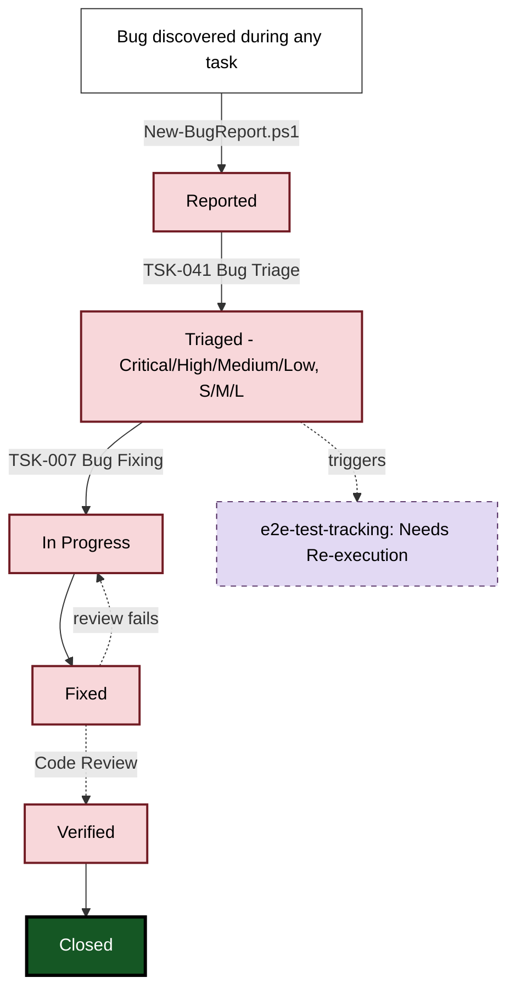
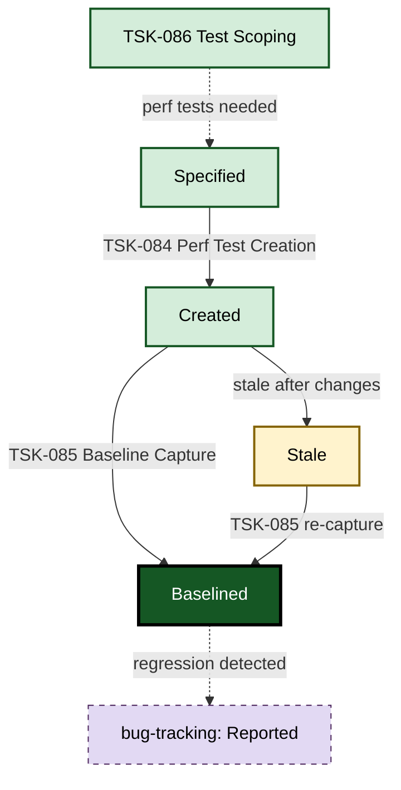
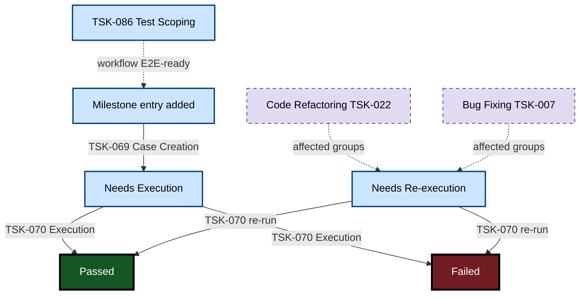
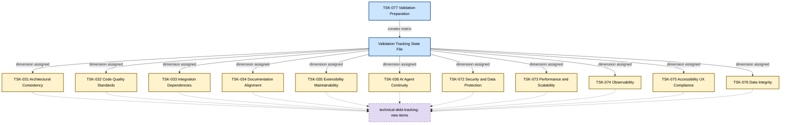
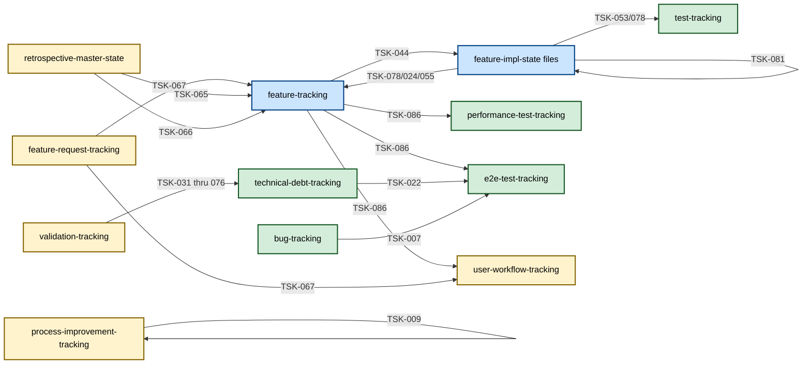

# Process Framework Task Registry

## Purpose

This document serves as the **comprehensive registry** of all process framework tasks, their automation scripts, and the files they update (both state tracking and other files). This registry provides complete visibility into:

- Which tasks have automation scripts vs. manual processes
- What files each task updates (state tracking, documentation, created artifacts)
- Where task outputs are stored
- Which tasks maintain this registry itself

## 🎯 Automation Status Summary

### ✅ Fully Automated Tasks (Script + State Updates)

- **FDD Creation Task** - Complete automation with feature tracking updates
- **TDD Creation Task** - Complete automation with feature tracking updates
- **System Architecture Review Task** - Complete automation with feature tracking and architecture tracking updates
- **Test Specification Creation Task** - Complete automation with feature tracking updates
- **API Design Task** - Complete automation with feature tracking updates and automatic API specification linking
- **Database Schema Design Task** - Complete automation with feature tracking updates and DB Design column linking
- **UI/UX Design Task** - Complete automation with feature tracking updates and UI Design column linking
- **Technical Debt Assessment Task** - Complete automation with technical debt tracking updates and bidirectional linking system
- **E2E Acceptance Test Execution Task** - Full pipeline automation for scripted tests (Setup → Execute → Verify → Update tracking)
- **New Task Creation Process** - Script updates four documentation files including task registry (IMP-283)

### 🔄 Semi-Automated Tasks (Script + Manual/Script Updates Required)

- **Feature Tier Assessment Task** - Requires running `Update-FeatureTrackingFromAssessment.ps1` after assessment creation
- **Integration & Testing Task** - Script creates files and initial state updates, requires manual completion status updates
- **Test Audit Task** - Manual audit judgment, automated state updates with intelligent feature-level aggregation
- **Bug Triage Task** - Manual bug evaluation with automated state updates via `Update-BugStatus.ps1`
- **Bug Fixing Task** - Manual bug resolution with automated status lifecycle management via `Update-BugStatus.ps1`
- **Feature Request Evaluation** - Manual classification with scripted state file creation (`Update-FeatureRequest.ps1`, `New-EnhancementState.ps1`)
- **Feature Enhancement** - Manual enhancement steps with automated finalization via `Finalize-Enhancement.ps1`
- **Feature Implementation Planning** - Manual planning with scripted plan/state file creation
- **E2E Acceptance Test Case Creation** - Script creates structure; test case content is manual
- **Project Initiation** - Human provides data; `New-TestInfrastructure.ps1` scaffolds infrastructure
- **Codebase Feature Discovery** - Manual analysis with scripted state file creation
- **Retrospective Documentation Creation** - Reuses existing design doc scripts; validation automated
- **Foundation Feature Implementation Task** - Manual foundational coding with comprehensive automated validation and bug discovery integration
- **Code Refactoring Task** - Manual refactoring with scripted planning (`New-RefactoringPlan.ps1`) and tech debt management
- **Core Logic Implementation Task** - Manual implementation with automated test tracking via `New-TestFile.ps1`
- **Validation Preparation** - Script creates tracking file with auto-populated features; manual dimension selection
- **Integration Narrative Creation** - Script creates narrative file with auto-assigned PD-INT ID; manual content customization
- **Process Improvement Task** - Script automates tracking updates, manual implementation
- **Framework Extension Task** - Script creates concept files, manual implementation
- **Data Layer Implementation Task** - Manual implementation with automated test tracking via `New-TestFile.ps1`
- **UI Implementation** - Manual UI implementation with automated test tracking via `New-TestFile.ps1`
- **State Management Implementation** - Manual state layer with automated test tracking via `New-TestFile.ps1`
- **Structure Change Task** - Script creates state tracking, manual implementation
- **Performance Baseline Capture** - Manual test execution with automated result recording via `performance_db.py`
- **Performance & E2E Test Scoping** - Manual decision matrix application; scripted tracking updates via `New-PerformanceTestEntry.ps1`, `New-WorkflowEntry.ps1`, `New-E2EMilestoneEntry.ps1`, `Update-BatchFeatureStatus.ps1`
- **Validation Dimension Tasks (V1-V11)** - Manual analysis; scripted report creation and tracking updates (11 tasks)

### 🔄 Partially Automated Tasks (Script for File Creation, Manual Analysis)

- **User Documentation Creation** - Script creates handbook files and automates finalization state updates
- **Tools Review Task** - Review summary creation automated, tool evaluation manual
- **Framework Evaluation Task** - Report creation automated via script, evaluation analysis manual
- **Codebase Feature Analysis** - Manual deep analysis with partial automation (test registration, master state coordination)

### 🔧 Manual Tasks (No Automation)

- **Code Review Task** - Manual code analysis with quality assurance and bug discovery integration
- **Release Deployment Task** - Manual deployment coordination with validation and bug discovery integration
- **Quality Validation** - Manual quality auditing across multiple dimensions
- **Implementation Finalization** - Manual deployment preparation and state file archival
- **Feature Discovery Task** - Manual business analysis and stakeholder input
- **Git Commit and Push** - Manual git CLI commands executed by AI agent
- **Performance Test Creation** - Manual performance test implementation and tracking updates
- **Framework Domain Adaptation** - Manual domain-specific terminology migration
- **Documentation Tier Adjustment Task** - Manual complexity re-evaluation

### 🚨 Critical Automation Gaps Identified

1. **Feature Tier Assessment**: Requires separate script execution for state updates
2. **Integration & Testing Task (PF-TSK-053)**: Requires manual status updates after test completion

## State File Update Frequency Analysis

### Critical Files (Updated by Multiple Tasks)

| State File                                                                                          | Update Count        | Automation Priority |
| --------------------------------------------------------------------------------------------------- | ------------------- | ------------------- |
| [Feature Tracking](../../doc/state-tracking/permanent/feature-tracking.md)                                 | 27+ tasks           | **CRITICAL**        |
| [Bug Tracking](../../doc/state-tracking/permanent/bug-tracking.md)                                         | 11+ tasks           | **HIGH**            |
| [Test Tracking](../../test/state-tracking/permanent/test-tracking.md)                                      | 8 tasks             | **HIGH**            |
| [Architecture Tracking](../../doc/state-tracking/permanent/architecture-tracking.md)                       | 4 tasks             | **HIGH**            |
| Feature Implementation State Files                                                                   | 10+ tasks           | **HIGH**            |
| [Technical Debt Tracking](../../doc/state-tracking/permanent/technical-debt-tracking.md)                   | 6+ tasks            | **HIGH**            |
| [Documentation Maps](../PF-documentation-map.md) (PF, PD, TE)                                         | 17+ tasks           | **MEDIUM**          |
| [User Workflow Tracking](../../doc/state-tracking/permanent/user-workflow-tracking.md)                     | 5 tasks             | **MEDIUM**          |
| [Process Improvement Tracking](../../process-framework-local/state-tracking/permanent/process-improvement-tracking.md) | 3+ tasks | **MEDIUM**          |
| [Validation Tracking](../../doc/state-tracking/validation/archive/validation-tracking-1.md)                | 12 tasks            | **MEDIUM**          |
| [E2E Test Tracking](../../test/state-tracking/permanent/e2e-test-tracking.md)                              | 2 tasks             | **MEDIUM**          |
| [Performance Test Tracking](../../test/state-tracking/permanent/performance-test-tracking.md)              | 2 tasks             | **MEDIUM**          |
| [Feature Request Tracking](../../doc/state-tracking/permanent/feature-request-tracking.md)                 | 1 task              | **LOW**             |

## Task Catalog

### **SETUP TASKS**

#### **S1. Project Initiation** ([PF-TSK-059](../tasks/00-setup/project-initiation-task.md))

**🔧 Process Type:** 🔄 **Semi-Automated** (Human provides project data; scripts scaffold infrastructure)

**📋 AUTOMATION DETAILS**

- **Script:** [`New-TestInfrastructure.ps1`](../scripts/file-creation/00-setup/New-TestInfrastructure.ps1)
- **Output Directory:** `doc/` (`project-config.json`), `languages-config`, `test/`
- **Auto-Update Function:** Scaffolds test directory structure, tracking files, and TE-id-registry from project-config.json

**📁 FILE OPERATIONS**
| Operation | File Path | Update Method | Details |
|-----------|-----------|---------------|---------|
| **Creates** | `doc/project-config.json` | Manual | Project configuration with name, language, paths, features list |
| **Creates** | `languages-config/{language}/{language}-config.json` | Manual | Language-specific command configurations for testing, linting, coverage |
| **Creates** | `test/` directory structure | `New-TestInfrastructure.ps1` | Test directories, tracking files, TE-id-registry.json |
| **Creates** | [`user-workflow-tracking.md`](../../doc/state-tracking/permanent/user-workflow-tracking.md) | Manual | User workflow to feature mapping |
| **Creates** | CI/CD infrastructure (optional) | Manual | Pipeline configs, pre-commit hooks, dev scripts |

**🎯 KEY IMPACTS**

- **Primary output:** Project configuration and test infrastructure scaffolding
- **Dependencies:** None — this is the starting point for new projects or framework adoption

**🔗 TRIGGER & OUTPUT** (Self-Doc: No)
- **Trigger:** _(user request)_
- **Output:** Creates `project-config.json`, test infra _(no tracking status)_

#### **S2. Codebase Feature Discovery** ([PF-TSK-064](../tasks/00-setup/codebase-feature-discovery.md))

**🔧 Process Type:** 🔧 **Manual with Script Support** (Human analyzes code; scripts create tracking structure)

**📋 AUTOMATION DETAILS**

- **Scripts:** [`New-RetrospectiveMasterState.ps1`](../scripts/file-creation/00-setup/New-RetrospectiveMasterState.ps1), [`New-FeatureImplementationState.ps1`](../scripts/file-creation/04-implementation/New-FeatureImplementationState.ps1), [`Validate-OnboardingCompleteness.ps1`](../scripts/validation/Validate-OnboardingCompleteness.ps1), [`New-SourceStructure.ps1`](../scripts/file-creation/00-setup/New-SourceStructure.ps1)
- **Output Directory:** `doc/state-tracking/features/`, `process-framework-local/state-tracking/temporary`, `{source_root}/`
- **Auto-Update Function:** Scripts create state files and source directory structure; feature tracking requires manual updates

**📁 FILE OPERATIONS**
| Operation | File Path | Update Method | Details |
|-----------|-----------|---------------|---------|
| **Creates** | Retrospective Master State File | `New-RetrospectiveMasterState.ps1` | Tracks 3-phase retrospective onboarding progress |
| **Creates** | Feature Implementation State Files (multiple) | `New-FeatureImplementationState.ps1` | One per discovered feature in `doc/state-tracking/features/` |
| **Creates** | Source directory structure | `New-SourceStructure.ps1 -Scaffold` | Source root, shared/, feature directories, source-code-layout.md updates |
| **Creates** | Tier Assessment Artifacts (ART-ASS-XXX) | `New-Assessment.ps1` | One per discovered feature |
| **Updates** | [`feature-tracking.md`](../../doc/state-tracking/permanent/feature-tracking.md) | Manual | Add discovered features with initial status |
| **Updates** | [`user-workflow-tracking.md`](../../doc/state-tracking/permanent/user-workflow-tracking.md) | Manual | Map features to user workflows |

**🎯 KEY IMPACTS**

- **Primary state file:** [`feature-tracking.md`](../../doc/state-tracking/permanent/feature-tracking.md) - Populates feature inventory from existing codebase
- **Dependencies:** Requires Project Initiation (PF-TSK-059) or existing project-config.json

**🔗 TRIGGER & OUTPUT** (Self-Doc: Partial)
- **Trigger:** _(user request)_ / `retrospective-master-state.md` → Phase = `DISCOVERY`
- **Output:** `retrospective-master-state.md` → Phase 1 = `100%`; `feature-tracking.md` → `⬜ Needs Assessment`; `user-workflow-tracking.md` → created

#### **S3. Codebase Feature Analysis** ([PF-TSK-065](../tasks/00-setup/codebase-feature-analysis.md))

**🔧 Process Type:** 🔧 **Manual with Partial Automation** (Deep analysis is manual; test registration partially automated)

**📋 AUTOMATION DETAILS**

- **Scripts:** [`test_query.py`](../scripts/test/test_query.py), [`New-TestFile.ps1`](../scripts/file-creation/03-testing/New-TestFile.ps1), [`Update-RetrospectiveMasterState.ps1`](../scripts/update/Update-RetrospectiveMasterState.ps1), [`Update-TechDebt.ps1`](../scripts/update/Update-TechDebt.ps1)
- **Output Directory:** Feature state files in `doc/state-tracking/features/`
- **Auto-Update Function:** Test file registration automated; master state coordination via script; tech debt registration via script; analysis is manual

**📁 FILE OPERATIONS**
| Operation | File Path | Update Method | Details |
|-----------|-----------|---------------|---------|
| **Updates** | Feature Implementation State Files | Manual | Enriched with design decisions, dependencies, test coverage analysis |
| **Updates** | [`test-tracking.md`](../../test/state-tracking/permanent/test-tracking.md) | `New-TestFile.ps1` | Register existing test files with pytest markers (finalization session) |
| **Updates** | [`feature-tracking.md`](../../doc/state-tracking/permanent/feature-tracking.md) | Manual | Update Test Status column and Quality column (As-Built / Target-State) (finalization session) |
| **Updates** | Retrospective Master State File | `Update-RetrospectiveMasterState.ps1` | Claim/complete features, recalculate Progress Overview counters |
| **Updates** | [`user-workflow-tracking.md`](../../doc/state-tracking/permanent/user-workflow-tracking.md) | Manual | Workflow definitions updated (finalization session) |
| **Updates** | [`technical-debt-tracking.md`](../../doc/state-tracking/permanent/technical-debt-tracking.md) | `Update-TechDebt.ps1 -Add` | Debt items from feature state files registered in central registry (finalization session) |

**🎯 KEY IMPACTS**

- **Primary state file:** Feature Implementation State Files - Enriched with implementation analysis
- **Secondary coordination:** [`test-tracking.md`](../../test/state-tracking/permanent/test-tracking.md) - Existing tests registered
- **Dependencies:** Requires Codebase Feature Discovery (PF-TSK-064)

**🔗 TRIGGER & OUTPUT** (Self-Doc: Yes)
- **Trigger:** `retrospective-master-state.md` → Phase 1 = `100%`
- **Output:** `retrospective-master-state.md` → Phase 2 = `100%`

#### **S4. Retrospective Documentation Creation** ([PF-TSK-066](../tasks/00-setup/retrospective-documentation-creation.md))

**🔧 Process Type:** 🔄 **Semi-Automated** (Uses existing design doc scripts; validation automated)

**📋 AUTOMATION DETAILS**

- **Scripts:** Reuses design task scripts (`New-FDD.ps1`, `New-TDD.ps1`, `New-TestSpecification.ps1`, `New-ArchitectureDecision.ps1`, etc.)
- **Validation Script:** [`Validate-StateTracking.ps1`](../scripts/validation/Validate-StateTracking.ps1)
- **Output Directory:** Various (`doc/functional-design/fdds/`, `doc/technical/tdd/`, `doc/technical/adr/`, `test/specifications/`)

**📁 FILE OPERATIONS**
| Operation | File Path | Update Method | Details |
|-----------|-----------|---------------|---------|
| **Creates** | FDDs, TDDs, ADRs, Test Specifications | Existing design scripts | Tier-appropriate design documents for each discovered feature |
| **Creates** | Quality Assessment Reports (PD-QAR-XXX) | `New-QualityAssessmentReport.ps1` | For Target-State features |
| **Creates** | Tech Debt Items (PD-TDI-XXX) | `Update-TechDebt.ps1 -Add` | For Target-State feature gaps |
| **Creates** | Process Improvement Entries (PF-IMP-XXX) | `New-ProcessImprovement.ps1` | Framework improvement observations |
| **Updates** | [`feature-tracking.md`](../../doc/state-tracking/permanent/feature-tracking.md) | Design scripts | Tier assignments, document links, status progression |
| **Updates** | [`PF-documentation-map.md`](../PF-documentation-map.md) | Design scripts | New PF documents registered |
| **Updates** | [`PD-documentation-map.md`](../../doc/PD-documentation-map.md) | Design scripts | New PD documents registered |
| **Updates** | [`TE-documentation-map.md`](../../test/TE-documentation-map.md) | Manual | Test specs and audit reports registered |
| **Updates** | [`test-tracking.md`](../../test/state-tracking/permanent/test-tracking.md) | `New-TestFile.ps1` | Migrated test files registered |
| **Updates** | [`process-improvement-tracking.md`](../../process-framework-local/state-tracking/permanent/process-improvement-tracking.md) | `New-ProcessImprovement.ps1` | Improvement entries from observations |
| **Updates** | Retrospective Master State File | Manual | Archive upon completion |

**🎯 KEY IMPACTS**

- **Primary state file:** [`feature-tracking.md`](../../doc/state-tracking/permanent/feature-tracking.md) - Completes retrospective documentation workflow
- **Dependencies:** Requires Codebase Feature Analysis (PF-TSK-065)

**🔗 TRIGGER & OUTPUT** (Self-Doc: Yes)
- **Trigger:** `retrospective-master-state.md` → Phase 2 = `100%`
- **Output:** `feature-tracking.md` → FDD/TDD/ADR columns populated; `test-tracking.md` → test files registered (TE-TST-XXX)

### **DISCRETE TASKS**

#### **1. Feature Tier Assessment Task** ([PF-TSK-002](../tasks/01-planning/feature-tier-assessment-task.md))

**🔧 Process Type:** 🔄 **Semi-Automated** (Script creates files, requires update script execution)

**📋 AUTOMATION DETAILS**

- **Script:** [`New-Assessment.ps1`](../scripts/file-creation/01-planning/New-Assessment.ps1)
- **Output Directory:** [`assessments/`](../../doc/documentation-tiers/assessments)
- **Auto-Update Function:** **REQUIRES** running [`Update-FeatureTrackingFromAssessment.ps1`](../scripts/update/Update-FeatureTrackingFromAssessment.ps1)

**📁 FILE OPERATIONS**
| Operation | File Path | Update Method | Details |
|-----------|-----------|---------------|---------|
| **Creates** | `[ART-ASS-XXX]-[FeatureId]-[feature-name].md` | `New-Assessment.ps1` | Assessment document with tier analysis |
| **Creates** | Feature Implementation State File | `New-FeatureImplementationState.ps1` | State tracking file for the assessed feature |
| **Updates** | [`feature-tracking.md`](../../doc/state-tracking/permanent/feature-tracking.md) | `Update-FeatureTrackingFromAssessment.ps1` | Status: "⬜ Needs Assessment" → "📋 Needs FDD" (T2+) / "📝 Needs TDD" (T1)<br/>• Add tier emoji (🔵/🟠/🔴)<br/>• Set API Design: "Yes"/"No"<br/>• Set DB Design: "Yes"/"No"<br/>• Link to assessment document<br/>**⚠️ MUST run update script after assessment creation** |

**🎯 KEY IMPACTS**

- **Primary state file:** [`feature-tracking.md`](../../doc/state-tracking/permanent/feature-tracking.md) - Initiates feature documentation workflow
- **Dependencies:** Requires feature discovery completion

**🔗 TRIGGER & OUTPUT** (Self-Doc: Yes)
- **Trigger:** `feature-tracking.md` → `⬜ Needs Assessment`
- **Output:** `feature-tracking.md` → `📋 Needs FDD` (T2+) / next design status (T1: `🗄️`/`🔌`/`📝` based on DB/API columns) + tier emoji + API/DB/UI Design = `Yes`/`No`

#### **2. FDD Creation Task** ([PF-TSK-027](../tasks/02-design/fdd-creation-task.md))

**🔧 Process Type:** 🤖 **Fully Automated** (Script creates files AND updates state)

**📋 AUTOMATION DETAILS**

- **Script:** [`New-FDD.ps1`](../scripts/file-creation/02-design/New-FDD.ps1)
- **Output Directory:** [`fdds/`](../../doc/functional-design/fdds)
- **Auto-Update Function:** Built-in automated feature tracking updates

**📁 FILE OPERATIONS**
| Operation | File Path | Update Method | Details |
|-----------|-----------|---------------|---------|
| **Creates** | `fdd-[feature-id]-[feature-name].md` | `New-FDD.ps1` | Functional design document with requirements and specifications |
| **Updates** | [`feature-tracking.md`](../../doc/state-tracking/permanent/feature-tracking.md) | `New-FDD.ps1` | Status: "📋 Needs FDD" → "📝 Needs TDD"<br/>• Add FDD document link in FDD column<br/>• Add FDD creation date to Notes |

**🎯 KEY IMPACTS**

- **Primary state file:** [`feature-tracking.md`](../../doc/state-tracking/permanent/feature-tracking.md) - Advances feature documentation workflow
- **Dependencies:** Requires Feature Tier Assessment (Tier 2+ features only)

**🔗 TRIGGER & OUTPUT** (Self-Doc: Yes)
- **Trigger:** `feature-tracking.md` → `📋 Needs FDD`
- **Output:** `feature-tracking.md` → next design status (`🗄️`/`🔌`/`📝` based on DB/API columns) + FDD link

#### **3. TDD Creation Task** ([PF-TSK-015](../tasks/02-design/tdd-creation-task.md))

**🔧 Process Type:** 🤖 **Fully Automated** (Script creates files AND updates state)

**📋 AUTOMATION DETAILS**

- **Script:** [`New-TDD.ps1`](../scripts/file-creation/02-design/New-TDD.ps1)
- **Output Directory:** [`tdd/`](../../doc/technical/tdd)
- **Auto-Update Function:** Built-in automated feature tracking updates

**📁 FILE OPERATIONS**
| Operation | File Path | Update Method | Details |
|-----------|-----------|---------------|---------|
| **Creates** | `tdd-[FeatureId]-[feature-name]-t[Tier].md` | `New-TDD.ps1` | Technical design document with architecture and implementation details |
| **Updates** | [`feature-tracking.md`](../../doc/state-tracking/permanent/feature-tracking.md) | `New-TDD.ps1` | Status: "📝 Needs TDD" → "🧪 Needs Test Spec"<br/>• Add TDD link in Tech Design column |

**🎯 KEY IMPACTS**

- **Primary state file:** [`feature-tracking.md`](../../doc/state-tracking/permanent/feature-tracking.md) - Completes technical design phase
- **Dependencies:** Requires Feature Tier Assessment, optionally FDD Creation (Tier 2+)

**🔗 TRIGGER & OUTPUT** (Self-Doc: Yes)
- **Trigger:** `feature-tracking.md` → `📝 Needs TDD`
- **Output:** `feature-tracking.md` → `🧪 Needs Test Spec` + TDD link

#### **4. Test Specification Creation Task** ([PF-TSK-012](../tasks/03-testing/test-specification-creation-task.md))

**🔧 Process Type:** 🤖 **Fully Automated** (Script creates files AND updates state)

**📋 AUTOMATION DETAILS**

- **Script:** [`New-TestSpecification.ps1`](../scripts/file-creation/03-testing/New-TestSpecification.ps1)
- **Output Directory:** [`feature-specs/`](../../test/specifications/feature-specs)
- **Auto-Update Function:** Built-in automated feature tracking updates via `Update-DocumentTrackingFiles`

**📁 FILE OPERATIONS**
| Operation | File Path | Update Method | Details |
|-----------|-----------|---------------|---------|
| **Creates** | `test-spec-[FeatureId]-[FeatureName].md` | `New-TestSpecification.ps1` | Comprehensive test specification document |
| **Updates** | [`feature-tracking.md`](../../doc/state-tracking/permanent/feature-tracking.md) | `New-TestSpecification.ps1` | Status: "🧪 Needs Test Spec" → "🔧 Needs Impl Plan"<br/>• Add Test Spec link in Test Spec column<br/>• Add specification creation date to Notes |
| **Updates** | [`TE-id-registry.json`](../../test/TE-id-registry.json) | `New-TestSpecification.ps1` | Update TE-TSP nextAvailable counter |
| **Updates** | [`TE-documentation-map.md`](../../test/TE-documentation-map.md) | `New-TestSpecification.ps1` | Add new test spec entry |
| **Updates** | [`test-tracking.md`](../../test/state-tracking/permanent/test-tracking.md) | Manual | Add feature section if missing |

**🎯 KEY IMPACTS**

- **Primary state file:** [`feature-tracking.md`](../../doc/state-tracking/permanent/feature-tracking.md) - Updates feature test status
- **Dependencies:** Requires System Architecture Review completion

**🔗 TRIGGER & OUTPUT** (Self-Doc: Yes)
- **Trigger:** `feature-tracking.md` → `🧪 Needs Test Spec`
- **Output:** `feature-tracking.md` → `🔧 Needs Impl Plan`

#### **5. Integration & Testing Task** ([PF-TSK-053](../tasks/04-implementation/integration-and-testing.md))

**🔧 Process Type:** 🔄 **Semi-Automated** (Script creates files and initial state updates, manual completion required)

**📋 AUTOMATION DETAILS**

- **Script:** [`New-TestFile.ps1`](../scripts/file-creation/03-testing/New-TestFile.ps1)
- **Output Directory:** [`test/`](../../test) (various subdirectories)
- **Auto-Update Function:** Built-in automated initial state tracking via `Update-TestImplementationStatus`
- **Validation Script:** [`Validate-TestTracking.ps1`](../scripts/validation/Validate-TestTracking.ps1)
- **Manual Updates Required:** Test completion status, test case counts after implementation

**📁 FILE OPERATIONS**
| Operation | File Path | Update Method | Details |
|-----------|-----------|---------------|---------|
| **Creates** | Test files (multiple) | `New-TestFile.ps1` | Test files in appropriate test directories with pytest markers (feature, priority, test_type) |
| **Updates** | [`bug-tracking.md`](../../doc/state-tracking/permanent/bug-tracking.md) (if bugs discovered) | [`New-BugReport.ps1`](../scripts/file-creation/06-maintenance/New-BugReport.ps1)| Add newly discovered bugs with 🆕 Needs Triage status for triage |
| **Updates** | [`test-tracking.md`](../../test/state-tracking/permanent/test-tracking.md) | `New-TestFile.ps1` | Status: "📝 Needs Implementation" → "🟡 Implementation In Progress"<br/>• Add test file links with correct relative paths<br/>• Use filename as display name<br/>• Update test cases count, last updated date, notes |
| **Updates** | [`feature-tracking.md`](../../doc/state-tracking/permanent/feature-tracking.md) | `New-TestFile.ps1` | Update Test Status based on implementation progress<br/>• Automatic status mapping from test implementation to feature tracking<br/>• Coordinate status across multiple state files |
| **Updates** | Feature Implementation State File (if applicable) | Manual | Test implementation details, coverage metrics, and testing notes |

**🎯 KEY IMPACTS**

- **Primary state file:** [`test-tracking.md`](../../test/state-tracking/permanent/test-tracking.md) - Tracks implementation progress with clickable file links
- **Secondary coordination:** [`feature-tracking.md`](../../doc/state-tracking/permanent/feature-tracking.md) - Updates feature test status
- **Pytest markers:** Written into test files as single source of truth (query via `test_query.py`)
- **Bug discovery integration:** Includes systematic bug identification during test development with standardized reporting via `New-BugReport.ps1`
- **Manual completion required:** Status updates from 🟡 Implementation In Progress to 🔄 Needs Audit, test case counts
- **Dependencies:** Requires feature implementation completion; Test Specification (if exists) provides test blueprint

**🔗 TRIGGER & OUTPUT** (Self-Doc: Partial)
- **Trigger:** Feature impl state file → all impl tasks = `completed`
- **Output:** `test-tracking.md` → `✅ Audit Approved`; Feature impl state file → task = `completed`

#### **6. Test Audit Task** ([PF-TSK-030](../tasks/03-testing/test-audit-task.md))

**🔧 Process Type:** 🔄 **Semi-Automated** (Manual audit judgment, automated state updates)

**📋 AUTOMATION DETAILS**

- **Report Script:** [`New-TestAuditReport.ps1`](../scripts/file-creation/03-testing/New-TestAuditReport.ps1) — supports `-TestType` (Automated/Performance/E2E) for template and tracking file routing
- **Tracking Script:** [`New-AuditTracking.ps1`](../scripts/file-creation/03-testing/New-AuditTracking.ps1) — multi-session scoping with auto-populated inventory; supports `-TestType` for source routing
- **State Update Script:** [`Update-TestFileAuditState.ps1`](../scripts/update/Update-TestFileAuditState.ps1) — supports `-TestType` for multi-tracking-file updates
- **Output Directories:** [`test/audits/`](../../test/audits) (Automated), [`test/audits/performance/`](../../test/audits/performance) (Performance), [`test/audits/e2e/`](../../test/audits/e2e) (E2E)
- **Auto-Update Function:** **FULLY AUTOMATED** state file updates with intelligent aggregation (Automated type); direct Audit Status/Report column updates (Performance/E2E types)

**📁 FILE OPERATIONS**
| Operation | File Path | Update Method | Details |
|-----------|-----------|---------------|---------|
| **Creates** | `[TE-TAR-XXX]-[feature-id]-[test-file-id].md` | `New-TestAuditReport.ps1` | Test audit report with quality assessment and recommendations |
| **Updates** | [`test-tracking.md`](../../test/state-tracking/permanent/test-tracking.md) | `New-TestAuditReport.ps1` | (Automated type) Appends audit report link in Notes column for the target test file |
| **Updates** | [`performance-test-tracking.md`](../../test/state-tracking/permanent/performance-test-tracking.md) | `New-TestAuditReport.ps1` | (Performance type) Updates Audit Status + Audit Report columns |
| **Updates** | [`e2e-test-tracking.md`](../../test/state-tracking/permanent/e2e-test-tracking.md) | `New-TestAuditReport.ps1` | (E2E type) Updates Audit Status + Audit Report columns |
| **Updates** | [`bug-tracking.md`](../../doc/state-tracking/permanent/bug-tracking.md) (if bugs discovered) | [`New-BugReport.ps1`](../scripts/file-creation/06-maintenance/New-BugReport.ps1)| Add newly discovered bugs with 🆕 Needs Triage status for triage |
| **Updates** | [`test-tracking.md`](../../test/state-tracking/permanent/test-tracking.md) | `Update-TestFileAuditState.ps1` | (Automated type) **AUTOMATED**: Update individual test file audit status with comprehensive details |
| **Updates** | [`performance-test-tracking.md`](../../test/state-tracking/permanent/performance-test-tracking.md) | `Update-TestFileAuditState.ps1` | (Performance type) Updates Audit Status + Audit Report columns directly |
| **Updates** | [`e2e-test-tracking.md`](../../test/state-tracking/permanent/e2e-test-tracking.md) | `Update-TestFileAuditState.ps1` | (E2E type) Updates Audit Status + Audit Report columns directly |
| **Updates** | [`feature-tracking.md`](../../doc/state-tracking/permanent/feature-tracking.md) | `Update-TestFileAuditState.ps1` | (Automated type) **AUTOMATED**: Intelligent aggregated test status calculation |
| **Updates** | [`technical-debt-tracking.md`](../../doc/state-tracking/permanent/technical-debt-tracking.md) | `Update-TechDebt.ps1 -Add` (conditional) | Register significant test quality findings as tech debt items |

**🎯 KEY IMPACTS**

- **Primary state files:** [`test-tracking.md`](../../test/state-tracking/permanent/test-tracking.md) (Automated), [`performance-test-tracking.md`](../../test/state-tracking/permanent/performance-test-tracking.md) (Performance), [`e2e-test-tracking.md`](../../test/state-tracking/permanent/e2e-test-tracking.md) (E2E)
- **Intelligent aggregation:** [`feature-tracking.md`](../../doc/state-tracking/permanent/feature-tracking.md) - Automated feature-level test status (Automated type only)
- **Audit gate:** `✅ Audit Approved` status is a hard prerequisite for Performance Baseline Capture (PF-TSK-085) and E2E Test Execution (PF-TSK-070) for newly created tests
- **Quality assurance:** Type-specific criteria — 6 criteria (Automated), 4 criteria (Performance), 5 criteria (E2E)
- **Bug discovery integration:** Includes comprehensive bug identification during audit process with standardized reporting via `New-BugReport.ps1`
- **Dependencies:** Requires test implementation/creation completion for the relevant test type

**🔗 TRIGGER & OUTPUT** (Self-Doc: Partial)
- **Trigger:** `test-tracking.md` → `✅ Audit Approved` + no audit
- **Output:** `test-tracking.md` → audit status + report link; `bug-tracking.md` → `🆕 Needs Triage` (if bugs found)

#### **7. Feature Implementation Task** (PF-TSK-004) — ⚠️ DEPRECATED

> **DEPRECATED**: PF-TSK-004 has been replaced by the decomposed implementation tasks (PF-TSK-044, PF-TSK-051, PF-TSK-052, PF-TSK-053, PF-TSK-054, PF-TSK-055, PF-TSK-056). For new feature implementation, start with [Feature Implementation Planning (PF-TSK-044)](../tasks/04-implementation/feature-implementation-planning-task.md). For enhancements to existing features, use [Feature Request Evaluation (PF-TSK-067)](../tasks/01-planning/feature-request-evaluation.md) → [Feature Enhancement (PF-TSK-068)](../tasks/04-implementation/feature-enhancement.md).

**🔧 Process Type:** 🔄 **Semi-Automated** (Manual implementation with automated quality validation)

**📋 AUTOMATION DETAILS**

- **Implementation Script:** No automation script (manual coding)
- **Validation Scripts:**
  - [`Quick-ValidationCheck.ps1`](../scripts/validation/Quick-ValidationCheck.ps1) - Fast health check
  - [`Run-FoundationalValidation.ps1`](../scripts/validation/Run-FoundationalValidation.ps1) - Code quality validation for selected features
- **Output Directory:** `scripts/validation/validation-reports/`
- **Auto-Update Function:** Automated quality validation reporting

**📁 FILE OPERATIONS**
| Operation | File Path | Update Method | Details |
|-----------|-----------|---------------|---------|
| **Creates** | Validation reports | [`Quick-ValidationCheck.ps1`](../scripts/validation/Quick-ValidationCheck.ps1) | Quick health check reports (console/JSON/CSV output) |
| **Creates** | Quality validation reports | [`Run-FoundationalValidation.ps1`](../scripts/validation/Run-FoundationalValidation.ps1) | Code quality validation reports for selected features |
| **Creates** | `[api-name]-docs.md` (API features only) | Manual | API Consumer Documentation with usage examples and integration guidance |
| **Updates** | [`bug-tracking.md`](../../doc/state-tracking/permanent/bug-tracking.md) (if bugs discovered) | [`New-BugReport.ps1`](../scripts/file-creation/06-maintenance/New-BugReport.ps1)| Add newly discovered bugs with 🆕 Needs Triage status for triage |
| **Updates** | [`feature-tracking.md`](../../doc/state-tracking/permanent/feature-tracking.md) | Manual | Update implementation status (🟡 In Progress/🔄 Needs Enhancement/🟢 Completed)<br/>• Add implementation start and completion dates<br/>• Link to relevant pull request or commit<br/>• **API Design column**: Manually add consumer documentation link for API features<br/>• Document design deviations with justification |
| **Updates** | [`test-tracking.md`](../../test/state-tracking/permanent/test-tracking.md) | Manual | Update test implementation status during development<br/>• Change status based on implementation progress |

**🎯 KEY IMPACTS**

- **Primary state file:** [`feature-tracking.md`](../../doc/state-tracking/permanent/feature-tracking.md) - Core feature development tracking
- **Quality validation:** Automated validation ensures implementation meets quality standards
- **API consumer documentation:** Creates post-implementation consumer documentation for API features with working examples
- **Architecture impact:** Updates component relationships and dependencies
- **Bug discovery integration:** Includes systematic bug identification during Quality Assurance phase with standardized reporting via `New-BugReport.ps1`
- **Dependencies:** Requires Test Audit approval, completed design documents
- **⚠️ Automation Enhancement:** Now includes automated quality validation with reporting

**🔗 TRIGGER & OUTPUT** — ⚠️ DEPRECATED (see decomposed tasks 7a–26)

#### **7a. Data Layer Implementation Task** ([PF-TSK-051](../tasks/04-implementation/data-layer-implementation.md))

**🔧 Process Type:** 🔄 **Semi-Automated** (Manual implementation with automated test tracking via `New-TestFile.ps1`)

**📋 AUTOMATION DETAILS**

- **Script:** None (manual implementation)
- **Test File Creation:** [`New-TestFile.ps1`](../scripts/file-creation/03-testing/New-TestFile.ps1) - Creates tracked test files
- **Output Directory:** `/lib/data/models/[feature]/`, `/lib/data/repositories/[feature]/`, `/test/unit/data/[feature]/`
- **Auto-Update Function:** `New-TestFile.ps1` auto-updates test-tracking.md and feature-tracking.md

**📁 FILE OPERATIONS**
| Operation | File Path | Update Method | Details |
|-----------|-----------|---------------|---------|
| **Creates** | Data model classes | Manual | Model classes in source data directory with serialization, validation |
| **Creates** | Repository interface | Manual | Repository contract in source repositories directory |
| **Creates** | Repository implementation | Manual | Concrete repository implementation |
| **Creates** | Unit tests | `New-TestFile.ps1` | Test files in `/test/unit/data/[feature]/` for models and repositories |
| **Executes** | Database migrations | Manual | Run database migration scripts to create database schema |
| **Updates** | [Feature Implementation State File](../state-tracking/permanent/feature-[feature-id]-implementation.md) | Manual | Update task sequence tracking, code inventory, implementation notes, issues log |
| **Updates** | [`test-tracking.md`](../../test/state-tracking/permanent/test-tracking.md) | `New-TestFile.ps1` (auto) | Automated test file registration |
| **Updates** | [`feature-tracking.md`](../../doc/state-tracking/permanent/feature-tracking.md) | `New-TestFile.ps1` (auto) | Automated test status update |

**🎯 KEY IMPACTS**

- **Primary state file:** Feature Implementation State File - Tracks data layer implementation progress within multi-task feature workflow
- **Code artifacts:** Creates foundational data access layer for feature (models, repositories, database integration)
- **Dependencies:** Provides data access interfaces for state management layer
- **Prerequisites:** Feature Implementation Planning Task (PF-TSK-044), Database Schema Design completed, migrations prepared

**🔗 TRIGGER & OUTPUT** (Self-Doc: Partial)
- **Trigger:** `feature-tracking.md` + Feature impl state file → `🟡 In Progress` + task = `not_started` in sequence
- **Output:** Feature impl state file → task = `completed`

#### **7b. Core Logic Implementation Task** ([PF-TSK-078](../tasks/04-implementation/core-logic-implementation.md))

**🔧 Process Type:** 🔄 **Semi-Automated** (Manual implementation with automated test tracking)

**📋 AUTOMATION DETAILS**

- **Script:** None (manual implementation)
- **Test File Creation:** [`New-TestFile.ps1`](../scripts/file-creation/03-testing/New-TestFile.ps1) - Creates tracked unit test files with pytest markers
- **Bug Reporting:** [`New-BugReport.ps1`](../scripts/file-creation/06-maintenance/New-BugReport.ps1) - Documents bugs discovered during implementation
- **Output Directory:** Project source directories (feature-dependent)

**📁 FILE OPERATIONS**
| Operation | File Path | Update Method | Details |
|-----------|-----------|---------------|---------|
| **Creates** | Source modules | Manual | Core business logic modules in project source directory |
| **Creates** | Integration wiring | Manual | CLI commands, service registrations, event hooks |
| **Creates** | Unit tests | `New-TestFile.ps1` | Tracked test files with pytest markers in project test directory |
| **Creates** | Bug reports (if applicable) | `New-BugReport.ps1` | Bug reports for issues not fixed in this session |
| **Updates** | [Feature Implementation State Files](../../doc/state-tracking/features) | Manual | Code inventory, task sequence, implementation notes, issues log |
| **Updates** | [Feature Tracking](../../doc/state-tracking/permanent/feature-tracking.md) | Manual | Status → 👀 Needs Review |
| **Updates** | [Test Tracking](../../test/state-tracking/permanent/test-tracking.md) | `New-TestFile.ps1` | Automated test file links and status |
| **Updates** | [Bug Tracking](../../doc/state-tracking/permanent/bug-tracking.md) | Manual | Bug entries if bugs discovered (optional) |
| **Updates** | Product documentation (TDD, integration narrative) | Manual | Cross-TDD check and Cross-integration-narrative check (Step 12) — verify other features' docs still accurately describe modified files |

**🎯 KEY IMPACTS**

- **Primary state file:** Feature Implementation State File - Tracks core logic implementation progress within multi-task feature workflow
- **Code artifacts:** Creates core business logic modules, integration wiring, and tracked unit tests
- **Dependencies:** May depend on Data Layer Implementation (PF-TSK-051) for data access
- **Prerequisites:** Feature Implementation Planning (PF-TSK-044), design documentation (TDD/FDD if Tier 2+)

**🔗 TRIGGER & OUTPUT** (Self-Doc: Partial)
- **Trigger:** `feature-tracking.md` + Feature impl state file → `🟡 In Progress` + task = `not_started` in sequence
- **Output:** `feature-tracking.md` → `👀 Needs Review`; Feature impl state file → task = `completed`; Feature impl state file → User Documentation = `❌ Needed` (if user-visible)

#### **8. Foundation Feature Implementation Task** ([PF-TSK-024](../tasks/04-implementation/foundation-feature-implementation-task.md))

**🔧 Process Type:** 🔄 **Semi-Automated** (Manual implementation with automated validation)

**📋 AUTOMATION DETAILS**

- **Implementation Script:** No automation script (manual coding)
- **Validation Scripts:**
  - [`Quick-ValidationCheck.ps1`](../scripts/validation/Quick-ValidationCheck.ps1) - Fast health check
  - [`Run-FoundationalValidation.ps1`](../scripts/validation/Run-FoundationalValidation.ps1) - Comprehensive validation
- **Output Directory:** `scripts/validation/validation-reports/`
- **Auto-Update Function:** Automated validation reporting and tracking updates

**📁 FILE OPERATIONS**
| Operation | File Path | Update Method | Details |
|-----------|-----------|---------------|---------|
| **Creates** | Validation reports | [`Quick-ValidationCheck.ps1`](../scripts/validation/Quick-ValidationCheck.ps1) | Quick health check reports (console/JSON/CSV output) |
| **Creates** | Comprehensive validation reports | [`Run-FoundationalValidation.ps1`](../scripts/validation/Run-FoundationalValidation.ps1) | Detailed validation reports in `scripts/validation/validation-reports/` |
| **Updates** | [`validation-tracking.md`](../../doc/state-tracking/validation/archive/validation-tracking-1.md) | [`Run-FoundationalValidation.ps1`](../scripts/validation/Run-FoundationalValidation.ps1) | Update validation matrix with report creation dates and links |
| **Updates** | [`bug-tracking.md`](../../doc/state-tracking/permanent/bug-tracking.md) (if bugs discovered) | [`New-BugReport.ps1`](../scripts/file-creation/06-maintenance/New-BugReport.ps1)| Add newly discovered bugs with 🆕 Needs Triage status for triage |
| **Updates** | [`architecture-tracking.md`](../../doc/state-tracking/permanent/architecture-tracking.md) | Manual | Record foundation implementation and architectural evolution<br/>• Update component status and key decisions |
| **Updates** | [`feature-tracking.md`](../../doc/state-tracking/permanent/feature-tracking.md) | Manual | Update with foundation feature completion status |
| **Updates** | [`test-tracking.md`](../../test/state-tracking/permanent/test-tracking.md) | `New-TestFile.ps1` (auto) | Automated test registration when creating test files |

**🎯 KEY IMPACTS**

- **Primary state file:** [`architecture-tracking.md`](../../doc/state-tracking/permanent/architecture-tracking.md) - Tracks foundational architectural changes
- **Secondary coordination:** [`feature-tracking.md`](../../doc/state-tracking/permanent/feature-tracking.md) - Updates feature completion status
- **Validation integration:** Automated feature validation ensures implementation meets architectural standards
- **Quality assurance:** Comprehensive validation across all 6 validation types (Architectural, Code Quality, Integration, Documentation, Extensibility, AI Agent Continuity)
- **Architecture foundation:** Establishes core architectural components and patterns
- **Bug discovery integration:** Includes systematic bug identification during Finalization phase for architectural and foundation issues with standardized reporting via `New-BugReport.ps1`
- **Dependencies:** Requires architectural design decisions and planning
- **⚠️ Automation Enhancement:** Now includes automated validation with comprehensive reporting

**🔗 TRIGGER & OUTPUT** (Self-Doc: Partial)
- **Trigger:** `feature-tracking.md` + Feature impl state file → Feature ID = `0.x.x` + task = `not_started` in sequence
- **Output:** `feature-tracking.md` → `👀 Needs Review`; Feature impl state file → task = `completed`

#### **9. API Design Task** ([PF-TSK-020](../tasks/02-design/api-design-task.md))

**🔧 Process Type:** 🤖 **Fully Automated** (Script creates files AND updates state)

**📋 AUTOMATION DETAILS**

- **Script:** [`New-APISpecification.ps1`](../scripts/file-creation/02-design/New-APISpecification.ps1)
- **Additional Script:** [`New-APIDataModel.ps1`](../scripts/file-creation/02-design/New-APIDataModel.ps1)
- **Output Directory:** [`specifications/`](../../doc/technical/api/specifications/specifications) + [`models/`](../../doc/technical/api/models)
- **Auto-Update Function:** Built-in automated feature tracking updates with intelligent replacement/append logic

**📁 FILE OPERATIONS**
| Operation | File Path | Update Method | Details |
|-----------|-----------|---------------|---------|
| **Creates** | `[api-name].md` | `New-APISpecification.ps1` | API specification document with comprehensive contract definition |
| **Creates** | `[api-name]-request.md` | `New-APIDataModel.ps1` | Request data model with validation rules and examples |
| **Creates** | `[api-name]-response.md` | `New-APIDataModel.ps1` | Response data model with complete structure and field definitions |
| **Updates** | [`feature-tracking.md`](../../doc/state-tracking/permanent/feature-tracking.md) | `New-APISpecification.ps1` | **AUTOMATED**: Replace "Yes" with first API specification link<br/>• Intelligent replacement: "Yes" → clickable API specification link<br/>• Additional specifications appended with " • " separator<br/>• Correct relative path generation and timestamped automation notes |
| **Updates** | [`feature-tracking.md`](../../doc/state-tracking/permanent/feature-tracking.md) | `New-APIDataModel.ps1` | **AUTOMATED**: Append data model links with intelligent logic<br/>• Appends data model links with " • " separator to existing API Design column content<br/>• Automatic relative path calculation and timestamped automation notes |
| **Updates** | [`technical-debt-tracking.md`](../../doc/state-tracking/permanent/technical-debt-tracking.md) | Manual | Record API design decisions that create technical debt |

**🎯 KEY IMPACTS**

- **Primary state file:** [`feature-tracking.md`](../../doc/state-tracking/permanent/feature-tracking.md) - **FULLY AUTOMATED** API design completion tracking
- **Design-time focus:** Creates contract-first API specifications and data models before implementation
- **Technical debt tracking:** Documents design trade-offs and future improvements (manual)
- **Data models registry:** Maintains registry of all API data models (manual)
- **Dependencies:** Requires Feature Tier Assessment indicating "Yes" in API Design column

**🔗 TRIGGER & OUTPUT** (Self-Doc: Yes)
- **Trigger:** `feature-tracking.md` → `🔌 Needs API Design`
- **Output:** `feature-tracking.md` → API Design = link to spec + `📝 Needs TDD`

#### **11. Database Schema Design Task** ([PF-TSK-021](../tasks/02-design/database-schema-design-task.md))

**🔧 Process Type:** 🤖 **Fully Automated** (Script creates files AND updates state)

**📋 AUTOMATION DETAILS**

- **Script:** [`New-SchemaDesign.ps1`](../scripts/file-creation/02-design/New-SchemaDesign.ps1)
- **Output Directory:** [`schemas/`](../../doc/technical/database/schemas) + [`migrations/`](../../doc/technical/database/migrations) + [`diagrams/`](../../doc/technical/database/diagrams)
- **Auto-Update Function:** Built-in automated feature tracking updates

**📁 FILE OPERATIONS**
| Operation | File Path | Update Method | Details |
|-----------|-----------|---------------|---------|
| **Creates** | `[feature-name]-schema-design.md` | `New-SchemaDesign.ps1` | Complete database schema design document with comprehensive data model specification |
| **Creates** | Migration scripts (multiple) | `New-SchemaDesign.ps1` | Database migration files for schema changes with rollback procedures |
| **Creates** | ERD diagrams (multiple) | `New-SchemaDesign.ps1` | Entity-relationship diagrams for visual schema representation |
| **Updates** | [`feature-tracking.md`](../../doc/state-tracking/permanent/feature-tracking.md) | `New-SchemaDesign.ps1` | Update DB Design column from "Yes" to link to completed schema design<br/>• Add schema design document link in DB Design column<br/>• Add schema design creation date to Notes |
| **Updates** | [`technical-debt-tracking.md`](../../doc/state-tracking/permanent/technical-debt-tracking.md) | Manual | Add schema optimization opportunities identified during design |

**🎯 KEY IMPACTS**

- **Primary state file:** [`feature-tracking.md`](../../doc/state-tracking/permanent/feature-tracking.md) - Completes database design requirement with automated state updates
- **Technical debt tracking:** [`technical-debt-tracking.md`](../../doc/state-tracking/permanent/technical-debt-tracking.md) Documents schema optimization opportunities (manual update required)
- **Database evolution:** Creates migration scripts for schema changes
- **Dependencies:** Requires TDD completion and tier assessment with DB Design = "Yes"
- **📋 Multi-file creation:** Creates design document + migrations + diagrams

**🔗 TRIGGER & OUTPUT** (Self-Doc: Yes)
- **Trigger:** `feature-tracking.md` → `🗄️ Needs DB Design`
- **Output:** `feature-tracking.md` → DB Design = link to schema + next status (`🔌`/`📝` based on API column)

#### **12. UI/UX Design Task** (PF-TSK-043 — task file not present in this project)

**🔧 Process Type:** 🤖 **Fully Automated** (Script creates files AND updates state)

**📋 AUTOMATION DETAILS**

- **Script:** [`New-UIDesign.ps1`](../scripts/file-creation/02-design/New-UIDesign.ps1)
- **Output Directory:** [`design/ui-ux/`](../../doc/technical/design/ui-ux) with subdirectories:
  - `design-system/` - Design system documentation
  - `mockups/` - UI mockups and high-fidelity designs
  - `wireframes/` - Low-fidelity wireframes
  - `user-flows/` - User flow diagrams
- **Auto-Update Function:** Built-in automated feature tracking updates

**📁 FILE OPERATIONS**
| Operation | File Path | Update Method | Details |
|-----------|-----------|---------------|---------|
| **Creates** | `[PD-UIX-XXX]-[feature-name]-[type].md` | `New-UIDesign.ps1` | UI/UX design document (design-system, mockup, wireframe, or user-flow) with comprehensive visual specifications |
| **Updates** | [`feature-tracking.md`](../../doc/state-tracking/permanent/feature-tracking.md) | `New-UIDesign.ps1` | Update UI Design column from "TBD" to link to completed UI design<br/>• Add UI design document link in UI Design column<br/>• Add design creation date to Notes |

**🎯 KEY IMPACTS**

- **Primary state file:** [`feature-tracking.md`](../../doc/state-tracking/permanent/feature-tracking.md) - Completes UI/UX design requirement with automated state updates
- **Design consistency:** Ensures visual design standards are documented before implementation
- **User experience planning:** Creates user flows and interaction patterns
- **Implementation guidance:** Provides clear design specifications for developers
- **Dependencies:** Requires TDD completion and feature assessment
- **📋 Multi-type creation:** Creates design documents across 4 design types (design-system, mockup, wireframe, user-flow)

**🔗 TRIGGER & OUTPUT** (Self-Doc: No — task file not present in this project)
- **Trigger:** _(user request)_ — Tier assessment with UI Design = `Yes`
- **Output:** `feature-tracking.md` → UI Design = link to design doc

#### **13. Code Review Task** ([PF-TSK-005](../tasks/06-maintenance/code-review-task.md))

**🔧 Process Type:** 🔧 **Manual Process** (No automation - requires human code analysis)

**📋 AUTOMATION DETAILS**

- **Script:** No automation script
- **Output Directory:** N/A
- **Auto-Update Function:** Manual updates only

**📁 FILE OPERATIONS**
| Operation | File Path | Update Method | Details |
|-----------|-----------|---------------|---------|
| **Updates** | [`bug-tracking.md`](../../doc/state-tracking/permanent/bug-tracking.md) (if bugs discovered) | [`New-BugReport.ps1`](../scripts/file-creation/06-maintenance/New-BugReport.ps1)| Add newly discovered bugs with 🆕 Needs Triage status for triage |
| **Updates** | [`feature-tracking.md`](../../doc/state-tracking/permanent/feature-tracking.md) | Manual | Update code review status (🟢 Completed/🔄 Needs Enhancement)<br/>• Add review date, reviewer information<br/>• Link to review document, list major findings |
| **Updates** | [`test-tracking.md`](../../test/state-tracking/permanent/test-tracking.md) | Manual | Update test status based on review findings<br/>• Confirm "✅ Audit Approved" or change to "🔴 Needs Fix"/"🔄 Needs Update" |
| **Updates** | [`technical-debt-tracking.md`](../../doc/state-tracking/permanent/technical-debt-tracking.md) | `Update-TechDebt.ps1` (conditional) | Register tech debt findings discovered during review |
| **Updates** | Feature Implementation State Files | Manual (conditional) | Implementation gaps logged in Issues & Resolutions Log |

**🎯 KEY IMPACTS**

- **Primary state file:** [`feature-tracking.md`](../../doc/state-tracking/permanent/feature-tracking.md) - Quality gate for feature completion
- **Test validation:** Confirms test implementation quality and coverage
- **Quality assurance:** Validates code meets standards and requirements
- **Bug discovery integration:** Includes systematic bug identification during code review with standardized reporting via `New-BugReport.ps1`
- **Dependencies:** Requires Feature Implementation completion

**🔗 TRIGGER & OUTPUT** (Self-Doc: Yes)
- **Trigger:** `feature-tracking.md` → `👀 Needs Review`
- **Output:** `feature-tracking.md` → `🔎 Needs Test Scoping` or `🔄 Needs Enhancement`

#### **14. Bug Triage Task** ([PF-TSK-041](../tasks/06-maintenance/bug-triage-task.md))

**🔧 Process Type:** 🔄 **Semi-Automated** (Manual evaluation with automated state updates)

**📋 AUTOMATION DETAILS**

- **Script:** [`Update-BugStatus.ps1`](../scripts/update/Update-BugStatus.ps1)
- **Output Directory:** N/A (updates existing state files)
- **Auto-Update Function:** Automated bug status transitions and state tracking

**📁 FILE OPERATIONS**
| Operation | File Path | Update Method | Details |
|-----------|-----------|---------------|---------|
| **Updates** | [`bug-tracking.md`](../../doc/state-tracking/permanent/bug-tracking.md) | [`Update-BugStatus.ps1`](../scripts/update/Update-BugStatus.ps1) | Update bug status from 🆕 Needs Triage to 🔍 Needs Fix<br/>• Automated priority (Critical/High/Medium/Low) and scope (S/M/L) assignments<br/>• Automated status emoji updates (🔍 Needs Fix)<br/>• Automated timestamp and notes updates<br/>• Auto-moves bugs between active/Closed sections on Close/Reopen<br/>**Usage:** `.\Update-BugStatus.ps1 -BugId "BUG-001" -NewStatus "NeedsFix" -Priority "High" -Scope "S"` |

**🎯 KEY IMPACTS**

- **Primary state file:** [`bug-tracking.md`](../../doc/state-tracking/permanent/bug-tracking.md) - Central bug registry and prioritization with automated state management
- **Quality gate:** Ensures bugs are properly evaluated before development resources are allocated
- **Resource allocation:** Provides priority-based assignment recommendations
- **Dependencies:** Requires bug reports from users, testing, or code review

**🔗 TRIGGER & OUTPUT** (Self-Doc: Yes)
- **Trigger:** `bug-tracking.md` → `🆕 Needs Triage`
- **Output:** `bug-tracking.md` → `🔍 Needs Fix` + priority (Critical/High/Medium/Low) + scope (S/M/L) + Dims

#### **15. Bug Fixing Task** ([PF-TSK-007](../tasks/06-maintenance/bug-fixing-task.md))

**🔧 Process Type:** 🔄 **Semi-Automated** (Manual coding with automated status lifecycle management)

**📋 AUTOMATION DETAILS**

- **Script:** [`Update-BugStatus.ps1`](../scripts/update/Update-BugStatus.ps1)
- **State Tracking Script:** [`New-BugFixState.ps1`](../scripts/file-creation/06-maintenance/New-BugFixState.ps1) (conditional — Large-effort or architectural bugs only)
- **Output Directory:** [`temporary/`](../state-tracking/temporary) (for multi-session bug fix state files)
- **Auto-Update Function:** Automated bug status transitions through complete lifecycle

**📁 FILE OPERATIONS**
| Operation | File Path | Update Method | Details |
|-----------|-----------|---------------|---------|
| **Creates** | Bug Fix State File (conditional) | `New-BugFixState.ps1` | Multi-session state tracking for Large-effort or architectural bugs |
| **Updates** | [`bug-tracking.md`](../../doc/state-tracking/permanent/bug-tracking.md) | [`Update-BugStatus.ps1`](../scripts/update/Update-BugStatus.ps1) | Update bug status through lifecycle:<br/>• 🔍 Needs Fix → 🟡 In Progress → 👀 Needs Review (M/L-scope) or → 🔒 Closed (S-scope quick path)<br/>• Automated status emoji updates and timestamp tracking<br/>• Automated notes management and metadata tracking<br/>• Automated fix details, root cause, and PR linking<br/>• **Closure automation**: auto-moves bug to Closed Bugs section, recalculates Bug Statistics |
| **Updates** | [`test-tracking.md`](../../test/state-tracking/permanent/test-tracking.md) | `New-TestFile.ps1` / Manual | Register regression tests added for the fix |
| **Updates** | [`e2e-test-tracking.md`](../../test/state-tracking/permanent/e2e-test-tracking.md) | `Update-TestExecutionStatus.ps1` (conditional) | Mark affected E2E tests for re-execution |
| **Updates** | Feature Implementation State Files | Manual (conditional) | When fix changes technical design |
| **Updates** | TDD / Test Spec / FDD | Manual (conditional) | When fix changes documented behavior |

**🎯 KEY IMPACTS**

- **Primary state file:** [`bug-tracking.md`](../../doc/state-tracking/permanent/bug-tracking.md) - Tracks bug resolution progress through complete lifecycle with automated state management
- **Quality improvement:** Resolves identified issues and defects systematically
- **Dependencies:** Requires triaged bugs from Bug Triage Task
- **Integration:** Works with all development tasks that perform bug discovery

**🔗 TRIGGER & OUTPUT** (Self-Doc: Yes)
- **Trigger:** `bug-tracking.md` → `🔍 Needs Fix`
- **Output:** `bug-tracking.md` → `🟡 In Progress` → `👀 Needs Review` (M/L-scope) or → `🔒 Closed` (S-scope quick path); `e2e-test-tracking.md` → affected groups → `🔄 Needs Re-execution`

#### **16. Code Refactoring Task** ([PF-TSK-022](../tasks/06-maintenance/code-refactoring-task.md))

**🔧 Process Type:** 🔄 **Semi-Automated** (Scripts create planning files and conditional temporary state tracking, manual implementation with comprehensive state updates)

**📋 AUTOMATION DETAILS**

- **Planning Script:** [`New-RefactoringPlan.ps1`](../scripts/file-creation/06-maintenance/New-RefactoringPlan.ps1) (supports `-Lightweight` and `-DocumentationOnly` switches)
- **Templates:** Standard ([`refactoring-plan-template.md`](../templates/06-maintenance/refactoring-plan-template.md)), Documentation-only ([`documentation-refactoring-plan-template.md`](../templates/06-maintenance/documentation-refactoring-plan-template.md)), or Lightweight ([`lightweight-refactoring-plan-template.md`](../templates/06-maintenance/lightweight-refactoring-plan-template.md))
- **State Tracking Script:** [`New-TempTaskState.ps1`](../scripts/file-creation/support/New-TempTaskState.ps1) (standard path only)
- **Bug Reporting Script:** [`New-BugReport.ps1`](../scripts/file-creation/06-maintenance/New-BugReport.ps1)
- **Architecture Decision Script:** [`New-ArchitectureDecision.ps1`](../scripts/file-creation/02-design/New-ArchitectureDecision.ps1) (for architectural refactoring, standard path only)
- **Output Directory:** [`plans/`](../../doc/refactoring/plans), [`temporary/`](../state-tracking/temporary)
- **Auto-Update Function:** Partial automation with comprehensive manual state updates
- **Effort Gate:** Step 1 classifies as Lightweight (≤15 min, single file, no architectural impact) or Standard

**📁 FILE OPERATIONS**
| Operation | File Path | Update Method | Details |
|-----------|-----------|---------------|---------|
| **Creates** | [`[PF-RFP-XXX]-[refactoring-scope].md`](/doc/refactoring/plans/) | [`New-RefactoringPlan.ps1`](../scripts/file-creation/06-maintenance/New-RefactoringPlan.ps1) | Detailed refactoring plan with scope, approach, and timeline |
| **Creates** | [`[PF-TTS-XXX]-[task-context].md`](../state-tracking/temporary) | [`New-TempTaskState.ps1`](../scripts/file-creation/support/New-TempTaskState.ps1) | Work-in-progress tracking for refactoring sessions (conditional: ≥ 5 items or 3+ sessions; otherwise use refactoring plan's Implementation Tracking) |
| **Creates** | [`[PF-ADR-XXX]-[decision-title].md`](../architecture/adrs/) | [`New-ArchitectureDecision.ps1`](../scripts/file-creation/02-design/New-ArchitectureDecision.ps1) | Architecture Decision Records for architectural refactoring |
| **Updates** | [`bug-tracking.md`](../../doc/state-tracking/permanent/bug-tracking.md) | [`New-BugReport.ps1`](../scripts/file-creation/06-maintenance/New-BugReport.ps1) | Add bugs discovered during refactoring with 4-tier severity decision matrix |
| **Updates** | [`technical-debt-tracking.md`](../../doc/state-tracking/permanent/technical-debt-tracking.md) | [`Update-TechDebt.ps1`](../scripts/update/Update-TechDebt.ps1) | Status transitions: Open → InProgress → Resolved/Rejected (auto-moves to Recently Resolved) |
| **Updates** | [`architecture-tracking.md`](../../doc/state-tracking/permanent/architecture-tracking.md) | Manual | Improve feature status (e.g., "🔄 Needs Enhancement" → "🟡 In Progress") |
| **Updates** | [`feature-tracking.md`](../../doc/state-tracking/permanent/feature-tracking.md) | Manual | For foundation features (0.x.x), document architectural improvements |
| **Updates** | [`test-tracking.md`](../../test/state-tracking/permanent/test-tracking.md) | Manual | Note test improvements or new test requirements |
| **Updates** | Product documentation (TDD, FDD, feature state file, test spec, integration narrative) | Manual | When refactoring changes module boundaries, interfaces, or design patterns (Step 12) |

**🎯 KEY IMPACTS**

- **Primary state file:** [`technical-debt-tracking.md`](../../doc/state-tracking/permanent/technical-debt-tracking.md) - Comprehensive 3-phase debt resolution tracking
- **Secondary coordination:** [`feature-tracking.md`](../../doc/state-tracking/permanent/feature-tracking.md) - Updates feature quality status with clear progression path
- **Temporary state management:** Work-in-progress tracking (conditional: < 5 items use refactoring plan's Implementation Tracking section) with archival to [`temporary/old/`](../state-tracking/temporary/old) if created
- **Bug discovery integration:** Systematic bug identification with 4-tier decision matrix (Critical/High/Medium/Low)
- **Architectural decision capture:** ADR creation for architectural refactoring with context package integration
- **Code quality improvement:** Reduces technical debt and improves maintainability with comprehensive state tracking
- **Dependencies:** Requires technical debt assessment and prioritization
- **⚠️ Enhanced Process:** Now includes comprehensive bug discovery workflow, ADR integration, and 3-phase state management

**🔗 TRIGGER & OUTPUT** (Self-Doc: Yes)
- **Trigger:** `technical-debt-tracking.md` → Active items (not Resolved/Deferred)
- **Output:** `technical-debt-tracking.md` → `Resolved`; `e2e-test-tracking.md` → affected groups → `🔄 Needs Re-execution`

#### **17. Release Deployment Task** ([PF-TSK-008](../tasks/07-deployment/release-deployment-task.md))

**🔧 Process Type:** 🔧 **Manual Process** (No automation - deployment requires manual coordination)

**📋 AUTOMATION DETAILS**

- **Script:** No automation script
- **Output Directory:** N/A
- **Auto-Update Function:** Manual updates only

**📁 FILE OPERATIONS**
| Operation | File Path | Update Method | Details |
|-----------|-----------|---------------|---------|
| **Updates** | [`bug-tracking.md`](../../doc/state-tracking/permanent/bug-tracking.md) (if bugs discovered) | [`New-BugReport.ps1`](../scripts/file-creation/06-maintenance/New-BugReport.ps1)| Add newly discovered bugs with 🆕 Needs Triage status for triage |
| **Updates** | [`feature-tracking.md`](../../doc/state-tracking/permanent/feature-tracking.md) | Manual | Update deployment status for released features<br/>• Add release version and deployment date |

**🎯 KEY IMPACTS**

- **Primary state file:** [`feature-tracking.md`](../../doc/state-tracking/permanent/feature-tracking.md) - Tracks feature deployment status
- **Release coordination:** Manages feature releases and version tracking
- **Production deployment:** Moves features from development to production
- **Bug discovery integration:** Includes systematic bug identification during deployment validation with standardized reporting via `New-BugReport.ps1`
- **Dependencies:** Requires Code Review approval and successful testing
- **⚠️ Automation Gap:** Medium-priority candidate for deployment status automation

**🔗 TRIGGER & OUTPUT** (Self-Doc: Partial)
- **Trigger:** _(user request)_ — checks `e2e-test-tracking.md`, feature impl state files
- **Output:** `feature-tracking.md` → feature statuses updated for release; `bug-tracking.md` → included fixes updated

#### **18. User Documentation Creation** ([PF-TSK-081](../tasks/07-deployment/user-documentation-creation.md))

**🔧 Process Type:** 🤖 **Partially Automated** (Script creates handbook files and automates finalization state updates)

**📋 AUTOMATION DETAILS**

- **Creation Script:** [`New-Handbook.ps1`](../scripts/file-creation/07-deployment/New-Handbook.ps1)
- **Finalization Script:** [`Update-UserDocumentationState.ps1`](../scripts/update/Update-UserDocumentationState.ps1)
- **Output Directory:** [`doc/user/handbooks/`](../../doc/user/handbooks)
- **Auto-Update Function:** Auto-assigns PD-UGD IDs, creates handbook from template, auto-appends entry to PD-documentation-map.md; finalization script updates feature state file Documentation Inventory

**📁 FILE OPERATIONS**
| Operation | File Path | Update Method | Details |
|-----------|-----------|---------------|---------|
| **Creates** | `[handbook-name].md` in `doc/user/handbooks/<content-type>/[<topic>/]` | `New-Handbook.ps1` | User handbook document with auto-assigned PD-UGD-XXX ID, organized by Diátaxis content type (L1) and optional project topic (L2) — values declared in `PD-id-registry.json` |
| **Updates** | [`PD-documentation-map.md`](../../doc/PD-documentation-map.md) | `New-Handbook.ps1` | Auto-appends handbook entry under User Handbooks section at creation time |
| **Updates** | Feature implementation state file | `Update-UserDocumentationState.ps1` | Appends handbook row to Documentation Inventory table |
| **Updates** | [`README.md`](../../doc/README.md) (if applicable) | Manual | Add handbook to documentation table |

**🎯 KEY IMPACTS**

- **Primary output:** User-facing handbook documents in `doc/user/handbooks/<content-type>/[<topic>/]` (L1 Diátaxis content type, optional L2 topic)
- **Finalization automation:** `Update-UserDocumentationState.ps1` automates feature state file updates (Documentation Inventory); PD-documentation-map.md is handled by `New-Handbook.ps1` at creation time
- **Triggered by:** Features with user-visible behavior changes (flagged in feature state files)
- **Dependencies:** Requires feature implementation complete and Code Review passed
- **Template:** [`handbook-template.md`](../templates/07-deployment/handbook-template.md) (PF-TEM-065)

**🔗 TRIGGER & OUTPUT** (Self-Doc: Yes)
- **Trigger:** Feature impl state file → User Documentation = `❌ Needed`
- **Output:** Feature impl state file → Documentation Inventory → handbook link added

#### **19. System Architecture Review** ([PF-TSK-019](../tasks/01-planning/system-architecture-review.md))

**🔧 Process Type:** 🤖 **Fully Automated** (Script creates files AND updates state)

**📋 AUTOMATION DETAILS**

- **Script:** [`New-ArchitectureAssessment.ps1`](../scripts/file-creation/02-design/New-ArchitectureAssessment.ps1)
- **Output Directory:** [`assessments/`](../../doc/technical/architecture/assessments)
- **Auto-Update Function:** Built-in automated feature tracking and architecture tracking updates

**📁 FILE OPERATIONS**
| Operation | File Path | Update Method | Details |
|-----------|-----------|---------------|---------|
| **Creates** | `[PD-AIA-XXX]-[feature-name]-architecture-impact-assessment.md` | `New-ArchitectureAssessment.ps1` | Architecture Impact Assessment document with system integration analysis |
| **Updates** | [`feature-tracking.md`](../../doc/state-tracking/permanent/feature-tracking.md) | `New-ArchitectureAssessment.ps1` | Status: no primary status change<br/>• Add Architecture Impact Assessment link in Arch Review column<br/>• Add architecture review completion date to Notes |
| **Updates** | [`architecture-tracking.md`](../../doc/state-tracking/permanent/architecture-tracking.md) | `New-ArchitectureAssessment.ps1` | Add new architecture impact entry with assessment details and cross-references |
| **Updates** | [`technical-debt-tracking.md`](../../doc/state-tracking/permanent/technical-debt-tracking.md) | Manual (conditional) | Architectural debt items identified during review |
| **Updates** | [`process-improvement-tracking.md`](../../process-framework-local/state-tracking/permanent/process-improvement-tracking.md) | Manual (conditional) | Architectural decisions made during review |

**🎯 KEY IMPACTS**

- **Primary state file:** [`feature-tracking.md`](../../doc/state-tracking/permanent/feature-tracking.md) - Advances feature through architecture review phase
- **Secondary coordination:** [`architecture-tracking.md`](../../doc/state-tracking/permanent/architecture-tracking.md) - Tracks architectural decisions and impacts
- **Dependencies:** Requires FDD Creation (Tier 2+ features) or TDD Creation (Tier 1 features)

**🔗 TRIGGER & OUTPUT** (Self-Doc: Partial)
- **Trigger:** `feature-tracking.md` → Tier 2+ after FDD
- **Output:** `feature-tracking.md` → Arch Review column → link (no primary status change)

#### **20. Feature Discovery Task** ([PF-TSK-013](../tasks/01-planning/feature-discovery-task.md))

**🔧 Process Type:** 🔧 **Manual Process** (No automation - requires business analysis and stakeholder input)

**📋 AUTOMATION DETAILS**

- **Script:** No automation script
- **Output Directory:** N/A
- **Auto-Update Function:** Manual updates only

**📁 FILE OPERATIONS**
| Operation | File Path | Update Method | Details |
|-----------|-----------|---------------|---------|
| **Updates** | [`feature-request-tracking.md`](../../doc/state-tracking/permanent/feature-request-tracking.md) | `New-FeatureRequest.ps1` | Add discovered features as new requests with status "📥 Submitted" |
| **Updates** | [`technical-debt-tracking.md`](../../doc/state-tracking/permanent/technical-debt-tracking.md) | Manual | Technical explorations needed before implementation |

**🎯 KEY IMPACTS**

- **Primary state file:** [`feature-request-tracking.md`](../../doc/state-tracking/permanent/feature-request-tracking.md) - Routes discovered features through evaluation pipeline
- **Requirements gathering:** Captures initial feature requirements and scope
- **Dependencies:** Requires business requirements and stakeholder input

**🔗 TRIGGER & OUTPUT** (Self-Doc: No)
- **Trigger:** _(user request)_
- **Output:** `feature-request-tracking.md` → `📥 Submitted`; `user-workflow-tracking.md` → creates/updates workflow definitions

#### **21. Feature Request Evaluation** ([PF-TSK-067](../tasks/01-planning/feature-request-evaluation.md))

**🔧 Process Type:** 🔄 **Semi-Automated** (Classification is manual; state file creation scripted)

**📋 AUTOMATION DETAILS**

- **Scripts:** [`Update-FeatureRequest.ps1`](../scripts/update/Update-FeatureRequest.ps1), [`New-EnhancementState.ps1`](../scripts/file-creation/04-implementation/New-EnhancementState.ps1)
- **Output Directory:** `doc/state-tracking/temporary/` (enhancement state files), `doc/state-tracking/features/` (new feature state files)
- **Auto-Update Function:** Feature request status transitions, feature tracking updates for enhancements

**📁 FILE OPERATIONS**
| Operation | File Path | Update Method | Details |
|-----------|-----------|---------------|---------|
| **Creates** | Enhancement State Tracking File (enhancements) | `New-EnhancementState.ps1` | Scoped enhancement steps with Dimension Impact Assessment |
| **Creates** | Feature Implementation State File (new features) | `New-FeatureImplementationState.ps1` | For new features routed to Feature Tier Assessment |
| **Updates** | [`feature-request-tracking.md`](../../doc/state-tracking/permanent/feature-request-tracking.md) | `Update-FeatureRequest.ps1` | Request status: 📥 Submitted → Classified (New Feature/Enhancement) → ✅ Completed |
| **Updates** | [`feature-tracking.md`](../../doc/state-tracking/permanent/feature-tracking.md) | `Update-FeatureRequest.ps1` | For enhancements: adds enhancement status to existing feature entry |
| **Updates** | [`user-workflow-tracking.md`](../../doc/state-tracking/permanent/user-workflow-tracking.md) | Manual | Updated for new features that map to user workflows |

**🎯 KEY IMPACTS**

- **Primary state file:** [`feature-request-tracking.md`](../../doc/state-tracking/permanent/feature-request-tracking.md) - Intake queue management
- **Routing function:** Classifies change requests and routes to correct workflow:
  - New features → Feature Tier Assessment (PF-TSK-002)
  - Enhancements → Feature Enhancement (PF-TSK-068) via Enhancement State Tracking File
- **Dependencies:** Requires feature request in feature-request-tracking.md

**🔗 TRIGGER & OUTPUT** (Self-Doc: Yes)
- **Trigger:** `feature-request-tracking.md` → `📥 Submitted`
- **Output:** `feature-request-tracking.md` → `✅ Completed`; `feature-tracking.md` → `⬜ Needs Assessment` (new) or `🔄 Needs Enhancement` + state file link (enhancement); `user-workflow-tracking.md` → adds/maps workflows

#### **22. Feature Implementation Planning** ([PF-TSK-044](../tasks/04-implementation/feature-implementation-planning-task.md))

**🔧 Process Type:** 🔄 **Semi-Automated** (Planning is manual; scripts create plan and state templates)

**📋 AUTOMATION DETAILS**

- **Scripts:** [`New-ImplementationPlan.ps1`](../scripts/file-creation/04-implementation/New-ImplementationPlan.ps1), [`New-FeatureImplementationState.ps1`](../scripts/file-creation/04-implementation/New-FeatureImplementationState.ps1)
- **Output Directory:** `doc/technical/implementation-plans/`, `doc/state-tracking/features/`
- **Auto-Update Function:** Scripts create templates; planning content is manual

**📁 FILE OPERATIONS**
| Operation | File Path | Update Method | Details |
|-----------|-----------|---------------|---------|
| **Creates** | Implementation Plan Document (PD-IMP-XXX) | `New-ImplementationPlan.ps1` | Detailed implementation plan with task sequencing and dependency mapping |
| **Creates** | Feature Implementation State File | `New-FeatureImplementationState.ps1` | Permanent state file tracking feature implementation progress |
| **Updates** | [`feature-tracking.md`](../../doc/state-tracking/permanent/feature-tracking.md) | Manual | Links to implementation plan and feature state file |

**🎯 KEY IMPACTS**

- **Primary output:** Implementation Plan with sequenced tasks and dependency graph
- **Secondary output:** Feature Implementation State File for multi-session tracking
- **Dependencies:** Requires completed design documents (TDD, FDD if Tier 2+, Test Specification)

**🔗 TRIGGER & OUTPUT** (Self-Doc: Yes)
- **Trigger:** `feature-tracking.md` → `🔧 Needs Impl Plan`
- **Output:** `feature-tracking.md` → `🟡 In Progress`; Feature impl state file → task sequence initialized (`not_started`)

#### **23. UI Implementation** ([PF-TSK-052](../tasks/04-implementation/ui-implementation.md))

**🔧 Process Type:** 🔄 **Semi-Automated** (Manual implementation with automated test tracking via `New-TestFile.ps1`)

**📋 AUTOMATION DETAILS**

- **Script:** None (manual implementation)
- **Test File Creation:** [`New-TestFile.ps1`](../scripts/file-creation/03-testing/New-TestFile.ps1) - Creates tracked test files
- **Output Directory:** Project source directories (feature-dependent)
- **Auto-Update Function:** `New-TestFile.ps1` auto-updates test-tracking.md and feature-tracking.md

**📁 FILE OPERATIONS**
| Operation | File Path | Update Method | Details |
|-----------|-----------|---------------|---------|
| **Creates** | UI components, screens, navigation | Manual | Reusable components, layouts, route definitions |
| **Creates** | UI tests | `New-TestFile.ps1` | Component and screen tests with pytest markers |
| **Updates** | Feature Implementation State File | Manual | Code Inventory and Implementation Progress sections |
| **Updates** | [`test-tracking.md`](../../test/state-tracking/permanent/test-tracking.md) | `New-TestFile.ps1` (auto) | Automated test file registration |
| **Updates** | [`feature-tracking.md`](../../doc/state-tracking/permanent/feature-tracking.md) | `New-TestFile.ps1` (auto) | Automated test status update |

**🎯 KEY IMPACTS**

- **Primary state file:** Feature Implementation State File - Tracks UI implementation progress
- **Code artifacts:** UI components, screen implementations, navigation configuration, UI tests
- **Dependencies:** Requires Feature Implementation Planning (PF-TSK-044), UI/UX Design (if applicable)

**🔗 TRIGGER & OUTPUT** (Self-Doc: Partial)
- **Trigger:** Feature impl state file → prior task (PF-TSK-056) = `completed`
- **Output:** Feature impl state file → task = `completed`

#### **24. State Management Implementation** ([PF-TSK-056](../tasks/04-implementation/state-management-implementation.md))

**🔧 Process Type:** 🔄 **Semi-Automated** (Manual implementation with automated test tracking via `New-TestFile.ps1`)

**📋 AUTOMATION DETAILS**

- **Script:** None (manual implementation)
- **Test File Creation:** [`New-TestFile.ps1`](../scripts/file-creation/03-testing/New-TestFile.ps1) - Creates tracked test files
- **Output Directory:** Project source directories (feature-dependent)
- **Auto-Update Function:** `New-TestFile.ps1` auto-updates test-tracking.md and feature-tracking.md

**📁 FILE OPERATIONS**
| Operation | File Path | Update Method | Details |
|-----------|-----------|---------------|---------|
| **Creates** | State model classes, containers, mutation handlers | Manual | State management layer connecting data to UI |
| **Creates** | State tests | `New-TestFile.ps1` | Unit and integration tests with pytest markers |
| **Updates** | Feature Implementation State File | Manual | Code Inventory and Implementation Progress sections |
| **Updates** | [`test-tracking.md`](../../test/state-tracking/permanent/test-tracking.md) | `New-TestFile.ps1` (auto) | Automated test file registration |
| **Updates** | [`feature-tracking.md`](../../doc/state-tracking/permanent/feature-tracking.md) | `New-TestFile.ps1` (auto) | Automated test status update |

**🎯 KEY IMPACTS**

- **Primary state file:** Feature Implementation State File - Tracks state management implementation
- **Code artifacts:** State models, containers/providers, mutation handlers, state tests
- **Dependencies:** Requires Data Layer Implementation (PF-TSK-051) for data access interfaces

**🔗 TRIGGER & OUTPUT** (Self-Doc: Partial)
- **Trigger:** Feature impl state file → prior task (PF-TSK-051) = `completed`
- **Output:** Feature impl state file → task = `completed`

#### **25. Quality Validation** ([PF-TSK-054](../tasks/04-implementation/quality-validation.md))

**🔧 Process Type:** 🔧 **Manual Task** (No automation — comprehensive quality auditing)

**📋 AUTOMATION DETAILS**

- **Script:** None (manual validation)
- **Output Directory:** N/A
- **Auto-Update Function:** None

**📁 FILE OPERATIONS**
| Operation | File Path | Update Method | Details |
|-----------|-----------|---------------|---------|
| **Creates** | Quality Validation Report | Manual | Quality metrics, performance benchmarks, security audit, accessibility report |
| **Updates** | Feature Implementation State File | Manual | Validation results and quality status |

**🎯 KEY IMPACTS**

- **Primary state file:** Feature Implementation State File - Quality validation results
- **Quality gate:** Validates implementation against quality standards and business requirements
- **Dependencies:** Requires Integration & Testing (PF-TSK-053) completion

**🔗 TRIGGER & OUTPUT** (Self-Doc: Partial)
- **Trigger:** Feature impl state file → PF-TSK-053 = `completed`
- **Output:** Feature impl state file → task = `completed` + quality metrics

#### **26. Implementation Finalization** ([PF-TSK-055](../tasks/04-implementation/implementation-finalization.md))

**🔧 Process Type:** 🔧 **Manual Task** (No automation — deployment preparation)

**📋 AUTOMATION DETAILS**

- **Script:** None (manual finalization)
- **Output Directory:** N/A
- **Auto-Update Function:** None

**📁 FILE OPERATIONS**
| Operation | File Path | Update Method | Details |
|-----------|-----------|---------------|---------|
| **Creates** | Release notes, deployment checklist, rollback plan | Manual | Deployment preparation artifacts |
| **Updates** | [`feature-tracking.md`](../../doc/state-tracking/permanent/feature-tracking.md) | Manual | Status updated to "Ready for Deployment" or "Deployed" |
| **Updates** | Feature Implementation State File | Manual | Archived after 100% completion |

**🎯 KEY IMPACTS**

- **Primary state file:** [`feature-tracking.md`](../../doc/state-tracking/permanent/feature-tracking.md) - Feature reaches deployment-ready status
- **Dependencies:** Requires Quality Validation (PF-TSK-054) and Code Review (PF-TSK-005) approval

**🔗 TRIGGER & OUTPUT** (Self-Doc: Partial)
- **Trigger:** Feature impl state file → PF-TSK-054 = `completed`
- **Output:** `feature-tracking.md` → `Deployed` / `Ready for Deployment`

#### **27. Feature Enhancement** ([PF-TSK-068](../tasks/04-implementation/feature-enhancement.md))

**🔧 Process Type:** 🔄 **Semi-Automated** (Test runner automated; Finalize-Enhancement.ps1 orchestrates finalization)

**📋 AUTOMATION DETAILS**

- **Scripts:** [`Run-Tests.ps1`](../scripts/test/Run-Tests.ps1), [`Finalize-Enhancement.ps1`](../scripts/update/Finalize-Enhancement.ps1)
- **Output Directory:** N/A (modifies existing code and state files)
- **Auto-Update Function:** Finalize-Enhancement.ps1 restores feature tracking status and archives enhancement state file

**📁 FILE OPERATIONS**
| Operation | File Path | Update Method | Details |
|-----------|-----------|---------------|---------|
| **Updates** | Enhancement State Tracking File | Manual | Steps marked complete; archived upon finalization |
| **Updates** | [`feature-tracking.md`](../../doc/state-tracking/permanent/feature-tracking.md) | `Finalize-Enhancement.ps1` | Status restored (removes "🔄 Needs Enhancement") |
| **Updates** | Feature Implementation State File | Manual | Updated to reflect enhancement changes |
| **Updates** | [`test-tracking.md`](../../test/state-tracking/permanent/test-tracking.md) | Manual | Manual test groups set to "Needs Re-execution" |
| **Updates** | Design documents (FDD, TDD, ADR) | Manual | Amended to reflect enhancement scope |

**🎯 KEY IMPACTS**

- **Primary state file:** Enhancement State Tracking File - Drives step-by-step enhancement execution
- **Secondary coordination:** [`feature-tracking.md`](../../doc/state-tracking/permanent/feature-tracking.md) - Status lifecycle management
- **Dependencies:** Requires Enhancement State Tracking File from Feature Request Evaluation (PF-TSK-067)

**🔗 TRIGGER & OUTPUT** (Self-Doc: Yes)
- **Trigger:** `feature-tracking.md` → `🔄 Needs Enhancement` + state file link
- **Output:** `feature-tracking.md` → previous status restored (enhancement removed)

#### **28. E2E Acceptance Test Case Creation** ([PF-TSK-069](../tasks/03-testing/e2e-acceptance-test-case-creation-task.md))

**🔧 Process Type:** 🔄 **Semi-Automated** (Script creates structure; test case content is manual)

**📋 AUTOMATION DETAILS**

- **Script:** [`New-E2EAcceptanceTestCase.ps1`](../scripts/file-creation/03-testing/New-E2EAcceptanceTestCase.ps1)
- **Output Directory:** `test/e2e-acceptance-testing/templates/<group>/`
- **Auto-Update Function:** Creates test case directories, updates tracking, integrates with master test files

**📁 FILE OPERATIONS**
| Operation | File Path | Update Method | Details |
|-----------|-----------|---------------|---------|
| **Creates** | Test case directory: `E2E-NNN-<name>/` | `New-E2EAcceptanceTestCase.ps1` | Contains `test-case.md`, `project/`, `expected/`, optional `run.ps1` |
| **Creates** | Master test file (new groups) | `New-E2EAcceptanceTestCase.ps1` | `master-test-<group-name>.md` with quick validation sequences |
| **Updates** | [`e2e-test-tracking.md`](../../test/state-tracking/permanent/e2e-test-tracking.md) | `New-E2EAcceptanceTestCase.ps1` | New E2E acceptance test entries added |
| **Updates** | [`feature-tracking.md`](../../doc/state-tracking/permanent/feature-tracking.md) | Manual | Test Status updated |

**🎯 KEY IMPACTS**

- **Primary state file:** [`e2e-test-tracking.md`](../../test/state-tracking/permanent/e2e-test-tracking.md) - E2E test case inventory
- **Dependencies:** Requires cross-cutting Test Specification (TE-TSP) and user workflow milestones met
- **Next step:** Test Audit (PF-TSK-030 with `-TestType E2E`) — audit gate before execution

**🔗 TRIGGER & OUTPUT** (Self-Doc: Partial)
- **Trigger:** E2E spec / bug report / refactoring plan _(multi-path)_
- **Output:** `e2e-test-tracking.md` → `📋 Needs Execution` → (audit gate) → `✅ Audit Approved`

#### **29. E2E Acceptance Test Execution** ([PF-TSK-070](../tasks/03-testing/e2e-acceptance-test-execution-task.md))

**🔧 Process Type:** 🤖 **Fully Automated (scripted tests)** / 🔧 **Manual (non-scripted tests)**

**📋 AUTOMATION DETAILS**

- **Scripts:**
  - [`Setup-TestEnvironment.ps1`](../scripts/test/e2e-acceptance-testing/Setup-TestEnvironment.ps1) - Copies pristine fixtures to workspace
  - [`Run-E2EAcceptanceTest.ps1`](../scripts/test/e2e-acceptance-testing/Run-E2EAcceptanceTest.ps1) - Orchestrates scripted test pipeline
  - [`Verify-TestResult.ps1`](../scripts/test/e2e-acceptance-testing/Verify-TestResult.ps1) - Compares workspace against expected state
  - [`Update-TestExecutionStatus.ps1`](../scripts/test/e2e-acceptance-testing/Update-TestExecutionStatus.ps1) - Updates tracking with results
  - [`New-BugReport.ps1`](../scripts/file-creation/06-maintenance/New-BugReport.ps1) - Creates bug reports for failures
- **Output Directory:** `test/e2e-acceptance-testing/results/`
- **Auto-Update Function:** Full pipeline automation for scripted tests (Setup → Execute → Verify → Update tracking)

**📁 FILE OPERATIONS**
| Operation | File Path | Update Method | Details |
|-----------|-----------|---------------|---------|
| **Updates** | [`e2e-test-tracking.md`](../../test/state-tracking/permanent/e2e-test-tracking.md) | `Update-TestExecutionStatus.ps1` | Execution status (✅ Pass / ❌ Fail) and Last Executed date |
| **Updates** | [`feature-tracking.md`](../../doc/state-tracking/permanent/feature-tracking.md) | `Update-TestExecutionStatus.ps1` | Test Status updated based on E2E results |
| **Updates** | [`bug-tracking.md`](../../doc/state-tracking/permanent/bug-tracking.md) | `New-BugReport.ps1` | Bug reports for test failures |

**🎯 KEY IMPACTS**

- **Primary state file:** [`e2e-test-tracking.md`](../../test/state-tracking/permanent/e2e-test-tracking.md) - Execution results tracking
- **Bug discovery:** Failures generate bug reports via `New-BugReport.ps1`
- **Dependencies:** Requires E2E Acceptance Test Case Creation (PF-TSK-069). **Audit gate**: `📋 Needs Execution` entries must have `✅ Audit Approved` Audit Status (via Test Audit PF-TSK-030 with `-TestType E2E`) before execution. `🔄 Needs Re-execution` entries are exempt.

**🔗 TRIGGER & OUTPUT** (Self-Doc: Yes)
- **Trigger:** `e2e-test-tracking.md` → `🔄 Needs Re-execution` or `📋 Needs Execution` (with `✅ Audit Approved`)
- **Output:** `e2e-test-tracking.md` → `✅ Passed` or `🔴 Failed`


#### **30. Git Commit and Push** ([PF-TSK-082](../tasks/07-deployment/git-commit-and-push.md))

**🔧 Process Type:** 🔧 **Manual** (git CLI commands executed by AI agent)

**📋 AUTOMATION DETAILS**

- **Script:** None — uses git CLI directly (`git add .`, `git commit`, `git push`)
- **Output Directory:** N/A — operates on git repository

**📁 FILE OPERATIONS**
| Operation | File Path | Update Method | Details |
|-----------|-----------|---------------|---------|
| Stage | Working directory files | `git add .` | Stages only current working directory |
| Commit | Git repository | `git commit` | Creates commit with descriptive message |
| Push | Remote repository | `git push` | Pushes to origin |

**🎯 KEY IMPACTS**

- **Primary output:** Git commit pushed to remote repository
- **Dependencies:** None — can be used after any task

**🔗 TRIGGER & OUTPUT** (Self-Doc: No)
- **Trigger:** _(user request)_
- **Output:** _(git only — no state file update)_

#### **31. Integration Narrative Creation** ([PF-TSK-083](../tasks/02-design/integration-narrative-creation.md))

**🔧 Process Type:** 🔧 **Semi-Automated** (Script creates narrative file with ID, manual customization of content required)

**📋 AUTOMATION DETAILS**

- **Script:** [`New-IntegrationNarrative.ps1`](../scripts/file-creation/02-design/New-IntegrationNarrative.ps1)
- **Output Directory:** `doc/technical/integration/`
- **Auto-Update Function:** PD-id-registry.json (via Common-ScriptHelpers), PD-documentation-map.md (custom append), user-workflow-tracking.md "Integration Doc" column (by WorkflowId)

**📁 FILE OPERATIONS**
| Operation | File Path | Update Method | Details |
|-----------|-----------|---------------|---------|
| Create | `doc/technical/integration/[workflow]-integration-narrative.md` | Script | Integration Narrative with PD-INT ID |
| Update | `doc/PD-id-registry.json` | Script (auto) | Increment PD-INT nextAvailable counter |
| Update | `doc/PD-documentation-map.md` | Script (auto) | Append narrative entry to Integration Narratives section |
| Update | `doc/state-tracking/permanent/user-workflow-tracking.md` | Script (auto) | Set "Integration Doc" column to PD-INT ID (by WorkflowId parameter) |

**🎯 KEY IMPACTS**

- **Primary output:** Integration Narrative (PD-INT-XXX) documenting cross-feature workflow collaboration
- **Dependencies:** All workflow features must be Implemented in user-workflow-tracking.md

**🔗 TRIGGER & OUTPUT** (Self-Doc: Yes)
- **Trigger:** `user-workflow-tracking.md` → all workflow features = `Implemented` + Integration Doc empty
- **Output:** `user-workflow-tracking.md` → Integration Doc = PD-INT-XXX link

#### **32. Performance Test Creation** ([PF-TSK-084](../tasks/03-testing/performance-test-creation-task.md))

**🔧 Process Type:** 🔄 **Semi-Automated** (Manual test implementation with automated tracking updates via `Update-PerformanceTracking.ps1`)

**📋 AUTOMATION DETAILS**

- **Script:** [`Update-PerformanceTracking.ps1`](../scripts/update/Update-PerformanceTracking.ps1) — Status transitions ⬜ → 📋, column updates, summary recalculation
- **Output Directory:** `test/automated/performance/`

**📁 FILE OPERATIONS**
| Operation | File Path | Update Method | Details |
|-----------|-----------|---------------|---------|
| **Creates** | Performance test files | Manual | Test files in `test/automated/performance/` |
| **Updates** | [`performance-test-tracking.md`](../../test/state-tracking/permanent/performance-test-tracking.md) | `Update-PerformanceTracking.ps1` | Status ⬜ → 📋, Test File column, summary recalculation |
| **Updates** | [`feature-tracking.md`](../../doc/state-tracking/permanent/feature-tracking.md) | Manual | Update if test coverage changes affect feature status |

**🎯 KEY IMPACTS**

- **Primary output:** Performance test files with measurable output; updated performance-test-tracking.md
- **Dependencies:** Requires implementation complete; Performance Testing Guide decision matrix determines test needs
- **Next step:** Test Audit (PF-TSK-030 with `-TestType Performance`) — audit gate before baseline capture

**🔗 TRIGGER & OUTPUT** (Self-Doc: Yes)
- **Trigger:** `performance-test-tracking.md` → `⬜ Needs Creation` entries (created by PF-TSK-086)
- **Output:** `performance-test-tracking.md` → `⬜ Needs Creation` → `📋 Needs Baseline` → (audit gate) → `✅ Audit Approved`

#### **33. Performance Baseline Capture** ([PF-TSK-085](../tasks/03-testing/performance-baseline-capture-task.md))

**🔧 Process Type:** 🔄 **Semi-Automated** (Manual test execution with automated result recording via `performance_db.py`)

**📋 AUTOMATION DETAILS**

- **Scripts:** [`Update-PerformanceTracking.ps1`](../scripts/update/Update-PerformanceTracking.ps1) — Status transitions 📋 → ✅, column updates, summary recalculation; [`performance_db.py`](../scripts/test/performance_db.py) — `record`, `trend`, `regressions` subcommands
- **Output Directory:** `performance-results.db` (SQLite database)

**📁 FILE OPERATIONS**
| Operation | File Path | Update Method | Details |
|-----------|-----------|---------------|---------|
| **Updates** | [`performance-test-tracking.md`](../../test/state-tracking/permanent/performance-test-tracking.md) | `Update-PerformanceTracking.ps1` | Status 📋 → ✅, Baseline/Last Result/Last Run columns, summary recalculation |
| **Updates** | `performance-results.db` | `performance_db.py record` | Record measured values with timestamp for trend analysis |
| **Updates** | [`bug-tracking.md`](../../doc/state-tracking/permanent/bug-tracking.md) | Manual (conditional) | If regression detected and filed as bug |
| **Updates** | [`technical-debt-tracking.md`](../../doc/state-tracking/permanent/technical-debt-tracking.md) | Manual (conditional) | If trend degradation filed as tech debt |

**🎯 KEY IMPACTS**

- **Primary output:** Recorded baseline results in performance-results.db; updated performance-test-tracking.md
- **Dependencies:** Requires Performance Test Creation (PF-TSK-084) — tests must exist at 📋 Needs Baseline or ✅ Baselined. **Audit gate**: `📋 Needs Baseline` entries must have `✅ Audit Approved` Audit Status (via Test Audit PF-TSK-030 with `-TestType Performance`) before baseline capture. `⚠️ Needs Re-baseline` entries are exempt.

**🔗 TRIGGER & OUTPUT** (Self-Doc: Yes)
- **Trigger:** `performance-test-tracking.md` → `📋 Needs Baseline` (with `✅ Audit Approved`) or `⚠️ Needs Re-baseline`
- **Output:** `performance-test-tracking.md` → `✅ Baselined`; `bug-tracking.md` → `🆕 Needs Triage` (if regression)

#### **34. Performance and E2E Test Scoping** ([PF-TSK-086](../tasks/03-testing/performance-and-e2e-test-scoping-task.md))

**🔧 Process Type:** ⚙️ **Script-Assisted** (AI agent applies decision matrix; scripts handle tracking file updates)

**📋 AUTOMATION DETAILS**

- **Scripts:**
  - `scripts/file-creation/03-testing/New-PerformanceTestEntry.ps1` — adds `⬜ Needs Creation` rows to performance-test-tracking.md (auto-assigns BM/PH IDs via TE-id-registry)
  - `scripts/file-creation/03-testing/New-WorkflowEntry.ps1` — adds untracked workflows to user-workflow-tracking.md (auto-assigns WF IDs via PD-id-registry)
  - `scripts/file-creation/03-testing/New-E2EMilestoneEntry.ps1` — adds milestone rows to e2e-test-tracking.md (validates WF-xxx exists, counts ready features)
  - `scripts/update/Update-BatchFeatureStatus.ps1` — sets feature status to `🟢 Completed`
  - `scripts/update/Update-WorkflowTracking.ps1` — syncs workflow Impl Status and E2E Status
- **Output Directory:** Rows in existing tracking files (no new files created)

**📁 FILE OPERATIONS**
| Operation | File Path | Update Method | Details |
|-----------|-----------|---------------|---------|
| Add perf test rows | test/state-tracking/permanent/performance-test-tracking.md | New-PerformanceTestEntry.ps1 | `⬜ Needs Creation` entries + summary update |
| Add workflow rows | doc/state-tracking/permanent/user-workflow-tracking.md | New-WorkflowEntry.ps1 | New cross-feature workflows discovered during scoping |
| Add E2E milestones | test/state-tracking/permanent/e2e-test-tracking.md | New-E2EMilestoneEntry.ps1 | Workflow Milestone Tracking table |
| Update feature status | doc/state-tracking/permanent/feature-tracking.md | Update-BatchFeatureStatus.ps1 | `🔎 Needs Test Scoping` → `📖 Needs User Docs` or `🟢 Completed` (based on User Documentation status in state file) |
| Sync workflow status | doc/state-tracking/permanent/user-workflow-tracking.md | Update-WorkflowTracking.ps1 | Derives Impl Status + E2E Status |

**🎯 KEY IMPACTS**

- **Primary output:** Performance test specifications in tracking file; E2E milestone entries for ready workflows; feature status advanced to Completed
- **Dependencies:** Triggered by Code Review (PF-TSK-005) setting status to `🔎 Needs Test Scoping`

**🔗 TRIGGER & OUTPUT** (Self-Doc: Yes)
- **Trigger:** `feature-tracking.md` → `🔎 Needs Test Scoping`
- **Output:** `feature-tracking.md` → `🟢 Completed`; `performance-test-tracking.md` → `⬜ Needs Creation` (if perf tests needed); `e2e-test-tracking.md` → milestone entries (if workflow E2E-ready); `user-workflow-tracking.md` → untracked workflows added
### **VALIDATION TASKS**

#### **V0. Validation Preparation** ([PF-TSK-077](../tasks/05-validation/validation-preparation.md))

**🔧 Process Type:** 🔧 **Semi-Automated** (Script creates tracking file, manual customization required)

**📋 AUTOMATION DETAILS**

- **Script:** [`New-ValidationTracking.ps1`](../scripts/file-creation/05-validation/New-ValidationTracking.ps1)
- **Output Directory:** `doc/state-tracking/validation`
- **Auto-Update Function:** ID registry, Feature Scope table (from feature-tracking.md), prior round quality scores, optional prior round archiving; dimension matrix still requires manual customization

**📁 FILE OPERATIONS**
| Operation | File Path | Update Method | Details |
|-----------|-----------|---------------|---------|
| **Creates** | Validation Tracking State File | 🤖 Automated | Created via `New-ValidationTracking.ps1 -RoundNumber [N] -ArchivePriorRound` |
| **Moves** | Prior round tracking file | 🤖 Automated | Moved to `archive/` when `-ArchivePriorRound` is specified |
| **Updates** | [`PD-documentation-map.md`](../../doc/PD-documentation-map.md) | Manual | Link to new validation tracking state file |

**🎯 KEY IMPACTS**

- **Entry point:** Required before any validation dimension tasks — selects features, evaluates dimension applicability, creates tracking
- **Primary output:** Validation Tracking State File with feature×dimension matrix and session sequence
- **Dependencies:** Requires completed features ready for validation

**🔗 TRIGGER & OUTPUT** (Self-Doc: No)
- **Trigger:** _(user request)_
- **Output:** Validation tracking state file → feature × dimension matrix created

#### **V1-V11. Validation Dimension Tasks** (11 tasks: Architectural Consistency, Code Quality Standards, Integration Dependencies, Documentation Alignment, Extensibility Maintainability, AI Agent Continuity, Security & Data Protection, Performance & Scalability, Observability, Accessibility / UX Compliance, Data Integrity)

**🔧 Process Type:** 🔄 **Semi-Automated** (Manual analysis and report writing; `New-ValidationReport.ps1` creates report file with ID; `Update-ValidationReportState.ps1` updates tracking)

**📋 AUTOMATION DETAILS**

- **Report Script:** [`New-ValidationReport.ps1`](../scripts/file-creation/05-validation/New-ValidationReport.ps1) — Creates report file from template with auto-assigned PF-VAL ID
- **State Script:** [`Update-ValidationReportState.ps1`](../scripts/update/Update-ValidationReportState.ps1) — Updates validation tracking from report results
- **Output Directory:** [`doc/validation/reports/`](../../doc/validation/reports/)

**📁 FILE OPERATIONS**
| Operation | File Path | Update Method | Details |
|-----------|-----------|---------------|---------|
| **Creates** | Validation report (`PF-VAL-XXX`) | `New-ValidationReport.ps1` | Report file from template; content filled manually by AI agent |
| **Updates** | [Validation Tracking](../../doc/state-tracking/validation/archive/validation-tracking-1.md) | `Update-ValidationReportState.ps1` | Update validation matrix with report results and link |
| **Updates** | [`PD-documentation-map.md`](../../doc/PD-documentation-map.md) | Manual | Add validation report to validation reports section |
| **Updates** | [`technical-debt-tracking.md`](../../doc/state-tracking/permanent/technical-debt-tracking.md) | `Update-TechDebt.ps1` (conditional) | Register significant findings as tech debt items |

**🎯 KEY IMPACTS**

- **Primary state file:** [Validation Tracking](../../doc/state-tracking/validation/archive/validation-tracking-1.md) - Tracks validation completion across features
- **Documentation registry:** Updates validation report catalog in PD-documentation-map.md
- **Quality assurance:** Validates features meet quality standards across 11 dimensions
- **Dependencies:** Requires Validation Preparation (PF-TSK-077) and completed features

**🔗 TRIGGER & OUTPUT** (Self-Doc: Partial)
- **Trigger:** Validation tracking → dimension assigned in matrix
- **Output:** `technical-debt-tracking.md` → new items (Dims: AC, CQ, ID, DA, EM, SE, PE, OB, UX, DI)

**📋 VALIDATION TYPES:**

- **20. Architectural Consistency** ([PF-TSK-031](../tasks/05-validation/architectural-consistency-validation.md))
- **21. Code Quality Standards** ([PF-TSK-032](../tasks/05-validation/code-quality-standards-validation.md))
- **22. Integration Dependencies** ([PF-TSK-033](../tasks/05-validation/integration-dependencies-validation.md))
- **23. Documentation Alignment** ([PF-TSK-034](../tasks/05-validation/documentation-alignment-validation.md))
- **24. Extensibility Maintainability** ([PF-TSK-035](../tasks/05-validation/extensibility-maintainability-validation.md))
- **25. AI Agent Continuity** ([PF-TSK-036](../tasks/05-validation/ai-agent-continuity-validation.md))
- **26. Security & Data Protection** ([PF-TSK-072](../tasks/05-validation/security-data-protection-validation.md))
- **27. Performance & Scalability** ([PF-TSK-073](../tasks/05-validation/performance-scalability-validation.md))
- **28. Observability** ([PF-TSK-074](../tasks/05-validation/observability-validation.md))
- **29. Accessibility / UX Compliance** ([PF-TSK-075](../tasks/05-validation/accessibility-ux-compliance-validation.md))
- **30. Data Integrity** ([PF-TSK-076](../tasks/05-validation/data-integrity-validation.md))

### **SUPPORT TASKS**

#### **S5. New Task Creation Process** ([PF-TSK-001](../tasks/support/new-task-creation-process.md))

**🔧 Process Type:** ✅ **Fully Automated** (Script creates files and updates all documentation files including task registry)

**📋 AUTOMATION DETAILS**

- **Script:** [`New-Task.ps1`](../scripts/file-creation/support/New-Task.ps1)
- **Output Directory:** [`tasks/[task-type]/`](../tasks/)
- **Auto-Update Function:** **ENHANCED** - Script now handles four documentation file updates automatically (IMP-283)

**📁 FILE OPERATIONS**
| Operation | File Path | Update Method | Details |
|-----------|-----------|---------------|---------|
| **Creates** | `[kebab-case-task-name].md` | [`New-Task.ps1`](../scripts/file-creation/support/New-Task.ps1) | New task document with standardized structure |
| **Creates** | Temporary task creation state file (Full Mode) | `New-TempTaskState.ps1` (conditional) | Multi-session tracking in `process-framework-local/state-tracking/temporary/` |
| **Updates** | [`documentation-map.md`](../PF-documentation-map.md) | [`New-Task.ps1`](../scripts/file-creation/support/New-Task.ps1) | Add new task to appropriate task category section |
| **Updates** | [`tasks/README.md`](../tasks/README.md) | [`New-Task.ps1`](../scripts/file-creation/support/New-Task.ps1) | Add new task to task type table with flexible pattern matching |
| **Updates** | [`ai-tasks.md`](../ai-tasks.md) | [`New-Task.ps1`](../scripts/file-creation/support/New-Task.ps1) | Add new task to AI Tasks main entry point with correct section and table format |
| **Updates** | [`process-framework-task-registry.md`](process-framework-task-registry.md) | [`New-Task.ps1`](../scripts/file-creation/support/New-Task.ps1) | **NEW (IMP-283)**: Add skeleton entry to task registry — customize after task definition is complete |
| **Updates** | [`script-soak-tracking.md`](../state-tracking/permanent/script-soak-tracking.md) | Manual via `Register-SoakScript` | Conditional (Session 2 only): if the task creates a new document creation script, register it for 5-invocation soak verification (PF-PRO-028). |

**🎯 KEY IMPACTS**

- **Primary state file:** [`documentation-map.md`](../PF-documentation-map.md) - Updates task catalog
- **Process framework evolution:** Extends framework capabilities with new tasks
- **Dependencies:** Requires task analysis and design completion
- **✅ Automation Gap Closed (IMP-283):** Registry update now automated via New-Task.ps1; drift detected by Validate-StateTracking.ps1 Surface 9

**🔗 TRIGGER & OUTPUT** (Self-Doc: No)
- **Trigger:** _(user request)_
- **Output:** `ai-tasks.md`, `PF-documentation-map.md` → task registered

#### **S6. Process Improvement Task** ([PF-TSK-009](../tasks/support/process-improvement-task.md))

**🔧 Process Type:** 🔄 **Semi-Automated** (Script automates tracking updates, manual implementation)

**📋 AUTOMATION DETAILS**

- **Creation Script:** [`New-ProcessImprovement.ps1`](../scripts/file-creation/support/New-ProcessImprovement.ps1)
- **Update Script:** [`Update-ProcessImprovement.ps1`](../scripts/update/Update-ProcessImprovement.ps1)
- **Output Directory:** N/A (updates in-place)
- **Auto-Update Function:** New entries with auto-assigned PF-IMP IDs; status transitions, completion moves, summary count, update history, frontmatter date

**📁 FILE OPERATIONS**
| Operation | File Path | Update Method | Details |
|-----------|-----------|---------------|---------|
| **Updates** | [`process-improvement-tracking.md`](../../process-framework-local/state-tracking/permanent/process-improvement-tracking.md) | Script | Status-only: updates Status and Last Updated columns in Current table<br/>Completion: moves row from Current to Completed, updates summary count, adds Update History entry |

**🔧 USAGE EXAMPLES**
```powershell
# Status-only update (e.g., Needs Prioritization → In Progress)
Update-ProcessImprovement.ps1 -ImprovementId "IMP-051" -NewStatus "InProgress"

# Complete an improvement
Update-ProcessImprovement.ps1 -ImprovementId "IMP-063" -NewStatus "Completed" -Impact "MEDIUM" -ValidationNotes "Description of what was done."

# Reject an improvement
Update-ProcessImprovement.ps1 -ImprovementId "IMP-061" -NewStatus "Rejected" -Impact "—" -ValidationNotes "Reason for rejection."

# Preview changes without modifying
Update-ProcessImprovement.ps1 -ImprovementId "IMP-051" -NewStatus "InProgress" -WhatIf
```

**🎯 KEY IMPACTS**

- **Primary state file:** [`process-improvement-tracking.md`](../../process-framework-local/state-tracking/permanent/process-improvement-tracking.md) - Tracks improvement initiatives
- **Incremental implementation:** Requires explicit human approval at each checkpoint
- **Upstream dependency:** Improvements are identified and prioritized by the Tools Review Task (PF-TSK-010)
- **Dependencies:** Requires prioritized improvement in process-improvement-tracking.md

**🔗 TRIGGER & OUTPUT** (Self-Doc: Yes)
- **Trigger:** `process-improvement-tracking.md` → Active items (not Completed/Deferred)
- **Output:** `process-improvement-tracking.md` → `✅ Completed`

#### **S7. Framework Extension Task** ([PF-TSK-026](../tasks/support/framework-extension-task.md))

**🔧 Process Type:** 🔄 **Semi-Automated** (Script creates concept files, manual implementation)

**📋 AUTOMATION DETAILS**

- **Script:** [`New-FrameworkExtensionConcept.ps1`](../scripts/file-creation/support/New-FrameworkExtensionConcept.ps1)
- **Output Directory:** [`proposals/`](../proposals/)
- **Auto-Update Function:** Manual updates only

**📁 FILE OPERATIONS**
| Operation | File Path | Update Method | Details |
|-----------|-----------|---------------|---------|
| **Creates** | Framework extension concept document | [`New-FrameworkExtensionConcept.ps1`](../scripts/file-creation/support/New-FrameworkExtensionConcept.ps1) | Detailed concept document for framework extension |
| **Creates** | Temporary state tracking file | `New-TempTaskState.ps1` | Multi-session implementation tracking |
| **Updates** | [`PF-documentation-map.md`](../PF-documentation-map.md) | Manual | Register new framework documents |
| **Updates** | [`process-improvement-tracking.md`](../../process-framework-local/state-tracking/permanent/process-improvement-tracking.md) | Manual | Track extension progress if linked to IMP entry |
| **Updates** | [`script-soak-tracking.md`](../state-tracking/permanent/script-soak-tracking.md) | Manual via `Register-SoakScript` | Conditional: if the extension creates new PowerShell scripts, each is registered for 5-invocation soak verification (PF-PRO-028). |
| **Updates** | Multiple process framework files (varies) | Manual | Updates vary based on extension scope |

**🎯 KEY IMPACTS**

- **Framework evolution:** Extends process framework with new capabilities
- **Concept documentation:** Creates structured proposals for framework changes
- **Strategic planning:** Guides framework development and enhancement
- **Dependencies:** Requires framework analysis and extension design
- **⚠️ Automation Gap:** Low-priority candidate for extension tracking

**🔗 TRIGGER & OUTPUT** (Self-Doc: No)
- **Trigger:** _(user request)_
- **Output:** `ai-tasks.md`, `PF-documentation-map.md`, ID registry → updated

#### **S8. Structure Change Task** ([PF-TSK-014](../tasks/support/structure-change-task.md))

**🔧 Process Type:** 🔄 **Semi-Automated** (Script creates state tracking, manual implementation)

**📋 AUTOMATION DETAILS**

- **Script:** [`New-StructureChangeState.ps1`](../scripts/file-creation/support/New-StructureChangeState.ps1)
- **Output Directory:** [`temporary/`](../state-tracking/temporary)
- **Auto-Update Function:** Manual updates only

**📁 FILE OPERATIONS**
| Operation | File Path | Update Method | Details |
|-----------|-----------|---------------|---------|
| **Creates** | Structure change state document | `New-StructureChangeState.ps1` | Tracks structural changes and their impact |
| **Creates** | Structure change proposal (optional) | `New-StructureChangeProposal.ps1` | Proposal document for review |
| **Updates** | [`process-improvement-tracking.md`](../../process-framework-local/state-tracking/permanent/process-improvement-tracking.md) | Manual (conditional) | If addressing an IMP entry |
| **Updates** | [`PF-documentation-map.md`](../PF-documentation-map.md) | Manual (conditional) | If PF doc organization changes |
| **Updates** | [`PD-documentation-map.md`](../../doc/PD-documentation-map.md) | Manual (conditional) | If product doc organization changes |
| **Updates** | [`TE-documentation-map.md`](../../test/TE-documentation-map.md) | Manual (conditional) | If test artifact organization changes |

**🎯 KEY IMPACTS**

- **Structure evolution:** Manages changes to framework and documentation structure
- **Change tracking:** Documents structural modifications and their rationale
- **Impact management:** Coordinates updates across affected files and processes
- **Dependencies:** Requires structural analysis and change planning
- **⚠️ Automation Gap:** Medium-priority candidate for change impact automation

**🔗 TRIGGER & OUTPUT** (Self-Doc: Partial)
- **Trigger:** `process-improvement-tracking.md` / _(user request)_ → IMP item routed to PF-TSK-014
- **Output:** Documentation maps → updated; `process-improvement-tracking.md` → IMP item → `Completed`

#### **S9. Tools Review Task** ([PF-TSK-010](../tasks/support/tools-review-task.md))

**🔧 Process Type:** 🔧 **Partially Automated** (Review summary creation automated, tool evaluation manual)

**📋 AUTOMATION DETAILS**

- **Review Script:** [`New-ReviewSummary.ps1`](../scripts/file-creation/06-maintenance/New-ReviewSummary.ps1) — Creates review summary documents with auto-assigned ART-REV IDs
- **Improvement Script:** [`New-ProcessImprovement.ps1`](../scripts/file-creation/support/New-ProcessImprovement.ps1) — Adds improvement entries with auto-assigned PF-IMP IDs
- **Output Directory:** `process-framework-local/feedback/reviews`
- **Auto-Update Function:** Review summary creation and improvement entry creation automated; tool evaluation manual

**📁 FILE OPERATIONS**
| Operation | File Path | Update Method | Details |
|-----------|-----------|---------------|---------|
| **Creates** | `process-framework-local/feedback/reviews/tools-review-YYYYMMDD.md` | Script | Review summary from template (PF-TEM-046) |
| **Updates** | [`process-improvement-tracking.md`](../../process-framework-local/state-tracking/permanent/process-improvement-tracking.md) | Script | Adds new improvement entries via New-ProcessImprovement.ps1 |
| **Updates** | [`feature-request-tracking.md`](../../doc/state-tracking/permanent/feature-request-tracking.md) | `New-FeatureRequest.ps1` (conditional) | Product feature requests from feedback analysis |
| **Updates** | [`bug-tracking.md`](../../doc/state-tracking/permanent/bug-tracking.md) | `New-BugReport.ps1` (conditional) | Bugs identified from feedback analysis |
| **Updates** | [`technical-debt-tracking.md`](../../doc/state-tracking/permanent/technical-debt-tracking.md) | `Update-TechDebt.ps1` (conditional) | Tech debt items from feedback analysis |
| **Updates** | `process-framework-local/feedback/ratings.db` | `feedback_db.py record` | Feedback ratings database |

**🎯 KEY IMPACTS**

- **Tool optimization:** Evaluates and improves development and documentation tools
- **Efficiency improvement:** Identifies better tools and workflows
- **Technology evolution:** Keeps framework aligned with current best practices
- **Dependencies:** Requires Feedback Forms

**🔗 TRIGGER & OUTPUT** (Self-Doc: No)
- **Trigger:** _(schedule / task count)_ + unprocessed feedback forms in `process-framework-local/feedback/feedback-forms/`
- **Output:** `process-improvement-tracking.md` → new IMP items; `bug-tracking.md` → `🆕 Needs Triage` (if bugs); `feature-request-tracking.md` → `📥 Submitted` (if features)

#### **S10. Framework Evaluation Task** ([PF-TSK-079](../tasks/support/framework-evaluation.md))

**🔧 Process Type:** 🔧 **Partially Automated** (Report creation automated via script, evaluation analysis manual)

**📋 AUTOMATION DETAILS**

- **Report Script:** [`New-FrameworkEvaluationReport.ps1`](../scripts/file-creation/support/New-FrameworkEvaluationReport.ps1) — Creates evaluation report documents with auto-assigned PF-EVR IDs
- **Improvement Script:** [`New-ProcessImprovement.ps1`](../scripts/file-creation/support/New-ProcessImprovement.ps1) — Adds improvement entries with auto-assigned PF-IMP IDs
- **Output Directory:** `process-framework-local/evaluation-reports`
- **Auto-Update Function:** Report creation and IMP entry creation automated; dimension evaluation manual

**📁 FILE OPERATIONS**
| Operation | File Path | Update Method | Details |
|-----------|-----------|---------------|---------|
| **Creates** | `process-framework-local/evaluation-reports/YYYYMMDD-framework-evaluation-{scope}.md` | Script | Evaluation report from template (PF-TEM-064) |
| **Updates** | [`process-improvement-tracking.md`](../../process-framework-local/state-tracking/permanent/process-improvement-tracking.md) | Script | Adds improvement entries via New-ProcessImprovement.ps1 |

**🎯 KEY IMPACTS**

- **Framework quality:** Structurally evaluates process framework across 7 dimensions (Completeness, Consistency, Redundancy, Accuracy, Effectiveness, Automation Coverage, Scalability)
- **Flexible scope:** Can target full framework, specific phases, component types, workflows, or targeted artifact sets
- **Improvement pipeline:** Findings registered as IMP entries for Process Improvement Task follow-up
- **Dependencies:** Requires Documentation Map and AI Tasks System as evaluation entry points

**🔗 TRIGGER & OUTPUT** (Self-Doc: No)
- **Trigger:** _(schedule / user request)_
- **Output:** `process-improvement-tracking.md` → new IMP items (triggers PF-TSK-009)

#### **S11. Framework Domain Adaptation** ([PF-TSK-080](../tasks/support/framework-domain-adaptation.md))

**🔧 Process Type:** 🔧 **Manual Task** (No automation — systematic domain migration)

**📋 AUTOMATION DETAILS**

- **Script:** None (manual migration)
- **Output Directory:** N/A (modifies existing framework documents)
- **Auto-Update Function:** None

**📁 FILE OPERATIONS**
| Operation | File Path | Update Method | Details |
|-----------|-----------|---------------|---------|
| **Updates** | Framework documents (multiple) | Manual | Domain-specific terminology translations, adapted templates, updated references |
| **Deletes** | Obsolete domain-specific documents | Manual | Removes documents no longer applicable to new domain |

**🎯 KEY IMPACTS**

- **Framework evolution:** Adapts process framework to new project domains
- **Terminology alignment:** Translates domain-specific terms across all framework documents
- **Cross-reference integrity:** Updates all internal references after domain adaptation
- **Dependencies:** Requires understanding of both source and target domains

**🔗 TRIGGER & OUTPUT** (Self-Doc: No)
- **Trigger:** _(user request)_
- **Output:** All framework files → domain-adapted

### **CYCLICAL TASKS**

#### **C1. Technical Debt Assessment Task** ([PF-TSK-023](../tasks/cyclical/technical-debt-assessment-task.md))

**🔧 Process Type:** 🤖 **Fully Automated** (Scripts create assessment files with bidirectional linking system and automatic registry integration)

**📋 AUTOMATION DETAILS**

- **Assessment Script:** [`New-TechnicalDebtAssessment.ps1`](../scripts/file-creation/cyclical/New-TechnicalDebtAssessment.ps1)
- **Prioritization Matrix Script:** [`New-PrioritizationMatrix.ps1`](../scripts/file-creation/cyclical/New-PrioritizationMatrix.ps1) - Creates standalone impact vs. effort prioritization matrices
- **Debt Item Script:** [`New-DebtItem.ps1`](../scripts/file-creation/cyclical/New-DebtItem.ps1) - **ENHANCED** with assessment linking and automation guidance
- **Registry Update Script:** [`Update-TechDebt.ps1`](../scripts/update/Update-TechDebt.ps1) - Individual debt item management (Add, StatusUpdate, Resolve)
- **Assessment Integration Script:** [`Update-TechnicalDebtFromAssessment.ps1`](../scripts/update/Update-TechnicalDebtFromAssessment.ps1) - **NEW** bulk assessment processing
- **Output Directory:** `assessments/technical-debt/` (not yet created)
- **Auto-Update Function:** **FULLY AUTOMATED** bidirectional linking and registry integration

**📁 FILE OPERATIONS**
| Operation | File Path | Update Method | Details |
|-----------|-----------|---------------|---------|
| **Creates** | `[PF-TDA-XXX]-[assessment-name].md` | `New-TechnicalDebtAssessment.ps1` | Technical debt assessment document with systematic evaluation and prioritization matrix |
| **Creates** | `[PF-TDI-XXX]-[item-title].md` (multiple) | `New-DebtItem.ps1` | Individual debt item records with **assessment linking** and automation command guidance<br/>• Include `-AssessmentId` parameter for traceability<br/>• Auto-populate assessment reference and registry integration fields<br/>• Provide ready-to-use automation commands |
| **Updates** | [`technical-debt-tracking.md`](../../doc/state-tracking/permanent/technical-debt-tracking.md) | [`Update-TechnicalDebtFromAssessment.ps1`](../scripts/update/Update-TechnicalDebtFromAssessment.ps1) | **FULLY AUTOMATED REGISTRY INTEGRATION:**<br/>• Automatically add new debt items with TD### IDs<br/>• Auto-reference assessment ID (PF-TDA-XXX) in Assessment ID column<br/>• Create bidirectional traceability between registry and assessments<br/>• **Usage:** `.\Update-TechnicalDebtFromAssessment.ps1 -AssessmentId "PF-TDA-XXX"` |
| **Updates** | Individual debt item files | [`Update-TechDebt.ps1`](../scripts/update/Update-TechDebt.ps1) | **AUTOMATED REGISTRY INTEGRATION:**<br/>• Auto-update Registry Status: "Not Added" → "Added"<br/>• Auto-assign TD### Registry ID<br/>• Mark items as integrated into permanent tracking system<br/>• Maintain bidirectional linking automatically |
| **Updates** | [`process-improvement-tracking.md`](../../process-framework-local/state-tracking/permanent/process-improvement-tracking.md) | Manual | Track assessment effectiveness and process improvements identified |
| **Updates** | [`feature-tracking.md`](../../doc/state-tracking/permanent/feature-tracking.md) | Manual (conditional) | When debt affects feature development blockers |

**🎯 KEY IMPACTS**

- **Primary state file:** [`technical-debt-tracking.md`](../../doc/state-tracking/permanent/technical-debt-tracking.md) - **FULLY AUTOMATED** technical debt inventory with assessment traceability
- **Enhanced traceability:** **AUTOMATED** bidirectional linking between assessments, debt items, and registry entries
- **Code quality management:** Identifies and prioritizes technical debt for resolution with systematic assessment methodology
- **Strategic planning:** Informs refactoring and improvement priorities with detailed impact analysis
- **Prevents duplicates:** **AUTOMATED** linking system ensures debt items are properly tracked and not duplicated
- **Workflow efficiency:** **ELIMINATED** manual registry integration bottleneck - assessment findings automatically integrated
- **Dependencies:** Requires codebase analysis and technical expertise
- **Integration workflow:** **FULLY AUTOMATED** process for moving assessment findings into permanent tracking system
- **⚠️ AUTOMATION BREAKTHROUGH:** Task moved from Semi-Automated to Fully Automated with new registry integration scripts

**🔗 TRIGGER & OUTPUT** (Self-Doc: No)
- **Trigger:** _(schedule / user request)_
- **Output:** `technical-debt-tracking.md` → new items added (triggers PF-TSK-022)

#### **C2. Documentation Tier Adjustment Task** ([PF-TSK-011](../tasks/cyclical/documentation-tier-adjustment-task.md))

**🔧 Process Type:** 🔧 **Manual Process** (No automation — requires complexity re-evaluation)

**📋 AUTOMATION DETAILS**

- **Script:** None (manual evaluation)
- **Output Directory:** N/A
- **Auto-Update Function:** None

**📁 FILE OPERATIONS**
| Operation | File Path | Update Method | Details |
|-----------|-----------|---------------|---------|
| **Updates** | [`feature-tracking.md`](../../doc/state-tracking/permanent/feature-tracking.md) | Manual | Adjust tier classification when complexity changes during implementation |

**🎯 KEY IMPACTS**

- **Primary state file:** [`feature-tracking.md`](../../doc/state-tracking/permanent/feature-tracking.md) - Tier reclassification
- **Triggered by:** Complexity changes discovered during implementation
- **Dependencies:** Requires active implementation revealing complexity mismatch

**🔗 TRIGGER & OUTPUT** (Self-Doc: No)
- **Trigger:** _(user recognition)_ — complexity change during implementation
- **Output:** `feature-tracking.md` → tier emoji updated (🔵/🟠/🔴)

---

## State File Trigger Index

Which status in which file triggers which task.

| State File | Status Value | Triggers Task |
|------------|-------------|---------------|
| `feature-request-tracking.md` | `📥 Submitted` | PF-TSK-067 Feature Request Evaluation |
| `feature-tracking.md` | `⬜ Needs Assessment` | PF-TSK-002 Feature Tier Assessment |
| `feature-tracking.md` | `📋 Needs FDD` | PF-TSK-027 FDD Creation |
| `feature-tracking.md` | `📝 Needs TDD` | PF-TSK-015 TDD Creation |
| `feature-tracking.md` | `🧪 Needs Test Spec` | PF-TSK-012 Test Spec Creation |
| `feature-tracking.md` | `🔧 Needs Impl Plan` | PF-TSK-044 Feature Implementation Planning |
| `feature-tracking.md` | `👀 Needs Review` | PF-TSK-005 Code Review |
| `feature-tracking.md` | `🔎 Needs Test Scoping` | PF-TSK-086 Performance & E2E Test Scoping |
| `feature-tracking.md` | `🔄 Needs Enhancement` + state file link | PF-TSK-068 Feature Enhancement |
| `feature-tracking.md` | `🗄️ Needs DB Design` | PF-TSK-021 DB Schema Design |
| `feature-tracking.md` | `🔌 Needs API Design` | PF-TSK-020 API Design |
| Feature impl state file | `### User Documentation` = `❌ Needed` | PF-TSK-086 sets `📖 Needs User Docs` → PF-TSK-081 User Documentation Creation |
| Feature impl state file | Task sequence: task = `not_started` | PF-TSK-051/056/052/078/053/054/055 (per plan) |
| `bug-tracking.md` | `🆕 Needs Triage` | PF-TSK-041 Bug Triage |
| `bug-tracking.md` | `🔍 Needs Fix` | PF-TSK-007 Bug Fixing |
| `technical-debt-tracking.md` | Active items | PF-TSK-022 Code Refactoring |
| `e2e-test-tracking.md` | `🔄 Needs Re-execution` | PF-TSK-070 E2E Test Execution |
| `performance-test-tracking.md` | `⬜ Needs Creation` (self-created, multi-session resume) | PF-TSK-084 Performance Test Creation |
| `performance-test-tracking.md` | `📋 Needs Baseline` / `⚠️ Needs Re-baseline` | PF-TSK-085 Performance Baseline Capture |
| `user-workflow-tracking.md` | All features = `Implemented` + Integration Doc empty | PF-TSK-083 Integration Narrative Creation |
| `retrospective-master-state.md` | Phase 1 = `100%` | PF-TSK-065 Codebase Feature Analysis |
| `retrospective-master-state.md` | Phase 2 = `100%` | PF-TSK-066 Retrospective Documentation Creation |
| `process-improvement-tracking.md` | Active items | PF-TSK-009 Process Improvement |
| Validation tracking state file | Dimension assigned in matrix | PF-TSK-031 through PF-TSK-076 (11 dimension tasks) |

---

## Trigger Chain Diagrams

Visual representations of how state file statuses chain together to drive task execution.

> Dashed lines = cross-file edges. Solid lines = same-file transitions.
> Edge labels: TSK-XXX = executing task, condition after space.

### 1. Main Pipeline — feature-tracking.md

The primary status chain from feature intake through completion.



### 2. Implementation Detail — feature-impl-state

The decomposed implementation task sequence within a single feature's state file.



### 3. Bug Lifecycle — bug-tracking.md



### 4a. Performance Test Chain — performance-test-tracking.md



### 4b. E2E Test Chain — e2e-test-tracking.md



### 5. Validation Fan-out — validation-tracking state file



### 6. Cross-File Overview

How the state file chains connect to each other. Each node is a state file, each edge shows which task writes from one file's context into another.



### Diagram Legend

| Style | Meaning |
|-------|---------|
| Blue fill, dark blue border | Entry points, assessment, preparation |
| Yellow fill, dark yellow border | Design phase or validation dimensions |
| Green fill, dark green border | Implementation phase, completed steps |
| Pink fill, dark red border | Review phase, bug statuses |
| Dark green fill, white text | Terminal status - Completed, Baselined, Passed, Closed |
| Dark red fill, white text | Terminal failure - Failed |
| Yellow fill, thick border | Enhancement loop or stale warning |
| Light purple, dashed border | Cross-file node - status lives in a different state file |
| Solid arrow | Same-file status transition |
| Dashed arrow | Cross-file trigger or output |

---

## Script Inventory

Complete catalog of all automation scripts in `process-framework/scripts/`. Scripts are organized by function: file creation, state updates, validation, testing, and utilities.

### File Creation Scripts

| Script | Location | Used By Task(s) | Purpose |
|--------|----------|------------------|---------|
| `New-Assessment.ps1` | `file-creation/01-planning/` | PF-TSK-002 | Create tier assessment documents |
| `New-FeatureRequest.ps1` | `file-creation/01-planning/` | PF-TSK-067 | Add feature requests to feature-request-tracking.md |
| `New-FDD.ps1` | `file-creation/02-design/` | PF-TSK-027, PF-TSK-066 | Create Functional Design Documents |
| `New-TDD.ps1` | `file-creation/02-design/` | PF-TSK-015, PF-TSK-066 | Create Technical Design Documents |
| `New-ArchitectureDecision.ps1` | `file-creation/02-design/` | PF-TSK-022, PF-TSK-043, PF-TSK-066, PF-TSK-082 | Create Architecture Decision Records (inline in parent tasks) |
| `New-ArchitectureAssessment.ps1` | `file-creation/02-design/` | PF-TSK-019 | Create Architecture Impact Assessments |
| `New-APISpecification.ps1` | `file-creation/02-design/` | PF-TSK-020 | Create API specification documents |
| `New-APIDataModel.ps1` | `file-creation/02-design/` | PF-TSK-020 | Create API data model documents |
| `New-SchemaDesign.ps1` | `file-creation/02-design/` | PF-TSK-021 | Create database schema design documents |
| `New-UIDesign.ps1` | `file-creation/02-design/` | PF-TSK-043 | Create UI/UX design documents |
| `New-IntegrationNarrative.ps1` | `file-creation/02-design/` | PF-TSK-083 | Create Integration Narrative documents with auto-assigned PD-INT IDs |
| `New-ContextMap.ps1` | `file-creation/02-design/` | PF-TSK-001 (indirect) | Create context map visualizations for tasks |
| `New-TestSpecification.ps1` | `file-creation/03-testing/` | PF-TSK-012, PF-TSK-066 | Create test specifications (feature-specific and cross-cutting) |
| `New-TestFile.ps1` | `file-creation/03-testing/` | PF-TSK-053, PF-TSK-065, PF-TSK-078 | Create tracked test files with pytest markers |
| `New-TestAuditReport.ps1` | `file-creation/03-testing/` | PF-TSK-030 | Create test audit reports |
| `New-AuditTracking.ps1` | `file-creation/03-testing/` | PF-TSK-030 | Create multi-session audit tracking state files with auto-populated inventory |
| `New-E2EAcceptanceTestCase.ps1` | `file-creation/03-testing/` | PF-TSK-069 | Create E2E acceptance test case directories |
| `New-ImplementationPlan.ps1` | `file-creation/04-implementation/` | PF-TSK-044 | Create implementation plan documents |
| `New-FeatureImplementationState.ps1` | `file-creation/04-implementation/` | PF-TSK-044, PF-TSK-064, PF-TSK-067 | Create feature implementation state files |
| `New-EnhancementState.ps1` | `file-creation/04-implementation/` | PF-TSK-067 | Create enhancement state tracking files |
| `New-ValidationReport.ps1` | `file-creation/05-validation/` | PF-TSK-031–036, PF-TSK-072–076 | Create validation reports |
| `New-ValidationTracking.ps1` | `file-creation/05-validation/` | PF-TSK-077 | Create validation tracking state files with auto-populated features, prior round scores, and optional archiving |
| `Generate-ValidationSummary.ps1` | `file-creation/05-validation/` | PF-TSK-077 (indirect) | Generate validation round summaries |
| `New-BugReport.ps1` | `file-creation/06-maintenance/` | Multiple tasks | Create standardized bug reports |
| `New-BugFixState.ps1` | `file-creation/06-maintenance/` | PF-TSK-007 | Create multi-session bug fix state tracking files |
| `New-RefactoringPlan.ps1` | `file-creation/06-maintenance/` | PF-TSK-022 | Create refactoring plans (standard, lightweight, documentation-only, performance) |
| `New-ReviewSummary.ps1` | `file-creation/06-maintenance/` | PF-TSK-010 | Create tools review summary documents |
| `New-Handbook.ps1` | `file-creation/07-deployment/` | PF-TSK-081 | Create user handbook documents |
| `New-TestInfrastructure.ps1` | `file-creation/00-setup/` | PF-TSK-059 | Bootstrap test directory structure from project-config.json |
| `New-RetrospectiveMasterState.ps1` | `file-creation/00-setup/` | PF-TSK-064 | Create retrospective master state for framework adoption |
| `New-SourceStructure.ps1` | `file-creation/00-setup/` | PF-TSK-064 | Scaffold source directories (-Scaffold) or refresh layout doc (-Update) |
| `New-QualityAssessmentReport.ps1` | `file-creation/00-setup/` | PF-TSK-064, PF-TSK-065 | Create Quality Assessment Reports for Target-State features during onboarding |
| `New-Task.ps1` | `file-creation/support/` | PF-TSK-001 | Create new task definitions |
| `New-Template.ps1` | `file-creation/support/` | PF-TSK-001 (indirect) | Create new templates |
| `New-Guide.ps1` | `file-creation/support/` | PF-TSK-001 (indirect) | Create new guides |
| `New-FeedbackForm.ps1` | `file-creation/support/` | All tasks (mandatory) | Create feedback forms for task completion |
| `New-TempTaskState.ps1` | `file-creation/support/` | PF-TSK-022, PF-TSK-009 | Create temporary task state tracking files |
| `New-PermanentState.ps1` | `file-creation/support/` | Various | Create permanent state tracking files |
| `New-StructureChangeState.ps1` | `file-creation/support/` | PF-TSK-014 | Create structure change state tracking files |
| `New-StructureChangeProposal.ps1` | `file-creation/support/` | PF-TSK-014 | Create structure change proposal documents |
| `New-FrameworkExtensionConcept.ps1` | `file-creation/support/` | PF-TSK-026 | Create framework extension concept documents (`-Type Creation/Modification/Hybrid` selects template) |
| `New-FrameworkEvaluationReport.ps1` | `file-creation/support/` | PF-TSK-079 | Create framework evaluation reports |
| `New-ProcessImprovement.ps1` | `file-creation/support/` | PF-TSK-010, PF-TSK-079 | Add improvement entries to process-improvement-tracking.md |
| `New-TechnicalDebtAssessment.ps1` | `file-creation/cyclical/` | PF-TSK-023 | Create technical debt assessment documents |
| `New-DebtItem.ps1` | `file-creation/cyclical/` | PF-TSK-023 | Create individual debt item records |
| `New-PrioritizationMatrix.ps1` | `file-creation/cyclical/` | PF-TSK-023 | Create technical debt prioritization matrices |
| `New-APIDocumentation.ps1` | `file-creation/02-design/` | PF-TSK-020 | Create user-facing API documentation |

### State Update Scripts

| Script | Location | Used By Task(s) | Purpose |
|--------|----------|------------------|---------|
| `Update-FeatureTrackingFromAssessment.ps1` | `update/` | PF-TSK-002 | Update feature-tracking.md from assessment results |
| `Update-FeatureRequest.ps1` | `update/` | PF-TSK-067 | Classify/close feature requests, update feature-tracking.md |
| `Update-BugStatus.ps1` | `update/` | PF-TSK-041, PF-TSK-007 | Bug status lifecycle management |
| `Update-TestFileAuditState.ps1` | `update/` | PF-TSK-030, PF-TSK-022, PF-TSK-053 | Update test tracking with audit results (primary: Test Audit; secondary: audit-flagged TD closure during refactoring / integration & testing) |
| `Update-ProcessImprovement.ps1` | `update/` | PF-TSK-009 | Process improvement status transitions |
| `Update-TechDebt.ps1` | `update/` | PF-TSK-022, PF-TSK-023 | Tech debt status management (Add, StatusUpdate, Resolve) |
| `Update-TechnicalDebtFromAssessment.ps1` | `update/` | PF-TSK-023 | Bulk assessment→registry integration |
| `Finalize-Enhancement.ps1` | `update/` | PF-TSK-068 | Restore feature tracking status, archive enhancement state |
| `Update-UserDocumentationState.ps1` | `update/` | PF-TSK-081 | Update feature state file `### User Documentation` section for handbooks |
| `Update-FeatureImplementationState.ps1` | `update/` | PF-TSK-044, PF-TSK-078 | Update feature implementation state files programmatically |
| `Update-CodeReviewState.ps1` | `update/` | PF-TSK-005 | Update code review state in feature tracking |
| `Update-ValidationReportState.ps1` | `update/` | PF-TSK-031–036, PF-TSK-072–076 | Update validation tracking from report results |
| `Update-BatchFeatureStatus.ps1` | `update/` | Multiple | Batch update feature statuses across feature-tracking.md |
| `Update-RetrospectiveMasterState.ps1` | `update/` | PF-TSK-065, PF-TSK-066 | Atomic master state Feature Inventory updates (claim/complete, counter recalculation) for parallel session coordination |
| `Update-FeatureDependencies.ps1` | `update/` | Validate-StateTracking.ps1 | Auto-generate feature-dependencies.md (Mermaid graph + matrix) |
| `Update-WorkflowTracking.ps1` | `update/` | PF-TSK-064, PF-TSK-067 | Update user-workflow-tracking.md feature statuses |
| `Update-LanguageConfig.ps1` | `update/` | Infrastructure | Add fields to all language config files consistently |
| `Update-ScriptReferences.ps1` | `update/` | Infrastructure | Update script path references across documentation |
| `Archive-Feature.ps1` | `update/` | PF-TSK-055 (indirect) | Archive completed feature state files |

### Validation Scripts

| Script | Location | Used By Task(s) | Purpose |
|--------|----------|------------------|---------|
| `Validate-StateTracking.ps1` | `validation/` | PF-TSK-066, multiple | Master validation: 15 surfaces (feature links, state files, test tracking, cross-refs, ID counters, dependencies, dimensions, workflows, task registry, metadata schema, context map orphans, ai-tasks consistency, master state consistency, source layout, test status aggregation) |
| `Validate-TestTracking.ps1` | `validation/` | PF-TSK-053 | Validate pytest markers vs test-tracking.md and disk |
| `Validate-IdRegistry.ps1` | `validation/` | Infrastructure | Validate ID registry against actual files |
| `Validate-FeedbackForms.ps1` | `validation/` | PF-TSK-010 | Validate feedback form completeness |
| `Validate-AuditReport.ps1` | `validation/` | PF-TSK-030 | Validate audit report structure and content |
| `Validate-OnboardingCompleteness.ps1` | `validation/` | PF-TSK-064 | Validate 100% source file coverage and feature state file existence |
| `Quick-ValidationCheck.ps1` | `validation/` | PF-TSK-078, PF-TSK-024 | Fast health check (console/JSON/CSV output) |
| `Run-FoundationalValidation.ps1` | `validation/` | PF-TSK-078, PF-TSK-024 | Comprehensive code quality validation |

### Testing Scripts

| Script | Location | Used By Task(s) | Purpose |
|--------|----------|------------------|---------|
| `Run-Tests.ps1` | `test/` | PF-TSK-068, multiple | Language-agnostic test runner (-Category, -Quick, -All, -Coverage) |
| `Setup-TestEnvironment.ps1` | `test/e2e-acceptance-testing/` | PF-TSK-070 | Copy pristine fixtures to workspace |
| `Run-E2EAcceptanceTest.ps1` | `test/e2e-acceptance-testing/` | PF-TSK-070 | Orchestrate scripted E2E test pipeline |
| `Verify-TestResult.ps1` | `test/e2e-acceptance-testing/` | PF-TSK-070 | Compare workspace vs expected state |
| `Update-TestExecutionStatus.ps1` | `test/e2e-acceptance-testing/` | PF-TSK-070 | Update tracking with E2E execution results |
| `test_query.py` | `test/` | PF-TSK-065, PF-TSK-053 | AST-based query tool for pytest markers |
| `Update-PerformanceTracking.ps1` | `test/state-tracking/permanent/` | PF-TSK-084, PF-TSK-085 | Performance test lifecycle management: status transitions, column updates, summary recalculation |
| `performance_db.py` | `test/` | PF-TSK-084, PF-TSK-085 | SQLite-based performance results storage with record/trend/regressions/export subcommands |
| `feedback_db.py` | `.` | PF-TSK-010 (indirect) | Feedback database recording, querying, and trend alerting (`alerts` subcommand) |
| `extract_ratings.py` | `.` | PF-TSK-010 (indirect) | Parse feedback form markdown and generate JSON for feedback_db.py record |

### Orchestration & Utility Scripts

| Script | Location | Purpose |
|--------|----------|---------|
| `Start-AutomationMenu.ps1` | `.` | Interactive menu for all automation scripts |
| `Add-MarkdownTableColumn.ps1` | `.` | Utility: add columns to markdown tables |
| `environment-variable-fallback-pattern.ps1` | `patterns/` | Reference pattern for environment variable handling |
