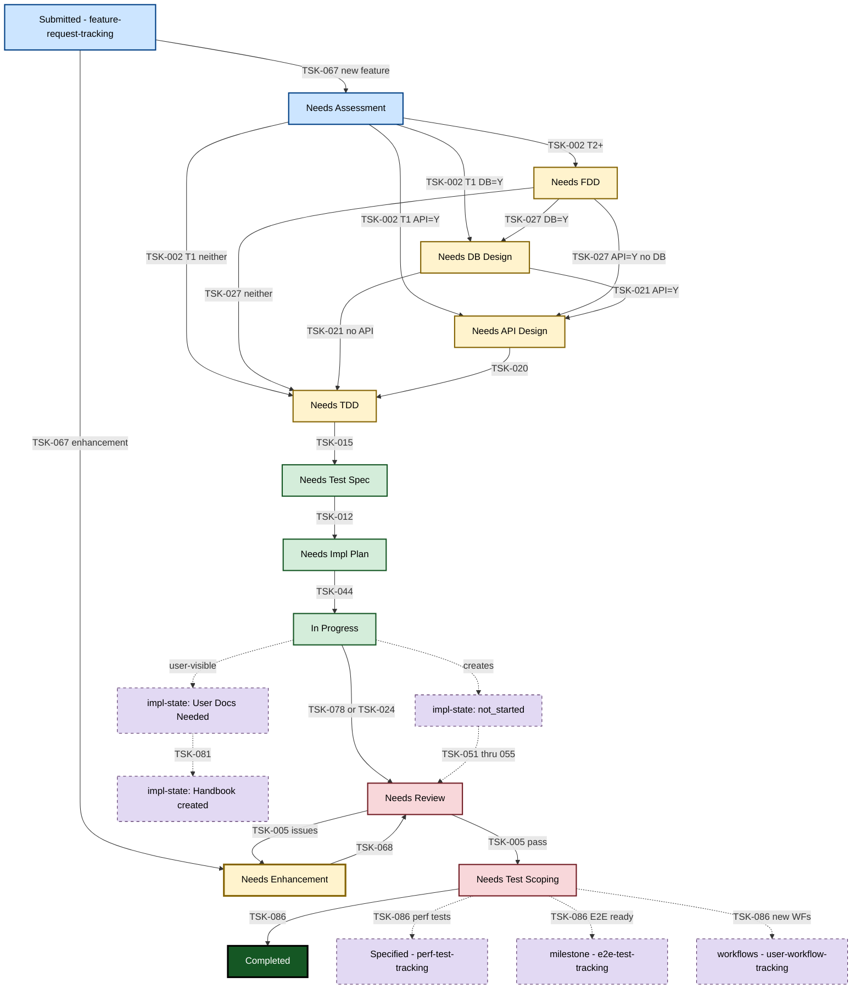
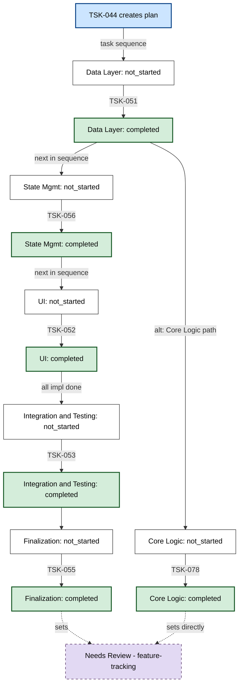
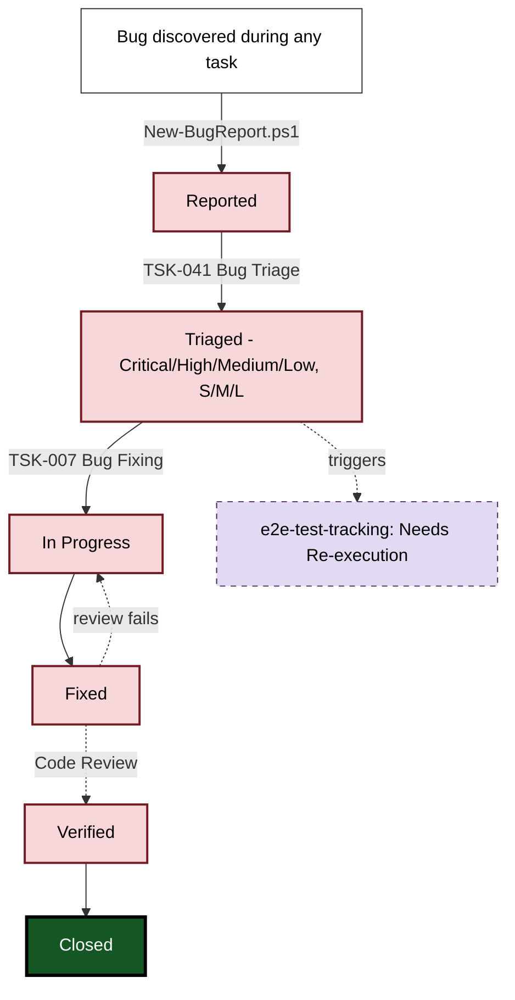
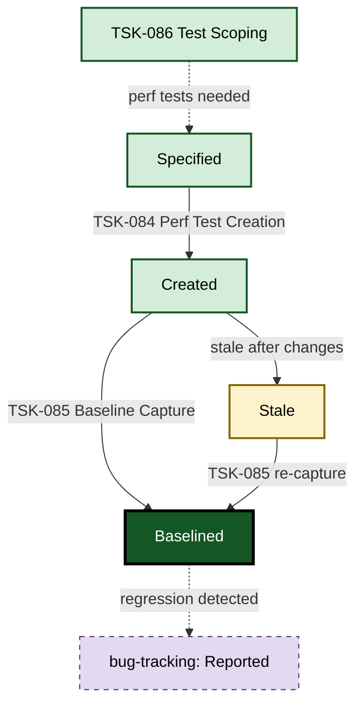
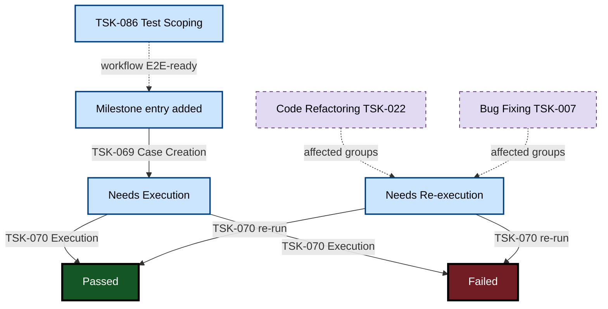
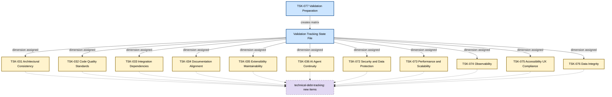
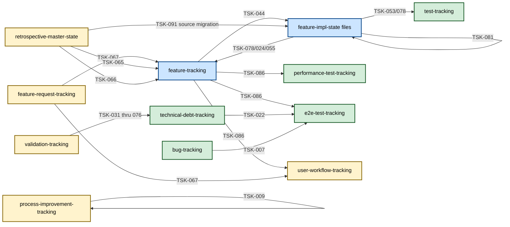

<!-- GENERATED FILE (Build-TaskMetadata.ps1, PF-PRO-042) — edit task files under tasks/**, then regenerate. -->
<!-- Hand-edits are allowed ONLY inside BEGIN/END HAND-WRITTEN regions; everything else is overwritten. -->

<!-- BEGIN HAND-WRITTEN: head -->
# Process Framework Task Registry

## Purpose

This document serves as the **comprehensive registry** of all process framework tasks, their automation scripts, and the files they update (both state tracking and other files). This registry provides complete visibility into:

- Which tasks have automation scripts vs. manual processes
- What files each task updates (state tracking, documentation, created artifacts)
- Where task outputs are stored
- Which tasks maintain this registry itself
<!-- END HAND-WRITTEN: head -->

## 🎯 Automation Status Summary

### ✅ Fully Automated Tasks

- **API Design Task** ([PF-TSK-020](../tasks/02-design/api-design-task.md))
- **Database Schema Design Task** ([PF-TSK-021](../tasks/02-design/database-schema-design-task.md))
- **E2E Acceptance Test Execution** ([PF-TSK-070](../tasks/03-testing/e2e-acceptance-test-execution-task.md))
- **FDD Creation** ([PF-TSK-027](../tasks/02-design/fdd-creation-task.md))
- **Instruction Design** ([PF-TSK-094](../tasks/02-design/instruction-design-task.md))
- **New Task Creation Process** ([PF-TSK-001](../tasks/support/new-task-creation-process.md))
- **System Architecture Review** ([PF-TSK-019](../tasks/01-planning/system-architecture-review.md))
- **Technical Debt Assessment Task** ([PF-TSK-023](../tasks/cyclical/technical-debt-assessment-task.md))
- **Technical Design Document (TDD) Creation** ([PF-TSK-015](../tasks/02-design/tdd-creation-task.md))
- **Test Specification Creation** ([PF-TSK-012](../tasks/03-testing/test-specification-creation-task.md))
- **UI Design** ([PF-TSK-090](../tasks/02-design/ui-design-task.md))

### 🔄 Semi-Automated Tasks

- **Bug Fixing** ([PF-TSK-007](../tasks/06-maintenance/bug-fixing-task.md))
- **Bug Triage** ([PF-TSK-041](../tasks/06-maintenance/bug-triage-task.md))
- **Code Refactoring Task** ([PF-TSK-022](../tasks/06-maintenance/code-refactoring-task.md))
- **Core Logic Implementation** ([PF-TSK-078](../tasks/04-implementation/core-logic-implementation.md))
- **Data Layer Implementation** ([PF-TSK-051](../tasks/04-implementation/data-layer-implementation.md))
- **Dimension Validation** ([PF-TSK-092](../tasks/05-validation/dimension-validation-task.md))
- **E2E Acceptance Test Case Creation** ([PF-TSK-069](../tasks/03-testing/e2e-acceptance-test-case-creation-task.md))
- **Feature Discovery** ([PF-TSK-013](../tasks/01-planning/feature-discovery-task.md))
- **Feature Enhancement** ([PF-TSK-068](../tasks/04-implementation/feature-enhancement.md))
- **Feature Implementation Planning Task** ([PF-TSK-044](../tasks/04-implementation/feature-implementation-planning-task.md))
- **Feature Request Evaluation** ([PF-TSK-067](../tasks/01-planning/feature-request-evaluation.md))
- **Foundation Feature Implementation Task** ([PF-TSK-024](../tasks/04-implementation/foundation-feature-implementation-task.md))
- **Framework Extension Task** ([PF-TSK-026](../tasks/support/framework-extension-task.md))
- **Integration and Testing** ([PF-TSK-053](../tasks/04-implementation/integration-and-testing.md))
- **Integration Narrative Creation** ([PF-TSK-083](../tasks/02-design/integration-narrative-creation.md))
- **Performance & E2E Test Scoping** ([PF-TSK-086](../tasks/03-testing/performance-and-e2e-test-scoping-task.md))
- **Performance Baseline Capture** ([PF-TSK-085](../tasks/03-testing/performance-baseline-capture-task.md))
- **Performance Test Creation** ([PF-TSK-084](../tasks/03-testing/performance-test-creation-task.md))
- **Process Improvement** ([PF-TSK-009](../tasks/support/process-improvement-task.md))
- **Project Initiation** ([PF-TSK-059](../tasks/00-setup/project-initiation-task.md))
- **Retrospective Documentation Creation** ([PF-TSK-066](../tasks/00-setup/retrospective-documentation-creation.md))
- **State Management Implementation** ([PF-TSK-056](../tasks/04-implementation/state-management-implementation.md))
- **Structure Change Task** ([PF-TSK-014](../tasks/support/structure-change-task.md))
- **Technical Exploration** ([PF-TSK-093](../tasks/01-planning/technical-exploration-task.md))
- **Test Audit** ([PF-TSK-030](../tasks/03-testing/test-audit-task.md))
- **UI Implementation** ([PF-TSK-052](../tasks/04-implementation/ui-implementation.md))
- **Validation Preparation** ([PF-TSK-077](../tasks/05-validation/validation-preparation.md))

### 🔄 Partially Automated Tasks

- **Codebase Feature Analysis** ([PF-TSK-065](../tasks/00-setup/codebase-feature-analysis.md))
- **Framework Evaluation** ([PF-TSK-079](../tasks/support/framework-evaluation.md))
- **Tools Review Task** ([PF-TSK-010](../tasks/support/tools-review-task.md))
- **User Documentation Creation** ([PF-TSK-081](../tasks/07-deployment/user-documentation-creation.md))

### 🔧 Manual Tasks

- **Code Review** ([PF-TSK-005](../tasks/06-maintenance/code-review-task.md))
- **Codebase Feature Discovery** ([PF-TSK-064](../tasks/00-setup/codebase-feature-discovery.md))
- **Codebase Source Migration** ([PF-TSK-091](../tasks/00-setup/codebase-source-migration-task.md))
- **Documentation Tier Adjustment Task** ([PF-TSK-011](../tasks/cyclical/documentation-tier-adjustment-task.md))
- **Framework Domain Adaptation** ([PF-TSK-080](../tasks/support/framework-domain-adaptation.md))
- **Framework Rollout** ([PF-TSK-088](../tasks/support/framework-rollout-task.md))
- **Git Commit and Push** ([PF-TSK-082](../tasks/07-deployment/git-commit-and-push.md))
- **IMP Triage** ([PF-TSK-089](../tasks/support/imp-triage-task.md))
- **Implementation Finalization** ([PF-TSK-055](../tasks/04-implementation/implementation-finalization.md))
- **Release & Deployment** ([PF-TSK-008](../tasks/07-deployment/release-deployment-task.md))

<!-- BEGIN HAND-WRITTEN: analysis-notes -->
### Critical Automation Gaps Identified

1. **Feature Request Evaluation (tier-assessment step)**: Requires separate script execution for state updates
2. **Integration & Testing Task (PF-TSK-053)**: Requires manual status updates after test completion

## State File Update Frequency Analysis

### Critical Files (Updated by Multiple Tasks)

| State File                                                                                          | Update Count        | Automation Priority |
| --------------------------------------------------------------------------------------------------- | ------------------- | ------------------- |
| [Feature Tracking](../../doc/state-tracking/permanent/feature-tracking.md)                                 | 27+ tasks           | **CRITICAL**        |
| [Bug Tracking](../../doc/state-tracking/permanent/bug-tracking.md)                                         | 11+ tasks           | **HIGH**            |
| [Test Tracking](../../test/state-tracking/permanent/test-tracking.md)                                      | 8 tasks             | **HIGH**            |
| [Architecture Tracking](../../doc/state-tracking/permanent/architecture-tracking.md)                       | 4 tasks             | **HIGH**            |
| Feature Implementation State Files                                                                   | 10+ tasks           | **HIGH**            |
| [Technical Debt Tracking](../../doc/state-tracking/permanent/technical-debt-tracking.md)                   | 6+ tasks            | **HIGH**            |
| [Documentation Maps](../PF-documentation-map.md) (PF, PD, TE)                                         | 17+ tasks           | **MEDIUM**          |
| [User Workflow Tracking](../../doc/state-tracking/permanent/user-workflow-tracking.md)                     | 5 tasks             | **MEDIUM**          |
| [Process Improvement Tracking](../../../process-framework-central/state-tracking/permanent/process-improvement-tracking.md) | 3+ tasks | **MEDIUM**          |
| [Validation Tracking](../../doc/state-tracking/validation/archive/validation-tracking-1.md)                | 12 tasks            | **MEDIUM**          |
| [E2E Test Tracking](../../test/state-tracking/permanent/e2e-test-tracking.md)                              | 2 tasks             | **MEDIUM**          |
| [Performance Test Tracking](../../test/state-tracking/permanent/performance-test-tracking.md)              | 2 tasks             | **MEDIUM**          |
| [Feature Request Tracking](../../doc/state-tracking/permanent/feature-request-tracking.md)                 | 1 task              | **LOW**             |
<!-- END HAND-WRITTEN: analysis-notes -->

## Task Catalog

### **00 - Setup Tasks**

#### **Codebase Feature Analysis** ([PF-TSK-065](../tasks/00-setup/codebase-feature-analysis.md))

**🔧 Process Type:** 🔄 **Partially Automated**

**Scripts:** [`New-TestFile.ps1`](../scripts/file-creation/03-testing/New-TestFile.ps1), [`Update-RetrospectiveMasterState.ps1`](../scripts/update/Update-RetrospectiveMasterState.ps1), [`Update-TechDebt.ps1`](../scripts/update/Update-TechDebt.ps1), [`Update-QualityClassification.ps1`](../scripts/update/Update-QualityClassification.ps1)

**📁 FILE OPERATIONS**

| Operation | File Path | Update Method | Details |
|-----------|-----------|---------------|---------|
| **Updates** | Feature Implementation State Files | Manual + `Update-QualityClassification.ps1` | Enriched with design decisions, dependencies, test coverage analysis (manual); Quality Assessment Classification + Code Maturity + Test Maturity lines computed and written by script (Step 9, dual-score model per PF-IMP-019/032) |
| **Updates** | [`test-tracking.md`](../../test/state-tracking/permanent/test-tracking.md) | `New-TestFile.ps1` | Register existing test files with pytest markers (finalization session) |
| **Updates** | [`feature-tracking.md`](../../doc/state-tracking/permanent/feature-tracking.md) | Manual | Update Test Status column (finalization session). Quality Assessment Classification (As-Built / Target-State) lives in each per-feature state file's Quality Assessment section, computed by `Update-QualityClassification.ps1` — not in feature-tracking.md. |
| **Updates** | Retrospective Master State File | `Update-RetrospectiveMasterState.ps1` | Claim/complete features (FeatureInventory mode), bulk-flip Unassigned Files Status via `-FilePaths` (MarkProcessed mode, PF-IMP-759), recalculate Progress Overview counters and Coverage Metrics |
| **Updates** | [`user-workflow-tracking.md`](../../doc/state-tracking/permanent/user-workflow-tracking.md) | Manual | Workflow definitions updated (finalization session) |
| **Updates** | [`technical-debt-tracking.md`](../../doc/state-tracking/permanent/technical-debt-tracking.md) | `Update-TechDebt.ps1 -Add` | Debt items from feature state files registered in central registry (finalization session) |

**🔗 TRIGGER & OUTPUT**

- **Trigger:** `retrospective-master-state.md` → `Phase 1.5` = complete (Source Migration done; Status = `ANALYSIS`)
- **Output:** `retrospective-master-state.md` → Phase 2 = `100%`

#### **Codebase Feature Discovery** ([PF-TSK-064](../tasks/00-setup/codebase-feature-discovery.md))

**🔧 Process Type:** 🔧 **Manual**

**Scripts:** [`New-RetrospectiveMasterState.ps1`](../scripts/file-creation/00-setup/New-RetrospectiveMasterState.ps1), [`New-FeatureImplementationState.ps1`](../scripts/file-creation/04-implementation/New-FeatureImplementationState.ps1), [`Validate-OnboardingCompleteness.ps1`](../scripts/validation/Validate-OnboardingCompleteness.ps1), [`New-SourceStructure.ps1`](../scripts/file-creation/00-setup/New-SourceStructure.ps1)

**📁 FILE OPERATIONS**

| Operation | File Path | Update Method | Details |
|-----------|-----------|---------------|---------|
| **Creates** | Retrospective Master State File | `New-RetrospectiveMasterState.ps1` | Tracks 3-phase retrospective onboarding progress |
| **Creates** | Feature Implementation State Files (multiple) | `New-FeatureImplementationState.ps1` | One per discovered feature in `doc/state-tracking/features/` |
| **Creates** | Source directory structure | `New-SourceStructure.ps1 -Scaffold` | Source root, shared/, feature directories, source-code-layout.md updates |
| **Creates** | Tier Assessment Artifacts (PD-ASS-XXX) | `New-Assessment.ps1` | One per discovered feature |
| **Updates** | [`feature-tracking.md`](../../doc/state-tracking/permanent/feature-tracking.md) | Manual | Add discovered features with initial status |
| **Updates** | [`user-workflow-tracking.md`](../../doc/state-tracking/permanent/user-workflow-tracking.md) | Manual | Map features to user workflows |

**🔗 TRIGGER & OUTPUT**

- **Trigger:** _(user request)_ / `retrospective-master-state.md` → Phase = `DISCOVERY`
- **Output:** `retrospective-master-state.md` → Phase 1 = `100%`; `feature-tracking.md` → `⬜ Needs Assessment`; `user-workflow-tracking.md` → created

#### **Codebase Source Migration** ([PF-TSK-091](../tasks/00-setup/codebase-source-migration-task.md))

**🔧 Process Type:** 🔧 **Manual**

**Scripts:** [`New-SourceStructure.ps1`](../scripts/file-creation/00-setup/New-SourceStructure.ps1), [`Validate-OnboardingCompleteness.ps1`](../scripts/validation/Validate-OnboardingCompleteness.ps1)

**📁 FILE OPERATIONS**

| Operation | File Path | Update Method | Details |
|-----------|-----------|---------------|---------|
| **Moves** | Legacy/root source files → `src/<feature>/` | Manual (per queue row) | One migration action at a time; references rewritten inbound + outbound; verified against per-file baseline before advancing |
| **Updates** | Retrospective Master State File | Manual | Source Migration Queue rows ⬜→🔄→✅; `Phase 1.5` complete; `Files Migrated` metric; Status → `ANALYSIS` |
| **Updates** | Feature Implementation State Files | Manual | File Inventory paths updated to new `src/<feature>/` locations (per-move, not batched) |
| **Updates** | [`source-code-layout.md`](../../doc/technical/architecture/source-code-layout.md) | `New-SourceStructure.ps1 -Update` | Regenerates the auto-generated Directory Tree section as files land |
| **Creates** | Characterization tests (where coverage is thin) | Manual | Pin current behavior before moving a thinly-tested unit |

**🔗 TRIGGER & OUTPUT**

- **Trigger:** `retrospective-master-state.md` → Phase 1 = `100%` (Discovery complete; Status set to `SOURCE_MIGRATION`)
- **Output:** `retrospective-master-state.md` → `Phase 1.5` = complete, Source Migration Queue 100% ✅, Status → `ANALYSIS`; Feature Implementation State files' File Inventory paths updated to `src/<feature>/`

#### **Project Initiation** ([PF-TSK-059](../tasks/00-setup/project-initiation-task.md))

**🔧 Process Type:** 🔄 **Semi-Automated**

**Scripts:** [`New-TestInfrastructure.ps1`](../scripts/file-creation/00-setup/New-TestInfrastructure.ps1), [`Validate-ProjectConfig.ps1`](../scripts/validation/Validate-ProjectConfig.ps1), [`Register-Project.ps1`](../scripts/file-creation/support/Register-Project.ps1), [`Push-FrameworkUpdate.ps1`](../scripts/rollout/Push-FrameworkUpdate.ps1)

**📁 FILE OPERATIONS**

| Operation | File Path | Update Method | Details |
|-----------|-----------|---------------|---------|
| **Creates** | `<project-root>/*` (bootstrapped framework copy) | Step 6 robocopy of appdev's `blueprint/*` | `process-framework/` tree, `doc/` skeleton, test bones, `.claude/`, `tools/linkwatcher/` seeds, project `CLAUDE.md` |
| **Creates** | `doc/project-config.json` | Step 6 bootstrap + manual customization (validated by `Validate-ProjectConfig.ps1`) | Blueprint-delivered template; `project_id` written by Step 7 registration; customized with name, language, paths; Step 13 validates JSON syntax, populated load-bearing fields, and absence of leftover placeholders |
| **Updates** | appdev central registry + rollout log | `Register-Project.ps1` (Step 7) + `Push-FrameworkUpdate.ps1` (Step 8) | Registry entry + child-pool counter; first-push version stamps, central pointer, rollout tag + log entry |
| **Creates** | `process-framework/languages-config/{language}/{language}-config.json` | Step 6 bootstrap (shipped languages) / appdev blueprint authoring (new-to-framework languages, Step 14) | Language-specific command configurations for testing, linting, coverage |
| **Creates** | `test/` directory structure | `New-TestInfrastructure.ps1` (Step 16) | Test directories, tracking files, TE-id-registry.json |
| **Creates** | [`user-workflow-tracking.md`](../../doc/state-tracking/permanent/user-workflow-tracking.md) | Manual | User workflow to feature mapping |
| **Creates** | CI/CD infrastructure | Manual (Step 18) | Pre-commit hooks with framework gates (expected default); optional dev scripts, pipeline configs |
| **Creates** | `.claude/settings.json` | Step 6 bootstrap + manual customization (Step 21) | `SessionStart` hooks (LinkWatcher startup, session timestamp, task-selection reminder); Hook 1 removed when LinkWatcher is not installed |

**🔗 TRIGGER & OUTPUT**

- **Trigger:** _(user request)_
- **Output:** Creates `project-config.json`, test infra; registers the project and delivers its first framework push (version stamps + central pointer); synthesizes the **Product Concept** (`doc/founding/product-concept.md`, `PD-DOC-001`) from the founding inputs in `doc/founding/inputs/`; notes the blueprint-shipped **Release Process Guide stub** (`doc/ci-cd/release-process.md`, `PD-CIC` — passive reference) for later fill-in _(no tracking status)_

#### **Retrospective Documentation Creation** ([PF-TSK-066](../tasks/00-setup/retrospective-documentation-creation.md))

**🔧 Process Type:** 🔄 **Semi-Automated**

**Scripts:** [`Validate-StateTracking.ps1`](../scripts/validation/Validate-StateTracking.ps1)

**📁 FILE OPERATIONS**

| Operation | File Path | Update Method | Details |
|-----------|-----------|---------------|---------|
| **Creates** | FDDs, TDDs, ADRs, Test Specifications | Existing design scripts | Tier-appropriate design documents for each discovered feature |
| **Creates** | Quality Assessment Reports (PD-QAR-XXX) | `New-QualityAssessmentReport.ps1` | For Target-State features |
| **Creates** | Tech Debt Items (PD-TDI-XXX) | `Update-TechDebt.ps1 -Add` (single) or `-BatchFile` (PF-IMP-012, recommended for 3+ items per session) | For Target-State feature gaps |
| **Creates** | Process Improvement Entries (PF-IMP-XXX) | `New-ProcessImprovement.ps1` | Framework improvement observations |
| **Updates** | [`feature-tracking.md`](../../doc/state-tracking/permanent/feature-tracking.md) | Design scripts | Tier assignments, document links, status progression |
| **Updates** | [`PF-documentation-map.md`](../PF-documentation-map.md) | Generated by [`Build-DocumentationMap.ps1`](../scripts/validation/Build-DocumentationMap.ps1) | Regenerate to reflect new PF documents (DO-NOT-EDIT projection) |
| **Updates** | [`PD-documentation-map.md`](../../doc/PD-documentation-map.md) | Generated by [`Build-DocumentationMap.ps1 -Tree PD`](../scripts/validation/Build-DocumentationMap.ps1) | Regenerate to reflect new PD documents (DO-NOT-EDIT projection, PF-PRO-050) |
| **Updates** | [`TE-documentation-map.md`](../../test/TE-documentation-map.md) | Generated by [`Build-DocumentationMap.ps1 -Tree TE`](../scripts/validation/Build-DocumentationMap.ps1) | Regenerate to reflect new test specs and audit reports (DO-NOT-EDIT projection, PF-PRO-050) |
| **Updates** | [`test-tracking.md`](../../test/state-tracking/permanent/test-tracking.md) | `New-TestFile.ps1` | Migrated test files registered |
| **Updates** | [`process-improvement-tracking.md`](../../../process-framework-central/state-tracking/permanent/process-improvement-tracking.md) | `New-ProcessImprovement.ps1` | Improvement entries from observations |
| **Captures** | [`release-process.md`](../../doc/ci-cd/release-process.md) (`PD-CIC`) | Manual (Step 26) | Captures the project's existing release process into the structured Release Process Guide and sets its Freshness Stamp (once per onboarding; inherited by all-Tier-1 onboards via the Tier-1 path's Phase-4 delegation). Claimed source doc handed to Step 28 archival. If no release knowledge exists, the shipped stub is left `unverified`. |
| **Captures** | [`product-concept.md`](../../doc/founding/product-concept.md) (`PD-DOC-001`) | Manual (Step 27) | Places the project's founding material raw in `doc/founding/inputs/` and captures its still-true content into the structured Product Concept, setting `status` off `Stub` (once per onboarding; inherited by all-Tier-1 onboards via the Tier-1 path's Phase-4 delegation). Claimed origin docs handed to Step 28 archival. If no founding material exists, the shipped stub is left unfilled. |
| **Updates** | Retrospective Master State File | Manual | Archive upon completion |

**🔗 TRIGGER & OUTPUT**

- **Trigger:** `retrospective-master-state.md` → Phase 2 = `100%`
- **Output:** Per-feature state files' §4 Documentation Inventory rows for FDD / TDD / ADR / Test Spec inserted (PF-PRO-002 / PF-IMP-760); `test-tracking.md` → test files registered (TE-TST-XXX). `feature-tracking.md` Status / Test Status columns updated. **Release Process Guide captured or confirmed** (`doc/ci-cd/release-process.md`) with its Freshness Stamp set, Step 26. **Product Concept captured or confirmed** (`doc/founding/product-concept.md`, `PD-DOC-001`) with `status` set off `Stub`, Step 27.

### **01 - Planning Tasks**

#### **Feature Discovery** ([PF-TSK-013](../tasks/01-planning/feature-discovery-task.md))

**🔧 Process Type:** 🔄 **Semi-Automated**

**Scripts:** [`New-FeatureRequest.ps1`](../scripts/file-creation/01-planning/New-FeatureRequest.ps1), [`New-Exploration.ps1`](../scripts/file-creation/01-planning/New-Exploration.ps1)

**📁 FILE OPERATIONS**

| Operation | File Path | Update Method | Details |
|-----------|-----------|---------------|---------|
| **Updates** | [`feature-request-tracking.md`](../../doc/state-tracking/permanent/feature-request-tracking.md) | `New-FeatureRequest.ps1` | Add discovered features as new requests with status "📥 Submitted" |
| **Updates** | [`technical-exploration-tracking.md`](../../doc/state-tracking/permanent/technical-exploration-tracking.md) | [`New-Exploration.ps1`](../scripts/file-creation/01-planning/New-Exploration.ps1) | File technical explorations needed before implementation as `📥 Queued` rows |
| **Updates** | [`doc/founding/feature-landscape.md`](../../doc/founding/feature-landscape.md) | Manual | Extend in place (Step 16) with the cycle's method, granularity calls, category and prioritization rationale, and a Cycle Log row. Blueprint-shipped stub (`PD-DOC-002`); no creation script — one landscape per project |

**🔗 TRIGGER & OUTPUT**

- **Trigger:** _(user request)_
- **Output:** `feature-request-tracking.md` → `📥 Submitted`; `user-workflow-tracking.md` → creates/updates workflow definitions; `technical-exploration-tracking.md` → `📥 Queued`; `doc/founding/feature-landscape.md` (`PD-DOC-002`) → extended with the cycle's reasoning _(no tracking status)_

#### **Feature Request Evaluation** ([PF-TSK-067](../tasks/01-planning/feature-request-evaluation.md))

**🔧 Process Type:** 🔄 **Semi-Automated**

**Scripts:** [`Update-FeatureRequest.ps1`](../scripts/update/Update-FeatureRequest.ps1), [`New-EnhancementState.ps1`](../scripts/file-creation/04-implementation/New-EnhancementState.ps1), [`New-Assessment.ps1`](../scripts/file-creation/01-planning/New-Assessment.ps1), [`Update-FeatureTrackingFromAssessment.ps1`](../scripts/update/Update-FeatureTrackingFromAssessment.ps1), [`New-Exploration.ps1`](../scripts/file-creation/01-planning/New-Exploration.ps1), [`Update-BatchFeatureStatus.ps1`](../scripts/update/Update-BatchFeatureStatus.ps1)

**📁 FILE OPERATIONS**

| Operation | File Path | Update Method | Details |
|-----------|-----------|---------------|---------|
| **Creates** | Tier Assessment Document `PD-ASS-XXX` (new features) | `New-Assessment.ps1` | Complexity scoring + Design Requirements Evaluation (DB / API / UI / Instruction) |
| **Creates** | Feature Implementation State File (new features) | `New-FeatureImplementationState.ps1` | Tier-correct variant (`-Lightweight` Tier 1; full Tier 2/3) — created after tier assessment (step 13) |
| **Creates** | Enhancement State Tracking File (enhancements) | `New-EnhancementState.ps1` | Scoped enhancement steps with Dimension Impact Assessment |
| **Updates** | [`feature-tracking.md`](../../doc/state-tracking/permanent/feature-tracking.md) | `Update-FeatureCategory.ps1` | New features: creates the structural row(s) at `⬜ Needs Assessment` |
| **Updates** | [`feature-tracking.md`](../../doc/state-tracking/permanent/feature-tracking.md) | `Update-FeatureTrackingFromAssessment.ps1` | New features: transitions to post-assessment status (📋/🗄️/🔌/🔧/🔎) + tier emoji + assessment link |
| **Updates** | [`feature-request-tracking.md`](../../doc/state-tracking/permanent/feature-request-tracking.md) | `Update-FeatureRequest.ps1` | Request status: 📥 Submitted → Classified (New Feature/Enhancement) → ✅ Completed (new-feature closure omits `-FeatureName`) |
| **Updates** | [`feature-tracking.md`](../../doc/state-tracking/permanent/feature-tracking.md) | `Update-FeatureRequest.ps1` | For enhancements: sets target to 🔄 Needs Enhancement with state-file link |
| **Updates** | [`user-workflow-tracking.md`](../../doc/state-tracking/permanent/user-workflow-tracking.md) | Manual | Updated for new features that map to user workflows |
| **Updates** | [`technical-exploration-tracking.md`](../../doc/state-tracking/permanent/technical-exploration-tracking.md) | `New-Exploration.ps1` | *Conditional*: files a `📥 Queued` research question that blocks the feature (or its classification) |
| **Updates** | [`feature-tracking.md`](../../doc/state-tracking/permanent/feature-tracking.md) | `Update-BatchFeatureStatus.ps1` | *Conditional*: diverts the blocked feature to `🔬 Needs Technical Exploration` (cleared by PF-TSK-093 on resolution) |

**🔗 TRIGGER & OUTPUT**

- **Trigger:** `feature-request-tracking.md` → `📥 Submitted`
- **Output:** `feature-request-tracking.md` → `✅ Completed`; `feature-tracking.md` → (new feature) tier emoji + post-assessment status (`📋 Needs FDD` T2+; `🗄️`/`🔌`/`🎨`/`🔧 Needs Impl Plan` T1 per design flags; retrospective onboarding → `🔎 Needs Test Scoping`) or `🔄 Needs Enhancement` + state file link (enhancement) or `🔬 Needs Technical Exploration` (blocked on a research question); `technical-exploration-tracking.md` → `📥 Queued` (when blocked); `user-workflow-tracking.md` → adds/maps workflows

#### **System Architecture Review** ([PF-TSK-019](../tasks/01-planning/system-architecture-review.md))

**🔧 Process Type:** ✅ **Fully Automated**

**Scripts:** [`New-ArchitectureAssessment.ps1`](../scripts/file-creation/02-design/New-ArchitectureAssessment.ps1)

**📁 FILE OPERATIONS**

| Operation | File Path | Update Method | Details |
|-----------|-----------|---------------|---------|
| **Creates** | `[PD-AIA-XXX]-[feature-name]-architecture-impact-assessment.md` | `New-ArchitectureAssessment.ps1` | Architecture Impact Assessment document with system integration analysis |
| **Updates** | per-feature implementation state file §4 Documentation Inventory | `Add-StateFileDocumentationInventoryRow` (in `StateFileInventory.psm1`) | Add Architecture Impact Assessment row (PF-PRO-002 / PF-IMP-760 — design artifact links live in per-feature state files, not in feature-tracking.md). `New-ArchitectureAssessment.ps1`'s historical `feature-tracking.md` write is defective post-PF-PRO-002 — see PF-IMP-890. |
| **Updates** | [`architecture-tracking.md`](../../doc/state-tracking/permanent/architecture-tracking.md) | `New-ArchitectureAssessment.ps1` | Add new architecture impact entry with assessment details and cross-references |
| **Updates** | [`technical-debt-tracking.md`](../../doc/state-tracking/permanent/technical-debt-tracking.md) | Manual (conditional) | Architectural debt items identified during review |
| **Updates** | [`process-improvement-tracking.md`](../../../process-framework-central/state-tracking/permanent/process-improvement-tracking.md) | Manual (conditional) | Architectural decisions made during review |

**🔗 TRIGGER & OUTPUT**

- **Trigger:** `feature-tracking.md` → Tier 2+ after FDD
- **Output:** per-feature implementation state file §4 Documentation Inventory → Architecture Impact Assessment row (no `feature-tracking.md` change; PF-PRO-002 / PF-IMP-760)

#### **Technical Exploration** ([PF-TSK-093](../tasks/01-planning/technical-exploration-task.md))

**🔧 Process Type:** 🔄 **Semi-Automated**

**Scripts:** [`New-TechnicalDoc.ps1`](../scripts/file-creation/01-planning/New-TechnicalDoc.ps1), [`Update-Exploration.ps1`](../scripts/update/Update-Exploration.ps1), [`Update-BatchFeatureStatus.ps1`](../scripts/update/Update-BatchFeatureStatus.ps1)

**📁 FILE OPERATIONS**

| Operation | File Path | Update Method | Details |
|-----------|-----------|---------------|---------|
| **Creates** | `doc/technical/explorations/PD-TEC-NNN-*.md` | [`New-TechnicalDoc.ps1`](../scripts/file-creation/01-planning/New-TechnicalDoc.ps1) | Findings document (research summary, options, recommendation, residual-items table) |
| **Updates** | Related feature's per-feature state file §4 Documentation Inventory | [`New-TechnicalDoc.ps1`](../scripts/file-creation/01-planning/New-TechnicalDoc.ps1) `-FeatureId` | *Conditional*: findings-document row inserted (feature-blocking explorations only) |
| **Updates** | [`technical-exploration-tracking.md`](../../doc/state-tracking/permanent/technical-exploration-tracking.md) | [`Update-Exploration.ps1`](../scripts/update/Update-Exploration.ps1) | Row status `📥 Queued` → `🔬 In Progress` → `✅ Resolved`; findings-doc link |
| **Updates** | [`feature-tracking.md`](../../doc/state-tracking/permanent/feature-tracking.md) | [`Update-BatchFeatureStatus.ps1`](../scripts/update/Update-BatchFeatureStatus.ps1) | *Conditional*: clear `🔬 Needs Technical Exploration` back to the feature's pipeline status |

**🔗 TRIGGER & OUTPUT**

- **Trigger:** `technical-exploration-tracking.md` → `📥 Queued`
- **Trigger:** `feature-tracking.md` → `🔬 Needs Technical Exploration`
- **Output:** `technical-exploration-tracking.md` → `✅ Resolved`
- **Output:** `feature-tracking.md` → `<prior pipeline status>` _(when a feature was blocked on the exploration)_

### **02 - Design Tasks**

#### **API Design Task** ([PF-TSK-020](../tasks/02-design/api-design-task.md))

**🔧 Process Type:** ✅ **Fully Automated**

**Scripts:** [`New-APISpecification.ps1`](../scripts/file-creation/02-design/New-APISpecification.ps1), [`New-APIDataModel.ps1`](../scripts/file-creation/02-design/New-APIDataModel.ps1)

**📁 FILE OPERATIONS**

| Operation | File Path | Update Method | Details |
|-----------|-----------|---------------|---------|
| **Creates** | `[api-name].md` | `New-APISpecification.ps1` | API specification document with comprehensive contract definition |
| **Creates** | `[api-name]-request.md` | `New-APIDataModel.ps1` | Request data model with validation rules and examples |
| **Creates** | `[api-name]-response.md` | `New-APIDataModel.ps1` | Response data model with complete structure and field definitions |
| **Updates** | [`feature-tracking.md`](../../doc/state-tracking/permanent/feature-tracking.md) | `New-APISpecification.ps1` | **AUTOMATED**: Status advanced to next gate (`🎨 Needs UI Design` / `📜 Needs Instruction Design` / `📝 Needs TDD` / `🔧 Needs Impl Plan`); timestamped automation notes appended to Notes column |
| **Updates** | Per-feature state file (`doc/state-tracking/features/<id>-implementation-state.md`) | `New-APISpecification.ps1` (via `Add-StateFileDocumentationInventoryRow`) | **AUTOMATED**: Insert API Specification row into §4 Documentation Inventory (PF-PRO-002 / PF-IMP-760). Additional API specs become additional rows. |
| **Updates** | Per-feature state file (`doc/state-tracking/features/<id>-implementation-state.md`) | `New-APIDataModel.ps1` (via `Add-StateFileDocumentationInventoryRow`) | **AUTOMATED**: Insert API Data Model row into §4 Documentation Inventory (PF-PRO-002 / PF-IMP-760) |
| **Updates** | [`technical-debt-tracking.md`](../../doc/state-tracking/permanent/technical-debt-tracking.md) | Manual | Record API design decisions that create technical debt |

**🔗 TRIGGER & OUTPUT**

- **Trigger:** `feature-tracking.md` → `🔌 Needs API Design`
- **Output:** `feature-tracking.md` Status → next design-chain gate (`🎨 Needs UI Design` / `📜 Needs Instruction Design` if still flagged) else `📝 Needs TDD` (Tier 2+) / `🔧 Needs Impl Plan` (Tier 1, since Tier 1 skips TDD); API Specification + Data Model rows inserted into per-feature state file's §4 Documentation Inventory (PF-PRO-002)

#### **Database Schema Design Task** ([PF-TSK-021](../tasks/02-design/database-schema-design-task.md))

**🔧 Process Type:** ✅ **Fully Automated**

**Scripts:** [`New-SchemaDesign.ps1`](../scripts/file-creation/02-design/New-SchemaDesign.ps1)

**📁 FILE OPERATIONS**

| Operation | File Path | Update Method | Details |
|-----------|-----------|---------------|---------|
| **Creates** | `[feature-name]-schema-design.md` | `New-SchemaDesign.ps1` | Complete database schema design document with comprehensive data model specification |
| **Creates** | Migration scripts (multiple) | `New-SchemaDesign.ps1` | Database migration files for schema changes with rollback procedures |
| **Creates** | ERD diagrams (multiple) | `New-SchemaDesign.ps1` | Entity-relationship diagrams for visual schema representation |
| **Updates** | [`feature-tracking.md`](../../doc/state-tracking/permanent/feature-tracking.md) | `New-SchemaDesign.ps1` | Status: `🗄️ Needs DB Design` → next design gate • Add schema design creation date to Notes |
| **Updates** | Per-feature state file (`doc/state-tracking/features/<id>-implementation-state.md`) | `New-SchemaDesign.ps1` (via `Add-StateFileDocumentationInventoryRow`) | Insert Schema Design row into §4 Documentation Inventory (PF-PRO-002 / PF-IMP-760) |
| **Updates** | [`technical-debt-tracking.md`](../../doc/state-tracking/permanent/technical-debt-tracking.md) | Manual | Add schema optimization opportunities identified during design |

**🔗 TRIGGER & OUTPUT**

- **Trigger:** `feature-tracking.md` → `🗄️ Needs DB Design`
- **Output:** `feature-tracking.md` Status → next design-chain gate still flagged (`🔌 Needs API Design` / `🎨 Needs UI Design` / `📜 Needs Instruction Design`) else `📝 Needs TDD` (Tier 2+) / `🔧 Needs Impl Plan` (Tier 1 — Tier 1 skips TDD); Schema Design row inserted into per-feature state file's §4 Documentation Inventory (PF-PRO-002)

#### **FDD Creation** ([PF-TSK-027](../tasks/02-design/fdd-creation-task.md))

**🔧 Process Type:** ✅ **Fully Automated**

**Scripts:** [`New-FDD.ps1`](../scripts/file-creation/02-design/New-FDD.ps1)

**📁 FILE OPERATIONS**

| Operation | File Path | Update Method | Details |
|-----------|-----------|---------------|---------|
| **Creates** | `fdd-[feature-id]-[feature-name].md` | `New-FDD.ps1` | Functional design document with requirements and specifications |
| **Updates** | [`feature-tracking.md`](../../doc/state-tracking/permanent/feature-tracking.md) | `New-FDD.ps1` | Status: `📋 Needs FDD` → the first design-chain gate the tier assessment flagged (`🗄️ Needs DB Design` / `🔌 Needs API Design` / `🎨 Needs UI Design` / `📜 Needs Instruction Design`), or `📝 Needs TDD` when none is flagged • Add FDD creation date to Notes |
| **Updates** | Per-feature state file (`doc/state-tracking/features/<id>-implementation-state.md`) | `New-FDD.ps1` (via `Add-StateFileDocumentationInventoryRow`) | Insert FDD document row into §4 Documentation Inventory (PF-PRO-002 / PF-IMP-760) |

**🔗 TRIGGER & OUTPUT**

- **Trigger:** `feature-tracking.md` → `📋 Needs FDD`
- **Output:** `feature-tracking.md` → next design status (`🗄️`/`🔌`/`🎨`/`📜`/`📝` — the first gate the assessment's design-required flags set, in chain order DB → API → UI → Instruction); FDD link inserted into per-feature state file's §4 Documentation Inventory (PF-PRO-002)

#### **Instruction Design** ([PF-TSK-094](../tasks/02-design/instruction-design-task.md))

**🔧 Process Type:** ✅ **Fully Automated**

**Scripts:** [`New-InstructionDesign.ps1`](../scripts/file-creation/02-design/New-InstructionDesign.ps1)

**📁 FILE OPERATIONS**

| Operation | File Path | Update Method | Details |
|-----------|-----------|---------------|---------|
| **Creates** | `doc/technical/design/instruction/features/instruction-design-<id>-<slug>.md` | [`New-InstructionDesign.ps1`](../scripts/file-creation/02-design/New-InstructionDesign.ps1) | New `PD-IND` document from [the template](../templates/02-design/instruction-design-template.md) |
| **Updates** | [`feature-tracking.md`](../../doc/state-tracking/permanent/feature-tracking.md) | [`New-InstructionDesign.ps1`](../scripts/file-creation/02-design/New-InstructionDesign.ps1) | Advances Status past the instruction gate (`📝 Needs TDD` / `🔧 Needs Impl Plan`) |
| **Updates** | `doc/state-tracking/features/<id>-implementation-state.md` | [`New-InstructionDesign.ps1`](../scripts/file-creation/02-design/New-InstructionDesign.ps1) | Inserts the Instruction Design row into §4 Documentation Inventory |
| **Updates** | [`PD-documentation-map.md`](../../doc/PD-documentation-map.md) | [`Build-DocumentationMap.ps1 -Tree PD`](../scripts/validation/Build-DocumentationMap.ps1) | Picks up the new document's `description:` (generated DO-NOT-EDIT projection) |

**🔗 TRIGGER & OUTPUT**

- **Trigger:** Triggered by feature-tracking Status `📜 Needs Instruction Design` — the fourth design-dimension gate, ordered LAST in the design chain (DB → API → UI → Instruction), so a mixed feature's instruction design is authored with its code designs already in hand (PF-PRO-064, per `AssessmentParsing.psm1`). Also invoked by: human-partner request; a tier-assessment narrative recommending an instruction design pass.
- **Output:** `feature-tracking.md` → the terminal design status (`📝 Needs TDD` for Tier 2+, or `🔧 Needs Impl Plan` for Tier 1), advancing past the instruction gate; per-feature state file §4 Documentation Inventory → Instruction Design row (the creation is also recorded in the Notes column); PD-documentation-map.md → reflected on `-Tree PD` regeneration

#### **Integration Narrative Creation** ([PF-TSK-083](../tasks/02-design/integration-narrative-creation.md))

**🔧 Process Type:** 🔄 **Semi-Automated**

**Scripts:** [`New-IntegrationNarrative.ps1`](../scripts/file-creation/02-design/New-IntegrationNarrative.ps1)

**📁 FILE OPERATIONS**

| Operation | File Path | Update Method | Details |
|-----------|-----------|---------------|---------|
| Create | `doc/technical/integration/[workflow]-integration-narrative.md` | Script | Integration Narrative with PD-INT ID |
| Update | `doc/PD-id-registry.json` | Script (auto) | Increment PD-INT nextAvailable counter |
| Update | `doc/state-tracking/permanent/user-workflow-tracking.md` | Script (auto) | Set "Integration Doc" column to PD-INT ID (by WorkflowId parameter) |

**🔗 TRIGGER & OUTPUT**

- **Trigger:** `user-workflow-tracking.md` → all workflow features = `Implemented` + Integration Doc empty
- **Output:** `user-workflow-tracking.md` → Integration Doc = PD-INT-XXX link

#### **Technical Design Document (TDD) Creation** ([PF-TSK-015](../tasks/02-design/tdd-creation-task.md))

**🔧 Process Type:** ✅ **Fully Automated**

**Scripts:** [`New-TDD.ps1`](../scripts/file-creation/02-design/New-TDD.ps1)

**📁 FILE OPERATIONS**

| Operation | File Path | Update Method | Details |
|-----------|-----------|---------------|---------|
| **Creates** | `tdd-[FeatureId]-[feature-name]-t[Tier].md` | `New-TDD.ps1` | Technical design document with architecture and implementation details |
| **Updates** | [`feature-tracking.md`](../../doc/state-tracking/permanent/feature-tracking.md) | `New-TDD.ps1` | Status: "📝 Needs TDD" → "🧪 Needs Test Spec" |
| **Updates** | Per-feature state file (`doc/state-tracking/features/<id>-implementation-state.md`) | `New-TDD.ps1` (via `Add-StateFileDocumentationInventoryRow`) | Insert TDD document row into §4 Documentation Inventory (PF-PRO-002 / PF-IMP-760) |

**🔗 TRIGGER & OUTPUT**

- **Trigger:** `feature-tracking.md` → `📝 Needs TDD`
- **Output:** `feature-tracking.md` → `🧪 Needs Test Spec`; TDD link inserted into per-feature state file's §4 Documentation Inventory (PF-PRO-002)

#### **UI Design** ([PF-TSK-090](../tasks/02-design/ui-design-task.md))

**🔧 Process Type:** ✅ **Fully Automated**

**Scripts:** [`New-UIDesign.ps1`](../scripts/file-creation/02-design/New-UIDesign.ps1)

**📁 FILE OPERATIONS**

| Operation | File Path | Update Method | Details |
|-----------|-----------|---------------|---------|
| Create | `doc/technical/design/ui-ux/features/ui-design-<id>-<slug>.md` | Script | New PD-UIX document from template |
| Regenerate | `doc/PD-documentation-map.md` | [`Build-DocumentationMap.ps1 -Tree PD`](../scripts/validation/Build-DocumentationMap.ps1) | Picks up the new design's `description:` (generated DO-NOT-EDIT projection, PF-PRO-050) |
| Update | `doc/state-tracking/permanent/feature-tracking.md` | Script | Sets feature row Status to the next design gate (`📜 Needs Instruction Design` / `📝 Needs TDD` / `🔧 Needs Impl Plan`) |
| Insert | `doc/state-tracking/features/<id>-implementation-state.md` | Script | Inserts UI Design row into §4 Documentation Inventory |

**🔗 TRIGGER & OUTPUT**

- **Trigger:** Triggered by feature-tracking Status `🎨 Needs UI Design` — the design-chain gate ordered after API and before Instruction Design (PF-IMP-1352 / PF-PRO-064, per `AssessmentParsing.psm1`). Also invoked by: human-partner request; tier-assessment narrative recommending UI Design; FDD review surfacing UI complexity; PF-TSK-066 Retrospective Documentation Creation backfilling UI Design for existing features.
- **Output:** `feature-tracking.md` → next design gate (`📜 Needs Instruction Design` when the feature has an instruction dimension, else `📝 Needs TDD` for Tier 2+, or `🔧 Needs Impl Plan`), advancing past the UI gate (PF-IMP-1352); per-feature state file §4 Documentation Inventory → UI Design row (the creation is also recorded in the Notes column); PD-documentation-map.md → reflected on `-Tree PD` regeneration

### **03 - Testing Tasks**

#### **E2E Acceptance Test Case Creation** ([PF-TSK-069](../tasks/03-testing/e2e-acceptance-test-case-creation-task.md))

**🔧 Process Type:** 🔄 **Semi-Automated**

**Scripts:** [`New-E2EAcceptanceTestCase.ps1`](../scripts/file-creation/03-testing/New-E2EAcceptanceTestCase.ps1)

**📁 FILE OPERATIONS**

| Operation | File Path | Update Method | Details |
|-----------|-----------|---------------|---------|
| **Creates** | Test case directory: `E2E-NNN-<name>/` | `New-E2EAcceptanceTestCase.ps1` | Contains `test-case.md`, `project/`, `expected/`, optional `run.ps1` |
| **Creates** | Master test file (new groups) | `New-E2EAcceptanceTestCase.ps1` | `master-test-<group-name>.md` with quick validation sequences |
| **Updates** | [`e2e-test-tracking.md`](../../test/state-tracking/permanent/e2e-test-tracking.md) | `New-E2EAcceptanceTestCase.ps1` | New E2E acceptance test entries added |
| **Updates** | [`feature-tracking.md`](../../doc/state-tracking/permanent/feature-tracking.md) | Manual | Test Status updated |

**🔗 TRIGGER & OUTPUT**

- **Trigger:** E2E spec / bug report / refactoring plan _(multi-path)_
- **Output:** `e2e-test-tracking.md` → `📋 Needs Execution` → (audit gate) → `✅ Audit Approved`

#### **E2E Acceptance Test Execution** ([PF-TSK-070](../tasks/03-testing/e2e-acceptance-test-execution-task.md))

**🔧 Process Type:** ✅ **Fully Automated**

**Scripts:** [`Setup-TestEnvironment.ps1`](../scripts/test/e2e-acceptance-testing/Setup-TestEnvironment.ps1), [`Run-E2EAcceptanceTest.ps1`](../scripts/test/e2e-acceptance-testing/Run-E2EAcceptanceTest.ps1), [`Verify-TestResult.ps1`](../scripts/test/e2e-acceptance-testing/Verify-TestResult.ps1), [`Update-TestExecutionStatus.ps1`](../scripts/test/e2e-acceptance-testing/Update-TestExecutionStatus.ps1), [`New-BugReport.ps1`](../scripts/file-creation/06-maintenance/New-BugReport.ps1)

**📁 FILE OPERATIONS**

| Operation | File Path | Update Method | Details |
|-----------|-----------|---------------|---------|
| **Updates** | [`e2e-test-tracking.md`](../../test/state-tracking/permanent/e2e-test-tracking.md) | `Update-TestExecutionStatus.ps1` | Execution status (✅ Pass / ❌ Fail) and Last Executed date |
| **Updates** | [`feature-tracking.md`](../../doc/state-tracking/permanent/feature-tracking.md) | `Update-TestExecutionStatus.ps1` | Test Status updated based on E2E results |
| **Updates** | [`bug-tracking.md`](../../doc/state-tracking/permanent/bug-tracking.md) | `New-BugReport.ps1` | Bug reports for test failures |

**🔗 TRIGGER & OUTPUT**

- **Trigger:** `e2e-test-tracking.md` → `🔄 Needs Re-execution` or `📋 Needs Execution` (with `✅ Audit Approved`)
- **Output:** `e2e-test-tracking.md` → `✅ Passed` or `🔴 Failed`

#### **Performance & E2E Test Scoping** ([PF-TSK-086](../tasks/03-testing/performance-and-e2e-test-scoping-task.md))

**🔧 Process Type:** 🔄 **Semi-Automated**

**Scripts:** [`New-PerformanceTestEntry.ps1`](../scripts/file-creation/03-testing/New-PerformanceTestEntry.ps1), [`New-WorkflowEntry.ps1`](../scripts/file-creation/03-testing/New-WorkflowEntry.ps1), [`New-E2EMilestoneEntry.ps1`](../scripts/file-creation/03-testing/New-E2EMilestoneEntry.ps1), [`Update-BatchFeatureStatus.ps1`](../scripts/update/Update-BatchFeatureStatus.ps1), [`Update-WorkflowTracking.ps1`](../scripts/update/Update-WorkflowTracking.ps1)

**📁 FILE OPERATIONS**

| Operation | File Path | Update Method | Details |
|-----------|-----------|---------------|---------|
| Add perf test rows | test/state-tracking/permanent/performance-test-tracking.md | New-PerformanceTestEntry.ps1 | `⬜ Needs Creation` entries + summary update |
| Add workflow rows | doc/state-tracking/permanent/user-workflow-tracking.md | New-WorkflowEntry.ps1 | New cross-feature workflows discovered during scoping |
| Add E2E milestones | test/state-tracking/permanent/e2e-test-tracking.md | New-E2EMilestoneEntry.ps1 | Workflow Milestone Tracking table |
| Update feature status | doc/state-tracking/permanent/feature-tracking.md | Update-BatchFeatureStatus.ps1 | `🔎 Needs Test Scoping` → `📖 Needs User Docs` or `🟢 Completed` (based on User Documentation status in state file) |
| Sync workflow status | doc/state-tracking/permanent/user-workflow-tracking.md | Update-WorkflowTracking.ps1 | Derives Impl Status + E2E Status |

**🔗 TRIGGER & OUTPUT**

- **Trigger:** `feature-tracking.md` → `🔎 Needs Test Scoping`
- **Output:** `feature-tracking.md` → `🟢 Completed`; `performance-test-tracking.md` → `⬜ Needs Creation` (if perf tests needed); `e2e-test-tracking.md` → milestone entries (if workflow E2E-ready); `user-workflow-tracking.md` → untracked workflows added

#### **Performance Baseline Capture** ([PF-TSK-085](../tasks/03-testing/performance-baseline-capture-task.md))

**🔧 Process Type:** 🔄 **Semi-Automated**

**Scripts:** [`Update-PerformanceTracking.ps1`](../scripts/update/Update-PerformanceTracking.ps1)

**📁 FILE OPERATIONS**

| Operation | File Path | Update Method | Details |
|-----------|-----------|---------------|---------|
| **Updates** | [`performance-test-tracking.md`](../../test/state-tracking/permanent/performance-test-tracking.md) | `Update-PerformanceTracking.ps1` | Status 📋 → ✅, Baseline/Last Result/Last Run columns, summary recalculation |
| **Updates** | `performance-results.db` | `performance_db.py record` | Record measured values with timestamp for trend analysis |
| **Updates** | [`bug-tracking.md`](../../doc/state-tracking/permanent/bug-tracking.md) | Manual (conditional) | If regression detected and filed as bug |
| **Updates** | [`technical-debt-tracking.md`](../../doc/state-tracking/permanent/technical-debt-tracking.md) | Manual (conditional) | If trend degradation filed as tech debt |

**🔗 TRIGGER & OUTPUT**

- **Trigger:** `performance-test-tracking.md` → `📋 Needs Baseline` (with `✅ Audit Approved`) or `⚠️ Needs Re-baseline`
- **Output:** `performance-test-tracking.md` → `✅ Baselined`; `bug-tracking.md` → `🆕 Needs Triage` (if regression)

#### **Performance Test Creation** ([PF-TSK-084](../tasks/03-testing/performance-test-creation-task.md))

**🔧 Process Type:** 🔄 **Semi-Automated**

**Scripts:** [`Update-PerformanceTracking.ps1`](../scripts/update/Update-PerformanceTracking.ps1)

**📁 FILE OPERATIONS**

| Operation | File Path | Update Method | Details |
|-----------|-----------|---------------|---------|
| **Creates** | Performance test files | Manual | Test files in `test/automated/performance/` |
| **Updates** | [`performance-test-tracking.md`](../../test/state-tracking/permanent/performance-test-tracking.md) | `Update-PerformanceTracking.ps1` | Status ⬜ → 📋, Test File column, summary recalculation |
| **Updates** | [`feature-tracking.md`](../../doc/state-tracking/permanent/feature-tracking.md) | Manual | Update if test coverage changes affect feature status |

**🔗 TRIGGER & OUTPUT**

- **Trigger:** `performance-test-tracking.md` → `⬜ Needs Creation` entries (created by PF-TSK-086)
- **Output:** `performance-test-tracking.md` → `⬜ Needs Creation` → `📋 Needs Baseline` → (audit gate) → `✅ Audit Approved`

#### **Test Audit** ([PF-TSK-030](../tasks/03-testing/test-audit-task.md))

**🔧 Process Type:** 🔄 **Semi-Automated**

**Scripts:** [`New-TestAuditReport.ps1`](../scripts/file-creation/03-testing/New-TestAuditReport.ps1), [`New-AuditTracking.ps1`](../scripts/file-creation/03-testing/New-AuditTracking.ps1), [`Update-TestFileAuditState.ps1`](../scripts/update/Update-TestFileAuditState.ps1), [`New-BugReport.ps1`](../scripts/file-creation/06-maintenance/New-BugReport.ps1)

**📁 FILE OPERATIONS**

| Operation | File Path | Update Method | Details |
|-----------|-----------|---------------|---------|
| **Creates** | `[TE-TAR-XXX]-[feature-id]-[test-file-id].md` | `New-TestAuditReport.ps1` | Test audit report with quality assessment and recommendations |
| **Updates** | [`test-tracking.md`](../../test/state-tracking/permanent/test-tracking.md) | `New-TestAuditReport.ps1` | (Automated type) Appends audit report link in Notes column for the target test file |
| **Updates** | [`performance-test-tracking.md`](../../test/state-tracking/permanent/performance-test-tracking.md) | `New-TestAuditReport.ps1` | (Performance type) Updates Audit Status + Audit Report columns |
| **Updates** | [`e2e-test-tracking.md`](../../test/state-tracking/permanent/e2e-test-tracking.md) | `New-TestAuditReport.ps1` | (E2E type) Updates Audit Status + Audit Report columns |
| **Updates** | [`bug-tracking.md`](../../doc/state-tracking/permanent/bug-tracking.md) (if bugs discovered) | [`New-BugReport.ps1`](../scripts/file-creation/06-maintenance/New-BugReport.ps1)| Add newly discovered bugs with 🆕 Needs Triage status for triage |
| **Updates** | [`test-tracking.md`](../../test/state-tracking/permanent/test-tracking.md) | `Update-TestFileAuditState.ps1` | (Automated type) **AUTOMATED**: Update individual test file audit status with comprehensive details |
| **Updates** | [`performance-test-tracking.md`](../../test/state-tracking/permanent/performance-test-tracking.md) | `Update-TestFileAuditState.ps1` | (Performance type) Updates Audit Status + Audit Report columns directly |
| **Updates** | [`e2e-test-tracking.md`](../../test/state-tracking/permanent/e2e-test-tracking.md) | `Update-TestFileAuditState.ps1` | (E2E type) Updates Audit Status + Audit Report columns directly |
| **Updates** | [`feature-tracking.md`](../../doc/state-tracking/permanent/feature-tracking.md) | `Update-TestFileAuditState.ps1` | (Automated type) **AUTOMATED**: Intelligent aggregated test status calculation |
| **Updates** | [`technical-debt-tracking.md`](../../doc/state-tracking/permanent/technical-debt-tracking.md) | `Update-TechDebt.ps1 -Add` (conditional) | Register significant test quality findings as tech debt items |

**🔗 TRIGGER & OUTPUT**

- **Trigger:** `test-tracking.md` → `✅ Audit Approved` + no audit
- **Output:** `test-tracking.md` → audit status + report link; `bug-tracking.md` → `🆕 Needs Triage` (if bugs found)

#### **Test Specification Creation** ([PF-TSK-012](../tasks/03-testing/test-specification-creation-task.md))

**🔧 Process Type:** ✅ **Fully Automated**

**Scripts:** [`New-TestSpecification.ps1`](../scripts/file-creation/03-testing/New-TestSpecification.ps1)

**📁 FILE OPERATIONS**

| Operation | File Path | Update Method | Details |
|-----------|-----------|---------------|---------|
| **Creates** | `test-spec-[FeatureId]-[FeatureName].md` | `New-TestSpecification.ps1` | Comprehensive test specification document |
| **Updates** | [`feature-tracking.md`](../../doc/state-tracking/permanent/feature-tracking.md) | `New-TestSpecification.ps1` | Test Status → "📋 Specs Created" • Add specification creation date to Notes |
| **Updates** | Per-feature state file (`doc/state-tracking/features/<id>-implementation-state.md`) | `New-TestSpecification.ps1` (via `Add-StateFileDocumentationInventoryRow`) | Insert Test Specification row into §4 Documentation Inventory (PF-PRO-002 / PF-IMP-760) |
| **Updates** | [`TE-id-registry.json`](../../test/TE-id-registry.json) | `New-TestSpecification.ps1` | Update TE-TSP nextAvailable counter |
| **Updates** | [`TE-documentation-map.md`](../../test/TE-documentation-map.md) | Generated by [`Build-DocumentationMap.ps1 -Tree TE`](../scripts/validation/Build-DocumentationMap.ps1); `-Check` drift gate | Regenerate to reflect the new spec's `description:` (DO-NOT-EDIT projection, PF-PRO-050) |
| **Updates** | [`test-tracking.md`](../../test/state-tracking/permanent/test-tracking.md) | Manual | Add feature section if missing |

**🔗 TRIGGER & OUTPUT**

- **Trigger:** `feature-tracking.md` → `🧪 Needs Test Spec`
- **Output:** `feature-tracking.md` → `🔧 Needs Impl Plan`

### **04 - Implementation Tasks**

#### **Core Logic Implementation** ([PF-TSK-078](../tasks/04-implementation/core-logic-implementation.md))

**🔧 Process Type:** 🔄 **Semi-Automated**

**Scripts:** [`New-TestFile.ps1`](../scripts/file-creation/03-testing/New-TestFile.ps1), [`New-BugReport.ps1`](../scripts/file-creation/06-maintenance/New-BugReport.ps1)

**📁 FILE OPERATIONS**

| Operation | File Path | Update Method | Details |
|-----------|-----------|---------------|---------|
| **Creates** | Source modules | Manual | Core business logic modules in project source directory |
| **Creates** | Integration wiring | Manual | CLI commands, service registrations, event hooks |
| **Creates** | Unit tests | `New-TestFile.ps1` | Tracked test files with pytest markers in project test directory |
| **Creates** | Bug reports (if applicable) | `New-BugReport.ps1` | Bug reports for issues not fixed in this session |
| **Updates** | [Feature Implementation State Files](../../doc/state-tracking/features) | Manual | Code inventory, task sequence, implementation notes, issues log |
| **Updates** | [Feature Tracking](../../doc/state-tracking/permanent/feature-tracking.md) | Manual | Status → 👀 Needs Review |
| **Updates** | [Test Tracking](../../test/state-tracking/permanent/test-tracking.md) | `New-TestFile.ps1` | Automated test file links and status |
| **Updates** | [Bug Tracking](../../doc/state-tracking/permanent/bug-tracking.md) | Manual | Bug entries if bugs discovered (optional) |
| **Updates** | Product documentation (TDD, integration narrative) | Manual | Cross-TDD check and Cross-integration-narrative check (Step 12) — verify other features' docs still accurately describe modified files |

**🔗 TRIGGER & OUTPUT**

- **Trigger:** `feature-tracking.md` + Feature impl state file → `🟡 In Progress` + task = `not_started` in sequence
- **Output:** `feature-tracking.md` → `👀 Needs Review`; Feature impl state file → task = `completed`; Feature impl state file → User Documentation = `❌ Needed` (if user-visible)

#### **Data Layer Implementation** ([PF-TSK-051](../tasks/04-implementation/data-layer-implementation.md))

**🔧 Process Type:** 🔄 **Semi-Automated**

**Scripts:** [`New-TestFile.ps1`](../scripts/file-creation/03-testing/New-TestFile.ps1)

**📁 FILE OPERATIONS**

| Operation | File Path | Update Method | Details |
|-----------|-----------|---------------|---------|
| **Creates** | Data model classes | Manual | Model classes in source data directory with serialization, validation |
| **Creates** | Repository interface | Manual | Repository contract in source repositories directory |
| **Creates** | Repository implementation | Manual | Concrete repository implementation |
| **Creates** | Unit tests | `New-TestFile.ps1` | Test files in `/test/unit/data/[feature]/` for models and repositories |
| **Executes** | Database migrations | Manual | Run database migration scripts to create database schema |
| **Updates** | [Feature Implementation State File](../state-tracking/permanent/feature-[feature-id]-implementation.md) | Manual | Update task sequence tracking, code inventory, implementation notes, issues log |
| **Updates** | [`test-tracking.md`](../../test/state-tracking/permanent/test-tracking.md) | `New-TestFile.ps1` (auto) | Automated test file registration |
| **Updates** | [`feature-tracking.md`](../../doc/state-tracking/permanent/feature-tracking.md) | `New-TestFile.ps1` (auto) | Automated test status update |

**🔗 TRIGGER & OUTPUT**

- **Trigger:** `feature-tracking.md` + Feature impl state file → `🟡 In Progress` + task = `not_started` in sequence
- **Output:** Feature impl state file → task = `completed`

#### **Feature Enhancement** ([PF-TSK-068](../tasks/04-implementation/feature-enhancement.md))

**🔧 Process Type:** 🔄 **Semi-Automated**

**Scripts:** [`Run-Tests.ps1`](../scripts/test/Run-Tests.ps1), [`Finalize-Enhancement.ps1`](../scripts/update/Finalize-Enhancement.ps1)

**📁 FILE OPERATIONS**

| Operation | File Path | Update Method | Details |
|-----------|-----------|---------------|---------|
| **Updates** | Enhancement State Tracking File | Manual | Steps marked complete; archived upon finalization |
| **Updates** | [`feature-tracking.md`](../../doc/state-tracking/permanent/feature-tracking.md) | `Finalize-Enhancement.ps1` | Status restored (removes "🔄 Needs Enhancement") |
| **Updates** | Feature Implementation State File | Manual | Updated to reflect enhancement changes |
| **Updates** | [`test-tracking.md`](../../test/state-tracking/permanent/test-tracking.md) | Manual | Manual test groups set to "Needs Re-execution" |
| **Updates** | Design documents (FDD, TDD, ADR) | Manual | Amended to reflect enhancement scope |

**🔗 TRIGGER & OUTPUT**

- **Trigger:** `feature-tracking.md` → `🔄 Needs Enhancement` + state file link
- **Output:** `feature-tracking.md` → previous status restored (enhancement removed); `👀 Needs Review` when the state file's Code Review block is applicable

#### **Feature Implementation Planning Task** ([PF-TSK-044](../tasks/04-implementation/feature-implementation-planning-task.md))

**🔧 Process Type:** 🔄 **Semi-Automated**

**Scripts:** [`New-ImplementationPlan.ps1`](../scripts/file-creation/04-implementation/New-ImplementationPlan.ps1)

**📁 FILE OPERATIONS**

| Operation | File Path | Update Method | Details |
|-----------|-----------|---------------|---------|
| **Creates** | Implementation Plan Document (PD-IMP-XXX) | `New-ImplementationPlan.ps1` | Detailed implementation plan with task sequencing and dependency mapping |
| **Updates** | Feature Implementation State File | Manual | Initialize planning-phase sections (file created earlier by Feature Request Evaluation, PF-TSK-067) |
| **Updates** | [`feature-tracking.md`](../../doc/state-tracking/permanent/feature-tracking.md) | Manual | Links to implementation plan and feature state file |

**🔗 TRIGGER & OUTPUT**

- **Trigger:** `feature-tracking.md` → `🔧 Needs Impl Plan`
- **Output:** `feature-tracking.md` → `🟡 In Progress`; Feature impl state file → task sequence initialized (`not_started`)

#### **Foundation Feature Implementation Task** ([PF-TSK-024](../tasks/04-implementation/foundation-feature-implementation-task.md))

**🔧 Process Type:** 🔄 **Semi-Automated**

**Scripts:** [`Quick-ValidationCheck.ps1`](../scripts/validation/Quick-ValidationCheck.ps1), [`New-BugReport.ps1`](../scripts/file-creation/06-maintenance/New-BugReport.ps1)

**📁 FILE OPERATIONS**

| Operation | File Path | Update Method | Details |
|-----------|-----------|---------------|---------|
| **Creates** | Validation results | [`Quick-ValidationCheck.ps1`](../scripts/validation/Quick-ValidationCheck.ps1) | Quick health check output (console/JSON/CSV) |
| **Updates** | [`bug-tracking.md`](../../doc/state-tracking/permanent/bug-tracking.md) (if bugs discovered) | [`New-BugReport.ps1`](../scripts/file-creation/06-maintenance/New-BugReport.ps1)| Add newly discovered bugs with 🆕 Needs Triage status for triage |
| **Updates** | [`architecture-tracking.md`](../../doc/state-tracking/permanent/architecture-tracking.md) | Manual | Record foundation implementation and architectural evolution • Update component status and key decisions |
| **Updates** | [`feature-tracking.md`](../../doc/state-tracking/permanent/feature-tracking.md) | Manual | Update with foundation feature completion status |
| **Updates** | [`test-tracking.md`](../../test/state-tracking/permanent/test-tracking.md) | `New-TestFile.ps1` (auto) | Automated test registration when creating test files |

**🔗 TRIGGER & OUTPUT**

- **Trigger:** `feature-tracking.md` + Feature impl state file → Feature ID = `0.x.x` + task = `not_started` in sequence
- **Output:** `feature-tracking.md` → `👀 Needs Review`; Feature impl state file → task = `completed`

#### **Implementation Finalization** ([PF-TSK-055](../tasks/04-implementation/implementation-finalization.md))

**🔧 Process Type:** 🔧 **Manual**

**📁 FILE OPERATIONS**

| Operation | File Path | Update Method | Details |
|-----------|-----------|---------------|---------|
| **Updates** | Feature documentation | Manual | Code docs, user docs, configuration docs finalized |
| **Updates** | [`feature-tracking.md`](../../doc/state-tracking/permanent/feature-tracking.md) | Manual | Status updated to "👀 Needs Review" |
| **Updates** | Feature Implementation State File | Manual | Finalized in place (status `COMPLETE`) after 100% completion; never archived |

**🔗 TRIGGER & OUTPUT**

- **Trigger:** Feature impl state file → PF-TSK-053 (Integration & Testing) = `completed`
- **Output:** `feature-tracking.md` → `👀 Needs Review`

#### **Integration and Testing** ([PF-TSK-053](../tasks/04-implementation/integration-and-testing.md))

**🔧 Process Type:** 🔄 **Semi-Automated**

**Scripts:** [`New-TestFile.ps1`](../scripts/file-creation/03-testing/New-TestFile.ps1), [`Validate-TestTracking.ps1`](../scripts/validation/Validate-TestTracking.ps1), [`New-BugReport.ps1`](../scripts/file-creation/06-maintenance/New-BugReport.ps1)

**📁 FILE OPERATIONS**

| Operation | File Path | Update Method | Details |
|-----------|-----------|---------------|---------|
| **Creates** | Test files (multiple) | `New-TestFile.ps1` | Test files in appropriate test directories with pytest markers (feature, priority, test_type) |
| **Updates** | [`bug-tracking.md`](../../doc/state-tracking/permanent/bug-tracking.md) (if bugs discovered) | [`New-BugReport.ps1`](../scripts/file-creation/06-maintenance/New-BugReport.ps1)| Add newly discovered bugs with 🆕 Needs Triage status for triage |
| **Updates** | [`test-tracking.md`](../../test/state-tracking/permanent/test-tracking.md) | `New-TestFile.ps1` | Status: "📝 Needs Implementation" → "🟡 Implementation In Progress" • Add test file links with correct relative paths • Use filename as display name • Update test cases count, last updated date, notes |
| **Updates** | [`feature-tracking.md`](../../doc/state-tracking/permanent/feature-tracking.md) | `New-TestFile.ps1` | Update Test Status based on implementation progress • Automatic status mapping from test implementation to feature tracking • Coordinate status across multiple state files |
| **Updates** | Feature Implementation State File (if applicable) | Manual | Test implementation details, coverage metrics, and testing notes |

**🔗 TRIGGER & OUTPUT**

- **Trigger:** Feature impl state file → all impl tasks = `completed`
- **Output:** `test-tracking.md` → `✅ Audit Approved`; Feature impl state file → task = `completed`

#### **State Management Implementation** ([PF-TSK-056](../tasks/04-implementation/state-management-implementation.md))

**🔧 Process Type:** 🔄 **Semi-Automated**

**Scripts:** [`New-TestFile.ps1`](../scripts/file-creation/03-testing/New-TestFile.ps1)

**📁 FILE OPERATIONS**

| Operation | File Path | Update Method | Details |
|-----------|-----------|---------------|---------|
| **Creates** | State model classes, containers, mutation handlers | Manual | State management layer connecting data to UI |
| **Creates** | State tests | `New-TestFile.ps1` | Unit and integration tests with pytest markers |
| **Updates** | Feature Implementation State File | Manual | Code Inventory and Implementation Progress sections |
| **Updates** | [`test-tracking.md`](../../test/state-tracking/permanent/test-tracking.md) | `New-TestFile.ps1` (auto) | Automated test file registration |
| **Updates** | [`feature-tracking.md`](../../doc/state-tracking/permanent/feature-tracking.md) | `New-TestFile.ps1` (auto) | Automated test status update |

**🔗 TRIGGER & OUTPUT**

- **Trigger:** Feature impl state file → prior task (PF-TSK-051) = `completed`
- **Output:** Feature impl state file → task = `completed`

#### **UI Implementation** ([PF-TSK-052](../tasks/04-implementation/ui-implementation.md))

**🔧 Process Type:** 🔄 **Semi-Automated**

**Scripts:** [`New-TestFile.ps1`](../scripts/file-creation/03-testing/New-TestFile.ps1)

**📁 FILE OPERATIONS**

| Operation | File Path | Update Method | Details |
|-----------|-----------|---------------|---------|
| **Creates** | UI components, screens, navigation | Manual | Reusable components, layouts, route definitions |
| **Creates** | UI tests | `New-TestFile.ps1` | Component and screen tests with pytest markers |
| **Updates** | Feature Implementation State File | Manual | Code Inventory and Implementation Progress sections |
| **Updates** | [`test-tracking.md`](../../test/state-tracking/permanent/test-tracking.md) | `New-TestFile.ps1` (auto) | Automated test file registration |
| **Updates** | [`feature-tracking.md`](../../doc/state-tracking/permanent/feature-tracking.md) | `New-TestFile.ps1` (auto) | Automated test status update |

**🔗 TRIGGER & OUTPUT**

- **Trigger:** Feature impl state file → prior task (PF-TSK-056) = `completed`
- **Output:** Feature impl state file → task = `completed`

### **05 - Validation Tasks**

#### **Dimension Validation** ([PF-TSK-092](../tasks/05-validation/dimension-validation-task.md))

**🔧 Process Type:** 🔄 **Semi-Automated**

**Scripts:** [`New-ValidationReport.ps1`](../scripts/file-creation/05-validation/New-ValidationReport.ps1), [`Update-ValidationReportState.ps1`](../scripts/update/Update-ValidationReportState.ps1), [`Update-TechDebt.ps1`](../scripts/update/Update-TechDebt.ps1)

**📁 FILE OPERATIONS**

| Operation | File Path | Update Method | Details |
|-----------|-----------|---------------|---------|
| **Creates** | Validation report (`PD-VAL-XXX`) | `New-ValidationReport.ps1` | Report file from template; content filled manually by AI agent |
| **Updates** | Validation tracking state file | `Update-ValidationReportState.ps1` | Update validation matrix with report results and link |
| **Updates** | [`PD-documentation-map.md`](../../doc/PD-documentation-map.md) | Generated by [`Build-DocumentationMap.ps1 -Tree PD`](../scripts/validation/Build-DocumentationMap.ps1); `-Check` drift gate | Regenerate to reflect the new validation report's `description:` (DO-NOT-EDIT projection, PF-PRO-050) |
| **Updates** | [`technical-debt-tracking.md`](../../doc/state-tracking/permanent/technical-debt-tracking.md) | `Update-TechDebt.ps1` (conditional) | Register significant findings as tech debt items |

**🔗 TRIGGER & OUTPUT**

- **Trigger:** Validation tracking → dimension assigned in the feature×dimension matrix
- **Output:** `technical-debt-tracking.md` → new items (Dims: AC, CQ, ID, DA, EM, SE, PE, OB, UX, DI)

#### **Validation Preparation** ([PF-TSK-077](../tasks/05-validation/validation-preparation.md))

**🔧 Process Type:** 🔄 **Semi-Automated**

**Scripts:** [`New-ValidationTracking.ps1`](../scripts/file-creation/05-validation/New-ValidationTracking.ps1)

**📁 FILE OPERATIONS**

| Operation | File Path | Update Method | Details |
|-----------|-----------|---------------|---------|
| **Creates** | Validation Tracking State File | 🤖 Automated | Created via `New-ValidationTracking.ps1 -RoundNumber [N] -ArchivePriorRound` |
| **Moves** | Prior round tracking file | 🤖 Automated | Moved to `archive/` when `-ArchivePriorRound` is specified |
| **Updates** | [`PD-documentation-map.md`](../../doc/PD-documentation-map.md) | Generated by [`Build-DocumentationMap.ps1 -Tree PD`](../scripts/validation/Build-DocumentationMap.ps1) | Regenerate if a PD-map-indexed doc was added (DO-NOT-EDIT projection, PF-PRO-050) |

**🔗 TRIGGER & OUTPUT**

- **Trigger:** _(user request)_
- **Output:** Validation tracking state file → feature × dimension matrix created

### **06 - Maintenance Tasks**

#### **Bug Fixing** ([PF-TSK-007](../tasks/06-maintenance/bug-fixing-task.md))

**🔧 Process Type:** 🔄 **Semi-Automated**

**Scripts:** [`Update-BugStatus.ps1`](../scripts/update/Update-BugStatus.ps1), [`New-BugFixState.ps1`](../scripts/file-creation/06-maintenance/New-BugFixState.ps1)

**📁 FILE OPERATIONS**

| Operation | File Path | Update Method | Details |
|-----------|-----------|---------------|---------|
| **Creates** | Bug Fix State File (conditional) | `New-BugFixState.ps1` | Multi-session state tracking for Large-effort or architectural bugs |
| **Updates** | [`bug-tracking.md`](../../doc/state-tracking/permanent/bug-tracking.md) + sibling [`archive/bug-tracking-archive.md`](../../doc/state-tracking/permanent/archive/bug-tracking-archive.md) (archive-split 2026-05-26, PF-IMP-872) | [`Update-BugStatus.ps1`](../scripts/update/Update-BugStatus.ps1) | Update bug status through lifecycle: • 🔍 Needs Fix → 🟡 In Progress → 👀 Needs Review (M/L-scope) or → 🔒 Closed (S-scope quick path) • Automated status emoji updates and timestamp tracking • Automated notes management and metadata tracking • Automated fix details, root cause, and PR linking • **Closure automation**: auto-moves bug to archive ## Closed Bugs / ## Rejected Bugs section, recalculates Bug Statistics |
| **Updates** | [`test-tracking.md`](../../test/state-tracking/permanent/test-tracking.md) | `New-TestFile.ps1` / Manual | Register regression tests added for the fix |
| **Updates** | [`e2e-test-tracking.md`](../../test/state-tracking/permanent/e2e-test-tracking.md) | `Update-TestExecutionStatus.ps1` (conditional) | Mark affected E2E tests for re-execution |
| **Updates** | Feature Implementation State Files | Manual (conditional) | When fix changes technical design |
| **Updates** | TDD / Test Spec / FDD | Manual (conditional) | When fix changes documented behavior |

**🔗 TRIGGER & OUTPUT**

- **Trigger:** `bug-tracking.md` → `🔍 Needs Fix`
- **Output:** `bug-tracking.md` → `🟡 In Progress` → `👀 Needs Review` (M/L-scope) or → `🔒 Closed` (S-scope quick path); `e2e-test-tracking.md` → affected groups → `🔄 Needs Re-execution`

#### **Bug Triage** ([PF-TSK-041](../tasks/06-maintenance/bug-triage-task.md))

**🔧 Process Type:** 🔄 **Semi-Automated**

**Scripts:** [`Update-BugStatus.ps1`](../scripts/update/Update-BugStatus.ps1)

**📁 FILE OPERATIONS**

| Operation | File Path | Update Method | Details |
|-----------|-----------|---------------|---------|
| **Updates** | [`bug-tracking.md`](../../doc/state-tracking/permanent/bug-tracking.md) | [`Update-BugStatus.ps1`](../scripts/update/Update-BugStatus.ps1) | Update bug status from 🆕 Needs Triage to 🔍 Needs Fix • Automated priority (Critical/High/Medium/Low) and scope (S/M/L) assignments • Automated status emoji updates (🔍 Needs Fix) • Automated timestamp and notes updates • Auto-moves bugs between active/Closed sections on Close/Reopen **Usage:** `.\Update-BugStatus.ps1 -BugId "BUG-001" -NewStatus "NeedsFix" -Priority "High" -Scope "S"` |

**🔗 TRIGGER & OUTPUT**

- **Trigger:** `bug-tracking.md` → `🆕 Needs Triage`
- **Output:** `bug-tracking.md` → `🔍 Needs Fix` + priority (Critical/High/Medium/Low) + scope (S/M/L) + Dims

#### **Code Refactoring Task** ([PF-TSK-022](../tasks/06-maintenance/code-refactoring-task.md))

**🔧 Process Type:** 🔄 **Semi-Automated**

**Scripts:** [`New-RefactoringPlan.ps1`](../scripts/file-creation/06-maintenance/New-RefactoringPlan.ps1), [`New-TempTaskState.ps1`](../scripts/file-creation/support/New-TempTaskState.ps1), [`New-BugReport.ps1`](../scripts/file-creation/06-maintenance/New-BugReport.ps1), [`New-ArchitectureDecision.ps1`](../scripts/file-creation/02-design/New-ArchitectureDecision.ps1), [`Update-TechDebt.ps1`](../scripts/update/Update-TechDebt.ps1)

**📁 FILE OPERATIONS**

| Operation | File Path | Update Method | Details |
|-----------|-----------|---------------|---------|
| **Creates** | [`[PF-RFP-XXX]-[refactoring-scope].md`](../../doc/refactoring/plans) | [`New-RefactoringPlan.ps1`](../scripts/file-creation/06-maintenance/New-RefactoringPlan.ps1) | Detailed refactoring plan with scope, approach, and timeline |
| **Creates** | [`[PF-TTS-XXX]-[task-context].md`](../state-tracking/temporary) | [`New-TempTaskState.ps1`](../scripts/file-creation/support/New-TempTaskState.ps1) | Work-in-progress tracking for refactoring sessions (conditional: ≥ 5 items or 3+ sessions; otherwise use refactoring plan's Implementation Tracking) |
| **Creates** | [`[PF-ADR-XXX]-[decision-title].md`](../architecture/adrs) | [`New-ArchitectureDecision.ps1`](../scripts/file-creation/02-design/New-ArchitectureDecision.ps1) | Architecture Decision Records for architectural refactoring |
| **Updates** | [`bug-tracking.md`](../../doc/state-tracking/permanent/bug-tracking.md) | [`New-BugReport.ps1`](../scripts/file-creation/06-maintenance/New-BugReport.ps1) | Add bugs discovered during refactoring with 4-tier severity decision matrix |
| **Updates** | [`technical-debt-tracking.md`](../../doc/state-tracking/permanent/technical-debt-tracking.md) + sibling [`archive/technical-debt-tracking-archive.md`](../../doc/state-tracking/permanent/archive/technical-debt-tracking-archive.md) (archive-split 2026-05-26, PF-IMP-873) | [`Update-TechDebt.ps1`](../scripts/update/Update-TechDebt.ps1) | Status transitions: Open → InProgress → Resolved/Rejected (auto-moves to archive ## Resolved / ## Rejected) |
| **Updates** | [`architecture-tracking.md`](../../doc/state-tracking/permanent/architecture-tracking.md) | Manual | Improve feature status (e.g., "🔄 Needs Enhancement" → "🟡 In Progress") |
| **Updates** | [`feature-tracking.md`](../../doc/state-tracking/permanent/feature-tracking.md) | Manual | For foundation features (0.x.x), document architectural improvements |
| **Updates** | [`test-tracking.md`](../../test/state-tracking/permanent/test-tracking.md) | Manual | Note test improvements or new test requirements |
| **Updates** | Product documentation (TDD, FDD, feature state file, test spec, integration narrative) | Manual | When refactoring changes module boundaries, interfaces, or design patterns (Step 12) |

**🔗 TRIGGER & OUTPUT**

- **Trigger:** `technical-debt-tracking.md` → Active items (not Resolved/Deferred)
- **Output:** `technical-debt-tracking.md` → `Resolved`; `e2e-test-tracking.md` → affected groups → `🔄 Needs Re-execution`

#### **Code Review** ([PF-TSK-005](../tasks/06-maintenance/code-review-task.md))

**🔧 Process Type:** 🔧 **Manual**

**Scripts:** [`New-BugReport.ps1`](../scripts/file-creation/06-maintenance/New-BugReport.ps1)

**📁 FILE OPERATIONS**

| Operation | File Path | Update Method | Details |
|-----------|-----------|---------------|---------|
| **Updates** | [`bug-tracking.md`](../../doc/state-tracking/permanent/bug-tracking.md) (if bugs discovered) | [`New-BugReport.ps1`](../scripts/file-creation/06-maintenance/New-BugReport.ps1)| Add newly discovered bugs with 🆕 Needs Triage status for triage |
| **Updates** | [`feature-tracking.md`](../../doc/state-tracking/permanent/feature-tracking.md) | [`Update-CodeReviewState.ps1`](../scripts/update/Update-CodeReviewState.ps1) | **Feature reviews only** (N/A for bug-fix reviews on Implemented features). Maps the review verdict to the feature's Status cell (`🔎 Needs Test Scoping` if passed, `🔄 Needs Enhancement` if not) and appends a review note (date, verdict, optional findings summary and review-document link) to its Notes cell — never edit the file directly |
| **Verifies** | [`test-tracking.md`](../../test/state-tracking/permanent/test-tracking.md) | Read-only | Confirm the test suite passes; record any test issues as Step 21 findings. • The `✅ Audit Approved` verdict is owned by [Test Audit (PF-TSK-030)](../tasks/03-testing/test-audit-task.md) — Code Review does **not** set or flip it. |
| **Updates** | [`technical-debt-tracking.md`](../../doc/state-tracking/permanent/technical-debt-tracking.md) | `Update-TechDebt.ps1` (conditional) | Register tech debt findings discovered during review |
| **Updates** | Feature Implementation State Files | Manual (conditional) | Implementation gaps logged in Issues & Resolutions Log; (decomposed-mode) quality-validation results — acceptance criteria, performance-vs-targets, severity findings — recorded in the permanent per-feature state file |

**🔗 TRIGGER & OUTPUT**

- **Trigger:** `feature-tracking.md` → `👀 Needs Review`
- **Output:** `feature-tracking.md` → `🔎 Needs Test Scoping` or `🔄 Needs Enhancement`

### **07 - Deployment Tasks**

#### **Git Commit and Push** ([PF-TSK-082](../tasks/07-deployment/git-commit-and-push.md))

**🔧 Process Type:** 🔧 **Manual**

**📁 FILE OPERATIONS**

| Operation | File Path | Update Method | Details |
|-----------|-----------|---------------|---------|
| Stage | Working directory files | Mode A: `git add <paths>` · Mode B: `git add .` | Mode A stages this session's own paths; Mode B stages the confirmed remainder. Both stay within the working directory |
| Commit | Git repository | `git commit` | Creates commit with descriptive message |
| Push | Remote repository | `git push` | Pushes to origin |

**🔗 TRIGGER & OUTPUT**

- **Trigger:** _(user request)_
- **Output:** _(git only — no state file update)_

#### **Release & Deployment** ([PF-TSK-008](../tasks/07-deployment/release-deployment-task.md))

**🔧 Process Type:** 🔧 **Manual**

**Scripts:** [`New-BugReport.ps1`](../scripts/file-creation/06-maintenance/New-BugReport.ps1)

**📁 FILE OPERATIONS**

| Operation | File Path | Update Method | Details |
|-----------|-----------|---------------|---------|
| **Updates** | [`bug-tracking.md`](../../doc/state-tracking/permanent/bug-tracking.md) (if bugs discovered) | [`New-BugReport.ps1`](../scripts/file-creation/06-maintenance/New-BugReport.ps1)| Add newly discovered bugs with 🆕 Needs Triage status for triage |
| **Updates** | [`feature-tracking.md`](../../doc/state-tracking/permanent/feature-tracking.md) | Manual | Update deployment status for released features • Add release version and deployment date |

**🔗 TRIGGER & OUTPUT**

- **Trigger:** _(user request)_ — checks `e2e-test-tracking.md`, feature impl state files; reads the project's **Release Process Guide** (`doc/ci-cd/release-process.md`, `PD-CIC`) **Freshness Stamp** at the Step 3 freshness gate (blocks the release if the guide is stale/missing — detects but never authors)
- **Output:** `feature-tracking.md` → feature statuses updated for release; `bug-tracking.md` → included fixes updated; **deploy / version / distribute mechanics delegated to the Release Process Guide** (Step 16) rather than authored inline; deployed version asserted against the decided bump (Step 17 gate) before tagging

#### **User Documentation Creation** ([PF-TSK-081](../tasks/07-deployment/user-documentation-creation.md))

**🔧 Process Type:** 🔄 **Partially Automated**

**Scripts:** [`New-Handbook.ps1`](../scripts/file-creation/07-deployment/New-Handbook.ps1), [`Update-UserDocumentationState.ps1`](../scripts/update/Update-UserDocumentationState.ps1)

**📁 FILE OPERATIONS**

| Operation | File Path | Update Method | Details |
|-----------|-----------|---------------|---------|
| **Creates** | `[handbook-name].md` in `doc/user/handbooks/<content-type>/[<topic>/]` | `New-Handbook.ps1` | User handbook document with auto-assigned PD-UGD-XXX ID, organized by Diátaxis content type (L1) and optional project topic (L2) — values declared in `PD-id-registry.json` |
| **Updates** | Feature implementation state file | `Update-UserDocumentationState.ps1` | Appends handbook row to Documentation Inventory table |
| **Updates** | [`README.md`](../../doc/README.md) (if applicable) | Manual | Add handbook to documentation table |

**🔗 TRIGGER & OUTPUT**

- **Trigger:** Feature impl state file → User Documentation = `❌ Needed`
- **Output:** Feature impl state file → Documentation Inventory → handbook link added

### **Cyclical Tasks**

#### **Documentation Tier Adjustment Task** ([PF-TSK-011](../tasks/cyclical/documentation-tier-adjustment-task.md))

**🔧 Process Type:** 🔧 **Manual**

**📁 FILE OPERATIONS**

| Operation | File Path | Update Method | Details |
|-----------|-----------|---------------|---------|
| **Updates** | [`feature-tracking.md`](../../doc/state-tracking/permanent/feature-tracking.md) | Manual | Adjust tier classification when complexity changes during implementation |

**🔗 TRIGGER & OUTPUT**

- **Trigger:** _(user recognition)_ — complexity change during implementation
- **Output:** `feature-tracking.md` → tier emoji updated (🔵/🟠/🔴)

#### **Technical Debt Assessment Task** ([PF-TSK-023](../tasks/cyclical/technical-debt-assessment-task.md))

**🔧 Process Type:** ✅ **Fully Automated**

**Scripts:** [`New-TechnicalDebtAssessment.ps1`](../scripts/file-creation/cyclical/New-TechnicalDebtAssessment.ps1), [`New-PrioritizationMatrix.ps1`](../scripts/file-creation/cyclical/New-PrioritizationMatrix.ps1), [`New-DebtItem.ps1`](../scripts/file-creation/cyclical/New-DebtItem.ps1), [`Update-TechDebt.ps1`](../scripts/update/Update-TechDebt.ps1), [`Update-TechnicalDebtFromAssessment.ps1`](../scripts/update/Update-TechnicalDebtFromAssessment.ps1)

**📁 FILE OPERATIONS**

| Operation | File Path | Update Method | Details |
|-----------|-----------|---------------|---------|
| **Creates** | `[PD-TDA-XXX]-[assessment-name].md` | `New-TechnicalDebtAssessment.ps1` | Technical debt assessment document with systematic evaluation and prioritization matrix |
| **Creates** | `[PD-TDI-XXX]-[item-title].md` (multiple) | `New-DebtItem.ps1` | Individual debt item records with **assessment linking** and automation command guidance • Include `-AssessmentId` parameter for traceability • Auto-populate assessment reference and registry integration fields • Provide ready-to-use automation commands |
| **Updates** | [`technical-debt-tracking.md`](../../doc/state-tracking/permanent/technical-debt-tracking.md) | [`Update-TechnicalDebtFromAssessment.ps1`](../scripts/update/Update-TechnicalDebtFromAssessment.ps1) | **FULLY AUTOMATED REGISTRY INTEGRATION:** • Automatically add new debt items with TD### IDs • Auto-reference assessment ID (PD-TDA-XXX) in Assessment ID column • Create bidirectional traceability between registry and assessments • **Usage:** `.\Update-TechnicalDebtFromAssessment.ps1 -AssessmentId "PD-TDA-XXX"` |
| **Updates** | Individual debt item files | [`Update-TechDebt.ps1`](../scripts/update/Update-TechDebt.ps1) | **AUTOMATED REGISTRY INTEGRATION:** • Auto-update Registry Status: "Not Added" → "Added" • Auto-assign TD### Registry ID • Mark items as integrated into permanent tracking system • Maintain bidirectional linking automatically |
| **Updates** | [`process-improvement-tracking.md`](../../../process-framework-central/state-tracking/permanent/process-improvement-tracking.md) | Manual | Track assessment effectiveness and process improvements identified |
| **Updates** | [`feature-tracking.md`](../../doc/state-tracking/permanent/feature-tracking.md) | Manual (conditional) | When debt affects feature development blockers |

**🔗 TRIGGER & OUTPUT**

- **Trigger:** _(schedule / user request)_
- **Output:** `technical-debt-tracking.md` → new items added (triggers PF-TSK-022)

### **Support Tasks**

#### **Framework Domain Adaptation** ([PF-TSK-080](../tasks/support/framework-domain-adaptation.md))

**🔧 Process Type:** 🔧 **Manual**

**📁 FILE OPERATIONS**

| Operation | File Path | Update Method | Details |
|-----------|-----------|---------------|---------|
| **Updates** | Framework documents (multiple) | Manual | Domain-specific terminology translations, adapted templates, updated references |
| **Deletes** | Obsolete domain-specific documents | Manual | Removes documents no longer applicable to new domain |

**🔗 TRIGGER & OUTPUT**

- **Trigger:** _(user request)_
- **Output:** All framework files → domain-adapted

#### **Framework Evaluation** ([PF-TSK-079](../tasks/support/framework-evaluation.md))

**🔧 Process Type:** 🔄 **Partially Automated**

**Scripts:** [`New-FrameworkEvaluationReport.ps1`](../scripts/file-creation/support/New-FrameworkEvaluationReport.ps1), [`New-ProcessImprovement.ps1`](../scripts/file-creation/support/New-ProcessImprovement.ps1)

**📁 FILE OPERATIONS**

| Operation | File Path | Update Method | Details |
|-----------|-----------|---------------|---------|
| **Creates** | `appdev/process-framework-central/evaluation-reports/YYYYMMDD-framework-evaluation-{scope}.md` | Script | Evaluation report from template (PF-TEM-064) |
| **Updates** | [`process-improvement-tracking.md`](../../../process-framework-central/state-tracking/permanent/process-improvement-tracking.md) | Script | Adds improvement entries via New-ProcessImprovement.ps1 |

**🔗 TRIGGER & OUTPUT**

- **Trigger:** _(schedule / user request)_
- **Output:** `process-improvement-tracking.md` → new IMP items (triggers PF-TSK-009)

#### **Framework Extension Task** ([PF-TSK-026](../tasks/support/framework-extension-task.md))

**🔧 Process Type:** 🔄 **Semi-Automated**

**Scripts:** [`New-FrameworkExtensionConcept.ps1`](../scripts/file-creation/support/New-FrameworkExtensionConcept.ps1)

**📁 FILE OPERATIONS**

| Operation | File Path | Update Method | Details |
|-----------|-----------|---------------|---------|
| **Creates** | Framework extension concept document | [`New-FrameworkExtensionConcept.ps1`](../scripts/file-creation/support/New-FrameworkExtensionConcept.ps1) | Detailed concept document for framework extension |
| **Creates** | Temporary state tracking file | `New-TempTaskState.ps1` | Multi-session implementation tracking |
| **Updates** | [`PF-documentation-map.md`](../PF-documentation-map.md) | Manual | Register new framework documents |
| **Updates** | [`process-improvement-tracking.md`](../../../process-framework-central/state-tracking/permanent/process-improvement-tracking.md) | Manual | Track extension progress if linked to IMP entry |
| **Updates** | [`script-soak-tracking.md`](../../../process-framework-central/state-tracking/permanent/script-soak-tracking.md) | Manual via `Register-SoakScript` | Conditional: if the extension creates new PowerShell scripts, each is registered for 5-invocation soak verification (PF-PRO-028). |
| **Updates** | Multiple process framework files (varies) | Manual | Updates vary based on extension scope |

**🔗 TRIGGER & OUTPUT**

- **Trigger:** _(user request)_
- **Output:** `ai-tasks.md`, `PF-documentation-map.md`, ID registry → updated

#### **Framework Rollout** ([PF-TSK-088](../tasks/support/framework-rollout-task.md))

**🔧 Process Type:** 🔧 **Manual**

**Scripts:** [`Register-Project.ps1`](../scripts/file-creation/support/Register-Project.ps1), [`New-PendingMigration.ps1`](../scripts/file-creation/support/New-PendingMigration.ps1), [`Update-PendingMigration.ps1`](../scripts/update/Update-PendingMigration.ps1), [`Push-FrameworkUpdate.ps1`](../scripts/rollout/Push-FrameworkUpdate.ps1), [`Restore-FrameworkVersion.ps1`](../scripts/rollout/Restore-FrameworkVersion.ps1), [`Commit-SandboxBaseline.ps1`](../scripts/rollout/Commit-SandboxBaseline.ps1)

**📁 FILE OPERATIONS**

> Mode letters A–D refer to this task's Operating Modes. `process-framework-central` paths are producer-face-only; `<project>/` paths are written into each registered target project.

| Operation | File Path | Update Method | Details |
|-----------|-----------|---------------|---------|
| **Updates** | `process-framework-central/project-registry.json` | `Register-Project.ps1` (A); `Push-FrameworkUpdate.ps1` (B) | A: new child-ID entry; B: `current_framework_version` + `last_rollout` per target |
| **Updates** | `<project>/doc/project-config.json` | `Register-Project.ps1` (A) | Adds/updates the `project_id` field |
| **Creates** | `process-framework-central/per-project-migrations/<PROJECT-ID>/pending-migrations.md` | `Register-Project.ps1` (A) | Empty ledger skeleton (real projects only) |
| **Creates** | producer-repo git tag `rollout-<YYYY-MM-DD-NNN>` (+ commit pushed to the config-declared remote) | `Push-FrameworkUpdate.ps1` (B) | Rollout snapshot tag = the rollback target |
| **Replaces** | `<project>/process-framework/` (entire tree) | `Push-FrameworkUpdate.ps1` (B) | Mirrors the canonical framework into each target |
| **Updates** | `<project>/process-framework/.framework-version`, `.framework-version-previous`, `.framework-central-pointer` | `Push-FrameworkUpdate.ps1` (B); `Restore-FrameworkVersion.ps1` (D) | Version-stamp + central-pointer files per target |
| **Updates** | `process-framework-central/rollouts/rollout-log.md` | `Push-FrameworkUpdate.ps1` (B); `Restore-FrameworkVersion.ps1` (D) | New rollout (B) or rollback (D) entry |
| **Updates** | project working documents named in the resolved migration entries | manual (C) | Exactly the files listed in the ledger entries |
| **Updates** | `process-framework-central/per-project-migrations/<PROJECT-ID>/pending-migrations.md` + `archive/pending-migrations-archive.md` | `Update-PendingMigration.ps1` (C) | Marks entries resolved; relocates detail blocks to the archive |
| **Reverts** | `<project>/process-framework/` to the prior version | `Restore-FrameworkVersion.ps1` (D) | Restores to `.framework-version-previous` |

#### **IMP Triage** ([PF-TSK-089](../tasks/support/imp-triage-task.md))

**🔧 Process Type:** 🔧 **Manual**

**📁 FILE OPERATIONS**

| Operation | File Path | Update Method | Details |
|-----------|-----------|---------------|---------|
| _TBD_ | _Update after task customization_ | _TBD_ | _TBD_ |

#### **New Task Creation Process** ([PF-TSK-001](../tasks/support/new-task-creation-process.md))

**🔧 Process Type:** ✅ **Fully Automated**

**Scripts:** [`New-Task.ps1`](../scripts/file-creation/support/New-Task.ps1)

**📁 FILE OPERATIONS**

| Operation | File Path | Update Method | Details |
|-----------|-----------|---------------|---------|
| **Creates** | `[kebab-case-task-name].md` | [`New-Task.ps1`](../scripts/file-creation/support/New-Task.ps1) | New task document with standardized structure |
| **Creates** | Temporary task creation state file (Full Mode) | `New-TempTaskState.ps1` (conditional) | Multi-session tracking in resolved `state-tracking/temporary/` (via `Get-StateTrackingContext` — appdev: `process-framework-central/state-tracking/temporary/`; projects: `doc/state-tracking/temporary/`) |
| **Updates** | [`ai-tasks.md`](../ai-tasks.md) | `New-Task.ps1` → `Build-TaskMetadata.ps1` | Regenerate the per-category task table regions from task frontmatter (PF-PRO-042) |
| **Updates** | [`tasks/README.md`](../tasks/README.md) | `New-Task.ps1` → `Build-TaskMetadata.ps1` | Regenerate the catalog region |
| **Updates** | [`process-framework-task-registry.md`](process-framework-task-registry.md) | `New-Task.ps1` → `Build-TaskMetadata.ps1` | Regenerate catalog entry / automation summary / trigger index from the task's frontmatter + `## File Operations` |
| **Updates** | [`task-transition-registry.md`](task-transition-registry.md) | `New-Task.ps1` → `Build-TaskMetadata.ps1` | Regenerate the task's "Transitioning FROM" section from its `## Next Tasks` subsections |
| **Updates** | [`PF-documentation-map.md`](../PF-documentation-map.md) | Manual via `Build-DocumentationMap.ps1` | Refresh from the task's `description:` frontmatter (separate generator) |
| **Updates** | [`script-soak-tracking.md`](../../../process-framework-central/state-tracking/permanent/script-soak-tracking.md) | Manual via `Register-SoakScript` | Conditional (Session 2 only): if the task creates a new document creation script, register it for 5-invocation soak verification (PF-PRO-028). |

**🔗 TRIGGER & OUTPUT**

- **Trigger:** _(user request)_
- **Output:** `ai-tasks.md`, `PF-documentation-map.md` → task registered

#### **Process Improvement** ([PF-TSK-009](../tasks/support/process-improvement-task.md))

**🔧 Process Type:** 🔄 **Semi-Automated**

**Scripts:** [`New-ProcessImprovement.ps1`](../scripts/file-creation/support/New-ProcessImprovement.ps1), [`Update-ProcessImprovement.ps1`](../scripts/update/Update-ProcessImprovement.ps1)

**📁 FILE OPERATIONS**

| Operation | File Path | Update Method | Details |
|-----------|-----------|---------------|---------|
| **Updates** | [`process-improvement-tracking.md`](../../../process-framework-central/state-tracking/permanent/process-improvement-tracking.md) | Script | Status-only: updates Status and Last Updated columns in Current table Completion: moves row from Current to Completed, updates summary count Supersession (PF-IMP-832 (c)): `-NewStatus Superseded -SupersededBy <ID>` moves the row to Section 7 — Rejected with `Rejection Reason = "Superseded by <ID>"` Annotation (PF-IMP-832 (a)): `-AppendNotes <text>` (idempotent), `-SetRespTask <PF-TSK-NNN>` and `-SetPriority <High\|Medium\|Low>` (PF-IMP-1885 — the only re-prioritization path, since a same-section `-MoveToSection` is refused as a no-op) edit Notes / Resp Task / Priority columns alone or alongside any non-pilot `-NewStatus`; `-AppendNotes` also rides `-MoveToSection` moves (PF-IMP-1393 (c)) and, annotation-only, covers every section — the live ones including Intake and Active Pilots (PF-IMP-1570) plus already-archived Completed / Rejected rows, written to the archive file with their terminal Resolution / Rejection Date left intact (PF-IMP-1719) — `-SetRespTask` / `-SetPriority` stay triaged-sections-only (Intake / Active Pilots / archived rows have no Resp Task / Priority column) Concept archival (PF-IMP-1688): `-ArchiveConcept <PF-PRO-NNN>` moves a full-rollout extension concept to `proposals/old/` alongside any non-`Resolved` transition (the pilot `Resolved` path discovers its concept from the Active Pilots row instead) Tool-change logging (PF-IMP-832 (b)): `-LogToolChanges <json>` folds the PF-TSK-009 Step 12 `feedback_db log-change --batch -` invocation into the Completed transition, with the payload validated before the move (PF-IMP-1393 (b)) |

**🔗 TRIGGER & OUTPUT**

- **Trigger:** `process-improvement-tracking.md` → Active items (not Completed/Deferred)
- **Output:** `process-improvement-tracking.md` → `✅ Completed`

#### **Structure Change Task** ([PF-TSK-014](../tasks/support/structure-change-task.md))

**🔧 Process Type:** 🔄 **Semi-Automated**

**Scripts:** [`New-StructureChangeState.ps1`](../scripts/file-creation/support/New-StructureChangeState.ps1), [`New-PendingMigration.ps1`](../scripts/file-creation/support/New-PendingMigration.ps1), [`Build-DocumentationMap.ps1`](../scripts/validation/Build-DocumentationMap.ps1)

**📁 FILE OPERATIONS**

| Operation | File Path | Update Method | Details |
|-----------|-----------|---------------|---------|
| **Creates** | Structure change state document | `New-StructureChangeState.ps1` | Tracks structural changes and their impact |
| **Creates** | Structure change proposal (optional) | `New-StructureChangeProposal.ps1` | Proposal document for review |
| **Updates** | `per-project-migrations/<PRJ>/pending-migrations.md` | `New-PendingMigration.ps1` (Step 14.5, conditional) | Scaffolds a Pending Migration Entry per affected project when the change touches project working docs |
| **Updates** | [`process-improvement-tracking.md`](../../../process-framework-central/state-tracking/permanent/process-improvement-tracking.md) | Manual (conditional) | If addressing an IMP entry |
| **Updates** | [`PF-documentation-map.md`](../PF-documentation-map.md) | Generated by [`Build-DocumentationMap.ps1`](../scripts/validation/Build-DocumentationMap.ps1); `-Check` drift gate | Steps 8/17 regenerate then require `-Check` exit 0 — the map is a generated, DO-NOT-EDIT projection of each artifact's source description (PF-PRO-037, supersedes PF-IMP-836) |
| **Updates** | [`PD-documentation-map.md`](../../doc/PD-documentation-map.md) | Generated by [`Build-DocumentationMap.ps1 -Tree PD`](../scripts/validation/Build-DocumentationMap.ps1); `-Check` drift gate | If product doc organization changes — regenerate (DO-NOT-EDIT projection, PF-PRO-050) |
| **Updates** | [`TE-documentation-map.md`](../../test/TE-documentation-map.md) | Generated by [`Build-DocumentationMap.ps1 -Tree TE`](../scripts/validation/Build-DocumentationMap.ps1); `-Check` drift gate | If test artifact organization changes — regenerate (DO-NOT-EDIT projection, PF-PRO-050) |

**🔗 TRIGGER & OUTPUT**

- **Trigger:** `process-improvement-tracking.md` / _(user request)_ → IMP item routed to PF-TSK-014
- **Output:** Documentation maps → updated; `process-improvement-tracking.md` → IMP item → `Completed`

#### **Tools Review Task** ([PF-TSK-010](../tasks/support/tools-review-task.md))

**🔧 Process Type:** 🔄 **Partially Automated**

**Scripts:** [`New-ReviewSummary.ps1`](../scripts/file-creation/06-maintenance/New-ReviewSummary.ps1), [`New-ProcessImprovement.ps1`](../scripts/file-creation/support/New-ProcessImprovement.ps1), [`Update-ImprovementBacklog.ps1`](../scripts/update/Update-ImprovementBacklog.ps1)

**📁 FILE OPERATIONS**

| Operation | File Path | Update Method | Details |
|-----------|-----------|---------------|---------|
| **Creates** | `appdev/process-framework-central/feedback/reviews/tools-review-YYYYMMDD.md` | Script | Review summary from template (PF-TEM-046) |
| **Updates** | [`process-improvement-tracking.md`](../../../process-framework-central/state-tracking/permanent/process-improvement-tracking.md) | Script | Adds new improvement entries via New-ProcessImprovement.ps1 |
| **Updates** | [`feature-request-tracking.md`](../../doc/state-tracking/permanent/feature-request-tracking.md) | `New-FeatureRequest.ps1` (conditional) | Product feature requests from feedback analysis |
| **Updates** | [`bug-tracking.md`](../../doc/state-tracking/permanent/bug-tracking.md) | `New-BugReport.ps1` (conditional) | Bugs identified from feedback analysis |
| **Updates** | [`technical-debt-tracking.md`](../../doc/state-tracking/permanent/technical-debt-tracking.md) | `Update-TechDebt.ps1` (conditional) | Tech debt items from feedback analysis |
| **Updates** | `appdev/process-framework-central/feedback/ratings.db` | `feedback_db.py record` | Feedback ratings database |

**🔗 TRIGGER & OUTPUT**

- **Trigger:** _(schedule / task count)_ + unprocessed feedback forms in `appdev/process-framework-central/feedback/feedback-forms/`
- **Output:** `process-improvement-tracking.md` → new IMP items; `bug-tracking.md` → `🆕 Needs Triage` (if bugs); `feature-request-tracking.md` → `📥 Submitted` (if features)

<!-- BEGIN HAND-WRITTEN: catalog-tombstones -->
### **Deprecated / Tombstone Entries**

#### **7. Feature Implementation Task** (PF-TSK-004) — ⚠️ DEPRECATED

> **DEPRECATED**: PF-TSK-004 has been replaced by the decomposed implementation tasks (PF-TSK-044, PF-TSK-051, PF-TSK-052, PF-TSK-053, PF-TSK-055, PF-TSK-056), with Code Review (PF-TSK-005) as the consolidated quality gate. For new feature implementation, start with [Feature Implementation Planning (PF-TSK-044)](../tasks/04-implementation/feature-implementation-planning-task.md). For enhancements to existing features, use [Feature Request Evaluation (PF-TSK-067)](../tasks/01-planning/feature-request-evaluation.md) → [Feature Enhancement (PF-TSK-068)](../tasks/04-implementation/feature-enhancement.md).

**🔧 Process Type:** 🔄 **Semi-Automated** (Manual implementation with automated quality validation)

**📋 AUTOMATION DETAILS**

- **Implementation Script:** No automation script (manual coding)
- **Validation Scripts:**
  - [`Quick-ValidationCheck.ps1`](../scripts/validation/Quick-ValidationCheck.ps1) - Fast health check
- **Auto-Update Function:** Automated quality validation reporting

**📁 FILE OPERATIONS**
| Operation | File Path | Update Method | Details |
|-----------|-----------|---------------|---------|
| **Creates** | Validation reports | [`Quick-ValidationCheck.ps1`](../scripts/validation/Quick-ValidationCheck.ps1) | Quick health check reports (console/JSON/CSV output) |
| **Creates** | `[api-name]-docs.md` (API features only) | Manual | API Consumer Documentation with usage examples and integration guidance |
| **Updates** | [`bug-tracking.md`](../../doc/state-tracking/permanent/bug-tracking.md) (if bugs discovered) | [`New-BugReport.ps1`](../scripts/file-creation/06-maintenance/New-BugReport.ps1)| Add newly discovered bugs with 🆕 Needs Triage status for triage |
| **Updates** | [`feature-tracking.md`](../../doc/state-tracking/permanent/feature-tracking.md) | Manual | Update implementation status (🟡 In Progress/🔄 Needs Enhancement/🟢 Completed) • Add implementation start and completion dates • Link to relevant pull request or commit • Document design deviations with justification |
| **Updates** | Per-feature state file §4 Documentation Inventory (API features only) | Manual | Add API Consumer Documentation row when consumer-facing API docs are produced (PF-PRO-002 / PF-IMP-760) |
| **Updates** | [`test-tracking.md`](../../test/state-tracking/permanent/test-tracking.md) | Manual | Update test implementation status during development • Change status based on implementation progress |

**🎯 KEY IMPACTS**

- **Primary state file:** [`feature-tracking.md`](../../doc/state-tracking/permanent/feature-tracking.md) - Core feature development tracking
- **Quality validation:** Automated validation ensures implementation meets quality standards
- **API consumer documentation:** Creates post-implementation consumer documentation for API features with working examples
- **Architecture impact:** Updates component relationships and dependencies
- **Bug discovery integration:** Includes systematic bug identification during Quality Assurance phase with standardized reporting via `New-BugReport.ps1`
- **Dependencies:** Requires Test Audit approval, completed design documents
- **⚠️ Automation Enhancement:** Now includes automated quality validation with reporting

**🔗 TRIGGER & OUTPUT** — ⚠️ DEPRECATED (see decomposed tasks 7a–26)

#### **12. UI/UX Design Task** (PF-TSK-043 — task file not present in this project)

**🔧 Process Type:** 🤖 **Fully Automated** (Script creates files AND updates state)

**📋 AUTOMATION DETAILS**

- **Script:** [`New-UIDesign.ps1`](../scripts/file-creation/02-design/New-UIDesign.ps1)
- **Output Directory:** [`design/ui-ux/`](../../doc/technical/design/ui-ux) with subdirectories:
  - `design-system` - Design system documentation
  - `mockups` - UI mockups and high-fidelity designs
  - `wireframes` - Low-fidelity wireframes
  - `user-flows` - User flow diagrams
- **Auto-Update Function:** Built-in automated feature tracking updates

**📁 FILE OPERATIONS**
| Operation | File Path | Update Method | Details |
|-----------|-----------|---------------|---------|
| **Creates** | `[PD-UIX-XXX]-[feature-name]-[type].md` | `New-UIDesign.ps1` | UI/UX design document (design-system, mockup, wireframe, or user-flow) with comprehensive visual specifications |
| **Updates** | [`feature-tracking.md`](../../doc/state-tracking/permanent/feature-tracking.md) | `New-UIDesign.ps1` | Status: `🎨 Needs UI Design` → next design gate • Add UI design creation date to Notes |
| **Updates** | Per-feature state file (`doc/state-tracking/features/<id>-implementation-state.md`) | `New-UIDesign.ps1` (via `Add-StateFileDocumentationInventoryRow`) | Insert UI Design row into §4 Documentation Inventory (PF-PRO-002 / PF-IMP-760) |

**🎯 KEY IMPACTS**

- **Primary state file:** [`feature-tracking.md`](../../doc/state-tracking/permanent/feature-tracking.md) - Completes UI/UX design requirement with automated state updates
- **Design consistency:** Ensures visual design standards are documented before implementation
- **User experience planning:** Creates user flows and interaction patterns
- **Implementation guidance:** Provides clear design specifications for developers
- **Dependencies:** Requires TDD completion and feature assessment
- **📋 Multi-type creation:** Creates design documents across 4 design types (design-system, mockup, wireframe, user-flow)

**🔗 TRIGGER & OUTPUT** (Self-Doc: No — task file not present in this project)
- **Trigger:** _(user request)_ — Tier assessment with UI Design = `Yes`
- **Output:** `feature-tracking.md` → UI Design = link to design doc

#### **Quality Validation** (PF-TSK-054) — 🗄️ MERGED 2026-06-15

> **🗄️ MERGED into [Code Review (PF-TSK-005)](../tasks/06-maintenance/code-review-task.md)** per PF-IMP-1130 (Framework Simplification F11.1, owner-approved 2026-06-11). Code Review absorbed Quality Validation's two unique elements — the acceptance-criteria/business-requirement validation step and the benchmark-vs-TDD-targets performance check — and now records quality-validation results in the feature implementation state file for decomposed-mode features. Decomposed flow: Integration & Testing (PF-TSK-053) → Implementation Finalization (PF-TSK-055) → Code Review (PF-TSK-005). The standalone task file was removed.
<!-- END HAND-WRITTEN: catalog-tombstones -->

## State File Trigger Index

Which status in which file triggers which task.

| State File | Status Value | Triggers Task |
|------------|-------------|---------------|
| `bug-tracking.md` | `🔍 Needs Fix` | [PF-TSK-007](../tasks/06-maintenance/bug-fixing-task.md) Bug Fixing |
| `bug-tracking.md` | `🆕 Needs Triage` | [PF-TSK-041](../tasks/06-maintenance/bug-triage-task.md) Bug Triage |
| `feature-request-tracking.md` | `📥 Submitted` | [PF-TSK-067](../tasks/01-planning/feature-request-evaluation.md) Feature Request Evaluation |
| `feature-tracking.md` | `👀 Needs Review` | [PF-TSK-005](../tasks/06-maintenance/code-review-task.md) Code Review |
| `feature-tracking.md` | `📋 Needs FDD` | [PF-TSK-027](../tasks/02-design/fdd-creation-task.md) FDD Creation |
| `feature-tracking.md` | `📝 Needs TDD` | [PF-TSK-015](../tasks/02-design/tdd-creation-task.md) Technical Design Document (TDD) Creation |
| `feature-tracking.md` | `🔌 Needs API Design` | [PF-TSK-020](../tasks/02-design/api-design-task.md) API Design Task |
| `feature-tracking.md` | `🔎 Needs Test Scoping` | [PF-TSK-086](../tasks/03-testing/performance-and-e2e-test-scoping-task.md) Performance & E2E Test Scoping |
| `feature-tracking.md` | `🔧 Needs Impl Plan` | [PF-TSK-044](../tasks/04-implementation/feature-implementation-planning-task.md) Feature Implementation Planning Task |
| `feature-tracking.md` | `🔬 Needs Technical Exploration` | [PF-TSK-093](../tasks/01-planning/technical-exploration-task.md) Technical Exploration |
| `feature-tracking.md` | `🗄️ Needs DB Design` | [PF-TSK-021](../tasks/02-design/database-schema-design-task.md) Database Schema Design Task |
| `feature-tracking.md` | `🧪 Needs Test Spec` | [PF-TSK-012](../tasks/03-testing/test-specification-creation-task.md) Test Specification Creation |
| `technical-exploration-tracking.md` | `📥 Queued` | [PF-TSK-093](../tasks/01-planning/technical-exploration-task.md) Technical Exploration |

Unstructured triggers (no single state-file status):

- _(user request)_ — checks `e2e-test-tracking.md`, feature impl state files; reads the project's **Release Process Guide** (`doc/ci-cd/release-process.md`, `PD-CIC`) **Freshness Stamp** at the Step 3 freshness gate (blocks the release if the guide is stale/missing — detects but never authors) — [PF-TSK-008](../tasks/07-deployment/release-deployment-task.md) Release & Deployment
- `process-improvement-tracking.md` → Active items (not Completed/Deferred) — [PF-TSK-009](../tasks/support/process-improvement-task.md) Process Improvement
- _(schedule / task count)_ + unprocessed feedback forms in `appdev/process-framework-central/feedback/feedback-forms/` — [PF-TSK-010](../tasks/support/tools-review-task.md) Tools Review Task
- _(user recognition)_ — complexity change during implementation — [PF-TSK-011](../tasks/cyclical/documentation-tier-adjustment-task.md) Documentation Tier Adjustment Task
- `process-improvement-tracking.md` / _(user request)_ → IMP item routed to PF-TSK-014 — [PF-TSK-014](../tasks/support/structure-change-task.md) Structure Change Task
- `feature-tracking.md` → Tier 2+ after FDD — [PF-TSK-019](../tasks/01-planning/system-architecture-review.md) System Architecture Review
- `technical-debt-tracking.md` → Active items (not Resolved/Deferred) — [PF-TSK-022](../tasks/06-maintenance/code-refactoring-task.md) Code Refactoring Task
- _(schedule / user request)_ — [PF-TSK-023](../tasks/cyclical/technical-debt-assessment-task.md) Technical Debt Assessment Task
- `feature-tracking.md` + Feature impl state file → Feature ID = `0.x.x` + task = `not_started` in sequence — [PF-TSK-024](../tasks/04-implementation/foundation-feature-implementation-task.md) Foundation Feature Implementation Task
- `test-tracking.md` → `✅ Audit Approved` + no audit — [PF-TSK-030](../tasks/03-testing/test-audit-task.md) Test Audit
- `feature-tracking.md` + Feature impl state file → `🟡 In Progress` + task = `not_started` in sequence — [PF-TSK-051](../tasks/04-implementation/data-layer-implementation.md) Data Layer Implementation
- Feature impl state file → prior task (PF-TSK-056) = `completed` — [PF-TSK-052](../tasks/04-implementation/ui-implementation.md) UI Implementation
- Feature impl state file → all impl tasks = `completed` — [PF-TSK-053](../tasks/04-implementation/integration-and-testing.md) Integration and Testing
- Feature impl state file → PF-TSK-053 (Integration & Testing) = `completed` — [PF-TSK-055](../tasks/04-implementation/implementation-finalization.md) Implementation Finalization
- Feature impl state file → prior task (PF-TSK-051) = `completed` — [PF-TSK-056](../tasks/04-implementation/state-management-implementation.md) State Management Implementation
- _(user request)_ / `retrospective-master-state.md` → Phase = `DISCOVERY` — [PF-TSK-064](../tasks/00-setup/codebase-feature-discovery.md) Codebase Feature Discovery
- `retrospective-master-state.md` → `Phase 1.5` = complete (Source Migration done; Status = `ANALYSIS`) — [PF-TSK-065](../tasks/00-setup/codebase-feature-analysis.md) Codebase Feature Analysis
- `retrospective-master-state.md` → Phase 2 = `100%` — [PF-TSK-066](../tasks/00-setup/retrospective-documentation-creation.md) Retrospective Documentation Creation
- `feature-tracking.md` → `🔄 Needs Enhancement` + state file link — [PF-TSK-068](../tasks/04-implementation/feature-enhancement.md) Feature Enhancement
- E2E spec / bug report / refactoring plan _(multi-path)_ — [PF-TSK-069](../tasks/03-testing/e2e-acceptance-test-case-creation-task.md) E2E Acceptance Test Case Creation
- `e2e-test-tracking.md` → `🔄 Needs Re-execution` or `📋 Needs Execution` (with `✅ Audit Approved`) — [PF-TSK-070](../tasks/03-testing/e2e-acceptance-test-execution-task.md) E2E Acceptance Test Execution
- `feature-tracking.md` + Feature impl state file → `🟡 In Progress` + task = `not_started` in sequence — [PF-TSK-078](../tasks/04-implementation/core-logic-implementation.md) Core Logic Implementation
- _(schedule / user request)_ — [PF-TSK-079](../tasks/support/framework-evaluation.md) Framework Evaluation
- Feature impl state file → User Documentation = `❌ Needed` — [PF-TSK-081](../tasks/07-deployment/user-documentation-creation.md) User Documentation Creation
- `user-workflow-tracking.md` → all workflow features = `Implemented` + Integration Doc empty — [PF-TSK-083](../tasks/02-design/integration-narrative-creation.md) Integration Narrative Creation
- `performance-test-tracking.md` → `⬜ Needs Creation` entries (created by PF-TSK-086) — [PF-TSK-084](../tasks/03-testing/performance-test-creation-task.md) Performance Test Creation
- `performance-test-tracking.md` → `📋 Needs Baseline` (with `✅ Audit Approved`) or `⚠️ Needs Re-baseline` — [PF-TSK-085](../tasks/03-testing/performance-baseline-capture-task.md) Performance Baseline Capture
- Triggered by feature-tracking Status `🎨 Needs UI Design` — the design-chain gate ordered after API and before Instruction Design (PF-IMP-1352 / PF-PRO-064, per `AssessmentParsing.psm1`). Also invoked by: human-partner request; tier-assessment narrative recommending UI Design; FDD review surfacing UI complexity; PF-TSK-066 Retrospective Documentation Creation backfilling UI Design for existing features. — [PF-TSK-090](../tasks/02-design/ui-design-task.md) UI Design
- `retrospective-master-state.md` → Phase 1 = `100%` (Discovery complete; Status set to `SOURCE_MIGRATION`) — [PF-TSK-091](../tasks/00-setup/codebase-source-migration-task.md) Codebase Source Migration
- Validation tracking → dimension assigned in the feature×dimension matrix — [PF-TSK-092](../tasks/05-validation/dimension-validation-task.md) Dimension Validation
- Triggered by feature-tracking Status `📜 Needs Instruction Design` — the fourth design-dimension gate, ordered LAST in the design chain (DB → API → UI → Instruction), so a mixed feature's instruction design is authored with its code designs already in hand (PF-PRO-064, per `AssessmentParsing.psm1`). Also invoked by: human-partner request; a tier-assessment narrative recommending an instruction design pass. — [PF-TSK-094](../tasks/02-design/instruction-design-task.md) Instruction Design

<!-- BEGIN HAND-WRITTEN: trigger-chain-diagrams -->
## Trigger Chain Diagrams

Visual representations of how state file statuses chain together to drive task execution.

> Dashed lines = cross-file edges. Solid lines = same-file transitions.
> Edge labels: TSK-XXX = executing task, condition after space.

### 1. Main Pipeline — feature-tracking.md

The primary status chain from feature intake through completion.

```mermaid
graph TD
    FRQ[Submitted - feature-request-tracking]

    FRQ -->|"TSK-067 new feature"| NA
    FRQ -->|"TSK-067 enhancement"| NE

    NA[Needs Assessment]

    NA -->|"TSK-002 T2+"| NFDD
    NA -->|"TSK-002 T1 DB=Y"| NDB
    NA -->|"TSK-002 T1 API=Y"| NAPI
    NA -->|"TSK-002 T1 neither"| NTDD

    NFDD[Needs FDD]

    NFDD -->|"TSK-027 DB=Y"| NDB
    NFDD -->|"TSK-027 API=Y no DB"| NAPI
    NFDD -->|"TSK-027 neither"| NTDD

    NDB[Needs DB Design]

    NDB -->|"TSK-021 API=Y"| NAPI
    NDB -->|"TSK-021 no API"| NTDD

    NAPI[Needs API Design]

    NAPI -->|"TSK-020"| NTDD

    NTDD[Needs TDD]

    NTDD -->|"TSK-015"| NTS

    NTS[Needs Test Spec]

    NTS -->|"TSK-012"| NIP

    NIP[Needs Impl Plan]

    NIP -->|"TSK-044"| IP

    IP[In Progress]

    IP -->|"TSK-078 or TSK-024"| NR
    IP -.->|"creates"| IMPL_STATE[impl-state: not_started]
    IMPL_STATE -.->|"TSK-051 thru 055"| NR

    NR[Needs Review]

    NR -->|"TSK-005 pass"| NTSC
    NR -->|"TSK-005 issues"| NE

    NTSC[Needs Test Scoping]

    NTSC -->|"TSK-086"| DONE[Completed]

    NE[Needs Enhancement]

    NE -->|"TSK-068"| NR

    NTSC -.->|"TSK-086 perf tests"| PERF[Specified - perf-test-tracking]
    NTSC -.->|"TSK-086 E2E ready"| E2E[milestone - e2e-test-tracking]
    NTSC -.->|"TSK-086 new WFs"| WF[workflows - user-workflow-tracking]

    IP -.->|"user-visible"| UDOC[impl-state: User Docs Needed]
    UDOC -.->|"TSK-081"| UDOC_DONE[impl-state: Handbook created]

    classDef entry fill:#cce5ff,stroke:#004085,stroke-width:2px,color:#000000
    classDef design fill:#fff3cd,stroke:#856404,stroke-width:2px,color:#000000
    classDef impl fill:#d4edda,stroke:#155724,stroke-width:2px,color:#000000
    classDef review fill:#f8d7da,stroke:#721c24,stroke-width:2px,color:#000000
    classDef done fill:#155724,stroke:#000000,stroke-width:3px,color:#ffffff
    classDef loop fill:#fff3cd,stroke:#856404,stroke-width:3px,color:#000000
    classDef crossfile fill:#e2d9f3,stroke:#4a235a,stroke-width:1px,stroke-dasharray:5 5,color:#000000

    class FRQ entry
    class NA entry
    class NFDD,NDB,NAPI,NTDD design
    class NTS,NIP,IP impl
    class NR,NTSC review
    class DONE done
    class NE loop
    class IMPL_STATE,PERF,E2E,WF,UDOC,UDOC_DONE crossfile
```

### 2. Implementation Detail — feature-impl-state

The decomposed implementation task sequence within a single feature's state file.

```mermaid
graph TD
    PLAN[TSK-044 creates plan]

    PLAN -->|"task sequence"| DL[Data Layer: not_started]

    DL -->|"TSK-051"| DL_DONE[Data Layer: completed]

    DL_DONE -->|"next in sequence"| SM[State Mgmt: not_started]

    SM -->|"TSK-056"| SM_DONE[State Mgmt: completed]

    SM_DONE -->|"next in sequence"| UI[UI: not_started]

    UI -->|"TSK-052"| UI_DONE[UI: completed]

    UI_DONE -->|"all impl done"| INT[Integration and Testing: not_started]

    INT -->|"TSK-053"| INT_DONE[Integration and Testing: completed]

    INT_DONE --> FIN[Finalization: not_started]

    FIN -->|"TSK-055"| FIN_DONE[Finalization: completed]

    FIN_DONE -.->|"sets"| NR[Needs Review - feature-tracking]

    DL_DONE -->|"alt: Core Logic path"| CL[Core Logic: not_started]
    CL -->|"TSK-078"| CL_DONE[Core Logic: completed]
    CL_DONE -.->|"sets directly"| NR

    classDef notstarted fill:#ffffff,stroke:#333333,stroke-width:1px,color:#000000
    classDef completed fill:#d4edda,stroke:#155724,stroke-width:2px,color:#000000
    classDef plan fill:#cce5ff,stroke:#004085,stroke-width:2px,color:#000000
    classDef crossfile fill:#e2d9f3,stroke:#4a235a,stroke-width:1px,stroke-dasharray:5 5,color:#000000

    class PLAN plan
    class DL,SM,UI,INT,FIN,CL notstarted
    class DL_DONE,SM_DONE,UI_DONE,INT_DONE,FIN_DONE,CL_DONE completed
    class NR crossfile
```

### 3. Bug Lifecycle — bug-tracking.md

```mermaid
graph TD
    DISC[Bug discovered during any task]

    DISC -->|"New-BugReport.ps1"| REP[Reported]

    REP -->|"TSK-041 Bug Triage"| TRI[Triaged - Critical/High/Medium/Low, S/M/L]

    TRI -->|"TSK-007 Bug Fixing"| PROG[In Progress]

    PROG --> FIX[Fixed]

    FIX -.->|"Code Review"| VER[Verified]

    VER --> CLOSED[Closed]

    FIX -.->|"review fails"| PROG

    TRI -.->|"triggers"| E2E_RE[e2e-test-tracking: Needs Re-execution]

    classDef bug fill:#f8d7da,stroke:#721c24,stroke-width:2px,color:#000000
    classDef done fill:#155724,stroke:#000000,stroke-width:3px,color:#ffffff
    classDef trigger fill:#ffffff,stroke:#333333,stroke-width:1px,color:#000000
    classDef crossfile fill:#e2d9f3,stroke:#4a235a,stroke-width:1px,stroke-dasharray:5 5,color:#000000

    class DISC trigger
    class REP,TRI,PROG,FIX,VER bug
    class CLOSED done
    class E2E_RE crossfile
```

### 4a. Performance Test Chain — performance-test-tracking.md

```mermaid
graph TD
    SCOPE[TSK-086 Test Scoping]

    SCOPE -.->|"perf tests needed"| SPEC[Specified]

    SPEC -->|"TSK-084 Perf Test Creation"| CREATED[Created]

    CREATED -->|"TSK-085 Baseline Capture"| BASE[Baselined]

    CREATED -->|"stale after changes"| STALE[Stale]

    STALE -->|"TSK-085 re-capture"| BASE

    BASE -.->|"regression detected"| BUG[bug-tracking: Reported]

    classDef perf fill:#d4edda,stroke:#155724,stroke-width:2px,color:#000000
    classDef alert fill:#fff3cd,stroke:#856404,stroke-width:2px,color:#000000
    classDef done fill:#155724,stroke:#000000,stroke-width:3px,color:#ffffff
    classDef crossfile fill:#e2d9f3,stroke:#4a235a,stroke-width:1px,stroke-dasharray:5 5,color:#000000

    class SCOPE,SPEC,CREATED perf
    class STALE alert
    class BASE done
    class BUG crossfile
```

### 4b. E2E Test Chain — e2e-test-tracking.md

```mermaid
graph TD
    SCOPE[TSK-086 Test Scoping]

    SCOPE -.->|"workflow E2E-ready"| MILE[Milestone entry added]

    MILE -->|"TSK-069 Case Creation"| CASES[Needs Execution]

    CASES -->|"TSK-070 Execution"| PASS[Passed]
    CASES -->|"TSK-070 Execution"| FAIL[Failed]

    REFACTOR[Code Refactoring TSK-022] -.->|"affected groups"| REEXEC[Needs Re-execution]
    BUGFIX[Bug Fixing TSK-007] -.->|"affected groups"| REEXEC

    REEXEC -->|"TSK-070 re-run"| PASS
    REEXEC -->|"TSK-070 re-run"| FAIL

    classDef e2e fill:#cce5ff,stroke:#004085,stroke-width:2px,color:#000000
    classDef pass fill:#155724,stroke:#000000,stroke-width:3px,color:#ffffff
    classDef fail fill:#721c24,stroke:#000000,stroke-width:3px,color:#ffffff
    classDef crossfile fill:#e2d9f3,stroke:#4a235a,stroke-width:1px,stroke-dasharray:5 5,color:#000000

    class SCOPE,MILE,CASES,REEXEC e2e
    class PASS pass
    class FAIL fail
    class REFACTOR,BUGFIX crossfile
```

### 5. Validation Fan-out — validation-tracking state file

```mermaid
graph TD
    PREP[TSK-077 Validation Preparation]

    PREP -->|"creates matrix"| TRACK[Validation Tracking State File]

    TRACK -->|"dimension assigned"| AC[TSK-031 Architectural Consistency]
    TRACK -->|"dimension assigned"| CQ[TSK-032 Code Quality Standards]
    TRACK -->|"dimension assigned"| ID[TSK-033 Integration Dependencies]
    TRACK -->|"dimension assigned"| DA[TSK-034 Documentation Alignment]
    TRACK -->|"dimension assigned"| EM[TSK-035 Extensibility Maintainability]
    TRACK -->|"dimension assigned"| AAC[TSK-036 AI Agent Continuity]
    TRACK -->|"dimension assigned"| SE[TSK-072 Security and Data Protection]
    TRACK -->|"dimension assigned"| PE[TSK-073 Performance and Scalability]
    TRACK -->|"dimension assigned"| OB[TSK-074 Observability]
    TRACK -->|"dimension assigned"| UX[TSK-075 Accessibility UX Compliance]
    TRACK -->|"dimension assigned"| DI[TSK-076 Data Integrity]

    AC -.-> TD_OUT[technical-debt-tracking: new items]
    CQ -.-> TD_OUT
    ID -.-> TD_OUT
    DA -.-> TD_OUT
    EM -.-> TD_OUT
    AAC -.-> TD_OUT
    SE -.-> TD_OUT
    PE -.-> TD_OUT
    OB -.-> TD_OUT
    UX -.-> TD_OUT
    DI -.-> TD_OUT

    classDef prep fill:#cce5ff,stroke:#004085,stroke-width:2px,color:#000000
    classDef dim fill:#fff3cd,stroke:#856404,stroke-width:2px,color:#000000
    classDef crossfile fill:#e2d9f3,stroke:#4a235a,stroke-width:1px,stroke-dasharray:5 5,color:#000000

    class PREP prep
    class TRACK prep
    class AC,CQ,ID,DA,EM,AAC,SE,PE,OB,UX,DI dim
    class TD_OUT crossfile
```

### 6. Cross-File Overview

How the state file chains connect to each other. Each node is a state file, each edge shows which task writes from one file's context into another.

```mermaid
graph LR
    FRT[feature-request-tracking]
    FT[feature-tracking]
    IMPL[feature-impl-state files]
    BT[bug-tracking]
    TDT[technical-debt-tracking]
    TT[test-tracking]
    PTT[performance-test-tracking]
    E2ET[e2e-test-tracking]
    UWT[user-workflow-tracking]
    VT[validation-tracking]
    PIT[process-improvement-tracking]
    RMS[retrospective-master-state]

    FRT -->|"TSK-067"| FT
    FT -->|"TSK-044"| IMPL
    IMPL -->|"TSK-078/024/055"| FT
    FT -->|"TSK-086"| PTT
    FT -->|"TSK-086"| E2ET
    FT -->|"TSK-086"| UWT

    IMPL -->|"TSK-053/078"| TT
    IMPL -->|"TSK-081"| IMPL

    VT -->|"TSK-031 thru 076"| TDT
    TDT -->|"TSK-022"| E2ET

    BT -->|"TSK-007"| E2ET

    RMS -->|"TSK-091 source migration"| IMPL
    RMS -->|"TSK-065"| FT
    RMS -->|"TSK-066"| FT
    FRT -->|"TSK-067"| UWT
    PIT -->|"TSK-009"| PIT

    classDef primary fill:#cce5ff,stroke:#004085,stroke-width:2px,color:#000000
    classDef secondary fill:#d4edda,stroke:#155724,stroke-width:2px,color:#000000
    classDef support fill:#fff3cd,stroke:#856404,stroke-width:2px,color:#000000

    class FT,IMPL primary
    class BT,TT,PTT,E2ET,TDT secondary
    class FRT,UWT,VT,PIT,RMS support
```

### Diagram Legend

| Style | Meaning |
|-------|---------|
| Blue fill, dark blue border | Entry points, assessment, preparation |
| Yellow fill, dark yellow border | Design phase or validation dimensions |
| Green fill, dark green border | Implementation phase, completed steps |
| Pink fill, dark red border | Review phase, bug statuses |
| Dark green fill, white text | Terminal status - Completed, Baselined, Passed, Closed |
| Dark red fill, white text | Terminal failure - Failed |
| Yellow fill, thick border | Enhancement loop or stale warning |
| Light purple, dashed border | Cross-file node - status lives in a different state file |
| Solid arrow | Same-file status transition |
| Dashed arrow | Cross-file trigger or output |

---
<!-- END HAND-WRITTEN: trigger-chain-diagrams -->

## Script Inventory

Generated from script `.SYNOPSIS`/docstring lines and the reverse index of task-file `scripts:` references. `Common-ScriptHelpers` sub-modules are catalogued in the [documentation map](../PF-documentation-map.md).

### File Creation Scripts

| Script | Location | Used By Task(s) | Purpose |
|--------|----------|------------------|---------|
| `New-QualityAssessmentReport.ps1` | `file-creation/00-setup/` | — | Creates a new Quality Assessment Report for a Target-State feature. |
| `New-RetrospectiveMasterState.ps1` | `file-creation/00-setup/` | PF-TSK-064 | Creates a new Retrospective Master State tracking file for framework onboarding. |
| `New-SourceStructure.ps1` | `file-creation/00-setup/` | PF-TSK-064, PF-TSK-091 | Creates or updates the source code directory structure and source-code-layout.md. |
| `New-TestInfrastructure.ps1` | `file-creation/00-setup/` | PF-TSK-059 | Dual-mode infrastructure script for test/audit directories. |
| `New-Assessment.ps1` | `file-creation/01-planning/` | PF-TSK-067 | Creates a new documentation tier assessment file for a feature. |
| `New-Exploration.ps1` | `file-creation/01-planning/` | PF-TSK-013, PF-TSK-067 | Adds a new technical exploration item to technical-exploration-tracking.md with an auto-assigned ID. |
| `New-FeatureRequest.ps1` | `file-creation/01-planning/` | PF-TSK-013 | Adds a new feature request to feature-request-tracking.md with an auto-assigned ID. |
| `New-TechnicalDoc.ps1` | `file-creation/01-planning/` | PF-TSK-093 | Creates a new Technical Exploration findings document (PD-TEC) in doc/technical/explorations. |
| `New-APIDataModel.ps1` | `file-creation/02-design/` | PF-TSK-020 | Creates a new API Data Model document (PD-API-XXX). |
| `New-APIDocumentation.ps1` | `file-creation/02-design/` | — | Creates a new user-facing API documentation document. |
| `New-APISpecification.ps1` | `file-creation/02-design/` | PF-TSK-020 | Creates a new API Specification document (PD-API-XXX). |
| `New-ArchitectureAssessment.ps1` | `file-creation/02-design/` | PF-TSK-019 | Creates a new Architecture Impact Assessment document with an automatically assigned ID. |
| `New-ArchitectureDecision.ps1` | `file-creation/02-design/` | PF-TSK-022 | Creates a new Architecture Decision Record (ADR) with an automatically assigned ID. |
| `New-DesignGuidelines.ps1` | `file-creation/02-design/` | — | Creates the project's Design Guidelines document (PD-UIX-001), the per-project design-system reference. |
| `New-FDD.ps1` | `file-creation/02-design/` | PF-TSK-027 | Creates a new Functional Design Document (FDD) with an automatically assigned ID. |
| `New-InstructionDesign.ps1` | `file-creation/02-design/` | PF-TSK-094 | Creates a new Instruction Design Document (PD-IND-XXX). |
| `New-IntegrationNarrative.ps1` | `file-creation/02-design/` | PF-TSK-083 | Creates a new Integration Narrative document with an automatically assigned ID. |
| `New-SchemaDesign.ps1` | `file-creation/02-design/` | PF-TSK-021 | Creates a new Database Schema Design document (PD-SCH-XXX). |
| `New-TDD.ps1` | `file-creation/02-design/` | PF-TSK-015 | Creates the terminal design document for a feature — tier-appropriate for code, instruction-shaped for a pure-instruction feature. |
| `New-UIDesign.ps1` | `file-creation/02-design/` | PF-TSK-090 | Creates a new UI/UX Design Document (PD-UIX-XXX). |
| `New-AuditTracking.ps1` | `file-creation/03-testing/` | PF-TSK-030 | Creates a new test audit tracking state file for a multi-session audit round. |
| `New-E2EAcceptanceTestCase.ps1` | `file-creation/03-testing/` | PF-TSK-069 | Creates a new E2E acceptance test case with an automatically assigned E2E-NNN ID. |
| `New-E2EMilestoneEntry.ps1` | `file-creation/03-testing/` | PF-TSK-086 | Adds a new workflow milestone entry to e2e-test-tracking.md. |
| `New-PerformanceTestEntry.ps1` | `file-creation/03-testing/` | PF-TSK-086 | Adds a new performance test entry to performance-test-tracking.md with an auto-assigned test ID. |
| `New-TestAuditReport.ps1` | `file-creation/03-testing/` | PF-TSK-030 | Creates a new Test Audit Report document with an automatically assigned ID. |
| `New-TestFile.ps1` | `file-creation/03-testing/` | PF-TSK-051, PF-TSK-052, PF-TSK-053, PF-TSK-056, PF-TSK-065, PF-TSK-078 | Creates a new test file with an automatically assigned ID. |
| `New-TestSpecification.ps1` | `file-creation/03-testing/` | PF-TSK-012 | Creates a new Test Specification (TE-TSP-XXX), feature-specific or cross-cutting. |
| `New-WorkflowEntry.ps1` | `file-creation/03-testing/` | PF-TSK-086 | Adds a new user workflow to user-workflow-tracking.md with an auto-assigned WF-xxx ID. |
| `New-EnhancementState.ps1` | `file-creation/04-implementation/` | PF-TSK-067 | Creates a new Enhancement State Tracking file for enhancement work on an existing feature. |
| `New-FeatureImplementationState.ps1` | `file-creation/04-implementation/` | PF-TSK-064 | Creates a new Feature Implementation State tracking file for a feature. |
| `New-ImplementationPlan.ps1` | `file-creation/04-implementation/` | PF-TSK-044 | Creates a new Implementation Plan document with an automatically assigned ID. |
| `Generate-ValidationSummary.ps1` | `file-creation/05-validation/` | — | Generates consolidated validation summaries from multiple validation reports. |
| `New-ValidationReport.ps1` | `file-creation/05-validation/` | PF-TSK-092 | Creates a new validation report from template. |
| `New-ValidationTracking.ps1` | `file-creation/05-validation/` | PF-TSK-077 | Creates a new validation tracking state file for a validation round. |
| `New-BugFixState.ps1` | `file-creation/06-maintenance/` | PF-TSK-007 | Creates a new Bug Fix State Tracking file for a multi-session complex bug fix. |
| `New-BugReport.ps1` | `file-creation/06-maintenance/` | PF-TSK-005, PF-TSK-008, PF-TSK-022, PF-TSK-024, PF-TSK-030, PF-TSK-053, PF-TSK-070, PF-TSK-078 | Creates a new bug report with an automatically assigned ID. |
| `New-RefactoringPlan.ps1` | `file-creation/06-maintenance/` | PF-TSK-022 | Creates a new Refactoring Plan document with an automatically assigned ID. |
| `New-ReviewSummary.ps1` | `file-creation/06-maintenance/` | PF-TSK-010 | Creates a new Tools Review Summary document with an automatically assigned ID. |
| `New-Handbook.ps1` | `file-creation/07-deployment/` | PF-TSK-081 | Creates a new user handbook document with an automatically assigned ID. |
| `New-DebtItem.ps1` | `file-creation/cyclical/` | PF-TSK-023 | Creates a new Technical Debt Item record with an automatically assigned ID. |
| `New-PrioritizationMatrix.ps1` | `file-creation/cyclical/` | PF-TSK-023 | Creates a new Technical Debt Prioritization Matrix document. |
| `New-TechnicalDebtAssessment.ps1` | `file-creation/cyclical/` | PF-TSK-023 | Creates a new Technical Debt Assessment document with an automatically assigned ID. |
| `New-FeedbackForm.ps1` | `file-creation/support/` | — | Creates a new feedback form (Single Tool / Multiple Tools / Task-Level) with an automatically assigned ID. |
| `New-FrameworkEvaluationReport.ps1` | `file-creation/support/` | PF-TSK-079 | Creates a new Framework Evaluation Report document with an automatically assigned ID. |
| `New-FrameworkExtensionConcept.ps1` | `file-creation/support/` | PF-TSK-026 | Creates a new Framework Extension Concept document with an automatically assigned ID. |
| `New-Guide.ps1` | `file-creation/support/` | — | Creates a new guide document with an automatically assigned ID. |
| `New-PendingMigration.ps1` | `file-creation/support/` | PF-TSK-014, PF-TSK-088 | Scaffolds Pending Migration Entries (Summary row + entry skeleton) across one or more project ledgers, allocating each per-project MIG-NNN automatically. |
| `New-PermanentState.ps1` | `file-creation/support/` | — | Creates a new permanent state tracking file with an automatically assigned ID. |
| `New-ProcessImprovement.ps1` | `file-creation/support/` | PF-TSK-009, PF-TSK-010, PF-TSK-079 | Adds a new improvement opportunity to process-improvement-tracking.md with an auto-assigned ID; -FastTrack logs a small already-applied framework fix directly to the archive Completed section. |
| `New-StructureChangeProposal.ps1` | `file-creation/support/` | — | Creates a new Structure Change Proposal document with an automatically assigned ID. |
| `New-StructureChangeState.ps1` | `file-creation/support/` | PF-TSK-014 | Creates a new Structure Change state tracking file with an automatically assigned ID. |
| `New-Task.ps1` | `file-creation/support/` | PF-TSK-001 | Creates a new task definition document with an automatically assigned task ID from the workspace's declared artifact family (PF-TSK at appdev, FB-TSK at FB — PF-PRO-068 P-12a). |
| `New-Template.ps1` | `file-creation/support/` | — | Creates a new template document with an automatically assigned ID. |
| `New-TempTaskState.ps1` | `file-creation/support/` | PF-TSK-022 | Creates a new temporary state tracking file for multi-session task creation, process improvement, framework extension, framework evaluation, refactoring, or retrospective documentation workflows. |
| `Register-Project.ps1` | `file-creation/support/` | PF-TSK-059, PF-TSK-088 | Registers a project with a producer face's central registry, assigning it a stable child ID minted from the producer's own mnemonic (FWK-APP children key APP-NNN, FWK-LEG children LEG-NNN — PF-PRO-068 P-14). |

### State Update Scripts

| Script | Location | Used By Task(s) | Purpose |
|--------|----------|------------------|---------|
| `Archive-Feature.ps1` | `update/` | — | Moves a feature from active tracking to the Archived Features section in feature-tracking.md |
| `Finalize-Enhancement.ps1` | `update/` | PF-TSK-068 | Finalizes a Feature Enhancement (PF-TSK-068): restores the target feature's status and archives the Enhancement State Tracking File. |
| `Update-BatchFeatureStatus.ps1` | `update/` | PF-TSK-067, PF-TSK-086, PF-TSK-093 | Updates multiple features simultaneously across all tracking files |
| `Update-BugStatus.ps1` | `update/` | PF-TSK-007, PF-TSK-041 | Automates bug status updates in the Bug Tracking state file |
| `Update-CodeReviewState.ps1` | `update/` | — | Records a code review verdict (PF-TSK-005) in feature-tracking.md: flips the feature's Status to the legend value for the verdict and appends a review note to its Notes cell. |
| `Update-Exploration.ps1` | `update/` | PF-TSK-093 | Updates a technical exploration in the Technical Exploration Tracking state file — a lifecycle transition, or a notes-only annotation of an open exploration. |
| `Update-FeatureCategory.ps1` | `update/` | — | Atomic level-aware mutation of feature-tracking.md — creates a category, subgroup, or feature row in one idempotent invocation, with optional chain to New-TestInfrastructure.ps1 -Update for test/audit directory scaffolding. |
| `Update-FeatureDependencies.ps1` | `update/` | — | Auto-generates the Feature Dependencies Map (feature-dependencies.md) from feature state files. |
| `Update-FeatureImplementationState.ps1` | `update/` | — | Automates implementation-status transitions in feature-tracking.md (implementation tasks), including the derived workflow-tracking refresh. |
| `Update-FeatureRequest.ps1` | `update/` | PF-TSK-067 | Updates a feature request in the Feature Request Tracking state file — a lifecycle transition, or a notes-only annotation of an open request. |
| `Update-FeatureTrackingFromAssessment.ps1` | `update/` | PF-TSK-067 | Updates feature tracking status based on completed documentation tier assessment results. |
| `Update-ImprovementBacklog.ps1` | `update/` | PF-TSK-010 | Automates Improvement Backlog operations — adds a below-materiality-bar candidate with a computed counter, promotes a matched row into the IMP tracker's Intake, removes a row, or runs the per-source-task expiry sweep (PF-IMP-1882). |
| `Update-LanguageConfig.ps1` | `update/` | — | Adds or updates a field in all language config files and the language config template. |
| `Update-PendingMigration.ps1` | `update/` | PF-TSK-088 | Resolves (or skips) a single Pending Migration Entry — atomic dual-site Status write plus relocation of the terminal detail block to the per-project archive (PF-IMP-983). |
| `Update-PerformanceTracking.ps1` | `update/` | PF-TSK-084, PF-TSK-085 | Automates status transitions and column updates in performance-test-tracking.md |
| `Update-ProcessImprovement.ps1` | `update/` | PF-TSK-009 | Automates improvement status updates and section moves in the Process Improvement Tracking state file |
| `Update-QualityClassification.ps1` | `update/` | PF-TSK-065 | Computes and writes the Quality Assessment classification in a feature implementation state file (PF-TSK-065's quality-assessment step). |
| `Update-RetrospectiveMasterState.ps1` | `update/` | PF-TSK-065 | Atomically updates a retrospective master state file — Feature Inventory rows, Unassigned Files batch flips, or Coverage Metrics recalculation |
| `Update-ScriptReferences.ps1` | `update/` | — | Updates references to relocated New-*.ps1 creation scripts across doc/ markdown to point at the centralized scripts/file-creation location. |
| `Update-TechDebt.ps1` | `update/` | PF-TSK-022, PF-TSK-023, PF-TSK-065, PF-TSK-092 | Automates technical debt lifecycle management in the Technical Debt Tracker state file |
| `Update-TechnicalDebtFromAssessment.ps1` | `update/` | PF-TSK-023 | Automates the integration of technical debt items from assessments into the Technical Debt Tracking registry |
| `Update-TestFileAuditState.ps1` | `update/` | PF-TSK-030 | Automates state file updates for individual Test File Audit (PF-TSK-030) |
| `Update-UserDocumentationState.ps1` | `update/` | PF-TSK-081 | Automates state file updates when user documentation (handbooks) is created via PF-TSK-081 |
| `Update-ValidationReportState.ps1` | `update/` | PF-TSK-092 | Atomically updates validation tracking state files after a validation session. |
| `Update-WorkflowTracking.ps1` | `update/` | PF-TSK-086 | Updates Impl Status and E2E Status columns in user-workflow-tracking.md. |

### Validation Scripts

| Script | Location | Used By Task(s) | Purpose |
|--------|----------|------------------|---------|
| `Build-DocumentationMap.ps1` | `validation/` | PF-TSK-014 | Generates the PF / PD / TE / SC documentation map (selected by -Tree) from each artifact's own .SYNOPSIS / docstring / doc-comment / frontmatter description; also checks for drift and reports artifacts missing a source description (PF-PRO-037 / PF-PRO-050 / PF-PRO-064 / PF-IMP-1955). |
| `Build-TaskMetadata.ps1` | `validation/` | — | Generates the task-metadata projections — ai-tasks.md task tables, process-framework-task-registry.md, task-transition-registry.md, and the tasks/README catalog — from task-file frontmatter and authored sections; -Check drift gate; -ReportMissing schema-conformance report (PF-IMP-1134 / PF-PRO-042). |
| `Check-CoreFileBudget.ps1` | `validation/` | — | Warn-first pre-commit / CI guard against unbounded growth of core framework files — task definitions and guides — against per-file word budgets (PF-IMP-1938). |
| `Check-GitObjectsLiteral.ps1` | `validation/` | — | Pre-commit guard against .git/objects/<hex>/<sha> literal corruption (PF-IMP-615). |
| `Check-InstructionContract.ps1` | `validation/` | — | Warn-first pre-commit / CI detector that what a framework instruction *names* actually exists — invoked scripts, cross-document step references, and passed parameter names (PF-PRO-064 verification level 2). |
| `Check-NulBytes.ps1` | `validation/` | — | Pre-commit guard against NUL-byte corruption in tracked text files (PF-IMP-1616). |
| `Check-OwnershipLines.ps1` | `validation/` | — | Warn-first gate that every file the workspace ships carries its N-5 ownership line, resolved through Get-ArtifactOwnerId against the payload manifest's per-language conventions (PF-PRO-068 Session E3; banner half of the N-4/N-5 gate pair). |
| `Check-PendingMigrationTodos.ps1` | `validation/` | — | Warn-first pre-commit / CI guard against unfilled TODO placeholders in open Pending Migration Entries (PF-IMP-1943). |
| `Check-UntrackedArtifacts.ps1` | `validation/` | — | Warn-first pre-commit / CI guard against framework artifacts that are invisible to git (PF-IMP-1771). |
| `Quick-ValidationCheck.ps1` | `validation/` | PF-TSK-024 | Quick validation check for selected features and codebase health |
| `Run-ScriptConventionGate.ps1` | `validation/` | — | Warn-first (or blocking) pre-commit / CI gate over the framework PowerShell script fleet: an AST undefined-function (phantom-call) check, a hand-rolled frontmatter-date-regex check, an AST workspace-ID-literal check (PF-PRO-067), plus a curated PSScriptAnalyzer convention ruleset (PF-IMP-1328 / PF-IMP-1344 / PF-IMP-1582). |
| `Run-StateTrackingGate.ps1` | `validation/` | — | Warn-first (or blocking) pre-commit / CI gate wrapper around Validate-StateTracking.ps1 (PF-IMP-1211 / PF-PRO-049). |
| `Sync-Substrate.ps1` | `validation/` | — | Projects the received framework payload from a framework face's consumer tree into its producer blueprint (N-4 substrate sync), with -Check as the EOL-normalized hash drift gate that blocks a Push shipping a drifted copy (PF-PRO-068 Session E3). |
| `Validate-AuditReport.ps1` | `validation/` | — | Validates a Test Audit Report for completeness and consistency. |
| `Validate-DesignDimensions.ps1` | `validation/` | — | Warn-first static cross-check that every design dimension (Database / API / UI / Instruction) is declared consistently at each site the design chain reads (PF-IMP-1948 / PF-PRO-064). |
| `Validate-FeedbackForms.ps1` | `validation/` | — | Validates feedback forms for completeness and flags forms still containing template placeholders. |
| `Validate-IdRegistry.ps1` | `validation/` | — | Validates the ID registry against actual files in the repository |
| `Validate-IMPSectionRouting.ps1` | `validation/` | — | Static cross-check: every -MoveToSection ValidateSet member in Update-ProcessImprovement.ps1 has a matching destination branch in Build-ColumnMappingForMove (PF-IMP-859). |
| `Validate-OnboardingCompleteness.ps1` | `validation/` | PF-TSK-064, PF-TSK-091 | Validates onboarding completeness after Codebase Feature Discovery (PF-TSK-064). |
| `Validate-ProjectConfig.ps1` | `validation/` | PF-TSK-059 | Validates a project-config.json for JSON syntax, populated required fields, and leftover placeholders. |
| `Validate-StateTracking.ps1` | `validation/` | PF-TSK-066 | Master state validation script — validates that state tracking entries match actual files on disk. |
| `Validate-TestTracking.ps1` | `validation/` | PF-TSK-053 | Validates test tracking consistency using pytest markers as single source of truth. |

### Testing Scripts

| Script | Location | Used By Task(s) | Purpose |
|--------|----------|------------------|---------|
| `performance_db.py` | `test/` | — | Performance Results Database — Persistent storage for performance test results. |
| `Run-Tests.ps1` | `test/` | PF-TSK-068 | Language-agnostic dispatcher to the per-language test runner declared in project-config.json. |
| `test_query.py` | `test/` | — | Query test metadata from pytest markers via AST parsing. |
| `Reset-SandboxFixtures.ps1` | `test/e2e-acceptance-testing/` | — | Reset per-test sandbox state for a framework-self-test E2E case (APP-T01 sandbox only). |
| `Run-E2EAcceptanceTest.ps1` | `test/e2e-acceptance-testing/` | PF-TSK-070 | Orchestrates scripted E2E acceptance test execution: Setup -> run.ps1 -> wait -> Verify. |
| `Setup-TestEnvironment.ps1` | `test/e2e-acceptance-testing/` | PF-TSK-070 | Sets up the E2E acceptance test execution environment by copying pristine fixtures into workspace. |
| `Update-TestExecutionStatus.ps1` | `test/e2e-acceptance-testing/` | PF-TSK-070 | Updates E2E acceptance test execution status in e2e-test-tracking.md and feature-tracking.md. |
| `Verify-TestResult.ps1` | `test/e2e-acceptance-testing/` | PF-TSK-070 | Compares workspace state against expected state after E2E acceptance test execution. |

### Orchestration & Utility Scripts

| Script | Location | Used By Task(s) | Purpose |
|--------|----------|------------------|---------|
| `Add-MarkdownTableColumn.ps1` | `.` | — | Inserts a new column into a markdown feature table (optionally after a named column, with a default cell value). |
| `extract_ratings.py` | `.` | — | Extract ratings from feedback form markdown files for feedback_db.py record. |
| `feedback_db.py` | `.` | — | Feedback Ratings Database — Persistent storage for feedback form ratings. |
| `Find-Improvement.ps1` | `.` | — | Searches the central Process Improvement tracker, its Completed/Rejected archive, and the Improvement Backlog for rows matching a keyword, printing each match with its current disposition and a readable context snippet; an exact-ID lookup renders the full row with its outbound cross-references resolved. |
| `Get-FeatureDesignArtifacts.ps1` | `.` | — | Cross-feature query for design artifacts recorded in feature state files. |
| `Run-Tests.dart.ps1` | `language-specific-scripts/dart/` | — | Per-language test runner for Dart/Flutter projects (dispatched by Run-Tests.ps1). |
| `Run-Tests.powershell.ps1` | `language-specific-scripts/powershell/` | — | PowerShell/Pester test runner — invoked by Run-Tests.ps1 dispatcher when testing.language='powershell'. |
| `Run-Tests.python.ps1` | `language-specific-scripts/python/` | — | Language-agnostic test runner that uses project and language configuration for command execution. |
| `Checkout-Artifact.ps1` | `locking/` | — | Checks out one guarded artifact for editing — creates its lock row in the artifact-locks store, erroring on a fresh collision (naming holder and age) and autonomously taking over a lock idle past the TTL, with the takeover logged (PF-PRO-061). |
| `Get-ArtifactLocks.ps1` | `locking/` | — | Lists active artifact locks with holder, age, and an EXPIRED flag for locks idle past the TTL; -Summary prints a single low-noise line for the SessionStart hook (PF-PRO-061). |
| `Release-ArtifactLock.ps1` | `locking/` | — | Releases this session's lock on a guarded artifact — committing the file's changes first via a path-scoped commit (git commit --only), then deleting the lock row: commit-then- unlock, never the reverse (PF-PRO-061). |
| `Remove-ArtifactLock.ps1` | `locking/` | — | Force-releases an artifact lock the caller does not hold — the human-approved manual override for a wedged FRESH foreign lock; prints the lock's evidence (holder, age, the path's git status) before acting (PF-PRO-061). |
| `Test-EditAllowed.ps1` | `locking/` | — | PreToolUse enforcement hook for Artifact Checkout Locking (PF-PRO-061) — reads the tool call from stdin, allows edits to unguarded paths instantly, blocks a guarded-path edit that has no fresh lock held by the calling session, and refreshes the lock's last-activity timestamp on every allowed edit. |
| `environment-variable-fallback-pattern.ps1` | `patterns/` | — | Template showing environment variable fallback pattern for CMD.exe compatibility |
| `Commit-SandboxBaseline.ps1` | `rollout/` | PF-TSK-088 | After a Push to this workspace's framework self-test sandbox (APP-T01 at appdev), refresh the sandbox's baseline commit so the next E2E test reset cycle has the new rolled-out state as its pristine target. |
| `Push-FrameworkUpdate.ps1` | `rollout/` | PF-TSK-059, PF-TSK-088 | Phase 1 of Framework Rollout (PF-TSK-088 Mode B): mirror a producer face's framework source tree to one or more registered children. |
| `Restore-FrameworkVersion.ps1` | `rollout/` | PF-TSK-088 | Mode D rollback (PF-TSK-088): revert a project's process-framework/ to a previous rollout version. |
