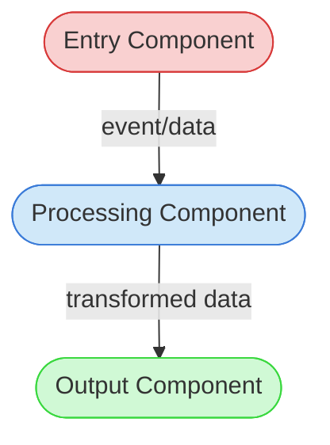

<!--
INTEGRATION NARRATIVE TEMPLATE

Purpose: Documents how 2+ features collaborate in a cross-cutting workflow.
Created by: New-IntegrationNarrative.ps1
Customization guide: process-framework/guides/02-design/integration-narrative-customization-guide.md

Script auto-replaces: [Workflow Name], [Workflow ID], [Description], [Date]
Script auto-adds metadata: workflow_id, workflow_name

CRITICAL: All cross-feature interactions MUST be verified against actual source code.
Do NOT rely solely on TDDs — code may have diverged from design documentation.
Document the actual state (what the code does), not what TDDs claim.
-->

# Integration Narrative: [Workflow Name]

> **Workflow**: [Workflow ID] — [Description]

## Workflow Overview

<!--
Describe the workflow at a high level. Answer these questions:
- What triggers this workflow? (e.g., filesystem event, user action, API call)
- What is the final output? (e.g., updated files, state change, response)
- How many features participate and what is the general flow?
Keep this to 3-5 sentences. The details go in later sections.
-->

**Entry point**: [What triggers the workflow — e.g., "A filesystem event (create, delete, rename) is detected by the watchdog observer"]

**Exit point**: [What the workflow produces — e.g., "All affected file references are updated on disk"]

**Flow summary**: [Brief description of the overall pipeline — e.g., "Events flow from detection through move correlation, reference lookup, and file updating"]

## Participating Features

<!--
List every feature that participates in this workflow.
Use the Feature ID from feature-tracking.md.
The "Role in Workflow" column should describe what this feature contributes
to the cross-cutting flow, not what the feature does in general.
-->

| Feature ID | Feature Name | Role in Workflow |
|-----------|-------------|-----------------|
| [Feature ID] | [Feature Name] | [What this feature contributes to the workflow — e.g., "Detects filesystem events and routes them to appropriate handlers"] |

## Component Interaction Diagram

<!--
Create a Mermaid diagram showing how components from different features connect.
Use the Visual Notation Guide (process-framework/guides/support/visual-notation-guide.md):
  - ([Logic Component]) for business logic
  - [(Data Storage)] for databases/state
  - [/File or Document/] for files
  - --> for direct dependency
  - -.-> for indirect/optional dependency

Label edges with what is passed (data type, event name, callback).
Focus on cross-feature boundaries — internal feature details belong in TDDs.
-->

## Data Flow Sequence

<!--
Document the step-by-step data transformation through the pipeline.
For each step, specify:
1. Which component performs the action
2. What data it receives (type, structure)
3. What it does with the data
4. What data it passes to the next component

This section is the core of the narrative — it should be detailed enough
that someone debugging a cross-feature issue can trace the data path.
Verify each step against actual source code, not just TDDs.
-->

1. **[Component Name]** receives `[data type/structure]`
   - Performs: [what it does — be specific about function/method names]
   - Passes to next: `[output data type/structure]`

2. **[Component Name]** receives `[data type/structure]`
   - Performs: [what it does]
   - Passes to next: `[output data type/structure]`

## Callback/Event Chains

<!--
Document how events propagate across feature boundaries.
Include: callback registrations, event handlers, observer patterns,
signal/slot connections, or any mechanism where one feature triggers
behavior in another feature.

For each chain, specify:
- Where the callback/event is registered (file:line if possible)
- What triggers it
- What happens when it fires
- Which feature boundaries are crossed

If there are no callback/event chains in this workflow, replace with:
"This workflow uses direct function calls between components.
No callback or event chain mechanisms are used."
-->

### [Chain Name]

- **Registration**: [Where and how the callback/handler is registered]
- **Trigger**: [What causes the callback/event to fire]
- **Handler**: [What executes when triggered — include file path]
- **Cross-feature boundary**: [Feature A] → [Feature B]

## Configuration Propagation

<!--
Document which configuration values affect multiple features in this workflow.
For each config value, trace its path from where it's defined to where it's consumed.

If this workflow does not involve shared configuration, replace with:
"Each feature in this workflow uses independent configuration.
No configuration values propagate across feature boundaries."
-->

| Config Value | Source | Consumed By | Effect on Workflow |
|-------------|--------|-------------|-------------------|
| [config key/name] | [where defined — file, env var, CLI arg] | [which features read it] | [how it changes workflow behavior] |

## Error Handling Across Boundaries

<!--
Document how errors in one feature affect others in this workflow.
For each error scenario:
- Where can the error originate?
- How does it propagate across feature boundaries?
- What is the recovery strategy?
- Does the workflow partially complete, fully rollback, or fail silently?

This is critical for debugging — when a user reports an issue in feature C,
understanding that the root cause might be in feature A's error handling
is exactly what this section enables.
-->

### [Error Scenario Name]

- **Origin**: [Which feature/component can produce this error]
- **Propagation**: [How the error travels across feature boundaries — exception, error code, null/empty result]
- **Impact**: [What downstream features do when they receive this error]
- **Recovery**: [How the workflow recovers — retry, skip, abort, partial result]

## TDD/Code Divergence Notes

<!--
Document any discrepancies found between TDD documentation and actual implementation
during the creation of this narrative. Each divergence should also be reported as
technical debt via Update-TechDebt.ps1 (the Integration Narrative Creation task
handles this in Step 7).

If no divergences were found, replace with:
"No divergences found between TDD documentation and source code implementation
for the cross-feature interactions documented in this narrative."
-->

| TDD | Documented Behavior | Actual Code Behavior | Tech Debt ID |
|-----|--------------------|--------------------|-------------|
| [TDD ID] | [What the TDD says] | [What the code actually does] | [PD-TDI-XXX] |

---

*This Integration Narrative was created as part of the Integration Narrative Creation task (PF-TSK-083).*
