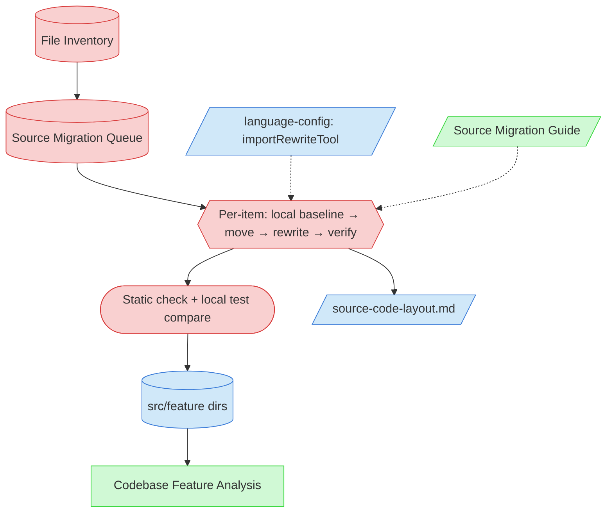

# Codebase Source Migration Context Map

This context map provides a visual guide to the components and relationships relevant to the [Codebase Source Migration task (PF-TSK-091)](../../../tasks/00-setup/codebase-source-migration-task.md).

## Visual Component Diagram

## Essential Components

### Critical Components (Must Understand)
- **File Inventory**: Per-feature tables produced by Discovery (PF-TSK-064); the source of the migration work-list (current path, owning feature, inbound references).
- **Source Migration Queue**: Action-based rows (Move / Split / Co-locate) in the retrospective master state; the per-item work queue.
- **Per-item move loop**: The execution heart — capture the file's local baseline → move → rewrite references (both directions) → verify → record, one item at a time.
- **Static check + local test compare**: The two-layer per-item gate (references resolve; the file's concerning tests match their pre-move baseline).

### Important Components (Should Understand)
- **language-config `importRewriteTool`**: Advisory hint the agent reads to choose the rewrite approach; never executed by a framework script.
- **src/feature dirs**: The scaffolded targets (from `New-SourceStructure.ps1 -Scaffold`) files are moved into.
- **source-code-layout.md**: Directory tree refreshed via `New-SourceStructure.ps1 -Update` as files land.

### Reference Components (Access When Needed)
- **Source Migration Guide (PF-GDE-070)**: Split-boundary decisions, the verification stack, residual-risk caveats.
- **Codebase Feature Analysis (PF-TSK-065)**: Downstream task; runs on the relocated code.

## Key Relationships

1. **File Inventory → Source Migration Queue**: the queue is built from the completed assignment data.
2. **language-config -.-> loop**: optional rewrite-tool hint; absence falls back to manual rewrite + grep.
3. **Verify → src/feature dirs**: an item lands only after it passes the static + local-test gate (the loop captures each file's pre-move baseline internally).
4. **src/feature dirs → Analysis**: the relocated code is what the next onboarding task consumes.

## Implementation in AI Sessions

1. Confirm Discovery is complete, then build the Queue from the File Inventory.
2. Capture the Test Baseline before moving anything.
3. Work the loop item-by-item; verify each against the baseline before advancing.
4. Refresh source-code-layout.md, run the exit gate, hand off to Analysis.

## Related Documentation

- [Codebase Source Migration (PF-TSK-091)](../../../tasks/00-setup/codebase-source-migration-task.md) - The task this map supports
- [Source Migration Guide (PF-GDE-070)](../../../guides/00-setup/source-migration-guide.md) - The companion how-to
- [Visual Notation Guide](../../../guides/support/visual-notation-guide.md) - For interpreting this diagram
