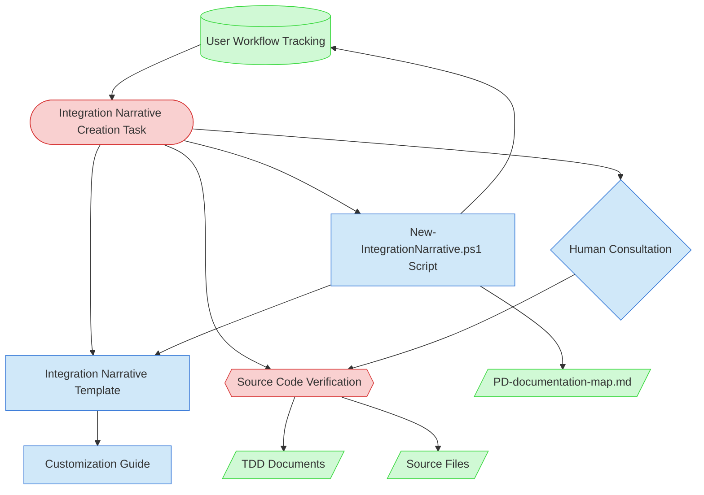

# Integration Narrative Creation Context Map

This context map provides a visual guide to the components and relationships relevant to the Integration Narrative Creation task. Use this map to identify which components require attention and how they interact.

## Visual Component Diagram

## Essential Components

### Critical Components (Must Understand)

- **Integration Narrative Creation Task**: Core task (PF-TSK-083) that orchestrates creation of cross-feature workflow documentation. 13-step process with 2 human checkpoints and mandatory source code verification
- **Source Code Verification**: The narrative must be based on actual source code, not just TDD descriptions. Read the code to verify how features actually interact at runtime

### Important Components (Should Understand)

- **New-IntegrationNarrative.ps1 Script**: Creates narrative files with PD-INT IDs, auto-updates PD-id-registry.json, PD-documentation-map.md, and user-workflow-tracking.md "Integration Doc" column
- **Integration Narrative Template**: Standardized structure with 7 sections: Workflow Overview, Participating Features, Component Interaction Diagram, Data Flow Sequence, Callback/Event Chains, Configuration Propagation, Error Handling
- **Customization Guide**: Step-by-step instructions (PF-GDE-059) for customizing the template with 3 decision points and QA checklist
- **Human Consultation**: Required at 2 checkpoints — after feature inventory (Step 5) and after draft review (Step 12)

### Reference Components (Access When Needed)

- **TDD Documents**: Technical Design Documents for participating features — read for design intent, but verify against source code
- **Source Files**: Actual implementation code in `src/linkwatcher` — the authoritative source for how features interact
- **PD-documentation-map.md**: Auto-updated by script to add narrative entries under "Integration Narratives" section
- **User Workflow Tracking**: Input (which workflow to document) and output (script fills "Integration Doc" column with PD-INT ID)

## Key Relationships

1. **User Workflow Tracking → Task**: Task is triggered when a workflow's required features all reach "Implemented" status
2. **Task → Source Code Verification**: Every claim in the narrative must be verified against actual source code, not assumed from TDDs
3. **Task → Script**: Script creates the narrative file structure with proper PD-INT ID and auto-updates 3 tracking files
4. **Script → Template**: Script populates the template with workflow-specific metadata (name, ID, description)
5. **Template → Customization Guide**: Guide provides 8-step instructions for filling each template section with verified content
6. **Source Code → TDDs**: TDDs provide design context, but divergences from source code are documented as tech debt (not corrected in the narrative)
7. **Human Consultation → Source Code Verification**: Human partner validates feature inventory and reviews narrative accuracy at 2 checkpoints

## Implementation in AI Sessions

1. **Start with User Workflow Tracking**: Identify the workflow to document and confirm all required features are implemented
2. **Run New-IntegrationNarrative.ps1**: Create the narrative file with proper PD-INT ID and auto-updates
3. **Follow Customization Guide**: Use PF-GDE-059 step-by-step instructions to customize each template section
4. **Read Source Code First**: For each participating feature, read the actual implementation before writing narrative content
5. **Checkpoint 1**: Present feature inventory and interaction points to human partner for review (Step 5)
6. **Cross-reference TDDs**: Compare source code behavior against TDD descriptions; document divergences in Section 8
7. **Checkpoint 2**: Present completed narrative draft to human partner for accuracy review (Step 12)
8. **Report Tech Debt**: Use `Update-TechDebt.ps1` to report any TDD/code divergences found during verification

## Related Documentation

- [Integration Narrative Creation Task](../../../tasks/02-design/integration-narrative-creation.md) - Complete task definition with Integration Architect role and 13-step process
- [Integration Narrative Template](../../../templates/02-design/integration-narrative-template.md) - Standardized template for cross-feature workflow documentation
- [Integration Narrative Customization Guide](../../../guides/02-design/integration-narrative-customization-guide.md) - Step-by-step customization instructions with QA checklist
- [New-IntegrationNarrative.ps1 Script](../../../scripts/file-creation/02-design/New-IntegrationNarrative.ps1) - Script for creating narrative documents with PD-INT IDs
- [User Workflow Tracking](../../../../doc/state-tracking/permanent/user-workflow-tracking.md) - Workflow-to-feature mapping and integration doc tracking
- [Visual Notation Guide](../../../guides/support/visual-notation-guide.md) - Standard notation used in diagrams

---

_This context map provides a complete view of the Integration Narrative Creation task ecosystem. The key differentiator from other design tasks is the mandatory source code verification — narratives document how features actually interact, not how they were designed to interact._
