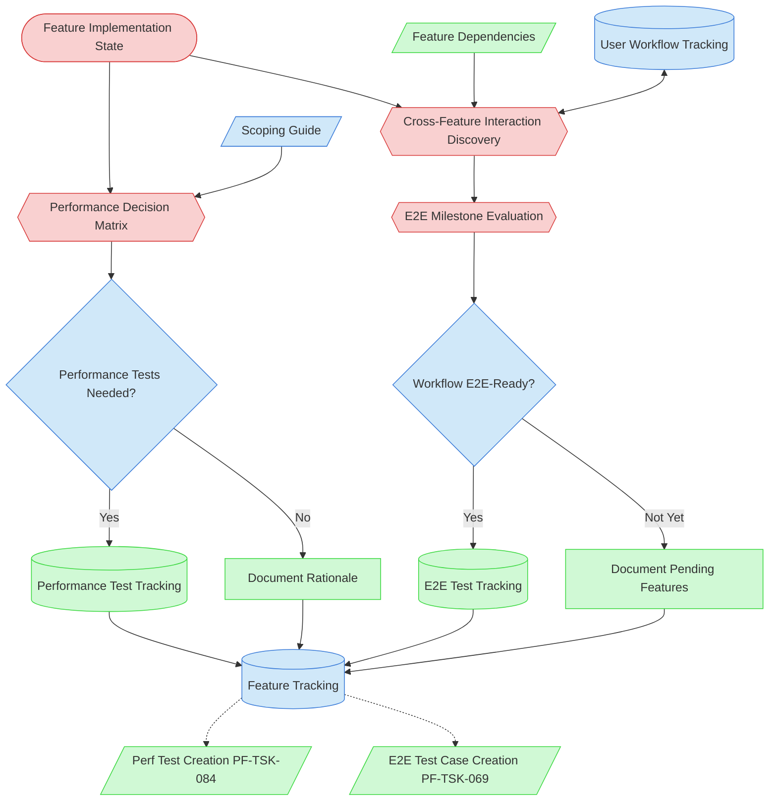

# Performance & E2E Test Scoping Context Map

This context map provides a visual guide to the components and relationships relevant to the Performance & E2E Test Scoping task. Use this map to understand how the scoping task bridges Code Review and Completed status by evaluating performance and E2E test needs.

## Visual Component Diagram

## Essential Components

### Critical Components (Must Understand)

- **Feature Implementation State**: The feature's state file documenting what code was changed — the primary input for both scoping evaluations
- **Performance Decision Matrix**: Systematic evaluation of whether the feature's code changes trigger performance test needs at any of the 4 levels (Component, Operation, Scale, Resource)
- **Cross-Feature Interaction Discovery**: Evaluation of feature dependencies and integration points to identify E2E-worthy scenarios not yet tracked in user-workflow-tracking.md. Newly discovered scenarios are added to the tracking file before milestone evaluation.
- **E2E Milestone Evaluation**: Assessment of whether completing this feature makes any user workflow E2E-ready (all required features implemented) — covers both previously tracked and newly discovered workflows

### Important Components (Should Understand)

- **Scoping Guide**: [Performance & E2E Test Scoping Guide](/process-framework/guides/03-testing/performance-and-e2e-test-scoping-guide.md) containing the decision matrix, E2E evaluation process, and worked examples
- **User Workflow Tracking**: Workflow-to-feature mappings — read during E2E evaluation and written to when untracked cross-feature scenarios are discovered (bidirectional relationship)
- **Performance Tests Needed?**: Decision point — results in new `⬜ Needs Creation` entries in performance-test-tracking.md or documented "not needed" rationale
- **Workflow E2E-Ready?**: Decision point — results in new entries in e2e-test-tracking.md or documentation of which features are still pending
- **Feature Tracking**: The state file updated from `🔎 Needs Test Scoping` to `🟢 Completed` upon task completion

### Reference Components (Access When Needed)

- **Feature Dependencies**: Dependency graph showing which features interact
- **Performance Test Tracking**: Registry where new performance test entries are added
- **E2E Test Tracking**: Registry where new E2E test entries are added
- **Performance Test Creation (PF-TSK-084)**: Downstream task that implements performance tests from `⬜ Needs Creation` entries
- **E2E Test Case Creation (PF-TSK-069)**: Downstream task that creates E2E test cases for newly E2E-ready workflows

## Key Relationships

1. **Code Review (PF-TSK-005) → This Task**: Code Review sets feature status to `🔎 Needs Test Scoping`, triggering this task
2. **This Task → Feature Tracking**: Updates feature from `🔎 Needs Test Scoping` to `🟢 Completed`
3. **This Task → Performance Test Tracking**: Adds `⬜ Needs Creation` entries when performance tests are needed
4. **This Task → E2E Test Tracking**: Adds entries when a workflow becomes E2E-ready
5. **Performance Test Tracking → PF-TSK-084**: New `⬜ Needs Creation` entries trigger Performance Test Creation
6. **E2E Test Tracking → PF-TSK-069**: New entries trigger E2E Test Case Creation
