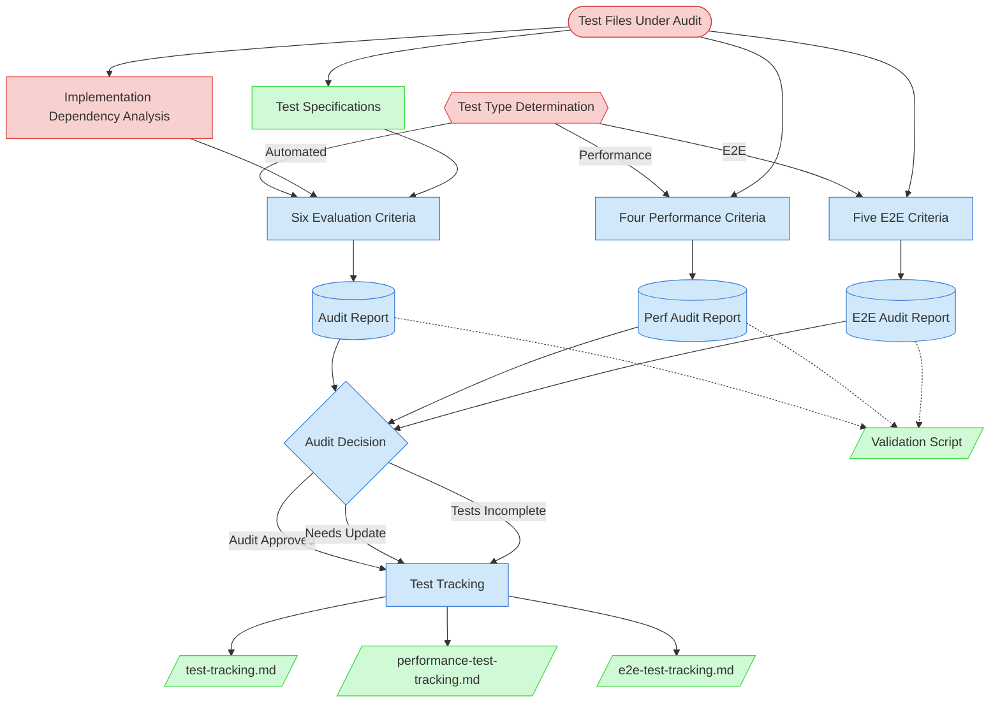

# Test Audit Context Map

This context map provides a visual guide to the components and relationships relevant to the Test Audit task. Use this map to identify which components require attention during systematic test quality assessment and how they interact in the audit workflow.

## Visual Component Diagram

## Essential Components

### Critical Components (Must Understand)

- **Test Type Determination**: First step — determines which criteria set and tracking file to use (Automated, Performance, or E2E)
- **Test Files Under Audit**: The actual test implementation files being evaluated for quality
- **Implementation Dependency Analysis**: Pre-audit assessment of what can actually be tested vs missing dependencies (Automated type only)

### Important Components (Should Understand)

- **Six Evaluation Criteria** (Automated): Purpose Fulfillment, Coverage Completeness (implementable scenarios), Test Quality & Structure, Performance & Efficiency, Maintainability, Integration Alignment
- **Four Performance Criteria** (Performance): Measurement Methodology, Tolerance Appropriateness, Baseline Readiness, Regression Detection Config
- **Five E2E Criteria** (E2E): Fixture Correctness, Scenario Completeness, Expected Outcome Accuracy, Reproducibility, Precondition Coverage
- **Test Specifications**: Original test specifications that define expected test behavior and coverage
- **Audit Reports**: Type-specific audit documentation — standard audit report (Automated), performance audit report, or E2E audit report
- **Audit Decision**: Three possible outcomes (Audit Approved, Needs Update, Tests Incomplete)
- **Test Tracking**: Type-specific tracking files — test-tracking.md (Automated), performance-test-tracking.md (Performance), e2e-test-tracking.md (E2E)

### Reference Components (Access When Needed)

- **Tracking Files**: test-tracking.md, performance-test-tracking.md, e2e-test-tracking.md — type-specific Audit Status and Audit Report columns
- **Validation Script**: Automated validation tool with type-specific section validation

## Key Relationships

1. **Test Type Determination → Criteria Set**: The test type routes to the appropriate criteria set — six criteria for Automated, four for Performance, five for E2E
2. **Test Files → Type-Specific Criteria**: Test files are evaluated against the criteria matching their type
3. **Criteria + Context → Audit Report**: Assessment results combine with type-specific context to create the appropriate audit report
4. **Audit Report → Type-Specific Tracking**: Audit decisions update the correct tracking file's Audit Status column (test-tracking.md, performance-test-tracking.md, or e2e-test-tracking.md)
5. **Audit Decision → Downstream Gate**: `✅ Audit Approved` status is a hard prerequisite for Performance Baseline Capture (PF-TSK-085) and E2E Test Execution (PF-TSK-070) for newly created tests
6. **Audit Report -.-> Validation Script**: Type-aware validation ensures the correct criteria sections are present

## Implementation in AI Sessions

1. **Test Type Determination**: Identify the test type (Automated, Performance, or E2E) — this determines criteria, template, and tracking file
2. **Preparation Phase**: Examine test files under audit and their corresponding specifications/tracking entries
3. **Context Gathering**: Load type-specific context (test specs for Automated; performance-test-tracking.md for Performance; e2e-test-tracking.md for E2E)
4. **Systematic Evaluation**: Apply the type-specific criteria set to the test files
5. **Documentation Phase**: Create audit report using the correct template (standard, performance, or E2E)
6. **Decision Making**: Make audit decision based on evaluation results
7. **Tracking Updates**: Update the type-specific tracking file with audit results and Audit Status column
8. **Validation**: Use validation script (auto-detects type) to ensure audit report completeness

## Related Documentation

- [Test Audit Task Definition](../../../tasks/03-testing/test-audit-task.md) - Complete task specification and process (supports Automated, Performance, and E2E test types)
- [Test Audit Usage Guide](../../../guides/03-testing/test-audit-usage-guide.md) - Step-by-step instructions for conducting audits with type-specific criteria sections
- **Tracking Files**:
  - [Test Tracking](../../../../test/state-tracking/permanent/test-tracking.md) - Automated test status tracking
  - [Performance Test Tracking](../../../../test/state-tracking/permanent/performance-test-tracking.md) - Performance test status with Audit Status/Report columns
  - [E2E Test Tracking](../../../../test/state-tracking/permanent/e2e-test-tracking.md) - E2E test status with Audit Status/Report columns
- **Audit Report Templates**:
  - [Test Audit Report Template](../../../templates/03-testing/test-audit-report-template.md) - Automated test audit (6 criteria)
  - [Performance Test Audit Report Template](../../../templates/03-testing/performance-test-audit-report-template.md) - Performance test audit (4 criteria)
  - [E2E Test Audit Report Template](../../../templates/03-testing/e2e-test-audit-report-template.md) - E2E test audit (5 criteria)
- **Scripts**:
  - [New-TestAuditReport.ps1](../../../scripts/file-creation/03-testing/New-TestAuditReport.ps1) - Audit report creation with `-TestType` routing
  - [Validate-AuditReport.ps1](../../../scripts/validation/Validate-AuditReport.ps1) - Type-aware audit report validation
  - [Update-TestFileAuditState.ps1](../../../scripts/update/Update-TestFileAuditState.ps1) - Multi-tracking-file audit status updates
  - [New-AuditTracking.ps1](../../../scripts/file-creation/03-testing/New-AuditTracking.ps1) - Type-specific audit tracking state files

---

_Note: This context map highlights only the components relevant to the Test Audit task. For a comprehensive view of all test-related components and their relationships, refer to the tracking files listed above and the [Test Query Tool](/process-framework/scripts/test/test_query.py)._
