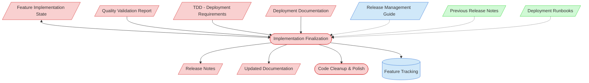

# Implementation Finalization Context Map

This context map provides a visual guide to the components and relationships relevant to the Implementation Finalization task (PF-TSK-055). Use this map to identify which components require attention and how they interact.

## Visual Component Diagram



## Essential Components

### Critical Components (Must Understand)
- **Feature Implementation State**: Complete implementation history, code inventory, and context from all prior tasks
- **Quality Validation Report**: Results from PF-TSK-054 confirming production readiness and listing any remaining issues
- **TDD (Deployment Requirements)**: Deployment procedures, environment requirements, and acceptance criteria for release
- **Deployment Documentation**: Project-specific deployment guides, CI/CD pipelines, and release procedures
- **Release Notes**: Output artifact summarizing feature changes, known issues, and upgrade instructions
- **Updated Documentation**: Final documentation updates (API docs, user guides, architecture docs)
- **Code Cleanup & Polish**: Final code quality pass — dead code removal, comment cleanup, formatting

### Important Components (Should Understand)
- **Feature Tracking**: Central feature status document — updated to final status upon completion
- **Release Management Guide**: Versioning strategy, branching model, and release cycles

### Reference Components (Access When Needed)
- **Previous Release Notes**: Historical format and content examples for consistency
- **Deployment Runbooks**: Operational procedures for deployment execution

## Key Relationships

1. **Quality Validation Report → Finalization**: Validation results confirm readiness and flag any remaining items to address
2. **TDD + Deployment Docs → Finalization**: Define deployment procedures, environment requirements, and rollback strategies
3. **Finalization ↔ Feature State**: Bidirectional — reads full implementation context, writes final status and completion notes
4. **Finalization → Release Notes**: Produces release documentation from accumulated implementation context
5. **Finalization → Feature Tracking**: Updates feature to its final status (e.g., "Ready for Release")
6. **Finalization → Code Cleanup**: Final polish pass before handoff to deployment

## Task Position in Implementation Chain

```
Feature Implementation Planning (PF-TSK-044)
  ↓
Data Layer Implementation (PF-TSK-051)
  ↓
State Management Implementation (PF-TSK-056)
  ↓
UI Implementation (PF-TSK-052)
  ↓
Integration & Testing (PF-TSK-053)
  ↓
Quality Validation (PF-TSK-054)
  ↓
★ Implementation Finalization (PF-TSK-055) ← THIS TASK
  ↓
Release & Deployment (PF-TSK-016)
```

## Related Documentation

- [Task Definition](/process-framework/tasks/04-implementation/implementation-finalization.md) - Full process steps and checklist
- [Definition of Done](/process-framework/guides/04-implementation/definition-of-done.md) - Completion criteria
- [Release Deployment Task](/process-framework/tasks/07-deployment/release-deployment-task.md) - Next task in workflow

---
