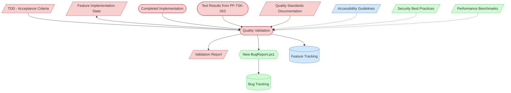

# Quality Validation Context Map

This context map provides a visual guide to the components and relationships relevant to the Quality Validation task (PF-TSK-054). Use this map to identify which components require attention and how they interact.

## Visual Component Diagram



## Essential Components

### Critical Components (Must Understand)
- **TDD (Acceptance Criteria)**: Quality requirements, performance targets, and business validation rules that define "done"
- **Feature Implementation State**: Tracks implementation progress and provides context from all prior implementation tasks
- **Completed Implementation**: All code from PF-TSK-051 (data layer), PF-TSK-056 (state), and PF-TSK-052 (UI) being validated
- **Test Results**: Test outcomes from Integration & Testing (PF-TSK-053) confirming functional coverage
- **Quality Standards Documentation**: Project-specific code quality standards, performance benchmarks, and security requirements
- **Validation Report**: Output artifact documenting validation findings, pass/fail results, and remaining issues

### Important Components (Should Understand)
- **Feature Tracking**: Central feature status document — updated to reflect validation outcome
- **Accessibility Guidelines**: WCAG 2.1 standards for accessibility compliance checks

### Reference Components (Access When Needed)
- **Security Best Practices**: OWASP guidelines for application security validation
- **Performance Benchmarks**: Historical performance data for comparison against current implementation
- **Bug Tracking / New-BugReport.ps1**: For documenting defects found during validation

## Key Relationships

1. **TDD → Quality Validation**: Acceptance criteria define the validation checklist and success thresholds
2. **Completed Implementation + Test Results → Quality Validation**: The code and test outcomes being validated
3. **Quality Validation ↔ Feature State**: Bidirectional — reads implementation context, writes validation results
4. **Quality Validation → Validation Report**: Produces the formal validation artifact consumed by Implementation Finalization
5. **Quality Validation → Bug Report**: Defects found during validation are formally reported for triage
6. **Quality Standards → Quality Validation**: Project standards provide the benchmarks validation is measured against

## Task Position in Implementation Chain

```
Feature Implementation Planning (PF-TSK-044)
  ↓
Data Layer Implementation (PF-TSK-051)
  ↓
State Management Implementation (PF-TSK-056)
  ↓
UI Implementation (PF-TSK-052)
  ↓
Integration & Testing (PF-TSK-053)
  ↓
★ Quality Validation (PF-TSK-054) ← THIS TASK
  ↓
Implementation Finalization (PF-TSK-055)
```

## Related Documentation

- [Task Definition](/process-framework/tasks/04-implementation/quality-validation.md) - Full process steps and checklist
- [Definition of Done](/process-framework/guides/04-implementation/definition-of-done.md) - Completion criteria
- [Bug Reporting Guide](/process-framework/guides/06-maintenance/bug-reporting-guide.md) - Bug documentation standards

---
