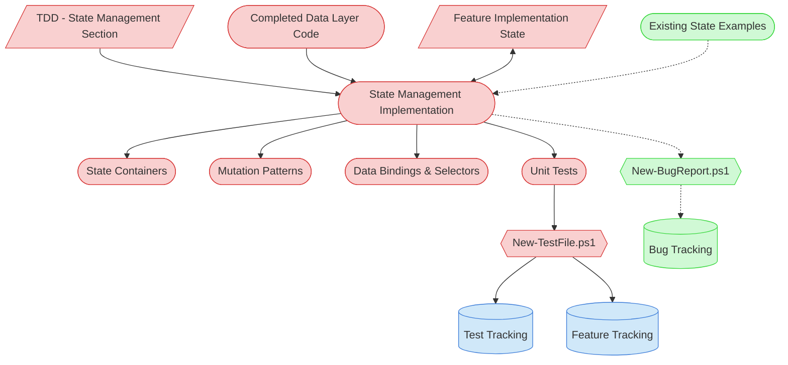

# State Management Implementation Context Map

This context map provides a visual guide to the components and relationships relevant to the State Management Implementation task (PF-TSK-056). Use this map to identify which components require attention and how they interact.

## Visual Component Diagram



## Essential Components

### Critical Components (Must Understand)
- **TDD (State Management Section)**: State container architecture, state flow patterns, and technology-specific conventions
- **Completed Data Layer Code**: Repository implementations and data models from PF-TSK-051 that state containers wrap
- **Feature Implementation State**: Tracks implementation progress, code inventory, and task completion across the feature lifecycle
- **State Containers**: State objects managing application data, loading states, and error handling
- **Mutation Patterns**: Actions, reducers, or methods that modify state in predictable ways
- **Data Bindings & Selectors**: Interfaces exposing state to the UI layer and transforming raw state into view models
- **Unit Tests**: Test files created via `New-TestFile.ps1` with pytest markers for automated tracking

### Important Components (Should Understand)
- **Feature Tracking**: Central feature status document — updated upon task completion
- **Test Tracking**: Automatically updated by `New-TestFile.ps1` with test file links and status

### Reference Components (Access When Needed)
- **Existing State Management Examples**: Similar state implementations in codebase for pattern consistency
- **Bug Tracking / New-BugReport.ps1**: For documenting bugs discovered but not fixed in this session

## Key Relationships

1. **TDD → State Management Implementation**: State management design section defines container architecture, flow patterns, and conventions
2. **Data Layer → State Management Implementation**: Repository interfaces and data models provide the data operations that state containers orchestrate
3. **State Management Implementation ↔ Feature State**: Bidirectional — reads context and prior task output, writes progress and code inventory
4. **State Management → Data Bindings**: Containers expose selectors and bindings consumed by the UI layer (PF-TSK-052)
5. **Unit Tests → New-TestFile.ps1**: All test files created through automation for proper tracking
6. **State Management -.-> Bug Report**: Optional — only when bugs are discovered that won't be fixed in this session

## Task Position in Implementation Chain

```
Feature Implementation Planning (PF-TSK-044)
  ↓
Data Layer Implementation (PF-TSK-051)
  ↓
★ State Management Implementation (PF-TSK-056) ← THIS TASK
  ↓
UI Implementation (PF-TSK-052)
  ↓
Integration & Testing (PF-TSK-053)
  ↓
Quality Validation (PF-TSK-054)
  ↓
Implementation Finalization (PF-TSK-055)
```

## Related Documentation

- [Task Definition](/process-framework/tasks/04-implementation/state-management-implementation.md) - Full process steps and checklist
- [Development Guide](/process-framework/guides/04-implementation/development-guide.md) - Coding best practices
- [Definition of Done](/process-framework/guides/04-implementation/definition-of-done.md) - Completion criteria
- [Bug Reporting Guide](/process-framework/guides/06-maintenance/bug-reporting-guide.md) - Bug documentation standards

---
