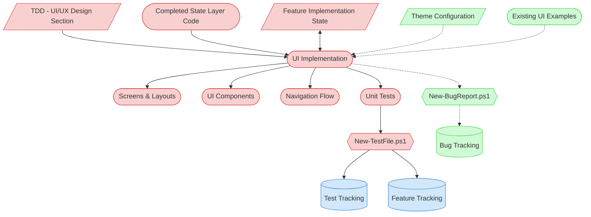

# UI Implementation Context Map

This context map provides a visual guide to the components and relationships relevant to the UI Implementation task (PF-TSK-052). Use this map to identify which components require attention and how they interact.

## Visual Component Diagram



## Essential Components

### Critical Components (Must Understand)
- **TDD (UI/UX Design Section)**: Screen layouts, component hierarchy, navigation flow, and technology-specific UI patterns
- **Completed State Layer Code**: State management implementations from PF-TSK-056 providing data and actions the UI consumes
- **Feature Implementation State**: Tracks implementation progress, code inventory, and task completion across the feature lifecycle
- **Screens & Layouts**: Screen-level compositions that arrange UI components into complete views
- **UI Components**: Reusable and screen-specific widgets, inputs, and display elements
- **Navigation Flow**: Routing, navigation stack, and screen transitions
- **Unit Tests**: Test files created via `New-TestFile.ps1` with pytest markers for automated tracking

### Important Components (Should Understand)
- **Feature Tracking**: Central feature status document — updated upon task completion
- **Test Tracking**: Automatically updated by `New-TestFile.ps1` with test file links and status

### Reference Components (Access When Needed)
- **Theme Configuration**: App-wide theme settings, style constants, and design tokens
- **Existing UI Examples**: Similar UI implementations in codebase for pattern consistency
- **Bug Tracking / New-BugReport.ps1**: For documenting bugs discovered but not fixed in this session

## Key Relationships

1. **TDD → UI Implementation**: UI/UX design section defines screen layouts, component hierarchy, and navigation patterns
2. **State Layer → UI Implementation**: Completed state containers provide data bindings and action dispatchers the UI connects to
3. **UI Implementation ↔ Feature State**: Bidirectional — reads context and prior task output, writes progress and code inventory
4. **Unit Tests → New-TestFile.ps1**: All test files created through automation for proper tracking
5. **New-TestFile.ps1 → Tracking Files**: Script auto-updates test-tracking.md and feature-tracking.md
6. **UI Implementation -.-> Bug Report**: Optional — only when bugs are discovered that won't be fixed in this session

## Task Position in Implementation Chain

```
Feature Implementation Planning (PF-TSK-044)
  ↓
Data Layer Implementation (PF-TSK-051)
  ↓
State Management Implementation (PF-TSK-056)
  ↓
★ UI Implementation (PF-TSK-052) ← THIS TASK
  ↓
Integration & Testing (PF-TSK-053)
  ↓
Quality Validation (PF-TSK-054)
  ↓
Implementation Finalization (PF-TSK-055)
```

## Related Documentation

- [Task Definition](/process-framework/tasks/04-implementation/ui-implementation.md) - Full process steps and checklist
- [Development Guide](/process-framework/guides/04-implementation/development-guide.md) - Coding best practices
- [Definition of Done](/process-framework/guides/04-implementation/definition-of-done.md) - Completion criteria
- [Bug Reporting Guide](/process-framework/guides/06-maintenance/bug-reporting-guide.md) - Bug documentation standards

---
