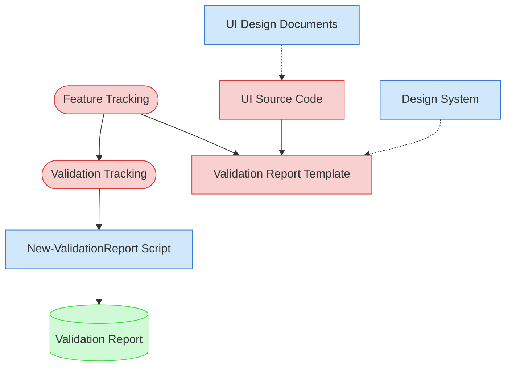

# Accessibility / UX Compliance Validation Context Map

This context map provides a visual guide to the components and relationships relevant to the Accessibility / UX Compliance Validation task. Use this map to identify which components require attention and how they interact.

## Visual Component Diagram

## Essential Components

### Critical Components (Must Understand)

- **Feature Tracking**: Current status and details of features to be validated
- **Validation Tracking**: Active validation tracking matrix tracking progress across all validation types
- **Validation Report Template**: Standardized template for creating accessibility validation reports
- **UI Source Code**: UI components and layouts to analyze for accessibility compliance, keyboard navigation, and semantic structure

### Important Components (Should Understand)

- **UI Design Documents**: UI/UX design specifications that define accessibility requirements and interaction patterns
- **Design System**: Component library documentation and established accessibility patterns
- **New-ValidationReport Script**: Automation tool for generating validation reports

### Reference Components (Access When Needed)

- **Validation Report**: Final output document with accessibility scoring and findings

## Key Relationships

1. **Feature Tracking → Validation Tracking**: Feature status determines which features are ready for validation
2. **Feature Tracking → Validation Report Template**: Feature details populate the validation report structure
3. **UI Source Code → Validation Report Template**: Accessibility analysis of UI code provides validation findings
4. **UI Design Documents -.-> UI Source Code**: Design specs define intended accessibility behavior to validate
5. **Design System -.-> Validation Report Template**: Design system patterns provide accessibility baseline standards
6. **Validation Tracking → New-ValidationReport Script**: Matrix tracking guides report generation parameters

## Implementation in AI Sessions

1. Begin by examining **Feature Tracking** and **Validation Tracking** to identify validation scope
2. Review **UI Design Documents** for accessibility requirements and WCAG compliance targets
3. Load **UI Source Code** for selected features to analyze semantic structure and interaction patterns
4. Reference **Design System** for established accessibility patterns and standards
5. Use **New-ValidationReport Script** to generate standardized validation reports
6. Update **Validation Tracking** matrix with completed validation results

## Related Documentation

- [Accessibility / UX Compliance Validation Task](../../../tasks/05-validation/accessibility-ux-compliance-validation.md) - Complete task definition and process
- [Feature Tracking](../../../../doc/state-tracking/permanent/feature-tracking.md) - Current status of features
- Validation Tracking State File - Active validation tracking matrix (file location depends on validation round)

---
