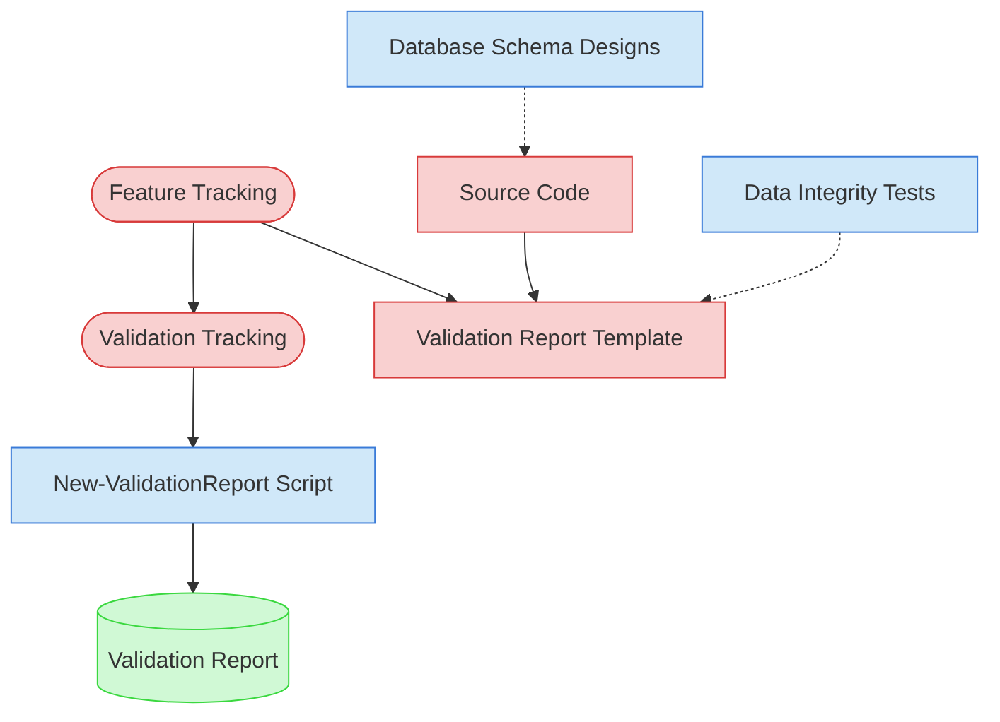

# Data Integrity Validation Context Map

This context map provides a visual guide to the components and relationships relevant to the Data Integrity Validation task. Use this map to identify which components require attention and how they interact.

## Visual Component Diagram

## Essential Components

### Critical Components (Must Understand)

- **Feature Tracking**: Current status and details of features to be validated
- **Validation Tracking**: Active validation tracking matrix tracking progress across all validation types
- **Validation Report Template**: Standardized template for creating data integrity validation reports
- **Source Code**: Feature implementations to analyze for data consistency, constraint enforcement, and recovery patterns

### Important Components (Should Understand)

- **Database Schema Designs**: Data model specifications that define expected constraints and relationships
- **Data Integrity Tests**: Existing tests for data validation, edge cases, and error recovery
- **New-ValidationReport Script**: Automation tool for generating validation reports

### Reference Components (Access When Needed)

- **Validation Report**: Final output document with data integrity scoring and findings

## Key Relationships

1. **Feature Tracking → Validation Tracking**: Feature status determines which features are ready for validation
2. **Feature Tracking → Validation Report Template**: Feature details populate the validation report structure
3. **Source Code → Validation Report Template**: Data integrity analysis of source code provides validation findings
4. **Database Schema Designs -.-> Source Code**: Schema designs define expected data constraints to validate in code
5. **Data Integrity Tests -.-> Validation Report Template**: Existing test coverage reveals data integrity gaps
6. **Validation Tracking → New-ValidationReport Script**: Matrix tracking guides report generation parameters

## Implementation in AI Sessions

1. Begin by examining **Feature Tracking** and **Validation Tracking** to identify validation scope
2. Review **Database Schema Designs** for expected data constraints and relationships
3. Load **Source Code** for selected features to analyze data handling patterns
4. Check **Data Integrity Tests** for existing coverage and gaps
5. Use **New-ValidationReport Script** to generate standardized validation reports
6. Update **Validation Tracking** matrix with completed validation results

## Related Documentation

- [Data Integrity Validation Task](../../../tasks/05-validation/data-integrity-validation.md) - Complete task definition and process
- [Feature Tracking](../../../../doc/product-docs/state-tracking/permanent/feature-tracking.md) - Current status of features
- Validation Tracking State File - Active validation tracking matrix (file location depends on validation round)

---
