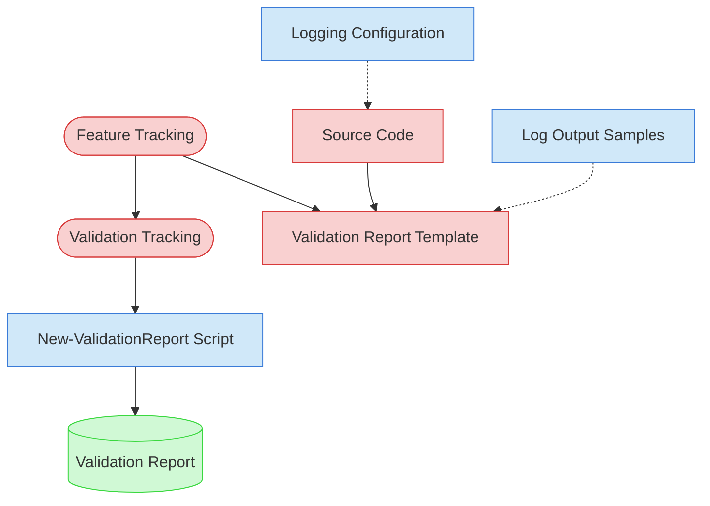

# Observability Validation Context Map

This context map provides a visual guide to the components and relationships relevant to the Observability Validation task. Use this map to identify which components require attention and how they interact.

## Visual Component Diagram

## Essential Components

### Critical Components (Must Understand)

- **Feature Tracking**: Current status and details of features to be validated
- **Validation Tracking**: Active validation tracking matrix tracking progress across all validation types
- **Validation Report Template**: Standardized template for creating observability validation reports
- **Source Code**: Feature implementations to analyze for logging coverage, structured formats, and diagnostic context

### Important Components (Should Understand)

- **Logging Configuration**: Logging framework configuration files and log format definitions
- **Log Output Samples**: Sample log files for analyzing actual logging behavior and completeness
- **New-ValidationReport Script**: Automation tool for generating validation reports

### Reference Components (Access When Needed)

- **Validation Report**: Final output document with observability scoring and findings

## Key Relationships

1. **Feature Tracking → Validation Tracking**: Feature status determines which features are ready for validation
2. **Feature Tracking → Validation Report Template**: Feature details populate the validation report structure
3. **Source Code → Validation Report Template**: Logging analysis of source code provides validation findings
4. **Logging Configuration -.-> Source Code**: Configuration defines how logging is structured across the codebase
5. **Log Output Samples -.-> Validation Report Template**: Actual log output reveals coverage gaps and format issues
6. **Validation Tracking → New-ValidationReport Script**: Matrix tracking guides report generation parameters

## Implementation in AI Sessions

1. Begin by examining **Feature Tracking** and **Validation Tracking** to identify validation scope
2. Review **Logging Configuration** to understand the logging framework and conventions
3. Load **Source Code** for selected features to analyze logging coverage and structured formats
4. Examine **Log Output Samples** to verify actual logging behavior
5. Use **New-ValidationReport Script** to generate standardized validation reports
6. Update **Validation Tracking** matrix with completed validation results

## Related Documentation

- [Observability Validation Task](../../../tasks/05-validation/observability-validation.md) - Complete task definition and process
- [Feature Tracking](../../../../doc/state-tracking/permanent/feature-tracking.md) - Current status of features
- Validation Tracking State File - Active validation tracking matrix (file location depends on validation round)

---
