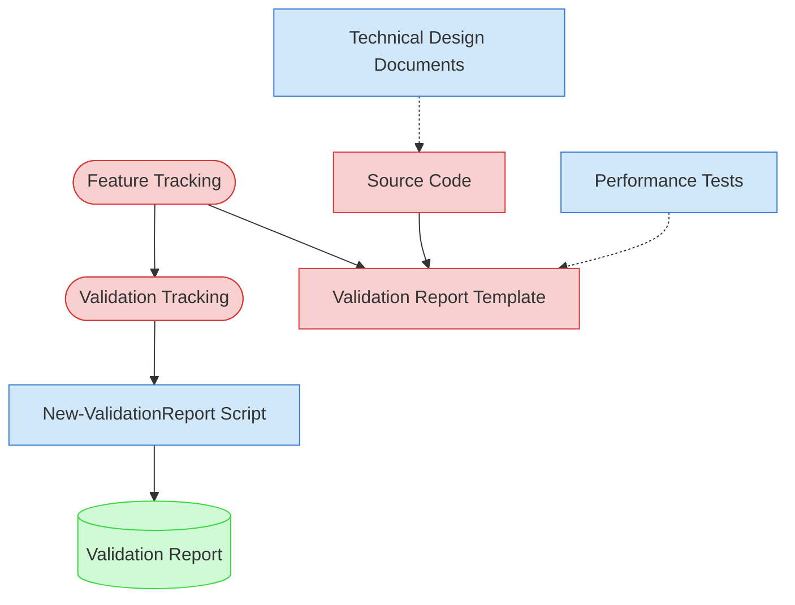

# Performance & Scalability Validation Context Map

This context map provides a visual guide to the components and relationships relevant to the Performance & Scalability Validation task. Use this map to identify which components require attention and how they interact.

## Visual Component Diagram

## Essential Components

### Critical Components (Must Understand)

- **Feature Tracking**: Current status and details of features to be validated
- **Validation Tracking**: Active validation tracking matrix tracking progress across all validation types
- **Validation Report Template**: Standardized template for creating performance validation reports
- **Source Code**: Feature implementations to analyze for algorithmic complexity, resource usage, and scalability patterns

### Important Components (Should Understand)

- **Technical Design Documents**: Performance requirements and design constraints from feature specifications
- **Performance Tests**: Existing performance/benchmark tests for baseline comparison
- **New-ValidationReport Script**: Automation tool for generating validation reports

### Reference Components (Access When Needed)

- **Validation Report**: Final output document with performance scoring and findings

## Key Relationships

1. **Feature Tracking → Validation Tracking**: Feature status determines which features are ready for validation
2. **Feature Tracking → Validation Report Template**: Feature details populate the validation report structure
3. **Source Code → Validation Report Template**: Performance analysis of source code provides validation findings
4. **Technical Design Documents -.-> Source Code**: TDD performance requirements inform what to validate in source code
5. **Performance Tests -.-> Validation Report Template**: Existing benchmark results provide baseline data for report
6. **Validation Tracking → New-ValidationReport Script**: Matrix tracking guides report generation parameters

## Implementation in AI Sessions

1. Begin by examining **Feature Tracking** and **Validation Tracking** to identify validation scope
2. Review **Technical Design Documents** for performance requirements and constraints
3. Load **Source Code** for selected features to analyze algorithmic complexity and resource patterns
4. Check **Performance Tests** for existing benchmarks and coverage
5. Use **New-ValidationReport Script** to generate standardized validation reports
6. Update **Validation Tracking** matrix with completed validation results

## Related Documentation

- [Performance & Scalability Validation Task](../../../tasks/05-validation/performance-scalability-validation.md) - Complete task definition and process
- [Feature Tracking](../../../../doc/product-docs/state-tracking/permanent/feature-tracking.md) - Current status of features
- Validation Tracking State File - Active validation tracking matrix (file location depends on validation round)

---
