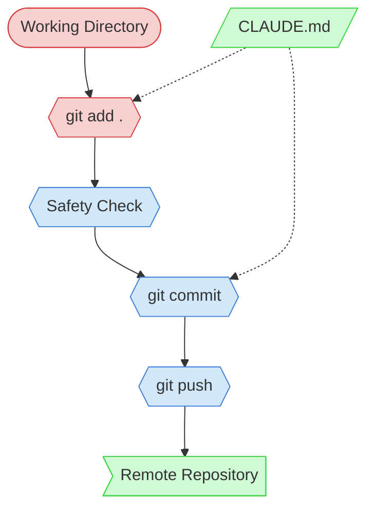

# Git Commit and Push Context Map

This context map provides a visual guide to the components and relationships relevant to the Git Commit and Push task.

## Visual Component Diagram

## Essential Components

### Critical Components (Must Understand)
- **Working Directory**: The current project directory — defines the scope of what gets staged
- **git add .**: Stages only files within the working directory — never parent or sibling paths

### Important Components (Should Understand)
- **Safety Check**: Scans staged files for sensitive content (.env, keys, credentials)
- **git commit**: Creates a descriptive commit message summarizing the changes
- **git push**: Pushes the commit to the remote — never force-pushes without permission

### Reference Components (Access When Needed)
- **Remote Repository**: The GitHub remote (origin)
- **CLAUDE.md**: Project-level git constraints (prohibited commands like `git stash`, `git reset --hard`)

## Key Relationships

1. **Working Directory → git add .**: Only the current directory is staged — the repo root may be broader
2. **Safety Check → git commit**: Commit only proceeds if no sensitive files are detected
3. **CLAUDE.md -.-> git add / git commit**: Project rules constrain which git operations are allowed

---
