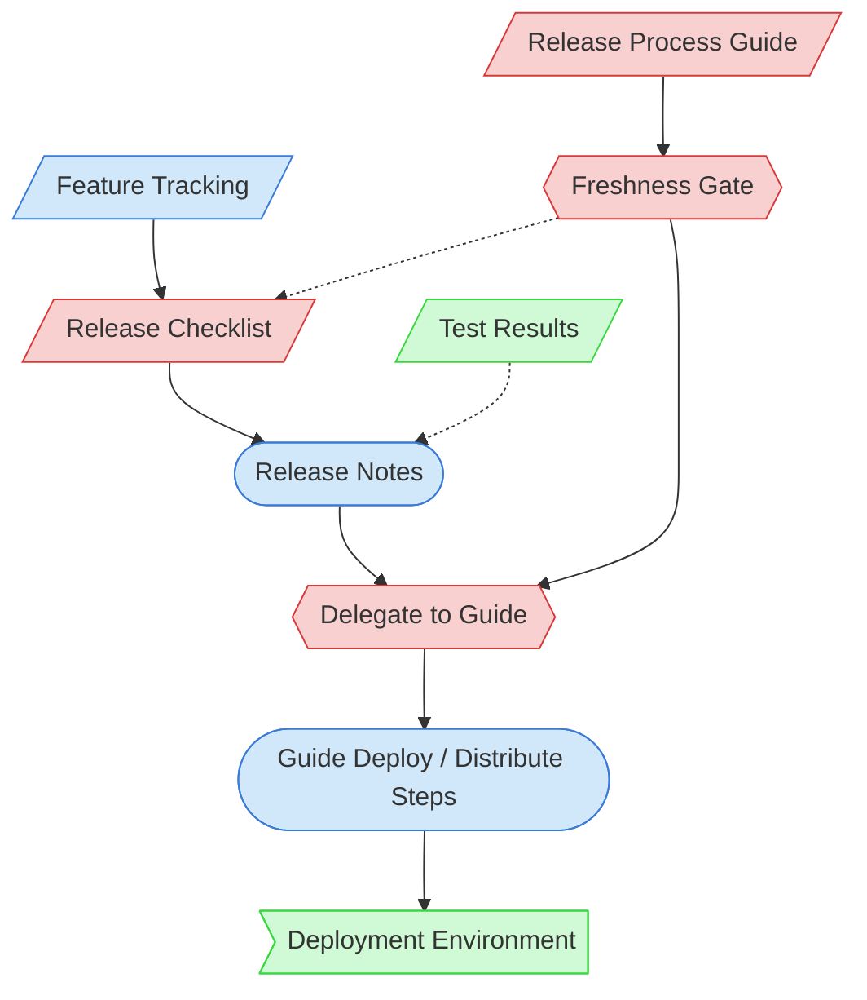

# Release & Deployment Context Map

This context map provides a visual guide to the components and relationships relevant to the Release & Deployment task. Use this map to identify which components require attention and how they interact.

> **Seam note (Per-Project Release Process Guide extension)**: The agnostic Release & Deployment task runs the generalizable release gates, **gates on the project's Release Process Guide freshness**, then **delegates** the project-specific deploy / version / distribute mechanics to that guide. This task detects guide staleness but never authors the guide.

## Visual Component Diagram

## Essential Components

### Critical Components (Must Understand)
- **Release Checklist**: Standardized checklist for the agnostic release gates (scope, user-doc, version, notes, test sweep, perf, E2E)
- **Release Process Guide** (`doc/ci-cd/release-process.md`, `PD-CIC`): The per-project guide owning the irreducible deploy / version / distribute mechanics; instantiated from the Release Process Guide template (PF-TEM-082)
- **Freshness Gate** (Step 3): Inline gate that reads the guide's Freshness Stamp and blocks the release if the guide is stale or missing — detects, never authors
- **Delegate to Guide** (Step 17): The handoff where this task hands deploy execution to the guide's steps

### Important Components (Should Understand)
- **Feature Tracking**: Documentation of features included in the release
- **Release Notes**: Documentation of changes, fixes, and features in the release
- **Guide Deploy / Distribute Steps**: The project-specific deploy/verify/notify/monitor actions owned by the Release Process Guide

### Reference Components (Access When Needed)
- **Deployment Environment**: The target environment / distribution channel for deployment
- **Test Results**: Results from the pre-release test sweep

## Key Relationships

1. **Feature Tracking → Release Checklist**: Tracked features inform release preparation
2. **Release Checklist → Release Notes**: Checklist guides release notes creation
3. **Release Process Guide → Freshness Gate**: The gate reads the guide's Freshness Stamp
4. **Freshness Gate -.-> Release Checklist**: A stale/missing guide blocks the release until brought current
5. **Freshness Gate → Delegate to Guide**: Only a fresh guide is delegated to
6. **Release Notes → Delegate to Guide**: Release content carried into the deploy handoff
7. **Delegate to Guide → Guide Deploy / Distribute Steps**: The guide's project-specific steps execute the deploy
8. **Guide Deploy / Distribute Steps → Deployment Environment**: The guide's steps ship to the target environment
9. **Test Results -.-> Release Notes**: Test results may inform release notes

## Implementation in AI Sessions

1. Begin by examining Feature Tracking to understand release content
2. Run the agnostic gates via the Release Checklist (incl. the **Step 3 freshness gate** against the Release Process Guide — bring the guide current if stale)
3. Create Release Notes documenting changes and features
4. At the deploy point, **delegate to the project's Release Process Guide** (Step 17) and execute its Deploy / Distribute Steps for this project's distribution model
5. Capture the guide's verification results for bug discovery
6. Update Feature Tracking with release status

## Related Documentation

- [Feature Tracking](../../../../doc/state-tracking/permanent/feature-tracking.md) - Feature status tracking
- [Release Process Guide](../../../../doc/ci-cd/release-process.md) - Per-project deploy/version/distribute mechanics (the delegation target)
- [Release Process Guide template](../../../templates/07-deployment/release-process-guide-template.md) - Structural source (PF-TEM-082)

---
