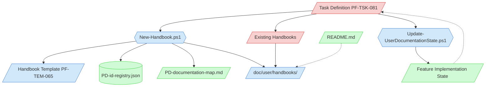

# User Documentation Creation Context Map

This context map provides a visual guide to the components and relationships relevant to the User Documentation Creation task (PF-TSK-081). Use this map to identify which components require attention and how they interact.

## Visual Component Diagram

## Essential Components

### Critical Components (Must Understand)
- **Task Definition (PF-TSK-081)**: The User Documentation Creation task — defines the full process for creating or updating user handbooks
- **Existing Handbooks**: The 4 existing handbooks in `doc/user/handbooks` serve as style and structure reference

### Important Components (Should Understand)
- **New-Handbook.ps1**: Script to create new handbook files with auto-assigned PD-UGD IDs; auto-appends entry to PD-documentation-map.md
- **Update-UserDocumentationState.ps1**: Finalization script that appends a User Handbook row to the feature implementation state file's Documentation Inventory table; use after handbook creation to complete state tracking
- **Handbook Template (PF-TEM-065)**: Template at `templates/07-deployment/handbook-template.md` with optional sections
- **Output Directory**: `doc/user/handbooks` where handbooks are stored

### Reference Components (Access When Needed)
- **Feature Implementation State**: Feature state files that flag "User Documentation: Needed/Created"
- **PD-id-registry.json**: Central registry for PD-UGD ID assignment
- **README.md**: Project README with documentation table that may need updating

## Key Relationships

1. **Task Definition → Existing Handbooks**: Audit existing docs before creating new ones to maintain consistent style
2. **Task Definition → New-Handbook.ps1**: Use script for new handbook creation (never create manually)
3. **New-Handbook.ps1 → Template**: Script creates files from the handbook template
4. **New-Handbook.ps1 → ID Registry**: Script auto-assigns PD-UGD-### IDs
5. **New-Handbook.ps1 → PD-documentation-map.md**: Script auto-appends handbook entry under User Handbooks section
6. **Feature State -.-> Task**: Feature state files trigger the task when they flag user docs as needed
7. **Task Definition → Update-UserDocumentationState.ps1**: Use finalization script after handbook creation to update feature state file
8. **Update-UserDocumentationState.ps1 → Feature State**: Script appends handbook row to Documentation Inventory table in the feature state file

## Implementation in AI Sessions

1. Begin by reading the task definition and understanding the documentation scope
2. Audit existing handbooks for style, structure, and coverage gaps
3. Use `New-Handbook.ps1` to create new handbook files when needed
4. Customize the generated template — remove unused sections, write user-focused content
5. Run `Update-UserDocumentationState.ps1` to append the handbook to the feature state file's Documentation Inventory
6. Update README.md documentation table if the handbook should be listed there

## Related Documentation

- [Task Definition](/process-framework/tasks/07-deployment/user-documentation-creation.md) - Full task process
- [Handbook Template](/process-framework/templates/07-deployment/handbook-template.md) - Template for new handbooks
- [New-Handbook.ps1](/process-framework/scripts/file-creation/07-deployment/New-Handbook.ps1) - Creation script
- [Update-UserDocumentationState.ps1](/process-framework/scripts/update/Update-UserDocumentationState.ps1) - Finalization script for feature state updates
- [Existing Handbooks](/doc/user/handbooks) - Style reference

---
