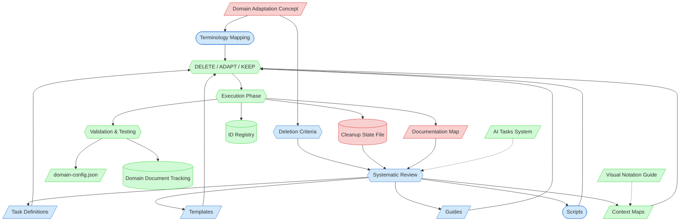

# Framework Domain Adaptation Context Map

This context map provides a visual guide to the components and relationships relevant to the Framework Domain Adaptation task (PF-TSK-080). Use this map to identify which components require attention and how they interact.

## Visual Component Diagram

## Essential Components

### Critical Components (Must Understand)
- **Domain Adaptation Concept**: Project-specific strategy document defining the complete adaptation approach, 3-decision framework (DELETE/ADAPT/KEEP), and domain terminology mapping
- **Cleanup State File**: Temporary state tracking file (created via `New-TempTaskState.ps1`) organizing all framework documents by process flow order with decision tracking columns
- **Documentation Map**: Central index of all framework artifacts (`PF-documentation-map.md`) — starting point for identifying the full document inventory to review

### Important Components (Should Understand)
- **Terminology Mapping**: Source domain to target domain translation table — guides all content adaptations
- **Deletion Criteria**: Rules for classifying documents as DELETE, ADAPT, or KEEP — confirmed with human partner before execution
- **Task Definitions**: Individual task files in `tasks` — reviewed and adapted for target domain terminology and workflows
- **Templates**: Document templates in `templates/` — adapted with domain-specific placeholders and examples
- **Guides**: Process guides in `guides/` — updated with domain-appropriate terminology and references
- **Scripts**: Automation scripts in `scripts` — parameter names, help text, and ValidateSet values adapted for target domain
- **Systematic Review**: Phase 2 process of reviewing all documents in process flow order against the 3-decision framework

### Reference Components (Access When Needed)
- **Context Maps**: Visual component diagrams in `visualization/` — reviewed and adapted alongside their parent tasks
- **Decisions (DELETE/ADAPT/KEEP)**: The classification applied to each document during systematic review
- **Execution Phase**: Phase 3 where deletions, adaptations, and cross-reference updates are performed
- **Validation & Testing**: Phase 4 verifying framework coherence, script functionality, and domain configuration
- **domain-config.json**: Configuration file containing domain-specific values (workflow phases, business domains, validation rules)
- **Domain Document Tracking**: Replacement for feature-tracking.md created for the target domain
- **ID Registry**: PF-id-registry.json — updated with new ID prefixes for target domain document types
- **AI Tasks System**: Task registry and workflow definitions — updated to reflect adapted task set
- **Visual Notation Guide**: Reference for interpreting diagram conventions

## Key Relationships

1. **Concept → Terminology Mapping / Deletion Criteria**: The concept document defines the strategy; terminology mapping and deletion criteria are the operational tools derived from it
2. **Cleanup State + Documentation Map → Systematic Review**: The state file organizes the review; the documentation map provides the complete artifact inventory
3. **Systematic Review → All Artifact Types**: Every framework artifact is reviewed and classified
4. **Artifact Types → DELETE/ADAPT/KEEP Decisions**: Each document receives exactly one classification
5. **Terminology Mapping → Decisions**: Domain translations inform how ADAPT documents are modified
6. **Decisions → Execution**: Classifications drive the concrete changes (file deletions, content adaptations, reference updates)
7. **Execution → State Files**: Cleanup state, documentation map, and ID registry are updated as execution progresses
8. **Execution → Validation**: Adapted framework is validated for coherence, script functionality, and domain configuration correctness

## Adaptation Flow

1. Read and understand Domain Adaptation Concept and framework structure
2. Create or resume Cleanup State File for tracking all documents
3. Review documents in process flow order, classifying each as DELETE/ADAPT/KEEP
4. Present complete classification to human partner for approval
5. Execute deletions (after approval), then adapt documents using terminology mapping
6. For each adaptation: complete changes, test scripts, verify links, propose, get approval
7. Update cross-references, documentation map, and ID registry throughout
8. Validate framework coherence, test core workflows, create domain document tracking
9. Archive temporary state file

## Related Documentation

- [Framework Domain Adaptation Task](/process-framework/tasks/support/framework-domain-adaptation.md) — Task definition for this adaptation process
- [Documentation Map](/process-framework/PF-documentation-map.md) — Central index of all framework artifacts
- [AI Tasks System](/process-framework/ai-tasks.md) — Task registry and workflow definitions
- [Structure Change Task](/process-framework/tasks/support/structure-change-task.md) — Related task for structural reorganization
