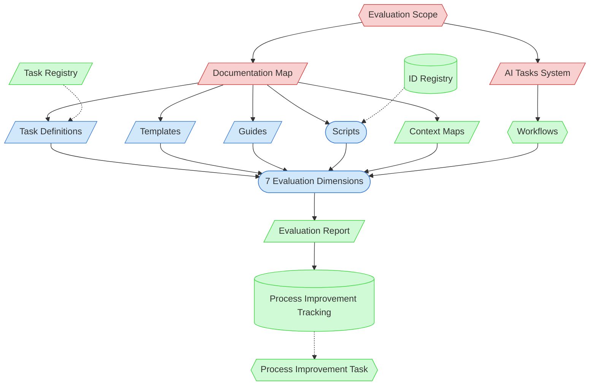

# Framework Evaluation Context Map

This context map provides a visual guide to the components and relationships relevant to the Framework Evaluation task (PF-TSK-079). Use this map to identify which components require attention and how they interact.

## Visual Component Diagram

## Essential Components

### Critical Components (Must Understand)
- **Evaluation Scope**: Human-defined scope — what part of the framework to evaluate (full, phase, component type, workflow, or targeted)
- **Documentation Map**: Central index of all framework artifacts — starting point for completeness checks and inventory
- **AI Tasks System**: Task registry and workflow definitions — authoritative source for task list and routing logic

### Important Components (Should Understand)
- **Task Definitions**: Individual task files in `tasks/` — evaluated for structure, completeness, consistency
- **Templates**: Document templates in `templates/` — evaluated for placeholder conventions, usefulness
- **Guides**: Process guides in `guides/` — evaluated for clarity, redundancy with task definitions
- **Scripts**: Automation scripts in `scripts/` — evaluated for error handling, coverage, consistency
- **7 Evaluation Dimensions**: The assessment criteria (Completeness, Consistency, Redundancy, Accuracy, Effectiveness, Automation Coverage, Scalability)

### Reference Components (Access When Needed)
- **Context Maps**: Visual component diagrams in `visualization/` — checked for presence and accuracy
- **Workflows**: End-to-end task sequences defined in ai-tasks.md — evaluated for executability
- **Evaluation Report**: Output document created via `New-FrameworkEvaluationReport.ps1`
- **Process Improvement Tracking**: State file where IMP entries are registered for follow-up
- **ID Registry**: PF-id-registry.json — checked for accuracy during evaluation
- **Task Registry**: Process framework task registry — automation status reference

## Key Relationships

1. **Scope → Documentation Map / AI Tasks**: Scope defines what to evaluate; these two files are the entry points for identifying artifacts in scope
2. **Artifacts → Dimensions**: All framework artifacts are assessed against the selected evaluation dimensions
3. **Dimensions → Report**: Evaluation findings and scores are captured in the structured report
4. **Report → IMPs**: Actionable findings are registered as improvement entries for follow-up
5. **IMPs -.-> Process Improvement**: IMP entries are addressed via the Process Improvement task (PF-TSK-009)

## Evaluation Flow

1. Define scope with human partner (what to evaluate, which dimensions)
2. Inventory all artifacts in scope using Documentation Map and AI Tasks
3. Evaluate each artifact against each selected dimension
4. Score dimensions and document findings with evidence
5. Generate evaluation report via script
6. Register improvements as IMP entries in Process Improvement Tracking

## Related Documentation

- [Framework Evaluation Task](/process-framework/tasks/support/framework-evaluation.md) — Task definition for this evaluation process
- [Documentation Map](/process-framework/PF-documentation-map.md) — Central index of all framework artifacts
- [AI Tasks System](/process-framework/ai-tasks.md) — Task registry and workflow definitions
- [Process Improvement Tracking](/process-framework/state-tracking/permanent/process-improvement-tracking.md) — Where IMP entries are registered
