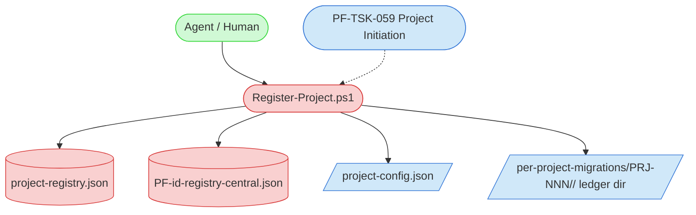
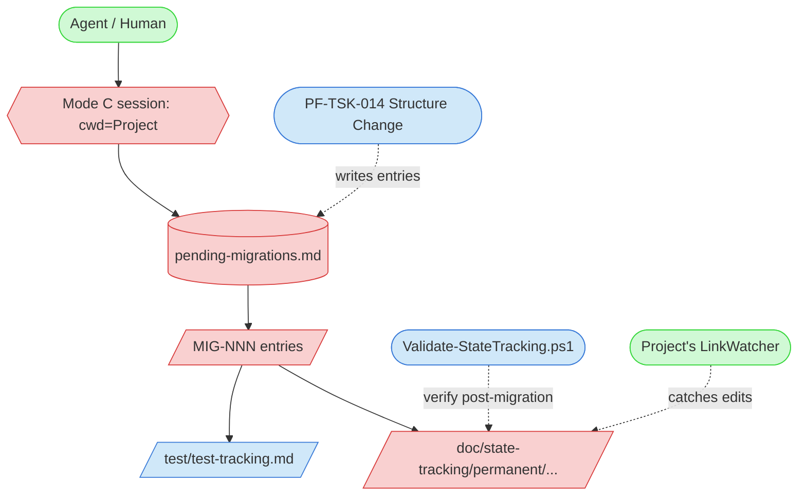
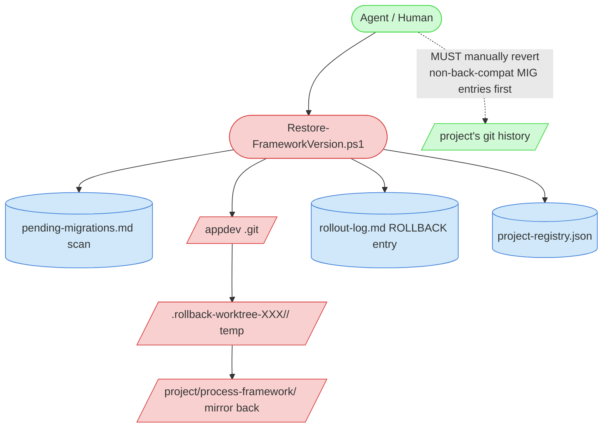
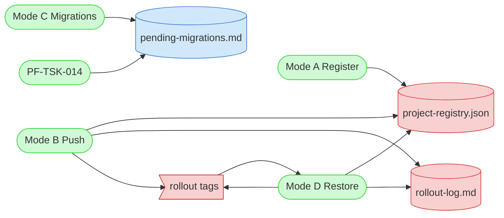

# Framework Rollout Context Map

Visual guide to the components and relationships of the [Framework Rollout Task (PF-TSK-088)](../../../tasks/support/framework-rollout-task.md). Highlights which components are load-bearing for each operating mode (A: Project Registration, B: Phase 1 Push, C: Phase 2 Migrations, D: Rollback). See [Visual Notation Guide](../../../guides/support/visual-notation-guide.md) for symbol semantics.

## Mode-by-Mode Diagrams

The Rollout task has four distinct sub-flows. Each diagram below shows the components active in that mode only.

### Mode A — Project Registration (Retrofit + appdev self)



**Key relationships:**
- `Register-Project.ps1` consumes the next PRJ-NNN from `PF-id-registry-central.json` and increments the counter atomically.
- `project-registry.json` gains a new entry; `<project>/doc/project-config.json` is stamped with the assigned `project_id` (cache for project-side scripts).
- `PF-TSK-059` invokes `Register-Project.ps1` as its final step for new projects (Mode A is **retrofit-only** for existing projects + appdev self via `-IsAppdev`).
- The script creates an empty `pending-migrations.md` skeleton in the new ledger directory (only for non-appdev registrations).

### Mode B — Phase 1 Bulk Push

```mermaid
graph TD
    classDef critical fill:#f9d0d0,stroke:#d83a3a
    classDef important fill:#d0e8f9,stroke:#3a7bd8
    classDef reference fill:#d0f9d5,stroke:#3ad83f
    classDef state fill:#fff4d0,stroke:#d8a83a

    Operator([Agent / Human]) --> PushScript([Push-FrameworkUpdate.ps1])
    PushScript --> AppdevGit[/appdev .git/]
    PushScript --> GithubRemote[\Abtomation/framework-appdev]
    PushScript --> AppdevPF[/appdev/process-framework//]
    PushScript --> ProjectPF[/project/process-framework/ mirror/]
    PushScript --> RolloutLog[(rollout-log.md)]
    PushScript --> CentralRegistry2[(project-registry.json)]
    AppdevGit --> RolloutTag>git tag rollout-VERSION]
    AppdevPF --> AppdevVersion[/.framework-version/]
    ProjectPF --> ProjVersion[/.framework-version/]
    ProjectPF --> ProjPrev[/.framework-version-previous/]
    ProjectPF --> ProjPointer[/.framework-central-pointer/]

    class PushScript,AppdevGit,RolloutTag,ProjectPF critical
    class GithubRemote,AppdevPF,RolloutLog,CentralRegistry2 important
    class AppdevVersion,ProjVersion,ProjPrev,ProjPointer,Operator reference
```

**Key relationships:**
- `Push-FrameworkUpdate.ps1` is the orchestrator. cwd must be appdev (pre-flight check).
- Updates `appdev/process-framework/.framework-version` BEFORE the mirror so each project's mirrored copy carries the correct version stamp.
- Git operations: stage `process-framework/` → commit → tag `rollout-<VERSION>` → push origin main → push tag. GitHub remote push is durability backup; failure is warn-only.
- For each target project: capture prior `.framework-version` (becomes `.framework-version-previous`); robocopy /MIR with /XF preserves per-project files; write `.framework-version-previous` and `.framework-central-pointer` post-mirror.
- Updates `current_framework_version` and `last_rollout` per project in `project-registry.json`.
- Appends rollout entry to `rollout-log.md` (audit trail).

### Mode C — Phase 2 Per-Project Migrations



**Key relationships:**
- Each entry in `pending-migrations.md` is one project working-doc migration written by [PF-TSK-014 Structure Change](../../../tasks/support/structure-change-task.md).
- Mode C runs from cwd=Project — the project's own LinkWatcher catches edits in real-time, project-specific validation scripts run naturally, and the project's IDE workspace context auto-loads.
- Entries have a load-bearing **Rollback Implications** field (per [Pending Migration Entry Template (PF-TEM-079)](../../../templates/support/pending-migration-entry-template.md)) consumed later by Mode D's pre-flight scan.
- One entry per checkpoint is the safe pattern; status updates (Open → Resolved) are append-only.

### Mode D — Rollback



**Key relationships:**
- `Restore-FrameworkVersion.ps1` materializes the rollback target via `git worktree add --detach` (temp checkout at the target tag) — appdev's main working tree is never disturbed.
- Mirror direction is reverse of Push: from temp worktree → project's `process-framework/`. Same robocopy /MIR /XF logic preserves per-project files.
- **Mode D scope is `process-framework/` ONLY.** `<project>/doc/` and `<project>/test/` are NOT touched by this script. Pre-flight scans `pending-migrations.md` for entries with non-backward-compatible **Rollback Implications** between rollback target and current version; operator MUST manually revert those project working-doc edits via the project's git BEFORE running Mode D, or accept schema-mismatched state.
- Temp worktree is removed in a `finally` block (always, even on error).

## Cross-Mode Component Map



**The three durable artifacts** that span all modes:
- `project-registry.json` — written by A and updated by B/D; read by all modes.
- `rollout-log.md` — written by B and D (forward and rollback entries respectively); audit trail for the entire system.
- Git tags `rollout-<VERSION>` in appdev — created by B; consumed by D.

**The per-project ledger** (`pending-migrations.md`) is written by Structure Change (an upstream task) and consumed by Mode C; scanned by Mode D pre-flight.

## Component Inventory

### Critical Components (Must Understand)

- **`project-registry.json`** — Source of truth for projects: ID, path, freeze state, current version, last rollout. Modified by Modes A, B, D.
- **`rollout-log.md`** — Append-only audit history. Modified by Modes B, D.
- **Git tags `rollout-<VERSION>`** — Canonical version snapshots in appdev's git. Created by B; consumed by D.
- **`Push-FrameworkUpdate.ps1`** — Mode B driver. Lives in appdev (`appdev/process-framework-central/scripts/`).
- **`Restore-FrameworkVersion.ps1`** — Mode D driver. Lives in appdev.
- **`Register-Project.ps1`** — Mode A driver (retrofit + `-IsAppdev`); also invoked from PF-TSK-059. Lives in `process-framework/scripts/file-creation/support/` (rolled out to projects).

### Important Components (Should Understand)

- **`pending-migrations.md`** (per-project) — Written by [PF-TSK-014 Structure Change](../../../tasks/support/structure-change-task.md); applied by Mode C; scanned by Mode D pre-flight.
- **`PF-id-registry-central.json`** — Cross-project ID pool; PRJ counter consumed by `Register-Project.ps1`.
- **GitHub remote `Abtomation/framework-appdev`** — Off-machine durability for appdev commits + tags; warn-only on push failure.
- **Per-project `.framework-version`** — Records the rolled version. Written by Push, updated by Restore. Mirrored from appdev (NOT a per-project file in the /XF list).
- **Per-project `.framework-version-previous`** — Default rollback target. Per-project (excluded from mirror via /XF). Written post-mirror.
- **Per-project `.framework-central-pointer`** — Path to appdev. Per-project. Consumed by project-side scripts that need to write to centralized state.

### Reference Components (Access When Needed)

- **[Pending Migration Entry Template (PF-TEM-079)](../../../templates/support/pending-migration-entry-template.md)** — Structure for one entry; load-bearing **Rollback Implications** field.
- **[Framework Rollout Usage Guide (PF-GDE-066)](../../../guides/support/framework-rollout-usage-guide.md)** — Dry-run interpretation, partial-rollout recovery, frozen-project handling.
- **[PF-TSK-014 Structure Change](../../../tasks/support/structure-change-task.md)** — Upstream writer of `pending-migrations.md` entries.
- **[PF-TSK-059 Project Initiation](../../../tasks/00-setup/project-initiation-task.md)** — Owns new-project registration; invokes `Register-Project.ps1` (Mode A is retrofit-only).
- **Project's LinkWatcher** — Catches Mode C edits in real-time; reason Mode C is cwd=Project.
- **`Validate-StateTracking.ps1`** — Verifies post-migration state in Mode C.

## Implementation in AI Sessions

1. **At session start**: identify which mode (A/B/C/D) the human partner needs. Modes are NOT chained within one session.
2. **For Mode B (Push)**: read `rollout-log.md` tail to confirm prior rollout state; run `-Check` first; require explicit approval before real run.
3. **For Mode D (Restore)**: scan `pending-migrations.md` entries between rollback target and current version; flag any non-backward-compatible entries to the human partner BEFORE running the rollback script.
4. **For Mode C (Migrations)**: process one entry per checkpoint; run `Validate-StateTracking.ps1` between entries to catch errors early.
5. **For Mode A (Registration)**: confirm this is retrofit (not a new project — those go through PF-TSK-059); verify PRJ-000 exists in registry first if registering a real project.

## Related Documentation

- [Framework Rollout Task (PF-TSK-088)](../../../tasks/support/framework-rollout-task.md) — Authoritative task definition for all four modes
- [Framework Rollout Usage Guide (PF-GDE-066)](../../../guides/support/framework-rollout-usage-guide.md) — Operational patterns and troubleshooting
- [Pending Migration Entry Template (PF-TEM-079)](../../../templates/support/pending-migration-entry-template.md) — Mode C entry structure
- [Structure Change Task (PF-TSK-014)](../../../tasks/support/structure-change-task.md) — Upstream task that writes ledger entries
- [Project Initiation (PF-TSK-059)](../../../tasks/00-setup/project-initiation-task.md) — New-project registration owner
- [Visual Notation Guide](../../../guides/support/visual-notation-guide.md) — Symbol semantics for diagrams
- [Centralized Framework Management Proposal](../../../../process-framework-central/proposals/centralized-framework-management.md) — Source design (relocated to appdev central in Phase 7.5; will move to `proposals/old/` after migration completes)
