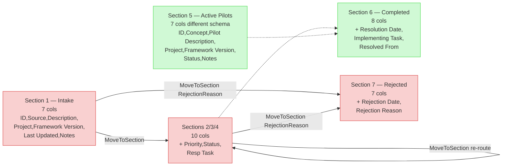

# IMP Triage Context Map

Component relationships and information flow for the [IMP Triage Task (PF-TSK-089)](../../../tasks/support/imp-triage-task.md). Triage sits between [Tools Review (PF-TSK-010)](../../../tasks/support/tools-review-task.md) (which fills the Intake section without routing) and the dispatch tasks ([PF-TSK-009](../../../tasks/support/process-improvement-task.md), [PF-TSK-014](../../../tasks/support/structure-change-task.md), [PF-TSK-026](../../../tasks/support/framework-extension-task.md)). The same helper script is invoked again later by the dispatch tasks for re-routes when scope mismatch is discovered.

## Diagram 1 — Main Workflow

```mermaid
graph TD
    classDef critical fill:#f9d0d0,stroke:#d83a3a
    classDef important fill:#d0e8f9,stroke:#3a7bd8
    classDef reference fill:#d0f9d5,stroke:#3ad83f

    ToolsReview{{Tools Review<br/>PF-TSK-010}}
    TrackingFile[(process-improvement-tracking.md<br/>centralized, 7 sections)]
    Intake[Section 1 — Intake<br/>raw, pre-triage]
    TriageTask{{IMP Triage<br/>PF-TSK-089}}
    Helper([Update-ProcessImprovement.ps1<br/>-MoveToSection]):::critical
    Improvements[Section 2 — Improvements]
    Extensions[Section 3 — Extensions]
    Structural[Section 4 — Structural Changes]
    Rejected[Section 7 — Rejected]
    Registry[(project-registry.json)]
    PFI009{{PF-TSK-009<br/>Process Improvement}}
    PFI014{{PF-TSK-014<br/>Structure Change}}
    PFI026{{PF-TSK-026<br/>Framework Extension}}

    ToolsReview --o--> Intake
    Intake --> TriageTask
    TriageTask --> Helper
    Registry -.-> TriageTask
    Helper --o--> Improvements
    Helper --o--> Extensions
    Helper --o--> Structural
    Helper --o--> Rejected
    Improvements --> PFI009
    Extensions --> PFI026
    Structural --> PFI014

    Intake -.contains.-> TrackingFile
    Improvements -.contains.-> TrackingFile
    Extensions -.contains.-> TrackingFile
    Structural -.contains.-> TrackingFile
    Rejected -.contains.-> TrackingFile

    class TriageTask,Helper,TrackingFile critical
    class Intake,Improvements,Extensions,Structural,Rejected,Registry important
    class ToolsReview,PFI009,PFI014,PFI026,Rejected reference
```

**Read this diagram as**:
1. Tools Review writes raw IMPs into Intake (no classification).
2. The Triage Task reads Intake (and all open sections for cluster detection).
3. Triage classifies and invokes the helper per IMP.
4. Helper moves rows between sections, transforming column schemas as needed.
5. Downstream tasks (PF-TSK-009/014/026) pull from their owned sections.

## Diagram 2 — Re-Route Loop (post-triage)

```mermaid
graph TD
    classDef critical fill:#f9d0d0,stroke:#d83a3a
    classDef important fill:#d0e8f9,stroke:#3a7bd8
    classDef reference fill:#d0f9d5,stroke:#3ad83f

    PFI009{{PF-TSK-009<br/>Process Improvement}}
    PFI014{{PF-TSK-014<br/>Structure Change}}
    PFI026{{PF-TSK-026<br/>Framework Extension}}
    Improvements[Section 2 — Improvements]
    Extensions[Section 3 — Extensions]
    Structural[Section 4 — Structural Changes]
    Rejected[Section 7 — Rejected]
    Helper([Update-ProcessImprovement.ps1<br/>-MoveToSection<br/>-RoutedBy <invoking-task>]):::critical
    Notes[/Notes column<br/>auto-prepended:<br/>'REROUTED YYYY-MM-DD by PF-TSK-NNN: reason'/]

    Improvements --> PFI009
    Extensions --> PFI026
    Structural --> PFI014

    PFI009 -. evaluates scope, .-> Helper
    PFI014 -. evaluates scope, .-> Helper
    PFI026 -. evaluates scope, .-> Helper

    Helper --> Notes
    Helper --o--> Improvements
    Helper --o--> Extensions
    Helper --o--> Structural
    Helper --o--> Rejected

    class Helper,Notes critical
    class PFI009,PFI014,PFI026 important
    class Improvements,Extensions,Structural,Rejected reference
```

**Read this diagram as**:
1. Downstream task picks up an IMP from its owned section and evaluates per its own rubric (e.g., PF-TSK-009 Step 3).
2. If the evaluation concludes scope mismatch, the same helper script is invoked **inline** (no separate Triage session for one re-route).
3. The helper recognizes source ≠ Intake and auto-prepends `[REROUTED YYYY-MM-DD by PF-TSK-NNN: <reason>]` to the Notes column for the audit trail.
4. The IMP lands in its new section; downstream task closes the Step 3 evaluation as "delegated to <new-section-owner>".

## Diagram 3 — Tracking File Section Schemas



**Read this diagram as**:
- Solid arrows are the moves the `-MoveToSection` helper supports (Phase 4).
- Dashed arrows (→ Completed) use the existing `-NewStatus Completed` / `-NewStatus Resolved` paths — not handled by `-MoveToSection`.
- Active Pilots is intentionally outside the Triage flow — pilots are created via `New-ProcessImprovement.ps1 -AsPilot` directly into Section 5, not through Intake.

## Component Inventory

### Critical Components (Must Understand)

- **[IMP Triage Task (PF-TSK-089)](../../../tasks/support/imp-triage-task.md)**: The task being mapped. Drains Intake into destination sections; detects duplicate-topic clusters across open sections and consolidates them.
- **`Update-ProcessImprovement.ps1 -MoveToSection`**: The helper script. Owns column-schema transformation between source and destination sections, the `[REROUTED ...]` audit-trail prefix, and the `-Status` / `-RespTask` defaults per destination section. Same script is invoked by Triage (initial sort) and by downstream tasks (re-routes).
- **Centralized `process-improvement-tracking.md`** (`appdev/process-framework-central/state-tracking/permanent/`): The 7-section tracking file. Cross-project; section schemas differ in width and column meaning.

### Important Components (Should Understand)

- **Intake / Improvements / Extensions / Structural Changes / Rejected sections**: The five sections involved in Triage's normal flow. Active Pilots and Completed are out of scope.
- **`project-registry.json`**: Resolves `PRJ-NNN` → absolute project path for validation-evidence access from cwd=appdev.
- **PF-TSK-009 / PF-TSK-014 / PF-TSK-026**: Downstream consumers. Each owns exactly one of the triaged sections. They invoke the same helper for re-routes when their own evaluation concludes scope mismatch.

### Reference Components (Access When Needed)

- **[Tools Review (PF-TSK-010)](../../../tasks/support/tools-review-task.md)**: Upstream collector. Tools Review post-Phase-7 cutover writes only to Intake — no longer routes.
- **[IMP Triage Usage Guide](../../../guides/support/imp-triage-usage-guide.md)**: Decision criteria, cluster-detection patterns, re-route patterns, troubleshooting.
- **PF-PRO-029 source proposal** (`appdev/process-framework-central/proposals/centralized-framework-management.md` §3.6, §3.7; relocated in Phase 7.5 historical content migration): Design rationale for the 7-section model and the Tools Review → Triage → dispatch workflow.

## Implementation in AI Sessions

1. **At session start**: confirm cwd is `appdev/` (or that `.framework-central-pointer` resolves to appdev from the current cwd). Triage operates against the centralized tracking file.
2. **Read Intake first**, then read the other open sections (Improvements + Extensions + Structural Changes + Active Pilots) once — needed for cluster detection. Skip Completed and Rejected.
3. **For each Intake row**: classify per the [Classification Decision Tree](../../../guides/support/imp-triage-usage-guide.md#classification-decision-tree). When the `Project` column needs validation-evidence access, resolve via `project-registry.json[PRJ-NNN].path`.
4. **Cluster detection**: cross-reference Intake against open sections. Apply the three-signal criterion (same primary read-set + linked decisions + coherent scope) — see [Cluster Detection](../../../guides/support/imp-triage-usage-guide.md#cluster-detection--what-counts-and-what-doesnt). 2-IMP clusters flag with the three-signal analysis (consolidate when all signals are met). 3+-IMP clusters trigger consolidation proposal when signals are met. Tension or contradiction between IMPs targeting the same artifact forces consolidation regardless of count.
5. **Batch-present** all classifications and cluster findings at one checkpoint (Step 7 of the task). Do not present per-IMP — the human partner sees the whole triage in one pass.
6. **Apply approved moves** via `Update-ProcessImprovement.ps1 -MoveToSection` (one invocation per IMP).
7. **Re-routes** are invoked inline by PF-TSK-009/014/026 (not in a Triage session). The helper detects source ≠ Intake and adds the `[REROUTED ...]` Notes prefix automatically.

## Related Documentation

- [IMP Triage Task (PF-TSK-089)](../../../tasks/support/imp-triage-task.md) — Workflow definition.
- [IMP Triage Usage Guide (PF-GDE-067)](../../../guides/support/imp-triage-usage-guide.md) — Decision criteria, worked examples, troubleshooting.
- [Update-ProcessImprovement.ps1](../../../scripts/update/Update-ProcessImprovement.ps1) — Helper script (StatusUpdate + SectionMove parameter sets).
- [Tools Review Task (PF-TSK-010)](../../../tasks/support/tools-review-task.md) — Upstream filler of Intake.
- [Process Improvement (PF-TSK-009)](../../../tasks/support/process-improvement-task.md) — Owns Improvements section; files improvement-origin pilots into Active Pilots (PF-IMP-883).
- [Structure Change (PF-TSK-014)](../../../tasks/support/structure-change-task.md) — Owns Structural Changes section.
- [Framework Extension (PF-TSK-026)](../../../tasks/support/framework-extension-task.md) — Owns Extensions section; files extension-origin pilots into Active Pilots.
- [Visual Notation Guide](../../../guides/support/visual-notation-guide.md) — For diagram interpretation.
