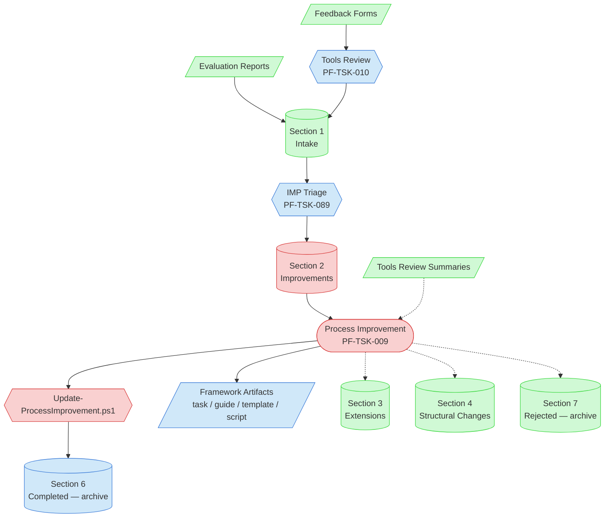

# Process Improvement Context Map

Visual guide to the components and relationships relevant to the [Process Improvement task](../../../tasks/support/process-improvement-task.md). Use this map to understand which artifacts feed the task, what it produces, and where re-routed IMPs go.

## Visual Component Diagram

## Essential Components

### Critical Components (Must Understand)

- **Process Improvement (PF-TSK-009)**: The task itself — executes IMPs from Section 2 of the central tracking
- **Section 2 — Improvements**: Triaged IMPs owned by this task. Single source of work items.
- **Update-ProcessImprovement.ps1**: Driver script for all lifecycle operations — status transitions, completion moves, section re-routing, supersession, fold-in feedback-DB logging

### Important Components (Should Understand)

- **Tools Review (PF-TSK-010)**: Upstream task that reads feedback forms and writes raw IMPs to Section 1 — Intake
- **IMP Triage (PF-TSK-089)**: Sorts Intake into destination sections (Improvements / Extensions / Structural Changes / Rejected / Active Pilots)
- **Framework Artifacts**: The output — modified task definitions, guides, templates, scripts under `blueprint/process-framework/`
- **Section 6 — Completed (archive)**: Where finished IMPs land. Driver script writes to the sibling archive file.

### Reference Components (Access When Needed)

- **Feedback Forms / Evaluation Reports**: Source material that originated the IMPs
- **Tools Review Summaries**: Read at Step 4 to understand source context for the IMP under execution
- **Section 1 — Intake**: Upstream queue (not directly consumed by this task)
- **Sections 3 / 4 / 7**: Re-routing destinations when Step 3 surfaces scope mismatch (Extensions for new framework capability, Structural Changes for reorganization, Rejected for invalid/superseded IMPs). For trigger conditions and the exact `Update-ProcessImprovement.ps1 -MoveToSection ...` mechanism per destination, see the [Routing reference](../../../guides/support/process-improvement-task-reference-guide.md#routing).

## Key Relationships

1. **Improvements → Process Improvement**: The task claims IMPs from Section 2 only. Other sections belong to other tasks.
2. **Process Improvement → Update-ProcessImprovement.ps1**: Every lifecycle operation flows through the driver script (claim, status update, section move, completion, supersession).
3. **Process Improvement → Framework Artifacts**: The direct output is edits to task definitions, guides, templates, or scripts.
4. **Update-ProcessImprovement.ps1 → Section 6 archive**: Completion writes to the sibling archive file, not the live tracking file.
5. **Process Improvement -.-> Sections 3 / 4 / 7**: When Step 3's routing assessment shows the IMP doesn't fit PF-TSK-009 scope, the same driver script re-routes via `-MoveToSection`. The IMP leaves this task's responsibility.
6. **Tools Review Summaries -.-> Process Improvement**: Read at Step 4 to confirm source context; not the primary input.

## Implementation in AI Sessions

1. Claim an IMP from Section 2 via `Update-ProcessImprovement.ps1 -NewStatus InProgress` (Step 1)
2. Verify the problem against current artifact state (Step 2); reject if absent or trivially mis-described
3. Evaluate against the Step 3 criteria; if routing surfaces a mismatch, re-route via the [Routing reference](../../../guides/support/process-improvement-task-reference-guide.md#routing) and stop
4. Present problem + plan at the Step 6 checkpoint; get approval before any execution
5. Execute by risk class (Step 10) — framework-script edits use the medium-risk path with synthetic-harness verification + soak workflow
6. Close via `Update-ProcessImprovement.ps1 -NewStatus Completed -LogToolChanges <json>` (folds Step 12 feedback-DB log into the Step 14 transition)
7. File one feedback form per session covering all IMPs done

## Related Documentation

- [Process Improvement Task Definition](../../../tasks/support/process-improvement-task.md) — the canonical process
- [Process Improvement Task Reference](../../../guides/support/process-improvement-task-reference-guide.md) — flat-lookup tables and conventions consulted at specific task steps
- [Process Improvement Task Implementation Guide](../../../guides/support/process-improvement-task-implementation-guide.md) — worked examples, troubleshooting, gate rationales
- [Process Improvement Tracking](../../../../process-framework-central/state-tracking/permanent/process-improvement-tracking.md) — live IMP sections (1–5)
- [Process Improvement Tracking — Archive](../../../../process-framework-central/state-tracking/permanent/archive/process-improvement-tracking-archive.md) — Sections 6 (Completed) + 7 (Rejected)
- [Tools Review Task](../../../tasks/support/tools-review-task.md) — upstream IMP intake
- [IMP Triage Task](../../../tasks/support/imp-triage-task.md) — Section routing
- [Update-ProcessImprovement.ps1](../../../scripts/update/Update-ProcessImprovement.ps1) — driver script

---
