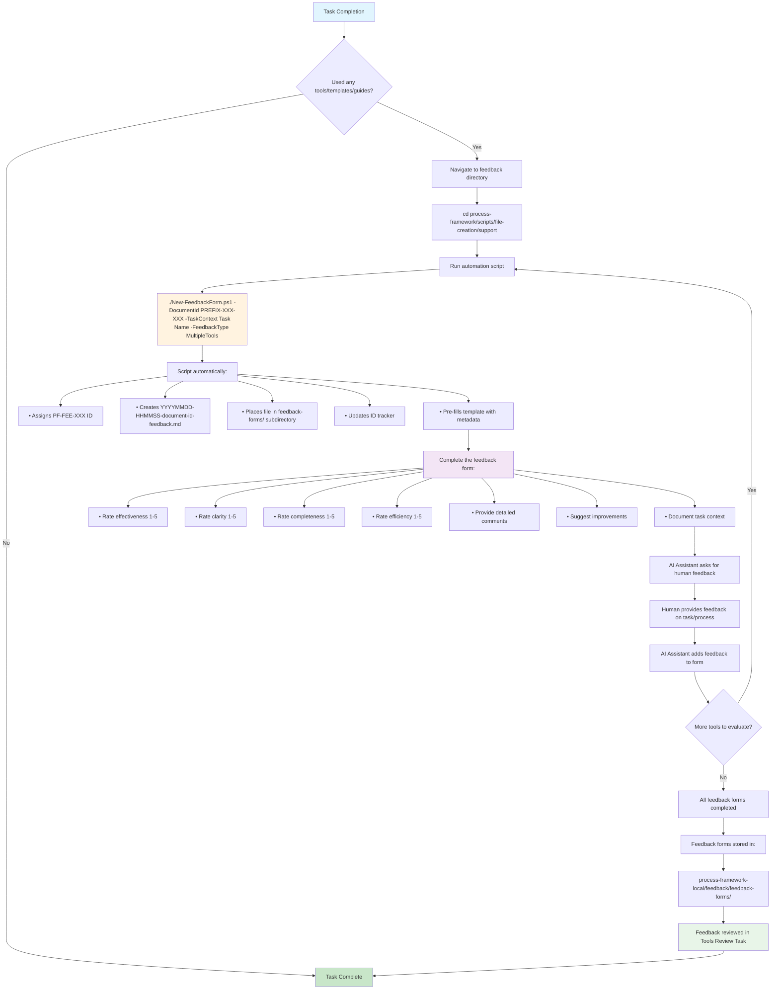

# Feedback Process Flowchart

## Overview

This flowchart illustrates the complete feedback process for tools, templates, and guides used during tasks in the project.

## Process Flow



## Key Points

### Automation Benefits
- **Consistent naming**: Automatic timestamp and document ID formatting
- **Unique IDs**: Prevents ID conflicts with automatic assignment
- **Correct placement**: Files automatically go to the right directory
- **Template pre-filling**: Reduces manual setup time

### File Structure
```
process-framework-local/feedback/
├── archive/                           # Processed forms (by review cycle)
└── feedback-forms/                    # Active feedback files
    ├── YYYYMMDD-HHMMSS-PF-TSK-002-feedback.md
    └── ...
```

ID tracking is managed by `process-framework-local/PF-id-registry-local.json` (prefix `PF-FEE`).

### Naming Convention

- **File name**: `YYYYMMDD-HHMMSS-document-id-feedback.md`
- **Metadata ID**: `PF-FEE-XXX` (automatically assigned by script)

## Integration Points

### Task Definitions
All task definitions include a "Task Completion" section that references this feedback process.

### Tools Review Process
Feedback forms are aggregated and analyzed during the [Tools Review Task](../../tasks/support/tools-review-task.md) for continuous improvement.

### Documentation Map
Individual feedback forms are not tracked in the documentation map - only the README and this flowchart are included.

## Troubleshooting

| Issue | Solution |
|-------|----------|
| Script not found | Run via `pwsh.exe -File process-framework/scripts/file-creation/support/New-FeedbackForm.ps1` |
| ID registry error | Verify `process-framework-local/PF-id-registry-local.json` exists and has a `PF-FEE` prefix entry |
| Template not found | Verify `process-framework/templates/support/feedback-form-template.md` exists |

> For detailed best practices and completion instructions, see the [Feedback Form Guide](../../guides/framework/feedback-form-guide.md).

## Related Documents

- [Feedback Process Guide](../../../process-framework-local/feedback/archive/README.md) - Detailed documentation
- [Feedback Form Template](../../templates/support/feedback-form-template.md) - Template structure
- [Feedback Form Guide](../../guides/framework/feedback-form-guide.md) - Comprehensive completion instructions
- [Tools Review Task](../../tasks/support/tools-review-task.md) - How feedback is used
- [Task Template](../../templates/support/task-template.md) - Standard task completion process
